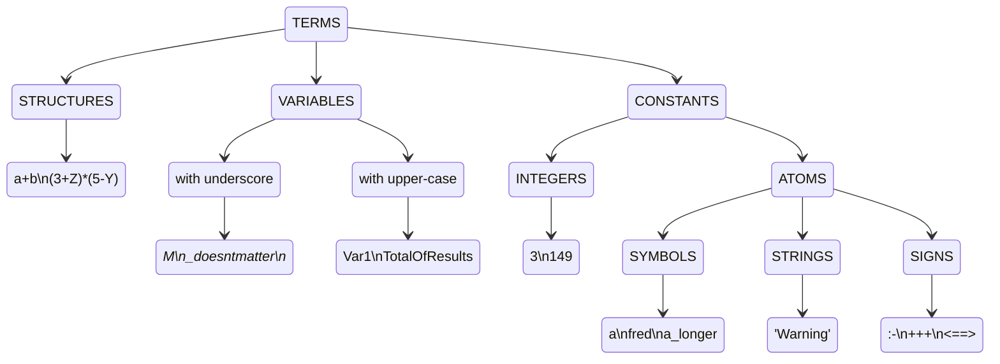

## 简言

**网上教程**：[前言 · Prolog 教程 (zhzluke96.github.io)](https://zhzluke96.github.io/prolog-tut-cn/)

**pdf**： [Prolog Step-by-Step.pdf](..\..\GoodBooks\计算机科学\prolog\Prolog Step-by-Step.pdf) 

**启动Prolog(Swi-prolog)**

1. 打开SWI-Prolog
2. 在cmd中输入swipl（如何需要执行某些文件时比较好用，可以直接索引到当前目录）


**退出Prolog(Swi-prolog)**

输入 `halt.`

**编译程序**

```sh
swipl -o example.exe -c example.pl
```


**在swi-prolog命令行编写规则**

```sh
?- [user].
 |: hello :- format('Hello').
```

编写完规则后，按`ctrl+C`退出，再在命令行中执行规则：

```sh
?- hello.
Hello~n
true.
```


 **在命令行中编辑文件**

```prolog
use_module(library(edit)).
edit("hello.pl").
```

在windows下会默认打开记事本。

**在swi-prolog中编辑文件**

`File`->`New`：新创建文件

`File`->`Edit`：在pce中编辑已存在的文件


## 基础语法

### 打印指令

简单的Prolog命令由一个名称(谓词名称)组成，后面是所涉及的数据项(参数)周围的括号。用于简单打印的Prolog命令是`write().`，注意prolog语句需要以`.`号做结尾。`nl`相当于换行，`tab(3)`空3格。

```cmd
?- write('hello').		
hello
true.
?- write("hello"), nl, write("world").	
hello
world
true.
?- write('hello'), tab(3), write('world').
hello   world
true.
```


### 执行自己的procedures

可以使用`consult(prog1)`来执行procedures，一个简单的procedure有两个主要部分——标题(有时称为“左侧”)和主体(有时称为“右侧”)。标题给出了程序的名称，而主体是命令序列(即一个或多个命令，以`,`分隔，以`.`结束)，标题和主体通过`:-`分隔。

假设有一个文件为 `hello.pl`，文件内容如下

```prolog
hello % 标题
:-		
write('hello,'), tab(2), write('world').	% 主体
```

注意这里的`:-`也可以看成是一个函数，即可以这样表示：
```prolog
':-'(hello, (write('hello,'), tab(2), write('world'))).
```


在存放文件的目录下打开cmd，输入命令

```sh
3 ?- consult('hello.pl').
true.
4 ?- hello.		% 可以直接调用函数
hello,  world
true.
```

调用当前目录下的文件还可以通过下面的方式

```sh
1 ?- [likes].
true.
```

源文件也可以作为`swipl`的参数，如

```sh
swipl likes.pl
```

当文件存放在swi-prolog的安装路径下，如`likes.pl`放在demo文件夹中，则可以通过下面的语句来调用：

```sh
?- [swi(demo/likes)].
true.
```

Prolog中的procedure通常称为**谓词**或者**规则**，后一个名称反映了左边指定如何执行右边的想法。一般来说谓词和procedure意思相近，但是规则往往表示procedure中的一条子句。

假设有一个文件`choice.pl`，内容如下

```prolog
hello(a) :- write('hello a').
hello(b) :- write('hello ab').
hello(c) :- write('hello abc').
```

当使用规则(procedure)时，系统选择其中一个定义并使用它。系统通过搜索为该谓词列出的所有定义(子句)来进行选择，直到找到一个与当前目标匹配的标题(左侧)。(搜索是按照您提供的子句的顺序进行的，从第一个到最后。这在这些非常简单的例子中可能并不明显，但在更复杂的谓词中很快就会变得非常重要。)

```cmd
1 ?- consult('choice.pl').
true.
3 ?- hello(a).
hello a
true.
4 ?- hello(b).
hello ab
true.
5 ?- hello(c).
hello abc
true.
6 ?- hello(d).
false.
```

**注释**：前面已经看到了使用`%`作为注释符，还有`/* */`作为多行或行内注释符。

**shell操作**

当源文件放在其它文件夹内，需要切换目录。

`pwd.`：查看当前目录

`cd("D:").`：切换至指定目录，支持中文，支持类Unix路径（D:/XXX/XXX）或者window（D:\\\XXX\\\XXX），注意`cd("~/").`返回C盘的用户路径，`cd("~/Desktop").`则是返回桌面。

`ls.`：输出当前路径下的文件名集合。

`mv("myfile", "outfile").`：移动（改名）文件

`rm("file").`：删除文件

### 变量

**任何以大写(大写)字母开头的符号都被Prolog视为变量。**

假设有一个文件`greet.pl`，内容为

```prolog
greet(Name) :- write('Hello,'), tab(3), write(Name).
```

```cmd
11 ?- consult("greet.pl").
true.
12 ?- greet("Tom").
Hello,   Tom
true.
```

由于Prolog在尝试查找匹配时从子句的顶部进行搜索，因此在开始时查找适用的子句，而只有在没有其他匹配时才到达末尾的子句。请看下面的例子：

假设`greet2.pl`中的内容为：

```prolog
greet(Name) :- write('Hello,'), tab(3), write(Name).
greet(tom) :- write('tom').
```

由于第一条语句就是带参数的指令，所以不管是tom还是"Tom"都会被第一条语句捕获。

```cmd
18 ?- consult("greet2.pl").
true.
19 ?- greet("Tom").
Hello,   Tom
true.
20 ?- greet(tom).
Hello,   tom
true .	:: 此处的程序并不能直接停止，需要按一下回车键
```


假设`greet3.pl`中的内容为

```prolog
greet(tom) :- write('tom').
greet(Name) :- write('Hello,'), tab(3), write(Name).
```

由于第一条语句就是是不带参数的指令，所以当greet(tom)时会优先匹配到第一条语句，而"tom"会被第二条语句捕获，如果两条语句都无法捕获，就会返回false.。

```cmd
21 ?- consult("greet3.pl").
true.
22 ?- greet(tom).
tom
true .	:: 此处的程序并不能直接停止，需要按一下回车键
23 ?- greet("tom").
Hello,   tom
true.
```

假如这里给出的指令为`greet(Tom).`，注意Tom（大写字母开头）是一个变量。

```cmd
1 ?- consult('greet3.pl').
true.

2 ?- greet(Tom).
tom
Tom = tom
```

这里的输出结果出现暂停，程序询问我们Tom这个变量是否是tom，如果此时我们选择输入`;`或者空格键，第一条语句匹配失败，第二条语句匹配成功，并输出Tom这个变量的值。

```cmd
2 ?- greet(Tom).
tom
Tom = tom ;
Hello,   _9256
true.
```

输入回车键，程序会直接暂停，像这样

```cmd
3 ?- greet(Tom).
tom
Tom = tom .
```

如果输入`?`可以查看各种情况。

`var(X)`当X是一个未初始化的变量为真，否则为假：

```cmd
7 ?- var(X).
true.
8 ?- var(23).
false.
9 ?- X = Y, Y=23, var(X).
false.
```

`nonvar(X)`当X是一个初始化的变量时为真，否则为假：

```cmd
10 ?- nonvar(X).
false.
11 ?- nonvar(23).
true.
```

除此之外，还有`atom(X)`（判断是否是原子），`number(X)`（判断是否是数字），`atomic(X)`（判断是否是数字或者原子）。

```cmd
12 ?- atom(X).
false.
13 ?- atom(apple).
true.
14 ?- atom("apple").
false.
15 ?- atom('apple').
true.
16 ?- atom(var(23)).
false.
```


### 测试

```cmd
2 ?- 5<7.
true.
3 ?- 5>7.
false.
4 ?- 7=7.
true.
```

prolog中有内置运算符`><=`来判断大小

当存在一系列语句时，其中一条语句为假时，整条语句为假，即语句之间是合取的关系

```cmd
5 ?- 3<7,2<4,10<12.
true.
6 ?- 3<7, 4<2, 10<12.
false.
```

`compare.pl`的文件内容为

```prolog
bigger(N,M) :- N < M, write('Bigger number is'), tab(1), write(M).
bigger(N,M) :- N > M, write('Bigger number is'), tab(1), write(N).
bigger(N,M) :- write('The two number is equal').
```

上面一共有三条规则，第一条N<M时，输出M最大，第二条N>M时，输出N最大，第三条直接输出两个数字相等。

```cmd
8 ?- bigger(3,7).
Bigger number is 7
true .
9 ?- bigger(7,3).
Bigger number is 7
true .
10 ?- bigger(7,7).
The two number is equal
true.
```

当输入`bigger(7,7).`，由于两个数字一样大，所以前两条规则都不符合，所以只会输出第三条规则。

`compare1.pl`的文件内容如下

```prolog
larger(N,M,M):- N<M.
larger(N,M,N):- M<N.
larger(N,M,M).
```

当输入`larger(6,6,Result).`，对于第一条规则，将N置为6，M置为6，Result置为M，由于不满足N<M或N>M，所以直接执行最后一条规则，即Result=M=6。输入`larger(8,3,Result).`，对于第一条规则，将N置为8，M置为3，Result置为M，但是N>M，所以不满足条件跳到第二条规则，此时将N置为8，M置为3，Result置为N，满足条件，则Result=N=8。注意此时程序并不会直接停止，而是询问是否需要执行下面的语句，如果输入`;`，表示redo，则会执行最后一条规则，将Result=M=3。

```cmd
2 ?- larger(6,6,Result).
Result = 6.
3 ?- larger(8,3,Result).
Result = 8 .
4 ?- larger(3,8,Result).
Result = 8 .
5 ?- larger(8,3,Result).
Result = 8 ;
Result = 3.
```


### 事实

prolog中的语句可以只有标题部分，如`greet(tom) :-.`或者`greet(tom).`，这些称为事实，即为正确，默认执行为true.。

假设`fact.pl`的文件内容如下

```prolog
greet(tom).
```

```cmd
7 ?- consult("fact.pl").
true.
8 ?- greet(tom).
true.
9 ?- greet(Tom).
Tom = tom.
```

假设`fact.pl`的文件内容如下

```prolog
man(paul).
man(david).
man(peter).
woman(louise).
woman(helen).
woman(mandy).
wifeof(paul, louise).
wifeof(peter, helen).
sonof(paul, peter).
daughterof(peter, mandy).
```

```cmd
10 ?- consult("fact.pl").
true.
11 ?- man(peter).	
true.
12 ?- man(louise).
false.
13 ?- woman(Someone).		::查询哪些人是女性
Someone = louise ;
Someone = helen ;
Someone = mandy.
14 ?- wifeof(paul, Hiswife).	:: 查询paul的妻子
Hiswife = louise.
15 ?- wifeof(Herhusband, louise).
Herhusband = paul.
16 ?- daughterof(Father, mandy).	:: 查询mandy的父亲
Father = peter.
17 ?- sonof(david, Son).		:: david没有儿子
false.
18 ?- cousin(david, Son).
ERROR: Unknown procedure: cousin/2 (DWIM could not correct goal)
```

事实和规则写在一起，如`factrule.pl`的内容如下

```prolog
parentof(Person1, Person2):-daughterof(Person1, Person2).
parentof(Person1, Person2):-sonof(Person1, Person2).
```

这里定义了父母和子女之间的对应关系，注意这里需要同时consult上面的`fact.pl`和这里的`factrule.pl`

```cmd
21 ?- parentof(peter, Child).
Child = mandy .
22 ?- parentof(Parent, Child).	:: 这里查询父母和子女之间的关系，需要用;号来输出更多内容
Parent = peter,
Child = mandy ;
Parent = paul,
Child = peter.
```

当一段程序中既有事实，又有规则时，那么最好将**事实放在规则前面**：

```prolog
person(adam).
person(X) :- person(Y), mother(X, Y).
```

如果输入`person(X)`，那么显然会输出结果`X=adam`，但是当程序写成下面这种形式：:warning:

```prolog
person(X) :- person(Y), mother(X, Y).
person(adam).
```

此时输入`person(X)`，就会出现不断递归，直到堆栈空间溢出。

### 简单跟踪（debug）

`spy(larger)`

```cmd
24 ?- spy(larger).
% Spy point on larger/3
true.
[debug] 25 ?- larger(8, 3, Result).
   Call: (10) larger(8, 3, _5652) ? creep
   Call: (11) 8<3 ? creep
   Fail: (11) 8<3 ? creep
   Redo: (10) larger(8, 3, _5652) ? creep
   Call: (11) 3<8 ? creep
   Exit: (11) 3<8 ? creep
   Exit: (10) larger(8, 3, 8) ? creep
Result = 8 .		:: 此处直接回车
[trace] 26 ?- larger(8, 3, Result).
   Call: (10) larger(8, 3, _1616) ? creep
   Call: (11) 8<3 ? creep
   Fail: (11) 8<3 ? creep
   Redo: (10) larger(8, 3, _1616) ? creep
   Call: (11) 3<8 ? creep
   Exit: (11) 3<8 ? creep
   Exit: (10) larger(8, 3, 8) ? creep
Result = 8 ;	:: 此处输入;
   Redo: (10) larger(8, 3, _1616) ? creep
   Exit: (10) larger(8, 3, 3) ? creep
Result = 3.
```

不想再debug了，可以使用`nospy(larger)`。

在swi-prolog中还有其它与debug相关的指令参见[SWI-Prolog -- Debugging and Tracing Programs](https://www.swi-prolog.org/pldoc/man?section=debugger)。

在**swi-prolog**进入debug模式可以使用`trace.`，退出使用`nodebug.`。

有关Debug的更多内容，如如何设置断点，`trace.`的各种模式等，请参阅：[SWI-Prolog -- Overview of the Debugger](https://www.swi-prolog.org/pldoc/man?section=debugoverview)

### 更详细的回溯

假设`family.pl`中有以下定义

```prolog
grandparent(OldPerson, YoungerPerson):-parentof(OldPerson, Another), parentof(Another, YoungerPerson).
```

```cmd
1 ?- consult("fact.pl").
true.
2 ?- consult("factrule.pl").
true.
3 ?- consult("family.pl").
true.
4 ?- grandparent(GrandDad, mandy).
GrandDad = paul .
5 ?- grandparent(paul, GrandChild).
GrandChild = mandy .
```

当开启`spy`后

```cmd
6 ?- spy(grandparent).
% Spy point on grandparent/2
true.
[debug] 7 ?- grandparent(paul, GrandChild).
   Call: (10) grandparent(paul, _216) ? creep
   Call: (11) parentof(paul, _1434) ? creep
   Call: (12) daughterof(paul, _1434) ? creep
   Fail: (12) daughterof(paul, _1434) ? creep
   Redo: (11) parentof(paul, _1434) ? creep
   Call: (12) sonof(paul, _1434) ? creep
   Exit: (12) sonof(paul, peter) ? creep
   Exit: (11) parentof(paul, peter) ? creep
   Call: (11) parentof(peter, _216) ? creep
   Call: (12) daughterof(peter, _216) ? creep
   Exit: (12) daughterof(peter, mandy) ? creep
   Exit: (11) parentof(peter, mandy) ? creep
   Exit: (10) grandparent(paul, mandy) ? creep
GrandChild = mandy .
```


### 计算

在prolog直接输入`3+4`会直接报错，Prolog通常不把`+`当作表示数字相加的符号。像3 + 4这样的表达式可以看作是一个结构，其中的两个组件(3,4)只是进一步的数据项。

可以这样输入

```prolog
X = 3+4.
```

```cmd
5 ?- V + W = 3 + 4.
V = 3,
W = 4.
```

在上面的例子中，V+M和3+4是两个结构，对应的位置相等，下面是两个更加复杂的例子

```cmd
6 ?- (3+4) * (7+9) = (A + 4) * M.
A = 3,
M = 7+9.
7 ?- (3+4) * (7+9) = (C+D) * (E+F).
C = 3,
D = 4,
E = 7,
F = 9.
```

注意使用的都是变量（大写字母开头）。

prolog可以这样计算数值

```cmd
9 ?- N is 3 + 1.
N = 4.
11 ?- Calculation = (2 * 3) + (5 * 4), Value is Calculation.
Calculation = 2*3+5*4,
Value = 26.
12 ?- Calculation = (2 * 3) + (5 * 4), Value is Calculation + 1.
Calculation = 2*3+5*4,
Value = 27.
23 ?- X is 10//3.   :: 整除
X = 3.
24 ?- X is 10 mod 3.	:: 取余
X = 1.
```

**计算阶乘**  <div id='factorial'> </div>

```prolog
sum(1,1):- !.	% 这里需要!，防止继续递归，与列表不同，当列表为空时，就满足不了条件了，但是这里还可以到负数，不过列表也可以在这里加上!.
sum(X, N):- X1 is X - 1, sum(X1, N1), N is N1 + X.
```

或者

```prolog
sum(0, N, N):- !.
sum(X, N, S):- X1 is X-1, N1 is N + X, sum(X1, N1, S).
```

但是需要注意的是`\+`有时并不会特别效率，如：

```prolog
A:- B, C.
A:-\+B, D.
```

程序可能会试图匹配B两次，如果换成下面，可能会更加有效率

```prolog
A :- B, ! C.
A :- D.
```

### 比较

| 谓词    | 功能     |
| ------- | -------- |
| `>/2`   | 大于     |
| `</2`   | 小于     |
| `=</2`  | 小于等于 |
| `>=/2`  | 大于等于 |
| `=\=/2` | 数值不等 |
| `=:=/2` | 数值相等 |


### 术语和标记



**如果变量只是一个下划线，那么它可以匹配任何东西，并且永远不需要绑定。**

结构是Prolog的重要组成部分。虽然到目前为止仅有的例子是算术表达式，但还有其他的例子，包括内置的和用户定义的。

对于一个谓词，它拥有的参数的数量被称为它的arity，一个有N个参数的谓词被称为“N-ary”谓词。通常的做法不是简单地通过谓词的名称(例如larger，parentof)来引用谓词，而是通过它们的名称与它们的属性配对来引用谓词:larger/3, parentof/2等。其中一个原因是程序可能包含具有相同名称但性质不同的不同谓词。


### 列表

Prolog中常用的数据结构是列表。

```cmd
13 ?- [1, What, 2, X, 3] = [A, b, C, d, E].
What = b,
X = d,
A = 1,
C = 2,
E = 3.
```

可以使用`|`符号来分割列表

```cmd
14 ?- [a,b,c,d] = [X|Y].
X = a,
Y = [b, c, d].
15 ?- [a,b,c,d] = [X|[Z|W]].	:: 注意不能写成 [a,b,c,d] = [X|Z|W].，这样会报错。
X = a,
Z = b,
W = [c, d].
```


### 一般结构

```cmd
17 ?- Theman = person('Dave the Dude', '58 Broadway', 36).
Theman = person('Dave the Dude', '58 Broadway', 36).
18 ?-  person(Name, Address, Age) = person('Dave the Dude', '58 Broadway', 36).
Name = 'Dave the Dude',
Address = '58 Broadway',
Age = 36.
19 ?- person(Someone, _ , 45) = person('Harry the Horse', '42nd and Vine', 45).
Someone = 'Harry the Horse'.
```

将算术运算作为结构，即使用中缀算子

```cmd
20 ?- +(2, *(5, 6)) = 2 + (5 * 6).
true.
21 ?- Result is +(2, *(5, 6)).
Result = 32.
```

列表实际上是一种函子实参结构，列表由一个函子连接在一起，该函子打印为一个简单的点或句号。这个函子将列表中的第一个元素连接到列表的其余部分。

这里的写法似乎不适用于`swi-prolog`...


### 循环

```cmd
?- X = X+1.
?- Y = 1 + Y.
?- B = g(B).
```

当试图打印这些时，打印机将无限循环。对于X = X + 1，什么也看不见，因为打印机一直从X到X再到X，没有找到任何要打印的东西。对于Y = 1+ Y，打印机将打印(1+(1+(1+1+(1+(1+...无限循环，B = g(B)会显示g(g(g(g(g(g(...。

Prolog中的Unfication（即=）是基于形式逻辑中定义良好的数学运算，但在逻辑中这种循环结构是不允许的：适当的逻辑统一有一个检查(发生检查)，以确保变量永远不会与包含它的任何东西统一。Prolog，为了提高效率和作为一种通用的编程语言，省略了这个检查，因此允许使用这些结构。

**Prolog中不推荐使用循环**。

### 输入输出

`read`用于读取用户输入，需要加`.`。

```cmd
2 ?- read(Date).
|: 2023.	:: 输入时需要注意加上.

Date = 2023.
```

**空格**

```prolog
spaces(0) :- !.
spaces(N) :- write(" "), N1 is N-1, spaces(N1).
```

**读取字母**

`get_char`获取字母，注意该函数只会获取一个字母，输入数字也会被认为是字母，且不需要加`.`。

```prolog
8 ?- get_char(X).
|: A

X = 'A'.
```

这段程序的作用是判断用户是否输入了qw或者cv，如果输入了返回no，否则返回yes。

```prolog
check_line(OK) :- get_char(X), rest_line('\n', X, OK).
rest_line(_, '\n', yes) :- !.
rest_line(Last, Current, no) :-
typing_error(Last, Current), get_char(New), rest_line(Current, New, _).
rest_line(_, Current, OK) :- get_char(New), rest_line(Current, New, OK).
typing_error('q', 'w').
typing_error('c', 'v').
```

**输出字母**

`put_char`的作用是输出字符

```cmd
11 ?- put_char('h'), put_char('e'), put_char('l'), put_char('l'), put_char('o').
hello
true.
```

**读入英语句子**

`read_in`的作用是读取输入的句子，并按照英文文法分割成列表。

```cmd
?- read_in(S).
```

该方法在swi-prolog中不支持:warning:。

**读写文件**

```cmd
?- open("myfile.pl", read, X).
X = <stream>(000002528a057130).
?- open("output.pl", write, X).
```

上面的代码只是打开，更加具体的代码为：

```prolog
readfile(File) :- open(File, read, X), code_reading_from(X), close(X).
writefile(File) :- open(File, write, X), code_writing_to(X), close(X).
```

swi-prolog似乎也不支持...


## 进阶内容

### 流程控制

Prolog的内部谓词，如write，nl和tab。

Prolog的内部流程控制示意图如下


上图中左上角的菱形方块表示从`Call`端口进入目标时所进行的处理。它从某谓词的第一个子句开始搜索，如果匹配成功就到`Exit`端口，如果没有找到任何一个子句与目标匹配就转到`Fail`端口。 右下角的方块表示从`Redo`端口进入目标时所进行的处理，从最近一次成功的子句开始向下搜索，如果匹配成功就转到`Exit`端口，如果没有找个更多的子句满足目标就转到`Fail`端口。

 `I/O`谓词的流程控制和上述的不同，它不会改变流程的方向，如果流程从它的左边进入，就会从它的右边流出；而如果从它的右边进入，则会从它的左边流出。


还有一个专门引起回溯的内部谓词`fail/0`，从它的名字不难看出，它的调用永远是失败的。如果`fail/0`从左边得到控制权，则它立即把控制权再传回到左边。它不会从右边得到控制，因为没法通过`fail/0`把控制权传到右侧。它的内部流程控制如下：


之前我们是靠使用`';'`来进入目标的`Redo`端口的，并且变量的值的输出是靠解释器完成的。现在有了上面几个内部谓词，我们就可以靠`I/O`谓词来显示变量的值，靠`fail`谓词来引起自动的回溯。

如在[nani.pl](#nani)中，

```prolog
5 ?- room(X), location(Y, X), write(X), nl, fail.	% 通过write输出变量的值，通过fail自动回溯
kitchen
kitchen
kitchen
office
office
cellar
false.
```

### 数据管理

Prolog的程序就是谓词的数据库，我们通常把这些谓词的子句写入Prolog的程序中的。在运行Prolog时，`解释器`首先把所有的子句调入到内存中。所以这些写在程序中的子句都是固定不变的。那么有没有办法动态地控制内存中的子句呢？Prolog提供了这方面的功能。

`asserta(X)`可以将X当成子句加入到数据库中，如果内存中已经有了下面的几个事实：

```prolog
people(a).
people(b).
people(c).
```

如果运行了`asserta(people(d))`之后，内存中的`people/1`的子句就变成了下面这个样子

```prolog
people(d).
people(a).
people(b).
people(c).
```

`assertz/1`和`asserta/1`的功能类似，只不过它把X子句追加为最后一个子句。

`retract(X)`用于将子句X从动态数据库中删除，这个操作是不可逆的。

swi-prolog中只有通过下面这种方式标记谓词动态修改，才能对谓词进行上述的`assertz/1`、`asserta/1`和`retract`操作。

```prolog
dynamic here/1.
```

如

```prolog
:-dynamic here/1.	% 标记动态的谓词

% ...

move(Place):- 
    retract(here(_)), 	% 删除旧的数据
    asserta(here(Place)).	% 添加新的数据
```

数据库相当于其它程序中的全局变量，在不同的procedure中都能使用。

### 递归

```prolog
is_contain_in(T1, T2) :-	% 检查T1是否在T2中
location(X, T2), 			% 找到在T2中的X
is_contain_in(T1, X).		% 判断T1是否在X中
```

这段代码在查询`is_contain_in(X, office)`时会更快一点，因为将office绑定到了T2上。

```prolog
is_contain_in(T1, T2) :-	% 检查T1是否在T2中
location(T1, X), 			% 找到T1在哪些X中
is_contain_in(X, T2).		% 判断X是否在T2中
```

这段代码在查询`is_contain_in(key, X)`时会更快一点，因为将key绑定到了T1上。

### 结构

下面这段代码定义了一个desk，颜色是brown，长宽高是dimension(6,3,3)，重量是90。

```prolog
object(desk, brown, dimension(6,3,3), 90).
```

这个object可以直接作为参数使用

```prolog
location_s(object(desk, brown, dimension(6,3,3), 90), office).
```

查询时可以使用

```prolog
location_s(object(X, Color, Size, Weight), office).	% 这里的X, Color, Size, Weight均会被绑定值。
```

### 列表 

使用列表将多个参数一次性传给谓词。

```prolog
loc_list([apple, broccoli, crackers], kitchen).	% 将[apple, broccoli, crackers]放在kitchen。
loc_list([], hall).		% hall中没有物体。
```

**遍历列表**

假设`list.pl`的内容如下

```prolog
loc_list([apple, broccoli, crackers], kitchen).
find(X):-
[Y|W] = X, write(Y),tab(2) , find(W).
```

输入`loc_list(X, kitchen), find(X).`，可以得到下面的输出

```cmd
17 ?- loc_list(X, kitchen), find(X).
apple  broccoli  crackers
false.
```

还有另外一种写法，这种写法似乎更加正确

```prolog
loc_list([apple, broccoli, crackers], kitchen).
find([H|T]):-
write(H),tab(2) , find(T).
find([]).
```

```cmd
19 ?- loc_list(X, kitchen), find(X).
apple  broccoli  crackers
X = [apple, broccoli, crackers].
```

**查找一个元素是否在列表中**

```prolog
member(H,[H|T]).	% X是否是H
member(X,[H|T]) :-	% 如果X不是H，那么判断是否在T中
    member(X,T).
```

或者使用`_`匹配任意值

```prolog
member(X, [X|_]).
member(X, [_|Y]) :- member(X, Y).
```

**判断是否是列表**

```prolog
islist(A|B) :- islist(B).
islist([]).
```

另外一种写法，在针对单个变量时不会再进入循环，不过稳定性不是特别的好。

```prolog
weak_islist([_|_]).
weak_islist([]).
```

**在列表中增加元素**

```prolog
append([],X,X). 
append([H|T1],X,[H|T2]) :- append(T1,X,T2).
```

当输入 `append([a,b,c],[d,e,f],Z)`时，H绑定[a]，T1绑定[b, c]，X绑定[d,e,f]，Z绑定 [a,T2]；之后输入`append(T1, X, T2)`，此时H绑定[b]，T1绑定[c]，X绑定[d,e,f]，T2绑定[b,T2]，即Z绑定[a,b,T2]；继续输入`append(T1, X, T2)`，此时H绑定[c]，T1为[]，X绑定[d,e,f]，T2绑定[c, T2]，即Z绑定[a,b,c,T2]；再进行输入时，由于T1为[]，X绑定[d,e,f]，T2绑定X，也是[d,e,f]，因此回溯后Z绑定[a,b,c,d,e,f]。

**将多条事实转为列表**

使用swi-prolog提供的内部谓词`findall`

```cmd
26 ?- findall(X, room(X), L).	% 查找所有的房间，并作为列表返回
L = [kitchen, office, hall, 'dining room', cellar].
```

```cmd
?- findall(foodat(X,Y), (location(X,Y) , edible(X)), L).
L = [foodat(apple, kitchen), foodat(crackers, kitchen)]
```

**列表长度**

```prolog
lenoflist([A|B], Len, N) :- Len1 is Len+1, lenoflist(B, Len1, N).
lenoflist([], N, N).
```

在命令行中输入`lenoflist([a,b,c], 0, N).`，输出为

```cmd
11 ?- lenoflist([a,b,c], 0, N).
N = 3.
```


### 映射

对于一个prolog结构，如果我们想要构造一个新结构类似它，但是有些不同，可以使用**映射**。

假设我们现在要做的转化为：

```prolog
change(you, i).
change(are, [am, not]).
change(french, german).
change(do, no).
change(X, X).  /* match remain condition */
alter([],[]).
alter([H|T], [X|Y]) :- change(H, X), alter(T,Y).
```

输入`alter([you, are, a, computer], Z).`，输出为：

```cmd
8 ?- alter([you, are, a, computer], Z).
Z = [i, [am, not], a, computer] ;
Z = [i, are, a, computer] ;
Z = [you, [am, not], a, computer] ;
Z = [you, are, a, computer].
```

可以看到有多余的输出，可以考虑使用截断来终止回溯，将最后一句改为：

```prolog
alter([H|T], [X|Y]) :- change(H, X), ! alter(T,Y).
alter([H|T], [X|Y]) :- change(H, X), alter(T,Y), !. % 或者这一句
```


### 操作符

可以使用内部谓词`op/3`来定义操作符，它的三个参数分别是：优先权、结合性、操作符名称。

```prolog
is_in(apple, room(kitchen)).	%定义事实
op(35, xfx, is_in).		 % 将谓词转为操作符，xfx表示中缀，35表示优先级
```

可以有如下操作

```cmd
?- apple is_in X. 
X = room(kitchen)
?- X is_in room(kitchen).
X = apple
```

同样可以使用操作符来定义事实。

```prolog
banana is_in room(kitchen).
```

通过`display/1`可以看到

```cmd
?- display(banana is_in room(kitchen)). 
is_in(banana, room(kitchen))
```

fx表示前缀，如

```cmd
?- op(33,fx,room). 
?- room kitchen = room(kitchen). 	% 使用前缀方式定义事实
yes 
?- apple is_in X. 
X = room kitchen
```

xf表示后缀，如

```cmd
?- op(33,xf,turned_on).
flashlight turned_on. 
?- turned_on(flashlight) = flashlight turned_on. 
yes
```

使用操作符能让程序更易读，但是需要考虑操作符之间优先度的问题。

### 截断

并不是所有的回溯都是必需的，因此prolog提供了完成这一功能的谓词，叫做`cut`，用符号`!`表示。`Cut`能够有效地剔除一些多余的搜索。如果在`cut`处产生回溯，它会自动地失败，而不去进行其它的选择。

为了说明`cut`的作用，首先加入几条事实：

```prolog
data(one). 
data(two).
data(three).
```

这是没有使用`cut`的情况：

```prolog
cut_test_a(X) :-
    data(X). 
cut_test_a('last clause').
```

下面是对上面的事实与规则的一次询问。

```prolog
?- cut_test_a(X), write(X), nl, fail. 
one
two
three 
last clause
false.
```

如果使用了`cut`，那么只会输出一个

```prolog
cut_test_b(X) :-
    data(X), !. 
cut_test_b('last clause').
```

```cmd
?- cut_test_b(X), write(X), nl, fail. 
one
```

下面我们看看把`cut`放到两个子目标中的情况。

```prolog
cut_test_c(X,Y) :-
    data(X), !, data(Y). 
cut_test_c('last clause').
```

```cmd
?- cut_test_c(X,Y), write(X-Y), nl, fail.
one - one 
one - two 
one - three 
no
```

`cut`抑制了其左边的子目标`data(X)`与`cut_test_c`父目标的回溯，而它右边的目标`data(Y)`则不受影响。

不使用`cut`符号，还可以考虑使用`not`这个内部谓词，下面这两条语句执行了相同的功能

```prolog
puzzle(goto(cellar)):-
    have(flashlight),
    turned_on(flashlight),
    !, fail.	% 使用 ! 使其不去回溯下面的puzzle子句

puzzle(_).

```

```prolog
puzzle(goto(cellar)):- 
    not(have(flashlight)), 
    not(turned_on(flashlight)),
    vwrite('It's dark and you are afraid of the dark. '),
    fail. 
puzzle(X):-
    not(X = goto(cellar)).

```

值得注意的是，not谓词本身可以通过cut来定义

```prolog
not(X) :-
    call(X), !, fail.	% call也是一个内部谓词
not(X).
```


注意相比`!`，用`\+`是一个更好的习惯，`\+`是prolog内置的谓词，`\+X`表示只有当X作为prolog目标失败时，目标`\+X`才会成功，所以`\+X`意味着“X作为prolog目标是不能满足的”。可以将[阶乘](#factorial)的例子改写为

```prolog
sum(1, 1).
sum(X, N) :- \+(X=1), X1 is X-1, sum(X1, N1), N = N1+X.
```

或者

```prolog
sum(X, 1) :- X =< 1.
sum(X, N) :- \+(X =< 1), X1 is X-1, sum(X1, N1), N = N1+X.
```

事实上可以将`\+(N=1)`换成`N\=1`，`\+(X =< 1)`换成`X > 1`。


### 指令循环

`repeat`

```prolog
command_loop:- 
    repeat,
    write('Enter command (end to exit): '),
    read(X),
    write(X), nl,
    X = end.
```

只有当输入end，X绑定end后，X=end时成功，而`repeat/0`在回溯时将永远成功，所以这种结构能够让中间的目标可以重复执行。

下面再看`do/1`，这里的多条语句和do case结构类似。

```prolog
do(goto(X)):-
    goto(X),!.
do(go(X)):-
    goto(X),!.
do(inventory):-
    inventory,!.
do(look):-
    look,!.
```

此处的`cut`有两个用途。第一，如果我们找到了一条该执行的do子句，就没有必要去寻找更多的do子句了；第二，它有效地防止了在回溯时又重新运行`read`目标。

递归有两种类型。在真正的递归程序中，每一层必须使用下一层调用返回的信息。这意味着Prolog必须建立堆栈来储存每一层的信息。

这与重复操作是不同的，在通常的语言中，我们一般使用的是重复操作。重复操作只需要把信息传递下去就行了，而不需要保存每一次调用的信息。我们可以使用递归来实现重复，这种递归就叫做尾递归。它的通常的形式是递归语句在最后，每一层的计算不需要使用下一层的返回信息，所以在这种情况下，好的Prolog解释器不需要使用堆栈。

下面是一个尾递归的例子

```prolog
factorial_2(1,F,F).
factorial_2(N,T,F):-
    N > 1,
    TT is N*T,
    NN is N - 1,
    factorial_2(NN,TT,F).
```

翻转列表

```prolog
reverse([], Rev, Rev).
reverse([H|T], Temp, Rev) :-
    reverse(T, [H|Temp], Rev).

```

### 内置库

swi-prolog中有许多内置的库，详见[library (swi-prolog.org)](https://www.swi-prolog.org/pldoc/doc/_SWI_/library/index.html)。

如`lists.pl`中包含了大量的列表操作函数，如`append/3`，`member/2`等，对于一个函数（谓词），可以使用`listing`来给出它的用法，如

```cmd
13 ?- listing(reverse).
lists:reverse(Xs, Ys) :-
    reverse(Xs, Ys, [], Ys).

lists:reverse([], [], Ys, Ys).
lists:reverse([X|Xs], [_|Bound], Rs, Ys) :-
    reverse(Xs, Bound, [X|Rs], Ys).

true.
```

## 例子

### 汉诺塔问题

代码：

```prolog
move(1, Start, End, Middle) :-
write("from "), write(Start), write(" to "), write(End), nl.
move(N, Start, End, Middle) :-
N > 1,  % when N > 1
M is N-1,
move(M, Start, Middle, End),    % move N-1 disk from Start to Middle
move(1, Start, End, Middle),    % move the last disk from Start to End
move(M, Middle, End, Start).    % move N-1 disk from Middle to End
```

运行结果：

```cmd
8 ?- move(3, 'S', 'E', 'M').
from S to E
from S to M
from E to M
from S to E
from M to S
from M to E
from S to E
true .
```


### 寻找Nani


我们从定义基本的事实开始，这些事实是本游戏的基本的数据库。它们包括：<div id='nani'></div>

- 房间和它们的联系
- 物体和它们的位置
- 物体的属性
- 玩家在游戏开始时的位置

使用`room/1`谓词定义房间

```prolog
room(kitchen). 
room(office). 
room(hall). 
room('dining room'). 
room(cellar).
```

我们使用具有两个参数的谓词`location/2`来定义物体的位置。第一个参数代表物体的名称，第二个参数表示物体的位置。开始时，我们加入如下的物体。

```prolog
location(desk, office).
location(apple, kitchen).
location(flashlight, desk).
location('washing machine', cellar). 
location(nani, 'washing machine').
location(broccoli, kitchen). 
location(crackers, kitchen).
location(computer, office).

```

定义一个单向门 `door/1`

```prolog
door(office, hall). 
door(kitchen, office).
door(hall, 'dining room'). 
door(kitchen, cellar).
door('dining room', kitchen).
```

通过`connect/2`来使门变成双向

```prolog
connect(X,Y) :- door(X, Y).
connect(X,Y) :- door(Y, X).
```

定义物体属性

```prolog
edible(apple). 
edible(crackers). 
tastes_yucky(broccoli).
```

最后，定义手电筒（由于是晚上，玩家必须想找到手电筒，并打开它才能到那些关了灯的房间）的状态和玩家的初始位置。

```prolog
turned_off(flashlight).
here(kitchen).
```


### 图灵完备

如何证明一个语言是否图灵完备，用这个语言实现一个图灵机应该就是最直接的方法了

用prolog实现图灵机： [turing.pl](..\..\GoodBooks\计算机科学\prolog\codes\turing.pl) 


### 寻找迷宫


为了解决门是双向的问题，我们可以选择重新写一次上面的事实，然后更换参数即可，或者可以在程序表示每个门可以从两边走。

考虑一个函数`go(X,Y,T)`，如果能从X走到Y便是成功，第三个参数T是已经访问过的房间。

边界条件是我们从X走到Y（X=Y），可以表示为：

```prolog
go(X,X,T).
```

如果选择一个相邻的房间，称为Z，并且观察是否我们已经到过Z，如果没有，就到Z，并将Z加入到T中，可以表示为：

```prolog
go(X,Y,T) :- d(X,Z), \+member(Z,T), go(Z,Y,[Z|T]).
```

这里一共有三种可能的失败情况，第一，X没有路到其它地方；第二，选择的门已经到过了；第三不能从Z到Y即进行不下去了。这代表我们需要回溯来寻找一个新门。

为了表示门可以从两边打开，可以加入下面的语句：

```prolog
go(X,Y,T) :- d(Z,X), \+member(Z,T), go(Z,Y,[Z|T]).
```

或者通过`;`来结合这两段语句：

```prolog
go(X,X,T).
go(X,Y,T) :- (d(X,Z); d(Z,X)), \+member(Z,T), go(Z,Y,[Z|T]).
```

