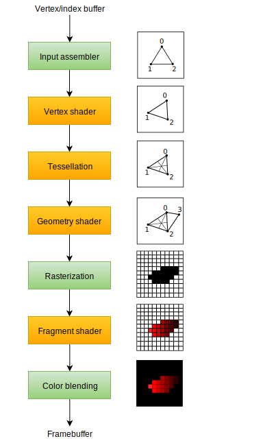

[Khronos Vulkan® 教程 :: Vulkan 文档项目](https://docs.vulkan.net.cn/tutorial/latest/00_Introduction.html)

## 开发环境

1. 下载 Vulkan SDK
2. 下载 GLFW [Download | GLFW](https://www.glfw.org/download.html)，该库可以创建支持Windows、Linux和MacOS的窗口
3. 下载GLM [Releases · brackeen/glfm](https://github.com/brackeen/glfm/releases)，该库是一个线性代数运算库

编译器选择Visual Studio，启动 Visual Studio 创建一个控制台应用程序，并且添加 `main.cpp`

设置头文件和链接路径，首先是 C/C++  -> General -> Additional Include Directories，添加Vulkan、GLFW和GLM的头文件目录
```
E:\glm_glfw\glm
E:\glm_glfw\glfw-3.4.bin.WIN64\include
E:\VulkanSDK\Include\vk_video
E:\VulkanSDK\Include
```

在 Linker -> General -> Additional Library Directories，添加链接目录

```
E:\glm_glfw\glfw-3.4.bin.WIN64\lib-vc2022
E:\VulkanSDK\Lib
```

然后在 Linker -> Input -> Additional Dependencies，添加需要用到的链接

```
vulkan-1.lib
glfw3.lib
```

最后可能需要将编译器更改为支持C++ 17功能，具体为在 C/C++ -> Language -> C++ Language Standard 中更改

创建一个窗口的代码如下

```c++
#define GLFW_INCLUDE_VULKAN
#include <GLFW/glfw3.h>

#define GLM_FORCE_DEPTH_ZERO_TO_ONE
#include <vec4.hpp>
#include <mat4x4.hpp>

#include <iostream>
#include <vulkan/vulkan.h>

int main() {
    glfwInit();

    glfwWindowHint(GLFW_CLIENT_API, GLFW_NO_API);
    GLFWwindow* window = glfwCreateWindow(800, 600, "Vulkan window", nullptr, nullptr);

    uint32_t extensionCount = 0;
    vkEnumerateInstanceExtensionProperties(nullptr, &extensionCount, nullptr);

    std::cout << extensionCount << " extensions supported\n";

    glm::mat4 matrix;
    glm::vec4 vec;
    auto test = matrix * vec;

    while (!glfwWindowShouldClose(window)) {
        glfwPollEvents();
    }

    glfwDestroyWindow(window);

    glfwTerminate();

    return 0;
}
```


## 绘制三角形

### 设置


#### 基础代码


为了能够渲染三角形，需要引入 `<vulkan/vulkan.h>`，为了能够显示窗口需要引入 `GLFW/glfw3.h`

首先初始化窗口（`initWindow`），`initWindow` 函数的代码如下

```c++
GLFWwindow* window;

void initWindow() {
	glfwInit();   // 初始化 GLFW 库
	// GLFW 最初设计用于创建 OpenGL 上下文，所以我们需要告诉它不要使用后续调用来创建 OpenGL 上下文
	glfwWindowHint(GLFW_CLIENT_API, GLFW_NO_API); 
	glfwWindowHint(GLFW_RESIZABLE, GLFW_FALSE);  // 设置窗口
	window = glfwCreateWindow(800, 600, "hello triangle", nullptr, nullptr);  // 创建窗口
} 
```

窗口需要不断运行 `mainLoop`

```c++
void mainLoop() {
	// 持续运行窗口，直到用户关闭窗口
	while (!glfwWindowShouldClose(window)) {
		glfwPollEvents();
	}
}
```

销毁窗口 `cleanup`

```c++
void cleanup() {
	// 销毁窗口，清理资源
	glfwDestroyWindow(window);
	glfwTerminate();
}
```


代码见 [00_base_code.cpp](codes/vulkan/00_base_code.cpp)


#### 实例

创建实例（`createInstance`）来初始化Vulkan库，实例是应用程序和Vulkan库之间的连接

```c++
VkInstance instance;
void createInstance() {
	VkApplicationInfo appInfo{};  // 创建结构体传递信息
	appInfo.sType = VK_STRUCTURE_TYPE_APPLICATION_INFO;
	appInfo.pApplicationName = "Hello Triangle";
	appInfo.applicationVersion = VK_MAKE_VERSION(1, 0, 0);
	appInfo.pEngineName = "No Engine";
	appInfo.engineVersion = VK_MAKE_VERSION(1, 0, 0);
	appInfo.apiVersion = VK_API_VERSION_1_0;

	VkInstanceCreateInfo createInfo{};  // 告诉 Vulkan 驱动程序我们想要使用哪些全局扩展和验证层
	createInfo.sType = VK_STRUCTURE_TYPE_INSTANCE_CREATE_INFO;
	createInfo.pApplicationInfo = &appInfo;
	uint32_t glfwExtensionCount = 0;
	const char** glfwExtensions;

	glfwExtensions = glfwGetRequiredInstanceExtensions(&glfwExtensionCount);

	createInfo.enabledExtensionCount = glfwExtensionCount;
	createInfo.ppEnabledExtensionNames = glfwExtensions;
	createInfo.enabledLayerCount = 0;

	// 可以开始创建实例
	// 参数为 指向包含创建信息的结构体指针 &createInfo
	// 指向自定义分配器回调的指针，nullptr
	// 指向存储新对象句柄的变量指针，&instance
	if (vkCreateInstance(&createInfo, nullptr, &instance) != VK_SUCCESS) {
		throw std::runtime_error("failed to create instance!");
	}
}
```

判断某个扩展是否支持 [实例 :: Vulkan 文档项目](https://docs.vulkan.net.cn/tutorial/latest/03_Drawing_a_triangle/00_Setup/01_Instance.html#_checking_for_extension_support)

最后还需要清理实例

```c++
void cleanup() {
	vkDestroyInstance(instance, nullptr);
	// ...
}
```

代码见 [01_instance_creation.cpp](codes/vulkan/01_instance_creation.cpp)

#### 验证层

Vulkan API 的设计理念是最小化驱动程序开销，而这一目标的体现之一是默认情况下 API 中的错误检查非常有限。即使是像将枚举设置为不正确的值或将空指针传递给必需参数这样简单的错误，通常也不会显式处理，只会导致崩溃或未定义的行为。因为 Vulkan 要求您对所做的每一件事都非常明确，所以很容易犯许多小错误，例如使用新的 GPU 功能，但忘记在创建逻辑设备时请求它。

但是，这并不意味着这些检查不能添加到 API 中。Vulkan 引入了一个优雅的系统，称为_验证层_。验证层是可选组件，它们会挂接到 Vulkan 函数调用中以应用其他操作。验证层中的常见操作是

- 对照规范检查参数的值，以检测滥用
    
- 跟踪对象的创建和销毁，以查找资源泄漏
    
- 通过跟踪调用来源的线程来检查线程安全性
    
- 将每个调用及其参数记录到标准输出
    
- 跟踪 Vulkan 调用以进行分析和重放

让我们首先向程序添加两个配置变量，以指定要启用的层以及是否启用它们。我选择根据程序是否在调试模式下编译来确定该值。`NDEBUG` 宏是 C++ 标准的一部分，表示“非调试”。

```c++
#include <vector>

const std::vector<const char*> validationLayers = {
	"VK_LAYER_KHRONOS_validation"
};

#ifdef NDEBUG
const bool enableValidationLayers = false;
#else
const bool enableValidationLayers = true;
#endif
```

然后添加新函数 `checkValidationLayerSupport` 检查验证层是否可用，具体的方法是先列出所有的可用层，判断 `validationLayers` 中的所有层是否都在可用层之中。

```c++
bool checkValidationLayersSupport() {
	// 获取所有的可用层
	uint32_t layerCount;
	vkEnumerateInstanceLayerProperties(&layerCount, nullptr);

	std::vector<VkLayerProperties> availabelLayers(layerCount);
	vkEnumerateInstanceLayerProperties(&layerCount, availabelLayers.data());

	// 检查validationLayers 中的所有层是否存在于 availableLayers 列表中
	for (const char* layerName : validationLayers) {
		bool layerFound = false;

		for (const auto& layerProperties : availabelLayers) {
			if (strcmp(layerName, layerProperties.layerName))
			{
				layerFound = true;
			}
		}
		if (!layerFound) { return false; }
	}
	return true;
}
```

验证层需要在实例创建时加入，首先调用checkValidationLayersSupport函数，然后修改 `VkInstanceCreateInfo` 结构体实例化，以在启用验证层时包含验证层名称

```c++
void createInstance() {
	if (enableValidationLayers && !checkValidationLayersSupport())
	{
		throw std::runtime_error("validation layers requested, but not support");
	}
	// ...
	if (enableValidationLayers) {
		createInfo.enabledLayerCount = static_cast<uint32_t>(validationLayers.size());
		createInfo.ppEnabledLayerNames = validationLayers.data();
	}
	else {
		createInfo.enabledLayerCount = 0;
	}
	// ...
}
```

验证层默认将调试消息打印到标准输出，但也可以通过在程序中提供显式回调来处理消息。详细请见 [验证层 :: Vulkan 文档项目](https://docs.vulkan.net.cn/tutorial/latest/03_Drawing_a_triangle/00_Setup/02_Validation_layers.html#_message_callback)

代码见 [02_validation_layers.cpp](codes/vulkan/02_validation_layers.cpp)

#### 物理设备和队列族

通过 VkInstance 初始化 Vulkan 库后，我们需要查找并选择系统中支持我们所需功能的显卡。 实际上，我们可以选择任意数量的显卡并同时使用它们，但在本教程中，我们将只选择第一块满足我们需求的显卡。

添加一个函数 `pickPhysicalDevice`，用于选择显卡，先确定有哪些可用显卡，再评估每个设备，检查该设备是否可以执行操作。

```c++
bool isDeviceSuitable(VkPhysicalDevice device) {  // 可以直接返回True
	VkPhysicalDeviceProperties deviceProperties;
	VkPhysicalDeviceFeatures deviceFeatures;
	vkGetPhysicalDeviceProperties(device, &deviceProperties);
	vkGetPhysicalDeviceFeatures(device, &deviceFeatures);

	return deviceProperties.deviceType == VK_PHYSICAL_DEVICE_TYPE_DISCRETE_GPU &&
		deviceFeatures.geometryShader;
}

void pickPhysicalDevice() {
	uint32_t deviceCount = 0;
	vkEnumeratePhysicalDevices(instance, &deviceCount, nullptr);

	if (deviceCount == 0) {
		throw std::runtime_error("failed to find devices which support vulkan");
	}

	std::vector<VkPhysicalDevice> devices(deviceCount);
	vkEnumeratePhysicalDevices(instance, &deviceCount, devices.data());
	// 检查设备是否可用
	for (const auto& device : devices) {
		if (isDeviceSuitable(device))
		{
			physicalDevice = device;
			break;
		}
	}
}
```


Vulkan 中几乎每个操作，从绘制到上传纹理，都需要将命令提交到队列。有不同类型的队列来自不同的队列族，并且每个队列族只允许命令的一个子集。例如，可能有一个队列族只允许处理计算命令，或者一个只允许与内存传输相关的命令。

我们需要检查设备支持哪些队列族，以及其中哪些队列族支持我们要使用的命令。为此，我们将添加一个新函数 `findQueueFamilies` 来查找我们需要的所有队列族。

队列族可能会有很多个，因此通过一个结构体来管理所有的队列，队列族并不是必需的，所以需要区分是否包含某个队列，C++ 17引入了 optional 包装器来确定某个变量是否被赋值

```c++
#include <optional>

struct QueueFamilyIndices {
	std::optional<uint32_t> graphicsFamily;
};
```

然后就可以开始检索队列族列表

```c++
QueueFamilyIndices findQueueFamilies(VkPhysicalDevice device) {
	QueueFamilyIndices indices;

	uint32_t queueFamilyCount = 0;
	vkGetPhysicalDeviceQueueFamilyProperties(device, &queueFamilyCount, nullptr);

	std::vector<VkQueueFamilyProperties> queueFamilies(queueFamilyCount);
	vkGetPhysicalDeviceQueueFamilyProperties(device, &queueFamilyCount, queueFamilies.data());
	// VkQueueFamilyProperties 结构体包含有关队列族的一些详细信息，如支持的操作类型以及基于该族可以创建的队列数量
	// 我们需要找到至少一个支持 VK_QUEUE_GRAPHICS_BIT 的队列族。
	int index = 0;
	for (const auto& queueFamiliy : queueFamilies) {
		if (queueFamiliy.queueFlags & VK_QUEUE_GRAPHICS_BIT)
		{
			indices.graphicsFamily = index;
		}
		index++;
	}

	return indices;
}
```

这个函数可以在 `isDeviceSuitable` 中调用，作为判断一个设备是否可用的条件

```c++
bool isDeviceSuitable(VkPhysicalDevice device) {
	QueueFamilyIndices indices = findQueueFamilies(device);
	return indices.graphicsFamily.has_value();
}
```

代码见 [03_physical_device_selection.cpp](codes/vulkan/03_physical_device_selection.cpp)


#### 逻辑设备和队列

在选择要使用的物理设备后，我们需要设置一个_逻辑设备_来与它交互。逻辑设备的创建过程类似于实例的创建过程，并描述了我们想要使用的功能。我们还需要指定要创建哪些队列，现在我们已经查询了哪些队列族可用。如果您有不同的要求，甚至可以从同一个物理设备创建多个逻辑设备。

逻辑设备的创建涉及到再次在结构体中指定一堆细节，其中第一个将是 `VkDeviceQueueCreateInfo`。此结构描述了我们想要为一个队列族提供的队列数量。现在我们只对具有图形功能的队列感兴趣。

接下来要指定的信息是我们将要使用的一组设备功能。这些是我们在上一章中使用 `vkGetPhysicalDeviceFeatures` 查询支持的功能，例如几何着色器。

有了前面的两个结构，我们就可以开始填写主要的 `VkDeviceCreateInfo` 结构了。

```c++
VkDevice device;

void createLogicalDevice() {

	// 指定创建的队列
	QueueFamilyIndices indices = findQueueFamilies(physicalDevice);

	VkDeviceQueueCreateInfo queueCreateInfo{};
	queueCreateInfo.sType = VK_STRUCTURE_TYPE_DEVICE_QUEUE_CREATE_INFO;
	queueCreateInfo.queueFamilyIndex = indices.graphicsFamily.value();
	queueCreateInfo.queueCount = 1;

	// 分配优先级给队列，优先级用0.0到1.0之间的浮点数指定
	float queuePriority = 1.0f;
	queueCreateInfo.pQueuePriorities = &queuePriority;

	// 默认设备功能
	VkPhysicalDeviceFeatures deviceFeatures{};
	
	VkDeviceCreateInfo createInfo{};
	createInfo.sType = VK_STRUCTURE_TYPE_DEVICE_CREATE_INFO;
	
	// 添加队列信息和设备功能
	createInfo.pQueueCreateInfos = &queueCreateInfo;
	createInfo.queueCreateInfoCount = 1;

	createInfo.pEnabledFeatures = &deviceFeatures;

	createInfo.enabledExtensionCount = 0;   // 不需要任何特定于设备的扩展

	if (vkCreateDevice(physicalDevice, &createInfo, nullptr, &device) != VK_SUCCESS) {
		throw std::runtime_error("failed to create logical device!");
	}
}
```

逻辑设备需要在cleanup中销毁

```c++
void cleanup() {
    vkDestroyDevice(device, nullptr);
    // ...
}
```

代码见 [04_logical_device](codes/vulkan/04_logical_device.cpp)


### 呈现


#### 窗口表面

由于 Vulkan 是一个与平台无关的 API，它本身无法直接与窗口系统接口。为了建立 Vulkan 和窗口系统之间的连接，以便将结果呈现到屏幕上，需要使用 WSI（窗口系统集成）扩展，扩展有许多，当前只讨论 `VK_KHR_surface`，它公开了一个 `VkSurfaceKHR` 对象，该对象表示一种抽象类型的Surface 来呈现渲染的图像，Surface 将会放在GLFW创建的窗口上。

创建一个 surface 类成员

```c++
VkSurfaceKHR surface;
```

尽管 `VkSurfaceKHR` 对象及其使用是与平台无关的，但它的创建不是，因为它取决于窗口系统的详细信息。例如，它需要 Windows 上的 `HWND` 和 `HMODULE` 句柄。因此，该扩展有一个特定于平台的添加，在 Windows 上称为 `VK_KHR_win32_surface`，并且也自动包含在 `glfwGetRequiredInstanceExtensions` 的列表中。

[窗口表面 :: Vulkan 文档项目](https://docs.vulkan.net.cn/tutorial/latest/03_Drawing_a_triangle/01_Presentation/00_Window_surface.html#_window_surface_creation) 中演示如何使用这个特定于平台的扩展在 Windows 系统中创建表面

由于GLFW提供了 `glfwCreateWindowSurface` 处理平台差异，所以直接使用即可

```c++
void createSurface() {
	if (glfwCreateWindowSurface(instance, window, nullptr, &surface) != VK_SUCCESS)
	{
		throw std::runtime_error("failed to create window surface");
	}
}
```

同样surface需要在cleanup中销毁

```c++
void cleanup() {
	// ... 
	vkDestroySurfaceKHR(instance, surface, nullptr);
	vkDestroyInstance(instance, nullptr);
	// ...
}
```


尽管 Vulkan 实现可能支持窗口系统集成，但这并不意味着系统中的每个设备都支持它。因此，我们需要扩展 `isDeviceSuitable` 以确保设备可以将图像呈现到我们创建的表面。由于演示是特定于队列的功能，因此问题实际上是关于查找支持演示到我们创建的表面的队列族。实际上，支持绘图命令的队列族和支持演示的队列族可能不重叠。因此，我们必须考虑到可能存在不同的演示队列，方法是修改 `QueueFamilyIndices` 结构

```c++
struct QueueFamilyIndices {
	std::optional<uint32_t> graphicsFamily;
	std::optional<uint32_t> presentFamily;

	bool isComplete() {
		return graphicsFamily.has_value() && presentFamily.has_value();
	}
};
```

然后需要在 `findQueueFamilies` 函数中查找满足条件的队列
```c++
VkBool32 presentSupport = false;
vkGetPhysicalDeviceSurfaceSupportKHR(device, i, surface, &presentSupport);
if (presentSupport) { indices.presentFamily = i; }
```

下面需要修改逻辑设备创建过程，创建呈现队列并检索`VkQueue` 句柄，为该句柄添加成员变量

```c++
void createLogicalDevice() {

	// 指定创建的队列
	QueueFamilyIndices indices = findQueueFamilies(physicalDevice);

	float queuePriority = 1.0f;

	std::vector<VkDeviceQueueCreateInfo> queueCreateInfos;
	std::set<uint32_t> uniqueQueueFamilies = { indices.graphicsFamily.value(), indices.presentFamily.value() };

	float queuePriority = 1.0f;
	// 根据队列族来设置队列创建信息
	for (uint32_t queueFamily : uniqueQueueFamilies) {
		VkDeviceQueueCreateInfo queueCreateInfo{};
		queueCreateInfo.sType = VK_STRUCTURE_TYPE_DEVICE_QUEUE_CREATE_INFO;
		queueCreateInfo.queueFamilyIndex = queueFamily;
		queueCreateInfo.queueCount = 1;
		queueCreateInfo.pQueuePriorities = &queuePriority;
		queueCreateInfos.push_back(queueCreateInfo);
	}

	// 默认设备功能
	VkPhysicalDeviceFeatures deviceFeatures{};
	
	VkDeviceCreateInfo createInfo{};
	createInfo.sType = VK_STRUCTURE_TYPE_DEVICE_CREATE_INFO;
	
	// 添加队列信息和设备功能
	createInfo.pQueueCreateInfos = queueCreateInfos.data();
	createInfo.queueCreateInfoCount = static_cast<uint32_t>(queueCreateInfos.size());

	createInfo.pEnabledFeatures = &deviceFeatures;

	createInfo.enabledExtensionCount = 0;   // 不需要任何特定于设备的扩展

	if (vkCreateDevice(physicalDevice, &createInfo, nullptr, &device) != VK_SUCCESS) {
		throw std::runtime_error("failed to create logical device!");
	}
	// 添加一个调用来检索队列句柄。
	vkGetDeviceQueue(device, indices.presentFamily.value(), 0, &presentQueue);
	vkGetDeviceQueue(device, indices.graphicsFamily.value(), 0, &graphicsQueue);
}
```


代码为 [05_window_surface.cpp](codes/vulkan/05_window_surface.cpp)

#### 交换链

Vulkan 没有“默认帧缓冲”的概念，因此它需要一个基础设施来拥有我们将要渲染的缓冲，然后我们才能在屏幕上可视化它们。这个基础设施被称为交换链，必须在 Vulkan 中显式创建。交换链本质上是一个等待呈现到屏幕的图像队列。我们的应用程序将获取这样的图像来绘制它，然后将其返回到队列。队列的确切工作方式以及从队列中呈现图像的条件取决于交换链的设置方式，但交换链的总体目的是将图像的呈现与屏幕的刷新率同步。


在使用交换链之前，需要检查交换链支持，不是所有的显卡都能直接将图像呈现到屏幕上，并且图像呈现和窗口系统和与窗口关联的Surface紧密相关，因此不是Vulkan核心的一部分，需要启用`VK_KHR_swapchain` 来查询是否支持。

首先扩展 `isDeviceSuitable` 函数以检查是否支持此扩展，先通过一个变量 `deviceExtensions` 声明需要哪些扩展，再定义一个函数 `checkDeviceExtensionSupport` 检查是否支持

```c++
const std::vector<const char*> deviceExtensions = {
VK_KHR_SWAPCHAIN_EXTENSION_NAME
};
bool checkDeviceExtensionSupport(VkPhysicalDevice device) {
	uint32_t extensionCount;
	vkEnumerateDeviceExtensionProperties(device, nullptr, &extensionCount, nullptr);

	std::vector<VkExtensionProperties> availableExtensions(extensionCount);
	vkEnumerateDeviceExtensionProperties(device, nullptr, &extensionCount, availableExtensions.data());

	std::set<std::string> requiredExtensions(deviceExtensions.begin(), deviceExtensions.end());

	for (const auto& extension : availableExtensions) {
		requiredExtensions.erase(extension.extensionName);
	}
	return requiredExtensions.empty();  // 如果为空，证明存在扩展
}

bool isDeviceSuitable(VkPhysicalDevice device) {
	// ...

	bool extensionsSupported = checkDeviceExtensionSupport(device);
	// ...
}

```

使用交换链需要先启用 `VK_KHR_swapchain` 扩展。启用扩展只需要对逻辑设备创建结构进行一个小小的更改

```c++
void createLogicalDevice() {
	// ...
	createInfo.enabledExtensionCount = static_cast<uint32_t>(deviceExtensions.size());
	createInfo.ppEnabledExtensionNames = deviceExtensions.data();
	// ...
}
```

仅检查交换链是否可用是不够的，因为它实际上可能与我们的窗口表面不兼容。创建交换链还涉及到比实例和设备创建更多的设置，因此我们需要查询更多详细信息才能继续。

我们基本上需要检查三种属性

- 基本表面功能（交换链中图像的最小/最大数量，图像的最小/最大宽度和高度）
- 表面格式（像素格式，颜色空间）
- 可用的演示模式

与 `findQueueFamilies` 类似，一旦查询了这些详细信息，我们将使用一个结构来传递它们。前面提到的三种类型的属性以以下结构和结构列表的形式出现

```c++
struct SwapChainSupportDetails {
	VkSurfaceCapabilitiesKHR capabilities;
	std::vector<VkSurfaceFormatKHR> formats;
	std::vector<VkPresentModeKHR> presentModes;
};
```

现在创建一个新函数 `querySwapChainSupport`，该函数用于填充此结构。

```c++
SwapChainSupportDetails querySwapChainSupport(VkPhysicalDevice device) {
	SwapChainSupportDetails details;

	// 基本表面功能
	vkGetPhysicalDeviceSurfaceCapabilitiesKHR(device, surface, &details.capabilities);

	// 查询支持的表面格式
	uint32_t formatCount;
	vkGetPhysicalDeviceSurfaceFormatsKHR(device, surface, &formatCount, nullptr);

	if (formatCount != 0) {
		details.formats.resize(formatCount);
		vkGetPhysicalDeviceSurfaceFormatsKHR(device, surface, &formatCount, details.formats.data());
	}

	// 调整presentModes大小以容纳所有可用的格式
	uint32_t presentModeCount;
	vkGetPhysicalDeviceSurfacePresentModesKHR(device, surface, &presentModeCount, nullptr);

	if (presentModeCount != 0) {
		details.presentModes.resize(presentModeCount);
		vkGetPhysicalDeviceSurfacePresentModesKHR(device, surface, &presentModeCount, details.presentModes.data());
	}
	return details;
}
```

再次扩展`isDeviceSuitable` 以使用此函数来验证交换链支持是否足够。

```c++
bool isDeviceSuitable(VkPhysicalDevice device) {
	// ...

	bool swapChainAdequate = false;

	if (extensionsSupported)  // 扩展是否支持
	{
		SwapChainSupportDetails details = querySwapChainSupport(device);
		swapChainAdequate = !details.formats.empty() && !details.presentModes.empty();
	}
	// ...
}
```

如果满足了 `swapChainAdequate` 条件，则说明支持绝对足够，但可能仍然存在许多不同的优化模式。 我们现在编写几个函数来找到最佳交换链的正确设置。需要确定三种类型的设置：

- 表面格式（颜色深度）
- 呈现模式（将图像“交换”到屏幕的条件）
- 交换范围（交换链中图像的分辨率）

对于这些设置中的每一个，我们都会有一个理想的值，如果该值可用，我们将使用该值；否则，我们将创建一些逻辑来找到次佳值。

**表面格式**

最好是SRGB格式

```c++
VkSurfaceFormatKHR chooseSwapSurfaceFormat(const std::vector<VkSurfaceFormatKHR>& availableFormats) {
    for (const auto& availableFormat : availableFormats) {
        if (availableFormat.format == VK_FORMAT_B8G8R8A8_SRGB && availableFormat.colorSpace == VK_COLOR_SPACE_SRGB_NONLINEAR_KHR) {
            return availableFormat;
        }
    }

    return availableFormats[0];
}
```

**呈现模式**

呈现模式可以说是交换链最重要的设置，因为它表示将图像显示到屏幕的实际条件。 Vulkan 中有四种可能的模式可用

- `VK_PRESENT_MODE_IMMEDIATE_KHR`：应用程序提交的图像会立即传输到屏幕，这可能会导致撕裂。
- `VK_PRESENT_MODE_FIFO_KHR`：交换链是一个队列，显示器会在刷新时从队列的前面获取图像，程序会将渲染的图像插入队列的后面。 如果队列已满，则程序必须等待。 这与现代游戏中发现的垂直同步最相似。 显示器刷新的时刻称为“垂直消隐”。
- `VK_PRESENT_MODE_FIFO_RELAXED_KHR`：如果应用程序迟到且队列在上次垂直消隐时为空，则此模式与前一种模式的区别仅在于此。 当图像最终到达时，它会立即传输，而不是等待下一个垂直消隐。 这可能会导致明显的撕裂。
- `VK_PRESENT_MODE_MAILBOX_KHR`：这是第二种模式的另一种变体。 当队列已满时，不是阻塞应用程序，而是简单地将已排队的图像替换为较新的图像。 此模式可用于尽可能快地渲染帧，同时仍避免撕裂，从而导致比标准垂直同步更少的延迟问题。 这通常被称为“三重缓冲”，尽管仅存在三个缓冲区并不一定意味着帧率已解锁。

最好是第四种，不过仅保证第二种 `VK_PRESENT_MODE_FIFO_KHR` 模式可用，因此我们再次必须编写一个函数来查找可用的最佳模式

```c++
VkPresentModeKHR chooseSwapPresentMode(const std::vector<VkPresentModeKHR>& availablePresentModes) {
    for (const auto& availablePresentMode : availablePresentModes) {
        if (availablePresentMode == VK_PRESENT_MODE_MAILBOX_KHR) {
            return availablePresentMode;
        }
    }

    return VK_PRESENT_MODE_FIFO_KHR;
}
```

**交换范围**

交换范围是交换链图像的分辨率，并且几乎总是与我们正在绘制到的窗口的分辨率_以像素为单位_完全相同（稍后会详细介绍）。 可能的分辨率范围在 `VkSurfaceCapabilitiesKHR` 结构中定义。 Vulkan 告诉我们通过设置 `currentExtent` 成员中的宽度和高度来匹配窗口的分辨率。 但是，某些窗口管理器确实允许我们在此处进行差异，这可以通过将 `currentExtent` 中的宽度和高度设置为特殊值来指示：`uint32_t` 的最大值。 在这种情况下，我们将选择在 `minImageExtent` 和 `maxImageExtent` 边界内最匹配窗口的分辨率。 但是我们必须以正确的单位指定分辨率。

GLFW 在测量尺寸时使用两个单位：像素和[屏幕坐标](https://www.glfw.org/docs/latest/intro_guide.html#coordinate_systems)。 例如，我们之前在创建窗口时指定的 `{WIDTH, HEIGHT}` 分辨率是以屏幕坐标为单位测量的。 但是 Vulkan 使用像素，因此交换链范围也必须以像素为单位指定。 不幸的是，如果使用高 DPI 显示器，屏幕坐标与像素不对应。 相反，由于较高的像素密度，窗口以像素为单位的分辨率将大于以屏幕坐标为单位的分辨率。 因此，如果 Vulkan 没有为我们修复交换范围，我们不能只使用原始的 `{WIDTH, HEIGHT}`。 相反，我们必须使用 `glfwGetFramebufferSize` 来查询窗口以像素为单位的分辨率，然后再将其与最小和最大图像范围进行匹配。

```c++
#include <cstdint> // Necessary for uint32_t
#include <limits> // Necessary for std::numeric_limits
#include <algorithm> // Necessary for std::clamp

VkExtent2D chooseSwapExtent(const VkSurfaceCapabilitiesKHR& capabilities) {
    if (capabilities.currentExtent.width != std::numeric_limits<uint32_t>::max()) {
        return capabilities.currentExtent;
    } else {
        int width, height;
        glfwGetFramebufferSize(window, &width, &height);

        VkExtent2D actualExtent = {
            static_cast<uint32_t>(width),
            static_cast<uint32_t>(height)
        };

        actualExtent.width = std::clamp(actualExtent.width, capabilities.minImageExtent.width, capabilities.maxImageExtent.width);
        actualExtent.height = std::clamp(actualExtent.height, capabilities.minImageExtent.height, capabilities.maxImageExtent.height);

        return actualExtent;
    }
}
```

现在，我们有了所有这些辅助函数来帮助我们进行运行时必须做出的选择，我们终于拥有了创建工作交换链所需的所有信息。

创建一个 `createSwapChain` 函数，该函数从这些调用的结果开始，并确保在创建逻辑设备后从 `initVulkan` 调用`createSwapChain`，并且在cleanup中使用 `vkDestroySwapchainKHR` 销毁交换链

```c++
VkSwapchainKHR swapChain;

void createSwapChain() {
	// 选择合适的设置
	SwapChainSupportDetails swapChainSupport = querySwapChainSupport(physicalDevice);

	VkSurfaceFormatKHR surfaceFormat = chooseSwapSurfaceFormat(swapChainSupport.formats);
	VkPresentModeKHR presentMode = chooseSwapPresentMode(swapChainSupport.presentModes);
	VkExtent2D extent = chooseSwapExtent(swapChainSupport.capabilities);

	// 指定交换链运行所需的最小数量
	uint32_t imageCount = swapChainSupport.capabilities.minImageCount + 1;
	// 确保在此过程中不要超过最大图像数量，其中 0 是一个特殊值，表示没有最大值
	if (swapChainSupport.capabilities.maxImageCount > 0 && imageCount > swapChainSupport.capabilities.maxImageCount) {
		imageCount = swapChainSupport.capabilities.maxImageCount;
	}

	// 填写结构体
	VkSwapchainCreateInfoKHR createInfo{};
	createInfo.sType = VK_STRUCTURE_TYPE_SWAPCHAIN_CREATE_INFO_KHR;
	createInfo.surface = surface;

	// 指定交换链图像的详细信息
	createInfo.minImageCount = imageCount;
	createInfo.imageFormat = surfaceFormat.format;
	createInfo.imageColorSpace = surfaceFormat.colorSpace;
	createInfo.imageExtent = extent;
	createInfo.imageArrayLayers = 1;   // 指定图像包含的层数（非3D应用，始终为1）
	createInfo.imageUsage = VK_IMAGE_USAGE_COLOR_ATTACHMENT_BIT;  // 指定在交换链中的图像进行哪种类型的操作

	// 指定如何处理将在多个队列族之间使用的交换链图像。
	QueueFamilyIndices indices = findQueueFamilies(physicalDevice);
	uint32_t queueFamilyIndices[] = { indices.graphicsFamily.value(), indices.presentFamily.value() };

	if (indices.graphicsFamily != indices.presentFamily) {  // 队列族不同
		createInfo.imageSharingMode = VK_SHARING_MODE_CONCURRENT;
		createInfo.queueFamilyIndexCount = 2;
		createInfo.pQueueFamilyIndices = queueFamilyIndices;
	}
	else {   // 队列族相同
		createInfo.imageSharingMode = VK_SHARING_MODE_EXCLUSIVE;
		createInfo.queueFamilyIndexCount = 0; // Optional
		createInfo.pQueueFamilyIndices = nullptr; // Optional
	}
	// 对交换链中的图像应用某些变换，
	createInfo.preTransform = swapChainSupport.capabilities.currentTransform;
	// 指定是否应使用 alpha 通道与窗口系统中的其他窗口进行混合，一般情况下忽略 alpha 通道
	createInfo.compositeAlpha = VK_COMPOSITE_ALPHA_OPAQUE_BIT_KHR;

	createInfo.presentMode = presentMode;
	createInfo.clipped = VK_TRUE;    // 不关心被遮挡的像素的颜色
	// 应用程序运行时，交换链可能会失效或未优化，因此需要重新构造，
	// oldSwapchain 指定对于旧交换链的引用，
	createInfo.oldSwapchain = VK_NULL_HANDLE; 

	  // 声明并创建交换链
	if (vkCreateSwapchainKHR(device, &createInfo, nullptr, &swapChain) != VK_SUCCESS) {
		throw std::runtime_error("failed to create swap chain!");
	}
}
```


交换链现在已创建，因此剩下的就是检索其中 `VkImage` 的句柄。我们将在后面的章节中的渲染操作期间引用这些句柄。添加一个类成员来存储句柄

```c++
std::vector<VkImage> swapChainImages;
VkFormat swapChainImageFormat;
VkExtent2D swapChainExtent;
```

这些图像是由交换链的实现创建的，它们将在交换链销毁后自动清理，因此我们不需要添加任何清理代码。

可以将检索句柄的代码添加到 `createSwapChain` 函数的末尾，紧接在 `vkCreateSwapchainKHR` 调用之后。检索它们与我们从 Vulkan 中检索对象数组的其他情况非常相似。请记住，我们仅在交换链中指定了最少数量的图像，因此允许实现创建具有更多图像的交换链。这就是为什么我们首先使用 `vkGetSwapchainImagesKHR` 查询图像的最终数量，然后调整容器大小，最后再次调用它以检索句柄。同时将我们为交换链图像选择的格式和范围存储在成员变量中


```c++
void createSwapChain() {
	// ...
	vkGetSwapchainImagesKHR(device, swapChain, &imageCount, nullptr);
	swapChainImages.resize(imageCount);
	vkGetSwapchainImagesKHR(device, swapChain, &imageCount, swapChainImages.data());

	swapChainImageFormat = surfaceFormat.format;
	swapChainExtent = extent;
}
```

代码见 [06_swap_chain_creation.cpp](codes/vulkan/06_swap_chain_creation.cpp)


#### 图像视图

要在渲染管线中使用任何 `VkImage`，包括交换链中的图像，必须创建一个 `VkImageView` 对象。图像视图字面上就是图像的视图。它描述了如何访问图像以及访问图像的哪一部分。

添加一个类成员来存储图像视图，创建 `createImageViews` 函数并在交换链创建后立即调用它，图像视图放在一个列表中，创建时需要循环创建，销毁时需要循环销毁

```c++
void createImageViews() {
	// 调整列表的大小，以适应我们将要创建的所有图像视图
	swapChainImageViews.resize(swapChainImages.size());

	for (size_t i = 0; i < swapChainImages.size(); i++) {
		VkImageViewCreateInfo createInfo{};
		createInfo.sType = VK_STRUCTURE_TYPE_IMAGE_VIEW_CREATE_INFO;
		createInfo.image = swapChainImages[i];

		// viewType 和 format 字段指定应如何解释图像数据
		createInfo.viewType = VK_IMAGE_VIEW_TYPE_2D;
		createInfo.format = swapChainImageFormat;

		// components 字段允许您对颜色通道进行混合，下面这段代码表示使用默认映射
		createInfo.components.r = VK_COMPONENT_SWIZZLE_IDENTITY;
		createInfo.components.g = VK_COMPONENT_SWIZZLE_IDENTITY;
		createInfo.components.b = VK_COMPONENT_SWIZZLE_IDENTITY;
		createInfo.components.a = VK_COMPONENT_SWIZZLE_IDENTITY;

		// subresourceRange 字段描述了图像的用途以及应访问图像的哪一部分。

		createInfo.subresourceRange.aspectMask = VK_IMAGE_ASPECT_COLOR_BIT;
		createInfo.subresourceRange.baseMipLevel = 0;
		createInfo.subresourceRange.levelCount = 1;
		createInfo.subresourceRange.baseArrayLayer = 0;
		createInfo.subresourceRange.layerCount = 1;

		if (vkCreateImageView(device, &createInfo, nullptr, &swapChainImageViews[i]) != VK_SUCCESS) {
			throw std::runtime_error("failed to create image views!");
		}
	}
}

void cleanup() {
	for (auto imageView : swapChainImageViews) {
		vkDestroyImageView(device, imageView, nullptr);
	}
	// ...
}
```


代码见 [07_image_views.cpp](codes/vulkan/07_image_views.cpp)


### 图形管线基础

#### 简介

图形管线是一系列操作，它将网格的顶点和纹理一直带到渲染目标中的像素。可以简化为



>图中绿色部分为固定功能阶段，允许使用参数调整其操作，但它们的工作方式是预定义的。
>橙色部分是可编程，可以将自己的代码上传到图形卡以精确应用您想要的操作

Input assembler：从指定的缓冲区收集原始顶点数据，并且还可以使用索引缓冲区来重复某些元素，而无需复制顶点数据本身。

Vertex shader：为每个顶点运行，通常应用变换将顶点位置从模型空间转换为屏幕空间，它还将每个顶点的数据传递到管线中。

Tessellation：根据某些规则细分几何图形以提高网格质量。

Geometry shader：在每个图元（三角形、直线、点）上运行，可以丢弃它或输出比输入更多的图元。这与细分着色器类似，但更加灵活。

Rasterization：将图元离散化为_片段_。这些是它们在帧缓冲上填充的像素元素。落在屏幕外的任何片段都会被丢弃，并且顶点着色器输出的属性会在片段之间进行插值

Fragment shader：为每个幸存的片段调用，并确定将片段写入哪个（哪些）帧缓冲区，以及使用哪个颜色和深度值。它可以使用来自顶点着色器的插值数据来做到这一点，其中可以包括纹理坐标和用于照明的法线等内容。

Color blending：应用操作来混合映射到帧缓冲区中同一像素的不同片段。片段可以简单地相互覆盖、相加或基于透明度进行混合。


#### 着色器模块

Vulkan 中的着色器代码必须以字节码格式指定，而不是像 [GLSL](https://registry.khronos.org/OpenGL/specs/gl/GLSLangSpec.4.60.html) 和 [HLSL](https://en.wikipedia.org/wiki/High-Level_Shading_Language) 这样的人类可读语法，这种字节码格式称为 [SPIR-V](https://www.khronos.org/spir)。使用字节码格式的优势在于，方便GPU 供应商编写对应的编译器。

这并不意味着我们需要手动编写此字节码。Khronos 发布了自己的独立于供应商的编译器，该编译器将 GLSL 编译为 SPIR-V。该编译器旨在验证你的着色器代码是否完全符合标准，并生成一个可以随程序一起发布的 SPIR-V 二进制文件。

GLSL 是一种具有 C 风格语法的着色语言。用它编写的程序都有一个 `main` 函数，该函数会为每个对象调用。GLSL 不使用参数作为输入和返回值作为输出，而是使用全局变量来处理输入和输出。该语言包含许多辅助图形编程的功能，例如内置的向量和矩阵原语。其中包括用于叉积、矩阵-向量积和围绕向量反射等操作的函数。向量类型称为 `vec`，数字表示元素的数量。

我们需要编写一个顶点着色器和一个片段着色器才能在屏幕上获得一个三角形。


顶点着色器处理每个传入的顶点。它以模型空间位置、颜色、法线和纹理坐标等属性作为输入。输出是裁剪坐标中的最终位置以及需要传递给片段着色器的属性，例如颜色和纹理坐标。然后，这些值将由光栅化器在片段上进行插值，以产生平滑的渐变。

裁剪坐标是来自顶点着色器的四维向量，随后通过将整个向量除以其最后一个分量来将其转换为归一化设备坐标。这些归一化设备坐标是 [齐次坐标](https://en.wikipedia.org/wiki/Homogeneous_coordinates)，它们将帧缓冲映射到 `[-1, 1] x [-1, 1]` 坐标系。

对于第一个三角形，我们不会应用任何变换，我们将直接将三个顶点的位置指定为归一化设备坐标。我们可以直接输出归一化设备坐标，方法是从顶点着色器中将它们作为裁剪坐标输出，并将最后一个分量设置为 `1`。这样，将裁剪坐标转换为归一化设备坐标的除法运算就不会改变任何值。

```glsl
vec2 positions[3] = vec2[](
    vec2(0.0, -0.5),
    vec2(0.5, 0.5),
    vec2(-0.5, 0.5)
);

void main() {
    gl_Position = vec4(positions[gl_VertexIndex], 0.0, 1.0);
}
```

`main` 函数为每个顶点调用。内置的 `gl_VertexIndex` 变量包含当前顶点的索引。这通常是顶点缓冲区中的索引，但在我们的例子中，它将是硬编码顶点数据数组中的索引。每个顶点的位置从着色器中的常量数组访问，并与虚拟的 `z` 和 `w` 分量组合以生成裁剪坐标中的位置。内置变量 `gl_Position` 作为输出。

由顶点着色器中的位置形成的三角形在屏幕上填充了一个区域，这个区域由片段组成。片段着色器在这些片段上调用，为帧缓冲区（或多个帧缓冲区）生成颜色和深度。一个简单的片段着色器，为整个三角形输出红色。

```glsl
layout(location = 0) out vec4 outColor;

void main() {
    outColor = vec4(1.0, 0.0, 0.0, 1.0);
}
```

`main` 函数为每个片段调用，就像顶点着色器的 `main` 函数为每个顶点调用一样。GLSL 中的颜色是 4 分量向量，R、G、B 和 alpha 通道的值在 `[0, 1]` 范围内。与顶点着色器中的 `gl_Position` 不同，没有内置变量可以为当前片段输出颜色。你必须为每个帧缓冲区指定自己的输出变量，其中 `layout(location = 0)` 修饰符指定帧缓冲区的索引。红色被写入到这个 `outColor` 变量，该变量链接到索引 `0` 处的第一个（也是唯一的）帧缓冲区。

可以为三个顶点中的每一个指定不同的颜色。顶点着色器现在应该包含一个颜色数组，就像它对位置所做的那样

```glsl
vec3 colors[3] = vec3[](
    vec3(1.0, 0.0, 0.0),
    vec3(0.0, 1.0, 0.0),
    vec3(0.0, 0.0, 1.0)
);
layout(location = 0) out vec3 fragColor;

void main() {
    gl_Position = vec4(positions[gl_VertexIndex], 0.0, 1.0);
    fragColor = colors[gl_VertexIndex];
}

```

在你的项目根目录中创建一个名为 `shaders` 的目录，并将顶点着色器存储在名为 `shader.vert` 的文件中，将片段着色器存储在名为 `shader.frag` 的文件中。GLSL着色器没有官方扩展名，但这两种扩展名通常用于区分它们。

`shader.vert` 的内容是

```glsl
#version 450

layout(location = 0) out vec3 fragColor;

vec2 positions[3] = vec2[](
    vec2(0.0, -0.5),
    vec2(0.5, 0.5),
    vec2(-0.5, 0.5)
);

vec3 colors[3] = vec3[](
    vec3(1.0, 0.0, 0.0),
    vec3(0.0, 1.0, 0.0),
    vec3(0.0, 0.0, 1.0)
);

void main() {
    gl_Position = vec4(positions[gl_VertexIndex], 0.0, 1.0);
    fragColor = colors[gl_VertexIndex];
}
```

`shader.frag` 的内容是

```glsl
#version 450

layout(location = 0) in vec3 fragColor;

layout(location = 0) out vec4 outColor;

void main() {
    outColor = vec4(fragColor, 1.0);
}
```

现在我们将使用 `glslc` 程序将它们编译为 SPIR-V 字节码。

创建一个 `compile.bat` 文件

```bat
E:/VulkanSDK/Bin/glslc.exe shader.vert -o vert.spv
E:/VulkanSDK/Bin/glslc.exe shader.frag -o frag.spv
pause
```


生成SPIR-V着色器后，将其加载到程序中，以便在某个时候将它们插入到图形管道中了。我们首先编写一个简单的辅助函数来从文件中加载二进制数据。

```c++
static std::vector<char> readFile(const std::string& filename) {
	std::ifstream file(filename, std::ios::ate | std::ios::binary);
	// ate 从后开始读取
	
	if (!file.is_open())
	{
		throw std::runtime_error("failed to open file");
	}

	// 从文件末尾开始读取的优点是，可以通过读取位置来确定文件的大小并分配缓冲区
	size_t fileSize = (size_t)file.tellg();
	std::vector<char> buffer(fileSize);

	// 寻址回到文件开头并一次读取所有字节
	file.seekg(0);
	file.read(buffer.data(), fileSize);
	file.close();  // 关闭文件
	return buffer;
}
```
`readFile` 函数将读取指定文件的所有字节，并将它们返回到由 `std::vector` 管理的字节数组中。

创建函数 `createGraphicsPipeline` 并在该函数中加载两个着色器的字节码

```c++
void createGraphicsPipeline() {
    auto vertShaderCode = readFile("shaders/vert.spv");
    auto fragShaderCode = readFile("shaders/frag.spv");
}
```

在我们可以将代码传递给管道之前，我们必须将其包装在 `VkShaderModule` 对象中。让我们创建一个辅助函数 `createShaderModule` 来完成此操作。该函数将以字节码的缓冲区作为参数，并从中创建 `VkShaderModule`。

创建着色器模块很简单，我们只需要指定指向字节码缓冲区的指针和它的长度。这些信息在 `VkShaderModuleCreateInfo` 结构中指定。唯一的问题是，字节码的大小是以字节为单位指定的，但是字节码指针是 `uint32_t` 指针，而不是 `char` 指针。因此，我们需要使用 `reinterpret_cast` 转换指针，如下所示。当你执行这样的转换时，你还需要确保数据满足 `uint32_t` 的对齐要求。幸运的是，数据存储在 `std::vector` 中，其中默认分配器已经确保数据满足最坏情况下的对齐要求。

```c++
VkShaderModule createShaderModule(const std::vector<char>& code) {
	VkShaderModuleCreateInfo createInfo{};
	createInfo.sType = VK_STRUCTURE_TYPE_SHADER_MODULE_CREATE_INFO;
	createInfo.codeSize = code.size();
	createInfo.pCode = reinterpret_cast<const uint32_t*>(code.data());

	VkShaderModule shaderModule;

	if (vkCreateShaderModule(device, &createInfo, nullptr, &shaderModule) != VK_SUCCESS)
	{
		throw std::runtime_error("failed to create shader module!");
	}
	return shaderModule;
}
```

着色器模块只是我们在之前从文件中加载的着色器字节码及其定义函数的一个薄包装。SPIR-V 字节码的编译和链接到 GPU 执行的机器码，直到创建图形管线才会发生。这意味着我们可以在管线创建完成后再次销毁着色器模块。

因此可以将它们设为 `createGraphicsPipeline` 函数中的局部变量而不是类成员

```c++
void createGraphicsPipeline() {
	auto vertShaderCode = readFile("shaders/vert.spv");
	auto fragShaderCode = readFile("shaders/frag.spv");

	VkShaderModule vertShaderModule = createShaderModule(vertShaderCode);
	VkShaderModule fragShaderModule = createShaderModule(fragShaderCode);

	// 中间为创建管线的内容

	vkDestroyShaderModule(device, fragShaderModule, nullptr);
	vkDestroyShaderModule(device, vertShaderModule, nullptr);
}
```

为了实际使用着色器，我们需要在实际的管线创建过程中，通过 `VkPipelineShaderStageCreateInfo` 结构将它们分配给特定的管线阶段。我们将从填写顶点着色器的结构开始，同样在 `createGraphicsPipeline` 函数中。

```c++
void createGraphicsPipeline() {
	auto vertShaderCode = readFile("shaders/vert.spv");
	auto fragShaderCode = readFile("shaders/frag.spv");

	VkShaderModule vertShaderModule = createShaderModule(vertShaderCode);
	VkShaderModule fragShaderModule = createShaderModule(fragShaderCode);

	VkPipelineShaderStageCreateInfo vertShaderStageInfo{};
	vertShaderStageInfo.sType = VK_STRUCTURE_TYPE_PIPELINE_SHADER_STAGE_CREATE_INFO;
	vertShaderStageInfo.stage = VK_SHADER_STAGE_VERTEX_BIT;

	// 指定了包含代码的着色器模块，以及要调用的函数，称为入口点。
	// 这意味着可以将多个片段着色器组合到一个着色器模块中，并使用不同的入口点来区分它们的行为。
	vertShaderStageInfo.module = vertShaderModule;
	vertShaderStageInfo.pName = "main";

	VkPipelineShaderStageCreateInfo fragShaderStageInfo{};
	fragShaderStageInfo.sType = VK_STRUCTURE_TYPE_PIPELINE_SHADER_STAGE_CREATE_INFO;
	fragShaderStageInfo.stage = VK_SHADER_STAGE_FRAGMENT_BIT;
	fragShaderStageInfo.module = fragShaderModule;
	fragShaderStageInfo.pName = "main";

	VkPipelineShaderStageCreateInfo shaderStages[] = { vertShaderStageInfo, fragShaderStageInfo };

	vkDestroyShaderModule(device, fragShaderModule, nullptr);
	vkDestroyShaderModule(device, vertShaderModule, nullptr);
}
```

上面为可编程部分，后面介绍固定部分。

代码见 [09_shader_modules.cpp](codes/vulkan/09_shader_modules.cpp)


#### 固定功能

旧的图形 API 为图形管线的大部分阶段提供了默认状态。在 Vulkan 中，您必须明确指定大多数管线状态，因为它们将被烘焙到不可变的管线状态对象中。

**动态状态**

虽然 *大多数* 管线状态需要烘焙到管线状态中，但实际上 *可以* 在不重新创建管线的情况下在绘制时更改有限数量的状态。例如视口大小、线宽和混合常量。如果您想使用动态状态并保留这些属性，则必须像这样填写 `VkPipelineDynamicStateCreateInfo` 结构。

```c++
void createGraphicsPipeline() {
	// ...
	std::vector<VkDynamicState> dynamicStates = {
		VK_DYNAMIC_STATE_VIEWPORT,
		VK_DYNAMIC_STATE_SCISSOR
	};

	VkPipelineDynamicStateCreateInfo dynamicState{};
	dynamicState.sType = VK_STRUCTURE_TYPE_PIPELINE_DYNAMIC_STATE_CREATE_INFO;
	dynamicState.dynamicStateCount = static_cast<uint32_t>(dynamicStates.size());
	dynamicState.pDynamicStates = dynamicStates.data();
	
	// ...
}

```

这将导致忽略这些值的配置，并且您将能够（并且需要）在绘制时指定数据。这会产生更灵活的设置，并且对于诸如视口和剪裁状态之类的东西非常常见，这些状态在烘焙到管线状态中时会导致更复杂的设置。


**顶点输入**

`VkPipelineVertexInputStateCreateInfo` 结构描述了将传递给顶点着色器的顶点数据的格式。它大致通过两种方式描述：

- 绑定：数据之间的间距以及数据是每个顶点还是每个实例（请参阅[实例](https://en.wikipedia.org/wiki/Geometry_instancing)）
- 属性描述：传递给顶点着色器的属性类型，从哪个绑定加载它们以及在哪个偏移处加载

因为我们将顶点数据直接硬编码在顶点着色器中，所以我们将填写此结构以指定暂时没有要加载的顶点数据。我们将在顶点缓冲区章节中回到它。

```c++
void createGraphicsPipeline() {
	// ...
	VkPipelineVertexInputStateCreateInfo vertexInputInfo{};
	vertexInputInfo.sType = VK_STRUCTURE_TYPE_PIPELINE_VERTEX_INPUT_STATE_CREATE_INFO;
	vertexInputInfo.vertexBindingDescriptionCount = 0;
	vertexInputInfo.pVertexBindingDescriptions = nullptr; // Optional
	vertexInputInfo.vertexAttributeDescriptionCount = 0;
	vertexInputInfo.pVertexAttributeDescriptions = nullptr; // Optional
	
	// ...
}
```

`pVertexBindingDescriptions` 和 `pVertexAttributeDescriptions` 成员指向一个结构体数组，这些结构体描述了用于加载顶点数据的上述详细信息。在 `shaderStages` 数组之后，将此结构添加到 `createGraphicsPipeline` 函数中。

**输入汇编**

`VkPipelineInputAssemblyStateCreateInfo` 结构描述了两件事：将从顶点绘制的几何图形类型以及是否应启用基元重启。前者在 `topology` 成员中指定，并且可以具有如下值：

- `VK_PRIMITIVE_TOPOLOGY_POINT_LIST`：来自顶点的点
- `VK_PRIMITIVE_TOPOLOGY_LINE_LIST`：每 2 个顶点之间的直线，不复用
- `VK_PRIMITIVE_TOPOLOGY_LINE_STRIP`：每条线的结束顶点用作下一条线的起始顶点
- `VK_PRIMITIVE_TOPOLOGY_TRIANGLE_LIST`：每 3 个顶点组成的三角形，不复用
- `VK_PRIMITIVE_TOPOLOGY_TRIANGLE_STRIP`：每个三角形的第二个和第三个顶点用作下一个三角形的前两个顶点

通常，顶点按顺序从顶点缓冲区按索引加载，但是使用 *元素缓冲区*，您可以自己指定要使用的索引。这允许您执行诸如复用顶点之类的优化。如果将 `primitiveRestartEnable` 成员设置为 `VK_TRUE`，则可以使用 `0xFFFF` 或 `0xFFFFFFFF` 的特殊索引来分解 `_STRIP` 拓扑模式中的线和三角形。

```c++
void createGraphicsPipeline() {
	// ...
	VkPipelineInputAssemblyStateCreateInfo inputAssembly{};
	inputAssembly.sType = VK_STRUCTURE_TYPE_PIPELINE_INPUT_ASSEMBLY_STATE_CREATE_INFO;
	inputAssembly.topology = VK_PRIMITIVE_TOPOLOGY_TRIANGLE_LIST;
	inputAssembly.primitiveRestartEnable = VK_FALSE;
	
	// ...
}
```

**视口和剪裁矩形**

视口基本上描述了输出将渲染到的帧缓冲区的区域。这几乎总是 `(0, 0)` 到 `(宽度, 高度)`

```c++
void createGraphicsPipeline() {
	// ...
	VkViewport viewport{};
	viewport.x = 0.0f;
	viewport.y = 0.0f;
	viewport.width = (float) swapChainExtent.width;
	viewport.height = (float) swapChainExtent.height;
	viewport.minDepth = 0.0f;
	viewport.maxDepth = 1.0f;
	
	// ...
}
```

交换链及其图像的大小可能与窗口的 `WIDTH` 和 `HEIGHT` 不同。交换链图像稍后将用作帧缓冲区，因此我们应坚持使用它们的大小。

`minDepth` 和 `maxDepth` 值指定用于帧缓冲区的深度值的范围。这些值必须在 `[0.0f, 1.0f]` 范围内，但是 `minDepth` 可能高于 `maxDepth`。如果您没有做任何特殊的事情，则应坚持使用 `0.0f` 和 `1.0f` 的标准值。

视口定义从图像到帧缓冲区的转换，而剪裁矩形定义了实际存储像素的区域。任何超出剪裁矩形范围的像素都将被光栅化器丢弃。因此，如果我们想绘制到整个帧缓冲区，我们将指定一个完全覆盖它的剪裁矩形
```c++
void createGraphicsPipeline() {
	// ...
	VkRect2D scissor{};
	scissor.offset = { 0, 0 };
	scissor.extent = swapChainExtent;
	
	// ...
}
```

视口和剪裁矩形可以指定为管线的静态部分，也可以指定为命令缓冲区中设置的[动态状态](https://docs.vulkan.net.cn/tutorial/latest/03_Drawing_a_triangle/02_Graphics_pipeline_basics/02_Fixed_functions.html#dynamic-state)。尽管前者更符合其他状态，但将视口和剪裁状态设置为动态通常很方便，因为它为您提供了更大的灵活性。这非常常见，并且所有实现都可以处理这种动态状态而不会造成性能损失。

当选择动态视口和剪裁矩形时，您需要为管线启用相应的动态状态，在管线创建时指定它们的计数

```c++
void createGraphicsPipeline() {
	// ...
	std::vector<VkDynamicState> dynamicStates = {
	    VK_DYNAMIC_STATE_VIEWPORT,
	    VK_DYNAMIC_STATE_SCISSOR
	};
	
	VkPipelineDynamicStateCreateInfo dynamicState{};
	dynamicState.sType = VK_STRUCTURE_TYPE_PIPELINE_DYNAMIC_STATE_CREATE_INFO;
	dynamicState.dynamicStateCount = static_cast<uint32_t>(dynamicStates.size());
	dynamicState.pDynamicStates = dynamicStates.data();
	
	VkPipelineViewportStateCreateInfo viewportState{};
	viewportState.sType = VK_STRUCTURE_TYPE_PIPELINE_VIEWPORT_STATE_CREATE_INFO;
	viewportState.viewportCount = 1;
	viewportState.scissorCount = 1;
	// ...
}

```

然后，实际的视口和剪裁矩形将在绘制时进行设置。


**光栅化器**

光栅化器获取顶点着色器中顶点形成的几何形状，并将其转换为片段，以便由片段着色器着色。它还执行[深度测试](https://en.wikipedia.org/wiki/Z-buffering)、[背面剔除](https://en.wikipedia.org/wiki/Back-face_culling)和裁剪测试，并且可以配置为输出填充整个多边形的片段或仅输出边缘（线框渲染）。所有这些都是使用 `VkPipelineRasterizationStateCreateInfo` 结构体配置的。

```c++
void createGraphicsPipeline() {
	// ...
	VkPipelineRasterizationStateCreateInfo rasterizer{};
	rasterizer.sType = VK_STRUCTURE_TYPE_PIPELINE_RASTERIZATION_STATE_CREATE_INFO;
	rasterizer.depthClampEnable = VK_FALSE;
	rasterizer.rasterizerDiscardEnable = VK_FALSE;
	rasterizer.polygonMode = VK_POLYGON_MODE_FILL;
	rasterizer.lineWidth = 1.0f;
	rasterizer.cullMode = VK_CULL_MODE_BACK_BIT;
	rasterizer.frontFace = VK_FRONT_FACE_CLOCKWISE;
	rasterizer.depthBiasEnable = VK_FALSE;
	rasterizer.depthBiasConstantFactor = 0.0f; // Optional
	rasterizer.depthBiasClamp = 0.0f; // Optional
	rasterizer.depthBiasSlopeFactor = 0.0f; // Optional
	// ...
}
```


**多重采样**

`VkPipelineMultisampleStateCreateInfo` 结构体配置多重采样，这是执行[抗锯齿](https://en.wikipedia.org/wiki/Multisample_anti-aliasing)的方法之一。它的工作原理是组合光栅化到同一像素的多个多边形的片段着色器结果。这种情况主要发生在边缘，这也是最明显的锯齿伪影发生的地方。由于如果只有一个多边形映射到像素，则它不需要多次运行片段着色器，因此它的成本远低于简单地渲染到更高的分辨率然后缩小。启用它需要启用 GPU 功能。


```c++
void createGraphicsPipeline() {
	// ...
	VkPipelineMultisampleStateCreateInfo multisampling{};
	multisampling.sType = VK_STRUCTURE_TYPE_PIPELINE_MULTISAMPLE_STATE_CREATE_INFO;
	multisampling.sampleShadingEnable = VK_FALSE;
	multisampling.rasterizationSamples = VK_SAMPLE_COUNT_1_BIT;
	multisampling.minSampleShading = 1.0f; // Optional
	multisampling.pSampleMask = nullptr; // Optional
	multisampling.alphaToCoverageEnable = VK_FALSE; // Optional
	multisampling.alphaToOneEnable = VK_FALSE; // Optional
	// ...
}
```

**颜色混合**

在片段着色器返回颜色后，需要将其与帧缓冲区中已有的颜色组合。这种转换称为颜色混合，有两种方法可以实现：

- 混合旧值和新值以生成最终颜色    
- 使用按位运算组合旧值和新值

有两种结构体用于配置颜色混合。第一个结构体 `VkPipelineColorBlendAttachmentState` 包含每个附加帧缓冲区的配置，第二个结构体 `VkPipelineColorBlendStateCreateInfo` 包含全局颜色混合设置。

```c++
void createGraphicsPipeline() {
	// ...
	VkPipelineColorBlendAttachmentState colorBlendAttachment{};
	colorBlendAttachment.colorWriteMask = VK_COLOR_COMPONENT_R_BIT | VK_COLOR_COMPONENT_G_BIT | VK_COLOR_COMPONENT_B_BIT | VK_COLOR_COMPONENT_A_BIT;
	colorBlendAttachment.blendEnable = VK_FALSE;
	colorBlendAttachment.srcColorBlendFactor = VK_BLEND_FACTOR_ONE; // Optional
	colorBlendAttachment.dstColorBlendFactor = VK_BLEND_FACTOR_ZERO; // Optional
	colorBlendAttachment.colorBlendOp = VK_BLEND_OP_ADD; // Optional
	colorBlendAttachment.srcAlphaBlendFactor = VK_BLEND_FACTOR_ONE; // Optional
	colorBlendAttachment.dstAlphaBlendFactor = VK_BLEND_FACTOR_ZERO; // Optional
	colorBlendAttachment.alphaBlendOp = VK_BLEND_OP_ADD; // Optional
	
	VkPipelineColorBlendStateCreateInfo colorBlending{};
	colorBlending.sType = VK_STRUCTURE_TYPE_PIPELINE_COLOR_BLEND_STATE_CREATE_INFO;
	colorBlending.logicOpEnable = VK_FALSE;
	colorBlending.logicOp = VK_LOGIC_OP_COPY; // Optional
	colorBlending.attachmentCount = 1;
	colorBlending.pAttachments = &colorBlendAttachment;
	colorBlending.blendConstants[0] = 0.0f; // Optional
	colorBlending.blendConstants[1] = 0.0f; // Optional
	colorBlending.blendConstants[2] = 0.0f; // Optional
	colorBlending.blendConstants[3] = 0.0f; // Optional
	// ...
}
```


**管线布局**

您可以在着色器中使用 `uniform` 值，它们是类似于动态状态变量的全局变量，可以在绘制时更改以改变着色器的行为，而无需重新创建它们。它们通常用于将变换矩阵传递给顶点着色器，或在片段着色器中创建纹理采样器。

这些 uniform 值需要在创建管线期间通过创建 `VkPipelineLayout` 对象来指定。即使我们要在未来的章节中使用它们，我们仍然需要创建一个空的管线布局。

创建一个类成员来保存此对象，因为我们稍后会在其他函数中引用它，然后在 `createGraphicsPipeline` 函数中创建该对象，最后在cleanup中使用 `vkDestroyPipelineLayout` 中销毁它

```c++
void createGraphicsPipeline() {
	// ...
	VkPipelineLayoutCreateInfo pipelineLayoutInfo{};
	pipelineLayoutInfo.sType = VK_STRUCTURE_TYPE_PIPELINE_LAYOUT_CREATE_INFO;
	pipelineLayoutInfo.setLayoutCount = 0; // Optional
	pipelineLayoutInfo.pSetLayouts = nullptr; // Optional
	pipelineLayoutInfo.pushConstantRangeCount = 0; // Optional
	pipelineLayoutInfo.pPushConstantRanges = nullptr; // Optional
	
	if (vkCreatePipelineLayout(device, &pipelineLayoutInfo, nullptr, &pipelineLayout) != VK_SUCCESS) {
		throw std::runtime_error("failed to create pipeline layout!");
	}
	// ...
}
```

代码见 [10_fixed_functions.cpp](codes/vulkan/10_fixed_functions.cpp)


#### 渲染过程


在完成管线的创建之前，我们需要告诉 Vulkan 将在渲染时使用的帧缓冲附件。我们需要指定将有多少颜色和深度缓冲区，每个缓冲区使用多少个采样，以及它们的内容在整个渲染操作中应该如何处理。所有这些信息都封装在一个_渲染过程_对象中，我们将为此创建一个新的 `createRenderPass` 函数。在 `createGraphicsPipeline` 之前，从 `initVulkan` 调用此函数。

单个渲染过程可以由多个子过程组成。子过程是后续渲染操作，依赖于前一个过程中的帧缓冲区内容，例如依次应用的一系列后处理效果。如果将这些渲染操作分组到一个渲染过程中，那么 Vulkan 就可以重新排序这些操作并节省内存带宽，从而可能获得更好的性能。但是，对于我们的第一个三角形，我们将坚持使用单个子过程。

每个子过程都引用一个或多个附件。这些引用本身是 `VkAttachmentReference` 结构，子过程使用 `VkSubpassDescription` 结构描述

现在已经描述了附件和引用它的基本子过程，我们可以创建渲染过程本身。在 `pipelineLayout` 变量的正上方创建一个新的类成员变量来保存 `VkRenderPass` 对象，在`createRenderPass` 中初始化该对象，并在cleanup中使用 `vkDestroyRenderPass` 销毁

```c++
void createRenderPass() {
	VkAttachmentDescription colorAttachment{};
	// colorAttachment的 format 应该与交换链图像的格式匹配
	// 我们还没有进行多重采样，所以我们将坚持使用 1 个采样。
	colorAttachment.format = swapChainImageFormat;
	colorAttachment.samples = VK_SAMPLE_COUNT_1_BIT;

	// loadOp 和 storeOp 决定在渲染之前和渲染之后如何处理附件中的数据
	colorAttachment.loadOp = VK_ATTACHMENT_LOAD_OP_CLEAR; // 在开始时将值清除为常量
	colorAttachment.storeOp = VK_ATTACHMENT_STORE_OP_STORE; // 渲染的内容将存储在内存中，并且可以稍后读取

	colorAttachment.stencilLoadOp = VK_ATTACHMENT_LOAD_OP_DONT_CARE;
	colorAttachment.stencilStoreOp = VK_ATTACHMENT_STORE_OP_DONT_CARE;

	colorAttachment.initialLayout = VK_IMAGE_LAYOUT_UNDEFINED;
	colorAttachment.finalLayout = VK_IMAGE_LAYOUT_PRESENT_SRC_KHR;

	// 描述引用
	VkAttachmentReference colorAttachmentRef{};
	colorAttachmentRef.attachment = 0;
	colorAttachmentRef.layout = VK_IMAGE_LAYOUT_COLOR_ATTACHMENT_OPTIMAL;

	// 描述子过程
	VkSubpassDescription subpass{};
	subpass.pipelineBindPoint = VK_PIPELINE_BIND_POINT_GRAPHICS;
	subpass.colorAttachmentCount = 1;
	subpass.pColorAttachments = &colorAttachmentRef;  // 指定引用

	// 创建渲染过程
	VkRenderPassCreateInfo renderPassInfo{};
	renderPassInfo.sType = VK_STRUCTURE_TYPE_RENDER_PASS_CREATE_INFO;
	renderPassInfo.attachmentCount = 1;
	renderPassInfo.pAttachments = &colorAttachment;
	renderPassInfo.subpassCount = 1;
	renderPassInfo.pSubpasses = &subpass;

	if (vkCreateRenderPass(device, &renderPassInfo, nullptr, &renderPass) != VK_SUCCESS) {
		throw std::runtime_error("failed to create render pass!");
	}

}
```


代码见 [11_render_passes.cpp](codes/vulkan/11_render_passes.cpp)

#### 结论

现在，我们可以将前面的所有结构和对象组合起来，创建图形管线

- 着色器阶段：定义图形管线可编程阶段功能的着色器模块
- 固定功能状态：定义管线固定功能阶段的所有结构，如输入汇编、光栅化器、视口和颜色混合
- 管线布局：着色器引用的、可在绘制时更新的 uniform 和 push 值
- 渲染通道：管线阶段引用的附件及其用法

在 `createGraphicsPipeline` 函数的末尾描述`VkGraphicsPipelineCreateInfo` 结构，定义一个 `VkPipeline` 类型的成员变量 graphicsPipeline，并在cleanup中使用 `vkDestroyPipeline` 销毁对象

```c++
VkPipeline graphicsPipeline;

void createGraphicsPipeline() {
	// ...

	VkGraphicsPipelineCreateInfo pipelineInfo{};
	pipelineInfo.sType = VK_STRUCTURE_TYPE_GRAPHICS_PIPELINE_CREATE_INFO;
	pipelineInfo.stageCount = 2;
	pipelineInfo.pStages = shaderStages;

	pipelineInfo.pVertexInputState = &vertexInputInfo;
	pipelineInfo.pInputAssemblyState = &inputAssembly;
	pipelineInfo.pViewportState = &viewportState;
	pipelineInfo.pRasterizationState = &rasterizer;
	pipelineInfo.pMultisampleState = &multisampling;
	pipelineInfo.pDepthStencilState = nullptr; // Optional
	pipelineInfo.pColorBlendState = &colorBlending;
	pipelineInfo.pDynamicState = &dynamicState;

	pipelineInfo.layout = pipelineLayout;
	pipelineInfo.renderPass = renderPass;
	pipelineInfo.subpass = 0;

	pipelineInfo.basePipelineHandle = VK_NULL_HANDLE; // Optional
	pipelineInfo.basePipelineIndex = -1; // Optional

	if (vkCreateGraphicsPipelines(device, VK_NULL_HANDLE, 1, &pipelineInfo, nullptr, &graphicsPipeline) != VK_SUCCESS) {
		throw std::runtime_error("failed to create graphics pipeline!");
	}

	// 这里是销毁sharder的部分
}

```

代码见 [12_graphics_pipeline_complete.cpp](codes/vulkan/12_graphics_pipeline_complete.cpp)


### 绘制

#### 帧缓冲

本节介绍如何创建帧缓冲，新建一个`std::vector` 类成员来保存帧缓冲，帧缓冲的大小和交换链中图像的数量相等。在一个新的函数 `createFramebuffers` 中为这个数组创建对象，该函数在创建图形管线之后从 `initVulkan` 中调用，在cleanup中需要遍历帧缓冲，将每个帧缓冲都使用 `vkDestroyFramebuffer` 进行销毁

```c++
std::vector<VkFramebuffer> swapChainFramebuffers;

void createFramebuffers() {
	swapChainFramebuffers.resize(swapChainImageViews.size());

	// 迭代图像视图并创建帧缓冲
	for (size_t i = 0; i < swapChainImageViews.size(); i++) {
		VkImageView attachments[] = {
			swapChainImageViews[i]
		};

		VkFramebufferCreateInfo framebufferInfo{};
		framebufferInfo.sType = VK_STRUCTURE_TYPE_FRAMEBUFFER_CREATE_INFO;
		framebufferInfo.renderPass = renderPass;  // 指定renderPass
		// 指定应绑定到渲染通道 pAttachment 数组中相应附件描述的 VkImageView 对象。
		framebufferInfo.attachmentCount = 1;
		framebufferInfo.pAttachments = attachments;
		framebufferInfo.width = swapChainExtent.width;
		framebufferInfo.height = swapChainExtent.height;
		framebufferInfo.layers = 1;

		if (vkCreateFramebuffer(device, &framebufferInfo, nullptr, &swapChainFramebuffers[i]) != VK_SUCCESS) {
			throw std::runtime_error("failed to create framebuffer!");
		}
	}
}
```

代码见 [13_framebuffers.cpp](codes/vulkan/13_framebuffers.cpp)

#### 命令缓冲区

在 Vulkan 中，像绘制操作和内存传输这样的命令不是通过函数调用直接执行的。你必须将所有要执行的操作记录在命令缓冲区对象中。这样做的好处是，当我们准备告诉 Vulkan 我们想要做什么时，所有命令都会一起提交，Vulkan 可以更有效地处理命令，因为所有命令都是一起可用的。此外，如果需要，这允许在多个线程中进行命令记录。

在创建命令缓冲区之前，我们必须先创建一个命令池。命令池管理用于存储缓冲区的内存，命令缓冲区从其中分配。添加一个新的类成员来存储一个 `VkCommandPool`，该成员需要在cleanup中使用 `vkDestroyCommandPool` 销毁

```c++
void createCommandPool() {
	QueueFamilyIndices queueFamilyIndices = findQueueFamilies(physicalDevice);

	VkCommandPoolCreateInfo poolInfo{};
	poolInfo.sType = VK_STRUCTURE_TYPE_COMMAND_POOL_CREATE_INFO;
	poolInfo.flags = VK_COMMAND_POOL_CREATE_RESET_COMMAND_BUFFER_BIT;
	poolInfo.queueFamilyIndex = queueFamilyIndices.graphicsFamily.value();

	if (vkCreateCommandPool(device, &poolInfo, nullptr, &commandPool) != VK_SUCCESS) {
		throw std::runtime_error("failed to create command pool!");
	}
}
```

现在可以开始分配命令缓冲区，创建一个 `VkCommandBuffer` 对象作为类成员。命令缓冲区会在其命令池被销毁时自动释放，因此我们不需要显式清理。命令缓冲区使用 `vkAllocateCommandBuffers` 函数分配，该函数接受一个 `VkCommandBufferAllocateInfo` 结构体作为参数，该结构体指定要分配的命令池和缓冲区数量

```c++
VkCommandBuffer commandBuffer;

void createCommandBuffer() {
	VkCommandBufferAllocateInfo allocInfo{};
	allocInfo.sType = VK_STRUCTURE_TYPE_COMMAND_BUFFER_ALLOCATE_INFO;
	allocInfo.commandPool = commandPool;
	allocInfo.level = VK_COMMAND_BUFFER_LEVEL_PRIMARY;
	allocInfo.commandBufferCount = 1;

	if (vkAllocateCommandBuffers(device, &allocInfo, &commandBuffer) != VK_SUCCESS) {
		throw std::runtime_error("failed to allocate command buffers!");
	}
}
```

我们现在将开始处理 `recordCommandBuffer` 函数，该函数将我们要执行的命令写入命令缓冲区。将使用的 `VkCommandBuffer` 将作为参数传入，以及我们要写入的当前交换链图像的索引。

```c++
void recordCommandBuffer(VkCommandBuffer commandBuffer, uint32_t imageIndex) {
	VkCommandBufferBeginInfo beginInfo{};
	beginInfo.sType = VK_STRUCTURE_TYPE_COMMAND_BUFFER_BEGIN_INFO;
	beginInfo.flags = 0; // Optional
	beginInfo.pInheritanceInfo = nullptr; // Optional

	if (vkBeginCommandBuffer(commandBuffer, &beginInfo) != VK_SUCCESS) {
		throw std::runtime_error("failed to begin recording command buffer!");
	}
}
```

绘制通过使用 `vkCmdBeginRenderPass` 开始渲染通道来开始。渲染通道是使用 `VkRenderPassBeginInfo` 结构中的一些参数配置的。继续修改 `recordCommandBuffer` 函数

```c++
void recordCommandBuffer(VkCommandBuffer commandBuffer, uint32_t imageIndex) {
	// ...

	VkRenderPassBeginInfo renderPassInfo{};
	renderPassInfo.sType = VK_STRUCTURE_TYPE_RENDER_PASS_BEGIN_INFO;
	renderPassInfo.renderPass = renderPass;
	// 为当前的交换链图像选择正确的帧缓冲
	renderPassInfo.framebuffer = swapChainFramebuffers[imageIndex];

	renderPassInfo.renderArea.offset = { 0, 0 };
	renderPassInfo.renderArea.extent = swapChainExtent;

	// 定义渲染区域大小
	VkClearValue clearColor = { {{0.0f, 0.0f, 0.0f, 1.0f}} };
	renderPassInfo.clearValueCount = 1;
	renderPassInfo.pClearValues = &clearColor;
	
	// 启动渲染通道
	vkCmdBeginRenderPass(commandBuffer, &renderPassInfo, VK_SUBPASS_CONTENTS_INLINE);
}
```

下面可以绑定图形管线，仍然在 `recordCommandBuffer` 中编写代码

```c++
void recordCommandBuffer(VkCommandBuffer commandBuffer, uint32_t imageIndex) {
	//...

	// 绑定图形管线
	vkCmdBindPipeline(commandBuffer, VK_PIPELINE_BIND_POINT_GRAPHICS, graphicsPipeline);

	VkViewport viewport{};
	viewport.x = 0.0f;
	viewport.y = 0.0f;
	viewport.width = static_cast<float>(swapChainExtent.width);
	viewport.height = static_cast<float>(swapChainExtent.height);
	viewport.minDepth = 0.0f;
	viewport.maxDepth = 1.0f;
	vkCmdSetViewport(commandBuffer, 0, 1, &viewport);

	VkRect2D scissor{};
	scissor.offset = { 0, 0 };
	scissor.extent = swapChainExtent;
	vkCmdSetScissor(commandBuffer, 0, 1, &scissor);

	vkCmdDraw(commandBuffer, 3, 1, 0, 0);
}
```

之后可以结束渲染通道，完成命令缓冲区的记录

```c++
void recordCommandBuffer(VkCommandBuffer commandBuffer, uint32_t imageIndex) {
	//...
	vkCmdEndRenderPass(commandBuffer);
	if (vkEndCommandBuffer(commandBuffer) != VK_SUCCESS) {
		throw std::runtime_error("failed to record command buffer!");
	}
}
```

代码见 [14_command_buffers.cpp](codes/vulkan/14_command_buffers.cpp)


#### 渲染和呈现

本章将所有内容整合在一起。编写 `drawFrame` 函数，并在主循环 `mainLoop` 中调用，以便将三角形放置在屏幕上。

在高层次上，在 Vulkan 中渲染帧包含一组常见的步骤

- 等待前一帧完成
- 从交换链获取图像
- 记录一个命令缓冲区，该缓冲区将场景绘制到该图像上
- 提交已记录的命令缓冲区
- 呈现交换链图像

Vulkan 的核心设计理念是 GPU 上执行的同步是显式的。操作顺序由我们来定义，使用各种同步原语告诉驱动程序我们希望事情运行的顺序。这意味着许多 Vulkan API 调用开始在 GPU 上执行工作是异步的，函数将在操作完成之前返回。

在本章中，我们需要明确排序一些事件，因为它们发生在 GPU 上，例如

- 从交换链获取图像
- 执行在获取的图像上绘制的命令
- 将该图像呈现到屏幕上进行呈现，将其返回到交换链

这些事件中的每一个都是使用单个函数调用启动的，但都是异步执行的。函数调用将在操作实际完成之前返回，并且执行顺序也是未定义的。这很不幸，因为每个操作都依赖于前一个操作的完成。因此，我们需要探索可以使用哪些原语来实现所需的排序。

常见的原语包括信号量和栅栏

**信号量**用于在队列操作之间添加顺序。队列操作指的是我们提交到队列中的工作，无论是在命令缓冲区中还是在函数中，我们稍后会看到。队列的示例包括图形队列和呈现队列。信号量既用于对同一队列内的作业进行排序，也用于在不同队列之间进行排序。

Vulkan 中恰好有两种类型的信号量，二进制和时间线。由于本教程中只使用二进制信号量，因此我们不讨论时间线信号量。进一步提及的术语信号量专门指二进制信号量。

信号量要么是未发出信号的，要么是已发出信号的。它开始时是未发出信号的。我们使用信号量来对队列操作进行排序的方法是，在一个队列操作中提供相同的信号量作为“信号”信号量，并在另一个队列操作中提供相同的信号量作为“等待”信号量。例如，假设我们有信号量 S 和队列操作 A 和 B，我们希望按顺序执行它们。我们告诉 Vulkan 的是，操作 A 将在完成执行时“发出信号”信号量 S，并且操作 B 将在开始执行之前“等待”信号量 S。当操作 A 完成时，将发出信号量 S 的信号，而操作 B 将不会启动，直到 S 发出信号。在操作 B 开始执行后，信号量 S 将自动重置回未发出信号的状态，从而允许再次使用它。

**栅栏**的用途类似，因为它用于同步执行，但它是用于对 CPU（也称为主机）上的执行进行排序的。简而言之，如果主机需要知道 GPU 何时完成某件事，我们会使用栅栏。与信号量类似，栅栏也处于已发出信号或未发出信号的状态。每当我们提交要执行的工作时，我们都可以将栅栏附加到该工作。当工作完成时，将发出栅栏信号。然后，我们可以让主机等待栅栏发出信号，从而保证主机在继续之前工作已完成。一个具体的例子是拍摄屏幕截图。假设我们已经在 GPU 上完成了必要的工作。现在需要将图像从 GPU 传输到主机，然后将其保存到文件中。我们有命令缓冲区 A，它执行传输和栅栏 F。我们提交带有栅栏 F 的命令缓冲区 A，然后立即告诉主机等待 F 发出信号。这会导致主机阻塞，直到命令缓冲区 A 完成执行。因此，我们可以安全地让主机将文件保存到磁盘，因为内存传输已完成。

总之，信号量用于指定 GPU 上操作的执行顺序，而栅栏用于使 CPU 和 GPU 彼此同步。

我们有两种同步原语可供使用，并且方便地有两个地方可以应用同步：交换链操作和等待前一帧完成。我们希望使用信号量来进行交换链操作，因为它们发生在 GPU 上，因此如果可以避免，我们不希望让主机等待。对于等待前一帧完成，我们希望使用栅栏，原因恰恰相反，因为我们需要主机等待。这样我们就不会一次绘制多个帧。因为我们每帧都重新记录命令缓冲区，所以在当前帧执行完成之前，我们不能将下一帧的工作记录到命令缓冲区中，因为我们不希望在 GPU 使用命令缓冲区时覆盖其当前内容。


我们需要一个信号量来表示已从交换链获取图像并准备好进行渲染，另一个信号量来表示渲染已完成并且可以进行呈现，以及一个栅栏来确保一次只渲染一帧。这样需要声明三个类成员，并创建一个函数 `createSyncObjects` 来初始化，该函数需要放在`initVulkan` 函数中

>前面提到fence用于保证一次只渲染一帧，因此在渲染时，需要保证前一帧已经渲染完，但是如果是第一帧，便会造成无限期阻塞，因此在初始化fence时，将 `VK_FENCE_CREATE_SIGNALED_BIT` 标志添加到 `VkFenceCreateInfo` 中

```c++
void createSyncObjects() {
	VkSemaphoreCreateInfo semaphoreInfo{};
	semaphoreInfo.sType = VK_STRUCTURE_TYPE_SEMAPHORE_CREATE_INFO;
	
	VkFenceCreateInfo fenceInfo{};
	fenceInfo.sType = VK_STRUCTURE_TYPE_FENCE_CREATE_INFO;
	fenceInfo.flags = VK_FENCE_CREATE_SIGNALED_BIT;   // 解决第一帧的问题

	if (vkCreateSemaphore(device, &semaphoreInfo, nullptr, &imageAvailableSemaphore) != VK_SUCCESS ||
		vkCreateSemaphore(device, &semaphoreInfo, nullptr, &renderFinishedSemaphore) != VK_SUCCESS ||
		vkCreateFence(device, &fenceInfo, nullptr, &inFlightFence) != VK_SUCCESS) {
		throw std::runtime_error("failed to create semaphores!");
	}
}
```

同样地，这三个类成员需要在cleanup中销毁

```c++
void cleanup() {

	vkDestroySemaphore(device, imageAvailableSemaphore, nullptr);
	vkDestroySemaphore(device, renderFinishedSemaphore, nullptr);
	vkDestroyFence(device, inFlightFence, nullptr);

	// ...
}
```


在每一帧开始时，我们希望等待前一帧完成，以便可以使用命令缓冲区和信号量。为此，我们调用 `vkWaitForFences`，等待之后，我们需要使用 `vkResetFences` 调用手动将栅栏重置为未发出信号的状态。

我们在 `drawFrame` 函数中需要做的下一件事是从交换链获取图像。回想一下，交换链是一个扩展功能，因此我们必须使用带有 `vk*KHR` 命名约定的函数，声明 imageIndex 索引图像，

有了 imageIndex 指定要使用的交换链图像，我们现在可以记录命令缓冲区。首先，我们在命令缓冲区上调用 `vkResetCommandBuffer` 以确保它可以被记录。然后可以调用函数`recordCommandBuffer` 来记录我们想要的命令。记录完后，便可以提交命令。

```c++
void drawFrame() {
	vkWaitForFences(device, 1, &inFlightFence, VK_TRUE, UINT64_MAX);
	vkResetFences(device, 1, &inFlightFence); // 重置

	uint32_t imageIndex;
	vkAcquireNextImageKHR(device, swapChain, UINT64_MAX, imageAvailableSemaphore, VK_NULL_HANDLE, &imageIndex);

	vkResetCommandBuffer(commandBuffer, 0);
	recordCommandBuffer(commandBuffer, imageIndex);
}
```

队列提交和同步是通过 `VkSubmitInfo` 结构中的参数配置的，具体提交使用 `vkQueueSubmit`。

```c++
void drawFrame() {
	// ...
	VkSubmitInfo submitInfo{};
	submitInfo.sType = VK_STRUCTURE_TYPE_SUBMIT_INFO;

	VkSemaphore waitSemaphores[] = { imageAvailableSemaphore };
	VkPipelineStageFlags waitStages[] = { VK_PIPELINE_STAGE_COLOR_ATTACHMENT_OUTPUT_BIT };
	submitInfo.waitSemaphoreCount = 1;
	submitInfo.pWaitSemaphores = waitSemaphores;
	submitInfo.pWaitDstStageMask = waitStages;

	submitInfo.commandBufferCount = 1;
	submitInfo.pCommandBuffers = &commandBuffer;

	VkSemaphore signalSemaphores[] = { renderFinishedSemaphore };
	submitInfo.signalSemaphoreCount = 1;
	submitInfo.pSignalSemaphores = signalSemaphores;
	// 最后一个参数引用一个可选的栅栏 inFlightFence, 该栅栏将在命令缓冲区完成执行时发出信号。
	// 这使我们知道何时可以安全地重用命令缓冲区
	if (vkQueueSubmit(graphicsQueue, 1, &submitInfo, inFlightFence) != VK_SUCCESS) {
		throw std::runtime_error("failed to submit draw command buffer!");
	}
}
```

请记住，渲染通道中的子通道会自动处理图像布局转换。这些转换由_子通道依赖关系_控制，这些依赖关系指定子通道之间的内存和执行依赖关系。我们现在只有一个子通道，但是此子通道之前和之后的立即操作也算作隐式的“子通道”。

在渲染通道的开始和结束时，有两个内置的依赖项负责处理过渡，但前者发生的时间不正确。它假设过渡发生在管线的开始，但我们在那时还没有获取图像！ 有两种方法可以解决这个问题。我们可以将 `imageAvailableSemaphore` 的 `waitStages` 更改为 `VK_PIPELINE_STAGE_TOP_OF_PIPE_BIT`，以确保渲染通道在图像可用之前不会开始，或者我们可以使渲染通道等待 `VK_PIPELINE_STAGE_COLOR_ATTACHMENT_OUTPUT_BIT` 阶段。 我在这里决定使用第二种选择，因为这正好可以借此机会了解子通道依赖项及其工作原理。

子通道依赖项在 `VkSubpassDependency` 结构中指定。转到 `createRenderPass` 函数并添加一个。

```c++
void createRenderPass() {
	// ...
	// 指定子通道依赖项
	VkSubpassDependency dependency{};
	dependency.srcSubpass = VK_SUBPASS_EXTERNAL;
	dependency.dstSubpass = 0;
	// 等待交换链完成从图像的读取，然后才能访问它。
	dependency.srcStageMask = VK_PIPELINE_STAGE_COLOR_ATTACHMENT_OUTPUT_BIT;
	dependency.srcAccessMask = 0;
	dependency.dstStageMask = VK_PIPELINE_STAGE_COLOR_ATTACHMENT_OUTPUT_BIT;
	dependency.dstAccessMask = VK_ACCESS_COLOR_ATTACHMENT_WRITE_BIT;
	renderPassInfo.dependencyCount = 1;
	renderPassInfo.pDependencies = &dependency;

	if (vkCreateRenderPass(device, &renderPassInfo, nullptr, &renderPass) != VK_SUCCESS) {
		throw std::runtime_error("failed to create render pass!");
	}
}
```

绘制帧的最后一步是将结果提交回交换链，以便最终在屏幕上显示。演示在 `drawFrame` 函数的末尾通过 `VkPresentInfoKHR` 结构进行配置。

```c++
void drawFrame() {
	// ...

	VkPresentInfoKHR presentInfo{};
	presentInfo.sType = VK_STRUCTURE_TYPE_PRESENT_INFO_KHR;

	presentInfo.waitSemaphoreCount = 1;
	presentInfo.pWaitSemaphores = signalSemaphores;

	VkSwapchainKHR swapChains[] = { swapChain };
	presentInfo.swapchainCount = 1;
	presentInfo.pSwapchains = swapChains;
	presentInfo.pImageIndices = &imageIndex;

	presentInfo.pResults = nullptr; // Optional
	vkQueuePresentKHR(presentQueue, &presentInfo);
}
```

代码见 [15_hello_triangle.cpp](codes/vulkan/15_hello_triangle.cpp)


#### 飞行中的帧

目前，我们的渲染循环有一个明显的缺陷。我们必须等待前一帧完成才能开始渲染下一帧，这会导致主机不必要的空闲。解决这个问题的方法是允许多个帧同时飞行，也就是说，允许一帧的渲染不干扰下一帧的录制。我们如何做到这一点？任何在渲染期间被访问和修改的资源都必须被复制。因此，我们需要多个命令缓冲区、信号量和栅栏。

首先在程序顶部添加一个常量，定义应该同时处理多少帧

```c++
const int MAX_FRAMES_IN_FLIGHT = 2;
```

我们选择数字 2，因为我们不希望 CPU 太超前于 GPU。当有 2 个帧在飞行时，CPU 和 GPU 可以同时处理它们自己的任务。如果 CPU 提前完成，它将等待 GPU 完成渲染后再提交更多工作。当有 3 个或更多帧在飞行时，CPU 可能会超前于 GPU，从而增加延迟。通常，不希望额外的延迟。但是让应用程序控制飞行中的帧数是 Vulkan 显式性的另一个例子。

每一帧都应该有自己的命令缓冲区、信号量和栅栏。所以需要重命名之前定义的类成员，然后将它们更改为 `std::vector` 类型

```c++
std::vector<VkCommandBuffer> commandBuffers;
std::vector<VkSemaphore> imageAvailableSemaphores;
std::vector<VkSemaphore> renderFinishedSemaphores;
std::vector<VkFence> inFlightFences;
```

然后需要创建多个命令缓冲区，将 `createCommandBuffer` 重命名为 `createCommandBuffers`。接下来，我们需要将命令缓冲区向量的大小调整为 `MAX_FRAMES_IN_FLIGHT` 的大小，修改 `VkCommandBufferAllocateInfo` 以包含那么多命令缓冲区，然后将目标更改为我们的命令缓冲区向量

```c++
void createCommandBuffers() {
	commandBuffers.resize(MAX_FRAMES_IN_FLIGHT);
	VkCommandBufferAllocateInfo allocInfo{};
	allocInfo.sType = VK_STRUCTURE_TYPE_COMMAND_BUFFER_ALLOCATE_INFO;
	allocInfo.commandPool = commandPool;
	allocInfo.level = VK_COMMAND_BUFFER_LEVEL_PRIMARY;
	allocInfo.commandBufferCount = (uint32_t) commandBuffers.size();  // 修改
	// 修改
	if (vkAllocateCommandBuffers(device, &allocInfo, commandBuffers.data()) != VK_SUCCESS) {
		throw std::runtime_error("failed to allocate command buffers!");
	}
}
```

修改`createSyncObjects`函数以创建所有对象，同时在cleanup中也需要销毁所有对象

```c++
void createSyncObjects() {
	imageAvailableSemaphores.resize(MAX_FRAMES_IN_FLIGHT);
	renderFinishedSemaphores.resize(MAX_FRAMES_IN_FLIGHT);
	inFlightFences.resize(MAX_FRAMES_IN_FLIGHT);


	VkSemaphoreCreateInfo semaphoreInfo{};
	semaphoreInfo.sType = VK_STRUCTURE_TYPE_SEMAPHORE_CREATE_INFO;
	
	VkFenceCreateInfo fenceInfo{};
	fenceInfo.sType = VK_STRUCTURE_TYPE_FENCE_CREATE_INFO;
	fenceInfo.flags = VK_FENCE_CREATE_SIGNALED_BIT;   // 解决第一帧的问题

	for (size_t i = 0; i < MAX_FRAMES_IN_FLIGHT; i++)   // 循环创建
	{
		if (vkCreateSemaphore(device, &semaphoreInfo, nullptr, &imageAvailableSemaphores[i]) != VK_SUCCESS ||
			vkCreateSemaphore(device, &semaphoreInfo, nullptr, &renderFinishedSemaphores[i]) != VK_SUCCESS ||
			vkCreateFence(device, &fenceInfo, nullptr, &inFlightFences[i]) != VK_SUCCESS) {
			throw std::runtime_error("failed to create semaphores!");
		}
	}
}
```

现在可以修改drawFrame函数，定义一个变量 `currentFrame` 作为帧索引

```c++
uint32_t currentFrame = 0;

void drawFrame() {

	vkWaitForFences(device, 1, &inFlightFences[currentFrame], VK_TRUE, UINT64_MAX);
	vkResetFences(device, 1, &inFlightFences[currentFrame]); // 重置

	uint32_t imageIndex;
	vkAcquireNextImageKHR(device, swapChain, UINT64_MAX, imageAvailableSemaphores[currentFrame], VK_NULL_HANDLE, &imageIndex);

	vkResetCommandBuffer(commandBuffers[currentFrame], 0);
	recordCommandBuffer(commandBuffers[currentFrame], imageIndex);

	VkSubmitInfo submitInfo{};
	submitInfo.sType = VK_STRUCTURE_TYPE_SUBMIT_INFO;

	VkSemaphore waitSemaphores[] = { imageAvailableSemaphores[currentFrame]};
	VkPipelineStageFlags waitStages[] = { VK_PIPELINE_STAGE_COLOR_ATTACHMENT_OUTPUT_BIT };
	submitInfo.waitSemaphoreCount = 1;
	submitInfo.pWaitSemaphores = waitSemaphores;
	submitInfo.pWaitDstStageMask = waitStages;

	submitInfo.commandBufferCount = 1;
	submitInfo.pCommandBuffers = &commandBuffers[currentFrame];

	VkSemaphore signalSemaphores[] = { renderFinishedSemaphores[currentFrame]};
	submitInfo.signalSemaphoreCount = 1;
	submitInfo.pSignalSemaphores = signalSemaphores;

	if (vkQueueSubmit(graphicsQueue, 1, &submitInfo, inFlightFences[currentFrame]) != VK_SUCCESS) {
		throw std::runtime_error("failed to submit draw command buffer!");
	}

	VkPresentInfoKHR presentInfo{};
	presentInfo.sType = VK_STRUCTURE_TYPE_PRESENT_INFO_KHR;

	presentInfo.waitSemaphoreCount = 1;
	presentInfo.pWaitSemaphores = signalSemaphores;

	VkSwapchainKHR swapChains[] = { swapChain };
	presentInfo.swapchainCount = 1;
	presentInfo.pSwapchains = swapChains;
	presentInfo.pImageIndices = &imageIndex;

	presentInfo.pResults = nullptr; // Optional
	vkQueuePresentKHR(presentQueue, &presentInfo);

	currentFrame = (currentFrame + 1) % MAX_FRAMES_IN_FLIGHT; // 前进到下一帧
}
```

我们现在已经实现了所有必要的同步，以确保没有超过 `MAX_FRAMES_IN_FLIGHT` 个工作帧入队，并且这些帧不会互相覆盖。

代码见 [16_frames_in_flight.cpp](codes/vulkan/16_frames_in_flight.cpp)


#### 交换链重建


我们现在的应用程序成功绘制了一个三角形，但仍然有一些情况它无法正确处理。窗口表面有可能发生变化，导致交换链不再兼容。导致这种情况发生的原因之一是窗口大小的改变。我们必须捕获这些事件并重新创建交换链。

创建一个新的 `recreateSwapChain` 函数，该函数调用 `createSwapChain` 以及所有依赖于交换链或窗口大小的对象的创建函数。

我们首先调用 `vkDeviceWaitIdle`，避免影响可能仍在使用的资源。显然，我们必须重新创建交换链本身。图像视图需要重新创建，因为它们直接基于交换链图像。最后，帧缓冲直接依赖于交换链图像，因此也必须重新创建。
为了确保在重新创建这些对象之前清理它们的旧版本，我们应该将一些清理代码移动到一个单独的函数中，我们可以从 `recreateSwapChain` 函数中调用该函数。我们称之为 `cleanupSwapChain`

```c++
void recreateSwapChain() {
	vkDeviceWaitIdle(device);

	cleanupSwapChain();

	createSwapChain();
	createImageViews();
	createFramebuffers();
}

void cleanupSwapChain() {
	for (auto framebuffer : swapChainFramebuffers) {
		vkDestroyFramebuffer(device, framebuffer, nullptr);
	}

	for (auto imageView : swapChainImageViews) {
		vkDestroyImageView(device, imageView, nullptr);
	}

	vkDestroySwapchainKHR(device, swapChain, nullptr);
}
```

现在我们只需要弄清楚何时需要重新创建交换链，并调用我们新的 `recreateSwapChain` 函数。幸运的是，Vulkan 通常会在呈现期间直接告诉我们交换链不再足够。`vkAcquireNextImageKHR` 和 `vkQueuePresentKHR` 函数可以返回以下特殊值来指示这种情况。

- `VK_ERROR_OUT_OF_DATE_KHR`：交换链已与表面不兼容，无法再用于渲染。通常在窗口调整大小后发生。    
- `VK_SUBOPTIMAL_KHR`：交换链仍然可以成功呈现到表面，但表面属性不再完全匹配。

在 drawFrame 函数中对应函数的位置进行修改

```c++
void drawFrame() {
	// ...
	VkResult result = vkAcquireNextImageKHR(device, swapChain, UINT64_MAX, imageAvailableSemaphores[currentFrame], VK_NULL_HANDLE, &imageIndex);

	if (result == VK_ERROR_OUT_OF_DATE_KHR)
	{
		recreateSwapChain(); return;
	}
	else if (result != VK_SUCCESS && result != VK_SUBOPTIMAL_KHR)
	{
		throw std::runtime_error("failed to acquire swap chain image!");
	}

	// ...
	
	result = vkQueuePresentKHR(presentQueue, &presentInfo);

	if (result == VK_ERROR_OUT_OF_DATE_KHR || result == VK_SUBOPTIMAL_KHR) {
		recreateSwapChain();
	}
	else if (result != VK_SUCCESS) {
		throw std::runtime_error("failed to present swap chain image!");
	}

	currentFrame = (currentFrame + 1) % MAX_FRAMES_IN_FLIGHT; // 前进到下一帧
}
```

上面的代码存在一个问题，应用程序可能会到达 `vkWaitForFences` 但不会继续执行。这是因为当 `vkAcquireNextImageKHR` 返回 `VK_ERROR_OUT_OF_DATE_KHR` 时，我们会重新创建交换链，然后从 `drawFrame` 返回。但在此之前，当前帧的栅栏已被等待并重置。由于我们立即返回，因此没有提交工作进行执行，并且栅栏永远不会被触发，导致 `vkWaitForFences` 永远停止。

一种简单的解决方法是将 `vkResetFences(device, 1, &inFlightFences[currentFrame]);` 放在提交工作之后。


尽管许多驱动程序和平台在窗口调整大小后会自动触发 `VK_ERROR_OUT_OF_DATE_KHR`，但这并不能保证一定会发生。因此需要添加一些额外的代码来显式地处理调整大小的情况。首先添加一个新的成员变量来标记是否发生了调整大小的操作。在 drawFrame 中检查这个标志

```c++
bool framebufferResized = false;

void drawFrame() {
	// ...

	if (result == VK_ERROR_OUT_OF_DATE_KHR || result == VK_SUBOPTIMAL_KHR) {
		framebufferResized = false;  // 新添加的代码
		recreateSwapChain(); 
	}
	else if (result != VK_SUCCESS) {
		throw std::runtime_error("failed to present swap chain image!");
	}

	currentFrame = (currentFrame + 1) % MAX_FRAMES_IN_FLIGHT; // 前进到下一帧
}
```

重要的是在 `vkQueuePresentKHR` 之后执行此操作，以确保信号量处于一致的状态，否则可能永远无法正确等待已发信号的信号量。现在，为了实际检测调整大小的操作，我们可以在 GLFW 框架中使用 `glfwSetFramebufferSizeCallback` 函数来设置一个回调函数。


```c++
void initWindow() {
	// ...
	window = glfwCreateWindow(800, 600, "hello triangle", nullptr, nullptr);  // 创建窗口
	glfwSetFramebufferSizeCallback(window, framebufferResizeCallback);
}

static void framebufferResizeCallback(GLFWwindow* window, int width, int height) {
	auto app = reinterpret_cast<TriangleApplication*>(glfwGetWindowUserPointer(window));
	app->framebufferResized = true;  // 重新设置 framebufferResized
}
```


还有另一种情况，交换链可能会过时，那就是一种特殊的窗口大小调整：窗口最小化。这种情况很特殊，因为它会导致帧缓冲大小为 `0`。在本教程中，我们将通过扩展 `recreateSwapChain` 函数来处理这种情况，即暂停直到窗口再次位于前台。

```c++
void recreateSwapChain() {
	int width = 0, height = 0;
	glfwGetFramebufferSize(window, &width, &height);
	while (width == 0 || height == 0) {
		glfwGetFramebufferSize(window, &width, &height);
		glfwWaitEvents();
	}
	// ...
}
```

代码见 [17_swap_chain_recreation.cpp](codes/vulkan/17_swap_chain_recreation.cpp)


## 顶点缓冲


### 顶点输入描述

在接下来的几章中，我们将用内存中的顶点缓冲区替换顶点着色器中硬编码的顶点数据。我们将从创建 CPU 可见缓冲区并使用 `memcpy` 将顶点数据直接复制到其中的最简单方法开始，之后我们将了解如何使用暂存缓冲区将顶点数据复制到高性能内存中。

首先更改顶点着色器，使其不再在着色器代码本身中包含顶点数据。顶点着色器使用 `in` 关键字从顶点缓冲区获取输入。

```glsl
#version 450

layout(location = 0) in vec2 inPosition;
layout(location = 1) in vec3 inColor;

layout(location = 0) out vec3 fragColor;

void main() {
    gl_Position = vec4(inPosition, 0.0, 1.0);
    fragColor = inColor;
}
```

`inPosition` 和 `inColor` 变量是_顶点属性_。它们是顶点缓冲区中每个顶点指定的属性，就像我们手动使用两个数组指定每个顶点的位置和颜色一样。请确保重新编译顶点着色器

>某些类型（如 `dvec3` 64 位向量）使用多个_槽_。这意味着它之后的索引必须至少高 2。  [OpenGL wiki](https://www.khronos.org/opengl/wiki/Layout_Qualifier_\(GLSL\))

我们将顶点数据从着色器代码移动到程序代码中的数组。首先包含 GLM 库，该库为我们提供了线性代数相关的类型，如向量和矩阵。我们将使用这些类型来指定位置和颜色向量。

创建一个名为 `Vertex` 的新结构，其中包含我们将在顶点着色器中使用的两个属性

```c++
#include <glm/glm.hpp>
struct Vertex
{
	glm::vec2 pos;
	glm::vec3 color;
};
```

此时可以指定顶点数据数组，使用的位置和颜色值与之前完全相同

```c++
const std::vector<Vertex> vertices = {
    {{0.0f, -0.5f}, {1.0f, 0.0f, 0.0f}},
    {{0.5f, 0.5f}, {0.0f, 1.0f, 0.0f}},
    {{-0.5f, 0.5f}, {0.0f, 0.0f, 1.0f}}
};
```

下一步是告诉 Vulkan 如何在将此数据格式上传到 GPU 内存后将其传递给顶点着色器。需要两种类型的结构来传达此信息。
第一个结构是 `VkVertexInputBindingDescription`，我们将向 `Vertex` 结构添加一个成员函数，以使用正确的数据填充它。

```c++
struct Vertex
{
	glm::vec2 pos;
	glm::vec3 color;

	static VkVertexInputBindingDescription getBindingDescription() {
		VkVertexInputBindingDescription bindingDescription{};

		bindingDescription.binding = 0;  // 绑定条目索引（绑定坐标）
		// stride 指定从一个条目到下一个条目的字节数
		bindingDescription.stride = sizeof(Vertex);
		//每个顶点之后移动到下一个数据条目
		bindingDescription.inputRate = VK_VERTEX_INPUT_RATE_VERTEX;
		return bindingDescription;
	}
};
```


第二个结构是 `VkVertexInputAttributeDescription`。我们将向 `Vertex` 添加另一个辅助函数来填充这些结构。（需要引入 array 库）

```c++
struct Vertex
{
	glm::vec2 pos;
	glm::vec3 color;
	// ...
	static std::array<VkVertexInputAttributeDescription, 2> getAttributeDescriptions() {
		std::array<VkVertexInputAttributeDescription, 2> attributeDescriptions{};
		// binding 参数告诉 Vulkan 每个顶点的数据来自哪个绑定。
		// location 参数引用顶点着色器中输入的 location 指令。
		attributeDescriptions[0].binding = 0;
		attributeDescriptions[0].location = 0;
		// format 参数隐式定义了属性数据的字节大小
		// offset 参数指定自每个顶点数据的开始读取的字节数。
		attributeDescriptions[0].format = VK_FORMAT_R32G32_SFLOAT;
		attributeDescriptions[0].offset = offsetof(Vertex, pos);

		attributeDescriptions[1].binding = 0;
		attributeDescriptions[1].location = 1;
		attributeDescriptions[1].format = VK_FORMAT_R32G32B32_SFLOAT;
		attributeDescriptions[1].offset = offsetof(Vertex, color);

		return attributeDescriptions;
	}
};
```

现在我们需要设置图形管线，使其能够接受这种格式的顶点数据，方法是在`createGraphicsPipeline`中引用这些结构。找到`vertexInputInfo`结构体并修改它，使其引用这两个描述。

```c++
void createGraphicsPipeline() {
	// ...

	auto bindingDescription = Vertex::getBindingDescription();
	auto attributeDescriptions = Vertex::getAttributeDescriptions();

	VkPipelineVertexInputStateCreateInfo vertexInputInfo{};
	vertexInputInfo.sType = VK_STRUCTURE_TYPE_PIPELINE_VERTEX_INPUT_STATE_CREATE_INFO;
	vertexInputInfo.vertexBindingDescriptionCount = 1;
	vertexInputInfo.pVertexBindingDescriptions = &bindingDescription;
	vertexInputInfo.vertexAttributeDescriptionCount = static_cast<uint32_t>(attributeDescriptions.size());
	vertexInputInfo.pVertexAttributeDescriptions = attributeDescriptions.data();
	//...
}
```

代码见 [18_vertex_input.cpp](codes/vulkan/18_vertex_input.cpp)

### 顶点缓冲区创建

Vulkan 中的缓冲区是用于存储可由显卡读取的任意数据的内存区域。它们可以用来存储顶点数据

创建一个新的函数 `createVertexBuffer` 并在 `initVulkan` 中 `createCommandBuffers` 之前调用它，同时注意在cleanup中使用 `vkDestroyBuffer` 销毁 vertexBuffer。

```c++
VkBuffer vertexBuffer;
void createVertexBuffer() {
    VkBufferCreateInfo bufferInfo{};
    bufferInfo.sType = VK_STRUCTURE_TYPE_BUFFER_CREATE_INFO;
    bufferInfo.size = sizeof(vertices[0]) * vertices.size();
    bufferInfo.usage = VK_BUFFER_USAGE_VERTEX_BUFFER_BIT;
    bufferInfo.sharingMode = VK_SHARING_MODE_EXCLUSIVE;

    if (vkCreateBuffer(device, &bufferInfo, nullptr, &vertexBuffer) != VK_SUCCESS) {
        throw std::runtime_error("failed to create vertex buffer!");
    }
}
```

缓冲区已经创建，但实际上还没有分配任何内存。为缓冲区分配内存的第一步是使用恰如其名的 `vkGetBufferMemoryRequirements` 函数查询其内存需求。

`VkMemoryRequirements` 结构具有三个字段

- `size`：所需内存量的字节大小，可能与 `bufferInfo.size` 不同。
- `alignment`：缓冲区在内存分配区域中开始的字节偏移量，取决于 `bufferInfo.usage` 和 `bufferInfo.flags`。
- `memoryTypeBits`：适用于该缓冲区的内存类型的位域。

显卡可以提供不同类型的内存来分配。每种类型的内存在允许的操作和性能特征方面都有所不同。我们需要结合缓冲区的需求和我们自己的应用程序需求，找到要使用的正确内存类型。让我们为此创建一个新函数 `findMemoryType`。

```c++
uint32_t findMemoryType(uint32_t typeFilter, VkMemoryPropertyFlags properties) {
	VkPhysicalDeviceMemoryProperties memProperties;
	// 查询有关可用内存类型的信息。
	vkGetPhysicalDeviceMemoryProperties(physicalDevice, &memProperties);

	// 找到一种适合缓冲区本身的内存类型，并且判断内存满足后续的操作要求
	for (uint32_t i = 0; i < memProperties.memoryTypeCount; i++) {
		// typeFilter 参数将用于指定适合的内存类型的位域。
		if ((typeFilter & (1 << i)) && 
			// 判断内存是否满足要求
			(memProperties.memoryTypes[i].propertyFlags & properties) == properties) 
		{
			return i;
		}
	}
	
	throw std::runtime_error("failed to find suitable memory type!");
}
```

然后修改 `createVertexBuffer` 函数，添加分配内存的代码，首先是前面提到的查询内存需求，然后填写分配信息的结构体，分配成功后，使用 `vkBindBufferMemory` 将此内存与缓冲区关联起来。在cleanup中使用 `vkFreeMemory` 销毁分配的内存 

```c++
void createVertexBuffer() {
	//...
	
	VkMemoryRequirements memRequirements;   // 查询其内存需求
	vkGetBufferMemoryRequirements(device, vertexBuffer, &memRequirements);

	VkMemoryAllocateInfo allocInfo{};
	allocInfo.sType = VK_STRUCTURE_TYPE_MEMORY_ALLOCATE_INFO;
	allocInfo.allocationSize = memRequirements.size;
	allocInfo.memoryTypeIndex = findMemoryType(memRequirements.memoryTypeBits, VK_MEMORY_PROPERTY_HOST_VISIBLE_BIT | VK_MEMORY_PROPERTY_HOST_COHERENT_BIT);

	if (vkAllocateMemory(device, &allocInfo, nullptr, &vertexBufferMemory)!= VK_SUCCESS)
	{
		throw std::runtime_error("failed to allocate vertex buffer memory!");
	}
	// 将内存与缓冲区关联起来。
	vkBindBufferMemory(device, vertexBuffer, vertexBufferMemory, 0);
}
```

现在是时候将顶点数据复制到缓冲区了。这通过使用 `vkMapMemory` 将[缓冲区内存映射](https://en.wikipedia.org/wiki/Memory-mapped_I/O)到 CPU 可访问的内存中来完成。

```c++
void createVertexBuffer() {
	// ...

	void* data;
	vkMapMemory(device, vertexBufferMemory, 0, bufferInfo.size, 0, &data);
	memcpy(data, vertices.data(), (size_t)bufferInfo.size);
	vkUnmapMemory(device, vertexBufferMemory);
}
```

剩下要做的就是在渲染操作期间绑定顶点缓冲区。我们将扩展 `recordCommandBuffer` 函数来做到这一点。在 `vkCmdBindPipeline` 和 `vkCmdDraw` 之间加入新的代码

```c++
void recordCommandBuffer(VkCommandBuffer commandBuffer, uint32_t imageIndex) {
	// ...
	
	// 绑定图形管线
	vkCmdBindPipeline(commandBuffer, VK_PIPELINE_BIND_POINT_GRAPHICS, graphicsPipeline);
	// ...

	VkBuffer vertexBuffers[] = { vertexBuffer };
	VkDeviceSize offsets[] = { 0 };
	vkCmdBindVertexBuffers(commandBuffer, 0, 1, vertexBuffers, offsets);

	vkCmdDraw(commandBuffer, static_cast<uint32_t>(vertices.size()), 1, 0, 0);
	// ...
}
```


代码见 [19_vertex_buffer.cpp](codes/vulkan/19_vertex_buffer.cpp)


### 暂存缓冲

我们现在使用的顶点缓冲工作正常，但允许我们从 CPU 访问它的内存类型可能不是图形卡本身读取的最佳内存类型。最佳内存具有 `VK_MEMORY_PROPERTY_DEVICE_LOCAL_BIT` 标志，并且通常在专用图形卡上无法通过 CPU 访问。在本章中，我们将创建两个顶点缓冲区。一个在 CPU 可访问内存中的_暂存缓冲_，用于将数据从顶点数组上传到该缓冲，以及最终位于设备本地内存中的顶点缓冲。然后，我们将使用缓冲区复制命令将数据从暂存缓冲区移动到实际的顶点缓冲区。

缓冲区复制命令需要支持传输操作的队列族，这通过 `VK_QUEUE_TRANSFER_BIT` 指示。好消息是，任何具有 `VK_QUEUE_GRAPHICS_BIT` 或 `VK_QUEUE_COMPUTE_BIT` 功能的队列族都已隐式支持 `VK_QUEUE_TRANSFER_BIT` 操作。在这些情况下，实现不需要在 `queueFlags` 中显式列出它。


创建一个新函数 `createBuffer`，并将 `createVertexBuffer` 中的代码（映射除外）移动到其中。确保为缓冲区大小、内存属性和使用情况添加参数，以便我们可以使用此函数创建多种不同类型的缓冲区。最后两个参数是输出变量，用于写入句柄。

```c++
void createBuffer(VkDeviceSize size, VkBufferUsageFlags usage, VkMemoryPropertyFlags properties, VkBuffer& buffer, VkDeviceMemory& bufferMemory) {
	VkBufferCreateInfo bufferInfo{};
	bufferInfo.sType = VK_STRUCTURE_TYPE_BUFFER_CREATE_INFO;
	bufferInfo.size = size;
	bufferInfo.usage = usage;
	bufferInfo.sharingMode = VK_SHARING_MODE_EXCLUSIVE;

	if (vkCreateBuffer(device, &bufferInfo, nullptr, &buffer) != VK_SUCCESS) {
		throw std::runtime_error("failed to create buffer!");
	}

	VkMemoryRequirements memRequirements;
	vkGetBufferMemoryRequirements(device, buffer, &memRequirements);

	VkMemoryAllocateInfo allocInfo{};
	allocInfo.sType = VK_STRUCTURE_TYPE_MEMORY_ALLOCATE_INFO;
	allocInfo.allocationSize = memRequirements.size;
	allocInfo.memoryTypeIndex = findMemoryType(memRequirements.memoryTypeBits, properties);

	if (vkAllocateMemory(device, &allocInfo, nullptr, &bufferMemory) != VK_SUCCESS) {
		throw std::runtime_error("failed to allocate buffer memory!");
	}

	vkBindBufferMemory(device, buffer, bufferMemory, 0);
}
void createVertexBuffer() {
	VkDeviceSize bufferSize = sizeof(vertices[0]) * vertices.size();
	createBuffer(bufferSize, VK_BUFFER_USAGE_VERTEX_BUFFER_BIT, VK_MEMORY_PROPERTY_HOST_VISIBLE_BIT | VK_MEMORY_PROPERTY_HOST_COHERENT_BIT, vertexBuffer, vertexBufferMemory);

	void* data;
	vkMapMemory(device, vertexBufferMemory, 0, bufferSize, 0, &data);
	memcpy(data, vertices.data(), (size_t)bufferSize);
	vkUnmapMemory(device, vertexBufferMemory);
}
```

现在将更改 `createVertexBuffer` 以仅使用主机可见缓冲区作为临时缓冲区，并使用设备本地缓冲区作为实际顶点缓冲区。使用一个新的 `stagingBuffer` 和 `stagingBufferMemory` 进行映射和复制顶点数据。

```c++
void createVertexBuffer() {
	VkDeviceSize bufferSize = sizeof(vertices[0]) * vertices.size();

	VkBuffer stagingBuffer;
	VkDeviceMemory stagingBufferMemory;
	createBuffer(bufferSize, VK_BUFFER_USAGE_TRANSFER_SRC_BIT, 
		VK_MEMORY_PROPERTY_HOST_VISIBLE_BIT | VK_MEMORY_PROPERTY_HOST_COHERENT_BIT, 
		stagingBuffer, stagingBufferMemory);

	void* data;
	vkMapMemory(device, stagingBufferMemory, 0, bufferSize, 0, &data);
	memcpy(data, vertices.data(), (size_t)bufferSize);
	vkUnmapMemory(device, stagingBufferMemory);

	createBuffer(bufferSize, VK_BUFFER_USAGE_TRANSFER_DST_BIT | VK_BUFFER_USAGE_VERTEX_BUFFER_BIT, 
		VK_MEMORY_PROPERTY_DEVICE_LOCAL_BIT, vertexBuffer, vertexBufferMemory);
}
```

`vertexBuffer` 现在从设备本地的内存类型分配，这通常意味着我们无法使用 `vkMapMemory`。但是需要将数据从 `stagingBuffer` 复制到 `vertexBuffer` 时，必须通过为 `stagingBuffer` 指定传输源标志，为 `vertexBuffer` 指定传输目标标志，以及顶点缓冲区使用标志，来表明我们打算这样做。

编写一个函数 `copyBuffer`，用于将内容从一个缓冲区复制到另一个缓冲区。

```c++
void copyBuffer(VkBuffer srcBuffer, VkBuffer dstBuffer, VkDeviceSize size) {
	// 分配一个临时命令缓冲区
	VkCommandBufferAllocateInfo allocInfo{};

	allocInfo.sType = VK_STRUCTURE_TYPE_COMMAND_BUFFER_ALLOCATE_INFO;
	allocInfo.level = VK_COMMAND_BUFFER_LEVEL_PRIMARY;
	allocInfo.commandPool = commandPool;
	allocInfo.commandBufferCount = 1;

	VkCommandBuffer commandBuffer;
	vkAllocateCommandBuffers(device, &allocInfo, &commandBuffer);

	// 开始记录命令缓冲区

	VkCommandBufferBeginInfo beginInfo{};
	beginInfo.sType = VK_STRUCTURE_TYPE_COMMAND_BUFFER_BEGIN_INFO;
	beginInfo.flags = VK_COMMAND_BUFFER_USAGE_ONE_TIME_SUBMIT_BIT;

	vkBeginCommandBuffer(commandBuffer, &beginInfo);

	// 缓冲区的内容使用 vkCmdCopyBuffer 命令传输。
	VkBufferCopy copyRegion{};
	copyRegion.srcOffset = 0; // Optional
	copyRegion.dstOffset = 0; // Optional
	copyRegion.size = size;
	vkCmdCopyBuffer(commandBuffer, srcBuffer, dstBuffer, 1, &copyRegion);

	// 停止传输
	vkEndCommandBuffer(commandBuffer);

	VkSubmitInfo submitInfo{};
	submitInfo.sType = VK_STRUCTURE_TYPE_SUBMIT_INFO;
	submitInfo.commandBufferCount = 1;
	submitInfo.pCommandBuffers = &commandBuffer;

	// 与绘制命令不同，这次我们不需要等待任何事件。我们只想立即在缓冲区上执行传输。
	// 同样，有两种可能的方式可以等待此传输完成。
	// 1. 可以使用栅栏并使用 vkWaitForFences 等待，
	// 2. 等待传输队列使用 vkQueueWaitIdle 变为闲置状态。
	// 栅栏将允许您同时安排多个传输并等待它们全部完成，而不是一次执行一个。这可能会给驱动程序更多优化机会。

	vkQueueSubmit(graphicsQueue, 1, &submitInfo, VK_NULL_HANDLE);
	vkQueueWaitIdle(graphicsQueue);

	// 清理命令缓冲区
	vkFreeCommandBuffers(device, commandPool, 1, &commandBuffer);
}
```

最后在将数据从暂存缓冲区复制到设备缓冲区后，我们应该清理它。

```c++
void createVertexBuffer() {
	// ...
	copyBuffer(stagingBuffer, vertexBuffer, bufferSize);
	vkDestroyBuffer(device, stagingBuffer, nullptr);
	vkFreeMemory(device, stagingBufferMemory, nullptr);
}
```

代码见 [20_staging_buffer.cpp](codes/vulkan/20_staging_buffer.cpp)


### 索引缓冲

您在实际应用程序中渲染的 3D 网格通常会在多个三角形之间共享顶点。即使是绘制一个简单的矩形，也会发生这种情况。

索引缓冲区本质上是一个指向顶点缓冲区的指针数组。它允许您重新排列顶点数据，并为多个顶点重用现有数据。

修改顶点数据并添加索引数据来绘制一个矩形，修改顶点数据以表示四个角，并且添加一个索引数组来索引顶点

```c++
const std::vector<Vertex> vertices = {
	{{-0.5f, -0.5f}, {1.0f, 0.0f, 0.0f}},
	{{0.5f, -0.5f}, {0.0f, 1.0f, 0.0f}},
	{{0.5f, 0.5f}, {0.0f, 0.0f, 1.0f}},
	{{-0.5f, 0.5f}, {1.0f, 1.0f, 1.0f}}
};

const std::vector<uint16_t> indices = {
	0, 1, 2, 2, 3, 0
};
```

就像顶点数据一样，索引也需要上传到 `VkBuffer` 中，以便 GPU 能够访问它们。定义两个新的类成员来保存索引缓冲区的资源，并且创建`createIndexBuffer` 函数，在 `createVertexBuffer` 之后调用。该函数与`createVertexBuffer` 几乎相同，只有两个明显的区别。 `bufferSize` 现在等于索引的数量乘以索引类型的大小，即 `uint16_t` 或 `uint32_t`。 `indexBuffer` 的用法应该是 `VK_BUFFER_USAGE_INDEX_BUFFER_BIT` 而不是 `VK_BUFFER_USAGE_VERTEX_BUFFER_BIT`。索引缓冲区也需要在程序结束时清理

```c++
VkBuffer indexBuffer;
VkDeviceMemory indexBufferMemory;

void createIndexBuffer() {
	VkDeviceSize bufferSize = sizeof(indices[0]) * indices.size();

	VkBuffer stagingBuffer;
	VkDeviceMemory stagingBufferMemory;
	createBuffer(bufferSize, VK_BUFFER_USAGE_TRANSFER_SRC_BIT, VK_MEMORY_PROPERTY_HOST_VISIBLE_BIT | VK_MEMORY_PROPERTY_HOST_COHERENT_BIT, stagingBuffer, stagingBufferMemory);

	void* data;
	vkMapMemory(device, stagingBufferMemory, 0, bufferSize, 0, &data);
	memcpy(data, indices.data(), (size_t)bufferSize);
	vkUnmapMemory(device, stagingBufferMemory);

	createBuffer(bufferSize, VK_BUFFER_USAGE_TRANSFER_DST_BIT | VK_BUFFER_USAGE_INDEX_BUFFER_BIT, VK_MEMORY_PROPERTY_DEVICE_LOCAL_BIT, indexBuffer, indexBufferMemory);

	copyBuffer(stagingBuffer, indexBuffer, bufferSize);

	vkDestroyBuffer(device, stagingBuffer, nullptr);
	vkFreeMemory(device, stagingBufferMemory, nullptr);
}

void cleanup() {
	vkDestroyBuffer(device, indexBuffer, nullptr);
	vkFreeMemory(device, indexBufferMemory, nullptr);

	vkDestroyBuffer(device, vertexBuffer, nullptr);
	vkFreeMemory(device, vertexBufferMemory, nullptr);
	// ...
}
```

使用索引缓冲区进行绘制需要对 `recordCommandBuffer` 进行两处更改。我们首先需要绑定索引缓冲区，就像我们对顶点缓冲区所做的那样。不同之处在于您只能有一个索引缓冲区。不幸的是，不可能为每个顶点属性使用不同的索引，所以即使只有一个属性变化，我们仍然必须完全复制顶点数据。

```c++
void recordCommandBuffer(VkCommandBuffer commandBuffer, uint32_t imageIndex) {
	// ...
	vkCmdBindVertexBuffers(commandBuffer, 0, 1, vertexBuffers, offsets);
	vkCmdBindIndexBuffer(commandBuffer, indexBuffer, 0, VK_INDEX_TYPE_UINT16);

	vkCmdDraw(commandBuffer, static_cast<uint32_t>(vertices.size()), 1, 0, 0);
	vkCmdDrawIndexed(commandBuffer, static_cast<uint32_t>(indices.size()), 1, 0, 0, 0);

	// ...
}
```

代码见 [21_index_buffer.cpp](codes/vulkan/21_index_buffer.cpp)


## 统一缓冲


### 描述符布局和缓冲区

我们现在能够为每个顶点向顶点着色器传递任意属性，但是全局变量呢？ 从本章开始，我们将转向 3D 图形，这需要一个模型-视图-投影矩阵。 我们可以将其作为顶点数据包含在内，但这会浪费内存，并且每当变换更改时，都需要更新顶点缓冲区。 变换很容易在每一帧都发生变化。

在 Vulkan 中解决此问题的正确方法是使用资源描述符。描述符是着色器自由访问缓冲区和图像等资源的一种方式。 我们将设置一个包含变换矩阵的缓冲区，并让顶点着色器通过描述符访问它们。 描述符的使用包括三个部分

- 在管线创建期间指定描述符集布局
- 从描述符池中分配描述符集
- 在渲染期间绑定描述符集

描述符集布局指定管线将要访问的资源类型，就像渲染通道指定将要访问的附件类型一样。
描述符集指定将绑定到描述符的实际缓冲区或图像资源，就像帧缓冲指定要绑定到渲染通道附件的实际图像视图一样。然后，描述符集被绑定用于绘制命令，就像顶点缓冲区和帧缓冲一样。


描述符有许多类型，本章中将只使用统一缓冲区对象 (UBO)，定义一个结构

```c++
struct UniformBufferObject {
    glm::mat4 model;
    glm::mat4 view;
    glm::mat4 proj;
};
```

修改顶点着色器的glsl 代码 

```glsl
#version 450

layout(binding = 0) uniform UniformBufferObject {
    mat4 model;
    mat4 view;
    mat4 proj;
} ubo;

layout(location = 0) in vec2 inPosition;
layout(location = 1) in vec3 inColor;

layout(location = 0) out vec3 fragColor;

void main() {
    gl_Position = ubo.proj * ubo.view * ubo.model * vec4(inPosition, 0.0, 1.0);
    fragColor = inColor;
}
```

`binding` 指令类似于属性的 `location` 指令，我们将在描述符集布局中引用此绑定。`gl_Position` 行已更改为使用变换来计算剪辑坐标中的最终位置。

我们需要为管线创建中使用的每个描述符绑定提供详细信息，所以设置一个新函数来定义所有这些信息，称为 `createDescriptorSetLayout`，并在管线创建之前调用。定义两个类成员

```c++
VkDescriptorSetLayout descriptorSetLayout;
VkPipelineLayout pipelineLayout;

void createDescriptorSetLayout() {
		VkDescriptorSetLayoutBinding uboLayoutBinding{};
		uboLayoutBinding.binding = 0;  // 指定binding
		uboLayoutBinding.descriptorType = VK_DESCRIPTOR_TYPE_UNIFORM_BUFFER;
		uboLayoutBinding.descriptorCount = 1; // 指定数组中值的数量。

		uboLayoutBinding.stageFlags = VK_SHADER_STAGE_VERTEX_BIT;
		uboLayoutBinding.pImmutableSamplers = nullptr; // 与图像采样相关
		
		VkDescriptorSetLayoutCreateInfo layoutInfo{};
		layoutInfo.sType = VK_STRUCTURE_TYPE_DESCRIPTOR_SET_LAYOUT_CREATE_INFO;
		layoutInfo.bindingCount = 1;
		layoutInfo.pBindings = &uboLayoutBinding;

		if (vkCreateDescriptorSetLayout(device, &layoutInfo, nullptr, &descriptorSetLayout) != VK_SUCCESS) {
			throw std::runtime_error("failed to create descriptor set layout!");
		}

		VkPipelineLayoutCreateInfo pipelineLayoutInfo{};
		pipelineLayoutInfo.sType = VK_STRUCTURE_TYPE_PIPELINE_LAYOUT_CREATE_INFO;
		pipelineLayoutInfo.setLayoutCount = 1;
		pipelineLayoutInfo.pSetLayouts = &descriptorSetLayout;
	}
```

描述符集布局应该在我们可能创建新图形管线期间保持存在，即直到程序结束。

```c++
void cleanup() {
    vkDestroyDescriptorSetLayout(device, descriptorSetLayout, nullptr);
	// ...
}
```

后面将指定包含着色器 UBO 数据的缓冲区，但我们需要首先创建此缓冲区。我们将在每一帧将新数据复制到 uniform 缓冲区，因此使用临时缓冲区没有任何意义。在这种情况下，它只会增加额外的开销，并可能降低性能而不是提高性能。

我们应该有多个缓冲区，因为可能有多个帧同时在处理中，我们不想在先前帧仍在从中读取数据时，更新缓冲区以准备下一帧！因此，我们需要拥有与飞行中帧数一样多的 uniform 缓冲区，并写入当前未被 GPU 读取的 uniform 缓冲区。

创建类成员和函数 `createUniformBuffers`，该函数 `createIndexBuffer` 之后调用并分配缓冲区。

```c++
VkBuffer indexBuffer;
VkDeviceMemory indexBufferMemory;

std::vector<VkBuffer> uniformBuffers;
std::vector<VkDeviceMemory> uniformBuffersMemory;
std::vector<void*> uniformBuffersMapped;

void createUniformBuffers() {
	VkDeviceSize bufferSize = sizeof(UniformBufferObject);

	uniformBuffers.resize(MAX_FRAMES_IN_FLIGHT);
	uniformBuffersMemory.resize(MAX_FRAMES_IN_FLIGHT);
	uniformBuffersMapped.resize(MAX_FRAMES_IN_FLIGHT);

	for (size_t i = 0; i < MAX_FRAMES_IN_FLIGHT; i++) {
		createBuffer(bufferSize, VK_BUFFER_USAGE_UNIFORM_BUFFER_BIT, VK_MEMORY_PROPERTY_HOST_VISIBLE_BIT | VK_MEMORY_PROPERTY_HOST_COHERENT_BIT, uniformBuffers[i], uniformBuffersMemory[i]);

		vkMapMemory(device, uniformBuffersMemory[i], 0, bufferSize, 0, &uniformBuffersMapped[i]);
	}
}
```

我们使用 `vkMapMemory` 在创建后立即映射缓冲区，以获取一个指针，稍后我们可以将数据写入其中。该缓冲区在应用程序的整个生命周期中都保持映射到此指针。此技术称为**持久映射**，并且适用于所有 Vulkan 实现。不必每次需要更新缓冲区时都映射缓冲区可以提高性能，因为映射并非免费。

同时需要在cleanup中销毁

```c++
void cleanup() {
	// ...
	for (size_t i = 0; i < MAX_FRAMES_IN_FLIGHT; i++) {
		vkDestroyBuffer(device, uniformBuffers[i], nullptr);
		vkFreeMemory(device, uniformBuffersMemory[i], nullptr);
	}
}
```

创建一个新的函数 `updateUniformBuffer`，并在 `drawFrame` 函数中提交下一帧之前添加对其的调用。此函数将在每一帧生成一个新的转换，以使几何体旋转。我们需要包含两个新的头文件来实现此功能。

```c++
#include <glm/glm.hpp>
#include <glm/gtc/matrix_transform.hpp>

#include <chrono>

void updateUniformBuffer(uint32_t currentImage) {
	static auto startTime = std::chrono::high_resolution_clock::now();

	auto currentTime = std::chrono::high_resolution_clock::now();
	float time = std::chrono::duration<float, std::chrono::seconds::period>(currentTime - startTime).count();

	UniformBufferObject ubo{};
	// 模型旋转
	ubo.model = glm::rotate(glm::mat4(1.0f), time * glm::radians(90.0f), glm::vec3(0.0f, 0.0f, 1.0f));
	// 视图转换
	ubo.view = glm::lookAt(glm::vec3(2.0f, 2.0f, 2.0f), glm::vec3(0.0f, 0.0f, 0.0f), glm::vec3(0.0f, 0.0f, 1.0f));
	// 投影
	ubo.proj = glm::perspective(glm::radians(45.0f), swapChainExtent.width / (float)swapChainExtent.height, 0.1f, 10.0f);
	ubo.proj[1][1] *= -1; // GLM原本为OpenGL设计，需要翻转
	
	memcpy(uniformBuffersMapped[currentImage], &ubo, sizeof(ubo));
}
```

在drawFrame中的具体位置为

```c++
void drawFrame() {
	// ...

	updateUniformBuffer(currentFrame);
	// 添加的位置
	VkSubmitInfo submitInfo{};
	submitInfo.sType = VK_STRUCTURE_TYPE_SUBMIT_INFO;
	// ...
}
```

代码见 [22_descriptor_set_layout.cpp](codes/vulkan/22_descriptor_set_layout.cpp)


### 描述符池和集合

上一章中的描述符集布局描述了可以绑定的描述符类型。在本章中，我们将为每个 `VkBuffer` 资源创建一个描述符集，以将其绑定到统一缓冲区描述符。

描述符集不能直接创建，它们必须像命令缓冲区一样从池中分配。描述符集的等价物称为描述符池。我们将编写一个新的函数 `createDescriptorPool` 来设置它。该函数在 `createUniformBuffers` 之后调用

```c++
VkDescriptorPool descriptorPool;
void createDescriptorPool() {
	VkDescriptorPoolSize poolSize{};
	poolSize.type = VK_DESCRIPTOR_TYPE_UNIFORM_BUFFER;
	poolSize.descriptorCount = static_cast<uint32_t>(MAX_FRAMES_IN_FLIGHT);

	VkDescriptorPoolCreateInfo poolInfo{};
	poolInfo.sType = VK_STRUCTURE_TYPE_DESCRIPTOR_POOL_CREATE_INFO;
	poolInfo.poolSizeCount = 1;
	poolInfo.pPoolSizes = &poolSize;

	poolInfo.maxSets = static_cast<uint32_t>(MAX_FRAMES_IN_FLIGHT);

	if (vkCreateDescriptorPool(device, &poolInfo, nullptr, &descriptorPool) != VK_SUCCESS) {
		throw std::runtime_error("failed to create descriptor pool!");
	}
}
```

我们现在可以分配描述符集本身。为此添加一个 `createDescriptorSets` 函数

```c++
std::vector<VkDescriptorSet> descriptorSets;

void createDescriptorSets() {
	std::vector<VkDescriptorSetLayout> layouts(MAX_FRAMES_IN_FLIGHT, descriptorSetLayout);
	VkDescriptorSetAllocateInfo allocInfo{};
	allocInfo.sType = VK_STRUCTURE_TYPE_DESCRIPTOR_SET_ALLOCATE_INFO;
	allocInfo.descriptorPool = descriptorPool;
	allocInfo.descriptorSetCount = static_cast<uint32_t>(MAX_FRAMES_IN_FLIGHT);
	allocInfo.pSetLayouts = layouts.data();

	descriptorSets.resize(MAX_FRAMES_IN_FLIGHT);
	if (vkAllocateDescriptorSets(device, &allocInfo, descriptorSets.data()) != VK_SUCCESS) {
		throw std::runtime_error("failed to allocate descriptor sets!");
	}
}
```

不需要显式清理描述符集，因为它们会在描述符池销毁时自动释放。所以只需要在cleanup中添加销毁描述符池的代码

```c++
void cleanup(){
	vkDestroyDescriptorPool(device, descriptorPool, nullptr);
}
```

现在已经分配了描述符集，但仍需要配置其中的描述符。我们现在将添加一个循环来填充每个描述符

```c++
void createDescriptorSets() {
	// ...

	for (size_t i = 0; i < MAX_FRAMES_IN_FLIGHT; i++) {
		VkDescriptorBufferInfo bufferInfo{};
		bufferInfo.buffer = uniformBuffers[i];
		bufferInfo.offset = 0;
		bufferInfo.range = sizeof(UniformBufferObject);

		VkWriteDescriptorSet descriptorWrite{};
		descriptorWrite.sType = VK_STRUCTURE_TYPE_WRITE_DESCRIPTOR_SET;
		descriptorWrite.dstSet = descriptorSets[i];
		descriptorWrite.dstBinding = 0;
		descriptorWrite.dstArrayElement = 0;

		descriptorWrite.descriptorType = VK_DESCRIPTOR_TYPE_UNIFORM_BUFFER;
		descriptorWrite.descriptorCount = 1;
		descriptorWrite.pBufferInfo = &bufferInfo;
		descriptorWrite.pImageInfo = nullptr; // Optional
		descriptorWrite.pTexelBufferView = nullptr; // Optional

		vkUpdateDescriptorSets(device, 1, &descriptorWrite, 0, nullptr);
	}
}
```

我们现在需要更新 `recordCommandBuffer` 函数，以使用 `vkCmdBindDescriptorSets` 将每一帧的正确描述符集绑定到着色器中的描述符。这需要在 `vkCmdDrawIndexed` 调用之前完成

```c++
void recordCommandBuffer(VkCommandBuffer commandBuffer, uint32_t imageIndex) {
	// ...
	// 新添加
	vkCmdBindIndexBuffer(commandBuffer, indexBuffer, 0, VK_INDEX_TYPE_UINT16);
	
	vkCmdDrawIndexed(commandBuffer, static_cast<uint32_t>(indices.size()), 1, 0, 0, 0);
	// ...
}
```

与顶点缓冲区和索引缓冲区不同，描述符集对于图形管线不是唯一的。因此，我们需要指定是否要将描述符集绑定到图形管线或计算管线。下一个参数是描述符所基于的布局。接下来的三个参数指定第一个描述符集的索引、要绑定的集合数量以及要绑定的集合数组。我们稍后会回到这一点。最后两个参数指定用于动态描述符的偏移量数组。我们将在以后的章节中介绍这些。

此外，由于我们在投影矩阵中进行了 Y 翻转，顶点现在是以逆时针顺序而不是顺时针顺序绘制的。这会导致背面剔除生效，并阻止任何几何图形被绘制。转到 `createGraphicsPipeline` 函数，并修改 `VkPipelineRasterizationStateCreateInfo` 中的 `frontFace` 来纠正这个问题。

```c++
void createGraphicsPipeline() {
	// ...
	rasterizer.cullMode = VK_CULL_MODE_BACK_BIT;
	rasterizer.frontFace = VK_FRONT_FACE_COUNTER_CLOCKWISE;
	// ...
}
```

代码见 [23_descriptor_sets.cpp](codes/vulkan/23_descriptor_sets.cpp)


## 纹理映射

### 图像

本章介绍如何实现纹理映射，向我们的应用程序添加纹理将涉及以下步骤

- 创建由设备内存支持的图像对象
- 使用图像文件中的像素填充它
- 创建图像采样器
- 添加组合图像采样器描述符以从纹理采样颜色


有许多库可以加载图像，在本教程中，我们将使用 [stb 集合](https://github.com/nothings/stb)中的 stb_image 库，该库的最大优点是所需的所有东西都在一个文件中，可以很方便的引入。


