## 数据压缩

### Burrows-Wheeler Transform

又被称为块排序压缩，当一个字符串用该算法转换时，算法只改变这个字符串中字符的顺序而并不改变其字符。如果原字符串有几个出现多次的子串，那么转换过的字符串上就会有一些连续重复的字符，这对压缩是很有用的。该方法能使得基于处理字符串中连续重复字符的技术(如MTF变换和游程编码)的编码更容易被压缩。

**编码**

输入一个字符串`s`，字符串长度为`L`，假设为"banana"。

编码时，需要先得到`L`个移位字符串，第`i`个字符串是原始字符串右移`i-1`位，如第2个移位字符串右移1位为"ananab"，按字母升序排列这`L`个移位字符串，**将这L个排好序的移位字符串的最后一位字符连接起来作为最后的输出，结果为nnbaaa，此外还需输出原始字符串排在第几位**。

| 移位字符串 | 字母排序（升序） | 输出字符串（最后一位） |
| ---------- | ---------------- | ---------------------- |
| banana     | abanan           | n                      |
| ananab     | anaban           | n                      |
| nanaba     | ananab           | b                      |
| anaban     | **banana**       | a                      |
| nabana     | nabana           | a                      |
| abanan     | nanaba           | a                      |

原始字符串排在**第4位**。

**解码**

输入编码好的字符串s，还有原始字符串在移位字符串组中的索引k。

先创建`L`个空的字符串`r`，第i个字符串的迭代过程为：`r[i] = s[i]+r[i]`，每次小迭代后，都要按照字母排序，为了让`r[i]`的长度能够达到`L`，一共有`L`次大循环。最后得到的`L`个字符串的第`k`位便是原始字符串

> 输入：编码字符串s，索引k
> 创建L个空字符串r
> for i = 1 to L:
> ​	for j = 1 to L:
> ​		r[j] = s[j] + r[j]
> ​	sort(r)   // 按字母排序
> return r[k]  // r[k]便是解码后的字符串。

| 第一次大迭代（按字母排序） | 第二次大迭代（按字母排序） | 第三次大迭代（按字母排序） | ...  | 第六次大迭代 | 按字母排序 |
| -------------------------- | -------------------------- | -------------------------- | ---- | ------------ | ---------- |
| n(a)                       | na(ab)                     | nab(aba)                   | ...  | nabana       | abanan     |
| n(a)                       | na(an)                     | nan(ana)                   | ...  | nanaba       | anaban     |
| b(a)                       | ba(an)                     | ban(ana)                   | ...  | banana       | ananab     |
| a(b)                       | ab(ba)                     | aba(ban)                   | ...  | abanan       | **banana** |
| a(n)                       | an(na)                     | ana(nab)                   | ...  | anaban       | nabana     |
| a(n)                       | an(na)                     | ana(nan)                   | ...  | ananab       | nanaba     |

**第4位**便是原始字符串。

> 该算法还有另外一种形式，详见[序列比对(二十七)——BWT算法 - 知乎 (zhihu.com)](https://zhuanlan.zhihu.com/p/88263062)


### Huffman

具体原理不过多赘述

对于解码，在编码时需要生成一个码表，给出码字和对应的符号。

在C#中定义Huffman树：

```c#
public class ListNode
{
    public ListNode(char data, double frequency)
    {
        HasData = true;
        Data = data;
        Frequency = frequency;
    }

    public ListNode(ListNode leftChild, ListNode rightChild)
    {
        LeftChild = leftChild;
        RightChild = rightChild;
        Frequency = leftChild.Frequency + rightChild.Frequency;
    }

    public char Data { get; }

    public bool HasData { get; }

    public double Frequency { get; }

    public ListNode? RightChild { get; }

    public ListNode? LeftChild { get; }
}
```


### Shanno-Fano Coding

和huffman编码类似，不过性能方面会逊色一些；香农-范诺编码（Shannon–Fano coding）是一种基于一组符号集及其出现的或然率（估量或测量所得），从而构建前缀码的技术。

+ 对于一个符号列表，首先计算对应的频数，根据频数进行排序，出现次数多的符号排列在左边，出现次数少的符号排列在右边；
+ 将列表分成两个部分，使得左半部分的频数和与右半部分的频数和尽可能接近；
+ 为列表的左半部分分配0，右半部分分配1；
+ 对左半部分和右半部分递归应用前两个步骤，直至所以符号都有自己唯一的编码。

示例：

| 符号 | A          | B          | C          | D          | E          |
| ---- | ---------- | ---------- | ---------- | ---------- | ---------- |
| 计数 | 15         | 7          | 6          | 6          | 5          |
| 概率 | 0.38461538 | 0.17948718 | 0.15384615 | 0.15384615 | 0.12820513 |

第一次分割时，选择AB和CDE两组，对于右半部分，第二次分割时分成C和DE两组；左半部分显然只能分成A和B两组，因此最终的编码为

| 符号 | A    | B    | C    | D    | E    |
| ---- | ---- | ---- | ---- | ---- | ---- |
| 编码 | 00   | 01   | 10   | 110  | 111  |


### 游程编码

一种无损压缩算法，将一扫描行中颜色值相同的相邻像素用两个字节表示，第一个字节是像素重复的次数，第二个字节是具体像素的值。这种方法可以较好保存图像的质量，但是相对有损压缩压缩率较低。

游程编码对于数据本身的排列顺序敏感，如果数据本身不连续，那么编码后的数据可能会更大，可以先使用Burrows-Wheeler Transform来改变字符排列顺序，再进行编码。

还有一种改进方法，从首个数据开始，如果数据个数仅有一个，那么仅输出C1（作为计数值，使用该方法后，FF只相当于计数了$(FF)_{16}-(C0)_{16}=(63)_{10}$），再输出数据，如果后面的数据计数也只有1个，那么就直接输出数据。这样下列数据

D2,20,30,30,30,C0,C1,C1,E2,E2,E2,…,E2(132个),E0,E0,D4,

可以压缩为 C1,D2,20,C3,30,C1,C0,C2,C1,FF,E2,FF,E2,C6,E2,C2,E0,C1,D4

考虑到当数据个数大于63时，需要多次压缩，可以将FF之后视为正常计数字节，即FF,E2,FF,E2,C6,E2可以进一步压缩为FF,45,E2，在解码时只要看到FF，便可认为后面紧跟的第一个非FF的字节（紧跟在FF后面的FF都认为是正常计数字节）也是正常计数字节，在这之后的字节便是数据表示的字节。但这里存在一个问题，当计数正好为FF时，此时便会出现问题，所以当计数后恰好为FF时，可以加上00字节以示区别。（这种方法感觉会增加许多比较操作）。

```c
for(int i = 0; i < str_length; ++i) {
    int count = 0;
    char current = str[i];
    //count occurences
    while(current == str[i + count]) count++;
    i += count - 1;
}
```


## 加密算法

### base64
[C-Plus-Plus/ciphers/base64_encoding.cpp · TheAlgorithms/C-Plus-Plus (github.com)](https://github.com/TheAlgorithms/C-Plus-Plus/blob/master/ciphers/base64_encoding.cpp)
在计算机编程中，Base64是64位二进制到文本的编码方案，它们以 24 位序列表示二进制数据（更具体地说，是 8 位字节序列），可以由四个6位 Base64 数字表示。与所有二进制到文本的编码方案一样，Base64 旨在跨仅可靠支持文本内容的通道传输以二进制格式存储的数据。Base64 在万维网上特别普遍，其用途之一是能够在文本资产（如 HTML 和 CSS 文件）中嵌入图像文件或其他二进制资产。
#### 设计
选择用于表示基数的 64 位值的特定 64 个字符集因实现而异。一般策略是选择大多数编码通用且可打印的64个字符。这种组合使得数据在通过信息系统（如电子邮件）传输时不太可能被修改，而这些信息系统传统上不是8-bit clean的。 例如，MIME 的 Base64 实现使用 `A–`、`a–`、`0–9`、 `Z` 和`z` 作为前 62 个值。不同实现前62个值一般相同，但为最后两个值选择的符号可能不同。
在RFC4648中，第63和第64个值为`+`和`/`，还有`=`作为padding。

#### 编码
在编码时，以`Man`为例，`M`、`a`、`n`对应的8比特为`01001101`，`01100001`和`01101110`。排列在一起为`010011010110000101101110`。然后将其分成6个比特一组（$2^6=64$），结果为`TWFu`。
如果只有两个有效输入如`Ma`，则一共有16个比特包含在3个Base64数字中（18位）中被捕获，最后一个包含内容的 6 位块的两个最低有效位将变为零，并在解码时被丢弃（以及后续 `=` 的填充字符）。
由于Base64是6位编码，所以当未编码输入的长度不是 3 的倍数时，编码输出必须添加填充，以便其长度是 4 的倍数。填充字符是 `=` ，表示不需要其他位即可对输入进行完全编码。填充字符对于解码不是必需的，因为可以从编码文本的长度推断出缺失的字节数。在某些实现中，填充字符是必需的，而对于其他实现，则不使用填充字符。需要填充字符的例外情况是连接了多个 Base64 编码文件。

#### 解码
解码 Base64 文本时，通常将四个字符转换回三个字节。唯一的例外是存在填充字符时。单个 `=` 字符表示四个字符将仅解码为两个字节，而 `==` 指示四个字符将仅解码为一个字节。

### 椭圆曲线加密算法
[C-Plus-Plus/ciphers/elliptic_curve_key_exchange.cpp TheAlgorithms/C-Plus-Plus (github.com)](https://github.com/TheAlgorithms/C-Plus-Plus/blob/master/ciphers/elliptic_curve_key_exchange.cpp)
椭圆曲线加密算法，简称ECC，是基于椭圆曲线数学理论实现的一种非对称加密算法。相比RSA，ECC优势是可以使用更短的密钥，来实现与RSA相当或更高的安全。
比特币Bitcoin使用了secp256k1这条特殊的椭圆曲线
$$
y^2=x^3+7
$$
ECC最常用的椭圆曲线方程为：
$$
y^2=x^3+ax+b\quad(a,b\in GF(p), 4a^3+27b^2\neq0)
$$
椭圆曲线是连续的，并不适合用于加密；所以必须把椭圆曲线变成离散的点，要把椭圆曲线定义在有限域上。而椭圆曲线密码所使用的椭圆曲线是定义在有限域内，有限域最常见的例子是有限域GF(p)，指给定某质数p，由0,1,2...p-1共p个元素组成的整数集合中加法、二倍运算。例如GF(233)（secp256k1）就是
$$
y^2=(x^3+7)(\bmod 223)
$$
针对曲线$E_p(a,b)$表示为$y^2=x^3+ax+b(\bmod p), x,y\in[0,p]$，$p$为质数，该曲线关于x轴对称。选择两个满足下列条件的小于p（p为素数）的非负整数a、b，要求满足以下条件：
$$
3a^3+27b^2\neq0
$$
**有限域的负元**
`P(x,y`的负元是$(x,-y\bmod p)=(x,p-y)$
**有限域的加法**
$P(x_1,y_1)$，$Q(x_2,y_2)$和$R(x_3,y_3)$满足$R=P+Q$，即其中R是PQ直线与曲线的交点的关于x轴的对称点，有以下关系：
$$
\eqalign{
  & {x_3} = {k^2} - {x_1} - {x_2}(\bmod p)  \cr 
  & {y_3} = k({x_1} - {x_3}) - {y_1}(\bmod p) \cr} 
$$
**斜率计算**
若$P=Q$，则$k = {{3{x_2} + a} \over {2{y_1}}}$
若$P\neq Q$，则$k = {{{y_2} - {y_1}} \over {{x_2} - {x_1}}}$
#### 加解密算法原理
椭圆曲线上的两个点P和Q，k为整数
$$
Q=kP
$$
设私钥、公钥分别为d、Q，即Q = dG，其中G为基点，椭圆曲线上的已知G和dG，求d是非常困难的，也就是说已知公钥和基点，想要算出私钥是非常困难的。
**公钥加密**：选择随机数r，将消息M生成密文C，该密文是一个点对，C = {rG, M+rQ}，其中Q为公钥。
**私钥解密**：M + rQ - d(rG) = M + r(dG) - d(rG) = M，其中d、Q分别为私钥、公钥。

#### 椭圆曲线签名算法原理
椭圆曲线签名算法(ECDSA)。设私钥、公钥分别为d、Q，即Q = dG，其中G为基点。
私钥签名：
- 选择随机数r，计算点rG(x, y)。
- 根据随机数r、消息M的哈希h、私钥d，计算s = (h + dx)/r。　　
- 将消息M、和签名{rG, s}发给接收方。

公钥验证签名：
- 接收方收到消息M、以及签名{rG=(x,y), s}。　　
- 根据消息求哈希h。　　
- 使用发送方公钥Q计算：hG/s + xQ/s，并与rG比较，如相等即验签成功。  
    原理：hG/s + xQ/s = hG/s + x(dG)/s = (h+xd)G/s = r(h+xd)G / (h+dx) = rG


## 图算法

### 路径规划

#### Dijkstra

Djikstra是用于计算一个点（起点）`s`到其它点的距离的算法，时间复杂度为$O(n^2)$，算法流程如下：

（1）引入两个数组`V`和`U`，`V`中存放已经求出最小距离的点，`U`中存放未求出最小距离的点，同时定义一个距离数组`D`，用于记录起点`s`到其它点的最短距离，一开始`V`中只有起点`s`，`U`中是除去起点外的其它点，`D`中初始为起点`s`到其它点之间的直连距离，如果不直连，设置为无穷大；

（2）从当前的距离数组`D`中选择距离最小的且还未求出最小距离的点`v`，将`v`加入`V`中，并从`U`中删除`v`点；

（3）更新距离数组`D`，具体更新方法为：

假设一共有n个顶点，起点为0，M为邻接矩阵，$d[i]$表示从起点到顶点`i`的距离（**注意不一定是直连距离，可能是经过若干中间点的距离**），则$d[i]$为$d[i]$（数组中之前得到的从起点到顶点`i`的最小距离）和$d[j]+M[j,i]$（从起点到顶点`j`，再从`j`到顶点`i`的距离）中的最小值，**注意此处的`j`为第（2）步中得到的点v**：
$$
d[i] = \min (d[i],d[j] + M[j,i])\quad i \in U
$$
（4）重复（2）（3）两步，直至全部顶点加入`V`中。

#### 双向Dijkstra算法
[Bidirectional Dijkstra | Matthew Towers’ homepage (ucl.ac.uk)](https://www.homepages.ucl.ac.uk/~ucahmto/math/2020/05/30/bidirectional-dijkstra.html)
同时从起点和终点开始搜索，当相遇时停止算法。双向 Dijkstra 的微妙之处在于停止条件。当我们检测到正向集$S_f$和反向集$S_b$之间的边时，此时并不能保证是最短路径，即此时的${d_f}[u] + w(u,v) + {d_b}[v]$或者${d_f}[v] + w(u,v) + {d_b}[u]$并不能认为是最短路径。
我们正向近似$d_f[v]$（从$s$到其它节点的距离），反向近似$d_b[v]$（其它节点到$t$的距离），初始化为正无穷，$d_f[s]=d_v[t]=0$，维护一个前向优先队列$Q_f$和后向优先队列$Q_b$，初始化分别包含$s$和$t$。在前向和后向搜索时的顶点集合$S_f$和$S_b$，初始化为空，在队列中一个元素的有限度为$d_f$或$d_b$。同时也保留一个数字$\mu$等于最短路径$s \to t$的长度，初始化为正无穷。

**算法流程**
```
while Qf is not empty and Qb is not empty:
    u = extract_min(Qf); v = extract_min(Qb)
    Sf.add(u); Sb.add(v)
    for x in adj(u):
        relax(u, x)
        if x in Sb and df[u] + w(u, x) + db[x] < mu:
            mu = df[u] + w(u, x) + db[x]
    for x in adj(v):
        relax(v, x)
        if x in Sf and db[v] + w(v, x) + df[x] < mu:
            mu = db[v] + w(v, x) + df[x]
    if df[u] + db[v] >= mu:
        break # mu is the true distance s-t
```
此处的`Relax`指如下操作：
```
if (x is not in Sf) and df[x] > df[u] + weight(u, x):
    df[x] = df[u] + weight(u, x)
    Qf.add(x, priority=df[x])
```
当这个算法离开while循环时，$\mu$便是从$s$到$t$的最短路径。


#### Bellman-Ford

与Djikstra算法相同，都是用来计算一个点（起点）`s`到其它点的距离的算法，可以求解更加普遍的最短路径，如包含负权边的图，还可用于检测负权回路，不过时间复杂度更高，时间复杂度为$O(VE)$，V表示顶点数，E表示边数。Bellman-Ford的算法如下：

（1）引入一个数组`D`记录起点`s`到其它点的距离，初始化为正无穷，到自身的距离为0；

（2）遍历所有边，更新数组`D`，假设一条边的起点为`i`，终点为`j`，边的长度为`w`，$d[i]$表示起点到点`i`的距离
$$
d[j] = \min (d[j],d[i] + w)
$$
（3）重复第（2）步n-1次（或者数组D未被更新时停止执行第（2）步）；

（4）再进行一次第（2）步，进行负权环判定，如果出现更新的情况，便表示图包含了负权环。


#### Floyd算法

计算两点之间的最短路径，该算法的思想是从 `i` 到 `j` 时，引入中转顶点`k`，来判断引入 `k` 是否会让距离变短。

如果只允许从`i`到`j`只经过`1`这个顶点，那么需要判断`d[i,j]`是否小于`d[i,1]+d[1,j]`，如果扩展到所有的顶点都可以用来周转，那么程序为：

```c++
for(int k = 1 ; k <= n ; k ++)
{
    for(int i = 1 ; i <= n ; i ++)
    {
        for(int j = 1 ; j <= n ; j ++)
        {
                if(e[i][j] > e[i][k] + e[k][j])
                        e[i][j] = e[i][k] + e[k][j];
         }
    }
}
```

#### A&#42;算法
[A* Search Algorithm - GeeksforGeeks](https://www.geeksforgeeks.org/a-search-algorithm/)
[路径规划之 A* 算法 - 知乎 (zhihu.com)](https://zhuanlan.zhihu.com/p/54510444)
A&#42;算法是一个非常优秀的路径搜索和图遍历算法
应用场景：考虑一个有许多障碍的正方形网格，有一个起始网格和一个目标网格。我们希望尽可能快地从起始网格到达目标网格。`A*`搜索算法所做的就是在每一步都根据一个值来选择节点—`f`是其他两个参数`g`和`h`之和的参数。在每步，挑选具有最低`f`值的节点/网格，并处理该节点/网格。
`g`和`h`的定义如下：
`g`为从起点到给定点的移动代价，`h`为从给定点到目标点的预估移动代价。这通常被称为启发式，这只是一种聪明的猜测。我们真的不知道实际的距离，直到我们找到路径，因为路上会有各种各样的东西(墙壁，水，等)。有许多方法可以计算`h`。
##### 算法流程
1. 初始化两个列表，`open`和`closed`，将起始点放进`open`，起始点的`f=0`
2. 当`open`非空
	1. 从`open`中找到`f`最小（代价最小，优先度最高）的节点`q`
	2. 从`open`中删除`q`
	3. 生成`q`的8个后继者（上下左右，对角线），设置它们的父节点为`q`
	4. 对于每个后继者
		1. 如果后继者是目标点，停止搜索
		2. 计算后续者`n`的`g`和`h`
		 `c.g`=`q.g`+`c`和`q`之间的距离
		    `c.h`=目标到`c`之间的距离（具体方法见后文）
		    `c.f=c.g+c.h`
		 3. 如果`open`中的一个和后继者处于相同位置节点的`f`小于后继者，那么跳过这个后继者
		 4. 如果`closed`中的一个和后继者处于相同位置节点的`f`小于后继者，跳过这个后继者，否则将该节点加入到`open`
       5. 在`closed`加入`q`，结束本轮循环
##### 如何计算h
可以选择计算精确值（比较消耗时间，在`A*`算法前计算每对网格之间的距离），这里主要讨论使用一些启发式来近似`h`的值。
**曼哈顿距离**
目标的 x 和 y 坐标与当前网格的 x 和 y 坐标之间差异的绝对值之和，启发式是指只允许在四个方向上进行移动（上下左右）。
```
h = abs (current_cell.x – goal.x) + abs (current_cell.y – goal.y)
```
**对角距离**
目标的 x 和 y 坐标以及当前单元格的 x 和 y 坐标的差异的绝对值的最大值
```
dx = abs(current_cell.x – goal.x)
dy = abs(current_cell.y – goal.y)
 
h = D * (dx + dy) + (D2 - 2 * D) * min(dx, dy)
where D is length of each node(usually = 1) and D2 is diagonal distance between each node (usually = sqrt(2) ).
```
启发式是指允许在八个方向上进行移动（包括对角线）
**欧几里得距离**
目标和当前单元格的距离
```
h = sqrt ( (current_cell.x – goal.x)^2 + (current_cell.y – goal.y)^2)
```
启发式是指可以朝任意方向移动。


### 二分图问题
二分图（Bipartite graph）是一类特殊的图，它可以被划分为两个部分，每个部分内的点互不相连。下面是一个典型的二分图
```mermaid

```
每条边的端点都分别处于点集A和B中，二分图中存在两个问题：求二分图的最大匹配数和最小点覆盖数。最大匹配指的是找到最多的边且不存在公共端点的边，最小点覆盖指找到最少的一些点，使二分图所有的边都至少有一个端点在这些点之中。
**König定理**：一个二分图中的最大匹配数等于这个图中的最小点覆盖数。
二分图的最大匹配可以解决多目标匹配的问题，如工作分配、男女配对、多目标跟踪等问题。
#### BFS判断二分图
对于二分图的问题我们首先要判断一个图它是不是二分图。对于二分图的判断方法最常见的是染色法，对每一个点进行染色操作，我们只用1和-1来标记颜色（0表示未染色），如果所有的点都染上了色，而且相邻两个点的颜色不同，那么这个图就是一个二分图，对于判断是否是一个二分图的方法可以用dfs和bfs两种方式去实现。下面是bfs的代码
```python
def bfs(node):
    queue = []
    color[node] = 1
    queue.append(node)
    while len(queue) > 0:
        cur = queue.pop(0)
        edge = adj[cur]
        for i in range(len(edge)):
            v = edge[i]
            if color[v] == 0:
                color[v] = -color[cur]
                queue.insert(0, v)
            else:
                if color[v] == color[cur]:
                    return False
    return True
if __name__ == "__main__":
    adj = [[4,6],[4],[4,5],[6,7],[0,2],[2],[0,3],[3]]
    color = [0]*8
    print(bfs(1))
    print(color)
```
#### 匈牙利算法
匈牙利算法可以用来求解最大匹配和最小点覆盖问题。假设问题如下，四对男女进行配对，已知他们之间存在好感如下

```
B1 --- G2 B1 --- G4
B2 --- G2
B3 --- G1 B3 --- G3
B4 --- G4
```

我们从B1看起，他与G2有好感，那我们就先暂时把他与G2连接；来看B2，B2也喜欢G2，这时G2已经配对了（虽然只是我们设想的），那怎么办呢？我们倒回去看G2目前被安排的男友，是B1，B1有没有别的选项呢？有，G4，G4还没有被安排，那我们就给B1安排上G4。然后B3，B3直接配上G1就好了，这没什么问题。至于B4，他只与G4有好感，G4目前配对的是B1。B1除了G4还可以选G2，但是呢，如果B1选了G2，B2就无法配对，所以最终B4无法配对。
python代码如下：

```python
def match(visit, p, i):
    for j in range(N):
        if (j in adj[i]) and not visit[j]:
            visit[j] = True
            if p[j]==-1 or (match(visit, p, p[j]) != -1):   
	        # p[j]==-1表示j还未配对，match(visit, p, p[j]) != -1表示p[j]配对的男生还能找到别的配对
                p[j] = i    # 内部记录匹配
                return j
    return -1
def Hungarian():
    p = [-1]*N          # 女生与男生的配对,p[i]表示第i个女生配对男生的标号
    for i in range(M):  # 对于每个男生
        visit = [False] * N     # 被访问过的女生
        j = match(visit, p, i)
        if j != -1:
            p[j] = i        # 外部记录匹配
    return p

if __name__ == "__main__":
    M = 4   # boys
    N = 4   # girls
    adj = [[1,3],[1],[0,2],[3]] # 男生对女生的好感
    p = Hungarian()
    print(p)
```

最后结果`p=[2,1,-1,0]`，即
```
G1 --- B3
G2 --- B2
G4 --- B1
```


如何利用已经得到的最大匹配来找到最小覆盖点
详细证明见：[二分图最大匹配的König定理及其证明 | Matrix67: The Aha Moments](http://www.matrix67.com/blog/archives/116)
从没有最大匹配的点（B4）出发，B4与G4有好感，G4与B1配对，B1除了G4还可以与G2配对，最后G2可以与B2配对。这样左边只有B3未经过，右边只有G2和G4被经过，所以最小覆盖点为B3、G2、G4。（这里其实做的是从一侧未被匹配的点出发，走出一条使得“一条没被匹配、一条已经匹配过，再下一条又没匹配这样交替地出现”的路（交错轨，增广路））


#### KM算法
从匈牙利算法的过程可以看出，其认为所有边的权重相同，这样的匹配往往不是最优的，KM算法可以结合边的权重给出一个最优匹配，即KM算法可以解决带权二分图的最优匹配。以下面的二分图为例
```
A1 -0.8- B1
A1 -0.6- B2
A2 -0.3- B2
A2 -0.9- B3
A3 -0.9- B1
A3 -0.8- B2
A4 -0.2- B3
```
（1）首先对每个顶点赋值，称为顶标，将左边的顶点赋值为与其相连的边的最大权重，右边的顶点赋值为0。所以有
```
V(A1)=0.8 V(A2)=0.9 V(A3)=0.9 V(A4)=0.2
V(B1)=0 V(B2)=0 V(B3)=0 V(B4)=0
```
（2）开始匹配，匹配的原则是只和权重与左边分值（顶标）相同的边进行匹配，若找不到边匹配，对此条路径的所有左边顶点的顶标减d，所有右边顶点的顶标加d。参数d可以取值为0.1（需要根据实际情况决定）
对于A1，先将与顶标分值相同的边（A1-B1）进行匹配；对于A2，将与顶点分值相同的边（A2-B3）进行匹配；对于A3，与顶点分值相同的边为A3-B1，但是B1已经被匹配，首先要想让A3更换匹配对象即匹配B2，但是根据匹配原则，只有权值（A3-B2的权值只有0.8）大于等于0.9+0=0.9（左顶标加右顶标）的边能满足要求。于是A3无法换边。这时判断A1是否可以换边，同样不可以（A1只能和B2换，而A1-B2的权值为0.6<0.8+0），这时对于所有的存在冲突的边的顶点做加减操作，左边顶点值减0.1，右边顶点值加0.1。即
```
V(A1)=0.7 V(A2)=0.9 V(A3)=0.8 V(A4)=0.2
V(B1)=0.1 V(B2)=0 V(B3)=0 V(B4)=0
```
再次进行匹配，这时会发现A3-B2满足权值大于左顶标加右顶标，所以可以匹配A3-B2；最后是A4，由于A4唯一的匹配对象B3已经与A2配对，发生冲突，进行一轮加减操作后再匹配，发现还是不行，再进行一次加减，此时A4的顶标已经减到0，停止匹配。


### 最大流算法

#### Ford-Fulkerson算法

[Ford-Fulkerson Algorithm for Maximum Flow Problem - GeeksforGeeks](https://www.geeksforgeeks.org/ford-fulkerson-algorithm-for-maximum-flow-problem/)

该算法的工作原理是迭代地寻找一条增广路径，这条路径是残差图中从源点（起点）到汇点（终点）的路径，也就是通过从每个边的容量中减去当前流量得到的图。然后，该算法将沿着该路径的流量增加到可能的最大值，即沿着该路径的边的最小容量。
给出一个图，表示每个边都有容量的流网络。同时，给定图中的两个顶点源`s`和汇`t`，找出从`s`到`t`的最大可能流，并附加以下约束条件：
+ 边流量不会超过给定的容量
+ 除了 `s` 和 `t` 以外，每个顶点的入流等于出流。


**算法流程**
1. 初始流量为0
2. 当源和汇之间存在一条增广路径
	1. 使用路径搜索算法（BFS或DFS）找到一条增广路径
	2. 确定沿增广路径可以发送的流量，即沿路径边的最小剩余容量。
	3. 沿增广路径增加已确定的流量。
3. 返回最大流
流量网络的残差图是一个表示附加可能流量的图。如果残差图中存在从源到汇的路径，则可以添加流。残差图的每个边都有一个称为残差容量的值，该值等于边的原始容量减去当前流量。剩余容量基本上就是当前的边容量。
如果残差图的两个顶点之间没有边，则残差容量为0。当初始流量不存在，初始剩余容量等于初始容量时，我们可以将剩余图初始化为初始图。为了找到一个增广路径，我们可以对残差图进行BFS或DFS。以BFS为例，使用BFS，我们可以查明是否存在从源到汇的路径。BFS还构建`parent[]`数组。使用`parent[]`数组，我们遍历所找到的路径，并通过寻找路径上的最小剩余容量来发现可能的流通过这条路径，随后将发现的路径流添加到整个流。
重要的是，我们需要更新残差图中的剩余容量。我们减去沿着路径的所有边的路径流，我们添加沿着反向边的路径流。我们需要添加沿着反向边的路径流，因为可能需要发送反向流。


### Graham-Scan算法

[Convex Hull using Graham Scan - GeeksforGeeks](https://www.geeksforgeeks.org/convex-hull-using-graham-scan/)

寻找点集合的凸包（集合中包围所有点所需的最小的凸多面体），时间复杂度为$O(n\log n)$

#### 算法流程
`points[0,..,n-1]`是输入的集合
（1）通过比较所有点的y坐标找到最底部的点，如果有两个点具有相同的y值，则考虑x坐标值较小的点。设最下面的点为P0，将P0视为极点，同时也是凸包的第一个点。
（2）考虑剩下的n-1个点，计算这些点与P0之间的极角，按照极角排序，在极角相同的情况下比较与极点的距离，离极点比较近的优先。
（3）排序结束后，只留下极角不同的点，极角相同的点，只留下离极点比较近的。令`m`为剩下数组`arr`（包含极点P0）的长度
（4）如果`m<3`，则不可能存在凸包
（5）创建一个空栈`S`，压入`arr[0]`（P0），`arr[1]`和`arr[2]`
（6）检查剩余的`m-3`个点，判断栈顶的前两个元素$S_1$，$S_0$与这个点$p$构成的折线段是否“拐”向右侧（即叉积≤0，$\overrightarrow {{S_1}{S_0}}  \times \overrightarrow {{S_0}p} > 0$）
（7）如果满足，那么弹出栈顶元素，返回步骤6再次检查，直至满足，将该点入栈
（8）最后栈中元素为凸包的顶点序列


### 最小生成树

#### Kruskal

[Kruskal’s Minimum Spanning Tree (MST) Algorithm - GeeksforGeeks](https://www.geeksforgeeks.org/kruskals-minimum-spanning-tree-algorithm-greedy-algo-2/)

算法，最小生成树指的是图中权重和最小的树，树是不包含环的图，由于图中的树不止一个，并且图的边往往带有权重，所以选择权重和最小的树作为最小生成树。

Kruskal算法为：

1. 将图G看成一个森林，每个顶点都看成一棵独立的树；

2. 将所有的边加入集合S中；

3. 从S中拿出一条最短的边(u,v)，如果(u,v)不在同一棵树内，则连接u，v合并这两棵树，同时将(u,v)加入生成树的边集E；

4. 重复（3）直到所有点属于同一棵树，边集E就是一棵最小生成树。

可以看到算法的第（3）步需要查找不在同一棵树内的边（防止树中形成环），并且要合并树，这可以使用并查集算法。

 并查集(Union Find)是一种用于管理分组的数据结构。它具备两个操作：（1）查询元素a和元素b是否为同一组；（2）将元素a和b合并为同一组。注意：并查集不能将在同一组的元素拆分为两组。

可以使用树形结构来表示元素，每一组对应一棵树，两个元素是否为一组我们只要看这两个元素的根是否一致。合并时是我们只需要将一组的根与另一组的根相连即可。

并查集算法存在两个优化：

（1）对于每棵树，记录它的高度（rank），在合并操作时，将高度小的树放在高度高的树下，成为子树，这样可以防止树退化（变成类似链表的树）。

（2）将原本间接与根相连的节点直接与根相连，这样可以压缩路径。

#### prim

[最小生成树——Prim算法（详细图解）_prim最小生成树_skynesser的博客-CSDN博客](https://blog.csdn.net/qq_62213124/article/details/121597780)

[Prim’s Algorithm for Minimum Spanning Tree (MST) - GeeksforGeeks](https://www.geeksforgeeks.org/prims-minimum-spanning-tree-mst-greedy-algo-5/)

prim算法也是最小生成树算法，prim算法的步骤为：

1. 首先构建两个集合S和V，S集合中存放的是已经加入最小生成树的点，V集合中存放的是未加入最小生成树的点，刚开始时所有的点都在V集合中，同时定义一个距离列表L（长度为顶点数），初始化为一个很大的值；
2. 首先随机选择一个点A加入集合S，在距离列表L中更新A到其他相邻点之间的距离，A自身在距离列表中对应的距离设为0；
3. 以最新加入集合S中的点A为起点，从V集合中选择一个距离最小（贪婪算法的思想）的点B加入S中，并更新B与其相邻点之间的距离，更新时要求只有B到相邻点之间的距离小于对应距离列表中的值才更新；
4. 如果第（3）步中存在更新，则继续第（3）步直至所有顶点都被添加到S中；否则回退到上一个加入集合S的点P，继续第（3）步。

实现：

### 宽度（广度）优先和深度优先

**深度优先搜索（DFS）**用栈（stack）来实现，整个过程可以想象成一个倒立的树形：

1. 把根节点压入栈中。

2. 每次从栈中弹出一个元素，搜索所有在它下一级的元素，把这些元素压入栈中。并把这个元素记为它下一级元素的前驱。

3. 找到所要找的元素时结束程序。

4. 如果遍历整个树还没有找到，结束程序。

**广度优先搜索（BFS）**使用队列（queue）来实现，整个过程也可以看做一个倒立的树形：

1. 把根节点放到队列的末尾。

2. 每次从队列的头部取出一个元素，查看这个元素所有的下一级元素，把它们放到队列的末尾。并把这个元素记为它下一级元素的前驱。

3. 找到所要找的元素时结束程序。

4. 如果遍历整个树还没有找到，结束程序。

对于一棵树

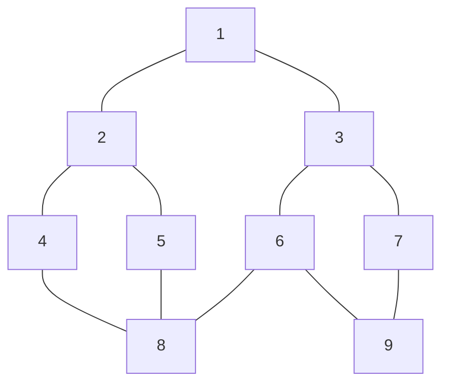

**深度优先搜索**的过程为：1入栈，随后出栈，遍历所有的下一级元素即2和3，2和3入栈；假设随后弹出的是3，则遍历到6和7，6和7入栈；假设随后弹出的是7，遍历下一级元素9，9入栈；由于9没有下一级元素，直接出栈，然后是6出栈，遍历到下一级元素8，8入栈；同样8也没有下一级元素，8直接出栈，现在在栈顶的是2，后面就开始遍历左半部分的元素了。

**广度优先搜索**的过程为：1入队，取出1，遍历所有下一级元素即2和3，2和3入队；取出2，遍历所有下一级元素4和5，4和5入队；3出队，6和7入队；4出队，遍历到下一级元素8，8入队；5出队，没有未遍历的下一级元素；6出队，遍历到9，9入队；7出队，没有未遍历的下一级元素；8和9都没有下一级元素，停止遍历。


### 强连通分量

#### kosaraju算法

[Kosaraju 算法 - SHHHS - 博客园 (cnblogs.com)](https://www.cnblogs.com/shadowland/p/5876307.html)

在线性时间内找到一个有向图的强连通分量。为了找到强连通（指一个有向图中任意两点之间存在双向到达的路径）分支，首先对图G运行**DFS**，计算出各顶点**完成搜索**的时间`f`；然后计算图的逆图$G^T$（逆图指的是将原图每条路径的方向颠倒），对逆图也进行DFS搜索，但是这里搜索时顶点的访问次序不是按照顶点标号的大小，而是按照各顶点`f`值由大到小的顺序；逆图DFS所得到的森林即对应连通区域。

1. 对原图G进行深度优先遍历，记录每个节点的离开时间num[i]；
2. 选择具有最晚离开时间的顶点，对逆图$G^T$进行遍历，能够遍历到的顶点构成一个强连通分量；
3. 如果还有顶点没有遍历到（单独一个顶点的也是强连通分量），继续步骤2，否则算法结束。


#### Tarjan算法

[60 分钟搞定图论中的 Tarjan 算法（一） - 知乎 (zhihu.com)](https://zhuanlan.zhihu.com/p/101923309)

[Articulation Points (or Cut Vertices) in a Graph - GeeksforGeeks](https://www.geeksforgeeks.org/articulation-points-or-cut-vertices-in-a-graph/)

Tarjan算法可以在线性时间内求出无向图的割点与桥，再进一步的求出双联通分量，还可用于求解强连通。

有向图强连通分量：在有向图G中，如果两个顶点$v_i$，$v_j$间（$v_i>v_j$）有一条从$v_i$到$v_j$的有向路径，同时还有一条从$v_j$到$v_i$的有向路径，则称两个顶点强连通。如果有向图G的每两个顶点都强连通，称G是一个强连通图。有向图的极大强连通子图，称为强连通分量。

tarjan算法将每一个强连通分量作为搜索树上的一个子树，而这个图便是一个完整的搜索树，正因为如此，tarjan算法使用DFS来进行搜索。tarjan在搜索时，每个点都有两个参数，分别是时间戳（标记图中每个节点在进行DFS搜索时被访问的时间顺序，用dfn[x]表示）和追溯值（表示从当前节点x作为搜索树的根节点出发，能够访问到的所有节点中，时间戳最小的值，用low[x]表示，在刚访问到的时候，low[x]=dfn[x]），此处能够访问到的所有节点需要满足下面的条件之一即可：

+ 以x为根的搜索树的所有节点
+ 通过一条非搜索树上的边，能够到达搜索树的所有节点


以上图为例，左边子图的追溯值都为1，对于节点5来说，1-5是一条非搜索树上的边，因此可以通过这条边到达1，所以追溯值为1；对于节点4，注意到4-5也是一条非搜索树上的边，所以4的追溯值也为1；以3为根能够搜索到4，所以3的追溯值为1；同理节点2的追溯值也为1。

而对于右边子图，节点9能够通过6-9这条非搜索树上的边到达6，因此追溯值为6（注意9是通过8-9这条边而被搜索到的）。

在一张无向图中，判断边e（其对应的两个节点分别为u与v）是否为桥，只需满足dfn[u]<low[v]即可。


### 找到图中的环

#### 无向图

##### DFS

[Detect cycle in an undirected graph - GeeksforGeeks](https://www.geeksforgeeks.org/detect-cycle-undirected-graph/)

+ 遍历图中的所有节点，维护一个存放访问过元素的数组`visited`；
+ 在连接到当前节点的给定子图上运行深度优先遍历（DFS），并传递当前节点的父节点。在每个递归
  + 设置`visited[root] = 1`
  + 遍历邻接表中当前节点的所有相邻节点
    + 如果没有访问过，对该节点进行DFS，并返回true，如果该节点返回true
    + 如果该相邻节点已经访问过，且不是当前节点的父节点，返回true
  + 返回false

##### BFS

[Detect cycle in an undirected graph using BFS - GeeksforGeeks](https://www.geeksforgeeks.org/detect-cycle-in-an-undirected-graph-using-bfs/)

+ 遍历图中的所有节点，维护一个存放访问过元素的数组`visited`；
+ 在连接到当前节点的给定子图上运行宽度优先遍历（BFS），对于每个访问到的顶点`v`，如果存在相邻的`u`，`u`已经访问过，并且`u`不是`v`的父节点（可能需要维护另外一个数组来记录每个节点的父节点），返回true；
+ 如果没有找到这样一个节点，返回false

#### 有向图

##### DFS

[Detect Cycle in a Directed Graph - GeeksforGeeks](https://www.geeksforgeeks.org/detect-cycle-in-a-graph/)

+ 创建一个递归DFS函数，参数为：当前顶点，已访问顶点，递归栈；
+ 标记当前顶点已经被访问，并标记递归栈中的索引；
+ 循环遍历所有顶点，对每个顶点，如果还未访问，调用递归函数（为了防止图中有森林，所以需要检查每个森林）
  + 在每次递归中，找到当前节点的未访问的相邻节点
    + 如果相邻顶点已经在递归栈中被标记，返回true
    + 否则对该相邻顶点执行递归
  + 从递归调用返回时，从递归堆栈中取消当前节点的标记，以表示当前节点不再是所跟踪路径的一部分
+ 如果任何函数返回true，停止以后的函数调用并返回true作为答案，否则返回false


### 欧拉路径

#### Fleury算法

[Fleury's Algorithm for printing Eulerian Path or Circuit - GeeksforGeeks](https://www.geeksforgeeks.org/fleurys-algorithm-for-printing-eulerian-path/)

用于求解图中的欧拉路径（通过每条边一次），欧拉回路（在欧拉路径的基础上要求起点和终点相同）。

1. 确保图中只有0个或2个奇顶点；
2. 如果有0个奇顶点，可以从任意顶点处开始；如果有2个奇顶点，从其中一个开始；
3. 每次沿着一条边。如果你要在桥和非桥之间做出选择，一定要选择非桥。
4. 走完所有边时停止

算法的思想是：不要过河拆桥，这样我们就可以回到一个顶点，遍历剩下的边。

首先，我们需要一个函数`isEulerian()`（通过奇顶点的个数来判断）来检查图中是否包含欧拉路径或回路

此外，一共重要问题是怎么判断一条路径是不是桥，假设桥为`u-v`，先统计从u点可以遍历到的顶点数，之后删除`u-v`，再次统计从u点开始可以遍历到的顶点数，如果遍历顶点数较少，`u-v`就是桥，可以使用DFS来统计遍历顶点数。当一条边加入欧拉回路，需要从图中移除这条边。


### 哈密顿回路

有且只通过图中的每个顶点一次，寻找图中的哈密顿回路或哈密顿路径是一个NP完全问题

**朴素算法**：生成所有可能的顶点结构，打印出满足给定约束的结构，不过时间复杂度会高达$O(n!)$

**回溯算法**：创建一个空的路径数组，在数组添加顶点0，从顶点1开始添加顶点，在添加顶点之前，检查它是否与先前添加的顶点相邻，并且是否已经添加。如果我们找到这样一个顶点（与先前添加的节点相邻，且未被添加），我们添加顶点作为解决方案的一部分。如果我们没有找到一个顶点，那么我们返回false。


### 拓扑排序

[Topological Sorting - GeeksforGeeks](https://www.geeksforgeeks.org/topological-sorting/)

拓扑排序是指以线性排列所有的顶点，使得所有的有向（$u\to v$）边$uv$，$u$在$v$之前出现。

例如，图的顶点可能表示要执行的任务，而边可能表示一个任务必须在另一个任务之前执行的约束；在此应用程序中，拓扑排序只是任务的有效序列。另一个应用是依赖项解析。每个顶点都是一个包，每个边都是包a对包b的依赖。然后，拓扑排序将以一种方式提供安装依赖项的顺序，使每个下一个依赖项都有其先前要安装的依赖包。

拓扑排序当且仅当图没有有向环，即它是有向无环图(DAG)。任何DAG都至少有一个拓扑排序，并且已知的算法用于在线性时间内构造任何DAG的拓扑排序。

有向无环图的拓扑排序：每条边从排序的早期(左上)到排序的后期(右下)。有向图是无环的当且仅当它具有拓扑序。

可以使用DFS来进行搜索

+ 创建一个栈来储存节点；
+ 初始化大小为N的数组**visited**用于记录访问过的节点；
+ i = 0,...,N-1（N为节点数）
  + 如果节点在**visited**中被标记为False，即没有被访问到，调用拓扑排序：
    + 在**visited**中标记当前节点为True；
    + 在所有与当前节点有有向边的节点上递归运行拓扑排序；
    + 当前节点入栈
  + 如果节点在**visited**被标记为True，跳过
+ 打印栈中所有的元素


## 图像处理

### 基于内容的图像缩放（Seam Carving）

论文地址：[Seam carving for content-aware image resizing | ACM Transactions on Graphics](https://dl.acm.org/doi/10.1145/1276377.1276390)

基本思想：

第一步：在缩放时（以宽度缩放为例，即从原图像中删除列），先对图像中每一行计算能量图（颜色差异），以下列一行图像为例（列数为`N`）

| 5    | 20   | 40   | 10   | 30   | 60   |
| ---- | ---- | ---- | ---- | ---- | ---- |

设列数为`i`处的像素为`x[i]`，则`i`处的能量`p[i]`计算公式为（假设为RGB图，无需考虑alpha通道）
$$
\eqalign{
  & p[i] = \left\{ \matrix{
  \sqrt {{{\left( {x[i + 1] - x[i]} \right)}^2}} \qquad \qquad \qquad \qquad i = 0 \hfill \cr 
  \sqrt {{{\left( {x[i] - x[i - 1]} \right)}^2} + {{\left( {x[i + 1] - x[i]} \right)}^2}} \quad 0 < i < N - 1 \hfill \cr 
  \sqrt {{{\left( {x[i] - x[i - 1]} \right)}^2}} \qquad \qquad \qquad \qquad i = N - 1 \hfill \cr}  \right.  \cr 
  & {\left( {x[i] - x[j]} \right)^2} = {\left( {{x_R}[i] - {x_R}[j]} \right)^2} + {\left( {{x_G}[i] - {x_G}[j]} \right)^2} + {\left( {{x_B}[i] - {x_B}[j]} \right)^2} \cr}
$$
第二步：计算完整张图片的能量图后，使用动态规划的思想找到一条能量和最小的通道（一般不是一条直线），这里需要创建一个与能量图`p`相同尺寸的数组`s`用于存放当前路径下的能量和，具体方法为：

1. 先将`s`的第一行的值设置为`p`的第一行
2. 考虑到能量图的计算公式和减少计算量，下一行的能量计算为

$$
s[i,j] = p[i,j] + \min \left\{ {p[i - 1,j - 1],p[i - 1,j],p[i - 1,j + 1]} \right\}
$$

其中`i`表示行数，`j`表示列数，除了记录能量和，还需要记录该点前面的点。

第三步：`s`构造完成后，从最后一行中找到最小值，并对之前的点进行追溯（步骤2中已经记录了前面的点）得到最终需要删除的seam（缝）

第四步：删除对应的seam处的像素后，重复一、二两步，直至宽度符合要求。

这个方法感觉计算量虽然好但是计算量比较大。

**基于python的实现**

[Seam Carving实现图像缩放 - 代码片段 - Gitee.com](https://gitee.com/xiang-m-j/codes/oijdtmlrfbn93gxa6uwsq23)

[Seam Carving实现图像缩放 (github.com)](https://gist.github.com/Xiang-M-J/5fbbb4e2633d7b4c12347d479f83001a)


## 数学

### 整数分解

如整数4的分解形式一共有5种，如下

> 4
>
> 3+1
>
> 2+2
>
> 2+1+1
>
> 1+1+1+1

动态规划求解，建立一个`(N+1)×(N+1)`大小的数组`a`，N为待分解的整数，行代表数字，列代表可以出现不大于这个数。

因此可以得到`a`的边界条件：

当整数不为0时，如果要求出现只出现0，那么分法为0，即`a[1:,:]=0`

当整数为0时，那么只要允许出现0，那么就有一种方法，即`a[0,:]=1`

对于`a[i,j]`表示整数`i`，在`{0,1,...,j}`中的分法有多少种，显然可以将其分为两种情况（分硬币问题）：

（1）一定出现`j`，那么这样就等于`a[i-j,j]`的分法

（2）没有`j`，那么这样就等于`a[i, j-1]`的分法

因此动态方程为`a[i,j] = a[i-j,j]+a[i,j-1]`

**python实现**

```python
def solve(n):
    sol = np.zeros([n+1, n+1], np.int32)
    sol[1:, :] = 0
    sol[0,:] = 1
    for i in range(1, n+1):
        for j in range(1, n+1):
            if i >= j:
                sol[i, j] = sol[i-j, j] + sol[i, j-1]
            else:
                sol[i,j] = sol[i, j-1]
    return sol[-1, -1]
```


如果想要得到分解结果，可以采用递归的方法

**原始递归**

```python
def partition1(num, n, loc, sum_, sol:list):
    if sum_ == n:
        print(sol[:loc])
        return
    if sum_ > n:
        return 
    for i in range(num, n+1):  # 这里在搜索时会进行一些不可能的搜索，可以进行剪枝
        sol[loc] = i
        partition1(i, n, loc+1, sum_+i, sol)
```

**修改后的递归**

```python
def partition2(num, n, loc, sum_, sol:list):
    """
    num: 当前分解因子   n: 需要分解的整数
    loc: 分解因子的序号 sum: 总和
    sol: 存放分解因子
    """
    if sum_ == n:
        print(sol[:loc])
        return
    for i in range(num, n+1-sum_):  # 剪去一些不可能的分支
        sol[loc] = i
        partition2(i, n, loc+1, sum_+i, sol)
N = 8
sol = [0]*N
partition2(1, N, 0, 0, sol)
```

### LU分解

L为下三角矩阵，U为上三角矩阵，在求解L和U时，初始化U为全零矩阵，L为单位阵。
$$
\eqalign{
  & i = 1,2,...,N;j \ge i  \cr 
  & U[i,j] = A[i,j] - \sum\limits_{k = 1}^N L [i,k] \cdot U[k,j]  \cr 
  & L[j,i] = \left( {A[j,i] - \sum\limits_{k = 1}^N L [j,k] \cdot U[k,i]} \right)/U[i,i] \cr}
$$

```c
int lu_decomposition(double **A, double **L, double **U, int mat_size)
{
    int row, col, j;
    // regularize each row
    for (row = 0; row < mat_size; row++)
    {
        // Upper triangular matrix
        for (col = row; col < mat_size; col++)
        {
            // Summation of L[i,j] * U[j,k]
            double lu_sum = 0.;
            for (j = 0; j < row; j++) lu_sum += L[row][j] * U[j][col];

            // Evaluate U[i,k]
            U[row][col] = A[row][col] - lu_sum;
        }

        // Lower triangular matrix
        for (col = row; col < mat_size; col++)
        {
            if (row == col)
            {
                L[row][col] = 1.;
                continue;
            }
            // Summation of L[i,j] * U[j,k]
            double lu_sum = 0.;
            for (j = 0; j < row; j++) lu_sum += L[col][j] * U[j][row];
            // Evaluate U[i,k]
            L[col][row] = (A[col][row] - lu_sum) / U[row][row];
        }
    }
    return 0;
}
```


### Welford算法

用于在线计算均值、方差等
$$
\overline {{x_{n + 1}}}  = \overline {{x_n}}  + {{{x_{n + 1}} - \overline {{x_n}} } \over {n + 1}}
$$

$$
\sigma _{n + 1}^2 = \sigma _n^2 + {{\left( {{x_{n + 1}} - \overline {{x_n}} } \right)\left( {{x_{n + 1}} - \overline {{x_{n + 1}}} } \right) - \sigma _n^2} \over {n + 1}}
$$

**推导**
$$
\eqalign{
  & \left( {N + 1} \right)\overline {{x_{n + 1}}}  = \sum\nolimits_{i = 1}^{n + 1} {{x_i}}   \cr 
  & \left( {N + 1} \right)\overline {{x_{n + 1}}}  = \sum\nolimits_{i = 1}^n {{x_i}}  + {x_{n + 1}}  \cr 
  & \left( {N + 1} \right)\overline {{x_{n + 1}}}  = N\overline {{x_n}}  + {x_{n + 1}}  \cr 
  & \overline {{x_{n + 1}}}  = {{N\overline {{x_n}}  + {x_{n + 1}}} \over {N + 1}}  \cr 
  & \overline {{x_{n + 1}}}  = \overline {{x_n}}  + {{{x_{n + 1}} - \overline {{x_n}} } \over {N + 1}} \cr}
$$
对于方差，先看普通公式
$$
\eqalign{
  & \sigma _n^2 = E\left( {{X^2}} \right) - {\overline {{x_n}} ^2} = {1 \over N}\sum\nolimits_{i = 1}^n {x_i^2}  - {\overline {{x_n}} ^2}  \cr 
  & N\sigma _n^2 = \sum\nolimits_{i = 1}^n {x_i^2}  - N{\overline {{x_n}} ^2} \cr} 
$$
再看n+1的情况
$$
\eqalign{
  & \sigma _{n + 1}^2 = {1 \over {N + 1}}\sum\nolimits_{i = 1}^{n + 1} {x_i^2}  - {\overline {{x_{n + 1}}} ^2}  \cr 
  & \left( {N + 1} \right)\sigma _{n + 1}^2 = \sum\nolimits_{i = 1}^n {x_i^2}  + x_{n + 1}^2 - \left( {N + 1} \right){\overline {{x_{n + 1}}} ^2} \cr}
$$
上面已经求得$\sum\nolimits_{i = 1}^n {x_i^2}$和$\overline {{x_{n + 1}}}$的表达式，代入进去
$$
\eqalign{
  & \left( {N + 1} \right)\sigma _{n + 1}^2 = N\sigma _n^2 + N{\overline {{x_n}} ^2} + x_{n + 1}^2 - {{{{\left( {N\overline {{x_n}}  + {x_{n + 1}}} \right)}^2}} \over {N + 1}}  \cr 
  & {\left( {N + 1} \right)^2}\sigma _{n + 1}^2 = N\left( {N + 1} \right)\sigma _n^2 + N{\left( {\overline {{x_n}}  - {x_{n + 1}}} \right)^2}  \cr 
  & \sigma _{n + 1}^2 = {{N\sigma _n^2} \over {N + 1}} + {{N{{\left( {\overline {{x_n}}  - {x_{n + 1}}} \right)}^2}} \over {{{\left( {N + 1} \right)}^2}}} \cr}
$$

### Coppersmith-Winograd算法
矩阵快速算法，时间复杂度为$O(n^{2.376})$
将矩阵分成四块来计算
$$
A = \left[ {\matrix{
   {{A_{11}}} & {{A_{12}}}  \cr 
   {{A_{21}}} & {{A_{22}}}  \cr 

 } } \right]\quad \quad B = \left[ {\matrix{
   {{B_{11}}} & {{B_{12}}}  \cr 
   {{B_{21}}} & {{B_{22}}}  \cr 

 } } \right]
$$
$$
\eqalign{
  & {S_1} = {A_{21}} + {A_{22}}\quad {T_1} = {B_{12}} - {B_{11}}  \cr 
  & {S_2} = {S_1} - {A_{11}}\quad {T_2} = {B_{22}} - {T_1}  \cr 
  & {S_3} = {A_{11}} - {A_{21}}\quad {T_3} = {B_{22}} - {B_{12}}  \cr 
  & {S_4} = {A_{12}} - {S_2}\quad {T_4} = {T_2} - {B_{21}}  \cr 
  & {M_1} = {A_{11}}{B_{11}}\quad {U_1} = {M_1} + {M_2}  \cr 
  & {M_2} = {A_{12}}{B_{21}}\quad {U_2} = {M_1} + {M_6}  \cr 
  & {M_3} = {S_4}{B_{22}}\quad {U_3} = {U_2} + {M_7}  \cr 
  & {M_4} = {A_{22}}{T_4}\quad {U_4} = {U_2} + {M_5}  \cr 
  & {M_5} = {S_1}{T_1}\quad {U_5} = {U_4} + {M_3}  \cr 
  & {M_6} = {S_2}{T_2}\quad {U_6} = {U_3} - {M_4}  \cr 
  & {M_7} = {S_3}{T_3}\quad {U_7} = {U_3} + {M_5} \cr}
$$
$$
C = A \times B = \left[ {\matrix{
   {{A_{11}}} & {{A_{12}}}  \cr 
   {{A_{21}}} & {{A_{22}}}  \cr 

 } } \right] \times \left[ {\matrix{
   {{B_{11}}} & {{B_{12}}}  \cr 
   {{B_{21}}} & {{B_{22}}}  \cr 

 } } \right] = \left[ {\matrix{
   {{U_1}} & {{U_5}}  \cr 
   {{U_6}} & {{U_7}}  \cr 

 } } \right]
$$
使用C++实现时，二维数组可以这样定义和释放
```cpp
int **C = new int*[N];
for(int i = 0; i < N; i++){
	C[i] = new int[N];
}

// 释放时
for (size_t i = 0; i < N; i++)
{
	delete []C[i];
}
delete []C;
```
全部代码：[Coppersmith-Winograd快速矩阵乘法 (github.com)](https://gist.github.com/Xiang-M-J/3e13e5bd918581f9452ffceceb052bb1)

## 排序和查找

### 哨兵线性查找

是普通线性查找的优化，思想便是在数组的最后加入一个额外元素（即哨兵值），以匹配搜索。通过这样做，我们可以避免对循环中数组的末尾进行条件检查，并在找到哨兵元素后尽早结束搜索。这消除了对数组末尾进行单独检查的需要，从而略微改善了算法的平均性能。

算法步骤

+ 初始化搜索索引`i=0`
+ 设置数组中最后一个值是待查找的x
+ 当x不等于`arr[i]`，`i++`
+ 如果`i`小于数组的大小或是`arr[i]`等于x，返回`i`
+ 否则，返回-1

哨兵线性搜索算法的主要优点是它消除了对数组末端进行单独检查的需要，这可以提高算法的平均案例性能。

```c++
#include <iostream>
using namespace std;

void sentinelSearch(int arr[], int n, int key)
{
	// Last element of the array
	int last = arr[n - 1];

	arr[n - 1] = key;
	int i = 0;

	while (arr[i] != key)
		i++;

	// Put the last element back
	arr[n - 1] = last;

	if ((i < n - 1) || (arr[n - 1] == key))
		cout << key << " is present at index " << i;
	else
		cout << "Element Not found";
}

// Driver code
int main()
{
	int arr[] = { 10, 20, 180, 30, 60, 50, 110, 100, 70 };
	int n = sizeof(arr) / sizeof(arr[0]);
	int key = 180;

	sentinelSearch(arr, n, key);

	return 0;
}
```

### 三分查找

用于找最值，面向的搜索序列的要求是：序列为一个凸性函数。通俗来讲，就是该序列必须有一个最大值（或最小值），在最大值（最小值）的左侧序列，必须满足不严格单调递增（递减），右侧序列必须满足不严格单调递减（递增）。

与二分法类似，先取整个区间的中间值
$$
mid = (left+right) / 2
$$
再取右侧区间的中间值rmid，从而将区间分成三个小区间
$$
rmid=(mid+right)/2
$$
比较$mid$和$rmid$的大小，如果是求最值，$mid$更大就丢弃最右边的区间，反之丢弃最左边的区间

```c++
if (fun(mid) > fun(rmid)){
    right = rmid;
}else{
    left = mid;
}
```


### 跳跃查找

与二分查找相同，跳跃查找针对的是已经排好序的数组，跳跃查找会每次会跳跃一个block（大小为m），即`a[0]`、`a[m]`、`a[2*m]`等。如果要查找的数字在`a[(k-1)m]`和`a[km]`之间，可以使用线性查找的方式来查找，时间复杂度为$O(\sqrt{n})$

### 指数查找

指数查找分成两步：

（1）找到元素出现的范围

（2）使用二分查找

确定元素出现的范围：从大小为1开始，比较子数组的最后一位与`x`之间的大小关系，如果小于那么就将大小乘2，即数组大小为2，4，8...。当数组大小为`i`时，子数组的最后一位大于`x`，此时便可确定元素出现在`[i/2,i]`之间。

```c++
int exponentialSearch(int arr[], int n, int x)
{
    if (arr[0] == x)
        return 0;
    int i = 1;
    while (i < n && arr[i] <= x)
        i = i*2;
 
    return binarySearch(arr, i/2, min(i, n-1), x);
}
```

### 斐波那契查找

斐波那契查找是二分查找的优化算法，假设开始时表中记录的个数为N，小于或等于某个斐波那契数$f_{m}$，令$i=f_{m-2}$为索引（如果是合法的），比较`arr[i]`和`x`，如果相等，返回i；如果x较大，则在arr的右侧约2/3部分搜索，否则在arr的左侧约1/3部分搜索。

```c++
// C++ program of the above approach 
#include <bits/stdc++.h> 
using namespace std; 

// Utility function to find minimum of two elements 
int min(int x, int y) { return (x <= y) ? x : y; } 

/* Returns index of x if present, else returns -1 */
int fibMonaccianSearch(int arr[], int x, int n) 
{ 
	/* Initialize fibonacci numbers */
	int fibMMm2 = 0; // (m-2)'th Fibonacci No. 
	int fibMMm1 = 1; // (m-1)'th Fibonacci No. 
	int fibM = fibMMm2 + fibMMm1; // m'th Fibonacci 

	/* fibM is going to store the smallest Fibonacci 
	Number greater than or equal to n */
	while (fibM < n) { 
		fibMMm2 = fibMMm1; 
		fibMMm1 = fibM; 
		fibM = fibMMm2 + fibMMm1; 
	} 

	// Marks the eliminated range from front 
	int offset = -1; 

	/* while there are elements to be inspected. Note that 
	we compare arr[fibMm2] with x. When fibM becomes 1, 
	fibMm2 becomes 0 */
	while (fibM > 1) { 
		// Check if fibMm2 is a valid location 
		int i = min(offset + fibMMm2, n - 1); 

		/* If x is greater than the value at index fibMm2, 
		cut the subarray array from offset to i */
		if (arr[i] < x) { 
			fibM = fibMMm1; 
			fibMMm1 = fibMMm2; 
			fibMMm2 = fibM - fibMMm1; 
			offset = i; 
		} 

		/* If x is greater than the value at index fibMm2, 
		cut the subarray after i+1 */
		else if (arr[i] > x) { 
			fibM = fibMMm2; 
			fibMMm1 = fibMMm1 - fibMMm2; 
			fibMMm2 = fibM - fibMMm1; 
		} 

		/* element found. return index */
		else
			return i; 
	} 

	if (fibMMm1 && arr[offset + 1] == x) 
		return offset + 1; 

	return -1; 
} 

int main() 
{ 
	int arr[] = { 10, 22, 35, 40, 45, 50, 80, 82, 85, 90, 100,235}; 
	int n = sizeof(arr) / sizeof(arr[0]); 
	int x = 235; 
	int ind = fibMonaccianSearch(arr, x, n); 
    if(ind>=0) 
        cout << "Found at index: " << ind; 
    else
        cout << x << " isn't present in the array"; 
        return 0; 
} 
```


### 判圈算法

#### floyd判圈算法

如何判断一个链表中是否存在环，可以采取以下的方法，设置两个指针（一个步长为1，另一个步长为2），开始时都指向链表的头部，同时开始向后搜索，如果两个指针能遇到，那么说明链表中有环。且此时如果将快指针放到链表头部，并将快指针的步长设置为1，再次相遇的点便是环的起点。

**原理**

设从起点到环的起点的距离为m，环的起点到相遇点的距离为a，环的长度为k，则有
$$
\eqalign{
  & {s_1} = m + a + {n_1}k  \cr 
  & {s_2} = m + a + {n_2}k \cr}
$$
其中$n_1$和$n_2$为整数，由于快指针的步长是慢指针的步长的两步，所以有$s_2=2s_1$。
$$
\eqalign{
  & {s_2} - {s_1} = {s_1} = \left( {{n_2} - {n_1}} \right)k  \cr 
  & m + a = {s_1} - {n_1}k = \left( {{n_2} - 2{n_1}} \right)k \cr}
$$
将快指针的步长设置为1并放在链表头部，此时如果快指针走到环的起点，即走了m，慢指针从相遇点走了m步，总共就是m+a步，而m+a是k的整数倍，所以两者相遇在环的起点。


#### Brent判圈算法

Brent判圈算法比floyd快一些。Brent算法的思想是：

+ 快指针和慢指针初始化指向链表头

+ 第`i`轮，快指针先走，最多走$2^i$步，如果走到尽头，则无环，如果和慢指针相遇，则有环，否则，结束快指针的操作；
+ 快指针走完后，慢指针放到快指针的位置，返回上面的步骤。

代码实现

```c++
bool hasCycleBrent(ListNode *head) {
    ListNode *p1 = head;
    ListNode *p2 = head;
    int steps = 0;
    int limit = 2;
    while (p1 != NULL && p2 != NULL) {
        p1 = p1->next;
        if (p1 == p2) {
          return true;
    	}
        ++steps;
        if (steps == limit) {
            p2 = p1;
            steps = 0;
            limit *= 2;
        }
    }
    return false;
}
```


### 插值查找

[Interpolation Search - GeeksforGeeks](https://www.geeksforgeeks.org/interpolation-search/)

插值查找是对二分查找的改进，每次查找时，不再是对半分，而是根据下面的公式：
$$
{\rm{pos}} = {\rm{low}} + {{\left( {x - arr[{\rm{low}}]} \right)*({\rm{high}} - {\rm{low}})} \over {\left( {arr[{\rm{high}}] - arr[{\rm{low}}]} \right)}}
$$
时间复杂度为$O({\log _2}({\log _2}n))$


### 快速排序

[图解快速排序的三种方式 - 掘金 (juejin.cn)](https://juejin.cn/post/7056416599003136014)

输入未排序的数组`arr`，左索引`l`，右索引`r`；

1. 先在未排序的数组中选择一个基准值`a`（可以选择左索引对应的值，即第一个值）；

2. 对于右索引`r`，向左移动，如果对应的值`v`小于基准值`a`，则停止，将`v`赋给左索引`l`对应的位置（一开始这里对应的是基准值），左索引`l`向右移动一位；

3. 对于左索引`l`，向右移动，如果对应的值`v`大于基准值`a`，则停止，将`v`赋给右索引`r`对应的位置（这里的值应该赋过值了，即使覆盖也没关系），右索引`r`向左移动一位；

4. 直到`l==r`（在第（2）步和第（3）步移动时，需要保证`l<r`，这样最后再移动一次，肯定有`l==r`），停止移动，将基准值赋给左索引`l`对应的位置。

此时在`r`右边的值全部大于基准值，在`l`左边的值全部小于基准值，只需对两边继续进行快速排序即可完成排序。

```c++
#include<iostream>
using namespace std;

void quick_sort(int arr[10], int l, int r){
    if(l >= r) return;
    int pivot_v = arr[l];
    int i = l;
    int j = r;
    while (i < j)
    {
        while (j>i && arr[j] >= pivot_v) j--;
        if (i<j)
        {
            arr[i] = arr[j];
            i++;
        }
        while (j>i && arr[i] <= pivot_v) i++;
        if (i<j)
        {
            arr[j] = arr[i];
            j--;
        }    
    }
    arr[i] = pivot_v;
    quick_sort(arr, l, i-1);
    quick_sort(arr, j+1, r);
}
int main(){
    int a[10] = {6,3,2,7,4,8,3,1,9,5};
    int length = sizeof(a)/sizeof(int);
    quick_sort(a, 0, length-1);
    for (size_t i = 0; i < length; i++)
    {
        cout<<a[i]<<", ";
    }
    return -1;
}
```

时间复杂度为$O(n\log (n))$，虽然快速排序并不稳定，最坏情况的时间复杂度为$O(n^2)$，但是实践中是最快的（针对C++）。

### 桶排序

将n个元素分到k个桶内（每个桶的范围不重叠），对每个桶内的数据进行排序，再将每个桶内排序的结果放在一起，即为最后的输出。

当数据分布均匀时，时间复杂度为$O(n+k)$。


### 计数排序

计数排序不依靠比较进行排序，适用于整数的排序，最大值和最小值的差距不大，假设最大值为k，当$k=O(n)$，可以考虑使用计数排序。

**基本思想**：对于每一个输入元素x，确定小于x的元素个数。利用这一信息，就可以直接把x放到它在输出数组中的位置上了。例如，如果有17个元素小于x，则x就应该在第18个输出位置上。

**具体算法**：

1. 对于一个未排序的数组`arr`，首先遍历一遍`arr`，得到最大值`maxV`最小值`minV`；
2. 根据最大值最小值开辟一个`maxV-minV+1`大小的数组`r`，用于统计每个元素出现的频次；统计数组中每个元素出现的频次，如果一个元素是最小值则对应`r[0]`，如果一个元素是`minV+1`则对应`r[1]`，以此类推；
3. 根据数组`r`，如果`r[0]=3`，则在原数组内写入3个`minV`，以此类推，完成排序。

**python实现**

```python
def countingSort(arr):
    maxV = max(arr)
    minV = min(arr)
    r = [0] * (maxV - minV + 1)
    for a in arr:
        r[a-minV] += 1
    idx = 0
    for i in range(len(r)):
        if r[i] != 0:
            arr[idx:idx+r[i]] = [minV + i] * r[i]
            idx = idx+r[i]
    return arr
```


### 堆排序

堆的定义如下：n个元素的序列$\left\{ {{k_1},{k_2}, \cdots ,{k_n}} \right\}$满足以下关系

**小顶堆（用于降序排列）**：
$$
\left\{ \matrix{
  {k_i} \le {k_{2i}} \hfill \cr 
  {k_i} \le {k_{2i + 1}} \hfill \cr}  \right.
$$
**大顶堆（用于升序排列）**：
$$
\left\{ \matrix{
  {k_i} \le {k_{2i}} \hfill \cr 
  {k_i} \le {k_{2i + 1}} \hfill \cr}  \right.
$$
此序列所存储的数据可以看成一个完全二叉树的结构，下面就是一个堆结构的示意图，数字表示元素的序号，如1表示排在第1位。

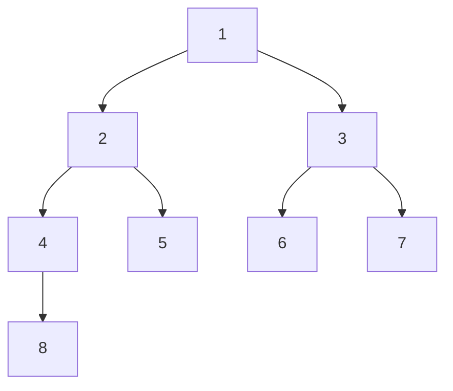

以大顶堆（升序排列）为例：

1. 创建一个堆$H[0,\cdots,n-1]$；
2. 把堆首（最大值）和堆尾互换；
3. 将堆的尺寸缩小1，重新恢复堆的结构；
4. 重复步骤2、3，直至堆的尺寸为1。

**python实现**

```python
def buildMaxHeap(arr):
    import math
    for i in range(math.floor(len(arr)/2),-1,-1):
        heapify(arr,i)

def heapify(arr, i):
    # 因为python从0开始索引，所以left和right分别为2i+1，2i+2
    left = 2*i+1
    right = 2*i+2
    largest = i
    if left < arrLen and arr[left] > arr[largest]:
        largest = left
    if right < arrLen and arr[right] > arr[largest]:
        largest = right

    if largest != i:
        arr[i], arr[largest] = arr[largest], arr[i]
        heapify(arr, largest)

def heapSort(arr):
    global arrLen
    arrLen = len(arr)
    buildMaxHeap(arr)
    for i in range(len(arr)-1,0,-1):
        arr[0], arr[i] = arr[i], arr[0]
        arrLen -=1
        heapify(arr, 0)
    return arr
```

### 归并排序

归并排序的思想是分而治之，将一个较长的数组分成两个较短的数组，以此类推，最终分成1个元素或者2个元素的数组，再将这些数组合并成一个数组。时间复杂度为$O(n\log n)$，并且比较稳定。

**python实现**

```python
def mergein(arr1, arr2):
    arr_ = []
    i,j = 0,0
    while i < len(arr1) and j < len(arr2):
        if arr1[i] <= arr2[j]:
            arr_.append(arr1[i])
            i += 1
        else:
            arr_.append(arr2[j])
            j += 1
    if i != len(arr1):
        arr_.extend(arr1[i:])
    if j != len(arr2):
        arr_.extend(arr2[j:])
    return arr_
            
def mergesort(arr):
    if len(arr) == 1:
        return arr
    # if len(arr) == 2:
    #     return [min(arr), max(arr)]
    mid = len(arr) // 2
    return mergein(mergesort(arr[:mid]), mergesort(arr[mid:]))
```

### 基数排序

主要用于较大位数的整数排序，原理是将整数按位数分成不同的数字，接着按照每一位对应的数字进行排序，从个位开始进行排序。下表是一个例子（`*`表示根据该位的数字进行排序）

|      |      | *    |      |      | *    |      |      | *    |      |      |      |      |      |      |
| ---- | ---- | ---- | ---- | ---- | ---- | ---- | ---- | ---- | ---- | ---- | ---- | ---- | ---- | ---- |
| 9    | 5    | 4    |      | 4    | 1    | 1    |      | 0    | 0    | 9    |      | 0    | 0    | 9    |
| 3    | 5    | 4    |      | 9    | 5    | 4    |      | 4    | 1    | 1    |      | 3    | 5    | 4    |
| 0    | 0    | 9    |      | 3    | 5    | 4    |      | 9    | 5    | 4    |      | 4    | 1    | 1    |
| 4    | 1    | 1    |      | 0    | 0    | 9    |      | 3    | 5    | 4    |      | 9    | 5    | 4    |

时间复杂度为`n*k`，排序是稳定的。


### 希尔排序

希尔排序（又称缩小增量排序），是一种非稳定的排序算法，时间复杂度最好为$O(n\log n)$，最坏为$O(n(\log n)^2)$。

1. 首先对于数组`arr`以增量`k`进行直接插入排序（比较`arr[i]`与`arr[i+k]`的大小，根据排序方向判断是否需要交换），初始的增量`k`可以选择为数组长度的一半；
2. `k=k-1`，再以增量`k`进行直接插入排序；
3. 重复第2步，直到完成增量为`1`的直接插入排序。

**python实现**

```python
def shellsort(arr):
    k = len(arr) // 2
    while k >= 1:
        for i in range(len(arr)-k):
            if arr[i] > arr[i+k]:
                arr[i], arr[i+k] = arr[i+k], arr[i]
        k -= 1
    return arr
```


## 字符串

### Levenshtein距离

用于衡量两个字符串之间的距离，具体来说，就是一个字符串到另外一个字符串所需的插入、删除和修改的总次数，Levenshtein距离的计算公式如下：
$$
{\rm{le}}{{\rm{v}}_{a,b}}(i,j) = \left\{ \matrix{
  \max (i,j)\qquad \qquad {\rm{if}}\;\min (i,j) = 0 \hfill \cr 
  \min \left\{ \matrix{
  {\rm{le}}{{\rm{v}}_{a,b}}(i - 1,j) + 1 \hfill \cr 
  {\rm{le}}{{\rm{v}}_{a,b}}(i,j - 1) + 1 \hfill \cr 
  {\rm{le}}{{\rm{v}}_{a,b}}(i - 1,j - 1) + {1_{{a_i} \ne {b_j}}} \hfill \cr}  \right.\;{\rm{otherwise}} \hfill \cr}  \right.
$$
${\rm{le}}{{\rm{v}}_{a,b}}(i,j)$表示a字符串前`i`个字符和b字符串前`j`个字符之间的Levenshtein距离。

根据上式，可以使用动态规划的思想进行求解。

**python实现**

```python
def levenshteinDistance(str1, str2):
    l1, l2 = len(str1), len(str2)
    sol = np.zeros([l1+1, l2+1], dtype=np.int32)
    sol[1:, 0] = np.arange(1, l1+1)
    sol[0, 1:] = np.arange(1, l2+1)
    for i in range(1, l1+1):
        for j in range(1, l2+1):
           v = str1[i-1] != str2[j-1]
           sol[i, j] = min(sol[i-1,j]+1, sol[i,j-1]+1, sol[i-1,j-1]+v)
    return sol[-1, -1] 
```


### 模式匹配

#### KMP

KMP匹配算法利用了模式的退化特性（模式具有相同的子模式在模式中出现不止一次），并将最坏情况的复杂度提高到O(n + m)。

KMP算法首先需要对模式字符串`pat`进行预处理，定义一个数组`lps`（`lps`的长度与模式字符串相等）用于记录最长的前缀和后缀（回文序列）。预处理的过程：

+ 使用`len`记录最长的前缀后缀值的长度
+ 初始化`lps[0]`和`len`为0
+ 从`i=1`开始匹配，如果`pat[len]`和`pat[i]`匹配，`len=len+1`，`lps[i]=len`，`i=i+1`
+ 如果`pat[len]`和`pat[i]`不匹配，`len=lps[len-1]`
  + 如果`len>0`，继续匹配`pat[len]`和`pat[i]`；
  + 如果`len=0`，`lps[i]=0`，`i=i+1`

不同于朴素字符串匹配算法，每次都匹配所有的字符，KMP利用`lps`来决定下一个匹配的字符位置，基本思想是无需匹配已经匹配上的字符。

+ 初始化`i,j=0`；
+ 在匹配原始字符串`txt`和模式字符串`pat`时，如果`txt[i]==pat[j]`，则`i++`，`j++`；
+ 如果`txt[i]!=pat[j]`，则
  + 现在已知`txt[i-j...i-1]`和`pat[0...j-1]`是匹配上的
  + 同时`lps[j-1]`表示`pat[0...j-1]`中正确前缀和后缀字符的长度
  + 结合上面两点，可以得到无需在`txt[i-j...i-1]`中匹配`lps[j-1]`个字符，因为这些字符已经匹配上了。
  + 如果此时`j!=0`，则只修改`j`，`j=lps[j-1]`；
  + 如果此时`j==0`，`i=i+1`

+ 如果已经找到一个模式，即`j=M`，`M`为模式字符串长度，输出已经查找到模式的位置`i-j`，重置`j=lps[j-1]`；
+ 如果`N-i>=M-j`，`N`为`txt`的长度，表示`txt`中未被匹配的字符串长度大于`pat`中未被匹配的字符串长度，则继续匹配`txt[i]=pat[j]`；

**python实现**

```python
def compute(pat):
    lps = [0] * len(pat)
    len_ = 0
    i = 1
    while i < len(pat):
        if pat[i] == pat[len_]:
            len_ += 1
            lps[i] = len_
            i += 1
        else:
            if len_ == 0:
                lps[i] = 0
                i += 1
            else:
                len_ = lps[len_ - 1]
    return lps

def kmp(txt, pat):
    N = len(txt)
    M = len(pat)
    lps = compute(pat)
    i,j = 0,0
    while N-i >= M-j:
        if txt[i] == pat[j]:
            i += 1
            j += 1
        if j == M:
            print(f"find pattern at {i-j}")
            j = lps[j-1]
        elif i < N and pat[j] != txt[i]:
            if j == 0:
                i = i + 1
            else:
                j = lps[j-1]
```


#### Boyer-moore算法

[Boyer Moore Algorithm for Pattern Searching - GeeksforGeeks](https://www.geeksforgeeks.org/boyer-moore-algorithm-for-pattern-searching/)

[Boyer Moore Algorithm | Good Suffix heuristic - GeeksforGeeks](https://www.geeksforgeeks.org/boyer-moore-algorithm-good-suffix-heuristic/)

[不用找了，学习BM算法，这篇就够了（思路+详注代码）-CSDN博客](https://blog.csdn.net/DBC_121/article/details/105569440)

和KMP算法类似，Boyer-moore也会预处理pattern，Boyer-moore是下面两种规则的组合：

1. 坏字符规则
2. 好后缀规则

两种规则都可以独立使用，这两条规则可以给出每步中模式字符串移动的最大长度。与以前的模式搜索算法不同，Boyer Moore 算法从模式的最后一个字符开始匹配。

##### 坏字符规则

文本中与模式的当前字符不匹配的字符称为坏字符，一旦不匹配（从模式的末尾开始匹配），我们移动模式直到

1. 不匹配变成匹配：我们将查找模式中不匹配字符最后出现的位置，如果模式中存在不匹配的字符，那么我们将移动模式，使其与文本T中不匹配的字符对齐。如果文本中A和模式中的G不匹配，则在模式中查找A。
2. 模式P移过不匹配的字符：我们将在模式中查找错误匹配字符最后出现的位置，如果字符不存在，我们将移动模式超过错误匹配字符。如果文本中C和模式中的G不匹配，则在模式中查找C，如果查不到，直接移过C。

```c++
#include <bits/stdc++.h>
using namespace std;
# define NO_OF_CHARS 256 

// 坏字符规则的预处理
void badCharHeuristic( string str, int size, int badchar[NO_OF_CHARS]) 
{ 
	int i; 
	for (i = 0; i < NO_OF_CHARS; i++) 
		badchar[i] = -1; 			// 初始化为-1

	for (i = 0; i < size; i++) 
		badchar[(int) str[i]] = i;  // 字符在字符串中最后出现的位置
} 

// 使用坏字符规则的Boyer-moore匹配算法
void search( string txt, string pat) 
{ 
	int m = pat.size(); 
	int n = txt.size(); 

	int badchar[NO_OF_CHARS]; 

	badCharHeuristic(pat, m, badchar); // 获取模式中每种字符最后出现的位置

	int s = 0; 						   // 模式相对于文本的偏移
	while(s <= (n - m)) 
	{ 
		int j = m - 1; 

		while(j >= 0 && pat[j] == txt[s + j])  // 从模式的末尾开始匹配
			j--; 
        
		if (j < 0)		// 当前的偏移存在匹配
		{ 
			cout << "pattern occurs at shift = " << s << endl; 
            // s+m < n是针对匹配到末尾的情况
            // txt[s + m]表示文本中已经被匹配到的字符的后一位
            // 如果能找到则将其与模式中最后出现的一位对齐，否则就越过该字符。
			s += (s + m < n)? m-badchar[txt[s + m]] : 1; 
		} 
		else
            // 移动模式使文本中的坏字符能和模式中对应的字符匹配，max是保证始终偏移
            // 防止由于坏字符的最后一次出现在当前字符的右边。
			s += max(1, j - badchar[txt[s + j]]); 
	} 
} 

int main() 
{ 
	string txt= "ABAAABCD"; 
	string pat = "ABC"; 
	search(txt, pat); 
	return 0; 
} 
```

##### 好后缀规则

移动模式`P`直至（`T`为完整文本，`t`为`T`或`P`的子字符串）（还是从模式的末尾开始匹配）

（1）文本`T`中的`t`匹配上`P`中`t`的另一次出现：模式`P`中包含了`t`的多次出现，假设目前`P`已经和`T`匹配到了`t`，但是再向前就匹配错误，这时可以直接将`P`中`t`的另一次出现匹配到T中的`t`

（2）`P`的前缀与`t`的后缀匹配：有时候`P`中的`t`只会出现一次，这时可以考虑将`t`的后缀与`P`的前缀匹配

（3）`P`移过`t`：如果上面两项都没有满足，可以移动`P`直接越过`t`。

**强好后缀规则**

假设子字符串`q=P[i to n]`与`T`中`t`匹配，`c=P[i-1]`是匹配错误的字符，我们现在搜索`P`中`t`的出现，且`t`的前面没有`c`。假设`P`为"AACCACCAC"，对应的T为"AABABABAC"，从后往前匹配，可以发现能够匹配到`t=AC`，然后错误字符为`c`=C，此时在P中寻找AC的另一次出现时，就不能找"CAC"这种形式，而是找到"AAC"。

**预处理**

创建一个数组`shift[]`，`shift[i]`为当在位置`i-1`上不匹配时模式将要移动的距离，即模式在`i`处的后缀匹配上，在位置`i-1`上却匹配错误。对于上面讨论的强好后缀和情况2，分别进行了预处理。

**完整代码**

```c++
#include <stdio.h>
#include <string.h>

// 强好后缀规则的预处理
void preprocess_strong_suffix(int *shift, int *bpos, char *pat, int m)
{
	int i=m, j=m+1;   	// m是模式的长度
	bpos[i]=j;			// 

	while(i>0)
	{
        // 如果i-1处字符与j-1处字符不相等，则继续向右搜索模式的边界
		while(j<=m && pat[i-1] != pat[j-1])
		{
            // 模式P中t前面的字符与P中错配字符不一致时停止，将模式从i移到j
			if (shift[j]==0)
				shift[j] = j-i;
			j = bpos[j];	// 更新下一个边界的位置
		}
        // p[i-1]与p[j-1]匹配，发现边界，将边界的开始位置保存下来
		i--;j--;
		bpos[i] = j; 
	}
}

//Preprocessing for case 2
void preprocess_case2(int *shift, int *bpos,
					char *pat, int m)
{
	int i, j;
	j = bpos[0];
	for(i=0; i<=m; i++)
	{
		/* set the border position of the first character of the pattern
		to all indices in array shift having shift[i] = 0 */
		if(shift[i]==0)
			shift[i] = j;

		/* suffix becomes shorter than bpos[0], use the position of 
		next widest border as value of j */
		if (i==j)
			j = bpos[j];
	}
}

/*Search for a pattern in given text using
Boyer Moore algorithm with Good suffix rule */
void search(char *text, char *pat)
{
	// s is shift of the pattern with respect to text
	int s=0, j;
	int m = strlen(pat);
	int n = strlen(text);

	int bpos[m+1], shift[m+1];

	//initialize all occurrence of shift to 0
	for(int i=0;i<m+1;i++) shift[i]=0;

	//do preprocessing
	preprocess_strong_suffix(shift, bpos, pat, m);
	preprocess_case2(shift, bpos, pat, m);

	while(s <= n-m)
	{

		j = m-1;

		/* Keep reducing index j of pattern while characters of
			pattern and text are matching at this shift s*/
		while(j >= 0 && pat[j] == text[s+j])
			j--;

		/* If the pattern is present at the current shift, then index j
			will become -1 after the above loop */
		if (j<0)
		{
			printf("pattern occurs at shift = %d\n", s);
			s += shift[0];
		}
		else
			/*pat[i] != pat[s+j] so shift the pattern
			shift[j+1] times */
			s += shift[j+1];
	}

}

int main()
{
	char text[] = "ABAAAABAACD";
	char pat[] = "ABA";
	search(text, pat);
	return 0;
}
```


#### Rabin-Karp
[Rabin-Karp Algorithm for Pattern Searching - GeeksforGeeks](https://www.geeksforgeeks.org/rabin-karp-algorithm-for-pattern-searching/)
Rabin-Karp算法的思想是通过匹配模式和当前子字符串的哈希值，所以Rabin-Karp算法需要计算

+ 模式`pat`的哈希值
+ 文本`txt`中所有长度为`m`的子字符串，`m`是模式`pat`的长度

哈希值通过[滚动哈希函数](#滚动哈希)来计算：

+ 选择一个合适的基数`base`和模数`modulus`，选择一个素数`p`作为`modulus`，基数`b`可以是字符集的长度，如ASCII字符集可以选择`b=256`
+ 哈希值初始为0
+ 计算模式`pat`的哈希值：
	+ 从左到右遍历`pat`中的每个字符
	+ 位置`i`的字符`c`，该字符的哈希值为$c({b^{M - i - 1}})\% p$，`M`为模式的长度，并将其加到字符串的哈希值上。
+ 在`txt`上滑动`pat`，首先计算与`pat`长度相同的`txt`的第一个子字符串的哈希值。
+ 更新每个子字符串的哈希值，可以通过删除左边旧字符的哈希值和加上右边新字符的哈希值来实现
+ 比较哈希值，如果哈希值相同，则是一个可能的匹配，还需要逐字符的比对来确定


#### z-Algorithm
[Z algorithm (Linear time pattern searching Algorithm) - GeeksforGeeks](https://www.geeksforgeeks.org/z-algorithm-linear-time-pattern-searching-algorithm/)
z-Algorithm与KMP类似，线性时间复杂度$O(m+n)$，算法的核心是构建一个z-数组`Z`，`Z`的长度与文本字符串`txt`相同，$Z[i]$为最长的从`txt[i]`开始同时也是`txt[0..n-1]`的前缀的子字符串的长度，即满足`txt[0..x-1]=txt[i..i+x-1]`的最大的`x`，`Z[0]=0`。以字符串`aabcaabcaaaab`为例

| `i`      | 0    | 1    | 2    | 3    | 4    | 5    | 6    | 7    | 8    | 9    | 10   | 11   | 12   |
| -------- | ---- | ---- | ---- | ---- | ---- | ---- | ---- | ---- | ---- | ---- | ---- | ---- | ---- |
| `txt[i]` | a    | a    | b    | c    | a    | a    | b    | c    | a    | a    | a    | a    | b    |
| `Z[i]`   | 0    | 1    | 0    | 0    | 6    | 1    | 0    | 0    | 2    | 2    | 3    | 1    | 0    |

`Z`的作用可以通过将`pat`和`txt`连接起来看出，假设`pat="aab"`，`txt="baabaa"`，连接后的字符串为`aab$baabaa`，这个字符串的`Z={0,1,0,0,0,3,1,0}`，由于`pat`的长度为3，则`Z`中为3对应的位置即为匹配到的位置，由于有`$`，所以不可能会出现大于3的情况。
现在的问题是如何高效地构造`Z`，主要思想是维护一个区间`[L, R]`，该区间有最大的R使得`[L,R]`是一个前缀子字符串。
1. 初始化`l=r=0`，字符串的索引`i=1`（`Z[0]`默认为0）
2. 如果`i>r`，`l=r=i`，遍历`txt[r-l..n-1]`和`txt[r..n-1]`，找到第一个不等的值，记录此时的`r`，`Z[i] = r-1`，`r=r-1`；
3. 如果`i<=r`，`k=i-l`表示在`[L,R]`中匹配得到的长度
  1. 如果`Z[k]<r-i+1`，`Z[i]=Z[k]`，即如果`Z[k]`小于维护区间的长度，则`Z[i]=Z[k]`；
  2. 如果`Z[k]>= r-i+1`，`l=i`，遍历`txt[r-l..n-1]`和`txt[r..n-1]`，找到第一个不相等的值，`Z[i] = r-1`，`r=r-1`；（这里似乎针对的是连续出现的相同字母）
4. `i=i+1`，继续步骤2-3，停止条件为遍历完整个字符串


#### AC自动机（多模匹配）

多模匹配指字符串匹配中，模式串有多个，像前面所提到的 KMP 匹配的模式只有一个，AC自动机将 KMP 与有限状态机结合起来可以一次匹配多个模式。

AC自动机需要对待匹配的关键词（模式）进行预处理，构建 Trie 树，具体的处理过程为：先构建可以成功匹配的路径，再构建匹配失败后应该跳转到的节点的跳转路径。

以关键词 {"he", "she", "hers", "his"} 为例，可以得到成功匹配的路径为


现在构建失败路径，对于深度为 1 的节点（1 和 3），它们匹配失败后直接返回 0 节点


可以看到若第一个字母不是 h 或者 s，那么就停在第一个状态，以第四个节点为例，第四个节点已经匹配的是 sh，但是如果后面的不是 e，那么就会跳转到第 1 个节点，第 1 个节点后面还可以匹配 his，但是如果到第一个节点后，发现下一个字母既不是 e 也不是 i，就直接返回起点 0。

> 对于中文而言，直接使用汉字构建 tire 树，显然会导致 tire 树过大，所以可以先将汉字转为拼音，再进行后续操作。


### 最长公共子序列

最长公共子序列指两个字符串中最长的连续相等的序列，可以使用动态规划算法。

+ 创建一个数组`sol`，大小为`M+1×N+1`，`M`和`N`是两个字符串`s1`和`s2`的长度。
+ 动态规划方程为

$$
{\rm{sol}}[i,j] = \left\{ \matrix{
  0\qquad \qquad \qquad \quad \;\;\;i = 0\;{\rm{or}}\;j = 0 \hfill \cr 
  \left\{ \matrix{
  {\rm{sol}}[i - 1,j - 1] + 1\quad {\rm{if}}\;{\rm{s1}}[i - 1] =  = {\rm{s2}}[j - 1] \hfill \cr 
  0\qquad \qquad \qquad \quad \;{\rm{otherwise}} \hfill \cr}  \right. \hfill \cr}  \right.
$$

`sol[i,j]`表示对于`s1`中前`i`个字符和`s2`中前`j`个字符之间的最长公共子序列，同时要求第`i`个和第`j`个字符匹配。

为了能够得到最长公共子序列的字符串，除了当前`sol[i,j]`所能匹配到的最长公共子序列，还要记录下子序列的终点，即`i`或者`j`。

**python实现**

```python
def lcs(str1, str2):
    M, N = len(str1), len(str2)
    sol = np.zeros([M+1, N+1], dtype=np.int32)
    Llen = 0             # 最长公共子序列长度
    Lend = 0             # 最长公共子序列的终点
    for i in range(1, M+1):
        for j in range(1, N+1):
            if str1[i-1] == str2[j-1]:
                sol[i,j] = sol[i-1,j-1] + 1
            else:
                sol[i,j] = 0
            if sol[i,j] > Llen:
                Llen = sol[i,j]
                Lend = i

    if Llen == 0:
        print("无最长公共子序列")
    else:
        lseq = ""
        while Llen > 0:
            lseq = str1[Lend-1] + lseq 
            Lend -= 1
            Llen -= 1
        print(lseq)
```


## 数据结构

### Disjoint sets

[Introduction to Disjoint Set (Union-Find Algorithm) - GeeksforGeeks](https://www.geeksforgeeks.org/introduction-to-disjoint-set-data-structure-or-union-find-algorithm/?ref=header_search)

存储元素的非重叠或不相交子集的数据结构称为并查集（Disjoint sets），并查集支持以下操作：

+ 向并查集中添加新集
+ 使用union操作将两个集合成更大的集，即将两个节点合并到一起
+ 使用find操作找到给定元素属于的集合，即找到根节点

并查集可以通过一个数组`Parent[]`来实现，其中`Parent[]`中第`i`个元素表示第`i`项的父元素，这些关系便可形成若干个虚拟的树。树便表示一个并查集，如果两个元素在同一棵树中，那么就代表处于相同的并查集。每个树的根节点(或最上面的节点)称为集合的代表。

首先实现find操作：

```c++
int find(int i){
    if (parent[i] == i){
        return i;
    }
    else{
        return find(parent[i]);
    }
}
```

这个方法不太效率，最差的时间复杂度为$O(n)$，可以使用路径压缩的方法来优化find操作，具体做法是压缩树的高度，通过在find操作时插入一个缓存机制来实现

```c++
int find(int i) 
{
    if (Parent[i] == i) {
        return i;
    }
    else { 
        int result = find(Parent[i]);  // 与上面的操作相同，递归查找到根节点
        Parent[i] = result;				// 此处直接将节点i移动到根节点的下方来压缩树
        return result;
     }
}
```

接着实现union操作

```c++
void union(int i, int j){
    int irep = this.find(i);
    int jrep = this.find(j);
    this.parent[irep] = jrep;   // 让j的根节点也是i的根节点来实现两个集合的合并
}
```

同样这个方法也不够效率，最差的时间复杂度为$O(n)$，通过引入一个整数数组`rank[]`来优化算法，`rank[]`和`parent[]`的大小相等，`rank[i]`表示第`i`个节点的高度。在union操作时，无论两棵树哪个移动到下方，我们希望的是能够最小化树的高度，如果将两棵树（集合）称为左子树和右子树，如果左子树的高度更高，就把右子树移动到左子树的下方；反之，则将左子树移动到右子树的下方。

```c++
void unionbyrank(int i, int j) {
	int irep = this.find(i);
	int jrep = this.Find(j);
	if (irep == jrep)  // 如果两个处于同个并查集，无需操作
		return;
	irank = rank[irep];	// Get the rank of i’s tree
	jrank = rank[jrep];	// Get the rank of j’s tree

	if (irank < jrank) {			// If i’s rank is less than j’s rank
		this.parent[irep] = jrep;  // Then move i under j
	}
	else if (jrank < irank) {		// Else if j’s rank is less than i’s rank
		this.Parent[jrep] = irep;	// Then move j under i
	}
	else {							// Else if their ranks are the same
		this.Parent[irep] = jrep;  // 此时无所谓i在j的下面，还是j在i的下面
		rank[jrep]++;				// 此处需要增加j的高度
	}
}
```

还有另外一种做法是根据树的元素数量，定义一个数组`size[]`，如果`i`是根节点，`size[i]`表示这棵树的元素数量。同样如果左子树的数量更大，就把右子树移动到左子树的下方；反之，则将左子树移动到右子树的下方。

```c++
void unionbysize(int i, int j) {
	int irep = this.find(i);
	int jrep = this.Find(j);
	if (irep == jrep)
		return;
	isize = Size[irep], jsize = Size[jrep];
	if (isize < jsize) {
		this.parent[irep] = jrep;
		Size[jrep]+=Size[irep];		// j的size加上i的size
	}
	else if (jsize < isize) {
		this.Parent[jrep] = irep;
		Size[irep]+=Size[jrep];
	}
	else {
		this.Parent[irep] = jrep;
		Size[jrep]+=Size[irep];
	}
}
```

**一个完整的例子**

```c++
#include <bits/stdc++.h>
using namespace std;

class DisjSet {
	int *rank, *parent, n;
public:
	// Constructor to create and
	// initialize sets of n items
	DisjSet(int n)
	{
		rank = new int[n];
		parent = new int[n];
		this->n = n;
		makeSet();
	}
	// Creates n single item sets
	void makeSet()
	{
		for (int i = 0; i < n; i++) {
			parent[i] = i;
		}
	}
	// Finds set of given item x
	int find(int x)
	{
		if (parent[x] != x) {
			parent[x] = find(parent[x]);    // 路径压缩
		}
		return parent[x];
	}

	// Do union of two sets by rank represented by x and y.
	void Union(int x, int y)
	{
		int xset = find(x);
		int yset = find(y);
		if (xset == yset)
			return;
		if (rank[xset] < rank[yset]) {
			parent[xset] = yset;
		}
		else if (rank[xset] > rank[yset]) {
			parent[yset] = xset;
		}
		else {
			parent[yset] = xset;
			rank[xset] = rank[xset] + 1;
		}
	}
};

// Driver Code
int main()
{
	// Function Call
	DisjSet obj(5);
	obj.Union(0, 2);
	obj.Union(4, 2);
	obj.Union(3, 1);

	if (obj.find(4) == obj.find(0))
		cout << "Yes\n";
	else
		cout << "No\n";
	if (obj.find(1) == obj.find(0))
		cout << "Yes\n";
	else
		cout << "No\n";
	return 0;
}
```


### Bloom Filter

Bloom Filter是一种多哈希函数映射的快速查找算法，通常用于在一些需要快速判断某个元素是否属于集合，但是不要求100%正确，基于一种概率数据结构来实现。
假设有一个爬虫程序。由于网络间的链接错综复杂，蜘蛛在网络间爬行很可能会形成“环”，爬虫就会进入一个无限怪圈，找不到出路，程序出现崩溃。
所以为了避免形成“环”，就需要知道蜘蛛已经访问过那些URL，也就是如何**判重**。
给一个URL，怎样知道蜘蛛是否已经访问过呢？按照我们的常识，就会有如下几种方案：

1. 将访问过的URL`保存到数据库`，数据库管理系统可以为你去重。
2. 用`Set`将访问过的URL保存起来。那只需接近O(1)的代价就可以查到一个URL是否被访问过了。
3. URL经过`MD5`或`SHA-1`等单向哈希后再保存到`Set`或`数据库`。
4. `Bit-Map方法`。建立一个`BitSet`，将每个URL经过一个哈希函数映射到某一位。
方法1的缺点：数据量变得非常庞大后关系型数据库查询的效率会变得很低。而且每来一个URL就启动一次数据库查询是不是太小题大做了？  
方法2的缺点：太消耗内存。随着URL的增多，占用的内存会越来越多。就算只有1亿个URL，每个URL只算50个字符，至少需要5GB内存，还不包括Set数据结构中的内存浪费。  
方法3的缺点：由于字符串经过MD5处理后的信息摘要长度只有128Bit，SHA-1处理后也只有160Bit，因此方法3比方法2节省了好几倍的内存。  
方法4的缺点：消耗内存是相对较少的，但缺点是单一哈希函数发生冲突的概率太高。
在现实应用中，往往并不要求100%正确率，所以方法4的缺点是可以容忍的。
Bloom Filter算法过程：
1. 预操作：创建一个`m`位`BitSet`（python为bitarray），先将所有位初始化为0，然后选择k个不同的哈希函数，第`i`个哈希函数对字符串`str`哈希的结果记为`h(i,str)`，且`h(i,str)`的范围是`0-m-1`。
2. 下面是每个字符串处理的过程，首先是将字符串`str`记录到`BitSet`，分别使用`k`个哈希函数计算`h(1,str)`、`h(2,str)`、...、`h(k,str)`，将计算结果对应的`k`个位置为1。
3. 检查过程：判断一个字符串`str1`是否被记录时，用`k`个哈希函数进行计算得到`k`个结果，如果这`k`个结果对应的位在`BitSet`都为1，则认为字符串`str1`已经被记录过了；否则认为字符串`str1`没有被记录过。
4. 实际上有可能没有被记录过，假设有`n`个字符串被记录，`BitSet`有`m`位，如果`m/n`越大，`k`越大就越准。


### AVL树

[什么是平衡二叉树（AVL） - 知乎 (zhihu.com)](https://zhuanlan.zhihu.com/p/56066942)
[C/data_structures/binary_trees/avl_tree.c TheAlgorithms/C (github.com)](https://github.com/TheAlgorithms/C/blob/master/data_structures/binary_trees/avl_tree.c)

AVL节点的结构如下所示

```c
struct AVLnode
{
    int key;				// 节点值
    struct AVLnode *left;	// 左节点
    struct AVLnode *right;	// 右节点
    int height;				// 节点的高度
};
```

AVL树的特征是右节点的值大于根节点，根节点的值大于左节点。AVL树需要保证平衡，即左子树和右子树的高度相差不能超过1，为了保证树的平衡引入了左旋和右旋

**左旋**

（1）节点的右节点替代此节点位置 （2）右节点的左子树变为该节点的右子树 （3）节点本身变为右节点的左子树

```c
avlNode *leftRotate(avlNode *z)
{
    avlNode *y = z->right;   	// 节点的右节点
    avlNode *T3 = y->left;		// 右节点的左子树
    y->left = z;				// 节点的右节点替代此节点位置
    z->right = T3;				// 右节点的左子树变为该节点的右子树
    z->height = (max(nodeHeight(z->left), nodeHeight(z->right)) + 1);
    y->height = (max(nodeHeight(y->left), nodeHeight(y->right)) + 1);
    return y;					// 节点的右节点替代此节点位置
}
```

**右旋**

（1）节点的左节点替代此节点位置 （2）左节点的右子树变为该节点的左子树 （3）节点本身变为左节点的右子树

```c
avlNode *rightRotate(avlNode *z)
{
    avlNode *y = z->left;   	// 节点的左节点
    avlNode *T3 = y->right;		// 左节点的右子树
    y->right = z;				// 节点本身变为左节点的右子树
    z->left = T3;				// 左节点的右子树变为该节点的左子树
    z->height = (max(nodeHeight(z->left), nodeHeight(z->right)) + 1);
    y->height = (max(nodeHeight(y->left), nodeHeight(y->right)) + 1);
    return y;					// 节点的左节点替代此节点位置
}
```


#### 插入节点

在插入节点时，有四种情况可能会破坏AVL树的平衡：

1. 在左节点的左子树上插入节点（LL）
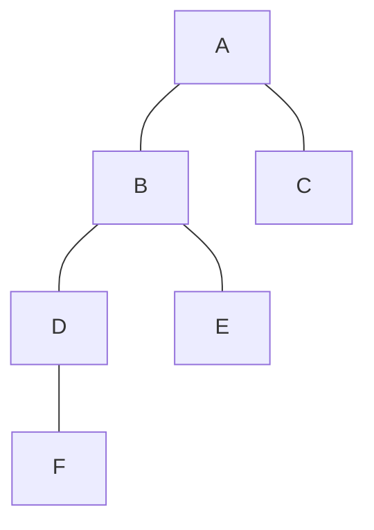
进行一次右旋即可，判断条件为
```c
int balance = nodeHeight(node->left) - nodeHeight(node->right);
if (balance > 1 && key < (node->left->key))
// 如果F的值小于B的值，那么肯定F在D的下面
	return rightRotate(node);
```

2. 在右节点的右子树上插入节点（RR）
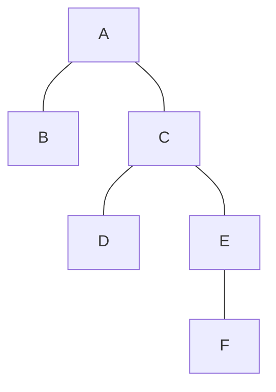
进行一次左旋即可，判断条件为
```c
int balance = nodeHeight(node->left) - nodeHeight(node->right);
if (balance < -1 && key > (node->right->key))   
// 如果F的值大于C的值，那么肯定F在E的下面
	return leftRotate(node);
```

3. 在左节点的右子树上插入节点（LR）
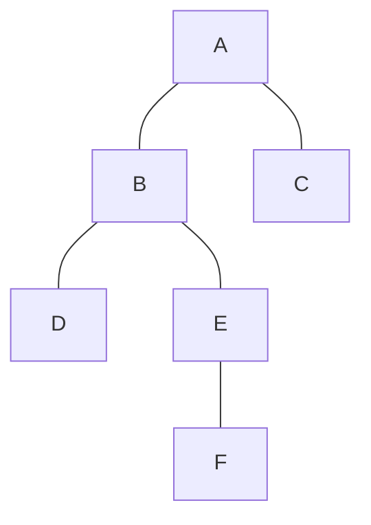
对A节点的左节点B进行左旋操作，再对A节点进行右旋操作，此时根节点变为E，判断条件为
```c
avlNode *LeftRightRotate(avlNode *z)
{
    z->left = leftRotate(z->left);
    return (rightRotate(z));
}
int balance = nodeHeight(node->left) - nodeHeight(node->right);
if (balance > 1 && key > (node->left->key))
// 如果F的值大于B的值，那么肯定F在E的下面
	node = LeftRightRotate(node);
```

4.  在右节点的左子树上插入节点（RL）
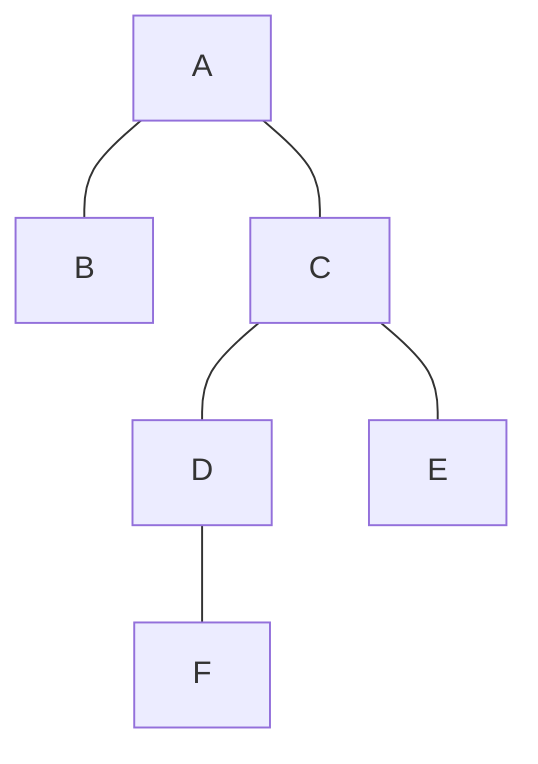
对A节点的右节点C进行右旋操作，再对A节点进行左旋操作，此时根节点变为D，判断条件为
```c
avlNode *RightLeftRotate(avlNode *z)
{
    z->right = rightRotate(z->right);
    return (leftRotate(z));
}
int balance = nodeHeight(node->left) - nodeHeight(node->right);
if (balance < -1 && key < (node->right->key))
// 如果F的值小于C的值，那么肯定F在D的下面
	node = RightLeftRotate(node);
```

#### 删除节点
在AVL树中删除节点时，需要考虑删除的节点是否有子节点，如果无节点，可以直接置为NULL；如果存在一个子节点，则将该子节点的值赋给该节点；如果存在两个子节点，在右子树中找到最小值的一个节点，将最小节点赋给要删除的节点，同时删除右子树的最小节点。删除节点后，还需要对树进行平衡（也需要分成四种情况）。
对于AVL树来说，插入和删除时的旋转比较耗时的，因此常用于插入和删除次数少，但查找次数多的场景。

### 红黑树
[一文带你彻底读懂红黑树（附详细图解） - 知乎 (zhihu.com)](https://zhuanlan.zhihu.com/p/91960960)
[C/data_structures/binary_trees/red_black_tree.c · TheAlgorithms/C (github.com)](https://github.com/TheAlgorithms/C/blob/master/data_structures/binary_trees/red_black_tree.c)
[Insertion in Red-Black Tree - GeeksforGeeks](https://www.geeksforgeeks.org/insertion-in-red-black-tree/)

与AVL树类似，红黑树也是一种自平衡的查找树，红黑树通过如下性质实现自平衡：
>1. 节点是红色或者黑色
>2. 根是黑色
>3. 所有叶子都是黑色（叶子是NIL节点）
>4. 每个红色节点必须有两个黑色的子节点（从每个叶子到根的所有路径上不能有两个连续的红色节点。）
>5. 从任一节点到其每个叶子的所有简单路径都包含相同数目的黑色节点。

红黑树中也有左旋和右旋的操作，红黑树的节点的定义如下：
```c
typedef struct node
{
    int val;
    struct node *par;
    struct node *left;
    struct node *right;
    int color;
} Node;
```
#### 插入节点
红黑树的插入过程和二叉查找树插入过程基本类似，不同的地方在于，红黑树在插入新节点后，需要进行调整，以满足红黑树的性质。在插入一个新节点时，最好插入一个红色的节点，插入一个黑色节点会导致调整起来比较麻烦。如果插入红色节点，此时所有路径上的黑色节点数量不变，那么仅仅有可能出现两个连续红色节点，通过变色和旋转即可，相对来说比较简单。当插入的节点为红色节点时，一共有5种情况。
1. 插入的新节点`N`是红黑树的根节点，这个时候直接把节点`N`的颜色变为黑色即可，可以满足性质2（根节点为黑色），性质5（任一节点到其每个叶子的所有简单路径都包含相同数目的黑色节点）；
2. `N`的父节点是黑色，此时无需调整；
3. `N`的父节点`P`为红色，叔叔节点`U`也为红色，此时`P`的父节点`G`肯定为黑色，如下图所示（G_B表示黑色节点G），此时性质4被打破，需要进行调整

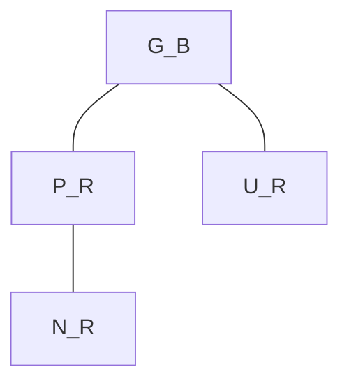
调整方法为将P和U染成黑色，再将G染成红色，需要注意的是G染成红色时，可能会和它的父节点形成连续的红色节点，需要递归向上调整。
4. `N`的父节点`P`为红色，叔叔节点`U`为黑色，节点`N`是`P`的右节点，且`P`是`G`的左节点，如下图所示：
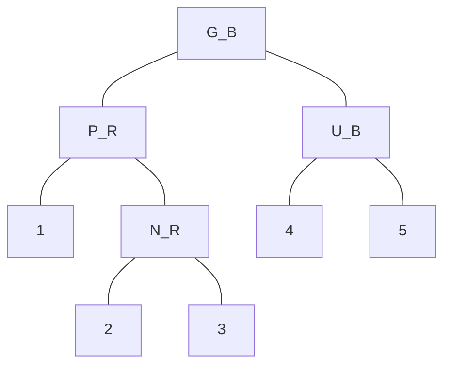
此时需要对节点`P`进行左旋，调整`N`和`P`的位置，接下来按性质5处理。注意此处的`N`并非新节点，而是`N`所在的树中插入了节点导致`N`变成红色（参考第3种情况）。
5. `N`的父节点`P`为红色，叔叔节点`U`为黑色，节点`N`是`P`的左节点，且`P`是`G`的左节点，如下图所示：
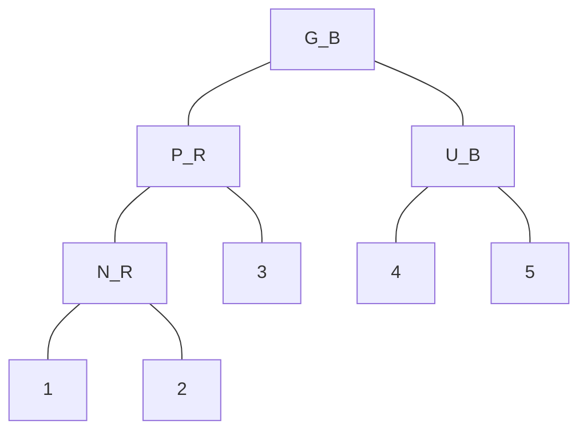

对`G`进行右旋，调整`P`和`G`的位置，并互换颜色，`P`变为黑色，`G`变为红色。

#### 删除节点
删除操作首先要确定待删除节点有几个孩子，如果有两个孩子，不能直接删除该节点。而是要先找到该节点的前驱（该节点左子树中最大的节点）或者后继（该节点右子树中最小的节点），然后将前驱或者后继的值复制到要删除的节点中，最后再将前驱或后继删除。
红黑树删除操作的复杂度在于删除节点的颜色，当删除的节点是红色时，直接拿其孩子节点补空位即可。因为删除红色节点，性质5（从任一节点到其每个叶子的所有简单路径都包含相同数目的黑色节点）仍能够被满足。
当删除的节点是黑色时，那么所有经过该节点的路径上的黑节点数量少了一个，破坏了性质5。如果该节点的孩子为红色，直接拿孩子节点替换被删除的节点，并将孩子节点染成黑色，即可恢复性质5。但如果孩子节点为黑色，处理起来就要复杂的多。分为6种情况。
为了方便说明，假设最终被删除的节点为`X`（至多只有一个孩子节点），其子节点为`N`，`X`的兄弟节点为`S`，`S`的左节点为`SL`，右节点为`SR`。接下来讨论是建立在节点`X`被删除，节点`N`替换`X`的基础上进行的。
**删除前**
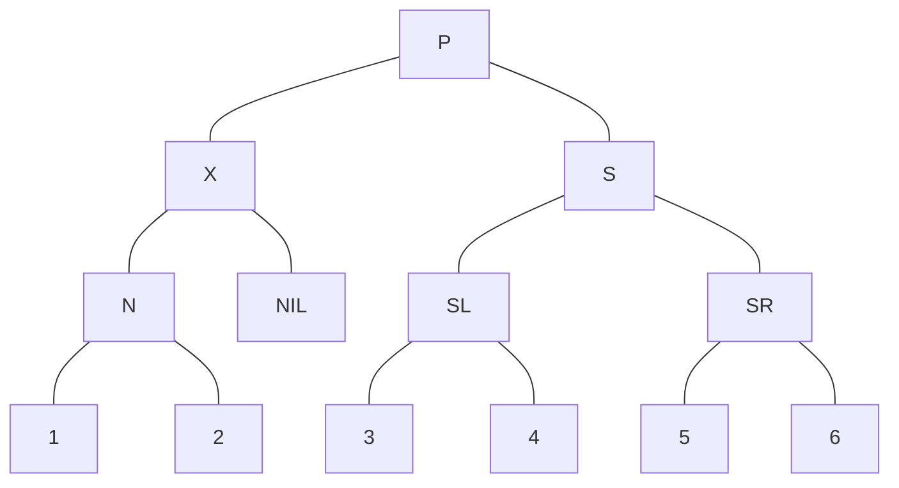
**删除X后**
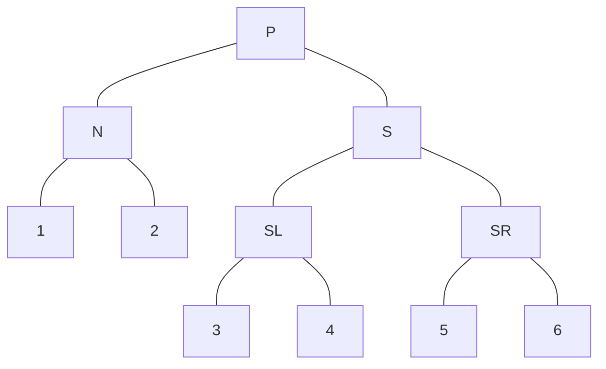
此时有6种情况：
1. N是新的根，则表明被删除的X就是原来的根，由于假设X只有一个子节点，则N可能为空节点（叶子节点）或者一个红色节点加上空节点，此时将N放到根的位置，并染成黑色
2. S节点是红色，而其它节点是黑色，这是可以对N的父节点进行左旋操作，然后互换P与S的颜色。
后面直接参考原文吧

## 其他

### 哈希函数
**应用**
1. 防止数据被篡改，数字签名，如MD5算法
2. 资源的唯一标识，如通过哈希值判断图片是否在图库中
3. 数据校验，防止数据传输不完整
4. 散列函数，主要关注散列后的值是否均匀分布
5. 复杂均衡，如对客户端IP地址计算哈希值，将取得的哈希值与服务器列表的大小取模得到被路由到的服务器编号
......

#### Adler-32
[Adler-32 - HandWiki](https://handwiki.org/wiki/Adler-32)
Adler-32几乎与CRC-32一样可靠，但是可以更快地计算出来，该算法在FastLZ、zlib等压缩算法中被广泛使用，与相同长度的循环冗余校验（CRC）相比，它以可靠性换取速度。Adler-32比Fletcher-16更可靠，但是与Fletcher-32相比稍逊一筹。
Adler-32的校验和是通过计算两个16位的校验和A和B，然后连接它们获得的。A初始化为1，B初始化为0，校验和在计算时需要取65521（最大的小于$2^16$的素数）余数。假设D是字符流，n为D的长度，A和B的计算公式如下
$$
\eqalign{
  & A = 1 + {D_1} + {D_2} +  \cdots  + {D_n}\left( {\bmod 65521} \right)  \cr 
  & B = \left( {1 + {D_1}} \right) + \left( {1 + {D_1} + {D_2}} \right) +  \cdots  + \left( {1 + {D_1} + {D_2} +  \cdots  + {D_n}} \right)\left( {\bmod 65521} \right)  \cr 
  &  = n \times {D_1} + \left( {n - 1} \right) \times {D_2} +  \cdots  + {D_n} + n\left( {\bmod 65521} \right)  \cr 
  & Adler - 32(D) = B \times 65536 + A \cr} 
$$
从A和B的计算公式中可以看出，Adler-32可以用于**流加密**或**实时加密**，c语言实现如下：
```c
const uint32_t MOD_ADLER = 65521;
uint32_t adler32(unsigned char *data, size_t len) 
/* 
    where data is the location of the data in physical memory and 
    len is the length of the data in bytes 
*/
{
    uint32_t a = 1, b = 0;
    size_t index;
    // Process each byte of the data in order
    for (index = 0; index < len; ++index)
    {
        a = (a + data[index]) % MOD_ADLER;
        b = (b + a) % MOD_ADLER;
    }
    return (b << 16) | a;
}
```
还有更加高效的算法，将数据流分成数千个字符一段，每隔一段才进行一次取余，计算如下
```javascript
function adler32_bstr(bstr, seed) {
	var a = 1, b = 0, L = bstr.length, M = 0;
	if(typeof seed === 'number') { a = seed & 0xFFFF; b = seed >>> 16; }
	for(var i = 0; i < L;) {
		M = Math.min(L-i, 2654)+i;   // 这里使用的是最长2654个字符一段
		for(;i<M;i++) {
			a += bstr.charCodeAt(i)&0xFF;
			b += a;
		}
		a = (15*(a>>>16)+(a&65535));
		b = (15*(b>>>16)+(b&65535));
	}
	return ((b%65521) << 16) | (a%65521);
}
```

**优缺点**
+ 与标准CRC-32一样，Adler-32校验和可以很容易地伪造，因此对于防止故意修改是不安全的；
+ 在许多情况下比CRC-32快；
+ 对于几百个字符的短消息的，校验效果差，因为难以覆盖32个bit）最大的128个字符之和为32640，小于65521，这意味着有一半的空间没有使用）。

#### BLAKE2
[BLAKE (hash function) - HandWiki](https://handwiki.org/wiki/BLAKE_(hash_function)#BLAKE2)
BLAKE2是一种基于BLAKE的密码学哈希函数，设计目标是替代MD5和SHA-1等常用但存在缺陷的算法，BLAKE2比MD5、SHA-1、SHA-2和SHA-3都要快，能够提供和SHA-3类似的安全性。

#### CRC
[Cyclic redundancy check - HandWiki](https://handwiki.org/wiki/Cyclic_redundancy_check)
CRC（Cyclic redundancy checks，循环冗余校验），有CRC-16、CRC-32、CRC-64等变体。CRC是一种常用于数字网络和存储设备中的检测突发错误的检测码。
使用CRC校验时，发送方和接收方使用同一个生成多项式$g(x)$（GF(2)多项式）。
**发送方**
（1）在发送的`m`位数据后添加`r`个0，其中`r`为$g(x)$的最高阶数，也是CRC-XX对应的数字，这`r`个0将对应`r`位的校验码；
（2）用数据和$g(x)$作异或，得到`r`位的余数；
（3）将这`r`位余数加到数据后面，这样就生成了`m+r`位的发送数据
**接收方**
接收`m+r`位的数据，将这`m+r`位数据与$g(x)$异或，如果`r`位余数为0，则表示传输过程中无错误发生。
注意：这里的异或相当于数据对应的多项式$m(x)$除以$g(x)$，所以异或并不是只做一次，而是$m(x)$中未与$g(x)$异或的数据中，首项为1，且长度大于等于r。
以11010011101100为例，生成多项式为$x^3+x+1$，即1011
*****
11010011101100 000    补上r=3位0
1011
01100011101100 000   因为后面还有1，所以移动一位
  1011
00111011101100 000    
    1011
00010111101100 000
      1011
00000001101100 000  此处移动4位来匹配到下一个1
               1011
00000000110100 000   
                 1011
00000000011000 000
                    1011
00000000001110 000
                      1011
00000000000101 000  
                        101 1
00000000000000 100  现在m+r位数据中首项为1的只剩下3位，停止异或操作
*****
对于CRC-32，使用的是$g(x)$为
$$
\eqalign{
  & g(x) = {x^{32}} + {x^{26}} + {x^{23}} + {x^{22}} + {x^{16}} + {x^{12}} + {x^{11}}  \cr 
  &  + {x^{10}} + {x^8} + {x^7} + {x^5} + {x^4} + {x^2} + x + 1 \cr} 
$$
CRC实现算法
```c
// 以4 byte数据为例
#define POLY 0x04C11DB7 // CRC32生成多项式
unsigned int CRC32_2(unsigned int data)
{
	unsigned char p[8];
	memset(p, 0, sizeof(p));
	memcpy(p, &data, 4);
	unsigned int reg = 0, sum_poly = 0;
	for(int i = 0; i < 8; i++)
	{
		// 计算步骤1
		sum_poly = reg&0xFF000000;
		for(int j = 0; j < 8; j++)
		{
			int hi = sum_poly&0x80000000; // 测试reg最高位
			sum_poly <<= 1;
			if(hi) sum_poly = sum_poly^POLY;
		}
		// 计算步骤2
		reg = (reg<<8)|p[i];
		reg = reg ^ sum_poly;
	}
	return reg;
}
```
另外一种实现算法：
```c
uint32_t crc32(const char* s)
{
    uint32_t crc = 0xffffffff;  
    size_t i = 0;
    while (s[i] != '\0')
    {
        uint8_t byte = s[i];
        crc = crc ^ byte;
        for (uint8_t j = 8; j > 0; --j)
        {
            crc = (crc >> 1) ^ (0xEDB88320 & (-(crc & 1)));
            // 0xEDB88320是g(x)的一种LSB表示即
            // 1x^0+1x^1+1x^2+...+0x^27+0x^28+0x^29+0x^30+0x^31，注意不包括x^32
            // 即1110 1101 1011 1000 1000 0011 0010 0000 
            // 即0xEDB88320
        }
        i++;
    }
    return crc ^ 0xffffffff;
}
```

#### MD5
md5算法的应用场景包括：文件认证，密码存储等
md5算法的计算步骤如下：
1. 对原信息进行补充使其比特长度为$N\mod 512 = 448$，所以补充的比特长度为
$$
L = 512 * n - 64, \; n=1,2,3,...
$$
填充的方法为：
（1）在信息的后面填充一个1和若干个0，直到满足$L=512*n-64$的长度；
（2）在（1）的基础上，附加一个以64位二进制表示的填充前信息长度，如果二进制表示的填充前信息长度超过64位，则取低64位。
2. 初始化四个变量，每个变量的位数为32位，这四个变量级联起来便是128位的md5值。
```python
J = 0x67425301
K = 0xEDFCBA45
L = 0x98CBADFE
M = 0x13DCE476
```
3. 对每个512位的块进行处理，其中在4轮中共有64次操作，每一轮有16次操作（16次操作，每次正好处理32位的数据）。第一轮使用F函数，第二轮使用G函数，第三轮使用H函数，第四轮使用I函数。
$$
\eqalign{
  & F(K,L,M) = \left( {K\;{\rm{AND}}\;L} \right)\;{\rm{OR}}\;\left( {\left( {{\rm{NOT}}\;K} \right)\;{\rm{AND}}\;M} \right)  \cr 
  & G(K,L,M) = \left( {K\;{\rm{AND}}\;L} \right)\;{\rm{OR}}\;\left( {\left( {{\rm{NOT}}\;M} \right)\;{\rm{AND}}\;L} \right)  \cr 
  & H(K,L,M) = K\;{\rm{XOR}}\;L\;{\rm{XOR}}\;M  \cr 
  & I(K,L,M) = L\;{\rm{XOR}}\;\left( {\left( {{\rm{NOT}}\;M} \right)\;{\rm{OR}}\;K} \right) \cr} 
$$
在每次操作后，对于输出进行下面的操作：
$$
A(b,{C_j},O,s,{t_i}):J = b[1] + \left( {\left( {b[0] + O(b[1],b[2],b[3]) + {C_j} + {t_i}} \right) <  < s} \right)
$$
其中$O$为$F$、$G$、$H$和$I$中的一个，$C_j,0\le j\le15$为32位的文本内容，是512位块的一个子分组，$t_i,0\le i\le63$是一个常数${t_i} = \left[ {{2^{32}}{\mathop{\rm abs}\nolimits} (\sin (i))} \right]$，$[x]$是取整函数，$i$是弧度制，$<<$表示循环移位，$s$是自定义的整数。$b$是一个四元组，初始化为$\left[ {J,K,L,M} \right]$，每次完成计算后，$b$会循环赋值，即
$$
b[0] \to tmp,b[3] \to b[0],b[2] \to b[3],b[1] \to b[2],tmp \to b[1]
$$
4. 完成第三步的计算后，将最后计算得到的$\left[ {J,K,L,M} \right]$加上第2步初始化时对应的值，级联在一起即为最后的md5值。
**代码实现**：[md5/src/md5.cpp at master · JieweiWei/md5 (github.com)](https://github.com/JieweiWei/md5/blob/master/src/md5.cpp)

#### SHA2
SHA-2，名称来自于安全散列算法2（英语：Secure Hash Algorithm 2）的缩写，一种密码散列函数算法标准，其下可以分为SHA-256、SHA-512等。
以SHA-256为例，SHA-256在计算之前也要进行补位和分块，基本思路与MD5一致，详细计算过程见
[一文读懂SHA256算法原理及其实现 - 知乎 (zhihu.com)](https://zhuanlan.zhihu.com/p/94619052)


### 滚动哈希

滚动哈希是一种哈希函数，其输入的内容在一个固定大小的窗口中进行移动哈希计算，可以为文件中的每个位置产生伪随机输出。

#### Rabin指纹

给定一个k位的信息$m_0m_1...,m_{k-1}$，Rabin指纹将其视为有限域的k-1次多项式
$$
f(x)=m_0+m_1x+\cdots+m_{k-1}x^{k-1}
$$

#### 多项式滚动哈希

又称为Rabin-Karp滚动哈希，最常用的滚动哈希定义为
$$
H(c_1,c_2,\cdots,c_k)=c_1a^{k-1}+c_2a^{k-2}+\cdots+c_k
$$
其中a是质数，$c_1,c_2,\cdots,c_k$是滑动窗口中的字符，可以计算下一个输入字符的哈希值：
$$
\eqalign{
  & H({c_2},{c_3}, \cdots ,{c_{k + 1}}) = {c_2}{a^{k - 1}} + {c_3}{a^{k - 2}} +  \cdots  + {c_{k + 1}}  \cr 
  &  = \left( {H({c_1},{c_2}, \cdots ,{c_k}) - {c_1}{a^{k - 1}}} \right)a + {c_{k + 1}} \cr}
$$

#### 循环多项式滚动哈希

该算法需要一个将字符映射到属于区间$[0,2^L)$的随机整数的哈希函数h，令函数s表示向左循环移位，$\oplus$表示按位异或的操作，循环多项式滚动哈希的定义如下：
$$
H({c_1},{c_2}, \cdots ,{c_k}) = {s^{k - 1}}(h({c_1})) \oplus {s^{k - 2}}h({c_2}) \oplus  \cdots  + s(h({c_{k - 1}})) \oplus h({c_k})
$$
可以通过滚动哈希的计算方式获得下一个输入的哈希结果：
$$
\eqalign{
  & H({c_2},{c_3}, \cdots ,{c_{k + 1}}) = {s^{k - 1}}(h({c_2})) \oplus {s^{k - 2}}h({c_3}) \oplus  \cdots  + s(h({c_k})) \oplus h({c_{k + 1}})  \cr 
  &  = s\left( {H({c_1},{c_2}, \cdots ,{c_k})} \right) \oplus {s^k}(h({c_1})) \oplus {c_{k + 1}} \cr}
$$

#### Gear滚动哈希

Gear滚动哈希的计算方式如下：
$$
H({c_1},{c_2}, \cdots ,{c_k}) = \sum\limits_{i = 1}^k {Gear[{C_i}]*{2^{k - i}}} \bmod {2^n}
$$

$$
H({c_2},{c_3}, \cdots ,{c_{k + 1}}) = H({c_1},{c_2}, \cdots ,{c_k})*2 + Gear[{C_{k + 1}}]\bmod {2^n}
$$

