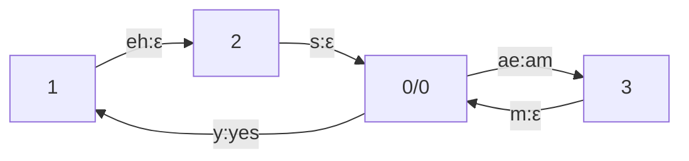
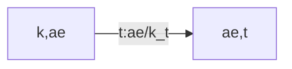
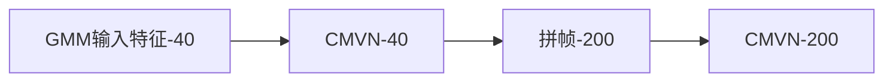

## 一个简单的例子：YESNO

### 概要

这个示例可以直接运行
```sh
cd kaldi/egs/yesno/s5/
sh run.sh
```

yesno目录结构为
```sh
aistudio@jupyter-840430-7476360:~/kaldi-trunk/egs/yesno$ ls -R
.:
README.txt  s5

./s5:
conf  input  local  path.sh  run.sh  steps  utils

./s5/conf:
mfcc.conf  topo_orig.proto

./s5/input:
lexicon_nosil.txt  lexicon.txt  phones.txt  task.arpabo

./s5/local:
create_yesno_txt.pl               create_yesno_wav_scp.pl  prepare_dict.sh  score.sh
create_yesno_waves_test_train.pl  prepare_data.sh          prepare_lm.sh
```

### 脚本解析

1. 脚本前两行设置了 `train_cmd` 和 `decode_cmd` 这两个变量：
```sh
train_cmd="utils/run.pl"
decode_cmd="utils/run.pl"

# 在后面的训练中使用
steps/train_mono.sh --nj 1 --cmd "$train_cmd" --totgauss 400 data/train_yesno data/lang exp/mono0a 
```

kaldi的许多脚本都允许设置 cmd 参数，在本例中 cmd 参数为 `utils/run.pl`。

`utils/run.pl`的作用的是多任务地执行某个程序，可以独立使用，如
```sh
utils/run.pl JOB=1:8 tmp/log.JOB.txt  echo "hello JOB"
```
这段指令会执行8次 `echo "hello JOB"`，并将结果分别写在 `tmp/log.JOB.txt` 文件夹中。
其中的一个日志文件 `tmp/log.1.txt` 的结果如下：
```txt
# echo "hello 1" 
# Started at Fri Feb 23 08:47:29 CST 2024
#
hello 1
# Accounting: time=0 threads=1
# Ended (code 0) at Fri Feb 23 08:47:29 CST 2024, elapsed time 0 seconds
```

除了 `utils/run.pl`，kaldi 还提供了 `utils/queue.pl` 和 `utils/slurm.pl` 这两个功能相似的脚本，不过这两个脚本会把命令提供到计算机集群上执行，而 `utils/run.pl` 会在本地运行。

2. 设置完 `train_cmd` 和 `decode_cmd` 这两个参数后，`run.sh` 会去 http://www.openslr.org 下载数据并解压。

```sh
if [ ! -d waves_yesno ]; then
  wget http://www.openslr.org/resources/1/waves_yesno.tar.gz || exit 1;
  # was:
  # wget http://sourceforge.net/projects/kaldi/files/waves_yesno.tar.gz || exit 1;
  tar -xvzf waves_yesno.tar.gz || exit 1;
fi
```

通常来说一个数据集除了有音频还应该有对应的文本信息，但是由于这个数据集非常简单，所以文本直接在文件名中体现，1 代表 YES，0 代表 NO，如文件名 `0_1_1_0_0_1_1_1.wav` 表示文本为 `NO YES YES NO NO YES YES YES`。
接下来需要将数据整理成 kaldi 规定的数据文件夹形式，并且划分数据集：
```sh
local/prepare_data.sh waves_yesno
```
该脚本会生成 `data/local`、`data/test_yesno`（测试集）、`data/train_yesno`（训练集）

```sh
./data/local:
lm_tg.arpa  test_yesno.txt  test_yesno_wav.scp  train_yesno.txt  train_yesno_wav.scp  waves_all.list  waves.test  waves.train

./data/test_yesno:
spk2utt  text  utt2spk  wav.scp

./data/train_yesno:
spk2utt  text  utt2spk  wav.scp
```

我们可以查看这些文件的前几行：
```sh
~/kaldi-trunk/egs/yesno/s5/data/train_yesno$ head -n 3 *
==> spk2utt <==
global 0_0_0_0_1_1_1_1 0_0_0_1_0_0_0_1 0_0_0_1_0_1_1_0 0_0_1_0_0_0_1_0 0_0_1_0_0_1_1_0 0_0_1_0_0_1_1_1 0_0_1_0_1_0_0_0 0_0_1_0_1_0_0_1 0_0_1_0_1_0_1_1 0_0_1_1_0_0_0_1 0_0_1_1_0_1_0_0 0_0_1_1_0_1_1_0 0_0_1_1_0_1_1_1 0_0_1_1_1_0_0_0 0_0_1_1_1_0_0_1 0_0_1_1_1_1_0_0 0_0_1_1_1_1_1_0 0_1_0_0_0_1_0_0 0_1_0_0_0_1_1_0 0_1_0_0_1_0_1_0 0_1_0_0_1_0_1_1 0_1_0_1_0_0_0_0 0_1_0_1_1_0_1_0 0_1_0_1_1_1_0_0 0_1_1_0_0_1_1_0 0_1_1_0_0_1_1_1 0_1_1_1_0_0_0_0 0_1_1_1_0_0_1_0 0_1_1_1_0_1_0_1 0_1_1_1_1_0_1_0 0_1_1_1_1_1_1_1

==> text <==
0_0_0_0_1_1_1_1 NO NO NO NO YES YES YES YES
0_0_0_1_0_0_0_1 NO NO NO YES NO NO NO YES
0_0_0_1_0_1_1_0 NO NO NO YES NO YES YES NO

==> utt2spk <==
0_0_0_0_1_1_1_1 global
0_0_0_1_0_0_0_1 global
0_0_0_1_0_1_1_0 global

==> wav.scp <==
0_0_0_0_1_1_1_1 waves_yesno/0_0_0_0_1_1_1_1.wav
0_0_0_1_0_0_0_1 waves_yesno/0_0_0_1_0_0_0_1.wav
0_0_0_1_0_1_1_0 waves_yesno/0_0_0_1_0_1_1_0.wav
```

每个句子都被指定了一个唯一的 ID。`wav.scp` 文件记录每个 ID 的音频文件路径， `text` 文件记录每个 ID 的文本内容，`spk2utt` 文件和 `utt2spk` 文件记录每个 ID 的说话人信息，由于只有一个人，所以统一为 global。

3. 除了下载数据，还需要手动准备一些资源，在本例中，已经由贡献者准备好了，放在 input 文件夹中。
首先是发音词典 `lexicon.txt`：
```txt
<SIL> SIL
YES Y
NO N
```
该文件给出了 YES，NO 和 `<SIL>` 这三个单词的音素序列，其中 `<SIL>` 表示静音。由于本例中单词简单，所以每个单词只用一个音素表示。`lexicon_nosil.txt` 和 `lexicon.txt` 内容相同，只是去掉了 `<SIL>` 。
`phones.txt` 给出了音素集
```txt
SIL
Y
N
```

`task.arpabo` 是语言模型，一般情况下语言模型需要训练得到，但是本例十分简单，所以可以直接书写。
```txt
\data\
ngram 1=4

\1-grams:
-1	NO
-1	YES
-99 <s>
-1 </s>

\end\
```
语言模型定义了识别空间，只可能是 YES 和 NO 这两个单词，且出现频率相等。

4. 数据文件夹生成后，就可以根据其中的文本信息，以及事先准备好的发音词典 `lexicon.txt` 等文件，生成语言文件夹：
```sh
local/prepare_dict.sh
utils/prepare_lang.sh --position-dependent-phones false data/local/dict "<SIL>" data/local/lang data/lang
local/prepare_lm.sh
```
前两行脚本读取 input 的资源文件，生成  `data/lang` 目录。这个目录是 kaldi 标准的语言文件夹，存储了待识别语言的单词集、音素集等信息。第三行脚本把模型构建成图的形式。

5. 接下来是定义声学特征，这是训练声学模型的前提：

```sh
# Feature extraction
for x in train_yesno test_yesno; do 
 steps/make_mfcc.sh --nj 1 data/$x exp/make_mfcc/$x mfcc
 steps/compute_cmvn_stats.sh data/$x exp/make_mfcc/$x mfcc
 utils/fix_data_dir.sh data/$x
done
```

脚本执行完之后，`train_yesno` 目录和 `test_yesno` 目录下将分别生成 `feat2.scp` 文件，里面记录了每个 ID 的声学特征存储位置。（声学特征存储在 `yesno/s5/mfcc`）

6. 下面是声学模型训练和测试阶段。由于这个示例的任务比较简单，因此只需训练最简单的声学模型：
```sh
steps/train_mono.sh --nj 1 --cmd "$train_cmd" --totgauss 400 data/train_yesno data/lang exp/mono0a
```

脚本执行完之后，声学模型存储在 `exp/mono0a` 目录下。至此，模型训练完毕。下面进入识别过程（解码），解码前需要构建状态图：

```sh
utils/mkgraph.sh data/lang_test_tg exp/mono0a exp/mono0a/graph_tgpr
```
构建好状态图后，可以进行解码：
```sh
steps/decode.sh --nj 1 --cmd "$decode_cmd" exp/mono0a/graph_tgpr data/test_yesno exp/mono0a/decode_test_yesno
```
识别结果输出到 `exp/mono0a/decode_test_yesno` 下面了，在`exp/mono0a/decode_test_yesno/scoring_kaldi/penalty_0.0/10.txt` （解码时调用了 `score.sh`）可以看到识别结果：
```txt
1_0_0_0_0_0_0_0 YES NO NO NO NO NO NO NO 
1_0_0_0_0_0_0_1 YES NO NO NO NO NO NO YES 
1_0_0_0_0_0_1_1 YES NO NO NO NO NO YES YES 
1_0_0_0_1_0_0_1 YES NO NO NO YES NO NO YES 
1_0_0_1_0_1_1_1 YES NO NO YES NO YES YES YES 
```
最后运行来找到最好的解码器输出。
```sh
for x in exp/*/decode*; do [ -d $x ] && grep WER $x/wer_* | utils/best_wer.sh; done
```


## 数据整理

数据处理时一般使用通用脚本文件夹 `utils` （`egs/wsj`）中 `data` 文件夹的脚本，这些脚本的输入和输出都是文件夹。在 kaldi 的脚本定义中，一个数据文件夹是其包含的若干数据形成的一个数据集，文件夹中的表单文件定义了这个数据集的所有信息，如音频文件路径、标注内容、特征文件路径、说话人信息等。

### 列表类数据表单

1. 句子音频表单 `wav.scp`

表单元素为音频文件或音频处理工具输出的通道，每个元素可以表示为一个切分后的句子，也可以表示为包含多个句子的未切分整段音频。例如，说话人 speaker1 录制了一段阅读段落，保存为 ch1.wav。如果已经划分为多个单句音频，则音频表单内容为：
```txt
speaker1_ch1_utt1 /path/to/speaker1/ch1 _utt1.wav
speaker1_ch1_utt2 /path/to/speaker1/ch1 _utt2.wav
...
```
如果没有切分，则音频表单内容为
```txt
speaker1_ch1 /path/to/speaker1/ch1.wav
```
这种未分段的音频表单需要配合切分表单使用。
还有表单元素为音频处理工具输出的通道的情况，如

> `timit/s5/data/train/wav.scp`

```txt
FAEM0_SI1392 /home/aistudio/kaldi-trunk/egs/timit/s5/../../../tools/sph2pipe_v2.5/sph2pipe -f wav /home/aistudio/timit/TRAIN/DR2/FAEM0/SI1392.WAV |
FAEM0_SI2022 /home/aistudio/kaldi-trunk/egs/timit/s5/../../../tools/sph2pipe_v2.5/sph2pipe -f wav /home/aistudio/timit/TRAIN/DR2/FAEM0/SI2022.WAV |
...
```


2. 声学特征表单 `feats.scp`

表单元素为保存声学特征的文件，每个元素表示一个句子。这个表单有两种生成方式，一种是使用 kaldi 通用声学特征提取脚本从音频中提取，同时生成一个用于保存声学特征的二进制存档表单；另外一种是将其它工具（HTK或Sphinx）提取的声学特征转成 kaldi 声学特征。

> `timit/s5/data/train/cmvn.scp`

```txt
FAEM0_SI1392 /home/aistudio/kaldi-trunk/egs/timit/s5/mfcc/raw_mfcc_train.1.ark:13
FAEM0_SI2022 /home/aistudio/kaldi-trunk/egs/timit/s5/mfcc/raw_mfcc_train.1.ark:6313
FAEM0_SI762 /home/aistudio/kaldi-trunk/egs/timit/s5/mfcc/raw_mfcc_train.1.ark:9349
```


3. 谱特征归一化表单 `cmvn.scp`
表单元素为用 kaldi 通用声学特征处理脚本提取的谱归一化系数文件，其归一化可以以句子为单位，也可以以说话人为单位。

> `timit/s5/data/train/cmvn.scp`

```txt
FAEM0 /home/aistudio/kaldi-trunk/egs/timit/s5/mfcc/cmvn_train.ark:6
FAJW0 /home/aistudio/kaldi-trunk/egs/timit/s5/mfcc/cmvn_train.ark:251
FALK0 /home/aistudio/kaldi-trunk/egs/timit/s5/mfcc/cmvn_train.ark:496
```


4. VAD 信息表单 `vad.scp`
表单元素为用 kaldi 的 compute-vad 工具提取的 VAD 信息文件。


### 存档类数据表单

1. 说话人映射表单
表示句子与说话人之间的映射关系，用两个单向映射表示，一个是句子到说话人的映射，文件名为 `utt2spk`；另外一个是说话人到句子的映射，`spk2utt`。

> `timit/s5/data/train/utt2spk`

```txt
FAEM0_SI1392 FAEM0
FAEM0_SI2022 FAEM0
FAEM0_SI762 FAEM0
```

`spk2utt` 可由 `utt2spk` 转换得到，kaldi 提供了 perl 脚本来实现
```perl
#!/usr/bin/env perl

while(<>){ 
    @A = split(" ", $_);
    @A > 1 || die "Invalid line in spk2utt file: $_";
    $s = shift @A;
    foreach $u ( @A ) {
        print "$u $s\n";
    }
}
```

```sh
perl utils/spk2utt_to_utt2spk.pl data/train/utt2spk data/train/spk2utt
```


2. 标注文本表单 `text`
其内容是每一句音频的标注内容，该文件保存的应当是文本归一化之后的内容。归一化是要保证文本中的词都在发音字典和语言模型的词表中，未出现的词都被当做未知词。对于英语，通常将所有的字母统一为大写或小写；对于中文，最基本的要求是完成文本分词。

```txt
FAEM0_SI2022 sil w ah dx aw f ix cl d uh sh iy vcl d r ay v f ao sil
FAEM0_SI762 sil f ih l s epi m ao l hh ow l ix n vcl b ow l w ih th cl k l ey sil
FAEM0_SX132 sil p ax vcl b l ih s ix dx iy eh n ow dx er r ay ix dx iy vcl g ow hh ae n vcl d ix n hh ae n vcl d sil
```


3. 切分信息表单 `segments`

Kaldi 的数据处理以句子为单位，如果音频文件没有按句子划分，就需要将音频的每一句的起止时间记录在 `segments` 文件中。


4. VTLN 相关系数表单
VTLN 是一种说话人自适应技术，在 kaldi 的数据文件中，有三个文本类型的存档文件与此相关，分别是说话人性别映射（`spk2gender`）、说话人卷曲因子映射（`spk2wrap`）和句子卷曲因子映射（`utt2wrap`）。


5. 句子时长表单 `utt2dur`

### 数据文件夹处理脚本

前面介绍了在 Kaldi 的数据文件夹中常见的表单内容，其中有些需要自行准备，包括 `wav.scp`、`text` 和`utt2spk`，其他的文件都可以通过 Kaldi 通用脚本生成。`spk2utt` 文件可以通过脚本由 `utt2spk` 文件生成。`feats.scp` 文件由特征提取生成，如果是用其他工具提取的声学特征，则可以用 `copy-feats` 可执行程序转换 Kaldi 的特征文件，并得到对应的 `feats.scp` 文件。`cmvn.scp` 文件和 `utt2dur` 文件都是由通用脚本生成的。 如果希望使用 Kaldi 中的 VTIN 技术，则要自行准备 `spk2gender` 文件。`utt2warp` 文件和 `spk2warp` 文件都可以用可执行程序 `gmm-global-est-lvtln-trans` 生成。  这些表单文件都保存在 Kaldi 的数据文件夹中，一个数据文件夹包含的数据并不一定在物理意义上保存于同一 个位置，而是通过数据文件夹的形式被定义成一个子集。在 `egs/wsj/s5/utils/data` 文件夹中存放的是用来对数据文件夹进行整体处理的脚本，如下表所示是通用数据文件夹处理脚本的功能。  

| 脚本名                              | 脚本功能                                          |
| -------------------------------- | --------------------------------------------- |
| combine_data.sh                  | 将多个数据文件夹合并为一个，并合并对应的表单                        |
| combine_short_segments.sh        | 合并原文件夹中的短句，创建一个新的数据文件夹                        |
| copy_data_dir.sh                 | 复制原文件夹，创建一个新的数据文件夹，可以指定说话人或句子的前缀、后缀，复制一部分数据   |
| extract_wav_segments_data_dir.sh | 利用原文件夹中的分段信息，切分音频文件，并保存为一个新的数据文件夹             |
| fix_data_dir.sh                  | 为原文件夹保留一个备份，删除没有同时出现在多个表单中的句子，并修正排序           |
| get_frame_shift.sh               | 获取数据文件夹的帧移信息，打印到屏幕                            |
| get_num_frames.sh                | 获取数据文件夹的总帧数信息，打印到屏幕                           |
| get_segments_for_data.sh         | 获取音频时长信息，转换为segments文件                        |
| get_utt2dur.sh                   | 获取音频时长信息，生成utt2dur文件                          |
| limit_feature_dim.sh             | 根据原数据文件夹中的feats.scp.取其部分维度的声学特征，保存到新创建的数据文件夹中 |
| modify_speaker_info.sh           | 修改原数据文件夹中的说话人索引，构造“伪说话人”，保有到新创建的数据文件夹中        |
| perturb_data_dir_speed.sh        | 为原数据文件夹创建一个速度扰动的副本                            |
| perturb_data_dir_volume.sh       | 修改数据文件夹中的wav.scp文件，添加音量扰动效果                   |
| remove_dup_utts.sh               | 删除原数据文件夹中文本内容重复超过指定次数的句子，保存到新创建的数据文件夹中        |
| resample_data_dir.sh             | 修改数据文件夹中的wav.scp文件，修改音频采样率                    |
| shift_feats.sh                   | 根据原数据文件夹中的feats.scp进行特征偏移，保存到新创建的数据文件夹中       |
| split_data.sh                    | 将数据文件夹分成指定数目的多个子集，保存在原数据文件夹中以split开头的目录下      |
| subsegment_data_dir.sh           | 根据一个额外提供的切分信息文件，将原数据文件夹重新切分，创建一个重切分的数据文件夹     |
| subset_data_dir.sh               | 根据指定的方法，创建一个原数据文件夹的子集，保存为新建的数据文件夹             |
| validate_data_dir.sh             | 检查给定数据文件夹的内容，包括排序是否正确、元素索引否对应等<br>            |

在Kaldi的通用脚本中，表单的索引分为三类：句子、音频和说话人。
音频索引的作用是定位数据集中的音频文件；
句子索引定义了 Kaldi 处理数据的基本单元；
说话人索引是 Kaldi 对说话人的广义定义。

### 语言文件夹

kaldi 示例通常将语言文件夹命名为 `data/lang`，要生成语言文件夹，需要先准备好发音词典文件夹（包括 `lexicon.txt`等）。语言文件夹中包括了以下文件：

```sh
data/lang:
L_disambig.fst  L.fst  oov.int  oov.txt  phones  phones.txt  topo  words.txt

data/lang/phones:
align_lexicon.int  disambig.csl         nonsilence.csl        optional_silence.txt  silence.csl           wdisambig_words.int
align_lexicon.txt  disambig.int         nonsilence.int        roots.int             silence.int
context_indep.csl  disambig.txt         nonsilence.txt        roots.txt             silence.txt
context_indep.int  extra_questions.int  optional_silence.csl  sets.int              wdisambig_phones.int
context_indep.txt  extra_questions.txt  optional_silence.int  sets.txt              wdisambig.txt
```

`phones.txt` 和 `words.txt` 两个文件分别定义了音素索引和词索引。在 Kaldi 中，HMM、发音词典和语言模型都是用 FST 描述的，为了节约内存，最好使用整数索引。

`phones.txt` 的内容如下：

```txt
<eps> 0
sil 1
aa 2
ae 3
...
z 47
zh 48
#0 49
#1 50
```

其中 `<eps>` 为空音素，以 `#` 开头的音素称为消歧符号，用于区分同音词。

`words.txt` 的内容如下：

```txt
<eps> 0
aa 1
ae 2
ah 3
...
y 46
z 47
zh 48
#0 49
<s> 50
</s> 51
```

其中 `<s>` 为句首符号，`</s>` 为句尾符号。

`oov.txt`  中存放的是用来表示静音、噪声和集外词。内容如下：

```txt
sil
```

`topo`文件定义了每个音素的 HMM 拓扑结构，

```txt
<Topology>
<TopologyEntry>
<ForPhones>
2 3 4 5 6 7 8 9 10 11 12 13 14 15 16 17 18 19 20 21 22 23 24 25 26 27 28 29 30 31 32 33 34 35 36 37 38 39 40 41 42 43 44 45 46 47 48
</ForPhones>
<State> 0 <PdfClass> 0 <Transition> 0 0.75 <Transition> 1 0.25 </State>
<State> 1 <PdfClass> 1 <Transition> 1 0.75 <Transition> 2 0.25 </State>
<State> 2 <PdfClass> 2 <Transition> 2 0.75 <Transition> 3 0.25 </State>
<State> 3 </State>
</TopologyEntry>
<TopologyEntry>
<ForPhones>
1
</ForPhones>
<State> 0 <PdfClass> 0 <Transition> 0 0.5 <Transition> 1 0.5 </State>
<State> 1 <PdfClass> 1 <Transition> 1 0.5 <Transition> 2 0.5 </State>
<State> 2 <PdfClass> 2 <Transition> 2 0.75 <Transition> 3 0.25 </State>
<State> 3 </State>
</TopologyEntry>
</Topology>
```

对照音素索引文件 `phones.txt`，索引为 2-48 的音素使用3个状态的 HMM 建模，且中间三个状态可以互转。索引为 1 的音素（sil）也使用3个状态的 HMM 建模，且中间三个状态可以互转。

语言文件夹中的 phones 文件夹定义了关于音素的各种属性，如 `silence.txt` 文件存储了所有静音音素的列表。以 `.txt` 为后缀的文件是音素的文件列表，以 `.int` 为后缀的文件保存了对应的音素索引，而已 `.csl` 为后缀的文件将音素索引合并为一行，并以冒号分隔。

`align_lexicon.txt` 的内容是发音词典，将第一列的词重复了一次，用来处理词网络文件和一些识别结果文件。内容如下：

```txt
<eps> <eps> sil
aa aa aa
ae ae ae
ah ah ah
ao ao ao
aw aw aw
```

+ `context_indep.txt`：所有上下文无关音素的列表，也就是说，对于出现在这个列表中的音素，在进行聚类时将不考虑上下文。可以将所有的静音音素定义为上下文无关音素。

+ `disambig.txt`：所有消岐符号的列表，也就是在音素列表中以`#`开头的部分音素。  

+ `extra_questions.txt`：与发音词典文件夹中的同名文件的内容类似，区别是增加了音素位置标记，并对静音音素的聚类方法做了修改，用于音素上下文聚类。  

+ `nonsilence.txt`：所有非静音、非消岐符号的音素列表。  

+ `optional_silence.txt`：词间选择性填充的静音音素的列表，与发音词典文件夹中的同名文件的内容相同。  

+ `sets`：定义了音素组，`roots` 文件定义了哪些音素共享上下文决策树的个根节点。这两个文件都是在上下文聚类中用到的。  
  
+ `silence`：所有静音音素的列表。  

+ `wdisambig_phones.txt`、`wdismbig_words.txt` 和 `wdisambig.txt` 文件的内容分别是消歧符号音素的索引、消岐符号词的索引和消岐符号文本。

+ `word_bounary`：定义了每个音素的词位置，其使用场合与 `align_lexicon.txt` 的使用场合类似。

> 生成语言文件夹的脚本为：`utils/prepare_lang.sh`，由脚本生成的语言文件夹不建议手动修改，只建议修改 HMM 结构


## 经典声学建模

### 特征提取

MFCC是最常用的声学特征，Kaldi 中提供了 `compute-mfcc-feats` 来提取 MFCCs，配置文件在 `s5/conf/mfcc.conf` 中。除了 MFCCs 特征以外，Fbank也是常用的特征（通常用在卷积神经网络中，提取工具为 `compute-fbank-feats`），还有 PLP 特征（提取自线性预测系数，提取工具为 `compute-plp-feats`）。

特征提取完成后，可以通过数据文件夹中的声学特征表单 `s5/data/train/feats.scp` 和倒谱均值方差归一化系数表单 `s5/data/train/cmvn.scp`  获取归一化的特征。在训练声学模型时，通常还要对特征做更多扩展，例如 Kaldi 的单音子模型训练，在谱归一化（CMVN）的基础上做了差分系数（Deltas）的扩展。

Kaldi 通用特征提取脚本放在 steps 文件夹中。其中 `_pitch` 表示加上基频特征，`_pitch_online` 表示加上在线基频特征。在提取特征时，有一个名为 `dither` 的选项，默认值为1，作用是在计算滤波器系数能量时加入随机扰动，防止能量为零的情况出现，但是会造成同一条音频的输出特征不一致，如果需要保持一致，则要在配置文件中设置 `--dither=0`。

### 训练单音子模型

#### 基本概念

在经典语音识别框架中，一个声学模型就是一组 HMM，HMM 的参数由初始概率、转移概率和观察概率三部分构成。对于语音识别框架中的声学模型里的每个 HMM，应当定义该 HMM 中有多少个状态，以及各个状态起始的马尔可夫链的初始概率、各状态间的转移概率及每个状态的概率分布函数。

HMM 状态的物理意义在语音识别中可以被认为是音素的发音状态。习惯上把一个音素的发音状态分为三部分，分别称为初始态、稳定态和结束态。需要说明的是，音素建模的状态个数不一定是三个，只是在传统语音识别方法中用三个状态对音素建模更加常见。 目前 Kaldi 主推的 chain model使用两个状态的建模方法来建模音素的起始帧和其他帧，而在传统的基于 HMM 的语音合成中更常用五个状态对音素建模。  

根据声学模型， 可以计算某帧声学特征在某 一个状态上的声学分（AM score）。这里所说的声学分，指的是该帧声学特征对于该状态的对数观察概率，或者称为对数似然值;  
$$
AmScore(t,i) = \log P(o_t|s_i)
$$
在上式中，`AmScore(t,0)` 是第 t 帧语音声学特征 $o_t$，在第 i 个状态 $s_i$ 上的声学分。观察概率的经典建模方法是高斯混合模型。GMM的思路是使用多个高斯分量加权叠加，拟合出任意分布的概率密度函数。根据多维高斯分布概率公式，可以得到声学分的计算公式为：

$$
\log P({o_t}|{s_i}) = \log \sum\limits_{m =  - 1}^M {{{{c_{i,m}}\exp \left( { - {1 \over 2}{{\left( {{o_t} - {\mu _{i,m}}} \right)}^T}\left( {\Sigma _{i,m}^{ - 1}} \right)\left( {{o_t} - {\mu _{i,m}}} \right)} \right)} \over {{{\left( {2\pi } \right)}^{D/2}}{{\left| {{\Sigma _{i,m}}} \right|}^{1/2}}}}} 
$$
一个 GMM-HMM 声学模型存储的主要参数为各状态和高斯分类的 $\mu_{i,m}$、$\sigma_{i,m}$和 $c_{i,m}$，使用 Kaldi 提供的模型复制工具 `gmm-copy` 可以把模型转为文本格式，模型存储在 `s5/exp/mono/final.mdl`，具体终端命令为：

```sh
$source path.sh
$gmm-copy --binary=false exp/mono/final.mdl exp/mono/final.mdl.txt
```

模型文件由一个 `<TransitionModel>` 和多个 `<DiagGMM>` 构成，`<TransitionModel>` 存储 Transition 模型，定义每个音素有多少个状态构成等信息。`<DiagGMM>` 用于描述状态概率分布，每个 `<DiagGMM>` 就是一个状态高斯分量的概率分布函数。

#### 用于语音识别

在深入声学模型训练的细节前。我们先看一下如何在语音识别的过程中使用一个已经训练好的声学模型。简单地说，识别的过程就是用语音的特征序列去匹配一个状态图搜索最优路径。状态图中有无数条路径，每条路径代表一种可能的识别结果，且都有一个分数，该分数表征语音和该识别结果的匹配程度。判断两条路径的优劣，就是比较这两条路径的分数，分数高的路径更优，即高分路径上的识别结果和声音更匹配。状态图由若干节点和若干条跳转构成，有的跳转对应一个 HMM 状态，并在识别过程中对当前帧计算一个分数，其分数由两部分构成，即声学分和图固有分，两者之和构成了该跳转在当前帧上的分数。

图固有分主要来源于语言模型概率，同时也来源于发音词典的多音词选择概率和 HMM 模型的转移概率。这些概率在状态图的构建过程中就固定在了状态图中，和待识别的语音无关。声学分则是在识别过程中根据声学模型和待识别语音的匹配关系动态计算的，声学模型在语音识别过程中的最主要作用就是计算声学分。

#### 模型初始化

训练脚本 `run.sh` 中的与训练相关的代码为
```sh
steps/train_mono.sh  --nj "$train_nj" --cmd "$train_cmd" data/train data/lang exp/mono

utils/mkgraph.sh data/lang_test_bg exp/mono exp/mono/graph

steps/decode.sh --nj "$decode_nj" --cmd "$decode_cmd" exp/mono/graph data/dev exp/mono/decode_dev

steps/decode.sh --nj "$decode_nj" --cmd "$decode_cmd" exp/mono/graph data/test exp/mono/decode_test
```

`steps/train_mono.sh` 的使用方法为

```sh
steps/train_mono.sh [options] <data-dir> <lang-dir> <exp-dir>
```

在 `steps/train_mono.sh` 中有一个参数 `stage`（用于控制流程） 初始化为 -4，当 `stage` 为 -3 时，开始运行第一个核心模块：使用 `gmm-init-mono` 工具构建初始模型

```sh
gmm-init-mono <topology-in> <dim> <model-out> <tree-out>
```

这里的 `<topology-in>` 指语言文件夹中的 `topo` 文件，如
```sh
$gmm-init-mono topo 39 mono.mdl mono.tree
```

`gmm-init-mono` 仅仅初始化了一个基础模型，后续需要使用训练数据来更新这个模型的参数。

在经典的 HMM 理论中，训练 GMM-HMM 应使用 Baum-Welch 算法，该算法基于期望最大化算法，Kaldi的实现选择了更加直接的方案，将 EM 算法应用到 GMM 参数的更新，称为维特比训练。

#### 对齐

要进行维特比训练，需要解决的一个问题是如何获取每一帧对应的状态号，作为训练的标签。
在 stage = -2 阶段，构建一个直线型的状态图（核心是 `compile-train-graphs`），其内容只包含训练句子的标注文本所对应的状态：

```sh
if [ $stage -le -2 ]; then
  echo "$0: Compiling training graphs"
  $cmd JOB=1:$nj $dir/log/compile_graphs.JOB.log \
    compile-train-graphs --read-disambig-syms=$lang/phones/disambig.int $dir/tree $dir/0.mdl  $lang/L.fst \
    "ark:sym2int.pl --map-oov $oov_sym -f 2- $lang/words.txt < $sdata/JOB/text|" \
    "ark:|gzip -c >$dir/fsts.JOB.gz" || exit 1;
fi
```

接下来，我们需要根据语音帧和已有的声学模型选取状态图中的一条最优路径，把各帧匹配到状态图上去，这样就得到每一帧所对应的状态了。这其实就是一个完整的语音识别过程，只不过把解码路径限制在直线形状态图中，使得识别结果必定是参考文本。这个过程被称作对齐或强制对齐，目的是获取每一帧所对应的状态。Kaldi 使用有限状态转录机（WFST）来构建状态图，状态信息实际上在图的边上而不是在节点上。

#### Transition 模型

`<TransitionModel> ` 分为 `<Topology>`、`<Triples>` 和 `<LogProbs>` 三部分。`<Topology>` 的内容如下：
```txt
<Topology> 
<TopologyEntry> 
<ForPhones> 
2 3 4 5 6 7 8 9 10 11 12 13 14 15 16 17 18 19 20 21 22 23 24 25 26 27 28 29 30 31 32 33 34 35 36 37 38 39 40 41 42 43 44 45 46 47 48 
</ForPhones> 
<State> 0 <PdfClass> 0 <Transition> 0 0.75 <Transition> 1 0.25 </State> 
<State> 1 <PdfClass> 1 <Transition> 1 0.75 <Transition> 2 0.25 </State> 
<State> 2 <PdfClass> 2 <Transition> 2 0.75 <Transition> 3 0.25 </State> 
<State> 3 </State> 
</TopologyEntry> 
<TopologyEntry> 
<ForPhones> 
1 
</ForPhones> 
<State> 0 <PdfClass> 0 <Transition> 0 0.5 <Transition> 1 0.5 </State> 
<State> 1 <PdfClass> 1 <Transition> 1 0.5 <Transition> 2 0.5 </State> 
<State> 2 <PdfClass> 2 <Transition> 2 0.75 <Transition> 3 0.25 </State> 
<State> 3 </State> 
</TopologyEntry> 
</Topology> 
```
这与语言文件夹中的 topo 文件内容完全相同。在 Transition 模型中，每个状态绑定了一个 PdfClass。一般来说，PdfClass 值和 HMM 状态号相同。如果两个状态有相同的 PdfClass 值，则两个状态将共享相同的概率分布函数。

`<Triples>` 由众多三元组构成，每个三元组的定义为 `<音素索引，HMM 状态索引，PDF 索引>`，将所有的三元组放在一起，从 1 开始编号，每个编号对应一个 transition state，这些三元组的个数就是 transition state 的个数。如下面的模型共有 144 个transition state

```txt
<Triples> 144 
1 0 0 
1 1 1 
1 2 2 
...
48 1 142 
48 2 143 
</Triples> 
```

其中 transition state = 3 的元组为 (1, 2, 2)，即对于transition state 3，音素 id 为 1、HMM 状态号为 2、pdf-id 为 2。

转移概率保存在 `<LogProbs>` 中。

#### 模型的迭代

声学模型训练需要对齐结果，而对齐过程又需要声学模型，当只有初始模型 `0.mdl` 时，参数非常粗糙，使用该模型进行对齐的结果非常不准确，但在后面的训练中，会不断使用已训练的模型来重新对齐，然后再次训练，再次对齐，反复迭代，模型逐渐收敛。

Kaldi 采用了一种简单粗暴的方式进行首次对齐，即直接把训练样本按该句的状态个数平均分段，认为每段对应相应的状态：

```sh
if [ $stage -le -1 ]; then
  echo "$0: Aligning data equally (pass 0)"
  $cmd JOB=1:$nj $dir/log/align.0.JOB.log \
    align-equal-compiled "ark:gunzip -c $dir/fsts.JOB.gz|" "$feats" ark,t:-  \| \
    gmm-acc-stats-ali --binary=true $dir/0.mdl "$feats" ark:- \
    $dir/0.JOB.acc || exit 1;
fi
```

在上面的代码中，`align-equal-compiled` 工具用于生成按状态个数平均分段的对齐结果，将对齐结果作为工具 `gmm-acc-stats-ali` 的输入。`gmm-acc-stats-ali` 的输入如下：

```sh
$gmm-acc-stats-ali [options] <model-in> <feature-rspecifier> <alignments-rspecifier> <stats-out>
eg: gmm-acc-stats-ali 0.mdl scp:train.scp ark:1.ali 1.acc
```

`gmm-acc-stats-ali` 工具输入一个初始模型、训练数据及对应的对齐结果，输出用于 GMM 模型参数更新的 ACC 文件。

生成 ACC 文件后，便可使用 `gmm-est` 工具更新 GMM 模型参数了：

```sh
if [ $stage -le 0 ]; then
  gmm-est --min-gaussian-occupancy=3  --mix-up=$numgauss --power=$power \
    $dir/0.mdl "gmm-sum-accs - $dir/0.*.acc|" $dir/1.mdl 2> $dir/log/update.0.log || exit 1;
  rm $dir/0.*.acc
fi
```

上面的代码使用 `gmm-est` 工具，从 `0.mdl` 得到了 `1.mdl`，完成了一次模型参数的迭代。

接下来便是多次调用 `gmm-est` 和 `gmm-acc-stats-ali` 来不断迭代，训练模型。

```sh
x=1
while [ $x -lt $num_iters ]; do
  echo "$0: Pass $x"
  if [ $stage -le $x ]; then
    if echo $realign_iters | grep -w $x >/dev/null; then
      echo "$0: Aligning data"
      mdl="gmm-boost-silence --boost=$boost_silence `cat $lang/phones/optional_silence.csl` $dir/$x.mdl - |"
      $cmd JOB=1:$nj $dir/log/align.$x.JOB.log \
        gmm-align-compiled $scale_opts --beam=$beam --retry-beam=$retry_beam --careful=$careful "$mdl" \
        "ark:gunzip -c $dir/fsts.JOB.gz|" "$feats" "ark,t:|gzip -c >$dir/ali.JOB.gz" \
        || exit 1;
    fi
    $cmd JOB=1:$nj $dir/log/acc.$x.JOB.log \
      gmm-acc-stats-ali  $dir/$x.mdl "$feats" "ark:gunzip -c $dir/ali.JOB.gz|" \
      $dir/$x.JOB.acc || exit 1;

    $cmd $dir/log/update.$x.log \
      gmm-est --write-occs=$dir/$[$x+1].occs --mix-up=$numgauss --power=$power $dir/$x.mdl \
      "gmm-sum-accs - $dir/$x.*.acc|" $dir/$[$x+1].mdl || exit 1;
    rm $dir/$x.mdl $dir/$x.*.acc $dir/$x.occs 2>/dev/null
  fi
  if [ $x -le $max_iter_inc ]; then
     numgauss=$[$numgauss+$incgauss];
  fi
  beam=$regular_beam
  x=$[$x+1]
done
```

一般，最后的模型将会保存为 `final.mdl`。


### 三音字模型的训练

单音子模型的基本假设是：一个音素的实际发音，与其左右相邻的音素无关，该假设并不适用于一些存在协同发音现象的语言。

#### 上下文相关的声学模型

设计建模单元的时候，不仅要考虑中心音素本身，还要考虑该音素所在位置的上下文音素。三音子结构中的每一个音素建模实例，都由其中心音素及其左右各一个上下文音素共同决定。同理，基于上文的双音子指的是向左截取一个相邻音素作为中心音素的上下文。

三音子模型描述的是一个音素模型实例取决与实例中心音素、左相邻音素和右相邻音素，共三个音素；而三状态 HMM 描述的是一个音素模型实例内部由三个 HMM 状态构成，分别捕捉该音素发音时启动、平缓、衰落等动态变化。无论是单音子、三音子，通常使用三状态 HMM 结构来建模。

#### 三音子的聚类裁剪

从单音子模型到三音子模型，带来了模型参数量爆炸的问题，40个单音子的模型转到三音子模型便会有 40×40×40=64000 个参数。多数情况下，训练数据不足以支撑如此多的模型，而且容易导致模型过拟合。

解决方法是将所有的三音子模型放在一起进行相似性聚类，发音相似的三音子被聚类到同一个模型，共享参数，通过人为控制聚类算法最终的类个数，可以有效减少实际模型参数个数。

Kaldi 中的具体实现是，通过决策树算法，将所有需要建模的三音子的 HMM 状态放到决策树的根节点中作为基类。接下来依照一套半自动生成的音素问题集合，对决策树中各个节点的三音子模型的中心音素、上下音素状态进行查询，按照最大似然准则优先进行节点分裂，每次分裂意味着一个新类的生成。通过控制似然阈值进而控制整棵决策树最终的叶子节点个数。


#### Kaldi 中的三音子模型训练流程  

上下文相关声学模型，如三音子模型，其建模训练过程与单音子模型的建模训练过程非常类似。Kaldi 中三音子模型的训练代码如下。和单音子模型的训练一样， 训练之后成的模型对训练数据重新进行对齐，作为后续系统的基础。

```sh
steps/train_deltas.sh --cmd "$train_cmd" $numLeavesTri1 $numGaussTri1 data/train data/lang exp/mono_ali exp/tri1
```

三音子模型的训练由 `steps/train_deltas.sh` 完成，调用方法为：

```sh
steps/train_deltas.sh <num-leaves> <tot-gauss> <data-dir> <lang-dir> <alignment-dir> <exp-dir>
```

`num-leaves`：指定最终的聚类数量，即决策树的叶子节点数量，表示最终系统中实际的 HMM 状态数。

`tot-gauss`：指定语音系统中所有的 GMM 合到一起的高斯总数。

`boost-silence`：大部分情况，保持默认即可。在特殊情况下，因为训练数据中静音数据所占的比例不同，静音模型会表现得过强或过弱，可以为静音模型加入一个人工调节的系数，调节静音模型。

现在具体看一下 `train_deltas.sh` 的内部实现：

```sh
if [ $stage -le -3 ]; then
  echo "$0: accumulating tree stats"
  $cmd JOB=1:$nj $dir/log/acc_tree.JOB.log \
    acc-tree-stats $context_opts \
    --ci-phones=$ciphonelist $alidir/final.mdl "$feats" \
    "ark:gunzip -c $alidir/ali.JOB.gz|" $dir/JOB.treeacc || exit 1;
  sum-tree-stats $dir/treeacc $dir/*.treeacc 2>$dir/log/sum_tree_acc.log || exit 1;
  rm $dir/*.treeacc
fi
```

该脚本读取特征文件及其对应的对齐信息，计算决策树聚类过程中需要的一些统计量（各个 phone 的特征均值、方差、以及该 phone 所出现的语音帧数量等）。有了上述统计量便可以开始进行决策树聚类的工作：

```sh
if [ $stage -le -2 ]; then
  echo "$0: getting questions for tree-building, via clustering"
  # preparing questions, roots file...
  cluster-phones $context_opts $dir/treeacc $lang/phones/sets.int \
    $dir/questions.int 2> $dir/log/questions.log || exit 1;
  cat $lang/phones/extra_questions.int >> $dir/questions.int
  compile-questions $context_opts $lang/topo $dir/questions.int \
    $dir/questions.qst 2>$dir/log/compile_questions.log || exit 1;

  echo "$0: building the tree"
  $cmd $dir/log/build_tree.log \
    build-tree $context_opts --verbose=1 --max-leaves=$numleaves \
    --cluster-thresh=$cluster_thresh $dir/treeacc $lang/phones/roots.int \
    $dir/questions.qst $lang/topo $dir/tree || exit 1;

  $cmd $dir/log/init_model.log \
    gmm-init-model  --write-occs=$dir/1.occs  \
      $dir/tree $dir/treeacc $lang/topo $dir/1.mdl || exit 1;
  if grep 'no stats' $dir/log/init_model.log; then
     echo "** The warnings above about 'no stats' generally mean you have phones **"
     echo "** (or groups of phones) in your phone set that had no corresponding data. **"
     echo "** You should probably figure out whether something went wrong, **"
     echo "** or whether your data just doesn't happen to have examples of those **"
     echo "** phones. **"
  fi

  gmm-mixup --mix-up=$numgauss $dir/1.mdl $dir/1.occs $dir/1.mdl 2>$dir/log/mixup.log || exit 1;
  rm $dir/treeacc
fi
```

在聚类时，会先对语音系统中的单音素进行一个相似性的聚类，生成一套音素集合，即问题集（`exp/tri1/questions.int`），查看问题集得到：

```txt
1 2 3 5 6 8 20 33
4 7 9 10 11 12 13 14 15 16 17 18 19 21 22 23 24 25 26 27 28 29 30 31 32 34 35 36 37 38 39 40 41 42 43 44 45 46 47 48
9 10 11 12 13 18 21 22 23 27 28 35 37 38 39 40 43 44 47 48
4 7 14 15 16 17 19 24 25 26 29 30 31 32 34 36 41 42 45 46
9 10 12 13 21 22 23 27 28 35 37 38 39 40 47 48
14 16 17 26 29 30 31 32 45 46
...
```

该文件中的数字代表音素的 id，其中每一行表示一个音素集。称之为问题集的原因是，我们可以询问一个音素是否落在集合（一行）内，由于有多行，所以可被称为问题集。

有了问题集，就可以构建决策树：

```sh
echo "$0: building the tree"
  $cmd $dir/log/build_tree.log \
    build-tree $context_opts --verbose=1 --max-leaves=$numleaves \
    --cluster-thresh=$cluster_thresh $dir/treeacc $lang/phones/roots.int \
    $dir/questions.qst $lang/topo $dir/tree || exit 1;
```

Kaldi 中的决策树的构建和模型参数绑定，是基于 HMM 状态级别的，这里再深入地介绍一下其详细过程：以一个有40个音素的语言系统为例，假设每个三音子的 HMM 模型有三个状态，则可以用 $\{L\}-\{C\}+\{R\}.\{S\}$ 来描述系统中的所有状态，L 代表该三音子模型的左上文，C 代表该三音子模型的中心音素，R 代表该三音子模型的右下文，S 代表三音子模型内部的 HMM 状态序号。那么$\{L\} = \{C\} = \{R\}=\{phoneset\}$，$\{S\} = \{1,2,3\}$。这里为简化起见，我们忽略了sil 相关的特殊处理。假设逻辑上，一个系统中共有 40×40×40×3=192000 个 HMM 状态建模。实际上，如果通过 `num-leaves` 参数将 HMM 状态聚类数设置为 2000，这意味着将 192000 个逻辑状态映射到了 2000 个真实存在的物理状态上，完成了参数的共享和绑定。而连接这个映射的结构，就是上述代码生成的 tree 文件（位于 `exp/tri1/tree`）。 [决策树的分裂聚类理论](https://dl.acm.org/doi/10.3115/1075812.1075885)

接下来的操作与训练单音子模型时的过程相似，初始化模型，不断迭代模型。


### 特征变换技术

#### 无监督

无监督特征变换是指不依赖标注的特征变换，常用的无监督特征变换技术包括差分、拼帧和归一化。  

差分即在一定的窗长内， 计算前后帧的差分特征，补充到当前特征上。对于第 t 帧特征的第 m 维，其一阶差分特征的计算方法为：
$$
\Delta f(t,m) = {{\sum\nolimits_{d =  - W}^{d = W} {d \times f(t + d,m)} } \over {\sum\nolimits_{d =  - W}^{d = W} {{d^2}} }}
$$

通常选择 $W=2$，二阶差分特征的计算是在一阶差分的基础上，算法与一阶差分算法相同。如求 D 阶差分，经过差分特征变换后，特征维度由 $M$ 扩展为 $(D+1)\times M$。Kaldi 中进行差分和拼接的工具为：

```sh
src/featbin/add-deltas scp:data/train/feats.ark ark,scp:data/ train/feats_delta. ark,data/train/feats_delta.scp
```

拼帧即在一定的窗长内，将前后若干帧拼接成一帧特征。拼帧的工具是：

```sh
src/featbin/splice-feats scp:data/train/feats.ark ark,scp:data/train/feats_splice. ark,data/train/feats_splice.scp
```

估计 CMVN（倒谱均值方差归一化）系数和应用 CMVN 进行特征变换的工具分别是：

```sh
# 估计 CMVN 系数
src/featbin/compute-cmvn-stats scp:data/train/feats.ark ark,scp:data/train/cmvn.ark,data/train/cmvn.scp

# 应用 CMVN 进行特征变换
src/featbin/apply-cmvn scp:data/train/cmvn.scp scp:data/train/feats.ark ark,scp: data/train/feats_cmvn.ark,data/train/feats_cmvn.scp
```

#### 有监督

有监督特征变换借助标注信息，估计一组变换系数，增强输入特征的表征能力，有助于提示声学模型的建模能力。最常用的表现形式是将输入乘以一个特征变换矩阵。

语音识别中的特征变换矩阵的估计方法主要分为两大类，线性判别分析（LDA）和最大似然变换（MLLT）。LDA 的目的是通过变换来减小同类特征之间的方差，增加不同类特征之间的方差，这里的类指的是声学模型的状态。最大似然线性变换是一类变换技术的统称，包括半绑定协方差（STC）、均值最大线性自然回归（MeanMLLR）等。基于这两种特征变换技术的声学特征训练脚本分别是 `steps/train_lda_mllt.sh` 和 `steps/train_sat.sh`。


### 区分性训练

区分性训练是对声学模型训练技术的一项重要改进。

#### 区分性目标函数

语音识别的过程是在解码空间中衡量和评估所有的路径，将打分最高的路径代的识别结果作为最终的识别结果。传统的最大似然训练是使正确路径的分数尽可能高，而区分性训练则着眼于加大这些路径之间的打分差异，不仅要使正确路径的分数尽可能高，还要使错误路径，尤其是易混淆路径的分数尽可能低，这就是区分性训练的核心思想。  

考虑一个小词汇量的识别问题，目标是识别语音内容是 $\{A,B,C,D\}$ 四个字母中的哪一个。假定解码空间中有 4 条不同的路径分别对应 A、B、C、D 四个识别结果，给定一条训练数据，如对应标注文本为 B，那么最大似然的优化目标为使 $\log P(B)$ 大，而某区分性训练准则的优化目标可能是使$\log(P(B)/(P(A)+P(B)+P(C)+P(D)))$最大。该目标函数的优化，一方面要提高分子的得分（最大似然的优化目标），另一方面要压制分母的得分，从而使正确路径在整个空间中的分数优势更为突出。

常用的区分性训练准则有最大互信息、状态级最小贝叶斯风险，最小音素错误。


#### 分子、分母

以上面的识别系统为例，假定其只能识别 $\{A,B,C,D\}$，下面介绍区分性训练中几个非常重要的概念。 

分子：对于某条训练数据，其正确标注文本在解码空间中对应的所有路径的集合。可以认为其是整个解码空间中“识别正确”的子空间

分母：理论指整个搜索空间。通常来说，整个解码空间巨大，没办法也没必要将所有的路径都加入区分性优化。这里考虑区分性训练的初衷，是在最大似然模型的基础上，将正确路径进一步从容易混淆的路径中区分出来。因此在工程实现中，通常会通过一次解码，将高分路径过滤出来，近似整个分母空间，从而有效地减小参与区分性优化的分母规模。  

对于上述示例，假设语音内容为B，经过解码筛选后，剩下的高分路径很可能是 B 路径和 D 路径，区分性优化的目标是进一步将 B 路径和 D 路路径分开。更进一步，区分性优化目标引入了分母，也就引入了语言模型，相比最大似然的纯声学优化区分性目标函数有着更“全面”的信息优势，是区分性训练能够带来效果提升的重要原因。这些丰富的信息，都被包含在分子和分母词格中。在解码时，一般通过词格 beam 这个参数来控制分母规模，beam 放得越宽，过滤后的分母越大，反之过滤后的分母越小。

词格：上面在介绍分母时提到了“词格”这个概念，分子、分母其实都是解码过程中一部分解码路径的集合。将这些路径紧凑有效地保存下来的数据结构就是词格，其本身也是个图结构。在这个图结构里，不但可以还原出解码路径，还可以将解码过程中的一些中间信息也挂载在边和节点上，便于区分性目标函数优化随时读取。在颗粒度方面，既可以将该结构保留至词一级别，也可以保置更细致的音素状态级别的信息。


## 构图和解码

此处的解码指在传统的 GMM-HMM / NN-HMM 架构的语音识别框架下，使用已训练好的模型对语音进行识别。

解码的外层脚本如下：

```sh
utils/mkgraph.sh data/lang_test_bg exp/tri2 exp/tri2/graph

steps/decode.sh --nj "$decode_nj" --cmd "$decode_cmd" exp/tri2/graph data/dev exp/tri2/decode_dev
```

脚本 `utils/mkgraph.sh` 就是用来构建解码图，脚本 `steps/decode.sh` 在已构建的解码图上进行路径搜索，从而得到识别结果。


### N元文法语言模型

语言学的知识虽然繁杂，但在实践中，经常简单地只用单词在前文环境下出现的条件概率来建模语言学知识。这里的语言模型指的是 N 元文法语言模型，N 元文法语言模型对 N-1 个单词的历史条件概率建模，即：
$$
P(w_i|w_{i-(N-1)}\cdots w_{i-2}w_{i-1})
$$

在上式中，$w_{i-k}$ 表示单词 $w_i$ 在句子的前面第 k 个单词。这个条件概率可由收集大量语料，然后统计单词个数得到。

对于 N 元文法模型：

$$
P({w_i}|{w_{i - n + 1}}, \cdots ,{w_{i - 1}}) = {{C({w_{i - n + 1}}, \cdots ,{w_i})} \over {C({w_{i - n + 1}}, \cdots ,{w_{i - 1}})}}
$$
三元文法模型：

$$P
(fly|like\;to) = {{count(like\;to\;fly)} \over {count(like\;to)}}
$$

最常用的语言模型训练工具是 SRILM 工具包，该工具包中最常用的工具是 ngram-count，典型用法如下：

```sh
ngram-count -order 3 \   # 训练三元文法模型
			-kndiscount \  # 使用 Kneser-Ney 算法做折扣
			-limit-vocab -vocab vocab.txt \ # 只使用 vocab.txt 中的单词
			-map-unk "<UNK>" \ # 不在词表中的词映射为 "<UNK>"
			-text full_corpus.txt \  # 语言模型训练语料文件
			-lm trigram_lm.arpa      # 输出 ARPA 文件
```

语言模型可以使用 `local/lm/train_lms.sh` 来训练，或者可能直接下载。

### 加权有限状态转录机


Kaldi 的构图使用加权有限状态转录机（WFST）算法，其实现基于 OpenFst。
WFST 的介绍：[Weighted finite-state transducers in speech recognition](https://www.semanticscholar.org/paper/Weighted-finite-state-transducers-in-speech-Mohri-Pereira/a80a452e587bd7f06ece1be101d6775fcee0f7af)

一个 WFST 由一组状态和状态间的有向跳转构成，其中每个跳转上保存了三条信息，即输入信息（Input label）、输出标签（Output label）和权重（Weight），以 "input_label:output_label/weight" 格式记录。

### 用 WFST 表示语言模型

现代的基于 WFST 的解码方案中，是把 N 元文法语言模型直接表示成图的形式，语言模型概率处理后直接作为图的权重，解码时直接使用图的权重。

从语言模型构建 **G** 的操作过程在数据准备阶段完成，脚本为 `local/timit_format_data.sh`：

```sh
for lm_suffix in bg; do
  test=data/lang_test_${lm_suffix}
  mkdir -p $test
  cp -r data/lang/* $test

   gunzip -c $lmdir/lm_phone_${lm_suffix}.arpa.gz | \
    arpa2fst --disambig-symbol=#0 \
             --read-symbol-table=$test/words.txt - $test/G.fst
  fstisstochastic $test/G.fst
...
done
```


### 状态图的构建

经典语音识别方法需要发音词典来获取每个单词的发音，对于英文，最常用的发音词典是 The CMU Pronouncing Dictionary。词典为每个常见的英文单词提供了发音序列，部分内容如下：

```txt
...
ABOLISH  AH0 B AA1 L IH0 SH
ABOLISHED  AH0 B AA1 L IH0 SH T
ABOLISHES  AH0 B AA1 L IH0 SH IH0 Z
ABOLISHING  AH0 B AA1 L IH0 SH IH0 NG
...
```

有的单词在发音词典里面找不到，这些词被称为集外词（OOV），对于 OOV，一般需要人工补充发音词典，有时也可用一些语料训练的词转音素算法自动预测单词发音。Kaldi 的 Librispeech 示例中提供了一个使用开源 G2P 框架 Sequitur 的例子，位于 `egs/librispeech/s5/local/g2p/train_g2p.sh`。

发音词典准备好后，需要把发音词典用 WFST 表示，这样有利于后续的状态图构建。用 WFST 表示发音词典的基本方法是：对每个单词的发音条目，从初始状态引出一条路径，其输入标签序列为音素序列，输出标签序列为单词和若干用于填充的 $\epsilon$。

下面的发音词典条目：

```txt
yes    y eh s
am     ae m
```

生成的 WFST 如下：



对于 yes 这个单词，其路径输入标签序列为 "y eh s"，即发音词典中的音素序列，其输出标签序列为 "yes ε ε"，后面的两个 ε 只是为了保证输入标签序列和输出标签序列长度一致，最后该路径返回初始状态。这个 WFST 由于与发音词典包含相同的信息，同样也被称为发音词典，简称 **L**。

在实际的语音中，单词之间有时会存在一些静音， 有时则没有静音。为了使解码时能够捕捉到这个可能的静音，需要在状态图中加入词间可选静音。这时用到了在构建 L 过程中的一个技巧：每个单词的发音路径在指回初始状态的同时，也指向一个静音状态，然后该静音状态再指回初始状态；同时，在初始状态前面加入一个初始静音状态作为句首静音。Kaldi 还使用了一种较复杂的支持词相关静音概率的 L 构建算法。

上述过程可在 `egs/wsj/s5/utils/prepare_lang.sh` 中实现。

> 得到了 L 和 G 之后，把 L 和 G 做复合运算，得到 LG图，LG 图把单音子序列转录为单词序列。


三音子模型在状态图的构建过程中，需要使用三音子代替单音子。下图是一个简单的转录机，从状态 `k,ae` 出发，跳转到状态 `ae,t` 时将单音子 `ae` 转录成三音子 `ae/k_t`。 `ae/k_t` 表示 `ae` 音素的前一个音素是 `k`，后一个音素为 `t`。



这个上下文转录机一般简称为 **C**，Kaldi 的 `src/fstbin/fstmakecontextfst` 工具可以构建转录机。

得到了 C 后，将 C 和 LG 复合，就得到了 CLG。CLG 把音素上下文序列转录为单词序列。

由于不是任意单音子的组合都有意义，所以无需构建完整的 C，而是根据 LG，一边动态构建局部的 C，一边和 LG 复合，避免不必要地生成 C 的全部状态和跳转，实现工具为 `fstcomposecontext`。


经过上面的操作，已经有了从上下文音素到单词的转录机，接下来，需要把 HMM 模型拓扑集成进去，以获得从 HMM 状态到单词的转录机。

HMM 的结构可以天然地用 WFST 表示：HMM 状态间的转移可以表示成 WFST 的跳转，转移概率可以表示成跳转的权重。需要注意的是，HMM 状态并不是直接表示成 WFST 的状态，而是把 HMM 状态号作为 WFST 的输入标签。WFST 的输出标签是 C 中的 ilabel。  把HMM拓扑结构并联在一起， 我们把这个 WFST 称为 **H**。Kaldi 提供的构建 H 的工具 `make-h-transducer`。

把 H 和 CLG 复合在一起，就得到了状态图，称为 HCLG。HCLG 是一个把 HMM 状态转录为单词序列的 WFST，这样结合声学特征和模型，就可以解码了。


构造 G：arpa2fst

构造 L：fstcompile

构造 LG：
```sh
fsttablecompose $lang/L_disambig.fst $lang/G.fst | fstdeterminizestar --use-log=true | \
    fstminimizeencoded | fstpushspecial > $lang/tmp/LG.fst.$$
```

构造 CLG：

```sh
fstcomposecontext $nonterm_opt --context-size=$N --central-position=$P \
   --read-disambig-syms=$lang/phones/disambig.int \
   --write-disambig-syms=$lang/tmp/disambig_ilabels_${N}_${P}.int \
    $ilabels_tmp $lang/tmp/LG.fst |\
    fstarcsort --sort_type=ilabel > $clg_tmp
```

构造 H：

```sh
make-h-transducer $nonterm_opt --disambig-syms-out=$dir/disambig_tid.int \
    --transition-scale=$tscale $lang/tmp/ilabels_${N}_${P} $tree $model > $dir/Ha.fst.$$
```

得到最终 HCLG：

```sh
fsttablecompose $dir/Ha.fst "$clg" | fstdeterminizestar --use-log=true \
    | fstrmsymbols $dir/disambig_tid.int | fstrmepslocal | \
     fstminimizeencoded > $dir/HCLGa.fst.$$
```


### 基于令牌传递的维特比搜索


构建了上文所述的 HCLG 后，我们希望在图中找到一条最优路径，该路径上输出标签所代表的 HMM 状态在待识别语音上的代价尽可能低。这条路径上去除 $\epsilon$ 后的输出标签序列就是单词级识别结果，这个过程就是解码。

有时我们也希望找到最优的多条路径，每条路径都对应一个识别结果，这个结果的列表被称为最优N个列表。在 HMM 上解码的经典算法是维特比算法。维特比算法和前向算法、Baum-welch 算法并列，分别是 HMM 三个经典问题（评估问题、解码问题、学习问题）的解决方案。  
  
维特比算法的朴素实现，通常是建立一个 T×S 的矩阵，T 为帧数，S 为 HMM 状态总数。对声学特征按帧遍历，对于每一帧的每个状态，把前一帧各个状态的累积代价和当前帧在当前状态下的代价累加，选择使当前帧代价最低的前置状态作为当前路径的前置状态。在实现中，并不需要始终存储整个矩阵的信息，而只保留当前帧及上一帧的信息即可。

在语音识别中，更常见的是使用一种更加灵活的算法来实现维特比算法，即令牌传递算法。顾名思义，该算法的基本思路就是把令牌进行传递。这里所说的令牌实际上是历史路径的记录，对每个令牌，都可以读出或回溯出全部的历史路径信息。令牌上还存储该路径的累积代价，用于评估该路径的优劣。  

算法启动后，首先在所有起始状态上放置一个令牌，然后对于每一帧，所有的令牌都沿跳转向前传递，把传递代价进行累积。这里的传递代价包括声学代价和图固有代价。如果一个状态有多个跳转，那么就把令牌复制多份，分别传递。这样传递到最后一帧，检查所有令牌的代价，选出一个最优令牌，就是路径搜索结果了。如果选分数排名靠前的若干令牌，就得到了 N-best 结果。  
  
上述算法有一个问题，即令牌的个数随着令牌的复制过程会有指数级的增长，很快就会耗尽内存。考虑到维特比算法的一个主要思想是全局最优必然局都最优，即如果一条路径是全局最优的，那么该路径必然是其所经过任意状态的局部最优路径。所以，当多个令牌传递到同个状态时，只保留最优令牌即可。


### SimpleDecoder 源码分析

SimpleDecoder 是以库的形式提供的，并不能直接执行。但 Kaldi 实现了几个基于 SimpleDecoder 的可执行的解码器程序，便于直接使用。`gmm-decode-simple` 是一个基于 SimpleDecoder 实现的针对 GMM 声学模型的解码器。

首先搭建可执行的环境，在 `src/gmmbin` 目录下编译 `gmm-decode-simple.cc` 后，会在 `src/gmmbin` 目录下生成同名可执行程序 `gmm-decode-simple`。使用方法如下：

```sh
gmm-decode-simple [options] <model-in> <fst-in> <features-rspecifier> <words-wspecifier> [<alignments-wspecifier>] [<lattice-wspecifier>]
```

`gmm-decode-simple` 程序输入 GMM 声学模型、HCLG 解码器、声学特征，输出单词级解码结果，可选输出帧对齐结果和词格。

输入为：

+ 声学模型：`exp/mono/final.mdl`
+ HCLG：`exp/mono/graph_nosp_tgsmall/HCLG.fst`
+ 声学特征：`data/test/feats.scp`，对声学特征进行 CMVN 以及 Delta 处理：

```sh
data=data/test_clean
apply-cmvn --utt2spk=ark:$data/utt2spk scp:$data/cmvn.scp scp:$data/feats.scp ark:- | add-deltas ark:- ark:feats_cmvn_delta.ark
```

这样就得到了解码所需要的全部输入，可以使用 `gmm-decode-simple` 工具解码：

```sh
am=exp/mono/final.mdl
hclg=exp/mono/graph_nosp_tgsmall/HCLG.fst
gmm-decode-simple $am $hclg ark:feats_cmvn_delta.ark ark,t:result.txt
```

识别结果保存在 `result.txt` 文件中。

### Kaldi 解码器家族

除了简单解码器 SimpleDecoder，Kaldi 还实现了一些更复杂的解码器。


| 可执行程序                           | 基于的解码器                     | 声学分来源    |
| ------------------------------- | -------------------------- | -------- |
| align-mapped                    | FasterDecoder              | 预计算的矩阵   |
| align-compiled-mapped           | FasterDecoder              | 预计算的矩阵   |
| latgen-faster-mapped            | LatticeFasterDecoder       | 预计算的矩阵   |
| latgen-faster-mapped-parallel   | LatticeFasterDecoder       | 预计算的矩阵   |
| gmm-decode-faster               | FasterDecoder              | GMM 模型   |
| gmm-decode-simple               | SimpleDecoder              | GMM 模型   |
| gmm-align                       | FasterDecoder              | GMM 模型   |
| gmm-align-compiled              | FasterDecoder              | GMM 模型   |
| gmm-decode-faster-regtree-mllr  | FasterDecoder              | GMM 模型   |
| gmm-latgen-simple               | LatticeSimpleDecoder       | GMM 模型   |
| gmm-decode-biglm-faster         | BiglmFasterDecoder         | GMM 模型   |
| gmm-latgen-faster               | LatticeFasterDecoder       | GMM 模型   |
| gmm-latgen-biglm-faster         | LatticeBiglmFasterDecoder  | GMM 模型   |
| gmm-latgen-map                  | LatticeFasterDecoder       | 预计算的矩阵   |
| gmm-latgen-faster-parallel      | LatticeFasterDecoder       | GMM 模型   |
| gmm-latgen-faster-regtree-fmllr | LatticeFasterDecoder       | GMM 模型   |
| nnet-latgen-faster-parallel<br> | LatticeFasterDecoder       | nnet2 模型 |
| nnet3-latgen-faster             | LatticeFasterDecoder       | nnet3 模型 |
| nnet3-latgen-faster-parallel    | LatticeFasterDecoder       | nnet3 模型 |
| nnet3-align-compiled            | FasterDecoder              | nnet3 模型 |
| nnet3-latgen-grammar            | LatticeFasterDecoder       | nnet3 模型 |
| nnet3-latgen-faster-batch       | LatticeFasterDecoder       | nnet3 模型 |
| online2-wav-nnet2-latgen-faster | LatticeFasterOnlineDecoder | nnet2 模型 |
| online2-wav-nnet2-latgen-faster | LatticeFasterOnlineDecoder | nnet2 模型 |
| online2-wav-nnet3-latgen-faster | LatticeFasterOnlineDecoder | nnet3 模型 |
| online2-wav-nnet3-latgen-faster | LatticeFasterOnlineDecoder | nnet3 模型 |
| online2-gmm-decode-faster       | OnlineFasterDecoder        | GMM 模型   |
| online2-wav-gmm-decode-faster   | OnlineFasterDecoder        | GMM 模型   |

在使用中，解码更常见的做法不是只输出一个最佳路径，而是输出一个词网格。在 Kaldi 中，词网格被定义为个特殊的 WFST，该 WFST 的每个跳转的权重两个值构成，不是标准 WFST 的一个值。这两个值分别代表声学分数和语言分数。和 HCLG 一样， 词网格的输入标签和输出标签分别是 transition-id 和 word-id。

Kaldi 中的词网格满足以下特性。  
  
+ 所有解码分数或负代价大于某阈值的输出标签（单词）序列，都可以在词网格中找到对应的路径。  
+ 词网格中每条路径的分数和输入标签序列都能在 HCLG 中找到对应的路径。  
+ 对于任意输出标签序列，最多只能在词网格中找到一条路径。  
  
可以把词网格想象成一个简化的状态图，其中只包含解码分数较高的路径，而去除了原图中可能性较小的路径。同时，把解码时计算的声学分数也记录到了这些路径中。这样，词网格就可以作为解码的结果，既包含了最佳路径，也包含了其他可选路径。

当语言模型非常大时，可以考虑使用 `SRILM` 工具包中的 `ngram-count` 工具的 `prune` 参数提供的裁剪功能，但是这种裁剪会影响模型准确率。基于 WFST 的解码方法对这个问题的解决方法是使用一个较小的语言模型构造 G，进而构造 HCLG。

词格上的权重是按声学分和图固有分分开存储的，这为单独调整两个分数提供了方便。语言分和 HMM 转移概率、多音字中特定发音概率混在一起共同构成了图固有分，而语言模型重打分调整的只是语言分。因此首先是去掉图中原固有分中的旧语言模型分数，然后应用新的语言模型分数，可以使用 `lattice-lmrescore` 工具：

```sh
# 去掉旧语言模型分数
lattice-lmrescore --lm-scale=-1.0 ark:in.lats G_old.fst ark:nolm.lats
# 应用新的语言模型分数
lattice-lmrescore --lm-scale=1.0 ark:norm.lats G_new.fst ark:out.lats
```

如果语言模型特别巨大，只构建成 G 也是非常大的开销，可以使用 `arpa-to-const-arpa` 将 ARPA 文件转为 CONST ARPA：

```sh
arpa-to-const-arpa --bos-symbol=$bos --eos-symbol=$eos --unk-symbol=$unk lm.arpa G.carpa
```

然后使用 `lattice-lmrescore-const-arpa` 进行重打分：

```sh
# 去掉旧语言模型分数
lattice-lmrescore --lm-scale=-1.0 ark:in.lats G_old.fst ark:nolm.lats
# 应用新的语言模型分数
lattice-lmrescore-const-arpa --lm-scale=1.0 ark:norm.lats G.carpa ark:out.lats
```


## 深度学习声学建模技术


基于深度学习的声学建模已经成为了学术界和产业界的主流技术。在 GMM-HMM 框架中，叶子节点的观测概率分布用 GMM 拟合，即似然度。在 NN-HMM 框架中，使用神经网络的输出表示每个叶子节点的分类概率，即后验概率。为了不影响声学模型训练和识别过程中的得分幅度，将后验概率除以对应叶子节点的先验概率，得到似然度。NN-HMM 中的 NN 是发音状态分类模型，输入是声学特征，输出是分类概率。

目前 Kaldi 中的神经网络实现共有三个版本，分别为 nnet1、nnet2 和 nnet3。其中 nnet1 和 nnet3 支持序列递归网络，nnet2 和 nnet3 支持多机多 CPU 的并行训练。

### 神经网络在 Kaldi 中的实现

nnet1 也被称为 nnet，实现代码在 `src/nnet`，在 `src/nnet/nnet-component.h` 中可以看到其支持的节点、激活函数和变换函数类型：

```c
typedef enum {
    kUnknown = 0x0,

    kUpdatableComponent = 0x0100,
    kAffineTransform,
    kLinearTransform,
    kConvolutionalComponent,
    kLstmProjected,
    kBlstmProjected,
    kRecurrentComponent,

    kActivationFunction = 0x0200,
    kSoftmax,
    kHiddenSoftmax,
    kBlockSoftmax,
    kSigmoid,
    kTanh,
    kParametricRelu,
    kDropout,
    kLengthNormComponent,

    kTranform = 0x0400,
    kRbm,
    kSplice,
    kCopy,
    kTranspose,
    kBlockLinearity,
    kAddShift,
    kRescale,

    kKlHmm = 0x0800,
    kSentenceAveragingComponent, /* deprecated */
    kSimpleSentenceAveragingComponent,
    kAveragePoolingComponent,
    kMaxPoolingComponent,
    kFramePoolingComponent,
    kParallelComponent,
    kMultiBasisComponent
  } ComponentType;
```

定义一个 TDNN，方法如下：

```txt
<Splice> <InputDim> 40 <OuputDim> 200 <BuildVector> -2:2 </BuildVector>
<AffineTransform> <InputDim> 200 <OuputDim> 256 <LearnRateCoef> 0.1
<ParametricRelu> <InputDim> 256 <OuputDim> 256
<Splice> <InputDim> 256 <OuputDim> 512 <BuildVector> 2 0 </BuildVector>
<AffineTransform> <InputDim> 512 <OuputDim> 400 <LearnRateCoef> 0.1
<Softmax> <InputDim> 400 <OuputDim> 400
```

该定义文件可以使用 `src/nnetbin/nnet-initialize` 初始化成一个神经网络参数文件，用于训练。可以使用如下命令将神经网络转换成文本文件：

```sh
nnet-copy --binary=false exp/nnet_dnn/final.nnet exp/nnet_dnn/nnet/final.nnet.txt
```


nnet2 是在一个早期的 nnet1 版本的基础上重构的版本，nnet2 支持并行。对应的实现在 `src/nnet2`，可执行程序和示例脚本分别在 `src/nnet2bin` 和 `steps/nnet2` 文件夹。nnet2 的神经网络定义文件通过 `src/nnet2bin/nnet-init` 初始化并转换成神经网络文件，在同一目录下，还有另外一个初始化工具 `src/nnet2bin/nnet-am-init`，前者与 nnet1 类似，后者则在模型文件中加入了 HMM 的状态转移信息。

nnet3 网络结构：
+ xconfig: 类似于 keras，简洁的网络定义，xconfig 覆盖了大部分常用的神经网络 layer
- config: kaldi 实际使用的 config， 基于 node 定义网络结构，如果 xconfig 无法满足需求，可在 config 层实现。
- C++: 如果某些网络无法用 config 构建，或者想提高效率，则可以在 C++ 层实现。（Kaldi 本身的 LSTM 可以通过 config 实现，但是 Kaldi 也在 C++ 层实现了一个更高效的 LSTM）

假设要定义如下网络：

```txt
特征40维，
1层tdnn,输出64维，t时刻的上下文依赖(t-2,t,t+2) 
1层lstm，cell/输出 32维, t时刻依赖t-3时刻的recurrent输入(一般t时刻依赖t-1时刻，但是kaldi里经常做3帧的跳帧)
10维softmax输出。
```

对应的 xconfig 文件为

```config
#tdnn-lstm.xconfig
  input dim=40 name=input
  relu-batchnorm-layer name=tdnn dim=64 input=Append(-2,0,2)
  fast-lstm-layer name=lstm cell-dim=32 decay-time=20 delay=-3
  output-layer name=output input=lstm dim=10 max-change=1.5
```


使用下面脚本，可以将 xconifg 转换为 Kaldi nnet3 实际使用的 config 文件。

```
steps/nnet3/xconfig_to_configs.py --xconfig-file tdnn-lstm.xconfig --config-dir ./
```


### 神经网络模型训练

#### 输入特征的处理

无论是 GMM 的声学特征，还是 DNN 的声学模型，其输入特征的规整都有利于模型参数的训练，而不同的模型对数据有不同的规整需求。

在训练神经网络声学模型时，在 GMM 的输入特征基础上做了进一步处理。首先，由于 GMM 的特征经过前面的若干处理，已经不是归一化的了，因此要先经过一次归一化，其方法与提取特征时的方法相同。在这个基础上，将若干帧数据拼接在一起，通过提供时域前后文增强神经网络的建模能力。拼帧之后还要做一次归一化。但是，时域拼接的特征各个维度之间是强相关的，不利于神经网络的训练，因此在拼帧后还要进行去相关的操作。  
  
在进行去相关操作时，nnet1 和 nnet2/net3 采用了不同的方法。nnet1 使用 CMVN 规整各个维度的均值和方差，以达到去相关的目的，其流程如下图所示。



在 nnet2 和 nnet3 中，采用 LDA 来达到去相关的目的。其过程分为两步，首先使用不降维的 LDA，然后通过某种处理减小属于同一个状态的特征的方差，增加不同态之间特征的方差，这种处理方法被称为预调，其具体算法可以参考 `steps/nnet2/get_feature_transform.h`中 FeatureTransformEstimate 类的注释，其流程如下图所示。  


无论是 nnet1 中的 CMVN，还是 nnet2/nnet3 中的预调，其计算都可以用已定义的神经网络组件来实现。因此，在得到这些特征变换的系数之后，通常将其转换为一个或多个不可训练的神经网络节点，与待训练的数据拼接在一起， 以便后续使用。


#### 神经网络的初始化

在 Kaldi 的三种神经网络实现中，都支持随机一个或多个节点的随机初始化。在训练脚本层面实现了两种初始化策略。一种是逐层初始化，另一种是整体初始化。在 nnet1 中，如果使用 RBM 初始化方法，则逐层初始化。在 nnet2 中，首先随机初始化含有一个隐层的网络，训练若干次，然后逐层叠加初始化并训练，直到达到预设的层数。而在 nnet3 初始化和 nnet1 除 RBM 以外的其他层初始化时，都采用整体随机初始化的方式。  
  
在大词汇量连续语音识别任务中，已经证明随机初始化能够达到与 RBM 初始化相当的效果。此外，随机初始化可以用于任何节点类型，且速度快。在数据量较大时，整体初始化的性能与逐层初始化的性能没有明显差异，而且逐层初始化相当于强化了“层”的概念，与 nnet3“图” 网络的概念相悖。因此，在 nnet3 中，使用整体随机初始化的方法。


#### 样本数据的分批和随机化


nnet1 使用单 GPU 训练，每个大迭代输出一个模型，并没有小迭代的概念。nnet1 的训练脚本读取训练数据文件夹下的 `feats.scp` 作为其使用的训练数据列表，并将对应的强制对齐文件作为训练标签。如果数据较多，则会导致大量数据保存在管道中等待处理。因此，可以使用训练脚本的 copy_feats 功能，该功能会生成一个临时文件夹  `/tmp/kaldi.XXXX`，然后将全部特征保存在这个文件夹下的特征存档文件中。训练结束后，这个临时文件夹将被删除，在 `steps/nnet/train.sh` 中可以看到其实现：

```sh
tmpdir=$(mktemp -d $copy_feats_tmproot)
  copy-feats --compress=$copy_feats_compress scp:$data/feats.scp ark,scp:$tmpdir/train.ark,$dir/train_sorted.scp
  copy-feats --compress=$copy_feats_compress scp:$data_cv/feats.scp ark,scp:$tmpdir/cv.ark,$dir/cv.scp
  trap "echo '# Removing features tmpdir $tmpdir @ $(hostname)'; ls $tmpdir; rm -r $tmpdir" EXIT
```

nnet2 实现了基于数据并行的同步随机梯度下降，模型的更新以小迭代为单位，在每个小迭代中，有 N 个副本同时训练，每个副本在训练时使用一个样本存档表单。所有副本训练完成后，同步一次，输出一个模型。生成样本存档的脚本是 `steps/nnet2/get_egs2.sh`，另外一个脚本 `steps/nnet2/get_egs.sh` 对应早期的单帧样本块。

nnet3 的样本随机化策略与 nnet2 的相同，即生成含有若干个样本块的样本存档文件，以句子分段为索引。可以使用如下方法查看 nnet3 的样本存档内容：

```sh
src/nnet3bin/nnet3-copy-egs ark:egs/nnet3/tdnn/egs/egs.1.ark ark,t:- | head
```

nnet3 中生成样本存档的脚本是 `steps/nnet3/get_egs.sh`。


#### 学习率的调整

在 nnet1 中，学习率的调整策略位于 `steps/nnet/train_scheduler.sh` ，在开始每次迭代前，计算上次迭代的验证集损失函数，第 N 次迭代的学习率调整策略如下：

+ 如果损失函数没有下降，则停止迭代；
+ 如果计算损失函数相对下降值小于0.001，则停止迭代；
+ 如果损失函数相对下降值小于0.01，开始学习率调整；
+ 如果学习率调整开始，将学习率减半。

在 nnet2 和 nnet3 中，使用了基于经验值的学习率调整策略，设定初始学习率和终止学习率，每次小迭代时计算新的学习率。


### 神经网络的区分性训练

最大似然估计在隐马尔可夫模型参数的训练中非常流行，一是因为在最大似然估计准则下，通过 Baum-Welch 算法可以快速地收敛到最优模型参数上；二是因为当模型建立的假设成立的时候，最大似然估计从理论上可以保证找到最优的参数。

然而，在一个实用的语音识别系统中，  为了简化训练过程，我们做的一些假设并不一定是成立的。在这种情况下，使用最大似然估计方法找到的隐马尔可夫模型的参数就不一定时最优的了。区分性训练提供了参数估计方法的另外一个思路，不同于最大似然估计调整模型参数来提高数据在所建立模型上的似然度，区分性训练通过调整模型参数，尽可能地减少那些容易混淆正确结果和错误结果的情况，从而提高整体模型参数的正确性。  

具体到语音识别中，常用的做法是，用当前声学模型的参数（隐马尔可夫模型参数和神经网络模型的参数），配合以一个比较弱的语言模型（比如二元语法语型，甚至一元语法语言模型），将训练数据进行解码并且生成相应的词格。这个解生成的词格，会和训练数据的强制对齐结果（可以认为是训练数据的标注）一起，输入到抑制错误参数产生的目标函数中，目标函数进而调整参数，抑制那些让训练的词格中产生错误结果的参数。需要指出的是，我们使用较弱的语言模型是为了能放大声学模型中不合理的参数，“鼓励”它们在训练数据的词格中引入错误结果从而可以在区分性训练过程中得到纠正。

神经网络的区分性训练常用的目标函数有最大互信息、增进式最大互信息、最小音素错误和状态级最小贝叶斯风险。

小技巧：帧平滑，当只使用区分性训练的目标函数时，由于训练数据生成的词格不可能包含所有的可能的单词序列，因此神经网络往往产生过拟合。可以将区分性训练的目标函数和交叉熵目标函数进行插值，生成一个新的目标函数来对神经网络进行训练。

Kaldi 的 Librispeech 示例中提供了区分性训练脚本的示例，假设已经完成了基础神经网络模型的训练，以 nnet2 为例，命令为

```sg
kaldi-trunk/egs/librispeech/s5/local/online/run_nnet2_ms.sh
```

基础神经网络模型训练完成以后，便可以对这个神经网络模型进行区分性训练，命令如下：

```sh
kaldi-trunk/egs/librispeech/s5/local/online/run_nnet2_ms_disc.sh
```


#### chain 模型

纯序列建模神经网络在 Kaldi 中又被称为 chain 模型，是 Kaldi 中效果最好的神经网络模型。

区别于之前神经网络区分性训练中基于互信息的训练，chain 模型有如下特点：

+ 从头开始训练神经网络，不需要基于交叉熵训练的神经网络作为起点
+ 采用跳帧技术，每3帧处理一次
+ 使用更加简化的隐马尔可夫模型拓扑结构，不训练转移概率
+ 不需要产生分母词格，对可能路径进行求和的前向-后向算法演绎过程直接在 GPU 上进行
+ 分母语言模型采用四元语法音素单元的语言模型，而不是一元语法词单元的语言模型
+ 使用基于上文双音子的声学建模单元
+ 一个训练句子会被拆分成若干个训练块

简单理解，可以认为 chain 模型是一个利用最大互信息目标函数进行训练，但是不需要生成分母词格的区分性训练神经网络模型。事实上，在 chain 模型中，传统基于最大互信息的区分性训练中的分子词格和分母词格都被有限状态机代替，并且不同于传统区分性训练每个句子有一个单独的分母词格，在 chain 模型的训练中，所有训练数据共用一个分母有限状态机。

Librispeech 中提供了 chain 模型的使用示例，假设已经按照步骤成功运行了 `egs/librispeech/s5/run.sh` 的前19个阶段，训练 chain 模型只需执行

```sh
local/chain/run_tdnn.sh
```

观察这个脚本 `run_tdnn.sh`，核心共有四个部分。第一部分的作用是提取 i-vector 说话人信息：

```sh
local/nnet3/run_ivector_common.sh --stage $stage \
                                  --train-set $train_set \
                                  --gmm $gmm \
                                  --num-threads-ubm 6 --num-processes 3 \
                                  --nnet3-affix "$nnet3_affix" || exit 1;
```

上述脚本会根据已有训练数据，训练一个 i-vector 提取器，并对训练数据和测试数据进行 i-vector 特征提取，所生成的提取器位于 `exp/nnet3_cleaned/extractor`。

第二部分主要做一些 chain 模型训练的准备工作，第一大块是生成一个新的语言目录，包含 chain 模型所特有的隐马尔可夫模型拓扑结构。第二大块是对训练数据进行强制对齐，用于生成训练数据词格，以待之后进一步转换成 chain 模型所需的分子有限状态机。第三大块是生成 chain 模型训练所特需的决策树，chain 模型训练使用了特殊的隐马尔可夫模型拓扑结构，因此需要重新构建决策树。

```sh
local/chain/run_chain_common.sh --stage $stage \
                                --gmm-dir $gmm_dir \
                                --ali-dir $ali_dir \
                                --lores-train-data-dir ${lores_train_data_dir} \
                                --lang $lang \
                                --lat-dir $lat_dir \
                                --num-leaves 7000 \
                                --tree-dir $tree_dir || exit 1;
```


第三部分的核心内容是模型结构的定义，Librispeech 中的 chain 模型利用 Kaldi 中的 nnet3 神经网络训练框架来实现。chain 模型的定义与 nnet3 模型结构的定义一样，分为两部分：一部分是 Kaldi 建议用户直接修改的部分，是用户比较容易读懂的模型结构描述（xconfig）；第二部分是 Kaldi 过程中真正使用的 config，一般由 `steps/nnet3/xconfig_to_configs.py` 脚本根据用户定义的 xconfig 产生的。

```sh
if [ $stage -le 14 ]; then
  echo "$0: creating neural net configs using the xconfig parser";

  num_targets=$(tree-info $tree_dir/tree | grep num-pdfs | awk '{print $2}')
  learning_rate_factor=$(echo "print (0.5/$xent_regularize)" | python)
  affine_opts="l2-regularize=0.008 dropout-proportion=0.0 dropout-per-dim=true dropout-per-dim-continuous=true"
  tdnnf_opts="l2-regularize=0.008 dropout-proportion=0.0 bypass-scale=0.75"
  linear_opts="l2-regularize=0.008 orthonormal-constraint=-1.0"
  prefinal_opts="l2-regularize=0.008"
  output_opts="l2-regularize=0.002"

  mkdir -p $dir/configs

  cat <<EOF > $dir/configs/network.xconfig
  input dim=100 name=ivector
  input dim=40 name=input

  # please note that it is important to have input layer with the name=input
  # as the layer immediately preceding the fixed-affine-layer to enable
  # the use of short notation for the descriptor
  fixed-affine-layer name=lda input=Append(-1,0,1,ReplaceIndex(ivector, t, 0)) affine-transform-file=$dir/configs/lda.mat

  # the first splicing is moved before the lda layer, so no splicing here
  relu-batchnorm-dropout-layer name=tdnn1 $affine_opts dim=1536
  tdnnf-layer name=tdnnf2 $tdnnf_opts dim=1536 bottleneck-dim=160 time-stride=1
  tdnnf-layer name=tdnnf3 $tdnnf_opts dim=1536 bottleneck-dim=160 time-stride=1
  tdnnf-layer name=tdnnf4 $tdnnf_opts dim=1536 bottleneck-dim=160 time-stride=1
  tdnnf-layer name=tdnnf5 $tdnnf_opts dim=1536 bottleneck-dim=160 time-stride=0
  tdnnf-layer name=tdnnf6 $tdnnf_opts dim=1536 bottleneck-dim=160 time-stride=3
  tdnnf-layer name=tdnnf7 $tdnnf_opts dim=1536 bottleneck-dim=160 time-stride=3
  tdnnf-layer name=tdnnf8 $tdnnf_opts dim=1536 bottleneck-dim=160 time-stride=3
  tdnnf-layer name=tdnnf9 $tdnnf_opts dim=1536 bottleneck-dim=160 time-stride=3
  tdnnf-layer name=tdnnf10 $tdnnf_opts dim=1536 bottleneck-dim=160 time-stride=3
  tdnnf-layer name=tdnnf11 $tdnnf_opts dim=1536 bottleneck-dim=160 time-stride=3
  tdnnf-layer name=tdnnf12 $tdnnf_opts dim=1536 bottleneck-dim=160 time-stride=3
  tdnnf-layer name=tdnnf13 $tdnnf_opts dim=1536 bottleneck-dim=160 time-stride=3
  tdnnf-layer name=tdnnf14 $tdnnf_opts dim=1536 bottleneck-dim=160 time-stride=3
  tdnnf-layer name=tdnnf15 $tdnnf_opts dim=1536 bottleneck-dim=160 time-stride=3
  tdnnf-layer name=tdnnf16 $tdnnf_opts dim=1536 bottleneck-dim=160 time-stride=3
  tdnnf-layer name=tdnnf17 $tdnnf_opts dim=1536 bottleneck-dim=160 time-stride=3
  linear-component name=prefinal-l dim=256 $linear_opts

  prefinal-layer name=prefinal-chain input=prefinal-l $prefinal_opts big-dim=1536 small-dim=256
  output-layer name=output include-log-softmax=false dim=$num_targets $output_opts

  prefinal-layer name=prefinal-xent input=prefinal-l $prefinal_opts big-dim=1536 small-dim=256
  output-layer name=output-xent dim=$num_targets learning-rate-factor=$learning_rate_factor $output_opts
EOF
  steps/nnet3/xconfig_to_configs.py --xconfig-file $dir/configs/network.xconfig --config-dir $dir/configs/
fi
```

第四部分就是 chain 模型的具体训练了，通过 `steps/nnet3/chain/train.py` 脚本来实现

```sh
if [ $stage -le 15 ]; then
  if [[ $(hostname -f) == *.clsp.jhu.edu ]] && [ ! -d $dir/egs/storage ]; then
    utils/create_split_dir.pl \
     /export/b{09,10,11,12}/$USER/kaldi-data/egs/swbd-$(date +'%m_%d_%H_%M')/s5c/$dir/egs/storage $dir/egs/storage
  fi
  steps/nnet3/chain/train.py --stage $train_stage \
    --cmd "$decode_cmd" \
    --feat.online-ivector-dir $train_ivector_dir \
    --feat.cmvn-opts "--norm-means=false --norm-vars=false" \
    --chain.xent-regularize $xent_regularize \
    --chain.leaky-hmm-coefficient 0.1 \
    --chain.l2-regularize 0.0 \
    --chain.apply-deriv-weights false \
    --chain.lm-opts="--num-extra-lm-states=2000" \
    --egs.dir "$common_egs_dir" \
    --egs.stage $get_egs_stage \
    --egs.opts "--frames-overlap-per-eg 0 --constrained false" \
    --egs.chunk-width $frames_per_eg \
    --trainer.dropout-schedule $dropout_schedule \
    --trainer.add-option="--optimization.memory-compression-level=2" \
    --trainer.num-chunk-per-minibatch 64 \
    --trainer.frames-per-iter 2500000 \
    --trainer.num-epochs 4 \
    --trainer.optimization.num-jobs-initial 3 \
    --trainer.optimization.num-jobs-final 16 \
    --trainer.optimization.initial-effective-lrate 0.00015 \
    --trainer.optimization.final-effective-lrate 0.000015 \
    --trainer.max-param-change 2.0 \
    --cleanup.remove-egs $remove_egs \
    --feat-dir $train_data_dir \
    --tree-dir $tree_dir \
    --lat-dir $lat_dir \
    --dir $dir  || exit 1;
fi
```

由于 Kaldi 的神经网络训练需要把训练样本存档写到磁盘，而样本存档往往占用大量磁盘空间，在训练过程中会给服务器读写操作造成巨大压力，因此 Kaldi 往往会先使用 `utils/create_split_dir.pl` 把样本分散到不同的机器上。


## 关键词搜索和语音唤醒

关键词搜索分为基于模板、基于关键词/非关键词和基于大词汇量连续语音识别。关键词搜索的两类主流应用分别是语音检索和语音唤醒。


### 语音检索

Kaldi 中实现的关键词搜索技术是基于大词汇量连续语音识别的。Kaldi 中实现的关键词搜索技术简单理解可以分为两步，第一步训练一个大词汇量连续语音识别系统，并利用训练好的系统将待搜索音频库进行解码，生成对应的词格。第二步是将解码生成的待搜索音频库的词格转换成倒排索引，以便高效地进行搜索，得到关键词的位置和置信度。

Kaldi 的 wsj 示例中有一个最简单的语音检索系统，在 wsj 的 `run.sh` 中，这部分被注释了：

```sh
# KWS setup. We leave it commented out by default
# $duration is the length of the search collection, in seconds
duration=`feat-to-len scp:data/test_eval92/feats.scp  ark,t:- | awk '{x+=$2} END{print x/100;}'`
local/generate_example_kws.sh data/test_eval92/ data/kws/
local/kws_data_prep.sh data/lang_test_bd_tgpr/ data/test_eval92/ data/kws/

steps/make_index.sh --cmd "$decode_cmd" --acwt 0.1 \
  data/kws/ data/lang_test_bd_tgpr/ \
  exp/tri4b/decode_bd_tgpr_eval92/ \
  exp/tri4b/decode_bd_tgpr_eval92/kws

steps/search_index.sh --cmd "$decode_cmd" \
  data/kws \
  exp/tri4b/decode_bd_tgpr_eval92/kws
```

Kaldi 语音检索系统的第一步是训练一个大词汇量连续语音识别系统，在本例中即为 wsj 系统。语音检索系统的示例是依赖 SAT（Speaker Adapted Training） 系统搭建的，因此无需整体运行结束，可以在完成 stage 6 之后便开始。

语音检索系统的第二步是将带搜索集合对应的词格转换为可供搜索的倒排索引，并且进行搜索。

上述代码的第一步是带搜索集合长度的统计：

```sh
duration=`feat-to-len scp:data/test_eval92/feats.scp  ark,t:- | awk '{x+=$2} END{print x/100;}'`
```

接下来生成示例中所使用的关键词，一般来说，关键词都是语音检索任务所指定的，因此实际应用不需要这一步。

```sh
local/generate_example_kws.sh data/test_eval92/ data/kws/
```

有了关键词列表，需要将其转换为可以处理的格式，并且放在统一的目录结构下面：

```sh
local/kws_data_prep.sh data/lang_test_bd_tgpr/ data/test_eval92/ data/kws/
```

如果已经将带搜索音频进行了解码并且生成了相应的词格，则用用来做关键词检索的倒排索引可以通过以下命令生成：

```sh
steps/make_index.sh --cmd "$decode_cmd" --acwt 0.1 \
  data/kws/ data/lang_test_bd_tgpr/ \
  exp/tri4b/decode_bd_tgpr_eval92/ \
  exp/tri4b/decode_bd_tgpr_eval92/kws
```

索引生成以后，关键词搜索用以下命令完成：

```sh
steps/search_index.sh --cmd "$decode_cmd" \
  data/kws \
  exp/tri4b/decode_bd_tgpr_eval92/kws
```

搜索结果示例：

```txt
WSJ-0007 37 136 157 0
WSJ-0007 21 245 266 5.441406
...
```

第一列是关键词 ID，第二列是待搜索音频 ID，第三列是开始时间，第四列是结束时间，第五列是置信度。置信度为 5.441406 表示置信度为 $exp(-5.441406)=0.0043$，很低的置信度。

一个实用的语音检索系统参见 `babel`，脚本位于 `egs/babel/s5d`。

babel 任务中有一些特有的文件结构，主要有三个：记录待搜索库文件信息的 ECF 文件、包含所有关键词的 KWLIST 文件，以及用来打分参考、标注了各个关键词在待搜索库中位置的 RTTM 文件。


### 语音唤醒

Kaldi 中并没有语音唤醒的模块，实现的思路是围绕框架中的特征提取、神经网络及解码处理三部分进行。具体需要实现唤醒词训练和唤醒词检测两个方面。

在唤醒词训练方面，主要涉及框架中的特征提取和神经网络两部分，特征提取可以直接复用 Kaldi 中已有的模块，神经网络需要进行开发。

唤醒词检测方法涉及全部三个模块，分别是特征提取、神经网络及解码处理。其中，特征提取和神经网络可以复用，但是解码处理模块需要进行开发，可以模仿 `src/online2bin/online2-wav-nnet3-latgen-faster.cc` 程序。


## 说话人识别

Kaldi 的 sre08 示例完整的演示了基于 i-vector 和 PLDA 的说话人识别。

先介绍 i-vector 的提取方法，首先用包含很多说话人的声学特征训练 GMM 模型，称作通用背景模型（UBM）

```sh
sid/train_diag_ubm.sh --nj 30 --cmd "$train_cmd" data/train_4k 2048 exp/diag_ubm_2048
sid/train_full_ubm.sh --nj 30 --cmd "$train_cmd" data/train_8k exp/diag_ubm_2048 exp/full_ubm_2048
```

把 UBM 的各高斯分量的均值拼接起来，就构成了一个超向量，记作 $\bar u$。对于某特定的说话人，如果其声学特征的概率分布也可以用 GMM 建模，那么拼接该 GMM 的各高斯分量均值，就得到该说话人的超向量，记作 $\mu$。我们假设 $\mu$ 和 $\bar u$ 存在下面的关系：

$$
\mu = \bar {\mu} + Tw
$$
T 是一个矩阵，向量 w 可以认为是矩阵 T 的列向量张成的空间的坐标，我们可以用该坐标表征说话人信息。向量 w 即是我们说的 i-vector。

由于 w 未知，T 的训练是一个含有隐变量的最大似然估计问题，因此需要使用 EM 算法。其中，E 步计算训练集下的 w 的条件概率  $p(w|x)$，M 步更新 T 来最大化 $p(w|x)$，E 步和 M 步反复迭代训练得到 T。

要计算 $p(w|x)$，需要计算如下统计量：

+ 零阶统计量：$N_c(u)=\sum_{t=1}^T \gamma_t(c)$，其中 $\gamma_t(c)$ 为给定观察向量 $x_t$ 下高斯分量 c 的后验概率 $P(c|x_t)$
+ 一阶统计量：$F_c(u) = \sum_{t=1}^T\gamma_t(c) x_t$

提取 i-vector 的脚本示例在 `egs/sre08/v1/sid/extract_ivector.sh`。

计算完 i-vector 后，可以使用 `i-vector-compute-dot-product` 工具计算余弦距离来进行分类：

```sh
### Demonstrate simple cosine-distance scoring:
trials=data/sre08_trials/short2-short3-female.trials
# Note: speaker-level i-vectors have already been length-normalized
# by sid/extract_ivectors.sh, but the utterance-level test i-vectors
# have not.
cat $trials | awk '{print $1, $2}' | \
  ivector-compute-dot-products - \
  scp:exp/ivectors_sre08_train_short2_female/spk_ivector.scp \
  'ark:ivector-normalize-length scp:exp/ivectors_sre08_test_short3_female/ivector.scp ark:- |' foo
local/score_sre08.sh $trials foo
```

还可以先进行 LDA 降维，再计算余弦距离：

```sh
### Demonstrate what happens if we reduce the dimension with LDA
ivector-compute-lda --dim=150  --total-covariance-factor=0.1 \
  'ark:ivector-normalize-length scp:exp/ivectors_train_female/ivector.scp ark:- |' \
  ark:data/train_female/utt2spk \
  exp/ivectors_train_female/transform.mat

trials=data/sre08_trials/short2-short3-female.trials
cat $trials | awk '{print $1, $2}' | \
  ivector-compute-dot-products - \
  'ark:ivector-transform exp/ivectors_train_female/transform.mat scp:exp/ivectors_sre08_train_short2_female/spk_ivector.scp ark:- | ivector-normalize-length ark:- ark:- |' \
  'ark:ivector-normalize-length scp:exp/ivectors_sre08_test_short3_female/ivector.scp ark:- | ivector-transform exp/ivectors_train_female/transform.mat ark:- ark:- | ivector-normalize-length ark:- ark:- |' foo
local/score_sre08.sh $trials foo
```

基于 PLDA 对 i-vector 分类的效果更好，PLDA 的核心思想是把样本映射到一个隐空间，考虑某样本 x，可以理解为一段语音的 i-vector，样本 x 的分布由协方差矩阵正定的一个 GMM 定义，如果已知 x 属于某个高斯分量，且该高斯分量的均值点为 y，有（其中 y 是均值，$\Phi_w$ 表示协方差）

$$
P(x|y) = N(x|y,\Phi_w)
$$

上式中，$\Phi_w$ 是正定的协方差矩阵，y 的先验概率同样满足高斯分布：

$$
P(y) = N(y|m,\Phi_b)
$$
假设 $\Phi_w$ 正定，$\Phi_b$ 半正定，那么可以找到一个非奇异的矩阵 $V$，使得：

$$
\eqalign{
  & {V^T}{\Phi _b}V = \Psi   \cr 
  & {V^T}{\Phi _w}V = I \cr} 
$$
上式的 $\Psi$ 为对角阵，$I$ 为单位阵。如果定义 $A=V^{-T}$，那么：
$$
\eqalign{
  & {\Phi _b} = A\Psi {A^T}  \cr 
  & {\Phi _w} = A{A^T} \cr} 
$$
把 $\Phi_w$ 和 $\Phi_b$ 对角化后， 我们可以把 x 映射到一个隐空间，在这个隐空间内，u 表示样本，通过仿射变换 $x=m+Au$ 与 x 建立联系。在该隐空间中，u 满足如下高斯分布：

$$
u \sim N( \cdot |v,I)
$$
v 作为隐空间的类别，满足：
$$
v \sim N( \cdot |0,\Psi )
$$
对 $(u^1,\cdots,u^M)$ 中的每一个 $u^g$，可计算该样本和 $u^p$ 属于同一类的概率：

$$
P({u^p}|{u^g}) = N\left( {{u^p}|{\Psi  \over {\Psi  + I}}{u^g},I + {\Psi  \over {\Psi  + I}}} \right)
$$

选取使 $p(u^p|u^g)$ 最大的 $u^g$，就得到了对 $u^p$ 的分类结果。

PLDA 的训练在 Kaldi 工具包中的 `src/ivectorbin/ivector-compute-plda`：

```sh
ivector-compute-plda [options] <spk2utt-rspecifier> <ivector-rspecifier> <plda-out>
ivector-compute-plda ark:spk2utt ark,s,cs:ivectors.ark plda
```

要使用训练好的 PLDA 进行预测，可以使用 `src/ivectorbin/ivector-plda-scoring`：

```sh
ivector-plda-scoring <plda> <train-ivector-rspecifier> <test-ivector-rspecifier> <trials-rxfilename> <scores-wxfilename>

ivector-plda-scoring --num-utts=ark:exp/train/num_utts.ark plda \ ark:exp/train/spk_ivectors.ark ark:exp/test/ivectors.ark trials scores
```


### 基于深度学习的说话人识别技术

一种思路是使用 DNN 的输出状态代替 GMM 的混合分量提取 i-vector，可以达到更好的性能，具体实现在 `egs/sre08/v1/sid/train_ivector_extractor_dnn.sh` 。

基于嵌入向量的说话人识别，Kaldi 中提供了 x-vector 的实现，x-vector 将声学特征作为输入，说话人标签作为神经网络的分类目标：

+ 前几层为 TDNN 结构，使用了前后若干帧的信息
+ 使用统计池化层对各帧的 TDNN 输出进行平均
+ 取池化层后面的隐层（通常是两个）的输出进行嵌入向量。

Kaldi 提供的 x-vector 说话人示例：`egs/sre16/v2/run.sh`，该示例使用了多种数据增广技术：

使用 RIR 滤波器来模拟混响，将原时域音频和预设的单位响应函数做卷积，得到模拟混响的训练数据：

```sh
wget --no-check-certificate http://www.openslr.org/resources/28/rirs_noises.zip
unzip rirs_noises.zip

steps/data/reverberate_data_dir.py \
    "${rvb_opts[@]}" \
    --speech-rvb-probability 1 \
    --pointsource-noise-addition-probability 0 \
    --isotropic-noise-addition-probability 0 \
    --num-replications 1 \
    --source-sampling-rate 8000 \
    data/swbd_sre data/swbd_sre_reverb
  cp data/swbd_sre/vad.scp data/swbd_sre_reverb/
  utils/copy_data_dir.sh --utt-suffix "-reverb" data/swbd_sre_reverb data/swbd_sre_reverb.new
  rm -rf data/swbd_sre_reverb
  mv data/swbd_sre_reverb.new data/swbd_sre_reverb
```

使用 MUSAN 数据集，该数据集包含 900 种噪声，42 小时音乐、60 小时多语种杂音，对训练数据做“noise”“music”“babble”三种增广：

```sh
# Prepare the MUSAN corpus, which consists of music, speech, and noise
  # suitable for augmentation.
  steps/data/make_musan.sh --sampling-rate 8000 /export/corpora/JHU/musan data

  # Get the duration of the MUSAN recordings.  This will be used by the
  # script augment_data_dir.py.
  for name in speech noise music; do
    utils/data/get_utt2dur.sh data/musan_${name}
    mv data/musan_${name}/utt2dur data/musan_${name}/reco2dur
  done

  # Augment with musan_noise
  steps/data/augment_data_dir.py --utt-suffix "noise" --fg-interval 1 --fg-snrs "15:10:5:0" --fg-noise-dir "data/musan_noise" data/swbd_sre data/swbd_sre_noise
  # Augment with musan_music
  steps/data/augment_data_dir.py --utt-suffix "music" --bg-snrs "15:10:8:5" --num-bg-noises "1" --bg-noise-dir "data/musan_music" data/swbd_sre data/swbd_sre_music
  # Augment with musan_speech
  steps/data/augment_data_dir.py --utt-suffix "babble" --bg-snrs "20:17:15:13" --num-bg-noises "3:4:5:6:7" --bg-noise-dir "data/musan_speech" data/swbd_sre data/swbd_sre_babble
```

在训练 x-vector 网络前，需要对数据做一些筛选，包括：

+ 剔除非语音数据，如静音
+ 剔除过短数据
+ 确保每个说话人都有足够的数据，比如最少 8 句

数据准备完成后，可以使用 `egs/sre16/v2/local/nnet3/xvector/run_xvector.sh` 脚本开始 x-vector 的训练。

首先准备 EGS 格式的训练数据：
```sh
sid/nnet3/xvector/get_egs.sh --cmd "$train_cmd" \
    --nj 8 \
    --stage 0 \
    --frames-per-iter 1000000000 \
    --frames-per-iter-diagnostic 100000 \
    --min-frames-per-chunk 200 \
    --max-frames-per-chunk 400 \
    --num-diagnostic-archives 3 \
    --num-repeats 35 \
    "$data" $egs_dir
```

数据准备好后，定义网络结构，进行训练，训练完成后得到 `final.mdl`。得到模型后，使用 `egs/sre16/v2/sid/nnet3/xvector/extract_xvectors.sh` 可用来提取 x-vector。之后的步骤便是训练 PLDA、使用 PLDA 进行识别。

> 一般来说，x-vector 方法的系统会比 i-vector 的系统好


### 语种识别

Kaldi 提供了 `egs/lre07`，说话人识别的方法可以通过很小的修改扩展到语种识别。在实践中，许多任务如说话人年龄识别、说话人性别识别、噪声和语音判别、声音情感识别等，都可以应用说话人识别的方法。


