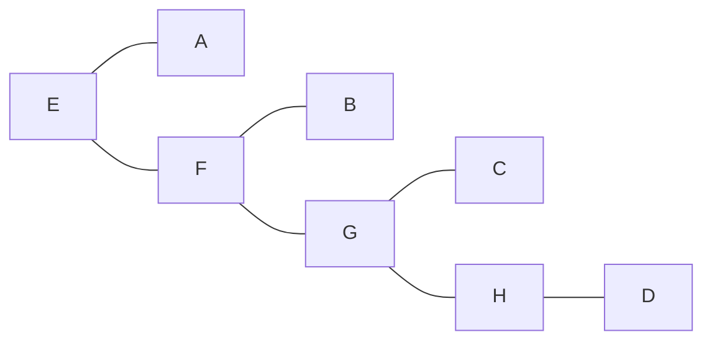
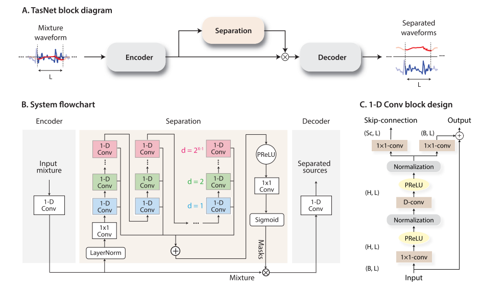
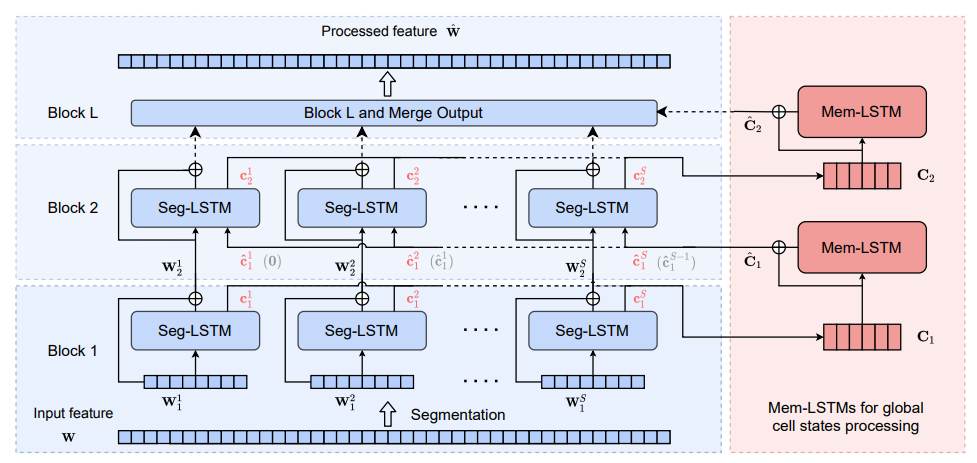
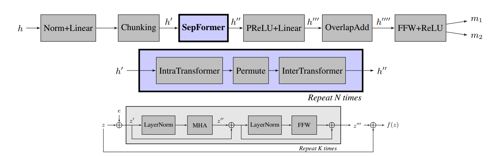
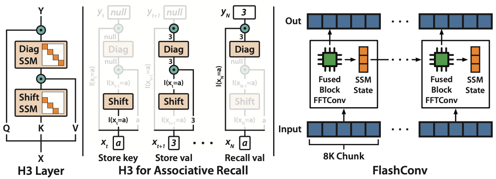
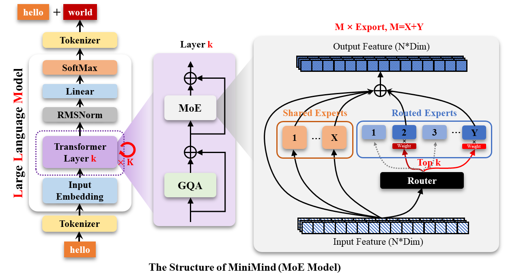

# 理论知识


## D2L

### 编程小技巧

1. 通过**原位操作**减小占用

```python
 before = id(Y)    
 Y = Y + X
 id(Y) == before   # False
```

注意 `Y = Y + X` 会为 `Y` 分配一个新的内存，换成下面中的一个会更好

```python
# 这两种方式均不会为Y分配新内存
Y[:] = X + Y  
Y = Y + X
```


2. `nn.LazyLinear()`：功能与`nn.Linear()`相同，不过只需要给定输出维度，输入维度可以自动推断。


### 神经网络
#### 反向传播
反向传播时，需要计算最后得到的结果是一个标量，或者提供向量 `v` （下面的代码中 `gradient` 即为 `v`）使得反向传播时计算 $v^T\partial_x y$（其实还是一个标量），而不是$\partial_x y$。

```python
x = torch.arange(4.0)
x.requires_grad_(True)
# x.grad.zero_()
y = x * x 
y.backward(gradient=torch.ones(len(y))) # Faster: y.sum().backward()
x.grad  # tensor([0., 2., 4., 6.])
```

如果一个值只是中间值，不需要计算梯度，可以使用 `detach` 来截断反向传播

```python
x = torch.arange(4.0)
x.requires_grad_(True)
y = x * x
u = y.detach()
z = u * x
z.sum().backward()
x.grad   # 由于detach截断了反向传播，所以x的梯度为u，而不是 3x^2
```

> 一个简单的线性拟合

```python
import torch
import matplotlib.pyplot as plt

x = torch.arange(100.0, requires_grad=True)
w, b = torch.tensor(1., requires_grad=True), torch.tensor(0.,requires_grad=True)
optimizer = torch.optim.SGD(params=[w, b], lr=1e-4)
loss = torch.nn.MSELoss()
for i in range(10):
    y = 2.138*x + 3.213
    y_ = w * x + b
    L = loss(y, y_)
    optimizer.zero_grad()
    L.backward()
    optimizer.step()

plt.plot(x.detach().numpy(), y.detach().numpy())
plt.plot(x.detach().numpy(), y_.detach().numpy())
plt.show()
```

sgd算法的简单实现
```python
def sgd(params, lr, batch_size): 
    #@save """小批量随机梯度下降""" 
    with torch.no_grad(): 
        for param in params: 
            param-= lr * param.grad / batch_size 
            param.grad.zero_()
```

#### Covariate Shift 纠正

Covariate Shift 指训练数据（q(x)）和测试数据的分布（p(x)）存在差异，导致模型在测试集上表现变差。幸运的是，独立性假设表明条件分布没有变，即：$p(y|x)=q(y|x)$。对于模型的风险，有下面的等式

$$
\int\!\!\!\int {l(f({\bf{x}}),y)p(y|{\bf{x}})p({\bf{x}})} d{\bf{x}}dy = \int\!\!\!\int {l(f({\bf{x}}),y)q(y|{\bf{x}})q({\bf{x}}){{p({\bf{x}})} \over {q({\bf{x}})}}} d{\bf{x}}dy
$$
换句话说，我们需要根据从正确分布（p(x)）中抽取的概率与从错误分布（q(x)）中抽取的概率之比来重新权衡每个数据。令$\beta_i$为
$$
{\beta _i}\mathop  = \limits^{def} {{p({{\bf{x}}_i})} \over {q({{\bf{x}}_i})}}
$$
这样的话，可以将模型的目标函数改写为
$$
\mathop {\min }\limits_f {1 \over n}\sum\limits_{i = 1}^n {{\beta _i}l(f({{\bf{x}}_i}),{y_i})} 
$$
这里的$\beta_i$并不知道，下面介绍一种借助逻辑回归的算法。假设我们有一个训练集  $\{(x_1, y_1), \cdots ,(x_n,y_n)\}$ 和一个未标记的测试集 $\{u_1, \cdots, u_m\}$。对于 Covariate Shift，我们假设所有 1≤i ≤ n 的 $x_i$ 都来自某个源分布，而所有 1≤ i≤ m 的 $u_i$ 来自目标分布。下面是用于校正 Covariate Shift 的原型算法：
1. 创建一个二分类训练集：$\{(x_1,-1),\cdots, (x_n,-1),(u_1,1),\cdots,(u_m, 1)\}$
2. 使用逻辑回归训练一个二分类器，得到分类函数 h
3. $\beta_i=exp(h(x_i))$，或者 $\beta_i= \min (exp(h(x_i)), c)$（c 为一个固定常数）


#### dropout

在标准 dropout 正则化中，将每层中部分节点归零，然后通过按保留（未丢弃）的节点分数归一化来消除每一层的偏差。即将每个中间激活值 $h$ 替换成随机值 $h'$，$h'$取值如下：
$$
h' = \left\{ \matrix{
  0\quad {\rm{with}}\;{\rm{probability}}\;p \hfill \cr 
  {h \over {1 - p}}\quad {\rm{otherwise}} \hfill \cr}  \right.
$$
之所以要除1-p，是为了保证 $E[h']=h$。

具体实现
```python
def dropout(X, p):
    assert 0<= p <= 1
    if p==1: return torch.zeros_like(X)
    mask = (torch.rand(X.shape) > p).float()
    return mask * X / (1.0 - p)
```


#### 卷积层

```python
def corr2d(X, K):
    h, w = K.shape
    Y = torch.zeros(X.shape[0] - h + 1, X.shape[1] - w + 1)
    for i in range(Y.shape[0]):
        for j in range(Y.shape[1]):
            Y[i,j] = (X[i:i+h, j:j+w] * K).sum()
    return Y

class Conv2D(nn.Module):
    def __init__(self, kernel_size):
        super().__init__()
        self.w = nn.Parameter(torch.rand(kernel_size))
        self.b = nn.Parameter(torch.zeros(1))
    def forward(self, x):
        return corr2d(x, self.w) + self.b
```

池化层的实现与卷积层相似，只不过需要改变 `Y[i,j]` 的计算公式。


#### RNN

考虑一个自回归模型，对时序数据，估计 $P(x_t|x_{t-1},\cdots, x_1)$，有下面两种方法
1. 自回归模型
使用观测序列 $x_{t−1},\cdots,x_{t−\tau}$ 来估计 $x_t$。
2. 隐变量自回归模型
保留一些对过去观测的总结 $h_t$，并且同时更新预测 $\hat x_t$ 和总结 $h_t$。其中，$\hat x_t = P(x_t|h_t)$，$h_t=g(h_{t-1},x_{t-1})$。

RNN 中也包含了对于过去观测的总结 $h_t$，与一般的 MLP 不同，RNN 的隐层计算公式如下。
$$
H_t = \phi(X_tW_{xh}+H_{t-1}W_{hh}+b_h)
$$
一般的MLP为 $H_t = \phi(X_tW_{xh}+b_h)$，其中 $\phi$ 为激活函数。
对于 RNN 训练语言模型时，可以将输入序列向后移动一位作为输出序列。
对于训练好的 RNN 模型，输入文本，预测后面文本的代码如下：
```python
def predict(self, prefix, num_preds, vocab, device=None):
    state, outputs = None, [vocab[prefix[0]]]  # 一开始state为空
    for i in range(len(prefix) + num_preds - 1):
        X = torch.tensor([[outputs[-1]]], device=device)
        embs = self.one_hot(X)
        rnn_outputs, state = self.rnn(embs, state)
        if i < len(prefix) - 1:  # Warm-up period
            outputs.append(vocab[prefix[i + 1]])
        else:  # Predict num_preds steps
            Y = self.output_layer(rnn_outputs)
            outputs.append(int(Y.argmax(axis=2).reshape(1)))
    return ''.join([vocab.idx_to_token[i] for i in outputs])
```

这里 self.output_layer 是将 RNN 输出的隐层状态与系数相乘后堆叠在一起

```python
def output_layer(self, rnn_outputs):
    outputs = [torch.matmul(H, self.W_hq) + self.b_q for H in rnn_outputs]
    return torch.stack(outputs, 1)
def forward(self, X, state=None):
    embs = self.one_hot(X)
    rnn_outputs, _ = self.rnn(embs, state)
    return self.output_layer(rnn_outputs)
```

RNN 的梯度更新（BPTT算法）：[9.7. Backpropagation Through Time — Dive into Deep Learning 1.0.3 documentation (d2l.ai)](https://d2l.ai/chapter_recurrent-neural-networks/bptt.html)

在 seq2seq 模型的输出时，每个时间步都对应着不同的词元及其概率，这时候需要确定一条路径使得选择具有最高条件概率的词元。如下图所示，每个时间步对应了四种词元，当输出 `<eos>` 时，停止输出。

| 时间步  | 1    | 2    | 3    | 4    |
| ------- | ---- | ---- | ---- | ---- |
| A       | 0.5  | 0.1  | 0.2  | 0    |
| B       | 0.2  | 0.4  | 0.2  | 0.2  |
| C       | 0.2  | 0.3  | 0.4  | 0.2  |
| `<eos>` | 0.1  | 0.2  | 0.2  | 0.6  |

**贪心搜索**直接在每个时间步选择具有最高条件概率的词元，即输出为 `A B C <eos>`。贪心算法虽然简单，但是不能保证得到最优序列，因为每个时间步的输出和前面时间步的输出有关。可能第2步选择了 C 词元会导致条件概率变为

| 时间步  | 1    | 2    | 3    | 4    |
| ------- | ---- | ---- | ---- | ---- |
| A       | 0.5  | 0.1  | 0.1  | 0.1  |
| B       | 0.2  | 0.4  | 0.6  | 0.2  |
| C       | 0.2  | 0.3  | 0.2  | 0.1  |
| `<eos>` | 0.1  | 0.2  | 0.1  | 0.6  |

此时如果输出 `A C B <eos>` 的条件概率比贪心搜索时更高。


**束搜索**（beamsearch）是贪心搜索的一个改进版本。它有一个超参数，名为束宽 k。在时间步1，选择具有最高条件概率的 k 个词元。这 k 个词元将分别是 k 个候选输出序列的第一个词元。在随后的每个时间步，基于上一时间步的 k 个候选输出序列，我们将继续从 ky（y为当前时间步对应的可选词元个数）个可能的选择中挑出具有最高条件概率的 k 个候选输出序列。

假设输出的词表只包含五个元素，束宽为2，输出序列的最大长度为3。每一步选择的词元如下：
第一步：A C
第二步：B E
第三步：D D
最后将会有 6 种可能，分别为：（1）A；（2） C；（3）A,B；（4）C,E；（5）A,B,D；（6）C,E,D。

最后，基于这六个序列（例如，丢弃包括`<eos>`和之后的部分），我们获得最终候选输出序列集合。然后 我们选择其中条件概率乘积最高的序列作为输出序列：
$$
{1 \over {{L^\alpha }}}\log P\left( {{y_1}, \cdots ,{y_L}|{\bf{c}}} \right) = {1 \over {{L^\alpha }}}\sum\limits_{t' = 1}^L {\log P\left( {{y_{t'}}|{y_1}, \cdots ,{y_{t' - 1}},{\bf{c}}} \right)} 
$$
其中 L 是最终候选序列的长度，$\alpha$ 通常设置为0.75。因为一个较长的序列在求和中会有更多的对数项，因此分母中的 $L^{\alpha}$ 用于惩罚长序列。

#### 优化算法

**鞍点**指函数梯度为0的点，且该点既不是局部最小点也不是全局最小点。如 $f(x)=x^3$ 的 $x=0$ 的点就是鞍点。

**凸集**指在向量空间中的一个集合 $X$，如果对于任意 $a,b\in X$，连接 $a$ 和 $b$ 的线段也在 $X$ 中，即对于 $\lambda\in[0,1]$，有
$$
\lambda a + (1-\lambda)b\in X
$$

一般情况下，深度学习中的问题被定义为凸集，如一个 d 维的实数集 $R^d$ 是一个凸集。

**凸函数** $f$ 指给定一个凸集 $X$，函数 $f:X\to R$ 如果满足对于所有的 $x_1,x_2\in X$ 和 $\lambda \in [0,1]$，有

$$
\lambda f(x_1) + (1-\lambda)f(x_2) \ge f(\lambda x_1+(1-\lambda)x_2)
$$

**Jensen 不等式**：给定一个凸函数 $f$，$\alpha_i$ 为非负实数，$\sum_i \alpha_i=1$，$X$ 是一个随机变量，有以下结论：

$$
\sum_i \alpha_i f(x_i) \ge f(\sum_i \alpha_i x_i)\; and\; E_X[f(X)] \ge f(E_X[X])
$$

凸函数有以下有用的性质：

1. 局部最小点就是全局最小点
2. 在凸集 $X$ 上定义的凸函数 $f$，下集合 $S_b = \{x|x\in X \;and\; f(x)\le b\}$是凸集。
3. 对于二阶可导的一维函数 $f$，当且仅当 $f''\ge0$，$f$ 是凸的；对于二阶可导的多维函数 $f$，当且仅当海森矩阵半正定 ${\nabla ^2}f \ge 0$。


## 自然语言处理

[自然语言处理3：词向量 - 知乎 (zhihu.com)](https://zhuanlan.zhihu.com/p/115532919)

进行word embedding的目的是为了表达词的含义，词汇之间的内在联系，实现对词语更准确地描述。可以使用余弦相似度计算各个词的相似性
$$
Sim(u,v)=\frac{u^Tv}{||u||\cdot||v||}
$$
词向量相减可以表示各个词在哪些维度上存在差距。


### N-gram语言模型

[自然语言处理 03：N-gram 语言模型 - YEY 的博客 | YEY Blog](https://yey.world/2020/03/09/COMP90042-03/)

#### 概率：从联合概率到条件概率

我们的目标是得到一个由m个单词组成的任意序列（即一个包含m个单词的句子）的概率：
$$
P(w_1,w_2,\cdots,w_m)
$$
第一步是利用链式法则将联合概率转换成条件概率的连乘形式：
$$
P(w_1,w_2,\cdots,w_m) = P(w_1)P(w_2|w_1)P(w_3|w_1,w_2)\cdots P(w_m|w_1,\cdots,w_{m-1}) 
$$


#### 马尔可夫假设

利用马尔可夫假设：某个单词出现的概率不再依赖于全部上下文，而是取决于离它最近的n个单词，因此，可以得到：
$$
P({w_i}|{w_1}, \cdots ,{w_{i - 1}}) \approx P({w_i}|{w_{i - n + 1}}, \cdots ,{w_{i - 1}})
$$
对于某个很小的n：

+ n=1时，一个unigram模型（每个单词出现的概率之间相互独立）：

$$
P({w_1},{w_2}, \cdots ,{w_m}) = \prod\limits_{i = 1}^m {P({w_i})}
$$

+ n=2时，一个bigram模型（每个单词出现的概率都和它前一个单词出现的概率有关）：

$$
P({w_1},{w_2}, \cdots ,{w_m}) = \prod\limits_{i = 1}^m {P({w_i}|{w_{i - 1}})}
$$

+ n=3时，一个trigram模型（每个单词出现的概率都和它前两个单词出现的概率有关）：

$$
P({w_1},{w_2}, \cdots ,{w_m}) = \prod\limits_{i = 1}^m {P({w_i}|{w_{i - 2}},{w_{i - 1}})}
$$

#### 最大似然估计

**如何计算上面提到的这些概率**

只需要一个大的用于训练的语料库，我们就可以根据语料库中各个单词的计数，利用最大似然估计来估计该单词出现的概率：

+ 对于unigram模型：

$$
P({w_i}) = {{C({w_i})} \over M}
$$

其中，$C$是一个计数函数，$C(w_i)$表示$w_i$在语料库中出现的次数，$M$表示语料库中所有单词tokens的数量。

+ 对于bigram模型：

$$
P({w_i}|{w_{i - 1}}) = {{C({w_{i - 1}},{w_i})} \over {C({w_{i - 1}})}}
$$

其中，$C(w_{i-1},w_i)$表示单词$w_{i-1}$和单词$w_i$前后相邻一起出现的次数。

+ 对于n-gram模型：

$$
P({w_i}|{w_{i - n + 1}}, \cdots ,{w_{i - 1}}) = {{C({w_{i - n + 1}}, \cdots ,{w_i})} \over {C({w_{i - n + 1}}, \cdots ,{w_{i - 1}})}}
$$

**一个Trigram的例子**

假设语料库为下面的两句话

`<s> <s> yes no no no no yes </s>`

`<s> <s> no no no yes yes yes no </s>`

由于采用的是Trigram，所以每句话开头有两个起始标记。

我们想要知道句子`<s> <s> yes no no yes </yes>`在trigram模型下的概率是多少？
$$
\begin{align}
P(\text{sent} =\textit{yes no no yes}) &= P(\textit{yes}\mid \texttt{<s>},\texttt{<s>})\times P(\textit{no}\mid \texttt{<s>},\textit{yes})\times P(\textit{no}\mid \textit{yes},\textit{no})\\
&\quad \times P(\textit{yes}\mid \textit{no},\textit{no}) \times P(\texttt{</s>} \mid \textit{no},\textit{yes})\\
&= \dfrac{1}{2} \times 1 \times \dfrac{1}{2} \times \dfrac{2}{5} \times \dfrac{1}{2} \\
&= 0.1
\end{align}
$$
对要计算的句子的概率按照trigram模型拆分成条件概率的连乘形式。


#### 存在的一些问题

- **语言通常具有长距离效应——需要设置较大的n值**
  有些词对应的上下文可能出现在句子中距离该词很远的地方，这意味着如果我们采用固定长度的上下文（例如：trigram模型），我们可能无法捕捉到足够的上下文相关信息，这是所有有限上下文语言模型的一个通病。
- **计算出的结果的概率通常会非常小**
  一连串条件概率项连乘得到的结果往往会非常小，对于这个问题，可以采用取对数计算log概率来避免数值下溢。
- **对于不存在于语料库中的词，无法计算其出现概率**
  如果我们要计算概率的句子中包含了一些没有在语料库中出现过的单词（例如：人名），我们应该怎么办？一种比较简单的技巧是，我们可以用某种特殊符号（例如：`<UNK>`）来表示这些所谓的 OOV 单词（out-of-vocabulary，即不在词汇表中的单词），并且将语料库中一些非常低频的单词都替换为这种表示未知单词的特殊token。
- **出现在新的上下文（context）中的单词**
  默认情况下，任何我们之前没有在语料库中见过的n-gram的计数都为0，这将导致计算出的整个句子的概率为0。为此，我们需要对语言模型进行**平滑处理（smoothing）**。

#### 平滑处理

基本思想：给之前没有见过的事件赋予概率

必须保证概率和为1

##### 拉普拉斯平滑（加一平滑）

假装我们看到每一个n-gram都比它们实际出现的次数多1次，即使是没有出现过的次数都记为1次。

+ 对于unigram模型（V=词汇表）：

$$
{P_{add1}}({w_i}) = {{C({w_i}) + 1} \over {M + \left| V \right|}}
$$

下面的$|V|$（语料库中所有单词的种类总数）是为了保证概率和为1。

+ 对于bigram模型：

$$
{P_{add1}}({w_i}|{w_{i - 1}}) = {{C({w_{i - 1}},{w_i}) + 1} \over {C({w_{i - 1}}) + \left| V \right|}}
$$

##### Lidstone平滑（加k平滑）

很多时候，加1显得太多了，并不想每次都加1，因为这会导致原本罕见事件可能变得有点过于频繁了，并且丢弃了所观测的n-gram的太多有效计数。

+ 对于trigram模型：

$$
{P_{add1}}({w_i}|{w_{i - 1}},{w_{i - 2}}) = {{C({w_{i - 2}},{w_{i - 1}},{w_i}) + k} \over {C({w_{i - 2}},{w_{i - 1}}) + k\left| V \right|}}
$$

如何选择一个合适的k值对于模型影响非常大。k在这里实际上是一个超参数，我们需要尝试对其进行调整以便找到一个使模型表现比较好的k值。

##### 绝对折扣平滑

从每个观测到的n-gram计数中“借”一个固定的概率质量$d$；然后将其重新分配到未知的n-gram上。

还有Backoff平滑、Kneser-Ney平滑等。

##### 插值

插值是一种更好的平滑处理方式。

**一个trigram模型下的Interpolation平滑概率：**
$$
\eqalign{
  {P_{{\rm{Interpolation}}}}({w_m}|{w_{m - 1}},{w_{m - 2}}) &= {\lambda _3} \times P_3^*({w_m}|{w_{m - 1}},{w_{m - 2}}) \\
  &  + {\lambda _2} \times P_2^*({w_m}|{w_{m - 1}})  \\
  &  + {\lambda _1} \times P_1^*({w_m}) \\}
$$
其中，$\lambda_1$，$\lambda_2$和$\lambda_3$是根据留存数据学习到的，并且$\sum\limits_{n = 1}^{{n_{max}}} {{\lambda _n}}  = 1$

首先计算trigram概率$P_3^*$，并将其乘以一个系数$\lambda_3$；然后计算bigram概率$P_2^*$，并将其乘以一个系数$\lambda_2$；然后计算unigram概率$P_1^*$，并将其乘以一个系数$\lambda_1$；最后将三者相加得到结果。

用插值替代back-off可以得到**Interpolated Kneser-Ney平滑**。

##### 实践应用

- 在实践中，我们通常采用Kneser-Ney语言模型并将5-grams作为最高阶数。
- 对于每个n-gram阶数都有不同的discount值。
- 当我们试图学习如何在它们之间进行Interpolation时，我们将从数据中学习。


#### 生成语言

##### 生成

- 给定一个初始单词，从语言模型定义的概率分布中抽取一个词作为下一个出现的单词。

- 在我们的n-gram语言模型中包含$n-1$个起始tokens，用于提供生成第一个单词所需的上下文。

  + 永远不会生成起始标记`<s>`，它只作为初始单词的生成条件

  - 生成`</s>`来结束一个序列

##### 如何选择下一个单词

- Argmax：在每一轮中选择与上下文共现概率最高的那个单词。

  - **贪婪搜索（Greedy search ）**
    这其实是一种贪婪搜索策略，因为即使在每一步中我们都选择概率最高的那个单词，也无法保证最终生成的句子具有最优的概率。

- Beam search decoding

  一种更好的方法是 Beam search decoding，它在机器翻译中应用非常广泛。

  - 在每轮中，我们跟踪概率最高的前$N$个单词
  - 我们总是检查这几个候选单词给出的完整句子的概率
  - 这种方法可以生成具有 **近似最优（near-optimal）** 概率的句子

- **从分布中随机抽样**
  另一种方法是从语言模型给出的概率分布中随机抽样，例如：temperature sampling

#### 评估语言模型

##### Perplexity

用于衡量语言模型生成的语句是否是合情合理的，逻辑上是连贯的。假设测试集语料库是一个由m个单词$w_1,w_2,\cdots,w_m$组成的序列，用$PP$表示Perplexity，公式如下：
$$
PP({w_1},{w_2}, \cdots ,{w_m}) = \root m \of {{1 \over {P({w_1},{w_2}, \cdots ,{w_m})}}}
$$
Perplexity越低，模型表现越好。

##### Perplexity例子

语料库为Wall Street Journal（华尔街日报）

训练集：3800万个单词tokens，解决2万个单词types（即词汇表）

测试集：150万个单词tokens

实验结果：

|            | Unigram | Bigram | Trigram |
| ---------- | ------- | ------ | ------- |
| Perplexity | 962     | 170    | 109     |


### Word2vec

[[NLP\] 秒懂词向量Word2vec的本质 - 知乎 (zhihu.com)](https://zhuanlan.zhihu.com/p/26306795)

[深入浅出Word2Vec原理解析 - 知乎 (zhihu.com)](https://zhuanlan.zhihu.com/p/114538417)

word2vec的输出是目标单词与上下文单词的概率，
$$
y_k=Pr(word_k|word_{context})=\frac{exp(activation(k))}{\sum_{n=1}^Vexp(activation(n))}
$$

#### 训练Word2Vec

使用gensim对weibo_data.json（已存入网盘/数据集）进行word2vec的训练

```python
import json
import jieba
from tqdm import tqdm

import re
from hanzi import punctuation

punctuation = """！？｡，＂＃＄％＆＇（）＊＋－／：；＜＝＞＠［＼］＾＿｀｛｜｝～｟｠｢｣､、〃》「」『』【】〔〕〖〗〘〙〚〛〜〝〞〟〰〾〿–—‘'‛“”„‟…‧﹏"""
re1 = re.compile("[{}]+".format(punctuation))
re2 = re.compile("[a-zA-Z]+")

#过滤中文标点符号和字母
def filter_punc(desstr,restr=''):
    desstr = re1.sub(restr, desstr)
    return re2.sub(restr,desstr)

data_path = "weibo_data.json"

content = []
with open(data_path, 'r', encoding='utf-8') as f:
    news = json.load(f)
    content = [n['content'] for n in news]

content = content[:50000]

word = []
for c in tqdm(content):
    c = filter_punc(c)
    word.append(list(jieba.cut(c)))

```

其中word的形式如下，每一行表示一个句子
```python
word = [["前天", "在", "郑州", ...],
	   ["近日", "北京", ...],
	   ...
	   ]
```

```python
from gensim.models import Word2Vec
model = Word2Vec(word)
```

```python
vector = model.wv["今天"]
# print(vector)
sims = model.wv.most_similar("今天")
print(sims)
```


#### 两个算法

##### skip-grams

输入层为目标单词，上下文单词位于输出层

##### CBOW

CBOW模型的训练输入是某一个特征词的上下文（context）相关的词对应的词向量，而输出就是这特定的一个词（目标单词target）的词向量。比如上下文大小取值为1，上下文对应的词有2个，前后各1个，这2个词是我们模型的输入。由于CBOW使用的是词袋模型，因此这上下文单词都是平等的，也就是不考虑上下文单词和目标单词之间的距离大小，只要在我们上下文之内即可。

#### 两个方法

##### Huffman树

将单词按词频进行Huffman编码，[哈夫曼编码及其应用——数据压缩（Huffman compression） - 知乎 (zhihu.com)](https://zhuanlan.zhihu.com/p/144562146)

python实现：[huffmanCoding.py](codes\huffmanCoding.py) 

##### 负采样

[（三）通俗易懂理解——Skip-gram的负采样 - 知乎 (zhihu.com)](https://zhuanlan.zhihu.com/p/39684349)

基本思想如下：对于我们在训练原始文本中遇到的每一个单词，它们都有一定概率被我们从文本中删掉，而这个被删除的概率与单词的频率有关。负采样（negative sampling）解决了这个问题，它是用来提高训练速度并且改善所得到词向量的质量的一种方法。不同于原本每个训练样本更新所有的权重，负采样每次让一个训练样本仅仅更新一小部分的权重，这样就会降低梯度下降过程中的计算量。


## 模型剪枝

通过模型剪枝可以减少运算量，压缩模型。pytorch提供了用于模型剪枝的方法，详见 [Pruning Tutorial — PyTorch Tutorials 2.6.0+cu124 documentation](https://pytorch.org/tutorials/intermediate/pruning_tutorial.html#pruning-tutorial)。

模型剪枝一般是对权重或者偏置加上一个0-1mask，即将部分参数置为0。如通过计算参数的1-范数、2-范数等，将其中较小值对应的参数置为0。

此外还有直接去除单个通道，注意力的head，甚至整个层的pruning方法


### Adapting by Pruning: A Case Study on BERT

该方法对BERT模型进行剪枝，将BERT模型的参数分成两个部分，分别为不训练但进行剪枝的参数，还有仅训练不进行剪枝的参数。

用 $f(x;w_0,p)$ 表示用于下游任务的模型，$w_0$ 是预训练模型的权重（不训练但剪枝），$p$ 为任务特定权重（训练但不剪枝）。目标是找到一个 $w_0$ 的二元mask $m^*$，使得

$$
{m^*} = \arg {\min _{m \in {{\left\{ {0,1} \right\}}^d}}}\mathop {\min }\limits_{p \in {R^k}} L(m,p)
$$
其中

$$
L(m,p) = {\left| {{D_{train}}} \right|^{ - 1}}\sum\limits_{z \in {D_{train}}} {l(z;m,p)} 
$$
$$
l(z;m,p) = G(f(x;{w_0} \odot m,p),y),z = (x,y)
$$
这里的 $G$ 是一个可微分的损失函数，如最小二乘损失或交叉熵损失，$z$ 是一个输入标签对（$x$ 是输入，$y$ 是标签，如文本情感分类任务中，$x$ 为文本，$y$ 则为文本对应的情感）。这里的 $p$ 可以直接通过优化器反向传播优化，但是对于mask而言，由于是二元mask，所以需要进行近似处理，论文中使用sigmoid函数进行近似
$$
{m_t} = \sigma (t\theta ) = {\left[ {1 + \exp ( - t\theta )} \right]^{ - 1}},t \gg 1
$$
这里的 $\theta\in R^d$ 是一个与m维度相同的矢量，$t$ 为超参数。这样近似之后损失可以写成

$$
{L_t}(\theta ) = {\left| {{D_{train}}} \right|^{ - 1}}\sum\limits_{z \in {D_{train}}} {l(z;{m_t},p)} 
$$
损失的梯度可以写成

$$
{\nabla _\theta }{L_t}(\theta ) = {\left| {{D_{train}}} \right|^{ - 1}}\sum\limits_{z \in {D_{train}}} {{\nabla _{{m_t}}}l(z;{m_t},p) \odot {\nabla _\theta }{m_t}} 
$$
当 $t\to \infty$ 时，有 $m_t\to m$，但是这也意味着对于梯度而言，也将趋于0
$$
{\nabla _\theta }{m_t} = {m_t} \odot \left( {1 - {m_t}} \right) \to 0
$$
为了避免这种情况，在前向传播时使用较大的 $t$，在sigmoid梯度计算时使用较小的 $t$，$t_l$ 表示较大的 $t$ 值，$t_s$ 表示较小的 t 值。

$$
{{\tilde \nabla }_\theta }{L_t}(\theta ) = {\left| {{D_{train}}} \right|^{ - 1}}\sum\limits_{z \in {D_{train}}} {{\nabla _{{m_t}}}l(z;{m_{{t_l}}},p) \odot {\nabla _\theta }{m_{{t_s}}}} 
$$
SGD 更新公式为
$$
\eqalign{
  & {\theta _{i + 1}} = {\theta _i} - {\alpha _i}{{\tilde \nabla }_\theta }l\left( {z;{m_{{t_l}}},{m_{{t_s}}},p} \right)  \cr 
  & {p_{i + 1}} = {p_i} - {\beta _i}{\nabla _p}l(z;m,p) \cr} 
$$
在经过 T 步后，可以通过设置$\theta_t$ 中所有正值对应的mask为1，所有负值对应的mask为0来得到二元mask。为了鼓励更多的负值，可以在更新 $\theta$ 时添加正规项

$$
{\theta _{i + 1}} = {\theta _i} - {\alpha _i}{{\tilde \nabla }_\theta }l\left( {z;{m_{{t_l}}},{m_{{t_s}}},p} \right) - {\gamma _i}1
$$
$\theta_0$ 从均值为0.01，方差为0.001的正态分布中初始化。

### Data-Aware Adaptive Pruning Model Compression Algorithm Based on a Group Attention Mechanism and Reinforcement Learning

针对卷积网络的一种剪枝方法，利用上一层的信息计算通道的注意力分配作用于下一层。为了针对不同的数据，使用强化学习的方法来决策选择的参数集。


# 机器学习

## EM算法

参考：[【机器学习】EM——期望最大（非常详细） - 知乎 (zhihu.com)](https://zhuanlan.zhihu.com/p/78311644)

EM算法通过迭代来对含有隐变量的概率参数模型进行最大似然估计或极大后验概率估计

代码： [emCoins[EM算法估计硬币正面概率].py](D:\postgraduateLearn\first\codes\emCoins[EM算法估计硬币正面概率].py) 


## 条件随机场 CRF

CRF 常用于中文分词，命名实体识别，词性标注等场景。还可以与深度学习结合，如 BiLSTM-CRF 等模型。


### 马尔可夫随机场（概率无向图模型）

如果随机过程的参数 $t$ 是一个 n 维向量，那么可以将随机过程称为随机场。

马尔可夫性质：

$$
P({Y_v}|X,{Y_w},w \ne v) = P({Y_v}|X,{Y_w},w \sim v)
$$

其中 $w \sim v$ 表示图中所有和顶点 v 相连接的顶点，$w \neq v$ 表示顶点 $v$ 以外的顶点。

上面这个性质指在图中，顶点 v 所对应的随机变量的概率只和相邻顶点的随机变量的概率有关。


### 最大团

给定一个概率无向图 G，团的定义为任意两个顶点在图中相邻（有边连接），最大团 C 则是保证顶点两两相邻的最大集合。概率无向图的联合概率分布 $P(Y)$ 可以写成所有最大团上的函数 $\varphi_C(Y_C)$ 的乘积

$$
P(Y) = {1 \over Z}\prod\limits_C {{\varphi _C}\left( {{Y_C}} \right)} \quad Z = \sum {\sum\limits_C {{\varphi _C}\left( {{Y_C}} \right)} } 
$$

其中 $\varphi_C(Y_C)$ 是 C 上定义的严格正函数，通常为指数函数。



如上图，由 A E F B 构成的无向图的联合概率分布为

$$
P(A,E,F,B) = {1 \over Z}{e^{f(A,E)}}{e^{g(E,F)}}{e^{h(F,B)}}
$$
### 线性链条件随机场

一般应用比较广泛的是线性链条件随机场，定义为：

设 $X=(X_1,X_2,\cdots, X_n)$ 和 $Y=(Y_1,Y_2,\cdots,Y_n)$ 均为线性表示的随机变量序列，马尔可夫性定义为

$$
P({Y_i}|X,{Y_{j \ne i}}) = P({Y_i}|X,{Y_{i - 1}},{Y_{i + 1}})
$$

>习惯将线性链条件随机场称为条件随机场

假设输入观测序列 $X=(x_1,x_2,\cdots,x_n)$，输出状态序列 $Y=(y_1,y_2,\cdots,y_n)$，将观测到状态之间的函数称为状态特征函数 $s_l(y_i,x,i)$，状态之间的函数称为 $t_k(y_{i-1},y_i,x,i)$

则在随机变量 X 取值为 x 时，随机变量 Y 取值为 y 的条件概率为

$$
P(y|x) = {1 \over {Z(x)}}\exp \left( {\sum\limits_{i,k} {{\lambda _k}{t_k}\left( {{y_{i - 1}},{y_i},x,i} \right)}  + \sum\limits_{i,l} {{u_l}{s_l}\left( {{y_i},x,i} \right)} } \right)
$$
其中 $\lambda_k$ 和 $\mu_l$ 为权值。$t_k$ 和 $s_l$ 特征函数是二值函数，函数值为 0 或者 1。


## 无监督学习

### 自组织映射（self-organizing map）

#### 概述

自组织映射（SOM）是一种无监督机器学习技术，用于生成高维数据集的低维（通常是二维）表示，同时保留数据的拓扑结构。例如，在$n$维观测值中测量的$p$维变量的数据集可以表示为具有相似变量值的观测值聚类，这些聚类可以可视化为二维“地图”，这样近端聚类中的观测值比远端聚类中的观测值具有更相似的值。这可以使高维数据更易于可视化和分析。

SOM是一种人工神经网络，但使用竞争学习进行训练，而不是使用其他人工神经网络使用的纠错学习（如梯度下降的反向传播）。SOM 有时也被称为 Kohonen 地图或 Kohonen 网络。与大多数人工神经网络一样，自组织映射以两种模式运行：训练和映射。首先，训练使用输入数据集（“输入空间”）来生成输入数据的低维表示（“地图空间”）。其次，映射使用生成的映射对其他输入数据进行分类。

在大多数情况下，训练的目标是将具有 $p$ 维的输入空间表示为具有二维的地图空间。具体来说，具有$p$变量的输入空间被称为具有 $p$ 维。映射空间由称为“节点”或“神经元”的组件组成，这些组件被排列成具有二维的六边形或矩形网格。节点的数量及其排列是根据数据分析和探索的更大目标预先指定的。映射空间中的每个节点都与一个“权重”向量相关联，该向量是节点在输入空间中的位置。虽然地图空间中的节点保持固定，但训练包括将权重向量向输入数据移动（减少距离度量，例如欧几里得距离），而不会破坏地图空间引起的拓扑。训练后，地图可用于通过查找与输入空间向量最接近权重向量（最小距离度量）的节点来对输入空间的其他观测值进行分类。

#### 学习算法

在自组织映射中学习的目标是使网络的不同部分对某些输入模式做出类似的响应。这在一定程度上是由人脑大脑皮层的不同部分如何处理视觉、听觉或其他感官信息所致。神经元的权重被初始化为小的随机值，或者从两个最大的主成分特征向量跨越的子空间中均匀采样。使用后一种选择，学习速度要快得多，因为初始权重已经很好地近似了 SOM 权重。

训练采用竞争性学习，当训练样本被馈送到网络时，将计算其到所有权重向量的欧几里得距离。权重向量与输入最相似的神经元称为最佳匹配单元（BMU）。在SOM网格中，BMU和靠近它的神经元的权重根据输入向量进行调整。变化的幅度随着时间和与BMU的网格距离而减小。权重向量为$W_v(s)$的神经元 $v$ 的更新公式为
$$
W_v(s+1)=W_v(s)+\theta(u,v,s)\cdot \alpha(s)\cdot (D(t)-W_v(s))
$$
其中$s$是步数，$t$是训练样本的索引，$u$是输入向量$D(t)$的BMU指数，$\alpha(s)$是单调递减学习系数，$\theta(u,v,s)$是邻域函数，它给出了步骤$s$中神经元$u$和神经元$v$之间的距离。根据实现的不同，$t$可以系统地扫描训练数据集（$t$是 0， 1， 2...T-1，然后重复，T 是训练样本的大小）， 从数据集中随机抽取（bootstrap采样）， 或者实现一些其他的采样方法（如jackknifing）。

邻域函数$\theta(u,v,s)$（也称为横向相互作用函数）取决于BMU（神经元 $u$）和神经元$v$之间的网格距离。在最简单的形式中，所有足够接近BMU的神经元为1，其他神经元为0，但高斯函数和Mexican-hat函数也是常见的选择。无论函数形式如何，邻域函数都会随时间而缩小。 一开始，当邻域很宽泛时，自组织就会在整个范围内发生。当邻域缩小到只有几个神经元时，权重会收敛到局部估计值。在一些实现中，学习系数$\alpha$和邻域函数$\theta$随着$s$的增加而稳步下降，在其他实现中（特别是那些$t$扫描训练数据集的实现），它们以逐步方式减少，每T步增加一次。

对于每个输入向量，对（通常很大）周期数$\lambda$重复此过程。网络最终会将输出节点与输入数据集中的组或模式相关联。如果可以命名这些模式，则可以将这些名称附加到训练网络中的关联节点。在映射过程中，将有一个获胜神经元：其权重向量最接近输入向量的神经元。这可以通过计算输入向量和权重向量之间的欧几里得距离来简单地确定。

**算法**

1. 随机化地图中的节点权重向量

2. for $s=0,1,2,...,\lambda$

   1. 随机选择一个输入向量$D(t)$；
   2. 在地图中查找最接近输入向量的节点。此节点是最佳匹配单元（BMU），用$v$表示；
   3. 对每个节点$v$，通过拉近输入向量来更新其向量：

   $$
   W_v(s+1)=W_v(s)+\theta(u,v,s)\cdot \alpha(s)\cdot (D(t)-W_v(s))
   $$

$s$ 是当前迭代，$\lambda$ 是迭代限制，$t$ 是输入数据集 $\bf{D}$ 中目标输入数据向量的索引

关键的设计选择是 SOM 的形状、邻域函数和学习率时间表。邻域函数的思想是使 BMU 更新最多，其近邻更新更少，依此类推。学习率的想法是安排它，使地图更新在开始时很大，并逐渐停止更新。

例如，如果想用方形网格来学习SOM，我们可以使用邻域函数可以使BMU完全更新，最近的邻居更新一半，它们的邻居再次更新一半，等等。
$$
\theta \left( {\left( {i,j} \right),\left( {i',j'} \right),s} \right) = {1 \over {{2^{\left| {i - i'} \right| + \left| {j - j'} \right|}}}} = \left\{ \matrix{
  1\qquad {\rm{if}}\;i = i',j = j'   \cr 
  1/2\;\;\;{\rm{if}}\;\left| {i - i'} \right| + \left| {j - j'} \right| = 1 \hfill \cr 
  1/4\;\;\;{\rm{if}}\;\left| {i - i'} \right| + \left| {j - j'} \right| = 2 \hfill \cr 
   \cdots \quad \;\; \cdots  \cr}  \right.
$$
学习率可以是简单的线性：$\alpha(s)=1-s/\lambda$

**替代算法**

1. 随机化地图节点的权重向量

2. 遍历输入数据集中的每个输入向量

   1. 遍历映射中的每个节点
      1. 使用欧式距离公式查找输入向量与地图节点权重向量之间的相似性
      2. 跟踪产生最小距离的节点（此节点便是最佳匹配单元，BMU）
   2. 通过将BMU附近的节点（包括BMU本身）拉近输入向量来更新BMU附近的节点

   $$
   W_v(s+1)=W_v(s)+\theta(u,v,s)\cdot \alpha(s)\cdot (D(t)-W_v(s))
   $$

3. 从步骤2开始增加$s$并重复，同时$s<\lambda$


# 图神经网络


对于pytorch，可以使用 [torch_geometric 库](https://pytorch-geometric.readthedocs.io/en/latest/index.html)


下载命令（注意 pytorch 和 cuda 版本）[Installation — pytorch_geometric](https://pytorch-geometric.readthedocs.io/en/latest/install/installation.html)

```sh
pip install torch_geometric
pip install torch_scatter torch_sparse torch_cluster torch_spline_conv -f https://data.pyg.org/whl/torch-2.2.2+cu118.html
```

torch_geometric 库中有许多的现成的模型组件。PyG 中通过一个 `torch_geometric.data.Data` 实例描述单个图，默认有以下属性

`data.X`：节点的特征矩阵 `[num_nodes, num_node_features]`

`data.edge_index`：图的连通性矩阵 `[2, num_edges]` 类型为 long

`data.edge_attr`：边的特征矩阵 `[num_edges, num_edge_features]`

`data.y`：训练时的目标

`data.pos`：节点的位置矩阵 `[num_nodes, num_dimensions]`

注意，data 并不局限于这些属性，也并不需要所有的属性都被赋值。


## 简介

[图神经网络从入门到入门 - 知乎](https://zhuanlan.zhihu.com/p/136521625)

普通的全连接层为特征矩阵 $X$ 乘以权重矩阵 $W$，图神经网络在此基础上还乘上了一个邻接矩阵 $A$。

普通的全连接层：$H=\sigma(XW)$，图神经网络：$H=\sigma(AXW)$


Graph Convolution Networks（GCN）是开山之作，将图像处理中的卷积操作简单的用到图结构数据处理中。具体操作如下

$$
{h_v} = f\left( {{1 \over {\left| {N(v)} \right|}}\sum\nolimits_{u  \in N(v)} {W{x_u}}  + b} \right)
$$

其中，$N(v)$ 为 v 的邻接节点，即将 v 的邻接节点聚合起来再做一个线性映射。


# 损失函数


## 交叉熵损失

两个分布 $p(x)$ 和 $q(x)$之间的交叉熵定义为

$$
H(p,q) = p(x)\log {1 \over {q(x)}} =  - p(x)\log q(x)
$$
下面是一个例子，有三个分布 $p(x)$、$q_1(x)$ 和 $q_2(x)$


|            | $x_1$ | $x_2$ | $x_3$ |
| ---------- | ----- | ----- | ----- |
| $p(x_i)$   | 1     | 0     | 0     |
| $q_1(x_i)$ | 0.5   | 0.4   | 0.1   |
| $q_2(x_i)$ | 0.8   | 0.1   | 0.1   |
那么 $p(x)$ 和 $q_1(x)$ 的交叉熵为

$$
H(p,{q_1}) =  - \sum\limits_{i = 1} {p({x_i})\log {q_1}({x_i})}  = \log 2
$$
由于一般正标签为1，交叉熵损失可以定义为

$$
L =  - \sum\limits_{i = 1} {\log q({x_i})} 
$$
这里的 $q(x_i)$ 一般经过softmax。


# 经典模型


## 语音分离

语音分离的主要任务是从混合的语音中分离出不同说话人的语音，由于分离出的语音往往难以和真实语音一一匹配，在训练和计算指标时，可能会选择改变语音排列顺序多次计算。


### Conv-TasNet

[JusperLee/Conv-TasNet: Conv-TasNet: Surpassing Ideal Time-Frequency Magnitude Masking for Speech Separation Pytorch's Implement](https://github.com/JusperLee/Conv-TasNet)

这是一个端到端的方法，音频经过一个卷积核大小为L，步长为 L//2 的一维卷积转为特征，再输入Separator中计算多个mask，每个mask对应一个语音。




每一个1-D Conv block 有两路输出，其中有一路和输入相加后作为下一个卷积模块的输入，另一路输出是计算mask时的输出，Conv-TasNet 在计算mask时将所有的1-D Conv block 另一路输出加起来。


### Skim

[espnet/espnet2/enh/layers/skim.py at master · espnet/espnet](https://github.com/espnet/espnet/blob/master/espnet2/enh/layers/skim.py)



对于输入特征 $W^{T\times N}$，将其按照时间分成 S 块，每块长度为 K。假设第 $l$ 层Skim块的输入为 $[W_l^1,W_l^2,\cdots, W_l^S]$，那么Seg-LSTM的映射函数可以写成

$$
\eqalign{
  & \bar W_{l + 1}^s,c_{l + 1}^s,h_{l + 1}^s = {\mathop{\rm {Seg-LSTM}}\nolimits}\left( {W_l^s,\hat c_l^s,\hat h_l^s} \right)  \cr 
  & W_{l + 1}^s = {\mathop{\rm LN}\nolimits} (\bar W_{l + 1}^s) + W_l^s \cr} 
$$
使用Mem-LSTM进行跨块的处理，令${C_{l + 1}} = \left[ {c_{l + 1}^1, \cdots ,c_{l + 1}^S} \right]$，${H_{l + 1}} = \left[ {h_{l + 1}^1, \cdots ,h_{l + 1}^S} \right]$
$$
\eqalign{
  & {{\bar C}_{l + 1}} = {\rm{Mem - LST}}{{\rm{M}}_c}\left( {{C_{l + 1}}} \right)  \cr 
  & {{\bar H}_{l + 1}} = {\rm{Mem - LST}}{{\rm{M}}_h}\left( {{H_{l + 1}}} \right)  \cr 
  & {{\hat C}_{l + 1}} = {\mathop{\rm LN}\nolimits} \left( {{{\bar C}_{l + 1}}} \right) + {C_{l + 1}}  \cr 
  & {{\hat H}_{l + 1}} = {\mathop{\rm LN}\nolimits} \left( {{{\bar H}_{l + 1}}} \right) + {H_{l + 1}} \cr} 
$$
为了实现因果性，可以将Seg-LSTM的映射函数改为

$$
\bar W_{l + 1}^s,c_{l + 1}^s,h_{l + 1}^s = {\rm{Seg - LSTM}}\left( {W_l^s,\hat c_l^{s - 1},\hat h_l^{s - 1}} \right)
$$
这样第 $s$ 块只依赖前面的 $s-1$ 段的信息。

值得注意的是在训练时，每次输入的音频会被分成 S 段，然后将 S 段合并到批次这个维度，相当于每次训练 $S\times B$ 个批次的数据。SegLSTM中输入数据的维度为 $[B * S, K, D]$。

对于MemLSTM，输入的是状态 $h,c\in R^{1\times B*S \times D}$，会将其转为 $[B, S, D]$ 再送入LSTM中计算。为了保证因果性，在计算之后只会保留前S-1段并后移一位，保证最开始的一段为0。

在推理时，每次送入模型的只有一帧数据，每经过K帧通过MemLSTM计算一次状态。


### Sepformer



将Transformer用于语音分离，注意这里的IntraTransformer和InterTransformer并不是指对于时间维度和频率维度进行处理。

对于输入 $x\in R^{B\times C\times T}$ 将其在时间维度上分段，假设分成 K 段，每段长度为 S，IntraTransformer的输入为 $x\in R^{B * S \times K \times C}$，InterTransformer的输入为 $x\in R^{B * K \times S \times C}$


### SepReformer

[dmlguq456/SepReformer: Official repository of SepReformer for speech separation](https://github.com/dmlguq456/SepReformer)


输入 $x\in R^{1\times N}$ 经过一维卷积+GELU为 $X\in R^{F\times T}$，经过一个编码器，编码器中的 Global transformer 和 Local Transformer 的结构如下


与其它模型在最后拆分不同的mask，SepReformer在中间就拆分mask，解码器中的Global transformer 和 Local Transformer 共享参数，除此之外还有CS Transformer。


## 图像识别

一些可供使用的库：

1. [huggingface/pytorch-image-models: The largest collection of PyTorch image encoders / backbones. Including train, eval, inference, export scripts, and pretrained weights -- ResNet, ResNeXT, EfficientNet, NFNet, Vision Transformer (ViT), MobileNetV4, MobileNet-V3 & V2, RegNet, DPN, CSPNet, Swin Transformer, MaxViT, CoAtNet, ConvNeXt, and more](https://github.com/huggingface/pytorch-image-models)


### Resnet

Resnet 的基本模块为 Res Block，基本结构如下（右图为加入输入输出尺寸不同时的结构）


输入尺寸为 224 × 224。

### Res2net

将特征图（$B\times C \times H\times W$）先经过一个 1 x 1 卷积+ BN + Relu，之后在通道维度分割为 s 个特征子图（$B\times (C/S) \times H\times W$），对于 s 个通道子图进行如下处理
$$
{y_i} = \left\{ \matrix{
  {x_i}\quad i = 1 \hfill \cr 
  {K_i}({x_i})\quad i = 2 \hfill \cr 
  {K_i}({x_i} + {y_{i - 1}})\quad 2 < i \le s \hfill \cr}  \right.
$$
这里的 $K_i$​ 可以是简单的 3 × 3 卷积 + BN + Relu，也可以是分组卷积（减少计算量），最后经过一个 1 × 1 的卷积 + BN，再经过一个可选的 SE block 与输入相加连接，最后再经过一个 Relu。


### ResNeXt

将 `[256, 3×3, 256]` 卷积改为 `[256, 1×1, 128]+[128, 3×3, 128, groups=32]+[128, 1×1, 256]`

下面三种网络架构等效


### SENet

用于图像分类，在 Resnet 的基础上加入了 SE Block，SE Block 的架构如下：


注意此处的 FC 可以是二维卷积，一维卷积等。SENet 将 SE Block 加在每个小卷积块之后（整个模块可能有几十个SE Block，r=16），一些更加简单的模型将 SE Block 加在模块之后（可能整个模型中只有3、4个 SE Block），控制好r的大小，对于模型的计算量影响很小。

### VIT

将二维图片 $x\in R^{H\times W\times C}$ 重整为 $x_p\in R^{N\times(P^2\cdot C)}$，P 为一个图片块的长宽，$N=HW/P^2$​。

输入 $x\in R^{B\times C \times H \times W}$ 经过一个二维卷积 `[3, 768]`（`kernel_size` 和 `stride_size` 相等，均为 16），对于一个 3 × 224 × 224 的图片，可以得到 768 × 14 × 14 的特征，然后摊平最后两个维度得到 196 × 768 的特征，196 相当于文本中的token长度，768 为token的特征维度。

然后进行位置编码，可以设置一个参数进行学习

```python
self.pos_embed = nn.Parameter(torch.randn(1, embed_len, embed_dim) * .02)
```

然后将分类或者回归token（可选）连接到第一个维度，即token长度上

```python
self.cls_token = nn.Parameter(torch.zeros(1, 1, embed_dim))
self.reg_token = nn.Parameter(torch.zeros(1, reg_tokens, embed_dim))
```

之后便是若干个 Block，Block 中包含了常规的多头自注意力和前馈层。

$$
\eqalign{
  & {z_0} = \left[ {{x_{class}};x_p^1E;x_p^2E; \cdots ;x_p^NE} \right] + {E_{pos}}\quad E \in {R^{({P^2} \cdot C) \times D}},{E_p} \in {R^{\left( {N + 1} \right) \times D}}  \cr 
  & {z_l}' = MSA(LN({z_{l - 1}})) + {z_{l - 1}}\quad l = 1...L  \cr 
  & {z_l} = MLP(LN({z_l}')) + {z_l}'\quad l = 1...L  \cr 
  & y = LN(z_L^0) \cr} 
$$

计算多头自注意力（MSA）时，代码如下

```python
class Attention(nn.Module):  
    def __init__(  
            self,  
            dim: int,  
            num_heads: int = 8,  
            qkv_bias: bool = False,  
            qk_norm: bool = False,  
            proj_bias: bool = True,  
            attn_drop: float = 0.,  
            proj_drop: float = 0.,  
            norm_layer: nn.Module = nn.LayerNorm,  
    ) -> None:  
        super().__init__()  
        assert dim % num_heads == 0, 'dim should be divisible by num_heads'  
        self.num_heads = num_heads  
        self.head_dim = dim // num_heads  
        self.scale = self.head_dim ** -0.5  
  
        self.qkv = nn.Linear(dim, dim * 3, bias=qkv_bias)  
        self.q_norm = norm_layer(self.head_dim) if qk_norm else nn.Identity()  
        self.k_norm = norm_layer(self.head_dim) if qk_norm else nn.Identity()  
        self.attn_drop = nn.Dropout(attn_drop)  
        self.proj = nn.Linear(dim, dim, bias=proj_bias)  
        self.proj_drop = nn.Dropout(proj_drop)  
  
    def forward(self, x: torch.Tensor) -> torch.Tensor:  
        B, N, C = x.shape  
        qkv = self.qkv(x).reshape(B, N, 3, self.num_heads, self.head_dim).permute(2, 0, 3, 1, 4)  
        q, k, v = qkv.unbind(0)  
        q, k = self.q_norm(q), self.k_norm(k)  
  
		x = F.scaled_dot_product_attention(  
			q, k, v, dropout_p=self.attn_drop.p if self.training else 0.,  
		)  
		
        x = x.transpose(1, 2).reshape(B, N, C)  
        x = self.proj(x)  
        x = self.proj_drop(x)  
        return x
```

`MLP` 为两个全连接层，中间加一个激活函数，全连接层的中间维度为 4 倍输入维度。

在经过若干个 Block 提取特征后，经过 norm 和其它层进行分类等操作。


### Swin Transformer

视觉模态的信息与文本信息的差距体现在视觉信息会存在快速变化，此外图像的分辨率更高。VIT 中计算自注意力时对于整张图进行计算，Swin Transformer 在局部窗口中计算自注意力，假设每个窗口包含了 $M\times M$个图像块，窗口之间不重叠。为了加入窗口间的连接，引入了 Shifted Window 多头自注意力。Shifted window 在计算时


Shifted Window MSA 计算时先对图片进行不均匀的划分，再进行类似围绕中心旋转的操作，再进行均匀的分割，对每个小块计算MSA，最后再倒回来。

输入 $x\in R^{B\times C \times H \times W}$ 经过一个二维卷积 `[3, 96]`（`kernel_size` 和 `stride_size` 相等，均为 4），对于一个 3 × 224 × 224 的图片，可以得到 96 × 56 × 56 的特征，与 VIT 不同，Swin Transformer不会摊平最后两个维度。然后经过若干个 Block，单个 Block 中包含了若干个 Swin Transformer Block。Swin Transformer Block 与 VIT 中的 Block 类似，但是注意力计算方式不同。对于单个样本 $x_i\in R^{H'\times W'\times C’}$ 分割成多个patch，单个patch 的大小为 `7 × 7`，对于 `56 × 56` 大小的图像，可以分割成 `8 × 8` 个 patch（放在批次这个维度上），$x_i$ 转为 $R^{64B \times 49 \times 96}$ ，这时就可以参考 VIT 中的注意力进行计算，计算完注意力后，将特征图重新翻转过来。

上面是普通的 MSA 计算方式，每一个普通的 MSA 之后的 Block 中的注意力为 Shifted Window MSA，即在计算注意力前先进行 shift

```python
shifted_x = torch.roll(x, shifts=(-self.shift_size[0], -self.shift_size[1]), dims=(1, 2))
```

计算完注意力之后再 Shift 回来

```python
x = torch.roll(shifted_x, shifts=self.shift_size, dims=(1, 2))
```

在输入 MLP 之前，将中间两个维度展平，变成三维，经过 MLP 后再 reshape 回来。

每隔几个 Block 需要融合图像块，先将 $x\in R^{N\times H\times W \times C}$ 转为 $x\in R^{N\times (H/2) \times 2\times(W/2)\times 2\times C}$，再转为$x\in R^{N\times (H/2) \times(W/2)\times 4C}$，最后经过一个全连接层，输入为 $4\times C$，输出为 $C$ 得到融合后的特征图。

>相比于 VIT，Swin Transformer 的适用范围更广。


### ConvNeXt

ConvNeXt 改进了Block的设计，先是 7×7 的二维卷积，然后经过reshape，经过两个 1×1 卷积，具体实现时使用两个全连接层。


ConvNext还有V2版本。

### CRNN

[meijieru/crnn.pytorch: Convolutional recurrent network in pytorch](https://github.com/meijieru/crnn.pytorch)

用于OCR

CRNN 由两部分网络组成，首先是CNN，，CNN 总共有 7 层（记为 0 - 6），每一层由 Conv2d +Relu + BatchNorm（BatchNorm只在2、4，6三层有），0-1，1-2，3-4，5-6之间有 MaxPool2d。通过 Cnn 将高转为1。第二部分为两个双向LSTM层，每个双向LSTM层包括一个双向LSTM和Linear。


### EdgeNeXt

架构见下图，Conv Encoder 为 DWConv + FF 的设计，SDTA Encoder 则采用了类似 Res2net 的设计。


## 扩散模型


### DDPM 

扩散模型包括两个过程，**前向过程**：在扩散模型中，前向过程指的是将原始数据（如图像）逐步加入噪声，使其逐渐变得完全无序。这个过程通常是通过一个马尔可夫链来实现，即每一步都将数据逐渐转变成高斯噪声。具体来说，前向过程将原始数据逐渐添加噪声，直到数据变为纯噪声。这个过程是可逆的，且需要设定一定的噪声步数和噪声分布。**反向过程**：反向过程是扩散模型的核心，也是生成数据的关键。反向过程的目标是从纯噪声出发，通过逐步去噪，恢复原始数据。在反向过程中，模型学会如何去除噪声，以便从随机噪声生成逼真的数据。通常，反向过程是通过训练神经网络来预测每一步的去噪过程，网络输出的是去噪后的样本。反向过程的训练通常需要最小化一个损失函数，损失函数衡量的是生成样本与真实样本之间的差异，通常是基于均方误差（MSE）来度量。

**训练阶段**： 在训练阶段，扩散模型使用一个输入数据集，通过添加不同强度的噪声来训练模型。模型的目标是学习如何从噪声中恢复数据。通过反向传播，网络会逐步优化其去噪能力，最终能够将噪声数据恢复为逼真的样本。

**推理阶段**： 在推理阶段，扩散模型从一个随机的噪声样本开始，逐步通过反向去噪过程生成新的数据。这一过程通常比传统的生成模型（如GANs）更稳定且容易训练。


扩散模型是隐变量模型，形式为 ${p_\theta }({x_0}) = \int {{p_\theta }({x_{0:T}})} d{x_{1:T}}$，这里的 $x_1, ..., x_T$ 和数据 $x_0\sim q(x_0)$ 相同维度。联合分布 $p_{\theta}(x_{0:T})$ 称为反向过程，反向过程定义为起始于 $p(x_T)=N(x_T;0,I)$ 的马尔可夫链。

$$
{p_\theta }({x_{0:T}}) = p({x_T})\prod\limits_{t = 1}^T {{p_\theta }({x_{t - 1}}|{x_t})}
$$
这里的 $p_{\theta}(x_{t-1}|x_t)$ 是需要学习的高斯函数

$$
{p_\theta }({x_{t - 1}}|{x_t}) = N({x_{t - 1}};{\mu _\theta }({x_t},t),{\Sigma _\theta }({x_t},t))
$$
前向过程 $q(x_{1:T}|x_0)$ 是一个马尔科夫链，每次根据方差 $\beta_1,..., \beta_T$ 在输入中加入高斯噪声

$$
q({x_{0:T}}) = q({x_0})\prod\limits_{t = 1}^T {q({x_t}|{x_{t - 1}})}  \Rightarrow q({x_{1:T}}|{x_0}) = \prod\limits_{t = 1}^T {q({x_t}|{x_{t - 1}})} 
$$
$q(x_t|x_{t-1})$ 也是一个高斯函数

$$
q({x_t}|{x_{t - 1}}) = N\left( {{x_t};\sqrt {1 - {\beta _t}} {x_{t - 1}},{\beta _t}I} \right)
$$
训练时优化负对数似然的变分下界

$$
\eqalign{
  & E\left[ { - \log {p_\theta }({x_0})} \right] = E\left[ { - \log \left( {\int {{p_\theta }({x_{0:T}})} d{x_{1:T}}} \right)} \right]  \cr 
  &  = E\left[ { - \log \left( {\int {{p_\theta }({x_{0:T}})} d{x_{1:T}}{{q({x_{1:T}}|{x_0})} \over {q({x_{1:T}}|{x_0})}}} \right)} \right] = E\left[ { - \log \left( {\int {q({x_{1:T}}|{x_0})} d{x_{1:T}}{{{p_\theta }({x_{0:T}})} \over {q({x_{1:T}}|{x_0})}}} \right)} \right]  \cr 
  &  \le E\left[ { - \log \left( {{{{p_\theta }({x_{0:T}})} \over {q({x_{1:T}}|{x_0})}}} \right)} \right] = E\left[ { - \log p({x_T})\left( {{{\prod\limits_{t = 1}^T {{p_\theta }({x_{t - 1}}|{x_t})} } \over {\prod\limits_{t = 1}^T {q({x_t}|{x_{t - 1}})} }}} \right)} \right]  \cr 
  &  = E\left[ { - \log p({x_T}) - \sum\limits_{t \ge 1} {\log {{{p_\theta }({x_{t - 1}}|{x_t})} \over {q({x_t}|{x_{t - 1}})}}} } \right] = L \cr} 
$$

$\beta_t$ 可以通过重参数化学习或者作为超参数，反向过程的表达能力由 $p_{\theta}(x_{t-1}|x_t)$ 的选择保证。前向过程允许在任意时间步长 t 上以封闭形式对 $x_t$ 进行采样，使用记号：$\alpha_t=1-\beta_t$，${\overline \alpha  _t} = \prod\nolimits_{s = 1}^t {{\alpha _s}}$，有

$$
q({x_t}|{x_0}) = N\left( {{x_t};\sqrt {{{\bar \alpha }_t}} {x_0},(1 - \bar \alpha_t )I} \right)
$$
上式的推导过程如下：

使用重参数化技巧对 $x_t$ 采样得到

$$
{x_t} = \sqrt {{\alpha _t}} {x_{t - 1}} + \sqrt {1 - {\alpha _t}} {\varepsilon _{t - 1}}
$$

同理，对 $x_{t-1}$ 采样得到：

$$
{x_{t - 1}} = \sqrt {{\alpha _{t - 1}}} {x_{t - 2}} + \sqrt {1 - {\alpha _{t - 1}}} {\varepsilon _{t - 2}}
$$

带入 $x_t$ 的采样结果得到

$$
\eqalign{
  & {x_t} = \sqrt {{\alpha _t}} \left( {\sqrt {{\alpha _{t - 1}}} {x_{t - 2}} + \sqrt {1 - {\alpha _{t - 1}}} {\varepsilon _{t - 2}}} \right) + \sqrt {1 - {\alpha _t}} {\varepsilon _{t - 1}}  \cr 
  &  = \sqrt {{\alpha _t}{\alpha _{t - 1}}} {x_{t - 2}} + \sqrt {{{\left( {\sqrt {{\alpha _t} - {\alpha _t}{\alpha _{t - 1}}} } \right)}^2} + {{\left( {\sqrt {1 - {\alpha _t}} } \right)}^2}} {{\bar \varepsilon }_{t - 2}}  \cr 
  &  = \sqrt {{\alpha _t}{\alpha _{t - 1}}} {x_{t - 2}} + \sqrt {1 - {\alpha _t}{\alpha _{t - 1}}} {{\bar \varepsilon }_{t - 2}} = ... \cr} 
$$
其中 $\bar \varepsilon_t$ 是两个高斯噪声的混合，混合后的方差等于两个噪声的方差之和。最终的带入结果为

$$
{x_t} = \sqrt {{{\bar \alpha }_t}} {x_0} + \sqrt {1 - {{\bar \alpha }_t}} \varepsilon 
$$

由上可以定义 $x_t$ 的 snr 为 
$$
{{{{\bar \alpha }_t}} \over {1 - {{\bar \alpha }_t}}}
$$

逆前向过程的真实分布 $q(x_{t-1}|x_t)$ 无法直接求解，但是加上条件 $x_0$ 的后验概率 $q(x_{t-1}|x_t,x_0)$ 可以求解

$$
q({x_{t - 1}}|{x_t},{x_0}) = {{q({x_t},{x_{t - 1}},{x_0})} \over {q({x_t},{x_0})}} = {{q({x_0})q({x_{t - 1}}|{x_0})q({x_t}|{x_{t - 1}},{x_0})} \over {q({x_0})q({x_t}|{x_0})}} = q({x_t}|{x_{t - 1}},{x_0}){{q({x_{t - 1}}|{x_0})} \over {q({x_t}|{x_0})}}
$$
由于前向过程为马尔可夫链，所以有

$$
q({x_t}|{x_{t - 1}},{x_0}) = q({x_t}|{x_{t - 1}}) = N({x_t};\sqrt {1 - {\beta _t}} {x_{t - 1}},{\beta _t}I)
$$
又有

$$
q({x_t}|{x_0}) = N\left( {{x_t};\sqrt {{{\bar \alpha }_t}} {x_0},(1 - {{\bar \alpha }_t})I} \right)\quad q({x_{t - 1}}|{x_0}) = N\left( {{x_{t - 1}};\sqrt {{{\bar \alpha }_{t - 1}}} {x_0},(1 - {{\bar \alpha }_{t - 1}})I} \right)
$$

将概率密度函数带入 $q(x_{t-1}|x_t,x_0)$ 可得

$$
\eqalign{
  & q({x_{t - 1}}|{x_t},{x_0}) \propto \exp \left( { - {1 \over 2}\left( {{{{{\left( {{x_t} - \sqrt {1 - {\beta _t}} {x_{t - 1}}} \right)}^2}} \over {{\beta _t}}} + {{{{\left( {{x_{t - 1}} - \sqrt {{{\bar \alpha }_{t - 1}}} {x_0}} \right)}^2}} \over {1 - {{\bar \alpha }_{t - 1}}}} - {{{{\left( {{x_t} - \sqrt {{{\bar \alpha }_t}} {x_0}} \right)}^2}} \over {1 - {{\bar \alpha }_t}}}} \right)} \right)  \cr 
  &  \propto \exp \left( { - {1 \over 2}\left( {\left( {{1 \over {1 - {{\bar \alpha }_{t - 1}}}} + {{1 - {\beta _t}} \over {{\beta _t}}}} \right)x_{t - 1}^2 - \left( {{{2\sqrt {1 - {\beta _t}} {x_t}} \over {{\beta _t}}} + {{2\sqrt {{{\bar \alpha }_{t - 1}}} {x_0}} \over {1 - {{\bar \alpha }_{t - 1}}}}} \right){x_{t - 1}} + C({x_t},{x_0})} \right)} \right) \cr} 
$$

与正态分布的指数项展开式 $\exp \left( { - {1 \over 2}\left( {{{{{\left( {x - \mu } \right)}^2}} \over {{\sigma ^2}}}} \right)} \right) = \exp \left( { - {1 \over 2}\left( {{1 \over {{\sigma ^2}}}{x^2} - {{2\mu } \over {{\sigma ^2}}}x + {{{\mu ^2}} \over {{\sigma ^2}}}} \right)} \right)$ 相对比，可以得到方差和均值为

$$
\eqalign{
  & {\sigma ^2} = {1 \over {\left( {{1 \over {1 - {{\bar \alpha }_{t - 1}}}} + {{1 - {\beta _t}} \over {{\beta _t}}}} \right)}} = {{1 - {{\bar \alpha }_{t - 1}}} \over {1 - {{\bar \alpha }_t}}}{\beta _t}  \cr 
  & \mu  = \left( {{{2\sqrt {1 - {\beta _t}} {x_t}} \over {{\beta _t}}} + {{2\sqrt {{{\bar \alpha }_{t - 1}}} {x_0}} \over {1 - {{\bar \alpha }_{t - 1}}}}} \right){{{\sigma ^2}} \over 2} = {{\sqrt {{\alpha _t}} \left( {1 - {{\bar \alpha }_{t - 1}}} \right){x_t}} \over {1 - {{\bar \alpha }_t}}} + {{\sqrt {{{\bar \alpha }_{t - 1}}} {\beta _t}{x_0}} \over {1 - {{\bar \alpha }_t}}} \cr} 
$$

考虑 KL 散度

$$
{D_{KL}}\left[ {P(x)||Q(x)} \right] = \sum\nolimits_{x \in X} {\left[ {P(x)\log {{P(x)} \over {Q(x)}}} \right]}  = {E_{x \sim p(x)}}\left[ {\log {{P(x)} \over {Q(x)}}} \right]
$$
将损失函数重写为

$$
\eqalign{
  & L = E\left[ { - \log p({x_T}) - \sum\limits_{t \ge 1} {\log {{{p_\theta }({x_{t - 1}}|{x_t})} \over {q({x_t}|{x_{t - 1}})}}} } \right]  \cr 
  &  = E\left[ { - \log p({x_T}) + \sum\limits_{t = 2} {\log {{q({x_t}|{x_{t - 1}})} \over {{p_\theta }({x_{t - 1}}|{x_t})}}}  + \log {{q({x_1}|{x_0})} \over {{p_\theta }({x_0}|{x_1})}}} \right] \cr} 
$$
因为马尔可夫性

$$
q({x_t}|{x_{t - 1}}) = q({x_t}|{x_{t - 1}},{x_0}) = {{q({x_t},{x_{t - 1}},{x_0})} \over {q({x_{t - 1}},{x_0})}} = {{q({x_t}|{x_0})q({x_{t - 1}}|{x_t},{x_0})} \over {q({x_{t - 1}}|{x_0})}}
$$

带入上面

$$
L = E\left[ { - \log p({x_T}) + \sum\limits_{t = 2} {\log {{q({x_{t - 1}}|{x_t},{x_0})} \over {{p_\theta }({x_{t - 1}}|{x_t})}}}  + \sum\limits_{t = 2} {\log {{q({x_t}|{x_0})} \over {q({x_{t - 1}}|{x_0})}}}  + \log {{q({x_1}|{x_0})} \over {{p_\theta }({x_0}|{x_1})}}} \right]
$$

其中 

$$
\sum\limits_{t = 2} {\log {{q({x_t}|{x_0})} \over {q({x_{t - 1}}|{x_0})}}}  = \log \left( {{{q({x_2}|{x_0})} \over {q({x_1}|{x_0})}} \cdot {{q({x_3}|{x_0})} \over {q({x_2}|{x_0})}} \cdots {{q({x_T}|{x_0})} \over {q({x_{T - 1}}|{x_0})}}} \right) = \log {{q({x_T}|{x_0})} \over {q({x_1}|{x_0})}}
$$

所以

$$
\eqalign{
  & L = E\left[ { - \log p({x_T}) + \sum\limits_{t = 2} {\log {{q({x_{t - 1}}|{x_t},{x_0})} \over {{p_\theta }({x_{t - 1}}|{x_t})}}}  + \sum\limits_{t = 2} {\log {{q({x_t}|{x_0})} \over {q({x_{t - 1}}|{x_0})}}}  + \log {{q({x_1}|{x_0})} \over {{p_\theta }({x_0}|{x_1})}}} \right]  \cr 
  &  = E\left[ { - \log p({x_T}) + \sum\limits_{t = 2} {\log {{q({x_{t - 1}}|{x_t},{x_0})} \over {{p_\theta }({x_{t - 1}}|{x_t})}}}  + \log {{q({x_T}|{x_0})} \over {q({x_1}|{x_0})}} + \log {{q({x_1}|{x_0})} \over {{p_\theta }({x_0}|{x_1})}}} \right]  \cr 
  &  = E\left[ { - \log p({x_T}) + \sum\limits_{t = 2} {\log {{q({x_{t - 1}}|{x_t},{x_0})} \over {{p_\theta }({x_{t - 1}}|{x_t})}}}  + \log {{q({x_T}|{x_0})} \over {{p_\theta }({x_0}|{x_1})}}} \right]  \cr 
  &  = E\left[ {\log {{q({x_T}|{x_0})} \over {p({x_T})}} + \sum\limits_{t = 2} {\log {{q({x_{t - 1}}|{x_t},{x_0})} \over {{p_\theta }({x_{t - 1}}|{x_t})}}}  - \log {p_\theta }({x_0}|{x_1})} \right] \cr} 
$$

用 KL 散度表示为

$$
L_{\rm{vlb}} = {D_{KL}}\left[ {q({x_T}|{x_0})||p({x_T})} \right] + \sum\limits_{t = 2} {{D_{KL}}\left[ {q({x_{t - 1}}|{x_t},{x_0})||{p_\theta }({x_{t - 1}}|{x_t})} \right]}  - E\left[ {\log {p_\theta }({x_0}|{x_1})} \right]
$$
第一项为最后得到的噪声分布 $p(x_T)$ 和先验分布 $q(x_T|x_0)$ 的KL散度，在前向过程中 q 没有需要学习的参数，所以最后的 $q(x_T|x_0)$ 近似于标准高斯噪声，而 $p(x_T)$ 为标准高斯噪声，所以这一项差异很小。

最后一项可以看成是原始数据重建，这一项可以用估计的 $N\left( {{x_0};{\mu _\theta }({x_1},1),\sum\nolimits_\theta  {({x_1},1)} } \right)$ 来计算。

$$
{p_\theta }\left( {{x_0}|{x_1}} \right) = \prod\nolimits_{i = 1}^D {\int_{{\delta _ - }x_0^i}^{{\delta _ + }x_0^i} {N\left( {{x_0};{\mu _\theta }({x_1},1),\sum\nolimits_\theta  {({x_1},1)} } \right)} } dx
$$
计算高斯分布落在ground truth为中心且范围大小为 2/255 时的概率积分。

第二项表示的是估计分布 $p_{\theta}(x_{t-1}|x_t)$ 和真实后验分布 $q(x_{t-1}|x_t,x_0)$ KL 散度，减小 KL 散度使得估计的逆扩散过程和依赖真实数据的逆扩散过程近似一致。

根据上面的计算，真实后验分布 
$$
q({x_{t - 1}}|{x_t},{x_0}) = N\left( {{x_{t - 1}};{{\tilde \mu }_t}({x_t},{x_0}),{{\tilde \beta }_t}I} \right)
$$

其中
$$
{{\tilde \mu }_t}({x_t},{x_0}) = {{\sqrt {{\alpha _t}} \left( {1 - {{\bar \alpha }_{t - 1}}} \right){x_t}} \over {1 - {{\bar \alpha }_t}}} + {{\sqrt {{{\bar \alpha }_{t - 1}}} {\beta _t}{x_0}} \over {1 - {{\bar \alpha }_t}}}\quad {{\tilde \beta }_t} = {{1 - {{\bar \alpha }_{t - 1}}} \over {1 - {{\bar \alpha }_t}}}{\beta _t}
$$
网络希望拟合的目标分布为

$$
{p_\theta }\left( {{x_{t - 1}}|{x_t}} \right) = N\left( {{x_{t - 1}};{\mu _\theta }({x_t},t),\sum\nolimits_\theta  {({x_t},t)} } \right)
$$
DDPM 中通过网络训练得到 ${{\mu _\theta }({x_t},t)}$，而采用固定的方差 $\sigma_t^2 I$，这里的 $\sigma_t^2$ 可以设为 $\beta_t$ 或者 ${{\tilde \beta }_t}$。

两个分布均为高斯分布的 KL 散度公式为

$$
KL\left( {{p_1}||{p_2}} \right) = {1 \over 2}\left( {tr\left( {\Sigma _2^{ - 1}{\Sigma _1}} \right)} \right) + {\left( {{\mu _2} - {\mu _1}} \right)^T}\Sigma _2^{ - 1}\left( {{\mu _2} - {\mu _1}} \right) - n + \log {{\det \left( {{\Sigma _2}} \right)} \over {\det \left( {{\Sigma _1}} \right)}}
$$
因此第二项可以计算为
$$
\eqalign{
  & {D_{KL}}\left( {q({x_{t - 1}}|{x_t},{x_0})||{p_\theta }\left( {{x_{t - 1}}|{x_t}} \right)} \right) = {D_{KL}}\left( {N\left( {{x_{t - 1}};{{\tilde \mu }_t}({x_t},{x_0}),\sigma _t^2I} \right)||N\left( {{x_{t - 1}};{\mu _\theta }({x_t},t),\sigma _t^2I} \right)} \right)  \cr 
  &  = {1 \over {2\sigma _t^2}}{\left\| {{{\tilde \mu }_t}({x_t},{x_0}) - {\mu _\theta }({x_t},t)} \right\|^2} \cr} 
$$
所以优化目标是两个分布均值的二范数。


这样的优化目标并不是最好的选择，根据扩散过程的推导

$$
{x_t}({x_0},\varepsilon ) = \sqrt {{{\bar \alpha }_t}} {x_0} + \sqrt {1 - {{\bar \alpha }_t}} \varepsilon \quad \varepsilon  \sim N(0,I)
$$

将加噪公式带入均值计算公式，替换 $x_0$，可以将均值写成 $x_t$ 和 $\varepsilon$ 的函数：

$$
\eqalign{
  & {{\tilde \mu }_t}({x_t},{x_0}) = {{\sqrt {{\alpha _t}} \left( {1 - {{\bar \alpha }_{t - 1}}} \right){x_t}} \over {1 - {{\bar \alpha }_t}}} + {{\sqrt {{{\bar \alpha }_{t - 1}}} {\beta _t}{x_0}} \over {1 - {{\bar \alpha }_t}}}  \cr 
  &  = {{\sqrt {{\alpha _t}} \left( {1 - {{\bar \alpha }_{t - 1}}} \right){x_t}} \over {1 - {{\bar \alpha }_t}}} + {{\sqrt {{{\bar \alpha }_{t - 1}}} {\beta _t}} \over {1 - {{\bar \alpha }_t}}}\left( {{{{x_t} - \sqrt {1 - {{\bar \alpha }_t}} \varepsilon } \over {\sqrt {{{\bar \alpha }_t}} }}} \right)  \cr 
  &  = {{{\alpha _t}\left( {1 - {{\bar \alpha }_{t - 1}}} \right){x_t}} \over {\sqrt {{\alpha _t}} \left( {1 - {{\bar \alpha }_t}} \right)}} + {{\left( {1 - {\alpha _t}} \right)\left( {{x_t} - \sqrt {1 - {{\bar \alpha }_t}} \varepsilon } \right)} \over {\sqrt {{\alpha _t}} \left( {1 - {{\bar \alpha }_t}} \right)}}  \cr 
  &  = {1 \over {\sqrt {{\alpha _t}} }}\left( {{x_t} - {{1 - {\alpha _t}} \over {\sqrt {1 - {{\bar \alpha }_t}} }}\varepsilon } \right) \cr} 
$$

从 $p_{\theta}(x_{t-1}|x_t)$ 采样得到的 $x_{t-1}$ 可以重参数化为
$$
{x_{t - 1}} = {1 \over {\sqrt {{\alpha _t}} }}\left( {{x_t} - {{1 - {\alpha _t}} \over {\sqrt {1 - {{\bar \alpha }_t}} }}{\varepsilon _\theta }({x_t},t)} \right) + \sqrt {{{1 - {{\bar \alpha }_{t - 1}}} \over {1 - {{\bar \alpha }_t}}}{\beta _t}} z
$$

其中 $z\sim N(0, 1)$ 为标准正态分布。这个公式便是推理时的公式，推理时，先随机生成一个正态噪声 $x_{T}$，然后根据这个公式计算 $x_{T-1}$，$\varepsilon_{\theta}$ 为预测的噪声，$z$ 则是随机的噪声。

带入损失的计算公式可得

$$
\eqalign{
  & {L_t} = E\left[ {{1 \over {2\sigma _t^2}}{{\left\| {{{\tilde \mu }_t}({x_t},{x_0}) - {\mu _\theta }({x_t},t)} \right\|}^2}} \right]  \cr 
  &  = {E_{{x_0},\varepsilon  \sim N(0,I)}}\left[ {{1 \over {2\sigma _t^2}}{{\left\| {{1 \over {\sqrt {{{ \alpha }_t}} }}\left( {{x_t}({x_0},\varepsilon ) - {{1 - {\alpha _t}} \over {\sqrt {1 - {{\bar \alpha }_t}} }}\varepsilon } \right) - {\mu _\theta }({x_t}({x_0},\varepsilon ),t)} \right\|}^2}} \right] \cr} 
$$
由于 $x_t$ 是 $\mu_{\theta}$ 的输入，其它量均为常数，所以未知量只有 $\varepsilon$，所以可以将 ${{\mu _\theta }({x_t}({x_0},\varepsilon ),t)}$ 定义为

$$
{\mu _\theta }({x_t}({x_0},\varepsilon ),t) = {1 \over {\sqrt {{{ \alpha }_t}} }}\left( {{x_t}({x_0},\varepsilon ) - {{1 - {\alpha _t}} \over {\sqrt {1 - {{\bar \alpha }_t}} }}{\varepsilon _\theta }\left( {{x_t}({x_0},\varepsilon ),t} \right)} \right)
$$
从用神经网络拟合均值转为拟合噪声 $\varepsilon_{\theta}$，新的损失函数写成

$$
\eqalign{
  & {L_t} = {E_{{x_0},\varepsilon  \sim N(0,I)}}\left[ {{1 \over {2\sigma _t^2}}{{\left\| {{1 \over {\sqrt {{\alpha _t}} }}\left( {{x_t} - {{1 - {\alpha _t}} \over {\sqrt {1 - {{\bar \alpha }_t}} }}\varepsilon } \right) - {1 \over {\sqrt {{\alpha _t}} }}\left( {{x_t} - {{1 - {\alpha _t}} \over {\sqrt {1 - {{\bar \alpha }_t}} }}{\varepsilon _\theta }\left( {{x_t}({x_0},\varepsilon ),t} \right)} \right)} \right\|}^2}} \right]  \cr 
  &  = {E_{{x_0},\varepsilon  \sim N(0,I)}}\left[ {{{\beta _t^2} \over {2\sigma _t^2{\alpha _t}\left( {1 - {{\bar \alpha }_t}} \right)}}{{\left\| {\varepsilon  - {\varepsilon _\theta }\left( {\sqrt {{{\bar \alpha }_t}} {x_0} + \sqrt {1 - {{\bar \alpha }_t}} \varepsilon ,t} \right)} \right\|}^2}} \right] \cr} 
$$
DDPM 进一步简化，去掉了权重系数，变成了

$$
{L_{\rm{simple}}} = {\left\| {\varepsilon  - {\varepsilon _\theta }\left( {\sqrt {{{\bar \alpha }_t}} {x_0} + \sqrt {1 - {{\bar \alpha }_t}} \varepsilon ,t} \right)} \right\|^2}
$$

在 DDPM 的原始论文中 beta 使用的是 linear beta schedule，timesteps 是前向过程添加噪声的步数（设置为1000）

```python
def linear_beta_schedule(timesteps):  
    """  
    linear schedule, proposed in original ddpm paper    """    
    scale = 1000 / timesteps  
    beta_start = scale * 0.0001  
    beta_end = scale * 0.02  
    return torch.linspace(beta_start, beta_end, timesteps, dtype=torch.float64)
```

在训练时，先对图像进行归一化，从 `[0, 255]` 归一化到 `[-1, 1]`。在前向过程中，使用公式

$$
{x_t} = \sqrt {{{\bar \alpha }_t}} {x_0} + \sqrt {1 - {{\bar \alpha }_t}} \varepsilon 
$$
给图像加噪声（$\varepsilon$ 可以是高斯噪声）。然后将加完噪声的图像送入模型中（原论文是Unet模型）得到预测输出，如果需要预测噪声，那么标签就是刚刚加入的噪声。除此之外，还有预测速度

$$
v = \sqrt {{{\bar \alpha }_t}} \varepsilon  - \sqrt {1 - {{\bar \alpha }_t}} {x_0}
$$
推导过程如下，考虑加噪公式 ${x_t} = \sqrt {{{\bar \alpha }_t}} {x_0} + \sqrt {1 - {{\bar \alpha }_t}} \varepsilon$，两个系数的平方和为1，所以可以令 $\sqrt {{{\bar \alpha }_t}}  = \cos \phi$，$\sqrt {1 - {{\bar \alpha }_t}}  = \sin \phi$，可以得到
$$
{x_t}(\phi ) = \cos \phi {x_0} + \sin \phi \varepsilon
$$

速度的定义为

$$
v(\phi ) = {{d{x_t}(\phi )} \over {d\phi }} = \cos \phi \varepsilon  - \sin \phi {x_0} = \sqrt {{{\bar \alpha }_t}} \varepsilon  - \sqrt {1 - {{\bar \alpha }_t}} {x_0}
$$
联立 $v$ 和加噪公式可以得到预测的 $x_0$ 的公式为

$$
\left\{ \matrix{
  {x_t} = \sqrt {{{\bar \alpha }_t}} {x_0} + \sqrt {1 - {{\bar \alpha }_t}} \varepsilon  \hfill \cr 
  v = \sqrt {{{\bar \alpha }_t}} \varepsilon  - \sqrt {1 - {{\bar \alpha }_t}} {x_0} \hfill \cr}  \right.
$$
$$
\left\{ \matrix{
  \sqrt {{{\bar \alpha }_t}} {x_t} = {{\bar \alpha }_t}{x_0} + \sqrt {{{\bar \alpha }_t}} \sqrt {1 - {{\bar \alpha }_t}} \varepsilon  \hfill \cr 
  \sqrt {1 - {{\bar \alpha }_t}} v = \sqrt {1 - {{\bar \alpha }_t}} \sqrt {{{\bar \alpha }_t}} \varepsilon  - \left( {1 - {{\bar \alpha }_t}} \right){x_0} \hfill \cr}  \right.
$$
$$
{{\hat x}_0} = \sqrt {{{\bar \alpha }_t}} {x_t} - \sqrt {1 - {{\bar \alpha }_t}} v
$$
>虽然是让模型预测 v，但是在前向过程时还是加入噪声。

>模型在训练时，每一批样本会随机采样一批时间步用于添加噪声，每个样本对应的时间步可能不同


### DDIM


DDPM 在生成数据时需要一步一步采样，生成效率低。DDIM 通过跳步采样，减少了推理时间。由于DDPM遵循马尔可夫性质，导致无法跳步。DDIM假设不具有马尔可夫性质，因此有

$$
q({x_{t - 1}}|{x_t},{x_0}) = q({x_t}|{x_{t - 1}},{x_0}){{q({x_{t - 1}}|{x_0})} \over {q({x_t}|{x_0})}}
$$
这里需要注意 $q({x_t}|{x_{t - 1}},{x_0})$ 不具有马尔可夫性质。这里我们不计算 $q({x_t}|{x_{t - 1}},{x_0})$，而是假设一个分布，但是需要使得该分布满足加噪公式。

论文中给出的 $q({x_{t-1}}|{x_{t}},{x_0})$为
$$
q({x_{t-1}}|{x_{t}},{x_0}) = N\left( {\sqrt {{\alpha _{t - 1}}} {x_0} + \sqrt {1 - {\alpha _{t - 1}} - \sigma _t^2} {{{x_t} - {{\sqrt \alpha  }_t}{x_0}} \over {\sqrt {1 - {\alpha _t}} }},\sigma _t^2I} \right)
$$
上式可以通过待定系数法求解，假设 $q({x_{t-1}}|{x_{t}},{x_0}) \sim N\left( {k{x_0} + m{x_t},{\sigma ^2}I} \right)$，重采样得到

$$
{x_{t - 1}} = k{x_0} + m{x_t} + \sigma \varepsilon 
$$

带入 $x_t$ 的加噪公式

$$
\eqalign{
  & {x_{t - 1}} = k{x_0} + m\left( {\sqrt {{{\bar \alpha }_t}} {x_0} + \sqrt {1 - {{\bar \alpha }_t}} \varepsilon '} \right) + \sigma \varepsilon   \cr 
  &  = \left( {k + m\sqrt {{{\bar \alpha }_t}} } \right){x_0} + \sqrt {{\sigma ^2} + {m^2}\left( {1 - {{\bar \alpha }_t}} \right)} \varepsilon  \cr} 
$$
由于加噪公式中

$$
{x_{t-1}} = \sqrt {{\alpha _{t-1}}} {x_{0}} + \sqrt {1 - {\alpha _{t-1}}} \varepsilon
$$
联立等式算出 k 和 m

$$
k = \sqrt {{{\bar \alpha }_{t - 1}}}  - \sqrt {1 - {{\bar \alpha }_{t - 1}} - {\sigma ^2}} {{\sqrt {{{\bar \alpha }_t}} } \over {\sqrt {1 - {{\bar \alpha }_t}} }}\quad m = {{\sqrt {1 - {{\bar \alpha }_{t - 1}} - {\sigma ^2}} } \over {\sqrt {1 - {{\bar \alpha }_t}} }}
$$

### Imporved DDPM

DDPM 在训练时使用固定的方差，即 $\sigma_t^2=\beta_t$，并且令 $\sigma^2_t=\tilde \beta_t$ 的效果相同。论文中给出的原因是，$\beta_t$ 和 $\tilde\beta_t$ 除了 t=0 附近时，两者十分接近。但是对于对数似然损失来说，只有前面的部分采样步对于损失的影响大，可以通过学习一个方差 ${\Sigma _\theta }({x_t},t)$ 来提升对数似然指标。

直接学习一个方差函数是困难的，论文中考虑使用插值的方法，即

$$
{\Sigma _\theta }({x_t},t) = \exp \left( {v\log {\beta _t} + (1 - v)\log {{\tilde \beta }_t}} \right)
$$
其中 $v$ 是一个向量，不对 $v$ 进行约束，这里的 $v$ 可以是模型输出的一部分。

由于DDPM中的简单损失没有用到 ${\Sigma _\theta }({x_t},t)$，该论文定义了新的混合目标函数

$$
{L_{{\rm{hybrid}}}} = {L_{{\rm{simple}}}} + \lambda {L_{{\rm{vlb}}}}
$$

其中 $\lambda$ 设为0.001。同时计算 $L_{\rm{vlb}}$ 时停止 $\mu_{\theta}(x_t,t)$ 的梯度回传，只让 $L_{\rm{vlb}}$ 优化 ${\Sigma _\theta }({x_t},t)$，由 $L_{\rm{simple}}$ 来优化  $\mu_{\theta}(x_t,t)$。

为了避免前向加噪过程的后续阶段噪声太大使得其对采样质量贡献不大，该论文还将噪声设置为余弦形式
$$
{{\bar \alpha }_t} = {{f(t)} \over {f(0)}}\quad f(t) = \cos {\left( {{{t/T + s} \over {1 + s}}{\pi  \over 2}} \right)^2}
$$
将 $\beta_t$ 限制不大于0.999。为了避免 $\beta_t$ 过小， 给接近0的 $\beta_t$ 添加一个小的offset $s$，$s$ 设置为 0.008。原论文的 $\beta_t$ 的设置方式如下：

```python
def betas_for_alpha_bar(num_diffusion_timesteps, alpha_bar, max_beta=0.999):  
    betas = []  
    for i in range(num_diffusion_timesteps):  
        t1 = i / num_diffusion_timesteps  
        t2 = (i + 1) / num_diffusion_timesteps  
        betas.append(min(1 - alpha_bar(t2) / alpha_bar(t1), max_beta))  
    return np.array(betas)

betas = betas_for_alpha_bar(num_diffusion_timesteps, lambda t: math.cos((t + 0.008) / 1.008 * math.pi / 2) ** 2)
```


### Guided DDPM

在带噪图像上训练一个分类器 $p_{\phi}(y|x_t,t)$，使用梯度 ${\nabla _{{x_t}}}\log {p_\phi }(y|{x_t},t)$ 来引导扩散采样的过程。简记 ${p_\phi }(y|{x_t},t) = {p_\phi }(y|{x_t})$，${\varepsilon _\theta }({x_t},t) = {\varepsilon _\theta }({x_t})$。

对于一个无条件的逆加噪过程 $p_{\theta}(x_t|x_{t+1})$，为了让其以标签 y 作为条件，可以将采样写为

$$
{p_{\theta ,\phi }}\left( {{x_t}|{x_{t + 1}},y} \right) = Z{p_\theta }\left( {{x_t}|{x_{t + 1}}} \right){p_\phi }\left( {y|{x_t}} \right)
$$
Z 为归一化常数（证明详见原论文附录 H）。

根据 DDPM 的证明结果可以得到，$p_{\theta}(x_t|x_{t+1})$ 服从高斯分布

$$
\eqalign{
  & {p_\theta }\left( {{x_t}|{x_{t + 1}}} \right) = N(\mu ,\Sigma )  \cr 
  & \log {p_\theta }\left( {{x_t}|{x_{t + 1}}} \right) =  - {1 \over 2}{\left( {{x_t} - \mu } \right)^T}{\Sigma ^{ - 1}}\left( {{x_t} - \mu } \right) + C \cr} 
$$

使用泰勒展开在 $x_t=\mu$ 点近似 $\log{p_\phi }\left( {y|{x_t}} \right)$
$$
\eqalign{
  & \log {p_\phi }\left( {y|{x_t}} \right) \approx \log {p_\phi }\left( {y|{x_t}} \right){|_{{x_t} = \mu }} + \left( {{x_t} - \mu } \right){\nabla _{{x_t}}}\log {p_\phi }\left( {y|{x_t}} \right){|_{{x_t} = \mu }}  \cr 
  &  = \left( {{x_t} - \mu } \right){\nabla _{{x_t}}}\log {p_\phi }\left( {y|{x_t}} \right){|_{{x_t} = \mu }} + {C_1} \cr}
$$
这里的 $C_1$ 是常数，不用管，此外为了方便推导，令 $g = {\nabla _{{x_t}}}\log {p_\phi }\left( {y|{x_t}} \right){|_{{x_t} = \mu }}$

所以可以得到
$$
\eqalign{
  & \log \left( {{p_\theta }\left( {{x_t}|{x_{t + 1}}} \right){p_\phi }\left( {y|{x_t}} \right)} \right) \approx  - {1 \over 2}{\left( {{x_t} - \mu } \right)^T}{\Sigma ^{ - 1}}\left( {{x_t} - \mu } \right) + \left( {{x_t} - \mu } \right)g + {C_2}  \cr 
  &  =  - {1 \over 2}{\left( {{x_t} - \mu  - \Sigma g} \right)^T}{\Sigma ^{ - 1}}\left( {{x_t} - \mu  - \Sigma g} \right) + {1 \over 2}{g^T}\Sigma g + {C_2}  \cr 
  &  =  - {1 \over 2}{\left( {{x_t} - \mu  - \Sigma g} \right)^T}{\Sigma ^{ - 1}}\left( {{x_t} - \mu  - \Sigma g} \right) + {C_3}  \cr 
  &  = \log p(z) + {C_4}\quad z \sim N\left( {\mu  + \Sigma g,\Sigma } \right) \cr} 
$$

综上可以得到有条件的转换操作可以近似为一个均值偏移 $\Sigma g$ 的无条件转换操作。

算法流程为：

输入类标签 $y$，梯度比例 $s$（$s>1$，可以取10）

从 $N(0,I)$ 中采样 $x_T$ 

从 T 到 1：

$$
\mu ,\Sigma  \leftarrow {\mu _\theta }({x_t}),{\Sigma _\theta }({x_t})
$$
从 $N\left( {\mu  + s\Sigma {\nabla _{{x_t}}}\log {p_\phi }\left( {y|{x_t}} \right),\Sigma } \right)$ 采样 $x_{t-1}$

> 注意训练diffusion时还是正常训练，但是在采样生成图片时，需要加上分类器梯度乘上方差

使用梯度比例，可以放大分类器的效果，产生更加符合类别的样本。

分类器先在 ImageNet 上训练，结构为 Unet 的下采样部分，训练好之后在diffusion过程中使用。

训练分类器需要对图片进行diffusion时根据时间进行加噪，再送入分类器。


### DiT

DiT 将扩散模型中的 U-net 换成了 VIT，DiT 中的条件输入无需分类器，而是用 nn.Embedding 将标签编码为一个向量，然后经过 Adaptive layer norm 层实现。


### Stable Diffusion

通过一个自编码模型将图像空间映射到一个更小的空间（两个空间在感知上相同），这样减少计算复杂度。此外这个自编码模型可以作为通用的压缩模型，隐藏空间可以用来训练多个生成式模型，也可以用于其它下游任务，如CLIP引导生成。

训练自编码模型时类似训练变分自编码器。

感知压缩模型使用感知损失和patch-based对抗损失的结合。给定一个图像$x\in R^{H\times W\times 3}$，编码器 $\varepsilon$ 将 $x$ 编码到一个隐藏表示 $z=\varepsilon(x)$，解码器 $D$ 从隐藏表示中恢复图像 $\tilde x = D(z) = D(\varepsilon (x))$。其中 $z\in R^{h\times w\times c}$，$f=H/h=W/w=2^m$。

为了避免隐藏空间的方差过大，加入了了正则化。Stable Diffusion中预测噪声的网络为 time-conditional UNet。使用跨注意力机制增强模型，使其变得更加flexible。为了从各个模态处理条件 $y$，使用领域编码器 $\tau_{\theta}$ 将 $y$ 映射成一个中间表示 $\tau_{\theta}\in R^{M\times d_{\tau}}$，然后通过跨注意力层映射到UNet的中间层。

$$
Q = W_Q^{(i)} \cdot {\varphi _i}({z_t}),\quad K = W_K^{(i)} \cdot {\tau _\theta }(y),\quad V = W_V^{(i)} \cdot {\tau _\theta }(y)
$$
其中 ${\varphi _i}({z_t}) \in {R^{N \times d_\varepsilon ^i}}$ 是UNet中一个展开的中间表示。


## 生成对抗模型

### GAN

GAN 包括一个生成器 G 和一个判别器 D，生成网络的目标就是尽量生成真实的图片去欺骗判别网络 D。而网络 D 的目标就是尽量把网络G生成的图片和真实的图片分辨开来。

GAN 模型的目标函数为

$$
\mathop {\min }\limits_G \mathop {\max }\limits_D V(D,G) = {E_{x\sim{p_{data}}(x)}}\left[ {\log D(x)} \right] + {E_{z\sim{p_z}(x)}}\left[ {\log \left( {1 - D(G(z))} \right)} \right]
$$
生成器的目标是最小化 $\log(1-D(G(z)))$，判别器的目标是最大化 $\log D(x)$ 和 $\log(1-D(G(z)))$。

目标函数的推导过程如下：

对于判别器，假设输入 $x$，判别器的输出为 $y$，$x$ 属于真实数据的概率为
$$
p(y = 1|x) = D(x)
$$
而 $x$ 属于生成数据的概率为

$$
p(y = 0|x) = 1 - D(x)
$$
判别器的目标是最小化交叉熵
$$
\eqalign{
  & \mathop {\min }\limits_D  - {E_{x \sim p(x)}}\left[ {y\log P(y = 1|x) + (1 - y)\log P(y = 0|x)} \right]  \cr 
  &  = \mathop {\min }\limits_D  - {E_{x \sim p(x)}}\left[ {y\log D(x) + (1 - y)\log \left( {1 - D(x)} \right)} \right] \cr} 
$$

假设真实数据和生成数据的概率分布相等，即

$$
p(x) = {1 \over 2}\left( {{p_r}(x) + {p_g}(x)} \right)
$$
带入 $p(x)$ 可得

$$
\eqalign{
  & \mathop {\min }\limits_D  - {1 \over 2}{E_{x \sim {p_r}(x)}}\left[ {y\log D(x) + (1 - y)\log \left( {1 - D(x)} \right)} \right]  \cr 
  &  - {1 \over 2}{E_{x \sim {p_g}(x)}}\left[ {y\log D(G(z)) + (1 - y)\log \left( {1 - D(G(z))} \right)} \right]  \cr 
  &  = \mathop {\min }\limits_D  - {1 \over 2}\left( {{E_{x \sim {p_r}(x)}}\left[ {\log D(x)} \right] + {E_{x \sim {p_g}(x)}}\left[ {\log \left( {1 - D(G(z))} \right)} \right]} \right)  \cr 
  &  = \mathop {\max }\limits_D {E_{x \sim {p_r}(x)}}\left[ {\log D(x)} \right] + {E_{x \sim {p_g}(x)}}\left[ {\log \left( {1 - D(G(z))} \right)} \right] \cr} 
$$

对于生成器而言，则要最小化第二项 $\log(1-D(G(z)))$。

从损失函数的角度：G 网络的 loss 是 $\log(1-D(G(z)))$，D 的loss是 $- \left( {\log D(x) + \log \left( {1 - D(G(z))} \right)} \right)$。

在实现方面，原始的 gan 网络使用全连接层，实现代码如下

```python
for i, (imgs, _) in enumerate(dataloader):
	# Adversarial ground truths
	valid = Variable(Tensor(imgs.size(0), 1).fill_(1.0), requires_grad=False)
	fake = Variable(Tensor(imgs.size(0), 1).fill_(0.0), requires_grad=False)

	# Configure input
	real_imgs = Variable(imgs.type(Tensor))

	# -----------------
	#  Train Generator
	# -----------------

	optimizer_G.zero_grad()

	# Sample noise as generator input
	z = Variable(Tensor(np.random.normal(0, 1, (imgs.shape[0], opt.latent_dim))))

	# Generate a batch of images
	gen_imgs = generator(z)

	# Loss measures generator's ability to fool the discriminator
	g_loss = adversarial_loss(discriminator(gen_imgs), valid)

	g_loss.backward()
	optimizer_G.step()

	# ---------------------
	#  Train Discriminator
	# ---------------------

	optimizer_D.zero_grad()

	# Measure discriminator's ability to classify real from generated samples
	real_loss = adversarial_loss(discriminator(real_imgs), valid)
	fake_loss = adversarial_loss(discriminator(gen_imgs.detach()), fake)
	d_loss = (real_loss + fake_loss) / 2

	d_loss.backward()
	optimizer_D.step()
```


### CGAN

带条件输入的GAN，CGAN在生成器和判别器中均加入条件输入。条件为一个类别标签，通过 Embedding 将类别标签转为向量。将标签向量和噪声（判别器中为样本）连接起来，对于模型结构而言，只需要把第一个全连接层的输入维度增加向量的维度。

>如果不为判别器添加标签，那么生成器添加的标签难以控制生成的目标。


### DCGAN

DCGAN 将全连接层改成卷积层

DCGAN的改进不包含严格数学证明，主要是理论分析和实验验证，其对生成器的判别的修改核心如下：

（1）使用指定步长的卷积层代替池化层

（2）生成器和判别器中都使用BN

（3）移除全连接层

（4）生成器除去输出层采用Tanh外，全部使用ReLU作为激活函数

（5）判别器所有层都使用LeakyReLU作为激活函数


### WGAN

WGAN 使用 Wasserstein距离来衡量分布之间的差距（需要满足一定的条件，参数的梯度需要小于某个值）。

对于生成器，WGAN 损失为 $- {E_{z \sim {P_z}}}\left[ {D(G(z))} \right]$，判别器的损失为

$$
{L_D} =  - {E_{x \sim {P_r}}}\left[ {D(x)} \right] + {E_{z \sim {P_z}}}\left[ {D(G(z))} \right]
$$
为了满足约束，有两种解决方法

+ 梯度裁剪

```python
# ...
# Adversarial loss
loss_D = -torch.mean(discriminator(real_imgs)) + torch.mean(discriminator(fake_imgs))

# ...

# Clip weights of discriminator
for p in discriminator.parameters():
	p.data.clamp_(-opt.clip_value, opt.clip_value)

# Train the generator every n_critic iterations
if i % opt.n_critic == 0:
	# ...
	# Adversarial loss
	loss_G = -torch.mean(discriminator(gen_imgs))
	# ...
```

+ 梯度惩罚

```python
def compute_gradient_penalty(D, real_samples, fake_samples):
    """Calculates the gradient penalty loss for WGAN GP"""
    # Random weight term for interpolation between real and fake samples
    alpha = Tensor(np.random.random((real_samples.size(0), 1, 1, 1)))
    # Get random interpolation between real and fake samples
    interpolates = (alpha * real_samples + ((1 - alpha) * fake_samples)).requires_grad_(True)
    d_interpolates = D(interpolates)
    fake = Variable(Tensor(real_samples.shape[0], 1).fill_(1.0), requires_grad=False)
    # Get gradient w.r.t. interpolates
    gradients = autograd.grad(
        outputs=d_interpolates,
        inputs=interpolates,
        grad_outputs=fake,
        create_graph=True,
        retain_graph=True,
        only_inputs=True,
    )[0]
    gradients = gradients.view(gradients.size(0), -1)
    gradient_penalty = ((gradients.norm(2, dim=1) - 1) ** 2).mean()
    return gradient_penalty
# ...

gradient_penalty = compute_gradient_penalty(discriminator, real_imgs.data, fake_imgs.data)
# Adversarial loss
d_loss = -torch.mean(real_validity) + torch.mean(fake_validity) + lambda_gp * gradient_penalty

# ...

# Train the generator every n_critic steps
if i % opt.n_critic == 0:
	# ...
	fake_validity = discriminator(fake_imgs)
	g_loss = -torch.mean(fake_validity)
    # ...
```


> 如果将基于梯度裁剪的WGAN中的全连接层换成卷积层，可能会训练失败

>基于梯度惩罚的WGAN中的全连接层换成卷积层，一开始可能产生全为噪声，一段时间后还能生成正确的样本


### pix2pix

GAN 的生成模型学习随机噪声向量 $z$ 到输出图像 $y$ 之间的映射：$G: z\to y$。条件GAN从观测的图像 $x$ 和随机噪声向量 $z$ 到 $y$ 之间的映射：$G: \{x,z\}\to y$。

条件GAN的目标函数可以表示为

$$
{L_{cGAN}}(G,D) = {E_{x,y}}\left[ {\log D(x,y)} \right] + {E_{x,z}}\left[ {\log \left( {1 - D(x,G(x,z))} \right)} \right]
$$
除此之外，还加入了 L1 损失

$$
{L_{L1}}(G) = {E_{x,y,z}}\left[ {{{\left\| {y - G(x,z)} \right\|}_1}} \right]
$$

最终的目标函数为

$$
{G^*} = \arg \mathop {\min }\limits_G \mathop {\max }\limits_D {L_{cGAN}}(G,D) + \lambda {L_{L1}}(G)
$$
pix2pix 的生成器为 Unet 架构，基本组件为 Conv+BatchNorm+ReLu。

pix2pix 中的判别器只建模高频信息，依靠 L1 损失来控制低频的准确性。因此提出了一种PatchGAN的判别器结构，将图像分成 $N\times N$ 个块，判断每个块是真实或者伪造的。

作者将batch size设置为1，这样batch normalization 变成了instance normalization


### CycleGAN

成对的数据在现实场景下难以获取，cycleGAN提出了无需成对数据即可实现类似pix2pix的功能。

cycleGAN的目标是在两个域 $X$ 和 $Y$ 之间学习映射函数，定义数据分布为 $x\sim p_{data}(x)$ 和 $y\sim p_{data}(y)$。CycleGAN 包括两个映射 $G: X\to Y$ 和 $F: Y\to X$，还引入了两个判决器 $D_X$ 和 $D_Y$，$D_X$ 用于分辨真实图像 $x$ 和转换后的图像 $F(y)$，$D_Y$ 用于分辨 $y$ 和 $G(x)$。目标函数包含两项：用来匹配生成图像分布到目标域的对抗损失，避免 G 和 F 这两个映射干扰彼此的循环一致性损失。


对于映射 G 和判别器 $D_Y$，目标函数为

$$
{L_{GAN}}\left( {G,{D_Y},X,Y} \right) = {E_{y \sim {p_{data}}(y)}}\left[ {\log {D_Y}(y)} \right] + {E_{x \sim {p_{data}}(x)}}\left[ {\log \left( {1 - {D_Y}(G(x))} \right)} \right]
$$
G 尝试生成图片 $G(x)$，使其更像是来自域 Y 的图片，$D_Y$ 用来判断域 Y 的真实图片和生成的伪造样本 $G(x)$ 。类似的，映射 F 和判别器 $D_X$ 也有类似的目标函数
$$
{L_{GAN}}\left( {F,{D_X},Y,X} \right) = {E_{x \sim {p_{data}}(x)}}\left[ {\log {D_X}(x)} \right] + {E_{y \sim {p_{data}}(y)}}\left[ {\log \left( {1 - {D_X}(F(y))} \right)} \right]
$$

两个函数的映射空间非常大，单独的对抗损失不能保证学习到的函数可以将输入 $x_i$ 转换到期望的输出 $y_i$，为了减小可能的映射空间，可以引入转换后的图像还可以再返回去的条件，循环一致性损失为

$$
{L_{cyc}}(G,F) = {E_{x \sim {p_{data}}(x)}}\left[ {{{\left\| {F(G(x)) - x} \right\|}_1}} \right] + {E_{y \sim {p_{data}}(y)}}\left[ {{{\left\| {G(F(y)) - y} \right\|}_1}} \right]
$$

在训练时，使用mse损失替代对数似然损失，即对于GAN损失 $L_{GAN}(G,D,X,Y)$，最小化 ${E_{x \sim {p_{data}}(x)}}\left[ {{{\left( {D\left( {G(x)} \right) - 1} \right)}^2}} \right]$ 来训练 G，最小化 ${E_{y \sim {p_{data}}(y)}}\left[ {{{\left( {D(y) - 1} \right)}^2}} \right] + {E_{x \sim {p_{data}}(x)}}\left[ {{{\left( {D\left( {G(x)} \right)} \right)}^2}} \right]$ 优化 D。此外使用历史生成的图片更新决策器，减少模型崩溃，如设置一个缓存，存储50个之前生成的图像。同时在优化判别器时停止生成样本的梯度回传。

论文中还提到了针对生成器的 identity 损失

$$
{L_{identity}}(G,F) = {E_{y \sim {p_{data}}(y)}}\left[ {{{\left\| {G(y) - y} \right\|}_1}} \right] + {E_{x \sim {p_{data}}(x)}}\left[ {{{\left\| {F(x) - x} \right\|}_1}} \right]
$$

即映射 $G: x\to y$ 对于 $y$ 不起作用，映射 $F:y\to x$ 对 $x$ 不起作用。


### StarGAN

starGAN 只用了一个生成器实现了多个域之间相互迁移，starGAN 中的判别器除了需要判断真伪，还需要分辨来自哪个域。


starGAN 的目标是在多个域学习一个映射，在训练时，随机生成目标域标签 $c$，将其与输入图片 $x$ 连接后送入生成器得到生成的图片。对抗损失为

$$
{L_{adv}} = {E_x}\left[ {\log {D_{src}}(x)} \right] + {E_{x,c}}\left[ {\log \left( {1 - {D_{src}}(G(x,c))} \right)} \right]
$$
域标签分类损失包括真实标签和随机生成标签的分类损失，真实标签的分类损失用来优化判别器，随机生成标签的分类损失用于优化生成器。

单纯的对抗损失和分类损失难以保证生成图像保持原图像的内容，所以添加一个循环一致性损失

$$
{L_{rec}} = {E_{x,c,c'}}\left[ {{{\left\| {x - G\left( {G(x,c),c'} \right)} \right\|}_1}} \right]
$$
这里的 $c$ 是随机生成的目标域的标签，$c'$ 则是图像 $x$ 原本对应的标签。

对于判别器，损失为对抗损失+分类损失，对于生成器，损失为对抗损失+分类损失+循环一致性损失。

在多个数据集上训练时，存在一个问题，每个数据集只知道部分信息，为了缓解这一问题，引入了mask向量 $m$ 允许startgan忽略未指定的标签。所以标签可以写成

$$
\tilde c = \left[ {{c_1}, \cdots ,{c_n},m} \right]
$$
这里的 $[.]$ 表示连接，$c_i$ 表示第 $i$ 个数据集的标签向量，$n$ 为数据集的数量，$m$ 为一个 $n$ 维向量。

训练时采用了WGAN的方式，引入了梯度惩罚。


### StyleGAN

传统的隐层编码往往通过一层网络输入生成器，StyleGAN 将隐层编码 $z$ 通过一个非线性映射（8层全连接网络）为 $w$，然后 $w$ 通过一个仿射变换（仿射变换的输入维度是输出维度的两倍）为风格 $y=(y_s,y_b)$，$y$ 通过 AdaIN 的方式控制输入

$$
{\mathop{\rm AdaIN}\nolimits} ({x_i},y) = {{\bf{y}}_{s,i}}{{{{\bf{x}}_i} - \mu ({{\bf{x}}_i})} \over {\sigma ({{\bf{x}}_i})}} + {{\bf{y}}_{b,i}}
$$


上图中，A 是 $w$ 到 $y$ 的仿射变换，B对噪声输入的每个通道进行变换，A 和 B都是可学习的参数。

为了进一步鼓励styles的局部化（减小不同层之间样式的相关性），StyleGAN 对生成器使用混合正则化。训练时将两个隐码转为两个风格，为了添加两种风格，可以在网络选择一层作为分界点，一个风格在分界点之前加入，一个在分界点之后加入。

特征解耦分析：感知路径长度和线性可分性（先训练若干个分类器（直接用判别器的结构），这些分类器用于分类成对的属性，如性别，然后让生成器生成这些属性的图片，并保留置信度高的部分，用事先训练好的分类器对生成图片进行分类，分类准确率越高，说明越解耦）

styleGAN不仅生成质量好，而且通过改变 $w$ 具有很强的可编辑性

styleGAN 还有 v2 和 v3 结构。


### DragGAN

这篇文章提出了一种基于GAN的交互式图片编辑方法，DragGAN基于StyleGAN2。DragGAN的图像操作分为两步：运动监测和点追踪。运动监测时，（使处理点朝着目标点移动的）loss被用于优化隐码 $w$，一次优化会得到一个新的隐码 $w'$ 和一张新图片，由于运动监测只是将控制点向目标点移动了一小段距离，但不知道具体移动了多少，所以需要点追踪来跟踪点的位置。

为了将控制点 $p_i$ 移动到目标点 $t_i$，DragGAN监督一个 $p_i$ 周围的小块向 $t_i$ 移动一小步，使用 $\Omega_1(p_i,r_1)$ 来表示点 $p_i$ 附近距离小于 $r_1$ 的像素，则运动监测损失可以写成

$$
L = \sum\limits_{i = 0}^n {\sum\limits_{{q_i} \in {\Omega _1}({p_i},{r_1})} {{{\left\| {F({q_i}) - F({q_i} + {d_i})} \right\|}_1}} }  + \lambda {\left\| {\left( {F - {F_0}} \right) \cdot \left( {1 - M} \right)} \right\|_1}
$$

$F(q)$ 表示像素点 $q$ 关于 F 的特征值，${d_i} = {{{t_i} - {p_i}} \over {{{\left\| {{t_i} - {p_i}} \right\|}_2}}}$ 是 $p_i$ 到 $t_i$ 的归一化向量，$F_0$ 是初始图像的特征图。因为 $q_i+d_i$ 不是整数，所以采用双线性插值的方法获得 $F(q_i+d_i)$。后向传播时，梯度不会通过 $F(q_i)$ 后向传播。$M$ 是一个mask，需要保证不需要操控的部分不要变化，即损失的第二项。每次优化时，损失会被用来优化隐码 $w$，在实践中发现，图像的空间特征主要由前6层的 $w$ 影响，所以只更新前6层的 $w$。

点追踪时，定义初始操控点为 $f_i=F_0(p_i)$，定义 $p_i$ 附近的块为

$$
{\Omega _2}({p_i},{r_2}) = \left\{ {\left( {x,y} \right)\left| {\left| {x - {x_{p,i}}} \right| < {r_2},\left| {y - {y_{p,i}}} \right| < {r_2}} \right.} \right\}
$$
追踪点通过在 $\Omega_2(p_i,r_2)$ 附近搜索最接近的点

$$
{p_i} = \mathop {\arg \min }\limits_{{q_i} \in {\Omega _2}({p_i},{r_2})} {\left\| {F'({q_i}) - {f_i}} \right\|_1}
$$
这里的 $F'$ 使用的是 StyleGAN2 中第6个块之后的特征图。

对于真实图片，可以先通过 Pivotal Tuning Inversion （PTI）转为styleGAN生成的图片。


## 声码器

声码器可以用于语音合成中，一般文字转语音会有两个阶段，先从文字生成mel谱图（如tacotron2或者fastspeech），然后使用声码器从mel谱图生成语音。


### WaveNet

WaveNet 是一个自回归模型，用于合成语音，输入和输出的维度相等。波形 ${\bf{x}} = \{ {x_1}, \cdots ,{x_T}\}$ 的联合概率分布可以建模为条件概率的乘积

$$
p({\bf{x}}) = \prod\limits_{t = 1}^T {p({x_t}|{x_1}, \cdots ,{x_{t - 1}})} 
$$
具体实现使用了扩展因果卷积。

最开始可以输入一个随机值，然后根据随机值生成下一个值，然后迭代下去，但是这样的生成没有意义（生成的往往是杂音），通过给定额外的输入 $\bf{h}$，WaveNet 可以建模给定输入的音频的条件分布 

$$
p({\bf{x}}|{\bf{h}}) = \prod\limits_{t = 1}^T {p({x_t}|{x_1}, \cdots ,{x_{t - 1}},{\bf{h}})} 
$$
这里的额外输入可以是文字信息（如文字通过tacotorn2 转成的mel谱图）或者说话人特征（控制语音的音色）。

由于波形往往以pcm16格式存储（16位整数），想要建模概率分布就需要经过一个65536维的softmax获取概率，这是难以训练的，因此论文中使用了 $\mu$-law 将波形转为 256 个可能值。

$$
f({x_t}) = {\mathop{\rm sign}\nolimits} ({x_t}){{\ln (1 + \mu |{x_t}|)} \over {\ln (1 + \mu )}}
$$
其中 $-1<x_t<1$，$\mu$ 为255。


Wavenet的合成效果好，但是因为是自回归模型，计算时需要之前的数据，无法实现并行，存在合成速度慢的问题。

随着层数升高，wavenet的计算效率会变得越来越低，有人提出了一种快速生成算法，推理时通过缓存之前计算的结果来避免重复计算。具体做法是为每一个卷积层设置一个队列，队列长度和dilation大小相等，在计算时，弹出储存的结果


计算完成后，将计算的结果放回下一层的队列中（输入放入第一层的队列中，第一层的运算结果放入第二层的队列中，以此类推）


具体实现参考 [tomlepaine/fast-wavenet: Speedy Wavenet generation using dynamic programming :zap:](https://github.com/tomlepaine/fast-wavenet)

### MelGAN

输入mel谱图，输出原始音频。由于mel谱图的分辨率是原始波形的 1/256，所以需要使用转置卷积来进行上采样，每一个转置卷积后面加上扩展卷积的残余块（dilation分别为1，3，9）。


判别器使用了多尺度判别器，多尺度判别器中包括三个判别器 $D_1$、$D_2$ 和 $D_3$，$D_1$ 在原始尺度下处理音频，$D_2$ 在下采样为1/2的尺度下处理音频，$D_3$ 在下采样为1/4的尺度下处理音频。

判别器的对抗损失为

$$
\mathop {\min }\limits_{{D_k}} {E_x}\left[ {\min \left( {0,1 - {D_k}(x)} \right)} \right] + {E_{s,z}}\left[ {\min \left( {0,1 + {D_k}(G(s,z))} \right)} \right]
$$

生成器的对抗损失为

$$
\mathop {\min }\limits_G {E_{s,z}}\left[ {\sum\limits_{k = 1,2,3} { - {D_k}(G(s,z))} } \right]
$$

此外生成器还有生成波形和标签波形之间的 L1 损失。


### HiFi-GAN

输入和MelGAN相同，为mel谱图，大体结构也和melgan类似，melgan中每个转置卷积之后为dilation卷积，Hifi-gan中每个转置卷积之后为 MRF，MRF 也是若干个扩展卷积，但是每个卷积的卷积核大小不等，这些扩展卷积会各自处理转置卷积后的特征图，然后相加求和。

判别器中包括多周期判别器和多尺度判别器（与melgan相同），多周期判别器中的一个周期为  $P$ 的判别器，先将长度为 $T$ 的一维音频转为二维的 $T/P \times P$ 矩阵，然后对其应用二维卷积（卷积核尺寸为 1）

判别器的对抗损失为

$$
{L_{adv}}(D;G) = {E_{(x,s)}}\left[ {{{\left( {D(x) - 1} \right)}^2} + {{\left( {D(G(s))} \right)}^2}} \right]
$$
生成器的对抗损失为

$$
{L_{adv}}(G;D) = {E_s}\left[ {{{\left( {D(G(s)) - 1} \right)}^2}} \right]
$$

生成器还有mel谱损失（L1损失），还有特征匹配损失

$$
{L_{FM}}(G;D) = {E_{(x,s)}}\left[ {\sum\limits_{i = 1}^T {{1 \over {{N_i}}}{{\left\| {{D^i}(x) - {D^i}(G(s))} \right\|}_1}} } \right]
$$
其中，$D^i$ 是判别器中第 $i$ 层的特征，$N_i$ 则是特征数量

生成器的整体损失为

$$
{L_G} = {L_{adv}}(G;D) + {\lambda _{fm}}{L_{FM}}(G;D) + {\lambda _{mel}}{L_{mel}}(G)
$$

其中 $\lambda_{fm}=2$，$\lambda_{mel}=45$。

由于MPD和MSD包含了多个判别器，所以对抗损失和特征匹配损失需要计算所有判别器的损失。


### DiffWave

将 WaveNet 改成非因果的，作为diffusion中的预测噪声的模型。

### BigVGAN

基本上还是Hifi-gan，判别器将MSD换成了MRD（多分辨率判别器，对信号进行不同stft size 和 stride size 的 stft），此外还更换了激活函数为Snake激活函数，此外还有别的一些改进。

BigVGAN使用大规模数据集进行训练，效果会更好。


# 新模型

## KAN

基于 Kolmogorov-Arnold 表示定理提出的一种类似MLP的网络。

MLP 基于universal approximation theorem，对于单层MLP，输出为

$$
f(x) = \sum\nolimits_{i = 1}^M {{c_i} \cdot \sigma \left( {w_i^Tx + {b_i}} \right)} 
$$
M 为隐层的神经元数量，$w_i$ 为输入权重，$c_i$ 为输出权重，$\sigma$ 为激活函数。

KAN则基于Kolmogorov-Arnold 表示定理，即每个多元连续函数都可以表示为有限数量的单变量连续函数的两层嵌套叠加
$$
f(x) = \sum\nolimits_{q = 1}^{2n + 1} {{\Phi _q}\left( {\sum\limits_{p = 1}^n {{\phi _{q,p}}({x_p})} } \right)} 
$$
假设 $f(x)$ 是一个 $[0,1]\to \mathbb{R}$ 的函数，则 $\phi_{q,p}$ 是一个 $[0,1]\to \mathbb{R}$ 的函数，而 $\Phi _q$ 是一个 $\mathbb{R} \to \mathbb{R}$ 的函数。

KAN需要学习单变量函数 $\phi_{q,p}$ 和 $\Phi _q$，可以将每个一维函数参数化为若干个 B-样条曲线的组合，对于一个 $n_{in}$ 维输入和 $n_{out}$ 维输出的KAN层，可以定义为1维函数的矩阵

$$
{\bf{\Phi }} = \left\{ {{\phi _{q,p}}} \right\},p = 1,2, \cdots ,{n_{in}},\quad q = 1,2, \cdots ,{n_{out}}
$$
所以Kolmogorov-Arnold 表示定理中的内部函数可以表示为一个 $n_{in}=n$，$n_{out}=2n+1$ 的KAN层，外部函数则能表示为一个$n_{in}=2n+1$，$n_{out}=1$ 的KAN层。写成矩阵形式

$$
f(x) = {\Phi _{out}} \circ {\Phi _{in}} \circ x
$$
其中
$$
{\Phi _{in}} = \left( {\matrix{
   {{\phi _{1,1}}( \cdot )} &  \cdots  & {{\phi _{1,n}}( \cdot )}  \cr 
    \vdots  & \; &  \vdots   \cr 
   {{\phi _{2n + 1,1}}( \cdot )} &  \cdots  & {{\phi _{2n + 1,n}}( \cdot )}  \cr 

 } } \right),\quad {\Phi _{out}} = \left( {\matrix{
   {{\Phi _1}( \cdot )} &  \cdots  & {{\Phi _{2n + 1}}( \cdot )}  \cr 

 } } \right)
$$
可以注意到 $\Phi_{in}$ 和 $\Phi_{out}$ 都是 $\Phi$ 的特殊形式。因此整个网络可以写成

$$
{\rm KAN}({\bf x})={\bf \Phi}_{L-1}\circ\cdots \circ{\bf \Phi}_1\circ{\bf \Phi}_0\circ {\bf x}
$$

作为对比，MLP可以写成

$$
{\rm MLP}({\bf x})={\bf W}_{L-1}\circ\sigma\circ\cdots\circ {\bf W}_1\circ\sigma\circ {\bf W}_0\circ {\bf x}
$$

KAN在小规模的AI+Science任务中会比MLP有更好的效果。KAN还适合符号语言。


## SSM


目前仅在Linux上安装成功，从 [Releases · state-spaces/mamba](https://github.com/state-spaces/mamba/releases) 中下载符合版本要求的whl文件，直接 `pip install xxx.whl` 即可。

> 如果不确定版本，可以先 pip install mamba-ssm 查看信息来确定下载的whl版本。


### 状态空间模型（SSM）

[A Visual Guide to Mamba and State Space Models - Maarten Grootendorst](https://www.maartengrootendorst.com/blog/mamba/#part-2-the-state-space-model-ssm)

SSM 中包括两个方程：状态方程和输出方程，如下


其中 A，B，C，D 都是矩阵，$h'(t)$ 是下一个时刻的潜在状态。状态方程描述状态如何根据输入变化，输出方程描述输出如何根据输入和状态变化。

两个方程可以表示为下面这张图


D 可以看成skip-connection，因此，在一些SSM模型，D可以被省略。

对于连续信息，分析 $h(t)$ 是比较困难的，并且输入往往是离散数据，因此需要将模型离散化。

常用的离散方法为zero-order hold，具体是对于输入的离散信号，将其保持一段时间 $\Delta$，这里的 $\Delta$ 是一个可以学习的参数，直到下一个信号到来


对于输出的连续信号，可以采样得到输出的离散信号。

上述过程可以表示为


离散后变成序列到序列的方程


采用类似RNN的递归表示形式，则为


SSM 还可以表示成卷积形式，如下图所示


下面是一个卷积的例子


因此上，SSM可以像CNN一样并行训练。但是在推理时，由于固定的kernel 大小，使得推理不像RNN一样快且不受界限。

> 为了结合SSM并行训练和RNN推理的优势，可以选择以卷积形式进行训练，然后以RNN形式进行推理。

在上面的参数矩阵中，最重要的是 $A$，为了保证矩阵 $A$ 能够记住更大的范围数据，记住最近的token，遗忘较久的token，所以 $A_{nk}$ 可以表示为


即对角线和对角线以下才会被赋值，对角线之上全为0。


### Mamba

Mamba在SSM的基础上引入了选择性扫描算法，并且针对硬件进行优化。对于选择性复制任务，即复制输入的部分数据到输出，传统的SSM表现很差。此外对于引导任务表现也差，如教会模型回答问题。

为了选择性压缩信息，需要参数矩阵与输入相关。传统的SSM在训练时，A，B，C三个矩阵的维度不会改变，独立于输入。

Mamba 让矩阵 B，C 和 $\Delta$ 与输入有关


这意味着对于每个输入的token，有不同的 B 和 C 矩阵来解决内容关注的问题。

> 矩阵A 的维度不变，因为想要状态维度保持不变。

由于矩阵变成动态矩阵，因此，无法通过卷积操作，为了利用卷积并行化的优势，Mamba的计算过程参考了并行计算前缀和的方法 [Prefix sum - Wikipedia](https://en.wikipedia.org/wiki/Prefix_sum#Algorithm_2:_Work-efficient)，


Mamba 块的结构如下所示


### Hungry Hungry Hippos

[[2212.14052] Hungry Hungry Hippos: Towards Language Modeling with State Space Models](https://arxiv.org/abs/2212.14052)

[HazyResearch/H3: Language Modeling with the H3 State Space Model](https://github.com/HazyResearch/H3/tree/main)

简写为H3，也是一种状态空间模型，基本结构如下所示



对 x 进行映射，得到Q、K、V，K 经过一个SSM，这里是一个卷积操作，但是为了避免卷积核过大导致计算量增加，使用FFT实现卷积

有人用这个模型替换Conformer中的注意力，[ISCA Archive - Efficient and Robust Long-Form Speech Recognition with Hybrid H3-Conformer](https://www.isca-archive.org/interspeech_2024/honda24_interspeech.html)


## 语言建模模型

### RetNet

[[2307.08621] Retentive Network: A Successor to Transformer for Large Language Models](https://arxiv.org/abs/2307.08621)
[microsoft/torchscale: Foundation Architecture for (M)LLMs](https://github.com/microsoft/torchscale)

提出了multi-scale retention 模块（MSR）替换多头注意力模块，MSR模块可以实现并行训练和递归推理。


# LLM

## minimind

### 基本结构

minimind 是一个简化的用于学习训练LLM模型的库。

MiniMind 中包括了两种结构的模型：

1. MiniMind-Dense，类似 [Llama3.1](https://ai.meta.com/blog/meta-llama-3-1/)，使用了Transformer的Decoder-Only结构，跟GPT-3的区别在于：采用了GPT-3的预标准化方法，也就是在每个Transformer子层的输入上进行归一化，而不是在输出上。具体来说，使用的是RMSNorm归一化函数。用SwiGLU激活函数替代了ReLU，这样做是为了提高性能。像GPT-Neo一样，去掉了绝对位置嵌入，改用了旋转位置嵌入（RoPE），这样在处理超出训练长度的推理时效果更好。


2. MiniMind-MoE模型，基于Llama3和[Deepseek-V2](https://arxiv.org/pdf/2405.04434)中的MixFFN混合专家模块。DeepSeek-V2在前馈网络（FFN）方面，采用了更细粒度的专家分割和共享的专家隔离技术，以提高Experts的效果。




### 训练流程

#### 预训练

LLM首先要学习的并非直接与人交流，而是让肚子中充满知识的墨水，至于墨水理论上喝的越饱越好，让模型产生大量的对世界的认知积累。

预训练就是让Model先埋头苦学大量基本的知识，例如从维基百科、新闻、常识、书籍等。LLM 无监督的从大量的文本数据中压缩知识到自己模型的权重，目的是：学会词语接龙。例如我们输入“秦始皇是”四个字，它在大量学习后能预测出下一句话大概率是“中国的第一位皇帝”。
‘
预训练时的数据为一行文本，经过tokenizer后变成一段数字，假设数字长度为 $n$，输入则为前 $n-1$ 个数字，而标签则为后 $n-1$ 个数字，即预训练是让模型能根据当前信息和历史信息预测之后的信息。损失函数为交叉熵损失。


#### 有监督微调

经过预训练，半成品LLM此时已经掌握了几乎所有的语言知识和百科常识。此时它还不会与人聊天，相反它只会无脑地进行输入词语的接龙，生成下一个词。

此时需要对半成品LLM做限制在聊天模板中进行微调，例如当它遇到这样的模板“<聊天开始>秦始皇是<聊天终止> ”后不再无脑接龙，而是意识到这是一段完整的对话结束。我们称这个过程为指令微调。

在训练时，MiniMind的指令和回答长度被截断在512，是为了节省显存空间。就像我们学习时，会先从短的文章开始，当学会阅读200字作文后，800字长文章就不需要再单独学习。

> 在推理时通过调整RoPE线性差值，可以很方便地实现长度外推到1024或2048及以上。

有监督微调时的输入数据类似于下面这种形式

```
<s>user
给定一组问题和答案，将问题分类为开放式问题或封闭式问题。
问题1: 你今年几岁了？答案：我今年27岁。问题2: 你认为自己是一个快乐的人吗？</s>
<s>assistant
问题1是封闭式问题，因为它的答案可以是一个确定的数字，即27岁。
问题2是开放式问题，因为它需要详细的回答，而不是简单的“是”或“否”答案。它可能需要更多的细节和解释，因为人们对于“快乐”有不同的定义和标准，所以能够产生多种回答。</s>
```

字符串转为token后，假设token长度为 $n$，输入为前 $n-1$ 个token，标签为后 $n-1$ 个token。注意在计算交叉熵损失时需要遮盖问题token的损失。

上面是单轮对话微调，微调后，模型学会了一个问题对应一个回答的聊天模板，如果想要模型记住历史信息，仅需在具备历史问答的更长聊天模板上进行进一步微调即可。对于小模型来说，长期记忆很难，所以并非必须进行该操作。


#### 直接偏好优化

在前面的训练中，minimind 已经具备了基本的对话能力，但是这样的能力完全基于单词接龙，缺少正例反例的激励。

minimind 尚且未知什么回答是好的，什么是差的。我们希望它能够更符合人的偏好，给出更让人满意的回答。

通过直接偏好优化数据集来对模型进行进一步微调，直接偏好数据集的单条样本由三条文本组成，分别为问题，被接受的回答，被拒绝的回答。

DPO 可以通过 trl 库实现。
