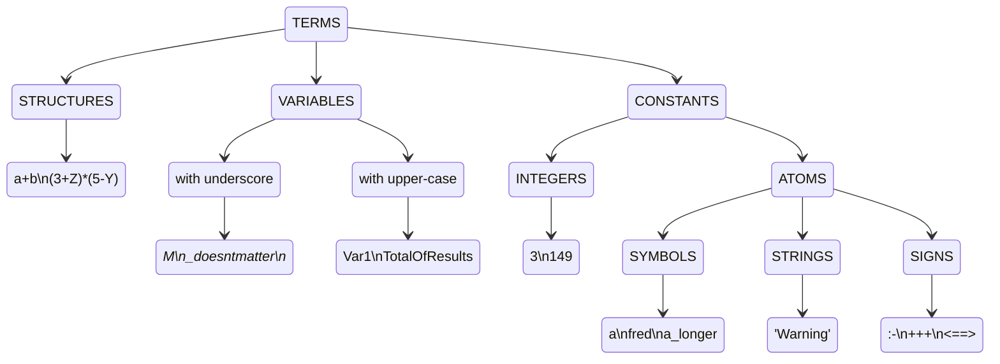

# Prolog

**网上教程**：[前言 · Prolog 教程 (zhzluke96.github.io)](https://zhzluke96.github.io/prolog-tut-cn/)

**pdf**： [Prolog Step-by-Step.pdf](..\..\GoodBooks\计算机科学\prolog\Prolog Step-by-Step.pdf) 

> **启动Prolog(Swi-prolog)**
>
> 1. 打开SWI-Prolog
> 2. 在cmd中输入swipl（如何需要执行某些文件时比较好用，可以直接索引到当前目录）
>
> **退出Prolog(Swi-prolog)**
>
> 输入 `halt.`
>
> **编译程序**
>
> ```cmd
> swipl -o example.exe -c example.pl
> ```
>
> **在swi-prolog命令行编写规则**
>
> ```cmd
> ?- [user].
> |: hello :- format('Hello').
> ```
>
> 编写完规则后，按`ctrl+C`退出，再在命令行中执行规则：
>
> ```cmd
> 20 ?- hello.
> Hello~n
> true.
> ```
>
> **在命令行中编辑文件**
>
> ```prolog
> use_module(library(edit)).
> edit("hello.pl").
> ```
>
> 在windows下会默认打开记事本。
>
> **在swi-prolog中编辑文件**
>
> `File`->`New`：新创建文件
>
> `File`->`Edit`：在pce中编辑已存在的文件


## 基础语法

### 打印指令

简单的Prolog命令由一个名称(谓词名称)组成，后面是所涉及的数据项(参数)周围的括号。用于简单打印的Prolog命令是`write().`，注意prolog语句需要以`.`号做结尾。`nl`相当于换行，`tab(3)`空3格。

```cmd
?- write('hello').		
hello
true.
?- write("hello"), nl, write("world").	
hello
world
true.
?- write('hello'), tab(3), write('world').
hello   world
true.
```


### 执行自己的procedures

可以使用`consult(prog1)`来执行procedures，一个简单的procedure有两个主要部分——标题(有时称为“左侧”)和主体(有时称为“右侧”)。标题给出了程序的名称，而主体是命令序列(即一个或多个命令，以`,`分隔，以`.`结束)，标题和主体通过`:-`分隔。

假设有一个文件为 `hello.pl`，文件内容如下

```prolog
hello % 标题
:-		
write('hello,'), tab(2), write('world').	% 主体
```

注意这里的`:-`也可以看成是一个函数，即可以这样表示：
```prolog
':-'(hello, (write('hello,'), tab(2), write('world'))).
```


在存放文件的目录下打开cmd，输入命令

```cmd
3 ?- consult('hello.pl').
true.
4 ?- hello.		% 可以直接调用函数
hello,  world
true.
```

调用当前目录下的文件还可以通过下面的方式

```cmd
1 ?- [likes].
true.
```

源文件也可以作为`swipl`的参数，如

```cmd
$ swipl likes.pl
```

当文件存放在swi-prolog的安装路径下，如`likes.pl`放在demo文件夹中，则可以通过下面的语句来调用：

```cmd
?- [swi(demo/likes)].
true.
```

Prolog中的procedure通常称为**谓词**或者**规则**，后一个名称反映了左边指定如何执行右边的想法。一般来说谓词和procedure意思相近，但是规则往往表示procedure中的一条子句。

假设有一个文件`choice.pl`，内容如下

```prolog
hello(a) :- write('hello a').
hello(b) :- write('hello ab').
hello(c) :- write('hello abc').
```

当使用规则(procedure)时，系统选择其中一个定义并使用它。系统通过搜索为该谓词列出的所有定义(子句)来进行选择，直到找到一个与当前目标匹配的标题(左侧)。(搜索是按照您提供的子句的顺序进行的，从第一个到最后。这在这些非常简单的例子中可能并不明显，但在更复杂的谓词中很快就会变得非常重要。)

```cmd
1 ?- consult('choice.pl').
true.
3 ?- hello(a).
hello a
true.
4 ?- hello(b).
hello ab
true.
5 ?- hello(c).
hello abc
true.
6 ?- hello(d).
false.
```

**注释**：前面已经看到了使用`%`作为注释符，还有`/* */`作为多行或行内注释符。

**shell操作**

当源文件放在其它文件夹内，需要切换目录。

`pwd.`：查看当前目录

`cd("D:").`：切换至指定目录，支持中文，支持类Unix路径（D:/XXX/XXX）或者window（D:\\\XXX\\\XXX），注意`cd("~/").`返回C盘的用户路径，`cd("~/Desktop").`则是返回桌面。

`ls.`：输出当前路径下的文件名集合。

`mv("myfile", "outfile").`：移动（改名）文件

`rm("file").`：删除文件

### 变量

**任何以大写(大写)字母开头的符号都被Prolog视为变量。**

假设有一个文件`greet.pl`，内容为

```prolog
greet(Name) :- write('Hello,'), tab(3), write(Name).
```

```cmd
11 ?- consult("greet.pl").
true.
12 ?- greet("Tom").
Hello,   Tom
true.
```

由于Prolog在尝试查找匹配时从子句的顶部进行搜索，因此在开始时查找适用的子句，而只有在没有其他匹配时才到达末尾的子句。请看下面的例子：

假设`greet2.pl`中的内容为：

```prolog
greet(Name) :- write('Hello,'), tab(3), write(Name).
greet(tom) :- write('tom').
```

由于第一条语句就是带参数的指令，所以不管是tom还是"Tom"都会被第一条语句捕获。

```cmd
18 ?- consult("greet2.pl").
true.
19 ?- greet("Tom").
Hello,   Tom
true.
20 ?- greet(tom).
Hello,   tom
true .	:: 此处的程序并不能直接停止，需要按一下回车键
```


假设`greet3.pl`中的内容为

```prolog
greet(tom) :- write('tom').
greet(Name) :- write('Hello,'), tab(3), write(Name).
```

由于第一条语句就是是不带参数的指令，所以当greet(tom)时会优先匹配到第一条语句，而"tom"会被第二条语句捕获，如果两条语句都无法捕获，就会返回false.。

```cmd
21 ?- consult("greet3.pl").
true.
22 ?- greet(tom).
tom
true .	:: 此处的程序并不能直接停止，需要按一下回车键
23 ?- greet("tom").
Hello,   tom
true.
```

假如这里给出的指令为`greet(Tom).`，注意Tom（大写字母开头）是一个变量。

```cmd
1 ?- consult('greet3.pl').
true.

2 ?- greet(Tom).
tom
Tom = tom
```

这里的输出结果出现暂停，程序询问我们Tom这个变量是否是tom，如果此时我们选择输入`;`或者空格键，第一条语句匹配失败，第二条语句匹配成功，并输出Tom这个变量的值。

```cmd
2 ?- greet(Tom).
tom
Tom = tom ;
Hello,   _9256
true.
```

输入回车键，程序会直接暂停，像这样

```cmd
3 ?- greet(Tom).
tom
Tom = tom .
```

如果输入`?`可以查看各种情况。

`var(X)`当X是一个未初始化的变量为真，否则为假：

```cmd
7 ?- var(X).
true.
8 ?- var(23).
false.
9 ?- X = Y, Y=23, var(X).
false.
```

`nonvar(X)`当X是一个初始化的变量时为真，否则为假：

```cmd
10 ?- nonvar(X).
false.
11 ?- nonvar(23).
true.
```

除此之外，还有`atom(X)`（判断是否是原子），`number(X)`（判断是否是数字），`atomic(X)`（判断是否是数字或者原子）。

```cmd
12 ?- atom(X).
false.
13 ?- atom(apple).
true.
14 ?- atom("apple").
false.
15 ?- atom('apple').
true.
16 ?- atom(var(23)).
false.
```


### 测试

```cmd
2 ?- 5<7.
true.
3 ?- 5>7.
false.
4 ?- 7=7.
true.
```

prolog中有内置运算符`><=`来判断大小

当存在一系列语句时，其中一条语句为假时，整条语句为假，即语句之间是合取的关系

```cmd
5 ?- 3<7,2<4,10<12.
true.
6 ?- 3<7, 4<2, 10<12.
false.
```

`compare.pl`的文件内容为

```prolog
bigger(N,M) :- N < M, write('Bigger number is'), tab(1), write(M).
bigger(N,M) :- N > M, write('Bigger number is'), tab(1), write(N).
bigger(N,M) :- write('The two number is equal').
```

上面一共有三条规则，第一条N<M时，输出M最大，第二条N>M时，输出N最大，第三条直接输出两个数字相等。

```cmd
8 ?- bigger(3,7).
Bigger number is 7
true .
9 ?- bigger(7,3).
Bigger number is 7
true .
10 ?- bigger(7,7).
The two number is equal
true.
```

当输入`bigger(7,7).`，由于两个数字一样大，所以前两条规则都不符合，所以只会输出第三条规则。

`compare1.pl`的文件内容如下

```prolog
larger(N,M,M):- N<M.
larger(N,M,N):- M<N.
larger(N,M,M).
```

当输入`larger(6,6,Result).`，对于第一条规则，将N置为6，M置为6，Result置为M，由于不满足N<M或N>M，所以直接执行最后一条规则，即Result=M=6。输入`larger(8,3,Result).`，对于第一条规则，将N置为8，M置为3，Result置为M，但是N>M，所以不满足条件跳到第二条规则，此时将N置为8，M置为3，Result置为N，满足条件，则Result=N=8。注意此时程序并不会直接停止，而是询问是否需要执行下面的语句，如果输入`;`，表示redo，则会执行最后一条规则，将Result=M=3。

```cmd
2 ?- larger(6,6,Result).
Result = 6.
3 ?- larger(8,3,Result).
Result = 8 .
4 ?- larger(3,8,Result).
Result = 8 .
5 ?- larger(8,3,Result).
Result = 8 ;
Result = 3.
```


### 事实

prolog中的语句可以只有标题部分，如`greet(tom) :-.`或者`greet(tom).`，这些称为事实，即为正确，默认执行为true.。

假设`fact.pl`的文件内容如下

```prolog
greet(tom).
```

```cmd
7 ?- consult("fact.pl").
true.
8 ?- greet(tom).
true.
9 ?- greet(Tom).
Tom = tom.
```

假设`fact.pl`的文件内容如下

```prolog
man(paul).
man(david).
man(peter).
woman(louise).
woman(helen).
woman(mandy).
wifeof(paul, louise).
wifeof(peter, helen).
sonof(paul, peter).
daughterof(peter, mandy).
```

```cmd
10 ?- consult("fact.pl").
true.
11 ?- man(peter).	
true.
12 ?- man(louise).
false.
13 ?- woman(Someone).		::查询哪些人是女性
Someone = louise ;
Someone = helen ;
Someone = mandy.
14 ?- wifeof(paul, Hiswife).	:: 查询paul的妻子
Hiswife = louise.
15 ?- wifeof(Herhusband, louise).
Herhusband = paul.
16 ?- daughterof(Father, mandy).	:: 查询mandy的父亲
Father = peter.
17 ?- sonof(david, Son).		:: david没有儿子
false.
18 ?- cousin(david, Son).
ERROR: Unknown procedure: cousin/2 (DWIM could not correct goal)
```

事实和规则写在一起，如`factrule.pl`的内容如下

```prolog
parentof(Person1, Person2):-daughterof(Person1, Person2).
parentof(Person1, Person2):-sonof(Person1, Person2).
```

这里定义了父母和子女之间的对应关系，注意这里需要同时consult上面的`fact.pl`和这里的`factrule.pl`

```cmd
21 ?- parentof(peter, Child).
Child = mandy .
22 ?- parentof(Parent, Child).	:: 这里查询父母和子女之间的关系，需要用;号来输出更多内容
Parent = peter,
Child = mandy ;
Parent = paul,
Child = peter.
```

当一段程序中既有事实，又有规则时，那么最好将**事实放在规则前面**：

```prolog
person(adam).
person(X) :- person(Y), mother(X, Y).
```

如果输入`person(X)`，那么显然会输出结果`X=adam`，但是当程序写成下面这种形式：:warning:

```prolog
person(X) :- person(Y), mother(X, Y).
person(adam).
```

此时输入`person(X)`，就会出现不断递归，直到堆栈空间溢出。

### 简单跟踪（debug）

`spy(larger)`

```cmd
24 ?- spy(larger).
% Spy point on larger/3
true.
[debug] 25 ?- larger(8, 3, Result).
   Call: (10) larger(8, 3, _5652) ? creep
   Call: (11) 8<3 ? creep
   Fail: (11) 8<3 ? creep
   Redo: (10) larger(8, 3, _5652) ? creep
   Call: (11) 3<8 ? creep
   Exit: (11) 3<8 ? creep
   Exit: (10) larger(8, 3, 8) ? creep
Result = 8 .		:: 此处直接回车
[trace] 26 ?- larger(8, 3, Result).
   Call: (10) larger(8, 3, _1616) ? creep
   Call: (11) 8<3 ? creep
   Fail: (11) 8<3 ? creep
   Redo: (10) larger(8, 3, _1616) ? creep
   Call: (11) 3<8 ? creep
   Exit: (11) 3<8 ? creep
   Exit: (10) larger(8, 3, 8) ? creep
Result = 8 ;	:: 此处输入;
   Redo: (10) larger(8, 3, _1616) ? creep
   Exit: (10) larger(8, 3, 3) ? creep
Result = 3.
```

不想再debug了，可以使用`nospy(larger)`。

在swi-prolog中还有其它与debug相关的指令参见[SWI-Prolog -- Debugging and Tracing Programs](https://www.swi-prolog.org/pldoc/man?section=debugger)。

在**swi-prolog**进入debug模式可以使用`trace.`，退出使用`nodebug.`。

有关Debug的更多内容，如如何设置断点，`trace.`的各种模式等，请参阅：[SWI-Prolog -- Overview of the Debugger](https://www.swi-prolog.org/pldoc/man?section=debugoverview)

### 更详细的回溯

假设`family.pl`中有以下定义

```prolog
grandparent(OldPerson, YoungerPerson):-parentof(OldPerson, Another), parentof(Another, YoungerPerson).
```

```cmd
1 ?- consult("fact.pl").
true.
2 ?- consult("factrule.pl").
true.
3 ?- consult("family.pl").
true.
4 ?- grandparent(GrandDad, mandy).
GrandDad = paul .
5 ?- grandparent(paul, GrandChild).
GrandChild = mandy .
```

当开启`spy`后

```cmd
6 ?- spy(grandparent).
% Spy point on grandparent/2
true.
[debug] 7 ?- grandparent(paul, GrandChild).
   Call: (10) grandparent(paul, _216) ? creep
   Call: (11) parentof(paul, _1434) ? creep
   Call: (12) daughterof(paul, _1434) ? creep
   Fail: (12) daughterof(paul, _1434) ? creep
   Redo: (11) parentof(paul, _1434) ? creep
   Call: (12) sonof(paul, _1434) ? creep
   Exit: (12) sonof(paul, peter) ? creep
   Exit: (11) parentof(paul, peter) ? creep
   Call: (11) parentof(peter, _216) ? creep
   Call: (12) daughterof(peter, _216) ? creep
   Exit: (12) daughterof(peter, mandy) ? creep
   Exit: (11) parentof(peter, mandy) ? creep
   Exit: (10) grandparent(paul, mandy) ? creep
GrandChild = mandy .
```


### 计算

在prolog直接输入`3+4`会直接报错，Prolog通常不把`+`当作表示数字相加的符号。像3 + 4这样的表达式可以看作是一个结构，其中的两个组件(3,4)只是进一步的数据项。

可以这样输入

```prolog
X = 3+4.
```

```cmd
5 ?- V + W = 3 + 4.
V = 3,
W = 4.
```

在上面的例子中，V+M和3+4是两个结构，对应的位置相等，下面是两个更加复杂的例子

```cmd
6 ?- (3+4) * (7+9) = (A + 4) * M.
A = 3,
M = 7+9.
7 ?- (3+4) * (7+9) = (C+D) * (E+F).
C = 3,
D = 4,
E = 7,
F = 9.
```

注意使用的都是变量（大写字母开头）。

prolog可以这样计算数值

```cmd
9 ?- N is 3 + 1.
N = 4.
11 ?- Calculation = (2 * 3) + (5 * 4), Value is Calculation.
Calculation = 2*3+5*4,
Value = 26.
12 ?- Calculation = (2 * 3) + (5 * 4), Value is Calculation + 1.
Calculation = 2*3+5*4,
Value = 27.
23 ?- X is 10//3.   :: 整除
X = 3.
24 ?- X is 10 mod 3.	:: 取余
X = 1.
```

**计算阶乘**  <div id='factorial'> </div>

```prolog
sum(1,1):- !.	% 这里需要!，防止继续递归，与列表不同，当列表为空时，就满足不了条件了，但是这里还可以到负数，不过列表也可以在这里加上!.
sum(X, N):- X1 is X - 1, sum(X1, N1), N is N1 + X.
```

或者

```prolog
sum(0, N, N):- !.
sum(X, N, S):- X1 is X-1, N1 is N + X, sum(X1, N1, S).
```

但是需要注意的是`\+`有时并不会特别效率，如：

```prolog
A:- B, C.
A:-\+B, D.
```

程序可能会试图匹配B两次，如果换成下面，可能会更加有效率

```prolog
A :- B, ! C.
A :- D.
```

### 比较

| 谓词    | 功能     |
| ------- | -------- |
| `>/2`   | 大于     |
| `</2`   | 小于     |
| `=</2`  | 小于等于 |
| `>=/2`  | 大于等于 |
| `=\=/2` | 数值不等 |
| `=:=/2` | 数值相等 |


### 术语和标记



**如果变量只是一个下划线，那么它可以匹配任何东西，并且永远不需要绑定。**

结构是Prolog的重要组成部分。虽然到目前为止仅有的例子是算术表达式，但还有其他的例子，包括内置的和用户定义的。

对于一个谓词，它拥有的参数的数量被称为它的arity，一个有N个参数的谓词被称为“N-ary”谓词。通常的做法不是简单地通过谓词的名称(例如larger，parentof)来引用谓词，而是通过它们的名称与它们的属性配对来引用谓词:larger/3, parentof/2等。其中一个原因是程序可能包含具有相同名称但性质不同的不同谓词。


### 列表

Prolog中常用的数据结构是列表。

```cmd
13 ?- [1, What, 2, X, 3] = [A, b, C, d, E].
What = b,
X = d,
A = 1,
C = 2,
E = 3.
```

可以使用`|`符号来分割列表

```cmd
14 ?- [a,b,c,d] = [X|Y].
X = a,
Y = [b, c, d].
15 ?- [a,b,c,d] = [X|[Z|W]].	:: 注意不能写成 [a,b,c,d] = [X|Z|W].，这样会报错。
X = a,
Z = b,
W = [c, d].
```


### 一般结构

```cmd
17 ?- Theman = person('Dave the Dude', '58 Broadway', 36).
Theman = person('Dave the Dude', '58 Broadway', 36).
18 ?-  person(Name, Address, Age) = person('Dave the Dude', '58 Broadway', 36).
Name = 'Dave the Dude',
Address = '58 Broadway',
Age = 36.
19 ?- person(Someone, _ , 45) = person('Harry the Horse', '42nd and Vine', 45).
Someone = 'Harry the Horse'.
```

将算术运算作为结构，即使用中缀算子

```cmd
20 ?- +(2, *(5, 6)) = 2 + (5 * 6).
true.
21 ?- Result is +(2, *(5, 6)).
Result = 32.
```

列表实际上是一种函子实参结构，列表由一个函子连接在一起，该函子打印为一个简单的点或句号。这个函子将列表中的第一个元素连接到列表的其余部分。

这里的写法似乎不适用于`swi-prolog`...


### 循环

```cmd
?- X = X+1.
?- Y = 1 + Y.
?- B = g(B).
```

当试图打印这些时，打印机将无限循环。对于X = X + 1，什么也看不见，因为打印机一直从X到X再到X，没有找到任何要打印的东西。对于Y = 1+ Y，打印机将打印(1+(1+(1+1+(1+(1+...无限循环，B = g(B)会显示g(g(g(g(g(g(...。

Prolog中的Unfication（即=）是基于形式逻辑中定义良好的数学运算，但在逻辑中这种循环结构是不允许的：适当的逻辑统一有一个检查(发生检查)，以确保变量永远不会与包含它的任何东西统一。Prolog，为了提高效率和作为一种通用的编程语言，省略了这个检查，因此允许使用这些结构。

**Prolog中不推荐使用循环**。

### 输入输出

`read`用于读取用户输入，需要加`.`。

```cmd
2 ?- read(Date).
|: 2023.	:: 输入时需要注意加上.

Date = 2023.
```

**空格**

```prolog
spaces(0) :- !.
spaces(N) :- write(" "), N1 is N-1, spaces(N1).
```

**读取字母**

`get_char`获取字母，注意该函数只会获取一个字母，输入数字也会被认为是字母，且不需要加`.`。

```prolog
8 ?- get_char(X).
|: A

X = 'A'.
```

这段程序的作用是判断用户是否输入了qw或者cv，如果输入了返回no，否则返回yes。

```prolog
check_line(OK) :- get_char(X), rest_line('\n', X, OK).
rest_line(_, '\n', yes) :- !.
rest_line(Last, Current, no) :-
typing_error(Last, Current), get_char(New), rest_line(Current, New, _).
rest_line(_, Current, OK) :- get_char(New), rest_line(Current, New, OK).
typing_error('q', 'w').
typing_error('c', 'v').
```

**输出字母**

`put_char`的作用是输出字符

```cmd
11 ?- put_char('h'), put_char('e'), put_char('l'), put_char('l'), put_char('o').
hello
true.
```

**读入英语句子**

`read_in`的作用是读取输入的句子，并按照英文文法分割成列表。

```cmd
?- read_in(S).
```

该方法在swi-prolog中不支持:warning:。

**读写文件**

```cmd
?- open("myfile.pl", read, X).
X = <stream>(000002528a057130).
?- open("output.pl", write, X).
```

上面的代码只是打开，更加具体的代码为：

```prolog
readfile(File) :- open(File, read, X), code_reading_from(X), close(X).
writefile(File) :- open(File, write, X), code_writing_to(X), close(X).
```

swi-prolog似乎也不支持...


## 进阶内容

### 流程控制

Prolog的内部谓词，如write，nl和tab。

Prolog的内部流程控制示意图如下


上图中左上角的菱形方块表示从`Call`端口进入目标时所进行的处理。它从某谓词的第一个子句开始搜索，如果匹配成功就到`Exit`端口，如果没有找到任何一个子句与目标匹配就转到`Fail`端口。 右下角的方块表示从`Redo`端口进入目标时所进行的处理，从最近一次成功的子句开始向下搜索，如果匹配成功就转到`Exit`端口，如果没有找个更多的子句满足目标就转到`Fail`端口。

 `I/O`谓词的流程控制和上述的不同，它不会改变流程的方向，如果流程从它的左边进入，就会从它的右边流出；而如果从它的右边进入，则会从它的左边流出。


还有一个专门引起回溯的内部谓词`fail/0`，从它的名字不难看出，它的调用永远是失败的。如果`fail/0`从左边得到控制权，则它立即把控制权再传回到左边。它不会从右边得到控制，因为没法通过`fail/0`把控制权传到右侧。它的内部流程控制如下：


之前我们是靠使用`';'`来进入目标的`Redo`端口的，并且变量的值的输出是靠解释器完成的。现在有了上面几个内部谓词，我们就可以靠`I/O`谓词来显示变量的值，靠`fail`谓词来引起自动的回溯。

如在[nani.pl](#nani)中，

```prolog
5 ?- room(X), location(Y, X), write(X), nl, fail.	% 通过write输出变量的值，通过fail自动回溯
kitchen
kitchen
kitchen
office
office
cellar
false.
```

### 数据管理

Prolog的程序就是谓词的数据库，我们通常把这些谓词的子句写入Prolog的程序中的。在运行Prolog时，`解释器`首先把所有的子句调入到内存中。所以这些写在程序中的子句都是固定不变的。那么有没有办法动态地控制内存中的子句呢？Prolog提供了这方面的功能。

`asserta(X)`可以将X当成子句加入到数据库中，如果内存中已经有了下面的几个事实：

```prolog
people(a).
people(b).
people(c).
```

如果运行了`asserta(people(d))`之后，内存中的`people/1`的子句就变成了下面这个样子

```prolog
people(d).
people(a).
people(b).
people(c).
```

`assertz/1`和`asserta/1`的功能类似，只不过它把X子句追加为最后一个子句。

`retract(X)`用于将子句X从动态数据库中删除，这个操作是不可逆的。

swi-prolog中只有通过下面这种方式标记谓词动态修改，才能对谓词进行上述的`assertz/1`、`asserta/1`和`retract`操作。

```prolog
dynamic here/1.
```

如

```prolog
:-dynamic here/1.	% 标记动态的谓词

% ...

move(Place):- 
    retract(here(_)), 	% 删除旧的数据
    asserta(here(Place)).	% 添加新的数据
```

数据库相当于其它程序中的全局变量，在不同的procedure中都能使用。

### 递归

```prolog
is_contain_in(T1, T2) :-	% 检查T1是否在T2中
location(X, T2), 			% 找到在T2中的X
is_contain_in(T1, X).		% 判断T1是否在X中
```

这段代码在查询`is_contain_in(X, office)`时会更快一点，因为将office绑定到了T2上。

```prolog
is_contain_in(T1, T2) :-	% 检查T1是否在T2中
location(T1, X), 			% 找到T1在哪些X中
is_contain_in(X, T2).		% 判断X是否在T2中
```

这段代码在查询`is_contain_in(key, X)`时会更快一点，因为将key绑定到了T1上。

### 结构

下面这段代码定义了一个desk，颜色是brown，长宽高是dimension(6,3,3)，重量是90。

```prolog
object(desk, brown, dimension(6,3,3), 90).
```

这个object可以直接作为参数使用

```prolog
location_s(object(desk, brown, dimension(6,3,3), 90), office).
```

查询时可以使用

```prolog
location_s(object(X, Color, Size, Weight), office).	% 这里的X, Color, Size, Weight均会被绑定值。
```

### 列表 

使用列表将多个参数一次性传给谓词。

```prolog
loc_list([apple, broccoli, crackers], kitchen).	% 将[apple, broccoli, crackers]放在kitchen。
loc_list([], hall).		% hall中没有物体。
```

**遍历列表**

假设`list.pl`的内容如下

```prolog
loc_list([apple, broccoli, crackers], kitchen).
find(X):-
[Y|W] = X, write(Y),tab(2) , find(W).
```

输入`loc_list(X, kitchen), find(X).`，可以得到下面的输出

```cmd
17 ?- loc_list(X, kitchen), find(X).
apple  broccoli  crackers
false.
```

还有另外一种写法，这种写法似乎更加正确

```prolog
loc_list([apple, broccoli, crackers], kitchen).
find([H|T]):-
write(H),tab(2) , find(T).
find([]).
```

```cmd
19 ?- loc_list(X, kitchen), find(X).
apple  broccoli  crackers
X = [apple, broccoli, crackers].
```

**查找一个元素是否在列表中**

```prolog
member(H,[H|T]).	% X是否是H
member(X,[H|T]) :-	% 如果X不是H，那么判断是否在T中
    member(X,T).
```

或者使用`_`匹配任意值

```prolog
member(X, [X|_]).
member(X, [_|Y]) :- member(X, Y).
```

**判断是否是列表**

```prolog
islist(A|B) :- islist(B).
islist([]).
```

另外一种写法，在针对单个变量时不会再进入循环，不过稳定性不是特别的好。

```prolog
weak_islist([_|_]).
weak_islist([]).
```

**在列表中增加元素**

```prolog
append([],X,X). 
append([H|T1],X,[H|T2]) :- append(T1,X,T2).
```

当输入 `append([a,b,c],[d,e,f],Z)`时，H绑定[a]，T1绑定[b, c]，X绑定[d,e,f]，Z绑定 [a,T2]；之后输入`append(T1, X, T2)`，此时H绑定[b]，T1绑定[c]，X绑定[d,e,f]，T2绑定[b,T2]，即Z绑定[a,b,T2]；继续输入`append(T1, X, T2)`，此时H绑定[c]，T1为[]，X绑定[d,e,f]，T2绑定[c, T2]，即Z绑定[a,b,c,T2]；再进行输入时，由于T1为[]，X绑定[d,e,f]，T2绑定X，也是[d,e,f]，因此回溯后Z绑定[a,b,c,d,e,f]。

**将多条事实转为列表**

使用swi-prolog提供的内部谓词`findall`

```cmd
26 ?- findall(X, room(X), L).	% 查找所有的房间，并作为列表返回
L = [kitchen, office, hall, 'dining room', cellar].
```

```cmd
?- findall(foodat(X,Y), (location(X,Y) , edible(X)), L).
L = [foodat(apple, kitchen), foodat(crackers, kitchen)]
```

**列表长度**

```prolog
lenoflist([A|B], Len, N) :- Len1 is Len+1, lenoflist(B, Len1, N).
lenoflist([], N, N).
```

在命令行中输入`lenoflist([a,b,c], 0, N).`，输出为

```cmd
11 ?- lenoflist([a,b,c], 0, N).
N = 3.
```


### 映射

对于一个prolog结构，如果我们想要构造一个新结构类似它，但是有些不同，可以使用**映射**。

假设我们现在要做的转化为：

```prolog
change(you, i).
change(are, [am, not]).
change(french, german).
change(do, no).
change(X, X).  /* match remain condition */
alter([],[]).
alter([H|T], [X|Y]) :- change(H, X), alter(T,Y).
```

输入`alter([you, are, a, computer], Z).`，输出为：

```cmd
8 ?- alter([you, are, a, computer], Z).
Z = [i, [am, not], a, computer] ;
Z = [i, are, a, computer] ;
Z = [you, [am, not], a, computer] ;
Z = [you, are, a, computer].
```

可以看到有多余的输出，可以考虑使用截断来终止回溯，将最后一句改为：

```prolog
alter([H|T], [X|Y]) :- change(H, X), ! alter(T,Y).
alter([H|T], [X|Y]) :- change(H, X), alter(T,Y), !. % 或者这一句
```


### 操作符

可以使用内部谓词`op/3`来定义操作符，它的三个参数分别是：优先权、结合性、操作符名称。

```prolog
is_in(apple, room(kitchen)).	%定义事实
op(35, xfx, is_in).		 % 将谓词转为操作符，xfx表示中缀，35表示优先级
```

可以有如下操作

```cmd
?- apple is_in X. 
X = room(kitchen)
?- X is_in room(kitchen).
X = apple
```

同样可以使用操作符来定义事实。

```prolog
banana is_in room(kitchen).
```

通过`display/1`可以看到

```cmd
?- display(banana is_in room(kitchen)). 
is_in(banana, room(kitchen))
```

fx表示前缀，如

```cmd
?- op(33,fx,room). 
?- room kitchen = room(kitchen). 	% 使用前缀方式定义事实
yes 
?- apple is_in X. 
X = room kitchen
```

xf表示后缀，如

```cmd
?- op(33,xf,turned_on).
flashlight turned_on. 
?- turned_on(flashlight) = flashlight turned_on. 
yes
```

使用操作符能让程序更易读，但是需要考虑操作符之间优先度的问题。

### 截断

并不是所有的回溯都是必需的，因此prolog提供了完成这一功能的谓词，叫做`cut`，用符号`!`表示。`Cut`能够有效地剔除一些多余的搜索。如果在`cut`处产生回溯，它会自动地失败，而不去进行其它的选择。

为了说明`cut`的作用，首先加入几条事实：

```prolog
data(one). 
data(two).
data(three).
```

这是没有使用`cut`的情况：

```prolog
cut_test_a(X) :-
    data(X). 
cut_test_a('last clause').
```

下面是对上面的事实与规则的一次询问。

```prolog
?- cut_test_a(X), write(X), nl, fail. 
one
two
three 
last clause
false.
```

如果使用了`cut`，那么只会输出一个

```prolog
cut_test_b(X) :-
    data(X), !. 
cut_test_b('last clause').
```

```cmd
?- cut_test_b(X), write(X), nl, fail. 
one
```

下面我们看看把`cut`放到两个子目标中的情况。

```prolog
cut_test_c(X,Y) :-
    data(X), !, data(Y). 
cut_test_c('last clause').
```

```cmd
?- cut_test_c(X,Y), write(X-Y), nl, fail.
one - one 
one - two 
one - three 
no
```

`cut`抑制了其左边的子目标`data(X)`与`cut_test_c`父目标的回溯，而它右边的目标`data(Y)`则不受影响。

不使用`cut`符号，还可以考虑使用`not`这个内部谓词，下面这两条语句执行了相同的功能

```prolog
puzzle(goto(cellar)):-
    have(flashlight),
    turned_on(flashlight),
    !, fail.	% 使用 ! 使其不去回溯下面的puzzle子句

puzzle(_).

```

```prolog
puzzle(goto(cellar)):- 
    not(have(flashlight)), 
    not(turned_on(flashlight)),
    vwrite('It's dark and you are afraid of the dark. '),
    fail. 
puzzle(X):-
    not(X = goto(cellar)).

```

值得注意的是，not谓词本身可以通过cut来定义

```prolog
not(X) :-
    call(X), !, fail.	% call也是一个内部谓词
not(X).
```


注意相比`!`，用`\+`是一个更好的习惯，`\+`是prolog内置的谓词，`\+X`表示只有当X作为prolog目标失败时，目标`\+X`才会成功，所以`\+X`意味着“X作为prolog目标是不能满足的”。可以将[阶乘](#factorial)的例子改写为

```prolog
sum(1, 1).
sum(X, N) :- \+(X=1), X1 is X-1, sum(X1, N1), N = N1+X.
```

或者

```prolog
sum(X, 1) :- X =< 1.
sum(X, N) :- \+(X =< 1), X1 is X-1, sum(X1, N1), N = N1+X.
```

事实上可以将`\+(N=1)`换成`N\=1`，`\+(X =< 1)`换成`X > 1`。


### 指令循环

`repeat`

```prolog
command_loop:- 
    repeat,
    write('Enter command (end to exit): '),
    read(X),
    write(X), nl,
    X = end.
```

只有当输入end，X绑定end后，X=end时成功，而`repeat/0`在回溯时将永远成功，所以这种结构能够让中间的目标可以重复执行。

下面再看`do/1`，这里的多条语句和do case结构类似。

```prolog
do(goto(X)):-
    goto(X),!.
do(go(X)):-
    goto(X),!.
do(inventory):-
    inventory,!.
do(look):-
    look,!.
```

此处的`cut`有两个用途。第一，如果我们找到了一条该执行的do子句，就没有必要去寻找更多的do子句了；第二，它有效地防止了在回溯时又重新运行`read`目标。

递归有两种类型。在真正的递归程序中，每一层必须使用下一层调用返回的信息。这意味着Prolog必须建立堆栈来储存每一层的信息。

这与重复操作是不同的，在通常的语言中，我们一般使用的是重复操作。重复操作只需要把信息传递下去就行了，而不需要保存每一次调用的信息。我们可以使用递归来实现重复，这种递归就叫做尾递归。它的通常的形式是递归语句在最后，每一层的计算不需要使用下一层的返回信息，所以在这种情况下，好的Prolog解释器不需要使用堆栈。

下面是一个尾递归的例子

```prolog
factorial_2(1,F,F).
factorial_2(N,T,F):-
    N > 1,
    TT is N*T,
    NN is N - 1,
    factorial_2(NN,TT,F).
```

翻转列表

```prolog
reverse([], Rev, Rev).
reverse([H|T], Temp, Rev) :-
    reverse(T, [H|Temp], Rev).

```

### 内置库

swi-prolog中有许多内置的库，详见[library (swi-prolog.org)](https://www.swi-prolog.org/pldoc/doc/_SWI_/library/index.html)。

如`lists.pl`中包含了大量的列表操作函数，如`append/3`，`member/2`等，对于一个函数（谓词），可以使用`listing`来给出它的用法，如

```cmd
13 ?- listing(reverse).
lists:reverse(Xs, Ys) :-
    reverse(Xs, Ys, [], Ys).

lists:reverse([], [], Ys, Ys).
lists:reverse([X|Xs], [_|Bound], Rs, Ys) :-
    reverse(Xs, Bound, [X|Rs], Ys).

true.
```

## 例子

### 汉诺塔问题

代码：

```prolog
move(1, Start, End, Middle) :-
write("from "), write(Start), write(" to "), write(End), nl.
move(N, Start, End, Middle) :-
N > 1,  % when N > 1
M is N-1,
move(M, Start, Middle, End),    % move N-1 disk from Start to Middle
move(1, Start, End, Middle),    % move the last disk from Start to End
move(M, Middle, End, Start).    % move N-1 disk from Middle to End
```

运行结果：

```cmd
8 ?- move(3, 'S', 'E', 'M').
from S to E
from S to M
from E to M
from S to E
from M to S
from M to E
from S to E
true .
```


### 寻找Nani


我们从定义基本的事实开始，这些事实是本游戏的基本的数据库。它们包括：<div id='nani'></div>

- 房间和它们的联系
- 物体和它们的位置
- 物体的属性
- 玩家在游戏开始时的位置

使用`room/1`谓词定义房间

```prolog
room(kitchen). 
room(office). 
room(hall). 
room('dining room'). 
room(cellar).
```

我们使用具有两个参数的谓词`location/2`来定义物体的位置。第一个参数代表物体的名称，第二个参数表示物体的位置。开始时，我们加入如下的物体。

```prolog
location(desk, office).
location(apple, kitchen).
location(flashlight, desk).
location('washing machine', cellar). 
location(nani, 'washing machine').
location(broccoli, kitchen). 
location(crackers, kitchen).
location(computer, office).

```

定义一个单向门 `door/1`

```prolog
door(office, hall). 
door(kitchen, office).
door(hall, 'dining room'). 
door(kitchen, cellar).
door('dining room', kitchen).
```

通过`connect/2`来使门变成双向

```prolog
connect(X,Y) :- door(X, Y).
connect(X,Y) :- door(Y, X).
```

定义物体属性

```prolog
edible(apple). 
edible(crackers). 
tastes_yucky(broccoli).
```

最后，定义手电筒（由于是晚上，玩家必须想找到手电筒，并打开它才能到那些关了灯的房间）的状态和玩家的初始位置。

```prolog
turned_off(flashlight).
here(kitchen).
```


### 图灵完备

如何证明一个语言是否图灵完备，用这个语言实现一个图灵机应该就是最直接的方法了

用prolog实现图灵机： [turing.pl](..\..\GoodBooks\计算机科学\prolog\codes\turing.pl) 


### 寻找迷宫


为了解决门是双向的问题，我们可以选择重新写一次上面的事实，然后更换参数即可，或者可以在程序表示每个门可以从两边走。

考虑一个函数`go(X,Y,T)`，如果能从X走到Y便是成功，第三个参数T是已经访问过的房间。

边界条件是我们从X走到Y（X=Y），可以表示为：

```prolog
go(X,X,T).
```

如果选择一个相邻的房间，称为Z，并且观察是否我们已经到过Z，如果没有，就到Z，并将Z加入到T中，可以表示为：

```prolog
go(X,Y,T) :- d(X,Z), \+member(Z,T), go(Z,Y,[Z|T]).
```

这里一共有三种可能的失败情况，第一，X没有路到其它地方；第二，选择的门已经到过了；第三不能从Z到Y即进行不下去了。这代表我们需要回溯来寻找一个新门。

为了表示门可以从两边打开，可以加入下面的语句：

```prolog
go(X,Y,T) :- d(Z,X), \+member(Z,T), go(Z,Y,[Z|T]).
```

或者通过`;`来结合这两段语句：

```prolog
go(X,X,T).
go(X,Y,T) :- (d(X,Z); d(Z,X)), \+member(Z,T), go(Z,Y,[Z|T]).
```


# Lisp(Racket)

>DrRacket中注释的快捷键为 `ctrl+alt+;`，补全代码的快捷键为`ctrl+/`

## The Racket Guide

>[The Racket Guide (racket-lang.org)](https://docs.racket-lang.org/guide/index.html)


### Racket Essentials

#### 简单定义和表达式

`#lang ‹langname› ‹topform›`定义要使用的Lisp方言，如

```scheme
#lang racket ; 这是注释
```


**Defintions**

`define <id> <expr>`或`define (<id> <id>*) <expr>+`，(注意*号表示0个或多个，+号表示1个或多个)。

```scheme
#lang racket
(define (extract str)	; 定义etract(str)的功能时substring(str, 4, 7),即对字符串进行切片
  (substring str 4 7))	; substring是内置函数
(define pi 3.1415926)
(define (twice f v) (f (f v))) ; 定义一个函数f(f(v))
(define (louder v) (string-append v "!")) ; 在v的后面加上!
(extract "the cat out of the bag")	; 输出"cat"
(define (bake flavor)
  (printf "preheating oven...\n")	; 打印函数
  (string-append flavor " pie"))
(* pi 3)	; pi*3 输出9.424777800000001
(twice sqrt 16) ; 输出sqrt(sqrt(16)) = 2
(twice louder "hello") ;  "hello!!"
(bake "apple")	; 输出preheating oven... \n "apple pie"
```


**函数**

一些内置函数

```scheme
> (string-append "rope" "twine" "yarn")  ; append strings
"ropetwineyarn"
> (substring "corduroys" 0 4)            ; extract a substring
"cord"
> (string-prefix? "shoelace" "shoe")     ; recognize string prefix/suffix
#t						; #t 表示true
> (string-suffix? "shoelace" "shoe")
#f						; #f 表示false
> (string? "Ceci n'est pas une string.") ; recognize strings
#t
> (string? 1)
#f
> (sqrt 16)                              ; find a square root
4
> (sqrt -16)
0+4i
> (+ 1 2)                                ; add numbers
3
> (- 2 1)                                ; subtract numbers
1
> (< 2 1)                                ; compare numbers
#f
> (>= 2 1)
#t
> (number? "c'est une number")           ; recognize numbers
#f
> (number? 1)
#t
> (equal? 6 "half dozen")                ; compare anything
#f
> (equal? 6 6)
#t
> (equal? "half dozen" "half dozen")
#t
```


**条件语句 if or and cond**

`(if <expr> <expr> <expr>)`

第一个expr总是会被检查，如果正确，第二个expr会被执行得到最终结果，如果错误，执行第三个expr。

```scheme
> (if 
   	  (> 2 3)		      ; the first expr
      "2 is bigger than 3" ; the second expr
      "3 is bigger than 2" ; the third expr
      )
"3 is bigger than 2"
> (define (reply s)
  (if (string-prefix? s "hello ")
      "hi!"
      "huh?"))
> (reply "hello racket")
"hi!"
> (reply "λx:(μα.α→α).xx")
"huh?"
```

可以通过嵌套if结构来实现复杂的功能，但是太多的if影响阅读，可以使用and和or。

`(and <expr>*)`：有一个expr错误，为#f

`(or <expr>*)`：有一个expr正确，为#t

```scheme
> (define (reply-non-string s)
  (if (and (string? s) (string-prefix? s "hello "))
      "hi!"
      "huh?"))
> (reply-non-string "hello racket")
"hi!"
> (reply-non-string 17)
"huh?"
```

```scheme
> (define (got-milk? lst)
    (and (not (null? lst))		; (not (null? lst))表示列表非空
         (or (eq? 'milk (car lst))
             (got-milk? (cdr lst))))) ; recurs only if needed
> (got-milk? '(apple banana))
#f
> (got-milk? '(apple milk banana))
#t
```

假如if包含了一系列的测试，每个测试都会返回结果，这时候可以选择使用cond

`(cond {[<expr> <expr>*]}*)`

cond在方括号中有一些子句，每个子句中 第一个expr是测试的条件，如果为#t，这条子句剩余的expr将会执行，子句中的最后一个expr给出cond表达式的结果，其它的子句不会继续检查。如果为#f，剩下的expr都会被忽略，接着测试后面的语句。最后一个子句可以使用else来匹配前面子句没有出现#t的情况。

```scheme
(define (reply-more s)
  (cond
   [(string-prefix? s "hello ")
    "hi!"]
   [(string-prefix? s "goodbye ")
    "bye!"]
   [(string-suffix? s "?")
    "I don't know"]
   [else "huh?"]))
 
> (reply-more "hello racket")
"hi!"
> (reply-more "goodbye cruel world")
"bye!"
> (reply-more "what is your favorite color?")
"I don't know"
> (reply-more "mine is lime green")
"huh?"
> (reply-more "hello ?")	; 匹配一个后就不会匹配后面的
"hi!"
```


**函数调用**

`(<expr> <expr>*)`

```scheme
(define (double v)
  ((if (string? v) string-append +) ; 如果v是字符串，得到string-append，否则得到+
   v v))

> (double "mnah")
"mnahmnah"
> (double 5)
10
```


**匿名函数 lambda**

`(lambda (<id>*) <expr>+)`

```scheme
> (lambda (s) (string-append s "!"))	;lambda本身并不能单独使用
#<procedure>
> (twice (lambda (s) (string-append s "!")) ; 使用事先定义的函数twice来使用匿名函数
         "hello")
(define (make-add-suffix s2)		; 定义make-add-suffix作为匿名函数
  (lambda (s) (string-append s s2)))

> (twice (make-add-suffix "?!") "hello")
"hello?!?!"
```


**局部约束 define let let***

`(define (<id> <id>*) <defintion>* <expr>+)`

`(lambda (<id>*) <defintion>* <expr>+)`

```scheme
(define (converse s)
  (define (starts? s2) ; local to converse 定义了starts?函数，参数为s2
    (define spaced-s2 (string-append s2 " ")) ; local to starts? 定义spaced-s2为s2后面加上空格
    (string-prefix? s spaced-s2)) ; 判断s中是否以spaced-s2开始，这里starts?函数的定义结束
  (cond							; 这里使用上面的starts?开始测试
   [(starts? "hello") "hi!"]
   [(starts? "goodbye") "bye!"]
   [else "huh?"]))
 
> (converse "hello world")
"hi!"
> (converse "hellonearth")
"huh?"
> (converse "goodbye friends")
"bye!"
> (converse "urp")
"huh?"
> starts? ; outside of converse, so...
starts?: undefined;
 cannot reference an identifier before its definition
  in module: top-level
```

`(let({[<id> <expr>]}*)<expr>+)`或者
`(let prod-id ({[<id> <expr>]}*)<expr>+)`
每个绑定子句是一个id和一个expr，它们被方括号包围，子句后面的表达式是let的主体。在每个子句中，id与expr的结果绑定在一起，以便在主体中使用。

```scheme
> (let ([x (random 4)]
        [o (random 4)])
    (cond
     [(> x o) "X wins"]
     [(> o x) "O wins"]
     [else "cat's game"]))
"X wins"
```

let形式的绑定只能在let的主体中使用，因此绑定子句不能相互引用。相反，let*形式允许稍后的子句使用早期的绑定。

```scheme
> (let* ([x (random 4)]
         [o (random 4)]
         [diff (number->string (abs (- x o)))])	; 这里的diff使用了早期的绑定
    (cond
     [(> x o) (string-append "X wins by " diff)]
     [(> o x) (string-append "O wins by " diff)]
     [else "cat's game"]))

```


#### 列表迭代和递归

```scheme
> (list "red" "green" "blue")
'("red" "green" "blue")	; 一个列表在打印通常先打印一个'
> (length (list "hop" "skip" "jump"))        ; count the elements
3
> (list-ref (list "hop" "skip" "jump") 0)    ; extract by position
"hop"
> (list-ref (list "hop" "skip" "jump") 1)
"skip"
> (append (list "hop" "skip") (list "jump")) ; combine lists
'("hop" "skip" "jump")
> (reverse (list "hop" "skip" "jump"))       ; reverse order
'("jump" "skip" "hop")
> (member "fall" (list "hop" "skip" "jump")) ; check for an element
#f
> (assoc 'where								; 找到第一个值相等
         '((when "3:30") (where "Florida") (who "Mickey")))
'(where "Florida")
> (for-each (lambda (i) (display i)) '(1 2 3))
123
```


**预定义列表循环**

map函数对列表中的每一个元素应用函数来创建一个新列表

```scheme
> (map sqrt (list 1 4 9 16))
'(1 2 3 4)
> (map (lambda (i)
         (string-append i "!"))
       (list "peanuts" "popcorn" "crackerjack"))
'("peanuts!" "popcorn!" "crackerjack!")
```

andmap和ormap可以用于and和or来结合结果

```scheme
> (andmap string? (list "a" "b" "c"))
#t
> (andmap string? (list "a" "b" 6))
#f
> (ormap number? (list "a" "b" 6))
#t
```

处理多个列表

```scheme
> (map (lambda (s n) (substring s 0 n))
       (list "peanuts" "popcorn" "crackerjack")
       (list 6 3 7))
'("peanut" "pop" "cracker")
```

filter可以用于过滤列表

```scheme
> (filter string? (list "a" "b" 6))
'("a" "b")
> (filter positive? (list 1 -2 6 7 0))
'(1 6 7)
```

foldl函数泛化了一些迭代函数。它使用逐元素函数来处理一个元素并将其与当前值组合，因此 逐元素函数需要额外的第一个参数。此外，必须在列表之前提供一个起始当前值：

```scheme
> (foldl (lambda (elem v)
           (+ v (* elem elem)))	; 计算列表中元素的平方和
         10			; 起始值为 10
         '(1 2 3))
24
```


**列表迭代**

```scheme
> (first (list 1 2 3)) ; 获得列表的第一个元素
1
> (rest (list 1 2 3))	; 获得列表剩下的元素
'(2 3)
```

cons函数可以为一个链表创建一个新节点，想要创建一个空列表，可以使用empty常量

```scheme
> empty
'()
> (cons "head" empty)
'("head")
> (cons "dead" (cons "head" empty))
'("dead" "head")
```

empty?函数可用于检测是否为空列表，cons?函数用来检测是否为非空列表。

```scheme
> (empty? empty)
#t
> (empty? (cons "head" empty))
#f
> (cons? empty)
#f
> (cons? (cons "head" empty))
#t
```

使用上面的函数可以写出自己的length、map和max函数

```scheme
> (define (my-length s)
    (cond [(empty? s) 0]
          [else (+ 1 (my-length (rest s)) )]
     )
    )
> (my-length empty)
0
> (my-length (list 1 2 3))
3
> (define (my-map f v)
    (cond [(empty? v) empty]
          [else (cons (f (first v)) (my-map f (rest v)))]          
     )
    )
> (my-map sqrt (list 2 4 6))
'(1.4142135623730951
  2
  2.449489742783178)
> (my-map string-upcase (list "ready" "set" "go"))
'("READY" "SET" "GO")

(define (my-max l)
    (define (iter l m)
      (cond [(empty? l) m]
            [(if (> (first l) m) (iter (rest l) (first l)) (iter (rest l) m))]
      )
     )
    (iter l (first l))
    )

```


**尾递归**

上面写的my-length和my-map函数都需要占用O(n)空间，下面是`(my-length (list 'a' 'b' 'c'))`

```scheme
(my-length (list "a" "b" "c"))
= (+ 1 (my-length (list "b" "c")))
= (+ 1 (+ 1 (my-length (list "c"))))
= (+ 1 (+ 1 (+ 1 (my-length (list)))))
= (+ 1 (+ 1 (+ 1 0)))
= (+ 1 (+ 1 1))
= (+ 1 2)
= 3
```

使用尾递归可以避免出现这种情况。

```scheme
(define (my-length lst)
  ; local function iter:
  (define (iter lst len)
    (cond
     [(empty? lst) len]
     [else (iter (rest lst) (+ len 1))]))
  (iter lst 0)) ; body of my-length calls iter，起始值为0
```

这样执行过程为

```scheme
(my-length (list "a" "b" "c"))
= (iter (list "a" "b" "c") 0)
= (iter (list "b" "c") 1)
= (iter (list "c") 2)
= (iter (list) 3)
3
```

同样的，my-map也可以这样改写

```scheme
(define (my-map f lst)
  (define (iter lst backward-result)
    (cond
     [(empty? lst) (reverse backward-result)]
     [else (iter (rest lst)
                 (cons (f (first lst))
                       backward-result))]))
  (iter lst empty))
```

还可以这样定义

```scheme
(define (my-map f lst)
  (for/list ([i lst])
    (f i)))
```


**递归vs迭代**

my-length和my-map示例演示了迭代只是递归的一种特殊情况。在许多语言中，尝试将尽可能多的计算放入迭代形式中是非常重要的。否则，性能会很差，适度大的输入可能导致堆栈溢出。类似地，在Racket中，当计算很容易在常数空间中执行时，确保使用尾递归来避免O(n)空间消耗有时很重要。

与此同时，递归在Racket中并不会导致特别糟糕的性能，也不存在堆栈溢出这样的问题，如果一个计算涉及太多上下文，你可能会耗尽内存，但耗尽内存通常需要比其他语言更深入的递归数量级。这些考虑，再加上尾部递归程序自动运行与循环相同的事实，导致Racket程序员接受递归形式而不是避免它们。

```scheme
(define (remove-dups l)
  (cond
   [(empty? l) empty]
   [(empty? (rest l)) l]
   [else
    (let ([i (first l)])
      (if (equal? i (first (rest l)))
          (remove-dups (rest l))
          (cons i (remove-dups (rest l)))))]))
 
> (remove-dups (list "a" "b" "b" "b" "c" "c"))
'("a" "b" "c")
```


#### pair，列表和Racket语法

当cons直接输入两个值，如

```scheme
> (cons 1 2)
'(1 . 2)
> (cons "banana" "split")
'("banana" . "split")
```

可以看到此时输出的两个值之间会有一个`.`，这代表pair

对于pair，有car和cdr函数替代first和rest的功能，pair?用于判断

```scheme
> (car (cons 1 2))
1
> (cdr (cons 1 2))
2
> (pair? empty)
#f
> (pair? (cons 1 2))
#t
> (pair? (list 1 2 3))
#t
```


```scheme
> (cons (list 2 3) 1)
'((2 3) . 1)
> (cons 1 (list 2 3))
'(1 2 3)
> (cons 0 (cons 1 2))
'(0 1 . 2)	; 1和2是pair，所以1和2中间有个.
```


**引用pair和符号**

quote可以对列表使用来简化

```scheme
> (quote ("red" "green" "blue"))
'("red" "green" "blue")
> (list (list 1) (list 2 3) (list 4))
'((1) (2 3) (4))
> (quote ((1) (2 3) (4)))
'((1) (2 3) (4))
> (quote ())
'()
```

同样也可以对pair使用

```scheme
> (quote (1 . 2))
'(1 . 2)
> (quote (0 . (1 . 2)))
'(0 1 . 2)
```

对符号使用

```scheme
> map
#<procedure:map>
> (quote map)
'map
> (symbol? (quote map))
#t
> (symbol? map)
#f
> (procedure? map)
#t
> (string->symbol "map")
'map
> (symbol->string (quote map))
"map"
```


**使用'缩写quote**

```scheme
> '(1 2 3)	; 使用'来替代quote
'(1 2 3)
> 'road
'road
> '((1 2 3) road ("a" "b" "c"))
'((1 2 3) road ("a" "b" "c"))
```


**列表和Racket语法**

```scheme
> (+ 1 . (2))
3
> (1 . < . 2)  ; 在<号两边的.可以让<转换到前面，注意.和<之间有空格，这种写法不建议
#t
> '(1 . < . 2)
'(< 1 2)
```


### 内置数据类型

#### Booleans

`boolean?`判断是否是bool值

```scheme
> (= 2 (+ 1 1))
#t
> (boolean? #t)
#t
> (boolean? #f)
#t
> (boolean? "no")
#f
> (if "no" 1 0)
1
```


#### Numbers

Racket中的数字分为精确和不精确的

精确值（exact）

+ 任意大或小的数：599999999999999999或者-17
+ 两个整数的比值：10/12
+ 复数（实部和虚部都是精确值）：1+2i，1/2+3/4i

不精确值（inexact）

+ IEEE浮点数：2.0，+inf.0，-inf.0（注意不能输入inf.0），+nan.0
+ 复数（实部和虚部都是浮点数）：2.0+3.0i

不精确数字用小数点或指数说明符打印，精确数字用整数和分数打印。同样的约定也适用于读取数字常量，但是#e或#i可以作为数字的前缀，强制将其解析为精确或不精确的数字。前缀#b、#o和#x将数字的二进制、八进制和十六进制解释为十进制。

```scheme
> #e0.5
1/2
> #i1/2
0.5
#x3BB
955
> #b101
5
> #o777
511
> #e0.1
1/10
> (inexact->exact 0.1)
3602879701896397/36028797018963968
```

计算精确值比计算不精确值要花费更多的时间。可以使用`time`函数来计算时间

```scheme
> (define (sigma f a b)
  (if (= a b)
      0
      (+ (f a) (sigma f (+ a 1) b))))	; 这个函数用于计算 f(a) + ... f(b-1) (a > b)
> (time (round (sigma (lambda (x) (/ 1 x)) 1 2000)))
cpu time: 24 real time: 12 gc time: 0
8
> (time (round (sigma (lambda (x) (/ 1.0 x)) 1 2000)))
cpu time: 0 real time: 0 gc time: 0
8.0
```

`interger?`判断是否为整数，`complex?`判断是否为复数，`abs`返回绝对值，`rational?`判断是否是有理数

```scheme
> (integer? 5)
#t
> (complex? 5)
#t
> (integer? 5.0)
#t
> (integer? 1+2i)
#f
> (complex? 1+2i)
#t
> (complex? 1.0+2.0i)
#t
> (abs -5)
5
> (abs -5+2i)
abs: contract violation
  expected: real?
  given: -5+2i
> (sin -5+2i)
3.6076607742131563+1.0288031496599335i
```

racket中的`=`表示数值上的相等，`eqv?`表示精确度和数值相等

```scheme
> (= 1 1.0)
#t
> (eqv? 1 1.0)
#f
```

基于2的IEEE浮点数可以精确表示1/2，但只能近似1/10

```scheme
> (= 1/2 0.5)
#t
> (= 1/10 0.1)
#f
```


#### Characters

可打印字符通常打印为#\，后跟所表示的字符。不可打印的字符通常打印为#\u，后跟十六进制数的标量值。一些字符是专门打印的；例如，空格和换行字符分别打印为#\space和#\newline。

```scheme
> (integer->char 65)
#\A
> #\λ
#\λ
> (char->integer #\λ)
955
> (display #\λ)	; display可以直接输出字符
λ
```

字符的转换有以下函数可以用于判断

```scheme
> (char-alphabetic? #\A)
#t
> (char-numeric? #\0)
#t
> (char-whitespace? #\newline)
#t
> (char-downcase #\A)
#\a
> (char-upcase #\ß)
#\ß
```

`char=?`比较两个或多个字符，`char-ci=?`比较两个或多个字符（不考虑大小写），`eqv?`在处理字符时和`char=?`相同。

```scheme
> (char=? #\a #\A)
#f
> (char-ci=? #\a #\A)
#t
> (eqv? #\a #\A)
#f
```


#### Strings(Unicode)

```scheme
> "Apple"	; 必须使用""
"Apple"
> "\u03BB"
"λ"
> (display "Apple")
Apple
> (display "a \"quoted\" thing")	;"要用\来转义
a "quoted" thing
> (display "two\nlines")
two
lines
> (display "\u03BB")
λ
```

字符串是可变或不可变的，`make-string`可以在给定的长度和可选填充字符来创建可变的字符串，`string-ref`用来索引（索引从0开始）对应的值，`string-set!`用来设置字符串对应位置的值。

```scheme
> (string-ref "Apple" 0)
#\A
> (define s (make-string 5 #\.))
> s
"....."
> (string-set! s 2 #\λ)
> s
"..λ.."
```

字符串比较大小：`string<?`，不分大小写的比较大小：`string-ci<?`，`string-locale<?`和`string-locale-ci<?`针对的是不同语言环境的下的字符串排序。

```scheme
> (string<? "apple" "Banana")
#f
> (string-ci<? "apple" "Banana")
#t
> (string-upcase "Straße")
"STRASSE"
> (parameterize ([current-locale "C"])
    (string-locale-upcase "Straße"))
"STRAßE"
```

#### 字节和字节串

字节的取值在0~255之间，`byte?`用来判断是不是字节

```scheme
> (byte? 0)
#t
> (byte? 256)
#f
```

字节串与字符串类似，只不过都是由字节组成，用#做标识。下面是一些与字符串类似的操作

```scheme
> #"Apple"
#"Apple"
> (bytes-ref #"Apple" 0)
65
> (make-bytes 3 65)
#"AAA"
> (define b (make-bytes 2 0))
> b
#"\0\0"
> (bytes-set! b 0 1)
> (bytes-set! b 1 255)
> b
#"\1\377"
```


为了显式地在字符串和字节字符串之间进行转换，Racket直接支持三种编码:UTF-8、Latin-1和当前语言环境的编码。用于字节到字节转换(特别是与UTF-8之间的转换)的通用工具填补了这一空白，以支持任意字符串编码。

```scheme
> (bytes->string/utf-8 #"\316\273")
"λ"
> (bytes->string/latin-1 #"\316\273")
"λ"
> (parameterize ([current-locale "C"])  ; C locale supports ASCII,
    (bytes->string/locale #"\316\273")) ; only, so...
bytes->string/locale: byte string is not a valid encoding
for the current locale
  byte string: #"\316\273"
> (let ([cvt (bytes-open-converter "cp1253" ; Greek code page
                                   "UTF-8")]
        [dest (make-bytes 2)])
    (bytes-convert cvt #"\353" 0 1 dest)
    (bytes-close-converter cvt)
    (bytes->string/utf-8 dest))
"λ"
```


#### Symbols

符号用`'`来标识，`symbol?`来判断是否是符号

```scheme
> (symbol? 'a)
#t
```

符号是区分大小写的。通过使用`#ci`前缀或其他方式，可以使读取器对字符序列进行大小写折叠以到达一个符号，但默认情况下读取器保留大小写。

```scheme
> #ci 'A
'a
```

对于阅读器输入，任何字符都可以直接出现在标识符中，除了空格和一些特殊字符：()[]{}",'|\;#`。实际上，#仅在符号的开头不允许使用，并且仅在后面没有%的情况下才允许使用；否则，也允许使用#。此外，.本身并不是一个符号。

通过`string-symbol`可以将字符串转成符号，并用|进行标识。

```scheme
> (string->symbol "one, two")
'|one, two|
> (string->symbol "6")
'|6|
```


#### keywords

关键字值类似于符号，但其打印形式以`#:`为前缀。

```scheme
> (define dir (find-system-path 'temp-dir)) ; not '#:temp-dir
> (with-output-to-file (build-path dir "stuff.txt")
    (lambda () (printf "example\n"))
    ; optional #:mode argument can be 'text or 'binary
    #:mode 'text
    ; optional #:exists argument can be 'replace, 'truncate, ...
    #:exists 'replace)
```


#### pairs和列表

具体内容详见[列表迭代和递归](#列表迭代和递归)

pairs是不可变的(与Lisp传统相反)，而`pair?`和`list?`只能识别不可变对和列表。可以使用`mcons`创建可变对。

```scheme
> (define p (mcons 1 2))
> p
(mcons 1 2)
> (pair? p)
#f
> (mpair? p)
#t
> (set-mcar! p 0)
> p
(mcons 0 2)
> (write p)
{0 . 2}
```


#### 向量

vector与list类似，都是用圆括号括起来的元素序列，但是vector在`之后加上#前缀。

```scheme
> #("a" "b" "c")
'#("a" "b" "c")
> #(name (that tune))
'#(name (that tune))
> #4(baldwin bruce)		; 声明了向量长度，不足的地方用最后一位补齐
'#(baldwin bruce bruce bruce)
> (vector-ref #("a" "b" "c") 1)
"b"
> (vector-ref #(name (that tune)) 1)
'(that tune)
```

list转向量为`list->vector`，向量转list为`vector->list`

```scheme
> (list->vector (map string-titlecase
                     (vector->list #("three" "blind" "mice"))))
'#("Three" "Blind" "Mice")
```


#### 哈希表

哈希表实现了从键到值的映射，其中键和值都可以是任意的Racket值，并且对表的访问和更新通常是常数时间操作。可以使用`equal?`，`eqv?`和`eq?`比较键，这取决于哈希表是用`make-hash`、`make-hasheqv`还是`make-hasheq`创建的。

```scheme
> (define ht (make-hash))
> (hash-set! ht "apple" '(red round))
> (hash-set! ht "banana" '(yellow long))
> (hash-ref ht "apple")
'(red round)
> (hash-ref ht "coconut")
hash-ref: no value found for key
  key: "coconut"
> (hash-ref ht "coconut" "not there")
"not there"
```

```scheme
> (define ht (hash "apple" 'red "banana" 'yellow))	; hash直接定义哈希表
> (hash-ref ht "apple")
'red
> (define ht2 (hash-set ht "coconut" 'brown))	; hash-set在常数时间扩展一个哈希表
> (hash-ref ht "coconut")
hash-ref: no value found for key
  key: "coconut"
> (hash-ref ht2 "coconut")
'brown
```

一个不可变哈希表可以写成一个表达式使用`#hash`(为一个基于`equal?`的表)，`#hasheqv`(对于基于`eqv?`的表)，或者`#hashheq`(对于`eq?`的表)。加括号的序列必须紧接`#hash`、`#hasheq`或`# hasheqv`，其中每个元素是一个带点的键值对。`#hash`等形式隐式地引用它们的键和值子形式。

```scheme
> (define ht #hash(("apple" . red)
                   ("banana" . yellow)))
> (hash-ref ht "apple")
'red
```

可变哈希表可以选择性地弱保留它的键，因此只要键在其他地方保留，每个映射就会保留。

```scheme
> (define ht (make-weak-hasheq))
> (hash-set! ht (gensym) "can you see me?")
> (collect-garbage)
> (hash-count ht)	; 计算哈希表的长度
0
```

注意，只要对应的键是可访问的，即使是弱哈希表也会强保留其值。当一个值引用回它的键时，这会创建一个catch-22依赖性，因此映射将被永久保留。要打破这个循环，可以将键映射到一个对值与其键进行配对的ephemeron(除了哈希表的隐式配对之外)。

```scheme
> (define ht (make-weak-hasheq))
> (let ([g (gensym)])
    (hash-set! ht g (list g)))
> (collect-garbage)
> (hash-count ht)
1
> (define ht (make-weak-hasheq))
> (let ([g (gensym)])
    (hash-set! ht g (make-ephemeron g (list g))))
> (collect-garbage)
> (hash-count ht)
0
```


#### Boxes

box像是单元素的向量，它可以打印为'#&，后面跟着boxed值的打印形式。#&形式也可以用作表达式，但由于生成的方框是常量，因此它实际上没有任何用处。

```scheme
> (define b (box "apple"))
> b
'#&"apple"
> (unbox b)
"apple"
> (set-box! b '(banana boat))
> b
'#&(banana boat)
```

#### 无效和未定义

有些过程或表达式形式不需要结果值。例如，调用显示过程只是为了产生写入输出的副作用。在这种情况下，结果值通常是一个特殊的常量，打印为#&lt;void&gt;。当表达式的结果只是#&lt;void&gt;时，REPL不打印任何内容。void过程接受任意数量的参数并返回#&lt;void&gt;。(也就是说，标识符void被绑定到返回#&lt;void&gt;的过程，而不是直接绑定到#&lt;void&gt;。)

未定义的常量输出为#&lt;undefined&gt;，有时用作值还不可用的引用的结果。在以前版本的Racket中(6.1版本之前)，过早引用局部绑定会产生#&lt;undefined&gt;；过早的引用现在会引发异常。


### 表达式和绑定

```scheme
> (define f 
    (lambda (x) 
      (let ([y (+ 1 x)]) (+ x y))
      ))
> (f 10)
21
```

define是f的绑定，lambda有x的绑定，let有y的绑定。f的绑定范围是整个模块；x绑定的作用域是(let ([y 5]) (+ x y))；y绑定的作用域只是(+ x y)。(+ x y)的环境包括y、x和f的绑定，以及Racket中的所有内容。

#### 不定参数函数的定义
```scheme
(define (f x y . z) <body>)
```
这样f就可以用两个以上的参数调用，如果输入`(f 1 2 3 4 5 6)`，那么x就是1，y就是2，z就是(3 4 5 6)。

#### 函数的调用

**函数中的keywords**

```scheme
(go "super.rkt" #:mode 'fast); #:mode 是一个keyword，'fast是它的参数
```

这段程序也可以写成

```scheme
(go #:mode 'fast "super.rkt" )
```


函数调用的语法支持任意数量的参数，但特定的调用总是指定固定数量的参数。因此，接受参数列表的函数不能直接对列表中的所有项应用像+这样的函数，因为这个原因，下面的程序会报错。

```scheme
(define (avg lst) ; doesn’t work...
  (/ (+ lst) (length lst)))
> (avg '(1 2 3))
+: contract violation
  expected: number?
  given: '(1 2 3)
```

如果加入了`apply`函数，它接受一个函数和一个列表参数，并将函数应用于列表中的值。

```scheme
> (define 
    (avg l) 
    (/ (apply + l) (length l))
    )
> (avg '(1 2 3 4))
2 1/2
```

为了方便使用，`apply`函数允许在函数和列表参数之间有额外的参数，额外的参数被有效地压缩到参数列表中。

```scheme
> (define
    (ati-sum l)
    (apply - 0 l)
    )
> (ati-sum '(1 2 3))
-6
```

`keyword-apply`可以对keywords进行apply

```scheme
(keyword-apply go
               '(#:mode)
               '(fast)
               '("super.rkt"))
```


#### lambda函数

```scheme
(define max-mag
  (lambda nums
    (apply max (map magnitude nums))))	; 返回绝对值最大值
> (max 1 -2 0)
1
> (max-mag 1 -2 0)
2
```

`lambda`函数支持与rest-id结合使用的必需参数：

```scheme
(lambda (arg-id ... + . rest_id) body ...+)
```

```scheme
(define max-mag
  (lambda (num . nums)
    (apply max (map magnitude (cons num nums)))))
 
> (max-mag 1 -2 0)
2
```

**声明可选参数**

```scheme
(define greet
  (lambda (name [surname "Smith"]) ; surname默认为"Smith"
    (string-append "Hello, " name " " surname)))
> (greet "John")
"Hello, John Smith"
> (greet "John" "Doe")
"Hello, John Doe"
(define greet
  (lambda (given [surname (if (equal? given "John")
                              "Doe"
                              "Smith")])
    (string-append "Hello, " given " " surname)))
> (greet "John")
"Hello, John Doe"
> (greet "Adam")
"Hello, Adam Smith"
```


**声明关键字参数**

```scheme
(define greet
  (lambda (given #:last surname)
    (string-append "Hello, " given " " surname)))
> (greet "John" #:last "Smith")
"Hello, John Smith"
> (greet #:last "Doe" "John")
"Hello, John Doe"
```

关键字参数和可选参数共同使用

```scheme
(define greet
  (lambda (#:hi [hi "Hello"] given #:last [surname "Smith"])
    (string-append hi ", " given " " surname)))
> (greet "John")
"Hello, John Smith"
> (greet "Karl" #:last "Marx")
"Hello, Karl Marx"
> (greet "John" #:hi "Howdy")
"Howdy, John Smith"
> (greet "Karl" #:last "Marx" #:hi "Guten Tag")
"Guten Tag, Karl Marx"
```

lambda形式不直接支持创建接受“rest”关键字的函数。要构造一个接受所有关键字参数的函数，需要使用`make-keyword-procedure`。提供给`make-keyword-procedure`函数通过前两个（按位置）参数中的并行列表接收关键字参数，然后作为剩余的按位置参数接收来自应用程序的所有按位置参数。

```scheme
(define (trace-wrap f)
  (make-keyword-procedure
   (lambda (kws kw-args . rest)
     (printf "Called with ~s ~s ~s\n" kws kw-args rest)
     (keyword-apply f kws kw-args rest))))
> ((trace-wrap greet) "John" #:hi "Howdy")
Called with (#:hi) ("Howdy") ("John")
"Howdy, John Smith"
```


**不同参数数量**

使用`case-lambda`来给定不同数量参数情况下的执行

```scheme
(define greet
  (case-lambda
    [(name) (string-append "Hello, " name)]
    [(given surname) (string-append "Hello, " given " " surname)]))
 
> (greet "John")
"Hello, John"
> (greet "John" "Smith")
"Hello, John Smith"
> (greet)
greet: arity mismatch;
 the expected number of arguments does not match the given
number
  given: 0
```


#### 返回多个值

Racket一般只会输出单个结果，但是可以通过下面这种方式，返回多个结果

```scheme
> (quotient 13 3)
4
> (remainder 13 3)
1
> (quotient/remainder 13 3)
4
1
```

可以通过values来返回多个结果

```scheme
(define (split-name name)
  (let ([parts (regexp-split " " name)])
    (if (= (length parts) 2)
        (values (list-ref parts 0) (list-ref parts 1))	; values
        (error "not a <first> <last> name"))))

> (split-name "Adam Smith")
"Adam"
"Smith"
```

`define-values`可以用于绑定多个值

```scheme
(define-values (given surname) (split-name "Adam Smith"))
> given
"Adam"
> surname
"Smith"
```


#### 内部定义

```scheme
(lambda (f)                ; no definitions
  (printf "running\n")
  (f 0))
 
(lambda (f)                ; one definition
  (define (log-it what)
    (printf "~a\n" what))
  (log-it "running")
  (f 0)
  (log-it "done"))
 
(lambda (f n)              ; two definitions
  (define (call n)
    (if (zero? n)
        (log-it "done")
        (begin
          (log-it "running")
          (f n)
          (call (- n 1)))))
  (define (log-it what)
    (printf "~a\n" what))
  (call n))
```


#### 局部绑定

**平行绑定 let**

```scheme
(let ([id expr] ...) body ...+)
```

```scheme
> (let ([me "Bob"])
    me)
"Bob"
> (let ([me "Bob"]
        [myself "Robert"]
        [I "Bobby"])
    (list me myself I))
'("Bob" "Robert" "Bobby")
> (let ([me "Bob"]
        [me "Robert"])
    me)
eval:3:0: let: duplicate identifier
  at: me
  in: (let ((me "Bob") (me "Robert")) me)
```

let中id的表达式会无视绑定，这在某些情况很有用

```scheme
> (let ([+ (lambda (x y)
             (if (string? x)
                 (string-append x y)
                 (+ x y)))]) ; id中的表达式无视了绑定的+，使用了原始的 +
    (list (+ 1 2)		; 此处无法无视绑定的+号
          (+ "see" "saw")))
'(3 "seesaw")
```

let是平行绑定，这样方便两个值的交换，因此有

```scheme
> (let ([me "Tarzan"]
        [you "Jane"])
    (let ([me you]
          [you me])
      (list me you)))
'("Jane" "Tarzan")
```

注意平行绑定并不意味着并行计算。


**顺序绑定 let***

```scheme
(let* ([id expr] ...) body ...+)
```

```scheme
> (let* ([x (list "Burroughs")]
         [y (cons "Rice" x)]
         [z (cons "Edgar" y)])
    (list x y z))
'(("Burroughs") ("Rice" "Burroughs") ("Edgar" "Rice" "Burroughs"))

> (let* ([name (list "Burroughs")]
         [name (cons "Rice" name)]
         [name (cons "Edgar" name)])
    name)
'("Edgar" "Rice" "Burroughs")
```

let*对应的是嵌套的let。


**递归绑定 letrec**

```scheme
(letrec ([id expr] ...) body ...+)
```

let的绑定只能在body中使用，let*的绑定能在之后的expr中使用，letrec的绑定可以在其它的表达式（甚至是之前的表达式）中使用。

letrec形式的表达式通常是递归和相互递归函数的lambda形式:

```scheme
> (letrec ([swing
            (lambda (t)
              (if (eq? (car t) 'tarzan)
                  (cons 'vine
                        (cons 'tarzan (cddr t)))
                  (cons (car t)
                        (swing (cdr t)))))])
    (swing '(vine tarzan vine vine)))
'(vine vine tarzan vine)
```


**带名字的let**

```scheme
(let proc-id ([arg-id init-expr] ...)
  body ...+)
(letrec ([proc-id (lambda (arg-id ...)
                     body ...+)])
  (proc-id init-expr ...))	; 两者相同
```


```scheme
(define (duplicate pos lst)
  (let dup ([i 0]	; 名字是dup
            [lst lst])
   (cond
     [(= i pos) (cons (car lst) lst)]
     [else (cons (car lst) (dup (+ i 1) (cdr lst)))])))
 
> (duplicate 1 (list "apple" "cheese burger!" "banana"))
'("apple" "cheese burger!" "cheese burger!" "banana")
```


**多值 let-values, let*-values, letrec-values**

```scheme
> (let-values ([(q r) (quotient/remainder 14 3)])
    (list q r))
'(4 2)
```


#### 顺序运行

`(begin expr ...+)`可以按顺序执行expr，且只返回只有一个expr的结果。

```scheme
(define (print-triangle height)
  (if (zero? height)
      (void)
      (begin
        (display (make-string height #\*))
        (newline)
        (print-triangle (sub1 height)))))
 
> (print-triangle 4)
****
***
**
*
```

许多形式，如lambda和cond都支持默认的顺序执行，如

```scheme
(define (print-triangle height)
  (cond
    [(positive? height)
     (display (make-string height #\*))
     (newline)
     (print-triangle (sub1 height))]))
 
> (print-triangle 4)
****
***
**
*
```

`begin0`和`begin`的语法相同，功能基本类似，只不过返回的是第一个expr的结果。

```scheme
(define (log-times thunk)
  (printf "Start: ~s\n" (current-inexact-milliseconds))
  (begin0
    (thunk)
    (printf "End..: ~s\n" (current-inexact-milliseconds))))
 
> (log-times (lambda () (sleep 0.1) 0))
Start: 1692029124423.4028
End..: 1692029124523.433
0
> (log-times (lambda () (values 1 2)))
Start: 1692029124524.609
End..: 1692029124524.6257
1
2
```

`when`的功能和if类似，只不过没有else，when的语法为`(when test-expr then-body ...+)`，如果test-expr产生一个真值，则计算所有的then-body。最后一个then-body的结果是when形式的结果。否则，不计算then-body，结果为#&lt;void&gt;。

`unless`的语法为`(when test-expr then-body ...+)`，unless与when的功能类似，不同之处在于只有当test-expr结果为#f时，才计算then-body。

```scheme
(define (enumerate lst)
  (if (null? (cdr lst))
      (printf "~a.\n" (car lst))
      (begin
        (printf "~a, " (car lst))
        (when (null? (cdr (cdr lst)))
          (printf "and "))
        (enumerate (cdr lst)))))
> (enumerate '("Larry" "Curly" "Moe"))
Larry, Curly, and Moe.

(define (print-triangle height)
  (unless (zero? height)
    (display (make-string height #\*))
    (newline)
    (print-triangle (sub1 height))))
> (print-triangle 4)
****
***
**
*
```


#### 赋值

赋值的语法为`(set! id expr)`，

```scheme
(define greeted null)
 
(define (greet name)
  (set! greeted (cons name greeted))
  (string-append "Hello, " name))
> (greet "Athos")
"Hello, Athos"
> (greet "Porthos")
"Hello, Porthos"
> (greet "Aramis")
"Hello, Aramis"
> greeted
'("Aramis" "Porthos" "Athos")

(define (make-running-total)
  (let ([n 0])
    (lambda ()
      (set! n (+ n 1))
      n)))
(define win (make-running-total))	; 内部定义了一个n，每次运行都会对n加1
(define lose (make-running-total))
> (win)
1
> (win)
2
> (lose)
1
> (win)
3
```

多个值时可以使用`(set!-values (id ...) expr)`

```scheme
> (let ([w 0] [v 0])
    (set!-values (w v) (values 1 2))
    (write (+ w v))
   )
3
```


#### case语句

```scheme
(case expr
  [(datum ...+) body ...+]
  ...)
```

`case`语句可以在$O(\log N)$的时间复杂度找到N个条件中正确的那一个

```scheme
> (let ([v (random 6)])
    (printf "~a\n" v)
    (case v
      [(0) 'zero]
      [(1) 'one]
      [(2) 'two]
      [(3 4 5) 'many]))	; 这里可以替换成[else 'many]
4
'many
```


#### 动态绑定 parameterize

`parameterize`的语法为`(parameterize ([parameter-expr value-expr] ...)
  body ...+)`，parameterize用于在body中的表达式求值期间将新值与参数关联起来。

```scheme
> (parameterize ([error-print-width 5]) ; 将error-print-width这个参数设置为5
    (car (expt 10 1024))	; (expt 10 1024)是在算 10^1024
    )
car: contract violation
  expected: pair?
  given: 10... ; 打印错误的宽度为5
```

`make-parameter`可以接受任何值来创建一个参数，如
```scheme
> (define location (make-parameter "here"))
> (location)
"here"
```

使用parameterize可以临时修改这个参数，如

```scheme
> (parameterize ([location "there"])
    (location))
"there"
> (location)
"here"
> (parameterize ([location "in a house"])	; 不同parameterize的作用范围也不同
    (list (location)
          (parameterize ([location "with a mouse"])
            (location))
          (location)))
'("in a house" "with a mouse" "in a house")
```

与`set!`相比，参数提供了几个关键的优势：

+ parameterize形式有助于在控制因异常而转义时自动重置参数的值。添加异常处理程序和其他形式来覆盖`set!`显得不那么优雅。
+ 参数与尾部调用配合得很好，parameterize形式中的最后一个body相对于parameterize形式处于尾部位置。
+ 参数与线程一起正常工作，parameterize形式仅在当前线程中调整参数的值，从而避免了与其他线程的竞争条件。


### Programmer-Defined Datatypes

#### 简单结构类型 struct
`struct`的语法为`(struct struct-id (field-id ...))`，`posn?`用于判断是否为struct类型。
```scheme
> (struct posn (x y))
> (posn 1 2)
#<posn>
> (posn? (posn 1 2))
#t
> (posn-x (posn 1 2))
1
> (posn-y (posn 1 2))
2
```

#### 赋值和更新
`struct-copy`可以对结构进行复制并选择性的更新特定的属性值，语法为`(struct-copy struct-id struct-expr [field-id expr] ...)`
```scheme
> (define p1 (posn 1 2))
> (define p2 (struct-copy posn p1 [x 3])) ; 将x的值修改为3
> (list (posn-x p2) (posn-y p2))
'(3 2)
> (list (posn-x p1) (posn-y p1))
'(1 2)
```

#### 结构子类型
语法为`(struct struct-id super-id (field-id ...))`，如
```scheme
(struct posn (x y))
(struct 3d-posn posn (z)) ; 在posn的基础上加入了新的属性z
> (define p (3d-posn 1 2 3))
> (posn? p)          ; p属于3d-posn，3d-posn是posn的子类，所以p属于posn
#t
> (3d-posn-z p)   
3
> (3d-posn-x p)      ; p从posn继承了属性x，所以不能直接访问属性x
3d-posn-x: undefined;
 cannot reference an identifier before its definition
> (posn-x p)
1
```

#### 透明和不透明的结构
普通声明时，结构是不透明的，如果结构类型的访问器和变量对一个模块保持私有，那么其他模块都不能依赖该类型实例的表示。为了让结构类型透明，可以使用`#:transparent`关键字
```scheme
(struct posn (x y) #:transparent)
> (posn 1 2)
(posn 1 2)
```
`struct-info`可以返回结构的类型
```scheme
> (struct-info (posn 1 2))
#<struct-type:posn>
#f
```

#### 结构的比较
一个通用的`equal?`在透明结构类型的字段上自动重复比较，但是`equal?`默认为不透明结构类型的实例标识。
```scheme
> (struct glass (width height) #:transparent)
> (equal? (glass 1 2) (glass 1 2))
#t
> (struct lead (width height))
> (define slab (lead 1 2))
> (equal? slab slab)
#t
> (equal? (lead 1 2) (lead 1 2)) ; 对于不透明的结构，无法判断两个结构相等
#f
```
为了让`equal?`支持非透明的结构实例比较，可以使用`#:methods`关键字，gen:equal+hash，并且实现方法。
```scheme
> (struct lead (width height)
    #:methods
    gen:equal+hash
    [(define (equal-proc a b equal?-recur)
       ; 比较a和b
       (and (equal?-recur (lead-width a) (lead-width b))
            (equal?-recur (lead-height a) (lead-height b))
            )
       )
      (define (hash-proc a hash-recur)
        ; 计算a的主哈希值
        (+ (hash-recur (lead-width a)) (* 3 (hash-recur (lead-height a))))
        )
       (define (hash2-proc a hash2-recur)
         ; 计算a的次级哈希值
         (+ (hash2-recur (lead-width a))
            (hash2-recur (lead-height a))))]
    )
> (equal? (lead 1 2) (lead 1 2))
#t
```
第一个define用于比较两个结构是否相同，另外两个用在哈希表中。
```scheme
> (define h (make-hash))
> (hash-set! h (lead 1 2) 3)
> (hash-ref h (lead 1 2))
3
```


#### 预制结构类型
预制结构类型的打印是以`#s`开头，也可以用来定义预制结构类型。
```scheme
> #s(sprout bean)
'#s(sprout bean)
```

struct的更多选择参见[5 Programmer-Defined Datatypes (racket-lang.org)](https://docs.racket-lang.org/guide/define-struct.html#%28part._struct-options%29)

### Modules

>racket似乎只能索引到C盘的文件夹，所以将所有的模块文件存放在`C:\Users\xmj03\racket\modules`文件夹内。
#### 基础内容
`cake.rkt`文件的内容如下
```scheme
#lang racket
(provide print-cake)

; draws a cake with n candles
(define (print-cake n)
  (show "   ~a   " n #\.)
  (show " .-~a-. " n #\|)
  (show " | ~a | " n #\space)
  (show "---~a---" n #\-))

(define (show fmt n ch)
  (printf fmt (make-string n ch))
  (newline)
  )
```

导入该文件
```scheme
#lang racket
(require "./racket/modules/cake.rkt")
(print-cake (random 30))
```

导入racket自己的库
```scheme
(require racket/date)
(printf "Today is ~s/n"
        (date->string (seconds->date (current-seconds)))) ;从racket/date中导入了date->string
```

+ 如果未加引号的路径不包含/，那么require会自动向引用添加一个"/main"。例如，(require slideshow)等价于(require slideshow/main)。
+ require隐式地添加了一个".rkt"的后缀到路径。
+ require通过在已安装的集合中搜索来解析路径，而不是相对于封闭模块的路径来处理路径。

一个包是通过包管理器安装的一系列库，如`racket/gui`由"gui"包提供，`parser-tools/lex`由"parser-tools"库提供。


#### 模块语法
模块文件的开始为`#lang`，模块的语法为`module name-id initial-module-path decl ...`。`name-id`是模块的名字，`initial-module-path`是初始导入（最常用的就是racket，另外一个是`racket/base`），每个decl是一个导入，导出，定义或者表达式。
以上面的`cake.rkt`为例，可以写成
```scheme
(module cake racket
  (provide print-cake)
 
  (define (print-cake n)
    (show "   ~a   " n #\.)
    (show " .-~a-. " n #\|)
    (show " | ~a | " n #\space)
    (show "---~a---" n #\-))
 
  (define (show fmt n ch)
    (printf fmt (make-string n ch))
    (newline)))

```
在命令行中可以通过require来调用
```scheme
> (require 'cake)
> (print-cake 3)
   ...   
 .-|||-. 
 |     | 
---------
```
子模块可以在模块中嵌套使用，如
```scheme
#lang racket
(module zoo racket
  (provide tiger)
  (define tiger "Tony"))
(require 'zoo)
tiger
```
`module*`形式与嵌套`module`类似，为`(module* name-id initial-module-path or #f decl ...)`，假设`cake.rkt`的内容如下：
```scheme
#lang racket
 
(provide print-cake)
 
(define (print-cake n)
  (show "   ~a   " n #\.)
  (show " .-~a-. " n #\|)
  (show " | ~a | " n #\space)
  (show "---~a---" n #\-))
 
(define (show fmt n ch)
  (printf fmt (make-string n ch))
  (newline))
 
(module* extras #f
  (provide show))
```
导入时使用下面的语句
```
(require (submod "cake.rkt" extras))
```
测试子模块时可以观察下面的例子，假如有一个文件为`physics.rkt`，文件内容如下：
```scheme
#lang racket
(module+ test
  (require rackunit)
  (define ε 1e-10))
 
(provide drop
         to-energy)
 
(define (drop t)
  (* 1/2 9.8 t t))
 
(module+ test
  (check-= (drop 0) 0 ε)
  (check-= (drop 10) 490 ε))
 
(define (to-energy m)
  (* m (expt 299792458.0 2)))
 
(module+ test
  (check-= (to-energy 0) 0 ε)
  (check-= (to-energy 1) 9e+16 1e+15))

```
在另外一个程序中导入这个rkt文件并不会进行测试，模块被编译也不会触发测试，而是通过`raco test physics.rkt`来进行测试。
```sh
C:\Users\xmj03\racket\modules>raco test physics.rkt
raco test: (submod "physics.rkt" test)
4 tests passed
```

#### 模块路径
非文件的模块可以通过quote标识符导入
```scheme
> (module m racket
    (provide color)
    (define color "blue"))
> (module n racket
    (require 'm)
    (printf "my favorite color is ~a\n" color))
> (require 'n)
my favorite color is blue
```
对于模块文件，racket中采用的是Unix风格的相对路径

#### 导入导出

**导入是`require`**
```scheme
> (module m racket
    (provide color)
    (define color "blue"))
> (module n racket
    (provide size)
    (define size 17))
> (require 'm 'n)
> (list color size)
'("blue" 17)
```

`only-in`形式可以限制导入的范围，也可以给导入的模块换名字
`(only-in require-spec id-maybe-renamed ...)`
`id-maybe-renamed=id|[orig-id bind-id]`

```scheme
> (module m (lib "racket")
    (provide tastes-great?
             less-filling?)
    (define tastes-great? #t)
    (define less-filling? #t))
> (require (only-in 'm tastes-great?))        ; 只导入模块m中的tastes-great?
> tastes-great?
#t
> less-filling?
less-filling?: undefined;
 cannot reference an identifier before its definition
  in module: top-level
> (require (only-in 'm [less-filling? lite?]))  ; 将less-filling?改名成lite?
> lite?
#t
```

`except-in`是`only-in`的互补形式。
`rename-in`提供`only-in`中的改名功能

**导出是`provide`**
语法为`(provide provide-spec ...)`，provide也有一些形式，但是感觉用处不大。

#### 赋值和重定义
`set!`在模块内作用范围仅限于定义模块的body。也就是说，允许模块更改其自身定义的值，并且这些更改对于导入模块是可见的。但是，不允许导入上下文更改已导入绑定的值。
```scheme
> (module m racket
    (provide counter increment!)
    (define counter 0)
    (define (increment!)
      (set! counter (add1 counter))))
> (require 'm)
> counter
0
> (increment!)
> counter
1
> (set! counter -1)
set!: cannot mutate module-required identifier
  at: counter
  in: (set! counter -1)
```

同样，当一个模块不包含set!对于在模块中定义的特定标识符，则该标识符被视为不能更改的常量—即使通过重新声明模块也不能更改。因此，通常不允许重新声明模块。对于基于文件的模块，简单地更改文件在任何情况下都不会导致重新声明，因为基于文件的模块是按需加载的，以前加载的声明满足未来的请求。但是，可以使用Racket的反射支持来重新声明模块，并且可以在REPL中重新声明非文件模块;在这种情况下，如果重新定义先前的常量绑定，则重新声明可能会失败。
```scheme
> (module m racket
    (define pie 3.141597))
> (require 'm) ; 注意这里导入了m模块，所以后面的修改会报错，如果没有导入，那么修改是允许的
> (module m racket
    (define pie 3))
define-values: assignment disallowed;
 cannot re-define a constant
  constant: pie
  in module:'m
```
出于探索和调试的目的，Racket反射层提供了一个compile-enforce-module-constants参数来禁用常量的强制。
```scheme
> (compile-enforce-module-constants #f)
> (module m2 racket
    (provide pie)
    (define pie 3.141597))
> (require 'm2)
> (module m2 racket
    (provide pie)
    (define pie 3))
> (compile-enforce-module-constants #t)
> pie
3
```

#### 模块与宏
通过一个简单的例子
```scheme
(module noisy racket
  (provide define-noisy)
 
  (define-syntax-rule (define-noisy (id arg ...) body)
    (define (id arg ...)
      (show-arguments 'id  (list arg ...))
      body))
 
  (define (show-arguments name args)
    (printf "calling ~s with arguments ~e" name args)))
```
该模块提供的`define-noisy`绑定是一个宏，作用类似于函数的`define`，但它会导致每次调用函数时打印提供给函数的参数。
```scheme
> (require 'noisy)
> (define-noisy (f x y)
    (+ x y))
> (f 1 2)
calling f with arguments '(1 2)
3
```

#### 受保护的导出
有时，模块需要将绑定导出到与导出模块具有相同信任级别的其他模块，同时防止来自不受信任模块的访问。此类出口应采用`protect-out`形式。例如，ffi/unsafe导出了在这种意义上受保护的所有不安全绑定。

### Contracts
Contracts类似于商业中的合同，规定了一方应该向另一方交付什么样的东西，在双方之间建立一个边界，当一个值超出了边界，监控系统就会确保双方遵守Contracts。鉴于此，Racket鼓励在模块的边界设置Contracts，对于导出值进行规范。如
```scheme
#lang racket
(provide (contract-out [amount positive?])) ;向导入该模块的程序承诺amount是个正数
(define amount ...)
```
假如把amount绑定到一个符号上面，如
```scheme
#lang racket
(provide (contract-out [amount positive?])) ;向导入该模块的程序承诺amount是个正数
(define amount 'amount)
```
这时监控系统会因为amount是一个符号而报错，为了能够处理所有的racket值，可以使用`and/c`来结合两个contracts
```scheme
(provide (contract-out [amount (and/c number? positive?)]))
```
为了测试在一个模块或DrRacket的工作区域中的多个模块，可以使用Racket的子模块
```scheme
#lang racket
 
(module+ server
  (provide (contract-out [amount (and/c number? positive?)]))
  (define amount 150))
 
(module+ main
  (require (submod ".." server))
  (+ amount 10))
```
为了能在更细粒度的情况下使用contracts，可以使用`define/contract`方法
```scheme
#lang racket
(define/contract amount
  (and/c number? positive?)
  150)
(+ amount 10)

> (set! amount -10) ; 设置amount是一个负值会报错
amount: broke its own contract
  promised: positive?
  produced: -10
  in: an and/c case of
      (and/c number? positive?)
  contract from: anonymous-module
  blaming: anonymous-module
   (assuming the contract is correct)
  at: 3-unsaved-editor:3:17
```

#### 函数上的简单contracts
contract可以保证函数接受一个定义域范围内的输入，输出在其值域中。
```scheme
#lang racket
 
(provide (contract-out
          [deposit (-> number? any)] ; 接受数字输入，返回未在contract中指定的值
          [balance (-> number?)]))   ; 
 
(define amount 0)
(define (deposit a) (set! amount (+ amount a)))
(define (balance) amount)
```
`->`的语法和`+`这种的语法类似，`(-> number? any)`可以写成`(number? . -> . any)`，同样也可以使用上面提到的`define/contract`来定义
```scheme
(define/contract (deposit amount)
  (-> number? any)
  ; implementation goes here
  ....)
```
`any`可以匹配任意结果，还可以使用更加具体的`void?`，`any/c`类似`any`，不过只会匹配一个结果。如下面的例子就应该使用`(-> integer? any)`
```scheme
(define (f x) (values (+ x 1) (- x 1)))
```
对于上面deposit的例子，仅仅判断数字是不够，因此可以定义
```scheme
#lang racket
(define (amount? a)  ; 定义了一个contract规则
  (and (number? a) (integer? a) (exact? a) (>= a 0)))
 
(provide (contract-out
          ; an amount is a natural number of cents
          ; is the given number an amount?
          [deposit (-> amount? any)]
          [amount? (-> any/c boolean?)]
          [balance (-> amount?)]))
 
(define amount 0)
(define (deposit a) (set! amount (+ amount a)))
(define (balance) amount)
```
对于amount，还可以这样写
```scheme
(define amount/c
  (and/c number? integer? exact? (or/c positive? zero?)))
(provide (contract-out
          [deposit (-> amount/c any)]
          [balance (-> amount/c)]))
```

```scheme
(-> integer? (-> integer? integer?))
```
上面的contract针对的是一个接受整数输入，返回一个函数（接受整数输入，返回整数）。
```scheme
(-> (-> integer? integer?) integer?)
```
上面的contract针对的是一个接受函数（接受整数输入，返回整数）输入，返回整数。

#### 结构的contracts
如果模块定义了一个结构值的变量，可以使用`struct/c`来指定结构的shape
```scheme
#lang racket
 
(struct posn [x y])
 
(define origin (posn 0 0))
 
(provide
  (contract-out
    [origin (struct/c posn zero? zero?)])) ; 保证origin（原点）的坐标是(0,0)
```
本章内容还有很多，具体参见[7 Contracts (racket-lang.org)](https://docs.racket-lang.org/guide/contracts.html)


### Input and Output
#### 不同的端口
**文件**
`open-output-file`函数打开一个文件来写，`open-input-file`函数打开一个文件来读。
```scheme
> (define out (open-output-file "racket/data")) ; 文件位置位于C:\Users\xmj03\racket\data
> (display "hello" out)
> (close-output-port out)
> (define in (open-input-file "racket/data"))
> (read-line in)
"hello"
> (close-input-port in)
```
打开文件时，如果文件已经存在，便会产生错误，可以设置`#:exists`关键字为`'truncate`或`'update`来重写或更新（需要用到file-position来确定更新位置）文件。
一般情况下使用`call-with-output-file`来自动关闭端口
```scheme
> (call-with-output-file "racket/data"
                          #:exists 'truncate
                          (lambda (out)
                            (display "hello" out)))
> (call-with-input-file "racket/data"
                        (lambda (in)
                          (read-line in)))
"hello"
```

**字符串**
`open-output-string`创建一个端口用于积累数据到字符串，`get-output-string`从字符串中提取数据，`open-input-string`创建一个从字符串中读取的端口。
```scheme
> (define p (open-output-string))
> (display "hello" p)
> (get-output-string p)
"hello"
> (read-line (open-input-string "goodbye\nfirewall"))
"goodbye"
```

**TCP连接**
`tcp-connect`函数为TCP通信的客户端创建一个输入端口和一个输出端口。`tcp-listen`函数创建一个服务器，该服务器通过`tcp-accept`接受连接。
```scheme
> (define server (tcp-listen 12345))  ; 创建一个服务器
> (define-values (c-in c-out) (tcp-connect "localhost" 12345))  ; 连接服务器
> (define-values (s-in s-out) (tcp-accept server))
> (display "hello\n" c-out)
> (close-output-port c-out)
> (read-line s-in)
"hello"
> (read-line s-in)
#<eof>
```

**process pipes**
`subprocess`可以在系统层面上创建一个新进程，返回与子进程的标准输入、标准输出和标准输出相对应的端口。
```scheme
> (define-values (p stdout stdin stderr)
    (subprocess #f #f #f "/usr/bin/wc" "-w"))
> (display "a b c\n" stdin)
> (close-output-port stdin)
> (read-line stdout)
"       3"
> (close-input-port stdout)
> (close-input-port stderr)
```

**internal pipes**
`make-pipe`函数返回pipe终点的两个端口，这种管道是在Racket内部的，与用于在不同进程之间通信的os级管道无关。
```scheme
> (define-values (in out) (make-pipe))
> (display "garbage" out)
> (close-output-port out)
> (read-line in)
"garbage"
```

#### 默认端口
对于大多数简单的IO函数，目标端口都是可选参数，使用的都是当前端口，`current-input-port`，`current-output-port`和`current-error-port`函数返回相应的当前端口。
```scheme
> (display "Hi" (current-output-port))
Hi
```

#### 读写Racket数据
Racket提供了三种方式来输出数据
+ `print`：以与REPL结果打印相同的方式打印值
+ `write`：打印一个值，这样在输出上读取就会产生返回的值
+ `display`：倾向于将值减少到仅包含字符或字节内容—至少对于主要是关于字符或字节的数据类型是这样，否则它会退回到与`write`相同的输出。
`printf`函数支持简单的数据和文本格式化，在提供给printf的格式字符串中，`~a`display下一个参数，`~s`write下一个参数，`~v`print下一个参数。

读取数据使用的是`read`

```scheme
> (define-values (in out) (make-pipe))
> (write "hello" out)
> (read in)
"hello"
> (write '("alphabet" soup) out)
> (read in)
'("alphabet" soup)
> (write #hash((a . "apple") (b . "banana")) out)
> (read in)
'#hash((a . "apple") (b . "banana"))
> (print '("alphabet" soup) out)
> (read in)
''("alphabet" soup)
> (display '("alphabet" soup) out)
> (read in)
'(alphabet soup)
```

#### 数据类型和序列化
序列化指的是可以写入输出流，再从输入流复制值
预制结构类型支持序列化，如
```scheme
> (define-values (in out) (make-pipe))
> (write #s(sprout bean) out)
> (read in)
'#s(sprout bean)
```

由struct创建的其他结构类型提供了比预制结构类型更多的抽象，通常使用`#<...>`符号(用于不透明结构类型)或使用`#(...)`向量符号(用于透明结构类型)。在这两种情况下，结果都不能作为结构类型的实例读回：
```scheme
> (struct posn (x y))
> (write (posn 1 2))
#<posn>

> (define-values (in out) (make-pipe))
> (write (posn 1 2) out)
> (read in)    ; 不透明的情况下，无法读取结构
pipe::1: read: bad syntax `#<`

> (struct posn (x y) #:transparent)
> (write (posn 1 2))
#(struct:posn 1 2)
> (define-values (in out) (make-pipe))
> (write (posn 1 2) out)
> (define v (read in))
> v
'#(struct:posn 1 2)
> (posn? v)   ; 透明的情况下，能读取但是已经不是结构而是向量了
#f
> (vector? v)
#t
```

`serializable-struct`形式定义一个可以序列化的结构类型，可以被write打印，通过read来读取保存，这个形式需要`racket/serialize`库。
```scheme
> (require racket/serialize)
> (serializable-struct posn (x y) #:transparent)
> (deserialize (serialize (posn 1 2)))
(posn 1 2)

> (write (serialize (posn 1 2)))
((3) 1 ((#f . deserialize-info:posn-v0)) 0 () () (0 1 2))

> (define-values (in out) (make-pipe))
> (write (serialize (posn 1 2)) out)
> (deserialize (read in))
(posn 1 2)
```

#### 字节、字符和编码
像`read-line`、`read`、`display`和`write`这样的函数都使用字符(对应于Unicode标量值)。从概念上讲，它们是根据`read-char`和`write-char`实现的。
对于端口，读取和写入的是字节，而不是字符。函数`read-byte`和`write-byte`读取和写入原始字节。其他函数，如`read-bytes-line`，是建立在字节操作而不是字符操作之上的。
实际上，`read-char`和`write-char`函数本质上是根据`read-byte`和`write-byte`实现的。当单个字节的值小于128时，它对应于一个ASCII字符。任何其他字节都被视为UTF-8序列的一部分，其中UTF-8是用字节编码Unicode标量值的特定标准方式（它具有ASCII字符被编码为自身的良好属性）。因此，一个`read-char`可以多次调用`read-byte`，一个`write-char`可以生成多个输出字节。
`read-char`和`write-char`操作总是使用UTF-8编码。如果有一个使用不同编码的文本流，或者如果想以不同的编码生成文本流，可以使用`reencode-input-port`或`reencode-output-port`。`reencode-input-port`函数将输入流从指定的编码转换为UTF-8流；这样即使原始版本使用了不同的编码，`read-char`看到的也是UTF-8编码。但是要注意，`read-byte`看到的是重新编码的数据，而不是原始字节流。

#### I/O 模式

如果有一个非常小的文件，可以将文件作为字符串读入：
```scheme
> (define file-contents
    (port->string (open-input-file "oneline.txt") #:close? #t))
> (string-suffix? file-contents "after this one.")
#f

> (string-suffix? file-contents "after this one.\n")
#t

> (string-suffix? (string-trim file-contents) "after this one.") ; string-trim去除字符串两端多余空格
#t
```
我们使用`port->string`从`racket/port`读取字符串，`#:close?`关键字参数确保文件在读取后关闭，`read-line`也可用于读取单行文本。

如果想要处理文件中每一单独行，可以使用`for`和`in-lines`
```scheme
> (define (upcase-all in)
    (for ([l (in-lines in)])
      (display (string-upcase l))
      (newline)))
> (upcase-all (open-input-string
               (string-append
                "Hello, World!\n"
                "Can you hear me, now?")))
HELLO, WORLD!
CAN YOU HEAR ME, NOW?
```

对于多行文本，可以使用`with-input-from-file`函数
```scheme
> (with-input-from-file "manylines.txt"
    (lambda ()
      (for/sum ([l (in-lines)]  ; 有多少行包含m
                 #:when (string-contains? l "m"))
        1)))
2
```

如果想将一个端口复制到另一个端口，使用`copy-port`，它可以在大量数据可用时有效地传输大块，但也可以立即传输小块，如果这是所有可用的：
```scheme
> (define o (open-output-string))
> (copy-port (open-input-string "broom") o)
> (get-output-string o)
"broom"
```


### Regular Expressions
一个字符串或者字节串可以直接作为正则表达式使用，不过需要加上`#rx`前缀。`#rx"abc"`表示基于字符串的正则表达式，`#rx#"abc"`表示基于字节串的正则表达式。除了`#rx`，还可以使用`#px`前缀。
`regexp-quote`函数接受一个任意字符串，并为与原始字符串完全匹配的模式返回一个字符串。特别是，输入字符串中可以用作regexp元字符的字符使用反斜杠进行转义，以便它们安全地只匹配自己。
```scheme
> (regexp-quote "list?")
"list\\?"
```

#### 正则匹配模式
`regexp-match-positions`函数接受一个regexp模式和一个文本字符串，如果没有匹配到，返回#f，存在匹配，返回匹配的位置
```scheme
> (regexp-match-positions #rx"brain" "bird")
#f
> (regexp-match-positions #rx"needle" "hay needle stack")
'((4 . 10)) ; 4,10表示needle在"hay needle stack"的第4位（包括第四位）到第10位（不包括）
> (substring "hay needle stack" 4 10)
"needle"
> (regexp-match-positions
   #rx"needle"
   "his needle stack -- my needle stack -- her needle stack"
	   20 39)   ; 指定搜索的范围
'((23 . 29))
```
`regexp-mathc-positions*`用于匹配所有的值的位置。
`regexp-match`函数用于直接从字符串中匹配到值，`regexp-match?`可用于判断能否匹配到值。
```scheme
> (regexp-match #rx"brain" "bird")
#f
> (regexp-match #rx"needle" "hay needle stack")
'("needle")
> (regexp-match? #rx"needle" "hay needle stack")
#t
```
`regexp-match*`用于匹配所有的值。
`regexp-split`用于使用给定模式分割字符串
```scheme
> (regexp-split #rx" +" "split pea     soup") ; 以1个或多个空格作为分割
'("split" "pea" "soup")

> (regexp-split #rx" *" "split pea     soup")  ; 以0个或多个*进行分割
'("" "s" "p" "l" "i" "t" "" "p" "e" "a" "" "s" "o" "u" "p" "")
```
`regexp-replace`用于替换匹配位置的值
```scheme
> (regexp-replace #rx"te" "liberte" "ty")
"liberty"
> (regexp-replace #rx"." "racket" string-upcase)
"Racket"
```
`regexp-replace*`用于替换所有匹配到的值。

#### 基础断言
`^`和`$`用于标记开始和结尾。
```scheme
> (regexp-match-positions #rx"^contact" "first contact")
#f
```
使用`#px`表示模式时，便可以使用`\b`这种元字符，实际上为了转义用的是`\\b`
```scheme
> (regexp-match-positions #px"yack\\b" "yackety yack") ; \\b匹配空格（词的分界）
'((8 . 12))
> (regexp-match-positions #px"an\\B" "an analysis")   ; \\B与\\b相反，匹配的是非空格字符（非词分界）
'((3 . 5))
```
Racket中的正则表达式与其它语言类似。如
`#rx"do[^g]"`匹配所有三个字母的以do开始的序列，但是不匹配dog
`#rx"ta[b-dgn-p]"`会匹配tab，tac，tad，tag，tan，tao和tap
支持字符类，如`\w`（匹配可能是词的一部分），`\d`（匹配数字）
支持POSIX字符类，如`[:alnum:]`（ASCⅠⅠ字母和数字），`[:alpha:]`（ASCⅠⅠ字母）

#### 可选匹配
可以使用`|`分隔模式来指定一系列可选的子模式，如
```scheme
> (regexp-match #rx"f(ee|i|o|um)" "a small, final fee") ; 只匹配一个时，只匹配最近的
'("fi" "i")
> (regexp-match* #rx"f(ee|i|o|um)" "a small, final fee") 
'("fi" "fee")
```

#### Looking Ahead and Behind
```scheme
> (regexp-match-positions #rx"grey(?=hound)"
    "i left my grey socks at the greyhound")
'((28 . 32))
```
正则表达式`#rx"grey(?=hound)"`匹配grey，但是需要grey后面加上hound。
```scheme
> (regexp-match-positions #rx"grey(?!hound)"
    "the gray greyhound ate the grey socks")
'((27 . 31))
```
正则表达式`#rx"grey(?!hound)"`匹配grey，但是需要grey后面没有hound。
```scheme
> (regexp-match-positions #rx"(?<=grey)hound"
    "the hound in the picture is not a greyhound")
'((38 . 43))
```
`#rx"(?<=grey)hound"`要求hound前面由grey才会匹配。对应的`#rx"(?<!grey)hound"`则要求hound前面没有grey才会匹配。

#### 一个例子
```scheme
> (define n0-255
    (string-append
     "(?:"
     "\\d|"        ;   0 through   9
     "\\d\\d|"     ;  00 through  99
     "[01]\\d\\d|" ; 000 through 199
     "2[0-4]\\d|"  ; 200 through 249
     "25[0-5]"     ; 250 through 255
     ")"))
 > (define ip-re1
    (string-append
     "^"        ; nothing before
     n0-255     ; the first n0-255,
     "(?:"      ; then the subpattern of
     "\\."      ; a dot followed by
     n0-255     ; an n0-255,
     ")"        ; which is
     "{3}"      ; repeated exactly 3 times
     "$"))
; with nothing following
```
用上面的正则式可以匹配到ip地址
```scheme
> (regexp-match (pregexp ip-re1) "1.2.3.4")
'("1.2.3.4")
> (regexp-match (pregexp ip-re1) "55.155.255.265")
#f
```
可以使用negative lookahead来确保不是全为0或`.`：
```scheme
> (define ip-re
    (pregexp
     (string-append
       "(?![0.]*$)" ; not just zeros and dots
                    ; (note: . is not metachar inside [...])
       ip-re1)))
```

### Exceptions and Control

#### 异常
处理异常可以使用`with-handlers`形式：`(with-handlers ([predicate-expr handler-expr] ...) body ...+)`，handler中每条`predicate-expr`定义一种会被捕获的异常，然后异常被传给`handler-expr`进行处理，`handler-expr`的结果就是`with-handlers`的结果。
```scheme
> (with-handlers ([exn:fail:contract:divide-by-zero?
                   (lambda (exn) +inf.0)])
    (/ 1 0))
+inf.0
```
`error`函数可以手动引发异常，它将错误消息和其他信息打包到exn:fail结构中：
```scheme
> (error "crash!")
crash!
> (with-handlers ([exn:fail? (lambda (exn) 'air-bag)])
    (error "crash!"))
'air-bag
```
`raise`函数可以引发任意值作为异常。
```scheme
> (define (always-fail n)
    (with-handlers ([even? (lambda (v) 'even)]
                    [positive? (lambda (v) 'positive)])
      (raise n)))
> (always-fail 2)
'even
> (always-fail 3)
'positive
> (always-fail -3)
uncaught exception: -3
> (with-handlers ([negative? (lambda (v) 'negative)])
   (always-fail -3))
'negative
```

捕获所有的异常通常不是个好主意，可以使用`exn:fail?`只捕获错误
```scheme
> (with-handlers ([exn:fail? (lambda (v) 'oops)])
    (car 17))
'oops

> (with-handlers ([exn:fail? (lambda (v) 'oops)])
    (break-thread (current-thread)) ; simulate Ctl-C
    (car 17))
user break
```

### 迭代
列表、向量、字符串、字节串、输入端口和哈希表都能作为序列，`for`的语法为
`for ([id sequence-expr] ...) body ...+`，`for`循环遍历`sequence-expr`生成的序列。对于序列中的每个元素，`for`将该元素绑定到`id`，然后在`body`中计算。
```scheme
> (for ([i '(1 2 3)])
    (display i))
123
> (for ([i "abc"])
    (printf "~a..." i))
a...b...c...
> (for ([i 4])
    (display i))
0123
```
`for/list`是`for`的变体，将body中的计算结果变成列表。
```scheme
> (for/list ([i '(1 2 3)])
    (* i i))
'(1 4 9)

> (for/list ([i "abc"])
    i)
'(#\a #\b #\c)

> (for/list ([i 4])
    i)
'(0 1 2 3)
```

#### 序列构造器
`in-range`函数生成一序列数字，给定可选的开始（默认为0），然后是结束，最后是步长（默认为1）
```scheme
> (for ([i 3])      ; 最简单的写法
    (display i))
012
> (for ([i (in-range 3)])  ; 不包括终点
    (display i))
012
> (for ([i (in-range 1 4)])  ; 包括起点
    (display i))
123
> (for ([i (in-range 4 1 -1)])  ; 步长可以为负数
    (display i))
432
> (for ([i (in-range 1 4 1/2)])  ; 步长可以为小数
    (printf " ~a " i))
 1  3/2  2  5/2  3  7/2 
```

`in-naturals`函数从0开始，一直到`body`中手动退出
```scheme
> (for ([i (in-naturals)])
    (if (= i 10)
        (error "too much!")
        (display i)))
0123456789
too much!
```

```scheme
> (for ([i (stop-before "abc def"
                        char-whitespace?)])
    (display i))
abc
```

此外有`in-list`、`in-vector`和`in-string`显式使用列表、向量和字符串作为序列。
```scheme
> (for ([i (in-string "abc")])
    (display i))
abc
> (for ([i (in-string '(1 2 3))])
    (display i))
in-string: contract violation
  expected: string
  given: '(1 2 3)
```

#### for和for*
`for`的完整语法为
```scheme
(for (clause ...)
  body ...+)
clause  =  [id sequence-expr]
 	 	|  #:when boolean-expr
 	 	|  #:unless boolean-expr
```

```scheme
> (for ([i (in-range 1 4)]
        [chapter '("Intro" "Details" "Conclusion")])
    (printf "Chapter ~a. ~a\n" i chapter))
Chapter 1. Intro
Chapter 2. Details
Chapter 3. Conclusion
```
对于for，如果一个序列索引完了，则停止索引，因此上例中可以使用`(in-naturals 1)`替代`(in-range 1 4)`。
```scheme
> (for ([i (in-naturals 1)]
        [chapter '("Intro" "Details" "Conclusion")])
    (printf "Chapter ~a. ~a\n" i chapter))
Chapter 1. Intro
Chapter 2. Details
Chapter 3. Conclusion
```
`for*`形式与嵌套`for`语句的作用类似，语法和`for`语句相同
```scheme
> (for* ([book '("Guide" "Reference")]
         [chapter '("Intro" "Details" "Conclusion")])
    (printf "~a ~a\n" book chapter))
Guide Intro
Guide Details
Guide Conclusion
Reference Intro
Reference Details
Reference Conclusion
```
`#:when boolean-expr`的作用是筛选迭代的对象
```scheme
> (for* ([book '("Guide" "Reference")]
         [chapter '("Intro" "Details" "Conclusion")]
         #:when (not (equal? chapter "Details")))
    (printf "~a ~a\n" book chapter))
Guide Intro
Guide Conclusion
Reference Intro
Reference Conclusion
```
`#:when`可以指定任意之前的绑定
```scheme
> (for ([book '("Guide" "Reference" "Notes")]
        #:when (not (equal? book "Notes"))
        [i (in-naturals 1)]
        [chapter '("Intro" "Details" "Conclusion" "Index")]
        #:when (not (equal? chapter "Index")))
    (printf "~a Chapter ~a. ~a\n" book i chapter))
Guide Chapter 1. Intro
Guide Chapter 2. Details
Guide Chapter 3. Conclusion
Reference Chapter 1. Intro
Reference Chapter 2. Details
Reference Chapter 3. Conclusion
```

#### for/list和for*/list
`for/list`和`for*/list`的语法和`for`相同，只不过返回了列表。
```scheme
> (for/list ([i (in-naturals 1)]
             [chapter '("Intro" "Details" "Conclusion")])
    (string-append (number->string i) ". " chapter))
'("1. Intro" "2. Details" "3. Conclusion")
> (for/list ([i (in-naturals 1)]
             [chapter '("Intro" "Details" "Conclusion")]
             #:when (odd? i))
    chapter)
'("Intro" "Conclusion")
```

#### for/vector和for*/vector
`for/vector`和`for*/vector`的语法和`for/list`相同，只不过返回的是向量。
```scheme
> (for/vector ([i (in-naturals 1)]
               [chapter '("Intro" "Details" "Conclusion")])
    (string-append (number->string i) ". " chapter))
'#("1. Intro" "2. Details" "3. Conclusion")
```
`let`和`for`联合使用
```scheme
> (let ([chapters '("Intro" "Details" "Conclusion")])
    (for/vector #:length (length chapters) ([i (in-naturals 1)]
                                            [chapter chapters])
      (string-append (number->string i) ". " chapter)))
'#("1. Intro" "2. Details" "3. Conclusion")
```

#### for/and和for/or
`for/and`是用and组合迭代的结果，直到遇到了#f
```scheme
> (for/and ([chapter '("Intro" "Details" "Conclusion")])
    (equal? chapter "Intro"))  ; 第二个就遇到了错误，所以只会迭代两次
#f
```
`for/or`是用or组合迭代的结果，直到遇到#t
同样也有`for*/and`和`for*/or`可以使用。

#### for/first和for/last
`for/first`用于返回body中第一个值，相应的`for/last`则是返回body中最后一个值。
```scheme
> (for/first ([chapter '("Intro" "Details" "Conclusion" "Index")]
              #:when (not (equal? chapter "Intro")))
    chapter)
"Details"
```
注意如果body没有执行，则会返回#f。
对于`for*/first`和`for*/last`，则返回所有会迭代的值中的第一个
```scheme
> (for*/last ([book '("Guide" "Reference")]
              [chapter '("Intro" "Details" "Conclusion" "Index")]
              #:when (not (equal? chapter "Index")))
    (list book chapter))
'("Reference" "Conclusion")
```

#### for/fold和for*/fold
`for/fold`形式是组合迭代结果的一种非常通用的方式，它的语法与`for`的语法略有不同，因为必须在开始时声明累积变量：
```scheme
(for/fold ([accum-id init-expr] ...)
          (clause ...)
  body ...+)
```
下面是一个简单的例子
```scheme
> (for/fold ([len 0])    ; len是accum-id  0是init-expr
            ([chapter '("Intro" "Conclusion")])  ; [chapter '("Intro" "Conclusion")]是和for一样的迭代条件
    (+ len (string-length chapter)))
15
```
这个例子使用accum-id来过滤列表中重复的元素：
```scheme
> (for/fold ([prev #f])
            ([i (in-naturals 1)]
             [chapter '("Intro" "Details" "Details" "Conclusion")]
             #:when (not (equal? chapter prev)))
    (printf "~a. ~a\n" i chapter)
    chapter ; 这里的chapter是为了让prev接收到列表循环的结果，如果没有的话。prev接收到的就是(printf "~a. ~a\n" i chapter)的值，即#<void>。
    )
1. Intro
2. Details
3. Conclusion
"Conclusion"
```

对于多个积累值，可以使用`values`
```scheme
> (for/fold ([prev #f]
             [counter 1])
            ([chapter '("Intro" "Details" "Details" "Conclusion")]
             #:when (not (equal? chapter prev)))
    (printf "~a. ~a\n" counter chapter)
    (values chapter
            (add1 counter)))
1. Intro
2. Details
3. Conclusion
"Conclusion"
4
```

#### 多值序列
对于多值序列，如哈希表
```scheme
> (for ([(k v) #hash(("apple" . 1) ("banana" . 3))])
    (printf "~a count: ~a\n" k v))
apple count: 1
banana count: 3
```
```scheme
> (for*/list ([(k v) #hash(("apple" . 1) ("banana" . 3))]
              [(i) (in-range v)])
    k)
'("apple" "banana" "banana" "banana")
```

#### 跳出循环
更加完整的`for`语法如下：
```scheme
(for (clause ...)
  body-or-break ... body)
		clause  =  [id sequence-expr]
		 	 	|  #:when boolean-expr
		 	 	|  #:unless boolean-expr
		 	 	|  break
 	 	 	 	 
 body-or-break  =  body
				|  break 
					 	 	 
         break  =  #:break boolean-expr
 	 	        |  #:final boolean-expr
```
使用`#:break`可以跳出循环
```scheme
> (for ([book '("Guide" "Story" "Reference")]
        #:break (equal? book "Story")
        [chapter '("Intro" "Details" "Conclusion")])
    (printf "~a ~a\n" book chapter))
Guide Intro
Guide Details
Guide Conclusion

> (for* ([book '("Guide" "Story" "Reference")]
         [chapter '("Intro" "Details" "Conclusion")])
    #:break (and (equal? book "Story")
                 (equal? chapter "Conclusion"))
    (printf "~a ~a\n" book chapter))
Guide Intro
Guide Details
Guide Conclusion
Story Intro
Story Details
```

`#:final`的作用类似于`#:break`，但不会立即停止循环，而是会继续执行一次
```scheme
> (for* ([book '("Guide" "Story" "Reference")]
         [chapter '("Intro" "Details" "Conclusion")])
    #:final (and (equal? book "Story")
                 (equal? chapter "Conclusion"))
    (printf "~a ~a\n" book chapter))
Guide Intro
Guide Details
Guide Conclusion
Story Intro
Story Details
Story Conclusion

> (for ([book '("Guide" "Story" "Reference")]
        #:final (equal? book "Story")
        [chapter '("Intro" "Details" "Conclusion")])
    (printf "~a ~a\n" book chapter))
Guide Intro
Guide Details
Guide Conclusion
Story Intro
```


#### 循环的性能
```scheme
> (time (for ([i (in-range 100000)])
          (for ([elem (in-list '(a b c d e f g h))]) ; fast
            (void))))
cpu time: 6 real time: 3 gc time: 0

> (time (for ([i (in-range 100000)])
          (for ([elem '(a b c d e f g h)])           ; slower（当迭代次数较少时，这种与上一种的性能相近，甚至会更好，但是迭代次数较多时，上一种会较快）
            (void))))
cpu time: 6 real time: 3 gc time: 0

> (time (let ([seq (in-list '(a b c d e f g h))])
          (for ([i (in-range 100000)])
            (for ([elem seq])                        ; slower
              (void)))))
cpu time: 48 real time: 24 gc time: 0
```


### Pattern Matching
`match`可以匹配Racket的任意值，语法为`(match target-expr [pattern expr ...+] ...)`
`match`接受`target-expr`的结果，并尝试按顺序匹配每个模式。一旦找到匹配项，它就计算相应的`expr`序列以获得`match`的结果。如果`pattern`包含模式变量，则将它们视为通配符，并且在expr中将每个变量绑定到与其匹配的输入片段。
```scheme
> (match 2
    [1 'one]
    [2 'two]
    [3 'three])
'two

> (match #f
    [#t 'yes]
    [#f 'no])
'no

> (match "apple"
    ['apple 'symbol]
    ["apple" 'string]
    [#f 'boolean])
'string
```
构造器如`cons`、`list`和`vector`也可以用来创建匹配pairs、列表和向量的模式
```scheme
> (match '(1 2)
    [(list 0 1) 'one]
    [(list 1 2) 'two])
'two

> (match '(1 . 2)
    [(list 1 2) 'list]
    [(cons 1 2) 'pair])
'pair

> (match #(1 2)
    [(list 1 2) 'list]
    [(vector 1 2) 'vector])
'vector
```
这里暂时不清楚有什么用，详见[12 Pattern Matching (racket-lang.org)](https://docs.racket-lang.org/guide/match.html)


### Classes and Objects
`class`的语法为`(class superclass-expr decl-or-expr ...)`，`superclass-expr`确定新类的超类。每个`decl-or-expr`要么是与方法、字段和初始化参数相关的声明，要么是在每次实例化类时求值的表达式。换句话说，类的初始化表达式与字段和方法声明交织在一起，而不是类似方法的构造函数。按照约定，类名以%结尾，内置的根类是object%。下面的表达式创建一个带有公共方法get-size、growth和eat的类：
```scheme
(class object%
  (init size)                ; initialization argument
 
  (define current-size size) ; field
 
  (super-new)                ; 必须使用superclass initialization
 
  (define/public (get-size)
    current-size)
 
  (define/public (grow amt)
    (set! current-size (+ amt current-size)))
 
  (define/public (eat other-fish)
    (grow (send other-fish get-size))))
```
为了方便使用，可以对类进行命名，同时声明实例。
```scheme
(define fish% (class object% (init size) ....))
(define charlie (new fish% [size 10]))
```
在上面的定义中，将`current-size`定义为了私有的（默认为私有），而几个方法`get-size`、`grow`和`eat`都是公有的，定义时加上了`public`，而`size`只会在定义的时候使用。

#### 方法
对于公有方法，调用的时候需要使用`send`函数：
```scheme
> (send charlie grow 6)
> (send charlie get-size)
16
```
有的时候需要调用父类提供但是没有重载的方法，此时，类可以用`send`和`this`来访问该方法：
```scheme
(define hungry-fish% (class fish% (super-new)
                       (define/public (eat-more fish1 fish2)
                         (send this eat fish1)
                         (send this eat fish2))))
```
或者，类可以使用继承方法来直接调用函数：
```scheme
(define hungry-fish% (class fish% (super-new)
                       (inherit eat)
                       (define/public (eat-more fish1 fish2)
                         (eat fish1) (eat fish2))))
```
需要注意的是`send`的效率会低于`inherit`，为了达到与基于`inherit`的方法相似的效率，可以使用`generic`形式，此时需要通过`send-generic`来调用。
```scheme
(define get-fish-size (generic fish% get-size))

> (send-generic charlie get-fish-size)
16
> (send-generic (new hungry-fish% [size 32]) get-fish-size)
32
> (send-generic (new object%) get-fish-size)
generic:get-size: target is not an instance of the generic's
class
  target: (object)
  class name: fish%
```

#### 初始化参数
子类可以在声明时提供一个额外的初始化参数，这样的初始化参数优先于提供给`new`的参数。
```scheme
(define size-10-fish% (class fish% (super-new [size 10])))
 
> (send (new size-10-fish%) get-size)  ; 现在创建实例时，无需注明[size 10]，加上[size 10]则会报错
10
```
可以通过下面的方式来让初始化参数可选
```scheme
(define default-10-fish% (class fish%
                           (init [size 10])
                           (super-new [size size])))
 
> (send (new default-10-fish%) get-size)
10
> (send (new default-10-fish% [size 20]) get-size)
20
```

#### 接口
接口用于检查对象或类是否实现了一组具有特定(隐含)行为的方法。在Racket中，接口是使用`interface`形式创建的，它仅仅声明实现接口所需的方法名。接口可以扩展其他接口，这意味着接口的实现会自动实现扩展的接口，接口的语法为`(interface (superinterface-expr ...) id ...)`。为了声明一个类实现一个接口，需要使用`class*`形式：`class* superclass-expr (interface-expr ...) decl-or-expr ...)`。

例如，我们可以定义`fish-interface`并更改`fish%`类，以声明它实现了`fish-interface`，而不是强制所有的fish类派生自`fish%`：
```scheme
(define fish-interface (interface () get-size grow eat))
(define fish% (class* object% (fish-interface) ....))
```
如果`fish%`的定义不包括`get-size`、`grow`和`eat`方法，则会在`class*`的执行时报错，因为实现`fish-interface`接口需要这些方法。
类里面的许多内容与java有关，具体参见[13 Classes and Objects (racket-lang.org)](https://docs.racket-lang.org/guide/classes.html)


### Signatures and Units
Units将程序组织成可单独编译和可重用的组件。单元类似于过程，因为两者都是用于抽象的一等值。过程抽象于表达式中的值，单元抽象于定义集合中的名称。正如调用过程是为了在给定形式形参的实际实参的情况下计算表达式一样，调用单元是为了在给定其导入变量的实际引用的情况下计算其定义。然而，与过程不同的是，在调用之前，单元的导入变量可以部分地与另一个单元的导出变量链接。链接将多个单元合并为单个复合单元。复合单元本身导入变量，这些变量将被传播到链接单元中未解析的导入变量，并从链接单元中重新导出一些变量，以便进一步链接。
Signatures是unit的接口，**按照惯例，signature的名字以^结尾。**
```scheme
#lang racket
 
(define-signature toy-factory^
  (build-toys  ; (integer? -> (listof toy?))
   repaint     ; (toy? symbol? -> toy?)
   toy?        ; (any/c -> boolean?)
   toy-color)) ; (toy? -> symbol?)
 
(provide toy-factory^)
```
同样不知道是干什么的，具体参见[14 Units (racket-lang.org)](https://docs.racket-lang.org/guide/units.html)


### Reflection and Dynamic Evaluation
Racket是一种动态语言，提供大量的功能用于在运行时加载、编译甚至时构建新代码。

#### eval
`eval`函数的输入的是一个表达式或定义的表示形式（类似"quoted"形式）并且计算它。
```scheme
> (eval '(+ 1 2))
3
```
`eval`的特点是可以动态构造表达式，如
```scheme
> (define (eval-formula formula)
    (eval `(let ([x 2] [y 3]), formula)))  ; 这里有一个,
> (eval-formula '(+ x y))
5
```
当然，想要实现上述功能并不需要`eval`：
```scheme
> (define (apply-formula formula-proc)
    (formula-proc 2 3))
> (apply-formula (lambda (x y) (+ x y)))
5
```
不过如果像`(+ x y)`这样的式子是从文件中读入或用户输入，那么使用`eval`比较合适。

**局部作用域**
`eval`函数不能在被调用的上下文中看到本地绑定，例如，在一个无引号的`let`来调用`eval`来计算公式不会使x和y的值可见：
```scheme
> (define (broken-eval-formula formula)
    (let ([x 2]
          [y 3])
      (eval formula)))
> (broken-eval-formula '(+ x y))
x: undefined;
 cannot reference an identifier before its definition
  in module: top-level
```

**命名空间**
由于`eval`不能从调用它的上下文中看到绑定，因此需要另一种机制来确定动态可用的绑定，`namespace`是一类值，它封装了可用于动态求值的绑定。有些函数（如`eval`）接受可选的名称空间参数。更常见的情况是，动态操作使用的名称空间是由`current-namespace`参数确定的当前名称空间。
当`eval`在命令行中使用时，当前名称空间就是命令行用来计算表达式的名称空间。
```scheme
> (define x 3)
> (eval 'x)
3
```
一般来说，对任意安装的任何名称空间使用eval都不是一个好主意。相反，应该显式地创建一个命名空间，并为eval调用安装它：
```scheme
#lang racket
 
(define ns (make-base-namespace))  ; 
(eval '(cons 1 2) ns) ; works
```
`make-base-namespace`函数创建了一个命名空间，该命名空间使用`racket/base`的导出进行初始化。
对于模块，`eval`并不能直接看到调用模块中的定义，`module->namespace`函数接受带引号的模块路径，并生成一个命名空间，用于计算表达式和定义，就像它们出现在模块主体中一样。
```scheme
> (module m racket/base
    (define x 11))
> (require 'm)
> (define ns (module->namespace ''m)) ; 这里用到了两个引号
> (eval 'x ns)
11
```

#### 操作命名空间
namespace封装了两条信息：
+ 从标识符到绑定的映射。例如，名称空间可以将标识符lambda映射到lambda形式。“空”的名称空间是将每个标识符映射到未初始化的顶级变量的名称空间。
+ 从模块名称到模块声明和实例的映射。

**创建和安装命名空间**
`make-empty-namespace`函数创建一个新的空命名空间。由于名称空间确实是空的，因此它一开始不能用于计算任何顶级表达式。要使名称空间有用，必须从现有名称空间附加一些模块。附加模块通过从现有命名空间的映射中传递地复制条目（模块及其所有导入）来调整模块名称到实例的映射。通常，不只是附加原语模块（其名称和组织可能会更改），而是附加一个更高级的模块，例如`racket`或`racket/base`。对于绝大多数的基础动态任务，使用`make-base-empty-namespace`就够用了。
```scheme
> (parameterize ([current-namespace (make-base-empty-namespace)])
  (namespace-require 'racket/base ))
```

假如my-dsl库实现了一种特定于领域的语言，您希望在该语言中执行来自用户指定文件的命令，可以进行如下定义：
```scheme
(define (run-dsl file)
  (parameterize ([current-namespace (make-base-empty-namespace)])
    (namespace-require 'my-dsl)
    (load file)))
```
后面还有关于跨命名空间进行数据交换的内容，不过多介绍。

#### 运行脚本和使用load
历史上，Lisp实现没有提供模块系统。相反，大型程序的构建基本上是通过编写REPL脚本来按照特定的顺序运行程序片段。尽管REPL脚本结果证明是构造程序和库的一种糟糕方式，但它有时仍然是一种有用的功能。
假设有一个文件"place.rkts"的内容如下：
```scheme
; 注意没有#lang racket
(define city "Salt Lake City")
(define state "Utah")
(printf "~a, ~a\n" city state)
```
这个文件可以在命令行中`load`：
```scheme
> (load "racket/modules/place.rkts")
Salt Lake City, Utah
> city
"Salt Lake City"
```
由于load使用eval，像下面这样的模块通常不会工作，原因与[Namespaces](https://docs.racket-lang.org/guide/eval.html#%28part._namespaces%29)中描述的相同：
```scheme
#lang racket
(define there "Utopia")
(load "here.rkts")
```
可以使用下面的方式来调用
```scheme
#lang racket
 
(parameterize ([current-namespace (make-base-namespace)])
  (load "here.rkts"))
```

#### 可信和不可信代码的代码检查器
不过多介绍

### Macros
暂时不做了解

### Creating Languages
暂时不做了解

### Concurrency and Synchronization
Racket以线程的方式提供同步，并且提供了通用`sync`函数，可用于同步线程和其他隐式的并发形式，如端口。

#### 线程
下面的例子在主线程外创建了两个新线程：
```scheme
(displayln "This is the original thread")
(thread (lambda () (displayln "This is a new thread.")))
(thread (lambda () (displayln "This is another new thread.")))
```
下一个示例创建了一个新线程，可以一直循环，但是主线程使用`sleep`函数暂停了2.5秒，然后使用`kill-thread`来结束线程：
```scheme
(define worker (thread (lambda ()
                         (let loop ()
                           (displayln "Working...")
                           (sleep 0.2)
                           (loop)))))
(sleep 2.5)
(kill-thread worker)
```
使用`thread-wait`来确保线程结束任务后，再在主线程中执行新操作
```scheme
(define worker (thread
                 (lambda ()
                   (for ([i 100])
                     (printf "Working hard... ~a~n" i)))))
(thread-wait worker)
(displayln "Worker finished")
```

#### 线程邮箱
每一个线程都有一个邮箱来接收消息，`thread-send`函数可以异步的发送消息到另一个线程的邮箱，`thread-receive`从当前线程的邮箱返回最旧的消息，在必要时会阻塞以等待消息。在下面的示例中，主线程将数据发送给工作线程进行处理，然后在没有更多数据时发送'done消息并等待工作线程完成。
```scheme
(define worker-thread (thread (lambda ()
                                  (let loop ()
                                  (match (thread-receive)
                                    [(? number? num)
                                     (printf "Processing ~a~n" num)
                                     (loop)
                                     ]
                                    ['done (printf "Done~n")]
                                    ))
                                  )))
(for ([i 20])
    (thread-send worker-thread i))
(thread-send worker-thread 'done)
(thread-wait worker-thread)
```
在下一个示例中，主线程将工作委托给多个算术线程，然后等待接收结果。算术线程处理工作项，然后将结果发送到主线程。
```scheme
(define (make-arithmetic-thread operation)
  (thread (lambda ()
            (let loop ()
              (match (thread-receive)
                [(list oper1 oper2 result-thread)
                 (thread-send result-thread
                              (format "~a ~a ~a = ~a"
                                      oper1
                                      (object-name operation)
                                      oper2
                                      (operation oper1 oper2)))
                 (loop)])))))
 
(define addition-thread (make-arithmetic-thread +))
(define subtraction-thread (make-arithmetic-thread -))
 
(define worklist '((+ 1 1) (+ 2 2) (- 3 2) (- 4 1)))
(for ([item worklist])
  (match item
    [(list '+ o1 o2)
     (thread-send addition-thread
                  (list o1 o2 (current-thread)))]
    [(list '- o1 o2)
     (thread-send subtraction-thread
                  (list o1 o2 (current-thread)))]))
 
(for ([i (length worklist)])
  (displayln (thread-receive)))
```

#### 信号量
信号量有助于对任意共享资源的同步访问。当多个线程必须对单个资源执行非原子操作时，使用信号量。
在下面的示例中，多个线程并发地打印到标准输出。如果没有同步，一个线程打印的行可能出现在另一个线程打印的行中间。通过使用初始化计数为1的信号量，一次只打印一个线程。`semaphore-wait`函数阻塞，直到信号量的内部计数器非零，然后减少计数器并返回。`semaphore-post`函数增加计数器，以便另一个线程可以解除阻塞，然后打印。
```scheme
(define output-semaphore (make-semaphore 1))
(define (make-thread name)
  (thread (lambda ()
            (for [(i 10)]
              (semaphore-wait output-semaphore) ; 阻塞其它进程访问资源
              (printf "thread ~a: ~a~n" name i)
              (semaphore-post output-semaphore)))))  ; 释放资源
(define threads
  (map make-thread '(A B C)))
(for-each thread-wait threads)
```
上述的`semaphore-wait`函数和`semaphore-post`函数的操作可以用`call-with-semaphore`执行：
```scheme
(define output-semaphore (make-semaphore 1))
(define (make-thread name)
  (thread (lambda ()
            (for [(i 10)]
              (call-with-semaphore
               output-semaphore
               (lambda ()
                (printf "thread ~a: ~a~n" name i)))))))
(define threads
  (map make-thread '(A B C)))
(for-each thread-wait threads)
```

#### 通道
当一个值从一个线程传递到另一个线程时，通道同步两个线程。与线程邮箱不同，多个线程可以从单个通道获取项目，因此当多个线程需要使用来自单个工作队列的项目时，应该使用通道。
在下面的例子中，主线程使用`channel-put`在通道中增加项，多个工作线程使用`channel-get`来消耗这些项，对任一过程的每次调用都会阻塞，直到另一个线程调用具有相同通道的另一个过程。工作线程处理这些项，然后通过结果通道将它们的结果传递给结果线程。
```scheme
(define result-channel (make-channel))
(define result-thread
        (thread (lambda ()
                  (let loop ()
                    (display (channel-get result-channel))
                    (loop)))))
 
(define work-channel (make-channel))
(define (make-worker thread-id)
  (thread
   (lambda ()
     (let loop ()
       (define item (channel-get work-channel))
       (case item
         [(DONE)
          (channel-put result-channel
                       (format "Thread ~a done\n" thread-id))]
         [else
          (channel-put result-channel
                       (format "Thread ~a processed ~a\n"
                               thread-id
                               item))
          (loop)])))))
(define work-threads (map make-worker '(1 2)))
(for ([item '(A B C D E F G H DONE DONE)])
  (channel-put work-channel item))
(for-each thread-wait work-threads)
(channel-put result-channel "") ; waits until result-thread has printed all other output
```

#### 缓冲异步通道
缓冲的异步通道类似于上面描述的通道，但是异步通道的“put”操作不会阻塞——除非给定的通道是用缓冲区限制创建的，并且已经达到了该限制。因此，异步放置操作在某种程度上类似于`thread-send`操作，但与线程邮箱不同的是，异步通道允许多个线程使用来自单个通道的项。
在下面的示例中，主线程将项添加到工作通道中，该通道一次最多容纳三个项。工作线程从这个通道处理项，然后将结果发送给打印线程。
```scheme
(require racket/async-channel)
 
(define print-thread
  (thread (lambda ()
            (let loop ()
              (displayln (thread-receive))
              (loop)))))
(define (safer-printf . items)
  (thread-send print-thread
               (apply format items)))
 
(define work-channel (make-async-channel 3))
(define (make-worker-thread thread-id)
  (thread
   (lambda ()
     (let loop ()
       (define item (async-channel-get work-channel))
       (safer-printf "Thread ~a processing item: ~a" thread-id item)
       (loop)))))
 
(for-each make-worker-thread '(1 2 3))
(for ([item '(a b c d e f g h i j k l m)])
  (async-channel-put work-channel item))
```

#### 同步事件和sync
还有其他同步线程的方法。`sync`函数允许线程通过可同步的事件进行协调。许多值也是事件，允许以统一的方式使用不同类型同步线程。事件的示例包括通道、端口、线程和警告。本节构建了许多示例，展示了事件、线程和同步（以及递归函数）的组合如何使您能够实现任意复杂的通信协议，以协调程序的并发部分。
具体参见[18 Concurrency and Synchronization (racket-lang.org)](https://docs.racket-lang.org/guide/concurrency.html#%28part._.Synchronizable_.Events_and_sync%29)
还可以创建自己的同步模式，参见[18 Concurrency and Synchronization (racket-lang.org)](https://docs.racket-lang.org/guide/concurrency.html#%28part._.Building_.Your_.Own_.Synchronization_.Patterns%29)

### Performance

默认情况下，DrRacket对程序进行调试，而调试工具（由Errortrace: debugging and Profiling库提供）会显著降低某些程序的性能。即使通过“选择语言”禁用了调试……对话框的“显示详细信息”面板，默认情况下单击“保留堆栈跟踪”复选框，这也会影响性能。禁用调试和堆栈跟踪保存可以提供与在普通Racket中运行更一致的性能结果。
即便如此，DrRacket和在DrRacket中开发的程序使用同一个Racket虚拟机，所以垃圾收集时间(参见内存管理)在DrRacket中可能比程序自己运行时要长，而且DrRacket线程可能会阻碍程序线程的执行。为了获得最可靠的程序计时结果，请在普通Racket中运行，而不是在DrRacket开发环境中运行。应该使用非交互模式来代替REPL，以便从模块系统中获益。有关详细信息，请参见模块和性能。

#### Racket的虚拟机实现
Racket有两种实现，分别是CS和BC
+ CS是目前默认实现，它是一个较新的实现，以Chez Scheme为核心虚拟机。对于大多数程序，此实现的性能优于BC实现。对于这个实现，`(system-type 'vm)`报告'chez-scheme，`(system-type 'gc)`报告'cs。
+ BC是一个较旧的实现，在8.0版本之前一直是默认的。该实现具有用C编写的编译器和运行时，在大多数平台上具有精确的垃圾收集器和即时编译器(JIT)。对于这个实现，`(system-type 'vm)`报告'racket。

这部分内容暂时略过，具体参见：[19 Performance (racket-lang.org)](https://docs.racket-lang.org/guide/performance.html)


### Parallelism
Racket提供了两种形式的并行：futures和places。在提供多处理器的平台上，并行性可以提高程序的运行时性能。

#### 使用Futures并行
`racket/future`提供了`future`和`touch`函数用来并行化，然而，这些结构的并行性水平受到几个因素的限制，目前的实现最适合于数值任务。
作为示例，先看下面这个函数，这个函数的作用是检测列表中是否有元素是别的元素的两倍。
```scheme
(define (any-double? lst)
  (for/or ([item1 (in-list lst) ])
    (for/or ([item2 (in-list lst)])
      (= item2 (* 2 item1)))))
```
现在有两个列表要检测，最简单的加速手段便是同时检测这两个列表，使用`future`和`touch`可以让检测时间减半。
```scheme
(define l1 (for/list ([i (in-range 5000)])
             (+ (* 2 i) 1)))
(define l2 (for/list ([i (in-range 5000)])
             (- (* 2 i) 1)))
             
(let ([f (future (lambda () (any-double? l2)))]) ; l1和l2两个列表同时运行
  (or (any-double? l1)
      (touch f)))
```
考虑一个曼德博集合的运算
```scheme
(define (mandelbrot iterations x y n)
  (printf "starting\n")
  (let ([ci (- (/ (* 2.0 y) n) 1.0)]
        [cr (- (/ (* 2.0 x) n) 1.5)])
    (let loop ([i 0] [zr 0.0] [zi 0.0])
      (if (> i iterations)
          i
          (let ([zrq (* zr zr)]
                [ziq (* zi zi)])
            (cond
              [(> (+ zrq ziq) 4) i]
              [else (loop (add1 i)
                          (+ (- zrq ziq) cr)
                          (+ (* 2 zr zi) ci))]))))))
```
表达式`(mandelbrot 10000000 62 500 1000)`和`(mandelbrot 10000000 62 501 1000)`都需要一段时间才能产生一个答案。但是如果我们使用future并行化计算这两个表达式，并不会减少所花的时间。
使用Futures Visualizer可以帮助发现原因，下面是加入feature visualizer的代码：
```scheme
(require racket/future
         future-visualizer/trace
         future-visualizer)

(define (mandelbrot iterations x y n)
  (printf "starting\n")
  (let ([ci (- (/ (* 2.0 y) n) 1.0)]
        [cr (- (/ (* 2.0 x) n) 1.5)])
    (let loop ([i 0] [zr 0.0] [zi 0.0])
      (if (> i iterations)
          i
          (let ([zrq (* zr zr)]
                [ziq (* zi zi)])
            (cond
              [(> (+ zrq ziq) 4) i]
              [else (loop (add1 i)
                          (+ (- zrq ziq) cr)
                          (+ (* 2 zr zi) ci))]))))))

(start-future-tracing!)
(let ([f (future (lambda () (mandelbrot 10000000 62 501 1000)))])
  (list (mandelbrot 10000000 62 500 1000)
        (touch f)))
(stop-future-tracing!)
(show-visualizer)
```

每一行代表一个并行任务，彩色圆点代表程序执行中的重要事件；它们用颜色编码以区分不同的事件类型。时间线上左上角的蓝点代表future的创造。future在线程1上执行一小段时间（由第二行中的绿色条表示)。然后暂停，因为运行时线程将需要执行一个future unsafe的操作（用红点表示)。这个暂停很长，因为运行时线程在触及future之前正在执行自己的计算副本。同时，粉红色的竖线表示垃圾收集事件，这意味着并行任务之间的同步。阻塞操作停止对future的执行，并且不允许它继续，直到它被touch。touch future会导致运行时线程按顺序执行其工作。

我们没有看到并行性的原因是，在mandelbrot中循环之前的`printf`操作需要查找`current-output-port`参数的值，这取决于`touch`的执行上下文。即使通过使用`fprintf`和直接引用端口的变量来解决这个问题，写端口也是一个阻塞操作，因为它必须对端口进行锁定，去除`printf`可以避免这两个问题。

本例中的大多数算术操作都会产生一个不精确的数字，必须为其分配存储空间，这将触发频繁的垃圾收集，如密集的粉红色线条所反映的那样。垃圾收集不一定是一个问题，但由于垃圾收集需要跨并行任务进行同步，因此有时会限制性能。

通过使用`flonum-specific`操作，我们可以重写mandelbrot以使用更少的分配：

```scheme
(define (mandelbrot iterations x y n)
  (let ([ci (fl- (fl/ (* 2.0 (->fl y)) (->fl n)) 1.0)]
        [cr (fl- (fl/ (* 2.0 (->fl x)) (->fl n)) 1.5)])
    (let loop ([i 0] [zr 0.0] [zi 0.0])
      (if (> i iterations)
          i
          (let ([zrq (fl* zr zr)]
                [ziq (fl* zi zi)])
            (cond
              [(fl> (fl+ zrq ziq) 4.0) i]
              [else (loop (add1 i)
                          (fl+ (fl- zrq ziq) cr)
                          (fl+ (fl* 2.0 (fl* zr zi)) ci))]))))))
```


#### 使用Places实现并行化

`place`会创建一个place，place是一个新的racket实例，可以在其它地方并行运行，包括初始地方，place之间只能使用`place-channel-put`和`place-channel-get`函数来进行信息传递，不过只有一组有限的值，这有助于确保并行计算的安全性和独立性。
```scheme
#lang racket
 
(provide main)
 
(define (any-double? l)
  (for/or ([i (in-list l)])
    (for/or ([i2 (in-list l)])
      (= i2 (* 2 i)))))
 
(define (main)
  (define p
    (place ch
      (define l (place-channel-get ch))
      (define l-double? (any-double? l))
      (place-channel-put ch l-double?)))
 
  (place-channel-put p (list 1 2 4 8))
 
  (place-channel-get p))
```

#### 分布places
演示了如何启动远程racket节点实例，在新的远程节点实例上启动远程位置，并启动监视远程节点实例的事件循环。详见[20 Parallelism (racket-lang.org)](https://docs.racket-lang.org/guide/parallelism.html#%28part._distributed-places%29)

### Running and Creating Executables
详见：[21 Running and Creating Executables (racket-lang.org)](https://docs.racket-lang.org/guide/running.html)

### More Libraries

#### Graphics and GUIs
| 库名 | 功能 | 更多信息|
|-- |--|  -- |
| `racket/draw`  | 绘画  |  https://docs.racket-lang.org/draw/index.html  |
| `racket/gui`   | 提供gui组件 |  https://docs.racket-lang.org/gui/index.html |
| `pict`  | 在`racket/draw`上提供了功能抽象层，适合创建ppt |  https://docs.racket-lang.org/slideshow/index.html |
| `2htdp/image`  | 与`pict`库类似，适合教学使用 | https://docs.racket-lang.org/teachpack/2htdpimage.html |
| `sgl`  | 3-D绘图（OpenGL）  |  https://docs.racket-lang.org/sgl/index.html |


#### 网络服务器
https://docs.racket-lang.org/web-server/index.html


#### Using Foreign Libraries
https://docs.racket-lang.org/foreign/index.html ，主要用于在Racket中使用其它语言（一般是C语言）编写的程序。

#### More
http://pkgs.racket-lang.org/


### Dialects of Racket and Scheme

启动一个Racket模块的#lang行声明了模块的基语言。所谓“Racket”，我们通常指的是#lang后面跟着基础语言Racket或Racket/base。Racket发行版提供了额外的语言，包括：
+ `typed/racket`：类似`racket`，但是是静态类型化的，具体参阅 https://docs.racket-lang.org/ts-guide/index.html
+ `lazy`：类似`racket/base`，但避免计算表达式，直到它的值是需要的，具体参阅 https://docs.racket-lang.org/lazy/index.html
+ `frtime`：以一种更激进的方式改变运行，以支持响应式编程；具体参阅 https://docs.racket-lang.org/frtime/index.html
+ `scribble/base`：一种编写文档的语言，看起来更像Latex而不是Racket；这些语言中的每一种都是通过以#lang之后的语言名称启动模块来使用的。例如，Racket文档的源代码以`#lang scribble/base`开头。


#### 标准
$R^5RS$ ：[The Revised5 Report on the Algorithmic Language Scheme](https://docs.racket-lang.org/r5rs/r5rs-std/index.html) ，是目前最广泛实现的scheme标准。Racket工具的默认模式并不遵守该标准，主要由于Racket的工具一般都需要modules，而$R^5RS$并不支持module系统。如果想要在Racket中运行$R^5RS$标准的代码，请参阅： https://docs.racket-lang.org/r5rs/index.html

$R^6RS$： [The Revised6 Report on the Algorithmic Language Scheme](https://docs.racket-lang.org/r6rs/r6rs-std/index.html) ，在$R^5RS$的基础上增加了类似racket中module系统的module系统。如果想要在Racket中运行$R^6RS$标准的代码，请参阅： https://docs.racket-lang.org/r6rs/index.html


#### 学习
[How to Design Programs (htdp.org)](https://htdp.org/2003-09-26/)
第一版：[How to Design Programs: An Introduction to Computing and Programming (htdp.org)](https://htdp.org/2003-09-26/Book/curriculum-Z-H-1.html)
第二版：[How to Design Programs, Second Edition (htdp.org)](https://htdp.org/2023-8-14/Book/index.html)


### Command-Line Tools and Your Editor of Choice
#### Command-Line Tools
**raco**
raco（“Racket command”的缩写）程序为许多其他工具提供了一个命令行接口，用于编译Racket程序和维护Racket安装。
1. `raco make`将Racket的源文件编译成字节码
```shell
raco make take-over-the-world.rkt
```
2. `raco setup`管理一个Racket安装，包括手动安装的包，假设有一个库集合为"take-over"，关于库集合，详见 [6.1 Module Basics (racket-lang.org)](https://docs.racket-lang.org/guide/module-basics.html#%28tech._collection%29)
```shell
raco setup take-over
```
3. `raco pkg`通过Racket的包管理器来控制包的安装
```shell
raco pkg show # 列出目前已经安装的包
raco pkg install <package-name>  # 安装包
```

