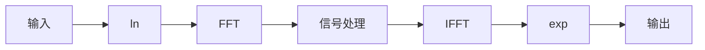

### 同态滤波

[同态滤波基本原理（Homomorphic filtering） - 知乎 (zhihu.com)](https://zhuanlan.zhihu.com/p/161667344)

> 同态变换一般是指将非线性组合信号通过某种变换，使其变成线性组合信号，从而可以更方便的运用线性操作对信号进行处理。

举例来说，对于非线性组合信号 $z(t)=x(t)y(t)$，无法在频域将其分开（时域相乘等价于频域卷积），此时加上如果取对数，便可将其分开：$\log(z(t))=\log(x(t))+\log(y(t))$，此时时域和频域都是相加的情况，方便后续的操作（如高通、低通滤波等）。

大致流程如下：

