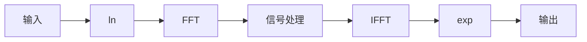

## 常见概念说明

时域信号：$x(t)$

频率信号（DFT）：$X(k) = \sum\limits_{n = 0}^{N - 1} {x(n){e^{ - j{{2\pi kn} \over N}}}}  = \sum\limits_{n = 0}^{N - 1} {x(n)W_N^{nk}}$

时域滤波器：$h(t)$

频域滤波器（连续）：$H(s) = \int_0^\infty  {f(t){e^{ - st}}} dt$，其中 $s=\sigma + jw$，其中 $\sigma$ 是衰减因子，$w$ 是角频率。

频率滤波器（离散）：$H\left( {{e^{jw}}} \right) = \sum\limits_{n =  - \infty }^\infty  {h(n){e^{ - jnw}}}$

频率滤波器（z 变换）：$H(z) = \sum\limits_{n =  - \infty }^\infty  {h(n){z^{ - n}}}$，$z=e^{-jw}$


## 时频分析


### DFT

DFT 是将一个长度为 N 的离散时间信号 $x(n)$ 转换到频域的过程，经过处理后的 $X(k)$ 中包含了频域信号的幅度和相位信息。

$$
X(k) = \sum\limits_{n = 0}^{N - 1} {x(n){e^{ - j{{2\pi kn} \over N}}}}  = \sum\limits_{n = 0}^{N - 1} {x(n)W_N^{nk}} 
$$

其中 $k=0$ 对应信号的直流分量，即频率为 0 的部分，代表信号的平均值。$k=1, 2, ..., N-1$ 对应不同的离散频率分量，具体的频率值可以通过 $f_k=\frac{k}{N} f_s$，其中 $f_s$ 是采样频率，$f_k$ 是对应频率分量的实际频率。

角频率：$w_k=\frac{2\pi k}{N}$


### FFT 

最基本的 FFT 算法，设序列 $x(n)$ 的长度 $N$ 为 2 的幂次，将 $x(n)$ 根据奇数项和偶数项分解成两个 $N/2$ 长的子序列，则 N 点 DFT 可表示为

$$
\eqalign{
  & X(k) = \sum\limits_{n = 0}^{N - 1} {x(n)W_N^{nk}}  = \sum\limits_{n = 0}^{N/2 - 1} {u(n)W_N^{2nk}}  + \sum\limits_{n = 0}^{N/2 - 1} {v(n)W_N^{(2n + 1)k}}   \cr 
  &  = \sum\limits_{n = 0}^{N/2 - 1} {u(n)W_{N/2}^{nk}}  + W_N^k\sum\limits_{n = 0}^{N/2 - 1} {v(n)W_{N/2}^{nk}}  \cr} 
$$
即 $X(k)$ 的前半部分可用 $N/2$ 的 $u(n)$ 和 $v(n)$ DFT 值 $U(k)$ 和 $V(k)$ 表示为

$$
X(k) = U(k) + W_N^kV(k)\quad k=0,1,...,N/2-1
$$
而 $X(k)$ 的后半部分可表示为

$$
X(k) = U\left( {k - {N \over 2}} \right) + W_N^kV\left( {k - {N \over 2}} \right),\quad k = {N \over 2},...,N - 1
$$
其中 $W_N^{k+N/2}= -W_N^k$。这样的分解过程还可以继续下去。

假设 N = 8，那么 $u(0) = x(0)$, $u(1) = x(2)$, $u(2) = x(4)$, $u(3) = x(6)$；$v(0) = x(1)$, $v(1) = x(3)$, $v(2) = x(5)$, $v(3) = x(7)$。继续分解，可得 $u_1(0) = u(0)$, $u_1(1) = u(2)$ 等，则计算时将 $x(0)$ 和 $x(4)$ 放在一起。 

输入时需要倒序存储，如第 1 位对应的序号为 001，倒序为 100，即对应 $x(4)$

在程序实现时，对于输入的 N 点数据，需要先补 N 个零，代表虚数

```c
for (int i = 0; i < N; ++i){
	result[2 * i] = data[i];  // 偶数位对应实部
	result[2 * i + 1] = 0;    // 奇数位对应虚部
}
```

然后对输入数据进行倒序存储

```c
int mmax = 2, j = 0;
int n = N << 1;  // n = 2 * N
int istep, m;
float theta, wtemp, wpr, wpi, wr, wi, tempr, tempi;

for (int i = 0; i < n - 1; i = i + 2)
{
	if (j > i)
	{
		swap(data, j, i);           // 交换实部
		swap(data, j + 1, i + 1);   // 交换虚部
	}
	m = n / 2;
	while (m >= 2 && j >= m)
	{
		j = j - m;
		m = m / 2;
	}
	j = j + m;
}
```


计算过程如下

```c
while (n > mmax)
{
	istep = mmax << 1;
	theta = -2 * PI / (flag * mmax);
	wtemp = sin(0.5 * theta);
	wpr = -2.0 * wtemp * wtemp;
	wpi = sin(theta);
	wr = 1.0;
	wi = 0.0;
	for (int m = 1; m < mmax; m = m + 2)
	{
		for (int i = m; i < n + 1; i = i + istep)
		{
			int j = i + mmax;
			tempr = wr * data[j - 1] - wi * data[j];
			tempi = wr * data[j] + wi * data[j - 1];
			data[j - 1] = data[i - 1] - tempr;
			data[j] = data[i] - tempi;
			data[i - 1] += tempr;
			data[i] += tempi;
		}
		wtemp = wr;
		wr += wr * wpr - wi * wpi;
		wi += wi * wpr + wtemp * wpi;
	}
	mmax = istep;
}
```


## 滤波器

### 正交镜像滤波器（QMF）

正交镜像滤波器（Quadrature Mirror Filter, QMF）的基本思想是通过一组滤波器将信号分解为多个子带，保证子带之间的信号无失真重建，并实现带宽和频谱特性上的对称性。

QMF 是一对具有对称频谱特性的滤波器，可以分为低通滤波（$H_0$）和高通滤波（$H_1$），两个滤波器满足以下关系（关于频率轴对称）
$$
H_1(z)=H_0(-z)
$$
在时间域表达为 $h_1(n) = (-1)^n h_0(n)$

同时为了保证无失真重建，滤波器需要满足
 $$
   H_0(z)G_0(z) + H_1(z)G_1(z) = c
$$

其中 $G_0(z)$ 和 $G_1(z)$ 分别是低频和高频分量的重建滤波器，$c$ 为常数。

**信号分解**

输入信号 $x[n]$ 通过低通滤波器 $H_0$ 和高通滤波器 $H_1$ 滤波。每个滤波器的输出信号进行 **下采样**（采样因子为 2）：
$$
y_0[k] = \sum_{n} x[n] h_0[2k-n]
$$
$$
y_1[k] = \sum_{n} x[n] h_1[2k-n]
$$
**信号重建**

下采样后的信号 $y_0[k]$ 和 $y_1[k]$ 经过 **上采样** 并通过重建滤波器 $G_0$ 和 $G_1$ 滤波。合并后的信号为：
$$
\hat{x}[n] = \sum_{k} y_0[k] g_0[n-2k] + \sum_{k} y_1[k] g_1[n-2k]
$$


### 同态滤波

[同态滤波基本原理（Homomorphic filtering） - 知乎 (zhihu.com)](https://zhuanlan.zhihu.com/p/161667344)

> 同态变换一般是指将非线性组合信号通过某种变换，使其变成线性组合信号，从而可以更方便的运用线性操作对信号进行处理。

举例来说，对于非线性组合信号 $z(t)=x(t)y(t)$，无法在频域将其分开（时域相乘等价于频域卷积），此时加上如果取对数，便可将其分开：$\log(z(t))=\log(x(t))+\log(y(t))$，此时时域和频域都是相加的情况，方便后续的操作（如高通、低通滤波等）。

大致流程如下：




