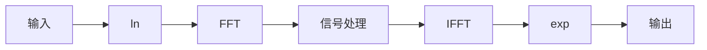

## 常见概念说明

时域信号：$x(t)$

频率信号：$X(k)$

时域滤波器：$h(t)$

频域滤波器（连续）：$H(s)$

## 时频分析

## 滤波器

### 正交镜像滤波器（QMF）

正交镜像滤波器（Quadrature Mirror Filter, QMF）的基本思想是通过一组滤波器将信号分解为多个子带，保证子带之间的信号无失真重建，并实现带宽和频谱特性上的对称性。

QMF 是一对具有对称频谱特性的滤波器，可以分为低通滤波（$H_0$）和高通滤波（$H_1$），两个滤波器满足以下关系（关于频率轴对称）
$$
H_1(z)=H_0(-z)
$$
在时间域表达为 $h_1(n) = (-1)^n h_0(n)$

同时为了保证无失真重建，滤波器需要满足
 $$
   H_0(z)G_0(z) + H_1(z)G_1(z) = c
$$

其中 $G_0(z)$ 和 $G_1(z)$ 分别是低频和高频分量的重建滤波器，$c$ 为常数。

## 工作流程

### 1. 信号分解
- 输入信号 $x[n]$ 通过低通滤波器 $H_0$ 和高通滤波器 $H_1$ 滤波。
- 每个滤波器的输出信号进行 **下采样**（采样因子为 2）：
  $$
  y_0[k] = \sum_{n} x[n] h_0[2k-n]
  $$
  $$
  y_1[k] = \sum_{n} x[n] h_1[2k-n]
  $$

### 2. 信号重建
- 下采样后的信号 $y_0[k]$ 和 $y_1[k]$ 经过 **上采样** 并通过重建滤波器 $G_0$ 和 $G_1$ 滤波。
- 合并后的信号为：
  $$
  \hat{x}[n] = \sum_{k} y_0[k] g_0[n-2k] + \sum_{k} y_1[k] g_1[n-2k]
  $$

---

## 滤波器设计

### 设计条件
1. **正交性：** $H_1(z) = H_0(-z)$ 确保滤波器的频谱特性对称。
2. **无失真重建条件：** 满足 $H_0(z)G_0(z) + H_1(z)G_1(z) = 1$。

### 实现方法
- **窗函数法：** 使用窗函数（如汉明窗、凯撒窗）设计 FIR 滤波器。
- **优化设计法：** 利用优化算法设计满足特定条件的滤波器。

---

## 应用领域

### 1. 音频处理
在音频压缩（如 MP3、AAC）中，QMF 用于将信号分解为多个子频带，提高编码效率。

### 2. 图像处理
在图像压缩（如 JPEG2000）中，QMF 作为小波变换的一部分，支持多分辨率分析。

### 3. 通信系统
用于频带分离和信号调制解调，以优化带宽资源的利用。

### 4. 小波变换
QMF 是构造正交小波基的重要工具，用于信号多尺度分析。

---

## 优缺点

### 优点
- **无失真重建：** 满足严格的重建条件，保证信号完整性。
- **频谱分离精准：** 子带信号无干扰。
- **灵活性：** 可适应不同频率范围的信号分解需求。

### 缺点
- **设计复杂：** 滤波器设计需满足多个严格条件。
- **对混叠敏感：** 滤波器性能对混叠的抑制效果要求较高。
- **实时性要求高：** 特别是在高采样率应用中。

---

## 与其他方法的比较

| 特性                  | QMF                     | 小波变换                 | 快速傅里叶变换 (FFT)  |
|-----------------------|-------------------------|--------------------------|----------------------|
| **频谱分解**          | 精确子带分割            | 多尺度分解               | 全局频谱             |
| **时间分辨率**        | 固定（不随频率变化）    | 高频高分辨率，低频低分辨率 | 无时间分辨率         |
| **无失真重建**        | 是                      | 是                        | 是                   |
| **适用场景**          | 音频、图像压缩          | 特征提取、分析           | 频谱分析             |

---

## 总结

正交镜像滤波器（QMF）是一种高效的信号分解和重建工具，特别适用于音频、图像和通信系统的多频带处理。通过合理设计滤波器，可以实现无失真信号重建，是信号处理领域的重要技术之一。

### 同态滤波

[同态滤波基本原理（Homomorphic filtering） - 知乎 (zhihu.com)](https://zhuanlan.zhihu.com/p/161667344)

> 同态变换一般是指将非线性组合信号通过某种变换，使其变成线性组合信号，从而可以更方便的运用线性操作对信号进行处理。

举例来说，对于非线性组合信号 $z(t)=x(t)y(t)$，无法在频域将其分开（时域相乘等价于频域卷积），此时加上如果取对数，便可将其分开：$\log(z(t))=\log(x(t))+\log(y(t))$，此时时域和频域都是相加的情况，方便后续的操作（如高通、低通滤波等）。

大致流程如下：

