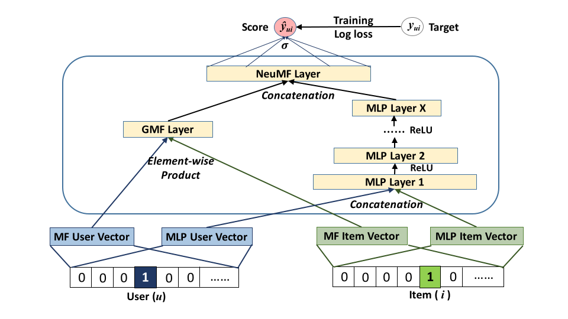
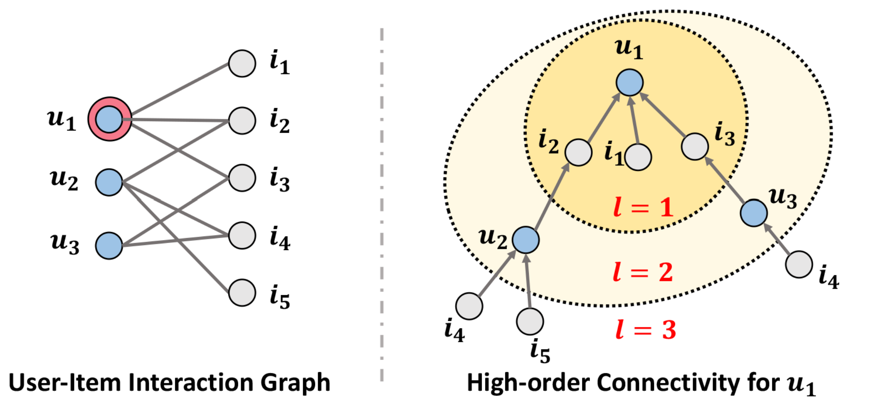
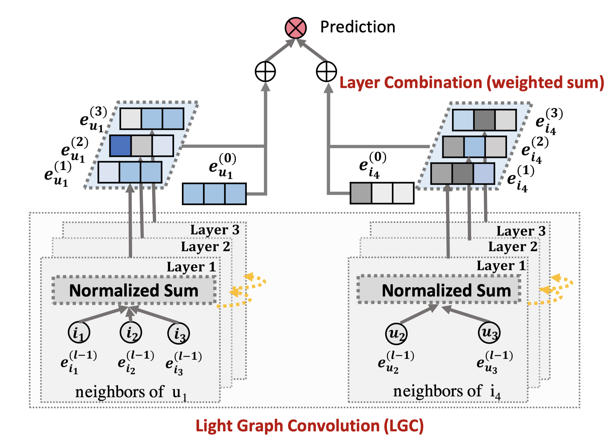
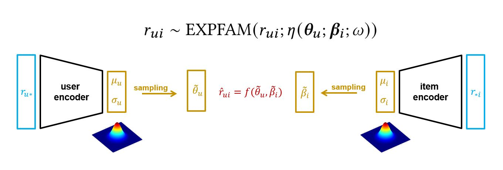

# Collaborative Filtering（协同过滤）


## 基本知识

协同过滤（Collaborative Filtering）是一种推荐系统中广泛使用的技术，主要思想是：**“喜欢相似东西的人往往兴趣相似。”**

协同过滤算法主要分为两类：

**基于用户的协同过滤**

根据用户的行为相似性来推荐。例如，如果用户 A 和用户 B 喜欢的电影有高度重合，可以将用户 B 喜欢而用户 A 未看过的电影推荐给用户 A。

- 计算用户之间的相似度（如余弦相似度、皮尔逊相关系数）。
- 找到目标用户的相似用户。
- 根据相似用户的行为预测目标用户可能感兴趣的物品。


**基于物品的协同过滤**

根据物品的相似性来推荐。例如，如果用户对某本书 A 打了高分，而书 A 和书 B 的评分相似，则推荐书 B 给用户。

- 计算物品之间的相似度。
- 根据用户的历史行为找到用户曾经评分较高的物品。
- 基于这些物品的相似性推荐其他物品。

**优势**

1. 无需物品特征：只需要用户与物品的交互数据，适用于难以提取特征的场景。

2. 动态调整 ：用户行为数据会不断变化，推荐结果可以随数据实时更新。

3. 领域适应性强：通用性高，可广泛应用于不同领域。


**局限**

 1. 冷启动问题：（1）用户冷启动：新用户无历史行为，无法找到相似用户。（2）物品冷启动：新物品无用户交互，无法推荐。

2. 数据稀疏性：用户-物品矩阵通常非常稀疏，难以计算相似性。

3. 扩展性差：在大规模数据集上，计算相似度和评分预测的效率较低。

4. 长尾效应：推荐倾向于热门物品，导致冷门物品曝光率低。


## 基线算法


假设有 $N$ 个用户和 $M$ 个物体，每个用户对于其中的部分物体有一个评分


有两种基线算法：第一种是求单个用户的评分的均值，然后用这个均值填充该用户未评分的物品的评分；

第二种是向用户推荐最受欢迎的物品，即求出每个物品被评分的次数，向所有用户推荐评分最多的物品。

## ALS


### 问题阐述

假设有 $N$ 个用户和 $M$ 个物体，每个用户对于部分物体有一个评分（没有评的设置为 0），这样会生成一个 $N\times M$ 维的矩阵 $R$，这个矩阵中许多位置为0，为了预测这些位置的评分，可以使用矩阵分解算法。即初始化一个用户矩阵 $U\in R^{N\times d}$ 和物体矩阵 $P\in R^{d\times M}$，使得 $R- U\times P$ 的损失最小，优化的目标函数为

$$
\min \sum\limits_{{r_{nm}} \ne 0} {{{\left( {{r_{nm}} - u_n^T{p_m}} \right)}^2}}  + \lambda \left\| {{u_n}} \right\|_2^2
$$

其中 $\lambda \left\| {{u_n}} \right\|_2^2$ 为正则项，防止过拟合。

当预测出某个用户对于所有未评分的物品的评分时，就可以向用户推荐预测评分高的物品。

### 求解方法

求解 $U$ 和 $P$ 可以通过交替最小二乘法（ALS），先固定 $U$ 优化 $P$，再固定 $P$ 优化 $U$。

（1）固定 $P$，优化 $U$

将 $P$ 当作常数，这样可以分成多个用户同时求解。目标函数为

$$
J({u_n}) = {\left( {{R_n} - P_n^T{u_n}} \right)^T}\left( {{R_n} - P_n^T{u_n}} \right) + \lambda u_n^T{u_n}
$$

其中，$R_n$ 是用户 $n$ 对 $m$ 个物体的评分构成的向量，$P_n$ 为这 $m$ 个物体向量构成的矩阵，顺序与 $R_n$ 中的物品的顺序一致。对目标函数求导，得到 $u_n$ 的解析解为

$$
{u_n} = {\left( {{P_n}P_n^T + \lambda I} \right)^{ - 1}}{I_n}{R_n}
$$

（2）固定 U，优化 P

同理可得 $p_m$ 的解析解为
$$
{p_m} = {\left( {{U_m}U_m^T + \lambda I} \right)^{ - 1}}{U_m}{R_m}
$$
其中 $R_m$ 是 n 个用户对于物品 m 的评分构成的向量，$U_m$ 为这 n 个用户的矩阵。

### 隐式矩阵分解

隐式矩阵分解会拟合评分矩阵中的零，即没有评分也会去拟合。定义一个二值变量 $d_{nm}$ 表示用户的行为强度

$$
{d_{nm}} = \left\{ \matrix{
  1\quad {r_{nm}} > 0 \hfill \cr 
  0\quad {r_{nm}} = 0 \hfill \cr}  \right.
$$
定义一个置信度 $c_{nm}$

$$
{c_{nm}} = 1 + \alpha {r_{nm}}
$$
当 $r_{nm}>0$，$c_{nm}$ 关于 $r_{nm}$ 线性递增，即评分越高，置信度越大，而当 $r_{nm}=0$ 时，$c_{nm}$ 为 1，置信度相同。隐式矩阵分解的目标函数为

$$
\min \sum\limits_{n = 1}^N {\sum\limits_{m = 1}^M {{c_{nm}}{{\left( {{d_{nm}} - u_n^T{p_m}} \right)}^2}} }  + \lambda \left( {\sum\limits_{n = 1}^N {\left\| {{u_n}} \right\|_2^2}  + \sum\limits_{m = 1}^M {\left\| {{p_m}} \right\|_2^2} } \right)
$$
仍然可以通过交替最小二乘法求解。

### 增量矩阵分解

为了解决新用户的问题，可以使用增量矩阵分解。只需要使用新用户的历史行为数据 $r_{nm}$ 和在训练集上学习到的物品矩阵 $P$，求解的用户向量为 $u'$

$$
\min \sum\limits_{m = 1}^M {{c_{nm}}{{\left( {{d_{nm}} - u{'^T}{p_m}} \right)}^2}}  + \lambda \left\| {u'} \right\|_2^2
$$
对于历史数据 $r_{nm}$ 要过滤掉在 $P$ 没有出现的物体，并且 $P$ 是固定的，不需要迭代。


### 实现

基于 pyspark 实现

```python
from pyspark.ml.recommendation import ALS
from pyspark.sql import SparkSession

spark = SparkSession.builder.appName("ALS Example").getOrCreate()

movies = spark.read.option("header", "true").csv("/kaggle/input/movielens-20m-dataset/rating.csv")
movies = movies.withColumn("userId", movies.userId.cast("int"))
movies = movies.withColumn("movieId", movies.movieId.cast("int"))
movies = movies.withColumn("rating", movies.rating.cast("float"))

movies.show(10)

als = ALS(
    userCol="userId",
    itemCol="movieId",
    ratingCol="rating",
    rank=10,
    maxIter=10,
    regParam=0.1,
    coldStartStrategy="drop"
)

model = als.fit(movies)

user_subset = movies.where(movies.userId == 2)
recommendations = model.recommendForUserSubset(user_subset, 5)
recommendations.show()
```


## VAE

具体实现参考：[standard_vae_deep_dive.ipynb](https://github.com/recommenders-team/recommenders/blob/main/examples/02_model_collaborative_filtering/standard_vae_deep_dive.ipynb)

基于VAE的推荐是一种无监督的算法，使用 $u \in \{1,\dots,U\}$ 表示用户，$i \in \{1,\dots,I\}$ 表示物品

VAE 的输入是用户 `u` 的点击矩阵 $\mathbf{x}_u =[X_{u1},\dots,X_{uI}]^\top \in \mathbb{N}^I$，编码为均值 $m_{u}$ 和标准差 $\sigma_{u}$，均值和方差均为 K 维，表示 K 个物品的概率分布，然后重采样一个向量 $\mathbf{z}_u$ ∼ N(${m}_u$, $\mathbf{\sigma}_u$)，最后解码为原来维度的矩阵。

目标函数为 ELBO 下界

$$
Loss= \log p_\theta(\mathbf{x}_u | \mathbf{z}_u) -  KL (q(\mathbf{z}_u)||p(\mathbf{z}_u|\mathbf{x}_u))
$$
其中 $\mathbf{x}_u$ 可以看成物品的特征向量，$\mathbf{z}_u$ 是 $\mathbf{x}_u$ 的隐藏表示。要求优化使得ELBO下界最大化


## Surprise Singular Value Decomposition


算法实现：[NicolasHug/Surprise: A Python scikit for building and analyzing recommender systems](https://github.com/NicolasHug/Surprise)
算法示例：[surprise_svd_deep_dive.ipynb](https://github.com/recommenders-team/recommenders/blob/main/examples/02_model_collaborative_filtering/surprise_svd_deep_dive.ipynb)

SVD 在ALS的基础上加上了两个新变量，用户偏置 $b_u$ 和物品偏置 $b_i$，预测的评分为

$$
\hat r_{u,i} = \mu + b_u + b_i + q_{i}^{T}p_{u}
$$
$\mu$ 是所有评分的均值，优化问题变为

$$
\sum(r_{u,i} - (\mu + b_u + b_i + q_{i}^{T}p_{u}))^2 +     \lambda(b_i^2 + b_u^2 + ||q_i||^2 + ||p_u||^2)
$$
使用随机梯度下降算法优化，优化步骤如下
$$
b_u \leftarrow b_u + \gamma (e_{ui} - \lambda b_u)
$$
$$
b_i \leftarrow b_i + \gamma (e_{ui} - \lambda b_i)
$$
$$
p_u \leftarrow p_u + \gamma (e_{ui} \cdot q_i - \lambda p_u)
$$
$$
q_i \leftarrow q_i + \gamma (e_{ui} \cdot p_u - \lambda q_i)
$$

其中 $e_{ui} =  r_{ui} - \hat r_{u,i} = r_{u,i} - (\mu + b_u + b_i + q_{i}^{T}p_{u})$，$\gamma$ 为偏置。


```python
from surprise import SVD
from surprise import Dataset
from surprise.model_selection import cross_validate

data = Dataset.load_builtin('ml-100k')

algo = SVD()

cross_validate(algo, data, measures=['RMSE', 'MAE'], cv=5, verbose=True)
```


## SAR

使用示例：[sar_deep_dive.ipynb](https://github.com/recommenders-team/recommenders/blob/main/examples/02_model_collaborative_filtering/sar_deep_dive.ipynb)

SAR：Simple Algorithm for Recommendation

推荐可以看成通过两个中间矩阵（物品之间的相似度矩阵 $S$ 和用户-物品关系矩阵 $A$），推荐分数通过 $A \times S$ 计算。

SAR 定义物品之间的相似度通过给定用户物品同时出现的次数来表示，定义物品的同时出现矩阵 $C$大小为 $m\times m$，$c_{ij}$ 是物品 $i$ 和物品 $j$ 同时出现的次数。

通过 $C$ 可以计算 $S$，有三种计算方式，分别为 `Jaccard`、`lift` 和 `counts`

- `Jaccard`: $s_{ij}=\frac{c_{ij}}{(c_{ii}+c_{jj}-c_{ij})}$
- `lift`: $s_{ij}=\frac{c_{ij}}{(c_{ii} \times c_{jj})}$
- `counts`: $s_{ij}=c_{ij}$

一般情况下，使用 `counts` 作为相似度指标有利于可预测性，这意味着最受欢迎的项目将大部分时间被推荐。相比之下，`lift` 有利于可发现性/意外发现：一个整体上不太受欢迎但被一小部分用户高度喜爱的项目更有可能被推荐。`Jaccard` 是两者的折中方案。


用户-物品关系矩阵 $A$ 衡量用户和已经访问过的物品之间的强度

+ 考虑通过不同事件的差异化加权来获取关于用户-物品交互类型的信息（例如，它可能会比用户查看物品的事件更重视用户对特定物品进行评分的事件）。

+ 考虑用户-物品事件发生的时间信息（例如，它可能会降低发生在遥远过去的事件的价值。)

因此，矩阵 $A$ 的计算公式为

$$
a_{ij}=\sum_k w_k \left(\frac{1}{2}\right)^{\frac{t_0-t_k}{T}} 
$$
计算完 $A$ 和 $S$ 后，通过$A \times S$ 计算推荐分数，去掉已经交互过的，再选择分数最高的几个进行推荐即可。


## Restricted Boltzmann Machine

实现示例：[rbm_deep_dive.ipynb](https://github.com/recommenders-team/recommenders/blob/main/examples/02_model_collaborative_filtering/rbm_deep_dive.ipynb)

受限玻尔兹曼机是一个生成模型，学习与输入有关的可视单元 $v$ 和隐藏单元 $h$ 之间的联合概率分布 $P(v, h)$，概率分布的一般表示

$$
P = \frac{1}{Z} \, e^{- \beta \, H}
$$
H 是哈密顿矩阵，描述可视单元（包括输入和输出）到隐藏单元的映射关系。

以movielens数据集为例，输入为1-5的评分$\chi_v = \{ 1, 2, 3,4,5 \}$，因此 $\mathbf{v} = (v_1, v_2, ..., v_m) \in \chi_v^m$，0可以用于表示未评分。隐藏单元可以用随机的二元变量 $\chi_h = \{0,1 \}$ 表示特定单元是否激活，$\mathbf{h} = (h_1, h_2, ...,h_n) \in \chi_h^n$。隐藏单元可以描述电影的流派。整个系统可以表示为

$$
H = - \sum_{i,j \in G} v_i \, w_{ij} \, h_j - \sum_{i=1}^m v_i \, a_i - \sum_{j=1}^n h_i \, b_i
$$
其中 $a_i$ 和 $b_i$ 是可学习的偏置。

因为是无监督学习，没有实际的输出，所以模型通过最小化自由能来进行优化

$$
F =- \log Z =- \log \sum_{ v_i, h_i } P(v, h)
$$

## NCF

实现示例：[ncf_deep_dive.ipynb](https://github.com/recommenders-team/recommenders/blob/main/examples/02_model_collaborative_filtering/ncf_deep_dive.ipynb)

NCF 是一种矩阵分解模型，集成了广义矩阵分解（GMF）和MLP，如下图所示




GMF 可以表示为 
$$
\hat { r } _ { u , i } = a _ { o u t } \left( h ^ { T } \left( q _ { i } \odot p _ { u } \right) \right)
$$
${a}_{out}$ 和 ${h}$ 分别为激活函数和权重。

MLP 可以表示为
$$
z _ { 1 } = \phi _ { 1 } \left( p _ { u } , q _ { i } \right) = \left[ \begin{array} { c } { p _ { u } } \\ { q _ { i } } \end{array} \right]
$$
$$
\phi _ { l } \left( z _ { l } \right) = a _ { o u t } \left( W _ { l } ^ { T } z _ { l } + b _ { l } \right) , ( l = 2,3 , \ldots , L - 1 )
$$
$$
\hat { r } _ { u , i } = \sigma \left( h ^ { T } \phi \left( z _ { L - 1 } \right) \right)
$$
GMF 和 MLP 的输出结合后得到预测的分数

$$
\phi _ { u , i } ^ { G M F } = p _ { u } ^ { G M F } \odot q _ { i } ^ { G M F }
$$
$$
\phi _ { u , i } ^ { M L P } = a _ { o u t } \left( W _ { L } ^ { T } \left( a _ { o u t } \left( \ldots a _ { o u t } \left( W _ { 2 } ^ { T } \left[ \begin{array} { c } { p _ { u } ^ { M L P } } \\ { q _ { i } ^ { M L P } } \end{array} \right] + b _ { 2 } \right) \ldots \right) \right) + b _ { L }\right.
$$
$$
\hat { r } _ { u , i } = \sigma \left( h ^ { T } \left[ \begin{array} { l } { \phi ^ { G M F } } \\ { \phi ^ { M L P } } \end{array} \right] \right)
$$
损失函数为二元交叉熵损失


## LightGCN

应用示例：[lightgcn_deep_dive.ipynb](https://github.com/recommenders-team/recommenders/blob/main/examples/02_model_collaborative_filtering/lightgcn_deep_dive.ipynb)

LightGCN是轻量化的图协同过滤算法，将图卷积网络用于推荐系统。



将用户对物品的评分看成一条边

对于 lightGCN，使用简单的加权求和进行汇聚，所以只需要训练第0层的参数，即所有用户的 $\mathbf{e}_{u}^{(0)}$ 和所有物品的 $\mathbf{e}_{i}^{(0)}$，经过k层的加权求和得到
$$
\mathbf{e}_{u}=\sum_{k=0}^{K} \alpha_{k} \mathbf{e}_{u}^{(k)} ; \quad \mathbf{e}_{i}=\sum_{k=0}^{K} \alpha_{k} \mathbf{e}_{i}^{(k)}
$$
此处的 $\alpha_k$ 可以设置为 $1/(K+1)$，预测分数为
$$
\hat{y}_{u i}=\mathbf{e}_{u}^{T} \mathbf{e}_{i}
$$

## FM

应用示例：[fm_deep_dive.ipynb](https://github.com/recommenders-team/recommenders/blob/main/examples/02_model_collaborative_filtering/fm_deep_dive.ipynb)

FM（Factorization Machine，因子分解机）用于处理高度稀疏的数据，FM一般表示为

$$
\hat{y}(\textbf{x})=w_{0}+\sum^{n}_{i=1}w_{i}x_{i}+\sum^{n}_{i=1}\sum^{n}_{j=i+1}<\textbf{v}_{i}, \textbf{v}_{j}>x_{i}x_{j}
$$
$<\textbf{v}_{i}, \textbf{v}_{j}>$ 是两个隐藏因子的点乘
$$<\textbf{v}_{i}, \textbf{v}_{j}>=\sum^{k}_{f=1}v_{i,f}\cdot v_{j,f}$$

## BPR

应用示例：[cornac_bpr_deep_dive.ipynb](https://github.com/recommenders-team/recommenders/blob/main/examples/02_model_collaborative_filtering/cornac_bpr_deep_dive.ipynb)

BPR（Bayesian Personalized Ranking，贝叶斯个性化排序）可以为每个用户提供一个排好序的物品列表，这在推荐系统基于隐式用户行为（例如购买、点击）的场景中非常常见。可用的观察结果只有正面反馈，而未观察到的结果则是一系列真实负面反馈和缺失值的混合。


## BiVAE

应用示例：[cornac_bivae_deep_dive.ipynb](https://github.com/recommenders-team/recommenders/blob/main/examples/02_model_collaborative_filtering/cornac_bivae_deep_dive.ipynb)

一般的VAE要么只有用户被明确表示，而物品则被视为用户向量空间中的特征，或者反过来，物品被明确表示，用户作为物品向量空间中的特征

BiVAE 则将用户和物品同时表示出来




# Content-Based 算法

基于项目（物品）特征和用户历史偏好的推荐方法。根据用户过去喜欢的内容特征，推荐与之相似的内容。

#### 工作原理

对物品（如电影、书籍、商品等）进行特征化处理，例如提取类别、描述、关键词等。

分析用户历史行为（如购买、评分、浏览）中涉及的内容特征，生成用户兴趣画像。

使用相似度算法（如余弦相似度、欧几里得距离）计算用户画像与物品特征的相似性。


#### 优势

**个性化推荐** ：基于用户兴趣生成推荐，个性化程度高。

**冷启动问题（用户侧）**：对新用户，通过收集少量兴趣偏好即可生成推荐。

**可解释性强** ：推荐结果基于特征相似性，容易解释为什么推荐某物品。

#### 局限

**冷启动问题（物品侧）**：对新物品（没有用户历史数据），无法有效推荐。

**兴趣狭窄化** ：由于只基于用户过去的偏好，容易造成推荐内容单一化。

**特征依赖强**：如果物品的特征无法有效提取，推荐效果会大打折扣。


# 推荐算法库

本章介绍一些推荐算法库

## LightFM

GitHub：[lyst/lightfm: A Python implementation of LightFM, a hybrid recommendation algorithm.](https://github.com/lyst/lightfm)

文档：[Welcome to LightFM’s documentation! — LightFM 1.16 documentation](https://making.lyst.com/lightfm/docs/home.html)

包含了一些推荐算法，以及两个数据集
## recommenders

Github：[recommenders-team/recommenders: Best Practices on Recommendation Systems](https://github.com/recommenders-team/recommenders/tree/main)

文档：[Recommender Utilities — Recommenders 1.1.1 documentation](https://microsoft-recommenders.readthedocs.io/en/latest/)

包含了一些推荐算法和数据集