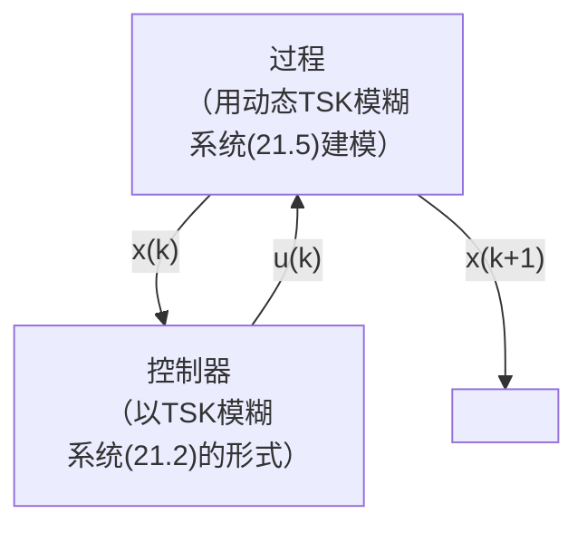

# A modern introduction to fuzzy mathematics

## 模糊集和运算

### 真值代数

#### 偏序集

**定义2.1.1**：偏序集P是一个具有二元关系≤（即≤是P×P的一个子集），对于P中所有的a，b，c有如下性质：

自反性：$a\le a$；

传递性：如果$a\le b$且$b\le c$，则$a\le c$；

反对称性：如果$a\le b$且$b\le a$，则a=b。

我们可以说，偏序集的每个元素都是一个逻辑命题和运算符“≤”是“⇒”运算符。因此，当x≤y时，这实际上意味着x需要y（x能够推出y，y是x的必要条件）。


**定义2.1.2**：假设P是一个偏序集，$X \subseteq P$，且$y\in P$。这样我们认为对于X，y是一个最大下界（glb）当且仅当

+ 当$x\in X$，则$y\le x$，即y是X的下界
+ 当z是X的任意一个其它的下界，有$z\le y$

最大下界只有一个，同时也可以定义最小上界（lub），同样也只有一个。


#### lattice 格

**定义2.1.4**：当一个偏序集P有且只有P的每个有限子集都有一个最大下界（glb）和最小上界（lub）。

| 性质   |                                                              |                                                              |
| ------ | ------------------------------------------------------------ | ------------------------------------------------------------ |
| 交换性 | $x \wedge y = y \wedge x$                                    | $x \vee y = y \vee x$                                        |
| 结合性 | $\left( {x \wedge y} \right) \wedge z = x \wedge \left( {y \wedge z} \right)$ | $\left( {x \vee y} \right) \vee z = x \vee \left( {y \vee z} \right)$ |
| 单位律 | $x \wedge 1 = x$                                             | $$x \vee 0 = x$$                                             |
| 幂等律 | $x \wedge x=x$                                               | $x\vee x=x$                                                  |
| 吸收律 | $x \wedge \left( {x \vee y} \right) = x$                     | $x \vee \left( {x \wedge y} \right) = x$                     |

**定义2.1.5**：一个格P是分配的，当且仅当对于P中所有的x,y,z都有
$$
x\wedge(y\vee z)=(x\vee y)\wedge(x\vee z)
$$
**定义2.1.6**：一个有全部lub和glb的偏序集P称为完全格

**定义2.1.7**：heyting代数是一个0和1的格，每对元素a和b有一个指数元素$b^a$，通常写作$a\Rightarrow b$，且有以下性质：

当且仅当 $c\wedge a\le b$有$c\le (a \Rightarrow b)$，即$a\Rightarrow b$是元素c（$c\vee a\le b$）的最小上界。

#### Frames 框架

**定义2.1.8**：一个偏序集P被称为frame，当且仅当

（1）每个子集有一个最小上界；

（2）每一个有限子集有一个最大下界；

（3）操作符$\vee$在$\wedge$上是分配的：
$$
x \wedge  \vee Y =  \vee \{ x \wedge y|y \in Y\}
$$


### 扎德模糊集合

集合可以以列表、规则和特征函数的方式表示出来，扎德则通过扩展特征函数来表示模糊集。

**定义2.2.1**：令X为一个全集（即一个任意集合），X的一个模糊子集A可以通过函数A：$X\to[0,1]$，该函数被称为隶属函数（membership function），对于每个属于X的x，值$A(x)$表示元素x属于模糊集A的度。

当全集X只有一些元素时，可以将模糊集A写成
$$
A = {a_1}/{x_1} + {a_2}/{x_2} +  \cdots  + {a_n}/{x_n}
$$
$x_i$属于X，$a_i$则是$x_i$归属于A的度。同时可以写成$A = \sum\limits_{i = 1}^n {A({x_i})/{x_i}}$

如果X不是有限的，模糊集可以写成$A = \int_X {{a_i}/{x_i}}$

注意这里的加号、求和和积分符号均不表示相加，只是表示集合。

**定义2.2.2**：假设$A:X\to[0,1]$和$B:X\to[0,1]$是X的两个模糊集，则有<div id="def2_2_2"></div>
并集：$\left( {A \cup B} \right)(x) = \max \{ A(x),B(x)\}$

交集：$\left( {A \cap B} \right)(x) = \min \{ A(x),B(x)\}$

补集：${A^C}(x) = 1 - A(x),\quad for\;all\;x \in X$

代数乘积：$(AB)(x) = A(x) \cdot B(x)$

A是B的子集（$A \subseteq B$），当且仅当
$$
A(x)\le B(x)\quad for\;all\;x\in X
$$
A的标量基数为
$$
card(A) = \sum\limits_{x \in X} {A(x)}
$$
A的模糊幂集（即X所有平凡模糊子集的集合）表示为$\mathbb{F}(X)$

德摩根律：${\left( {A \cup B} \right)^C} = {A^C} \cap {B^C}\quad {\left( {A \cap B} \right)^C} = {A^C} \cup {B^C}$
$$
\eqalign{
  & {\left( {A \cup B} \right)^C} = 1 - \max (A(x),B(x)) = 1 + \min ( - A(x), - B(x))  \cr 
  &  = \min (1 - A(x),1 - B(x)) = {A^C} \cap {B^C} \cr}
$$
**定义2.2.3**：一个模糊集$A:X\to[0,1]$是凸的，当且仅当对于所有$x_1,x_2\in X$和$\lambda\in[0,1]$，有
$$
A[\lambda {x_1} + (1 - \lambda ){x_2}] \ge \min \{ A({x_1}),A({x_2})\}
$$
严格大于时称为严格凸。

**推论2.2.1**：如果$A:X\to[0,1]$和$B:X\to[0,1]$都是凸模糊集，则它们的交也是凸模糊集。

证明：根据模糊集合的交集的定义有：
$$
C[\lambda {x_1} + (1 - \lambda ){x_2}] = \min \{ A[\lambda {x_1} + (1 - \lambda ){x_2}],B[\lambda {x_1} + (1 - \lambda ){x_2}]\}
$$
又A和B都是凸模糊集，可证$C[\lambda {x_1} + (1 - \lambda ){x_2}] \ge \min \{ C({x_1}),C({x_2})\}$
当一个模糊集$X={x_1,x_2,...,x_n}$的基数为n，则称其为**明确集**（crisp set）。

### 模糊集的$\alpha$-cut

**定义2.3.1**：假设$A:X\to[0,1]$是一个X的模糊子集，对于任意$a\in[0,1]$，$\alpha$-cut ${}^\alpha A$和强$\alpha$-cut ${}^{\alpha+} A$是明确集
$$
{}^\alpha A = \{ x|(x \in X) \wedge (A(x) \ge \alpha )\}
$$
$$
{}^{\alpha  + }A = \{ x|(x \in X) \wedge (A(x) > \alpha )\}
$$
根据定义2.3.1，如果已知隶属函数，则可以定义$\alpha$-cut ${}^\alpha A$；同样，如果已知所有的$\alpha$-cut ${}^\alpha A$，则可以得到每个A(x)的值作为$x\in{}^{\alpha}A$的最大值$\alpha$。

**定理2.3.1**：假设A和B是X的两个模糊子集，则对于所有的$a,b\in[0,1]$，
（1）${}^{\alpha  + }A \subseteq {}^\alpha A$
（2）${}^\alpha \left( {A \cap B} \right) = {}^\alpha A \cap {}^\alpha B\;and\;{}^\alpha \left( {A \cup B} \right) = {}^\alpha A \cup {}^\alpha B$
（3）${}^{\alpha  + }\left( {A \cap B} \right) = {}^{\alpha  + }A \cap {}^{\alpha  + }B\;and\;{}^{\alpha  + }\left( {A \cup B} \right) = {}^{\alpha  + }A \cup {}^{\alpha  + }B$
（4）${}^\alpha \left( {{A^C}} \right) = {\left( {{}^{\left( {1 - \alpha } \right) + }A} \right)^C}$

**定理2.3.2**：对于所有模糊集$A:X\to[0,1]$，$A = \bigcup\limits_{a \in [0,1]} {{}^\alpha A}$

### 区间值和2型模糊集
区间值$I([0,1])$定义如下：
$$
I([0,1]) = \{ (a,b)|(a,b \in [0,1]) \wedge (a \le b)\}
$$
**定义2.4.1**：区间值模糊集A是一个函数$A:X\to I([0,1])$，X是部分全集，$A(x) = [{A_*}(x),{A^*}(x)]$
**定义2.4.2**：假设$A,B: X\to I([0,1])$是两个区间值模糊集，则有
并集：$(A \cup B)(x) = \left[ {\max \left( {{A_*}(x),{B_*}(x)} \right),\max \left( {{A^*}(x),{B^*}(x)} \right)} \right]$
交集：$(A \cap B)(x) = \left[ {\min \left( {{A_*}(x),{B_*}(x)} \right),\min \left( {{A^*}(x),{B^*}(x)} \right)} \right]$
A的补集也是区间值模糊集：${A^C}(x) = \left[ {1 - {A^*}(x),1 - {A_*}(x)} \right]$
**定义2.4.4**：一个类型2的模糊集$\tilde A$的特征是类型2的隶属函数$A(x,u)$，$x\in X$，$u \in {J_x} \subseteq [0,1]$
$$
\tilde A = \left\{ {\left( {(x,u),A(x,u)} \right)|\forall x \in X,\forall u \in {J_x} \subseteq [0,1]} \right\}
$$
这里的$0\le A(x,u)\le 1$，或者可以使用下面的标记：
$$
A = \int_{\forall x \in X} {\int_{\forall u \in {J_x} \subseteq [0,1]} {{{A(x,u)} \over {(x,u)}}} } 
$$
对于离散值，可以使用$\sum$记号，注意可以记为
$$
\sum\limits_{\forall x \in X} {\sum\limits_{\forall u \in {J_x} \subseteq [0,1]} {{{A(x,u)} \over {(x,u)}}} }  = \sum\limits_{\forall x \in X} {\sum\limits_{\forall u \in {J_x} \subseteq [0,1]} {{{A(x,u)} \over u}} /x}
$$
**例子2.4.1**
假设对于$X=[0,1,2,...,10]$，X中的类型2模糊集${\tilde A}$如下：
$$
\eqalign{
  & \tilde A = \left[ {1/0 + 0.9/0.1 + 0.8/0.2} \right]/1  \cr 
  &  + \left[ {1/0 + 0.8/0.1 + 0.6/0.2 + 0.4/0.3 + 0.2/0.4} \right]/2  \cr 
  &  + \left[ {0.3/0.2 + 0.6/0.3 + 0.8/0.4 + 1/0.5 + 0.8/0.6 + 0.6/0.7 + 0.3/0.8} \right]/3  \cr 
  &  + \left[ {0.2/0.6 + 0.4/0.7 + 0.6/0.8 + 0.8/0.9 + 1/1} \right]/4  \cr 
  &  + \left[ {0.2/0.8 + 0.6/0.9 + 1/1} \right]/5  \cr 
  &  + \left[ {0.2/0.6 + 0.4/0.7 + 0.6/0.8 + 0.8/0.9 + 1/1} \right]/6  \cr 
  &  + \left[ {0.3/0.2 + 0.6/0.3 + 0.8/0.4 + 1/0.5 + 0.8/0.6 + 0.6/0.7 + 0.3/0.8} \right]/7  \cr 
  &  + \left[ {1/0 + 0.8/0.1 + 0.6/0.2 + 0.4/0.3 + 0.2/0.4} \right]/8  \cr 
  &  + \left[ {1/0 + 0.9/0.1 + 0.8/0.2} \right]/9{\rm{ }} \cr} 
$$
则用表格可以表示为


**后续还有各种模糊集的介绍，不过多说明**


## 模糊数及其算术

### 模糊数

**定义3.1.1**：当一个定义在所有实数$\mathbb{R}$的模糊子集A被称为模糊数，满足以下条件

（1）对于$0<\alpha<1$，A的所有$\alpha$-cut都不为空；

（2）A的所有$\alpha$-cut都是$\mathbb{R}$上的闭区间；

（3）A的支持集，即集合${}^{0+}A=\{x|x\in\mathbb{R}\;and\;A(x)>0\}$是有界的

**定义3.1.2**：如果对于所有x<0（x>0）有A(x)=0，则模糊数A是正（负）的。


#### 三角模糊数

三角模糊数是图为三角形的模糊集。通常，人们使用符号$tfn(\bar x,{e_l},{e_r})$来指定这样一个模糊数，隶属函数定义为
$$
A(x) = \left\{ \matrix{
  0\quad \quad \quad \quad \quad \quad if\;x \le \bar x - {e_l} \hfill \cr 
  1 + (x - \bar x)/{e_l}\quad if\;\bar x - {e_l} < x < \bar x\; \hfill \cr 
  1 - (x - \bar x)/{e_r}\quad if\;\bar x \le x < \bar x + {e_r} \hfill \cr 
  0\quad \quad \quad \quad \quad \quad if\;x \ge \bar x + {e_r} \hfill \cr}  \right.
$$


隶属函数也可以表示为
$$
A(x) = \min \left[ {\max \left[ {0,1 - (\bar x - x)/{e_l}} \right],\max \left[ {0,1 - (x - \bar x)/{e_r}} \right]} \right],\;\;\forall x \in \mathbb{R}
$$


#### 梯形模糊数

使用$trfn(t_1,t_2,t_3,t_4)$表示具有如下隶属函数的模糊集
$$
T(x) = \left\{ \matrix{
  0\quad \quad \quad \quad \quad \quad \quad if\;x < a \hfill \cr 
  (x - a)/(b - a)\quad \;if\;a \le x < b \hfill \cr 
  1\quad \quad \quad \quad \quad \quad \quad if\;b \le x < c \hfill \cr 
  (d - x)/(d - c)\quad \;if\;c \le x < d \hfill \cr 
  0\quad \quad \quad \quad \quad \quad \quad if\;x \ge d \hfill \cr}  \right.
$$


#### 高斯模糊数

使用$gfn(\bar x,{\sigma _l},{\sigma _r})$表示具有如下隶属函数的模糊数
$$
G(x) = \left\{ \matrix{
  \exp \left[ { - {{(x - \bar x)}^2}/\left( {2\sigma _l^2} \right)} \right],\quad if\;x < \bar x \hfill \cr 
  \exp \left[ { - {{(x - \bar x)}^2}/\left( {2\sigma _r^2} \right)} \right],\quad if\;x \ge \bar x \hfill \cr}  \right.
$$
此外还有准高斯模糊数$gf{n^*}(\bar x,{\sigma _l},{\sigma _r})$，与高斯模糊数相比，当$x\le \bar x-3\sigma_l$和$x\ge \bar x+3\sigma_r$，$G(x)=0$。


#### 二次模糊数

使用$qfn(\bar x,\beta_1,\beta_2)$表示具有如下隶属函数的模糊数
$$
Q(x) = \left\{ \matrix{
  0\quad \quad \quad \quad \quad \quad \quad if\;x \le \bar x - {\beta _l} \hfill \cr 
  1 - {(x - \bar x)^2}/\beta _l^2\quad \;if\;\bar x - {\beta _l} < x < \bar x \hfill \cr 
  1 - {(x - \bar x)^2}/\beta _r^2\quad \;if\;\bar x \le x < \bar x + {\beta _r} \hfill \cr 
  0\quad \quad \quad \quad \quad \quad \quad if\;x \ge \bar x + {\beta _r} \hfill \cr}  \right.
$$


#### 指数模糊数

使用$efn(\bar x,\tau_1,\tau_2,a)$表示具有如下隶属函数的模糊数
$$
E(x) = \left\{ \matrix{
  0\quad \quad \quad \quad \quad \quad \quad if\;x \le \bar x - a{\tau _l} \hfill \cr 
  \exp \left[ {(x - \bar x)/{\tau _l}} \right]\quad \;if\;\bar x - a{\tau _l} < x < \bar x \hfill \cr 
  \exp \left[ {(\bar x - x)/{\tau _r}} \right]\quad \;if\;\bar x \le x < \bar x + a{\tau _r} \hfill \cr 
  0\quad \quad \quad \quad \quad \quad \quad if\;x \ge \bar x + a{\tau _r} \hfill \cr}  \right.
$$


#### L-R模糊数

L-R模糊数具有如下隶属函数
$$
A(x) = \left\{ \matrix{
  L\left[ {{{\bar x - x} \over \alpha }} \right],\quad if\;x \le \bar x\;and\;\alpha  > 0 \hfill \cr 
  R\left[ {{{x - \bar x} \over \beta }} \right],\quad if\;x \ge \bar x\;and\;\beta  > 0 \hfill \cr}  \right.
$$
这里的L和R函数需要满足如下性质，在所有的$0\le x\in\mathbb{R}$有

（1）对于所有x，有$L(x)\in[0,1]$，$R(x)\in[0,1]$；

（2）$L(0)=R(0)=1$；

（3）$L(-x)=L(x)$，$R(-x)=R(x)$；

（4）L和R在$[0,+\infty)$上是递减的

下面这张图$L(x) = \exp \left[ { - {{{x^2}} \over 2}} \right]$，$R(x)=e^{-x}$


#### 一般模糊数

一般的模糊数可以表示为$\tilde A = gfn(a,b,c,d;w)$，需要满足以下性质：

（1）${\tilde A}$是一个连续的从$\mathbb{R}$上映射到闭区间[0,1]；

（2）当$-\infty<x\le a$，$\tilde{A}=0$；

（3）${\tilde A}$在[a,b]上严格递增；

（4）当$b\le x\le c$，${\tilde A}=w$；

（5）${\tilde A}$在[c,d]上严格递减；

（6）当$d\le x< \infty$，$\tilde{A}=0$。


### 模糊数的算术

#### 区间算术
$I=[a,b]$和$J=[c,d]$是两个闭区间，$\star$表示任意四则运算，有
$$
I\star J=\{x\star y|x\in I\;and\;y\in J\}
$$
使用该等式可以定义闭区间上的四则运算为
$$
\eqalign{
  & [a,b] + [d,e] = [a + d,b + e]  \cr 
  & [a,b] - [d,e] = [a - e,b - d]  \cr 
  & [a,b] \cdot [d,e] = [\min (ad,ae,bd,be),\max (ad,ae,bd,be)]  \cr 
  & [a,b]/[d,e] = [a,b] \cdot [1/e,1/d]  \cr 
  &  = [\min (a/d,a/e,b/d,b/e),\max (a/d,a/e,b/d,b/e)] \cr} 
$$
在除法运算中，需要保证$0\notin [d,e]$。实数r则可以认为是退化区间$[r,r]$。

#### 区间算术和$\alpha$-cuts
假设A和B是两个模糊数，则$A\star B$的$\alpha$-cut定义为，$\star$为四则运算之一
$$
{}^\alpha (A\star B) = {}^\alpha A\star {}^\alpha B
$$
如果${}^\alpha A = [{a_1}(\alpha ),{a_2}(\alpha )]$，${}^\alpha B = [{b_1}(\alpha ),{b_2}(\alpha )]$，则
$$
{}^\alpha (A + B) = [{a_1}(\alpha ) + {b_1}(\alpha ),{a_2}(\alpha ) + {b_2}(\alpha )]
$$
#### 模糊算术和扩展原理
假设A和B是两个模糊数，可以定义A和B之间的四则运算为
$$
\eqalign{
  & (A + B)(z) = \bigcup\limits_{z = x + y} {\min [A(x),B(y)]}   \cr 
  & (A - B)(z) = \bigcup\limits_{z = x - y} {\min [A(x),B(y)]}   \cr 
  & (A \cdot B)(z) = \bigcup\limits_{z = x \cdot y} {\min [A(x),B(y)]}   \cr 
  & (A/B)(z) = \bigcup\limits_{z = x/y} {\min [A(x),B(y)]}  \cr} 
$$
**例子3.2.2**：假设A=1/2+0.5/3，B=0.5/3+1/4是两个离散模糊数，如果要计算A+B：
（1）z=5，此时x=2，y=3，则$(A + B)(5) = \bigcup\limits_{5 = 2 + 3} {\min [A(2),B(3)]}  = \min [1,0.5] = 0.5$
（2）z=6，此时x=3，y=3或者x=2，y=4，则
$$
\eqalign{
  & (A + B)(6) = \bigcup\limits_{z = x + y} {\min [A(x),B(y)]}   \cr 
  &  = \min \left[ {\min [A(3),B(3)],\min [A(2),B(4)]} \right] = \min [0.5,1] = 0.5 \cr}
$$
（3）z=7，此时x=3，y=4，则$(A + B)(7) = \bigcup\limits_{7 = 3 + 4} {\min [A(3),B(4)]}  = \min [0.5,1] = 0.5$

#### 一般模糊数的模糊算术
假设${{\tilde A}_1} = gfn({a_1},{b_1},{c_1},{d_1};{w_1})$，${{\tilde A}_2} = gfn({a_2},{b_2},{c_2},{d_2};{w_2})$是两个一般模糊数，则四则运算定义如下：:warning:
$$
\eqalign{
  & {{\tilde A}_1} + {{\tilde A}_2} = gfn({a_1},{b_1},{c_1},{d_1};{w_1}) + gfn({a_2},{b_2},{c_2},{d_2};{w_2})  \cr 
  &  = gfn({a_1} + {a_2},{b_1} + {b_2},{c_1} + {c_2},{d_1} + {d_2};\min ({w_1},{w_2}))  \cr 
  & {{\tilde A}_1} - {{\tilde A}_2} = gfn({a_1},{b_1},{c_1},{d_1};{w_1}) - gfn({a_2},{b_2},{c_2},{d_2};{w_2})  \cr 
  &  = gfn({a_1} - {d_2},{b_1} - {c_2},{c_1} - {b_2},{d_1} - {a_2};\min ({w_1},{w_2}))  \cr 
  & {{\tilde A}_1} \times {{\tilde A}_2} = gfn({a_1},{b_1},{c_1},{d_1};{w_1}) \times gfn({a_2},{b_2},{c_2},{d_2};{w_2})  \cr 
  &  = gfn(a,b,c,d;\min ({w_1},{w_2}))  \cr 
  & a = \min ({a_1} \cdot {a_2},{a_1} \cdot {d_2},{d_1} \cdot {a_2},{d_1} \cdot {d_2})  \cr 
  & b = \min ({b_1} \cdot {b_2},{b_1} \cdot {c_2},{c_1} \cdot {b_2},{c_1} \cdot {c_2})  \cr 
  & c = \max ({b_1} \cdot {b_2},{b_1} \cdot {c_2},{c_1} \cdot {b_2},{c_1} \cdot {c_2})  \cr 
  & d = \max ({a_1} \cdot {a_2},{a_1} \cdot {d_2},{d_1} \cdot {a_2},{d_1} \cdot {d_2})  \cr 
  & {{\tilde A}_1} \div {{\tilde A}_2} = gfn({a_1},{b_1},{c_1},{d_1};{w_1}) \div gfn({a_2},{b_2},{c_2},{d_2};{w_2})  \cr 
  &  = gfn\left( {{{{a_1}} \over {{d_2}}},{{{b_1}} \over {{c_2}}},{{{c_1}} \over {{b_2}}},{{{d_1}} \over {{a_2}}};\min ({w_1},{w_2})} \right) \cr}
$$

然而事实证明这些运算是有问题的（如加法是不会产生一个明确的值），因此有一个更加一般的描述，特别的，将模糊数$\tilde A_1=gfn(a_1,b_1,c_1,d_1;w_1)$写成下面这种形式
$$
{{\tilde A}_1}(x) = \left\{ \matrix{
  {w_1}(x - {a_1})/({b_1} - {a_1})\quad when\;{a_1} \le x \le {b_1} \hfill \cr 
  {w_1}\quad \quad \quad \quad \quad \quad \quad \quad when\;{b_1} \le x \le {c_1} \hfill \cr 
  {w_1}(x - {d_1})/({c_1} - {d_1})\quad when\;{c_1} \le x \le {d_1} \hfill \cr 
  0\quad \quad \quad \quad \quad \quad \quad \quad \;\;otherwise \hfill \cr}  \right.
$$
其中，$w_1\in[0,1]$是人为设定的值
四则运算定义如下：
$$
\eqalign{
  & {A_1} + {A_2} = gfn\left( {{a_3},{b_3},{c_3},{d_3};w} \right)  \cr 
  & w = \min ({w_1},{w_2})  \cr 
  & {a_3} = {a_1} + {a_2}  \cr 
  & {b_3} = {a_2} + {c_1} + w({b_2} - {a_2})/{w_2}  \cr 
  & {c_3} = {d_2} + {c_1} - w({d_2} - {c_2})/{w_2}  \cr 
  & {d_3} = {d_1} + {d_2} \cr}
$$
其余参考原书[A Modern Introduction to Fuzzy Mathematics ](https://onlinelibrary.wiley.com/doi/book/10.1002/9781119445326)第51页。

#### 模糊数比较
模糊数并不能直接比较，而是通过min和max来间接比较，使用扩展原理，可以定义
$$
\eqalign{
  & MIN(A,B)(z) = \bigcup\limits_{z = \min (x,y)} {\min [A(x),B(y)]}   \cr 
  & MAX(A,B)(z) = \bigcup\limits_{z = \max (x,y)} {\min [A(x),B(y)]}  \cr}
$$
**定理3.2.1**：假设A和B是两个模糊数，且隶属函数连续，$x_m$是一个实数使得$(A \cap B)({x_m}) \ge (A \cap B)(x)$，对于所有$x\in \mathbb{R}$，$A(x_m)=B(x_m)$，$x_m$在A和B平均值之间，如果$x_m$不是唯一的，任意一个$x_m$都可以使用，这样MIN可以定义为
$$
MIN(A,B)(z) = \left\{ \matrix{
  (A \cup B)(z)\quad if\;z < {x_m} \hfill \cr 
  (A \cap B)(z)\quad if\;z \ge {x_m} \hfill \cr}  \right.
$$
其中$A \cup B$和$A \cap B$的定义参见[定义2.2.2](#def2_2_2)

**定理3.2.2**：MAX的定义如下
$$
MAX(A,B)(z) = \left\{ \matrix{
  (A \cap B)(z)\quad if\;z < {x_m} \hfill \cr 
  (A \cup B)(z)\quad if\;z \ge {x_m} \hfill \cr}  \right.
$$

**例子3.2.3**：考虑下面的模糊数
$$
\eqalign{
  & A(x) = \left\{ \matrix{
  0\quad \quad \quad \quad if\;x <  - 2\;or\;x > 4 \hfill \cr 
  (x + 2)/3\;\;\;if\; - 2 \le x \le 1 \hfill \cr 
  (4 - x)/3\;\;\;if\;1 < x \le 4 \hfill \cr}  \right.  \cr 
  & B(y) = \left\{ \matrix{
  0\quad \quad \;if\;y < 1\;or\;y > 3 \hfill \cr 
  y - 1\;\;\;if\;1 \le y \le 2 \hfill \cr 
  3 - y\;\;\;if\;2 < y \le 3 \hfill \cr}  \right. \cr}
$$


由上图可得A(1.75)=B(1.75)，A(2.5)=B(2.5)。假定$x_m$=1.75，

当$z<-2$时，$MIN(A,B)(z) = (A \cup B)(z) = 0$；

当$z>3$时，$MIN(A,B)(z) = (A \cap B)(z) = 0$；

当$-2\le z\le1$时，$MIN(A,B)(z) = (A \cup B)(z) = (z + 2)/3$；

当$1<z<1.75$时，$MIN(A,B)(z) = (A \cup B)(z) = (4 - z)/3$；

当$1.75\le z\le 2.5$时，$MIN(A,B)(z) = (A \cap B)(z) = (4 - z)/3$；

当$2.5<z\le 3$时，$MIN(A,B)(z) = (A \cap B)(z) = 3 - z$。

还有一种更加简单的方式用来同时计算多个模糊数的最小值和最大值，这个理论基于下面的表示：
$$
{[A]^\alpha } = \left\{ \matrix{
  \{ x|A(x) \ge \alpha \} \;\;\;if\;0 < \alpha  \le 1 \hfill \cr 
  supp\;A\qquad \quad \;\;if\;\alpha  = 0 \hfill \cr}  \right.
$$
**定理3.2.3**：假设$A_i$，i=1，...，n是模糊数，因此${[{A_i}]^\alpha } = [a_i^1(\alpha ),a_i^2(\alpha )]$，MIN和MAX的计算如下：
$$
\eqalign{
  & {\left[ {MIN({A_1},...,{A_n})} \right]^\alpha } = \left[ {\mathop {\min }\limits_{1 \le i \le n} a_i^1(\alpha ),\mathop {\min }\limits_{1 \le i \le n} a_i^2(\alpha )} \right]  \cr 
  & {\left[ {MAX({A_1},...,{A_n})} \right]^\alpha } = \left[ {\mathop {\max }\limits_{1 \le i \le n} a_i^1(\alpha ),\mathop {\max }\limits_{1 \le i \le n} a_i^2(\alpha )} \right] \cr}
$$

### 语言变量
语言变量指的是模糊描述的自然语言，如很快，很冷等，更加正式的是将语言变量表示为一个五元组（V，T(V)，U，G，M），V是变量的名字；T(V)是V中项的集合；G是生成V值名称的语法规则；M是将每个值与其含义关联起来的语义规则，即模糊集中的隶属函数。

### 模糊关系方程
模糊关系方程中的未知数和系数都是模糊数，如
$$
A\cdot X+B=C
$$
其中A，B和C是三角模糊数，这可能是最简单的模糊方程，即使如此我们也不能很简单的用解普通方程的方程解出该方程，因为$B-B\neq 0$。

#### 求解模糊关系方程 AX+B=C

##### 经典方法
假设${}^{\alpha}A=[a_1(\alpha),a_2(\alpha)]$，${}^{\alpha}B=[b_1(\alpha),b_2(\alpha)]$，${}^{\alpha}C=[c_1(\alpha),c_2(\alpha)]$，${}^{\alpha}X_C=[x_1(\alpha),x_2(\alpha)]$，可以使用$\alpha$-cut替换方程中的变量
$$
[{a_1}(\alpha ),{a_2}(\alpha )] \cdot [{x_1}(\alpha ),{x_2}(\alpha )] + [{b_1}(\alpha ),{b_2}(\alpha )] = [{c_1}(\alpha ),{c_2}(\alpha )]
$$

**例子3.4.1**：假设$A=tfn(2,1,1)$，$B=tfn(-2,1,1)$，$C=tfn(-4,1,1)$，有${}^{\alpha}A=[1+\alpha,3-\alpha]$，${}^{\alpha}B=[-3+\alpha,-1-\alpha]$，${}^{\alpha}C=[-5+\alpha,-3-\alpha]$。
根据上面的方程可得
$$
[{a_1}(\alpha ){x_1}(\alpha ) + {b_1}(\alpha ),{a_2}(\alpha ){x_2}(\alpha ) + {b_2}(\alpha )] = [{c_1}(\alpha ),{c_2}(\alpha )]
$$
即${x_1}(\alpha ) =  - {2 \over {1 + \alpha }},{x_2}(\alpha ) =  - {2 \over {3 - \alpha }}$
为了解出$\alpha$-cut对应的模糊数，可以通过解下面的方程
$$
\left\{ \matrix{
  {x_1} =  - {2 \over {1 + {y_1}}} \hfill \cr 
  {x_2} =  - {2 \over {3 - {y_2}}} \hfill \cr}  \right. \Rightarrow \left\{ \matrix{
  {y_1} =  - {2 \over {{x_1}}} - 1 \hfill \cr 
  {y_2} = {2 \over {{x_2}}} + 3 \hfill \cr}  \right.
$$
当$x_1=-2$，$y_1=0$；$x_2=-2/3$，$y_2=0$，则模糊数为
$$
{X_C}(x) = \left\{ \matrix{
  0\qquad \quad if\;x <  - 2 \hfill \cr 
   - {2 \over x} - 1\;\;\;if\; - 2 \le x \le  - 1 \hfill \cr 
  {2 \over x} + 3\quad \;\;if\; - 1 \le x \le  - {2 \over 3} \hfill \cr 
  0\qquad \quad if\; - {2 \over 3} < x \hfill \cr}  \right.
$$
还有其它方法参见原书[A Modern Introduction to Fuzzy Mathematics ](https://onlinelibrary.wiley.com/doi/book/10.1002/9781119445326)第57-58页，二次方程形式$A\cdot X^2+B\cdot X+C=D$参见第58-60页。

### 模糊不等式
模糊不等式的形式为$A\cdot X+B\le C$，简单的定义为
$$
\left[ {\left| {N \le M} \right|} \right] = \bigcup\limits_{x \le y} {\min [N(x),M(y)]}
$$
### 构造模糊数
构造关于分数的三角模糊数，假设每个专家按照0-G给Q打分，$g_1,...,g_n$是n个不同专家给Q的打分，此外需要至少有一对$g_i$和$g_j$中，$g_i\neq g_j$。
首先计算$\bar x$，创建一个n×n的矩阵$D=[d_{ij}]$，这里的$d_{ij}=|g_i-g_j|$，这个矩阵就是用来确定$\bar x$。对于每个$g_i$，相对距离的均值${{\bar d}_i} = \sum\nolimits_{j = 1}^n {{d_{ij}}} /(n - 1)$，平均距离用来描述$g_i$到$\bar x$的接近度。
然后，我们需要确定每个$g_i$的重要程度，可以构建一个n×n的成对比较矩阵$P=[p_{ij}]$，这里的$p_{ij}=\bar d_j/ \bar d_i$，因为P是从距离比较中得到的，结果证明它是完全一致的。假设$w_i$是$g_i$的真正重要程度。然后，由于P的一致性，$p_{ij}=w_i/w_j$。假设$w$是$w_i$的列向量，则$Pw=nw$，这就表示n是P的特征值，而$w$则是特征向量，有$\sum_{i=1}^nw_i=1$，总结为$w_j=1/\sum_{i=1}^np_{ij}$。
最后得到的$\bar x$为
$$
\bar x = \sum\limits_{i = 1}^n {{w_i}{g_i}}
$$
接下来需要计算$e_l$和$e_r$。
**定义3.6.1**：三角模糊数$A=tfn(\bar x,e_l,e_r)$的均方差为
$$
\sigma  = {{\int_a^b {\left| {x - \bar x} \right| \cdot A(x)} dx} \over {\int_a^b {A(x)} dx}}
$$
这里的$a=\bar x-e_l$，$b=\bar x+e_r$。
均方差可以写成下面这种形式
$$
\sigma  = {{{{(\bar x - a)}^2} + {{(b - \bar x)}^2}} \over {3(b - a)}}
$$
令$\eta=(\bar x-a)/(b-\bar x)$，可以解出
$$
a = \bar x - {{3(1 + \eta )\eta \sigma } \over {1 + {\eta ^2}}}\quad b = \bar x + {{3(1 + \eta )\sigma } \over {1 + {\eta ^2}}}
$$
显然$e_l=\bar x-a$，$e_r=b-\bar x$。

$\sigma$的值可以近似为
$$
\sigma  \approx \sum\limits_{i = 1}^n {{w_i}\left| {{g_i} - \bar x} \right|}
$$
$\eta$的值也可以近似，假设$g^l$是小于$\bar x$的加权平均值，$g^r$是大于$\bar x$的加权平均值，令I={1,...,n}，$A=\{i|g_i<\bar x\; and\; i\in I\}$，$B=\{i|g_i>\bar x\; and\; i\in I\}$，可以计算
$$
{g^l} = {{\sum\nolimits_{i \in A} {{w_i}{g_i}} } \over {\sum\nolimits_{i \in A} {{w_i}} }}\qquad {g^r} = {{\sum\nolimits_{i \in B} {{w_i}{g_i}} } \over {\sum\nolimits_{i \in B} {{w_i}} }}
$$
$\eta$可以近似计算为
$$
\eta  \approx {{\bar x - {g^l}} \over {{g^r} - \bar x}}
$$
### 模糊数的应用
#### 人体葡萄糖代谢模拟
有三个参数B，$f_{gas}$在一个特定范围内有值，初次之外，还不知道另外一个参数$m_{c_0}$，使用了准高斯模糊数来表示这三个变量。

#### 估计正在进行的项目的完成时间
使用了$triplet(z_1,z_2,z_3)$模糊数
$$
A(x) = \left\{ \matrix{
  0\qquad \qquad \quad when\;x \le {z_1} - {z_2} \hfill \cr 
  {x \over {{z_2}}} + 1 + {{{z_1}} \over {{z_3}}}\quad \;\;when\;{z_1} - {z_2} < x \le {z_1} \hfill \cr 
  1\qquad \qquad \quad \;when\;x = {z_1} \hfill \cr 
   - {x \over {{z_3}}} + 1 + {{{z_1}} \over {{z_3}}}\;\;\;\;when\;{z_1} \le x \le {z_1} + {z_3} \hfill \cr 
  0\qquad \qquad \quad \;when\;x \ge {z_1} + {z_3} \hfill \cr}  \right.
$$
将项目看成一个事件的集合A，同时将影响项目进展的因素也看成一个集合$\mathbb{F}$。具体参见原书[A Modern Introduction to Fuzzy Mathematics ](https://onlinelibrary.wiley.com/doi/book/10.1002/9781119445326)第67-68页。


## 模糊关系
### 明确关系
**定义4.1.1**：假设A和B都是集合，则A和B的二元关系是$A\times B$的子集。换句话说，A到B的二元关系是有序对(a,b)的集合，$a\in A$，$b\in B$。通常用$a\;R\;b$表示$(a,b)\in R$，$a\;\bcancel{R}\;b$表示$(a,b) \notin R$
假设S是一个二元关系
$$
\eqalign{
  & dom(S) = \{ a|(a,b) \in S\}   \cr 
  & cod(S) = \{ b|(a,b) \in S\}  \cr} 
$$

#### 关系的性质
**定义4.1.2**：集合A中的关系R
（1）具有**自反性**，如果对于$a\in A$，$(a,a)\in R$；
（2）具有**对称性**，如果对于所有$a,b\in A$，每当$(a,b)\in R$有$(b,a)\in R$；
（3）具有**反对称性**，如果对于所有$a,b\in A$，$(a,b)\in R$和$(b,a)\in R$能够推出$a=b$；
（4）具有**传递性**，如果对于所有$a,b\in A$，当$(a,b)\in R$和$(b,c)\in R$，有$(a,c)\in R$。

#### 旧关系生成新关系

#### 关系矩阵
$$
{m_{ij}} = \left\{ \matrix{
  1\quad if\;({a_i},{b_j}) \in R \hfill \cr 
  0\;\;\;if\;({a_i},{b_j}) \notin R \hfill \cr}  \right.
$$

#### 有向图表示关系

#### 关系的传递闭包

#### 等价关系
**定义4.1.5**：集合A上的关系具备自反性，对称性和传递性，被称为等价关系。

### 模糊关系
**定义4.2.1**：假设$A_1,A_2,...,A_n$是n个明确集，则映射$R:{A_1} \times {A_2} \times  \cdots  \times {A_n} \to [0,1]$被称为模糊关系，数量$R(a_1,a_2,...,a_n)\in[0,1]$可以认为是$a_1,a_2,...,a_n$之间关系的度。

### 笛卡尔积，投影和柱面扩展

#### 笛卡尔积
n个模糊集的笛卡尔积被用来定义一个n元模糊关系，更一般的，我们可以用一个t-norm * 来定义笛卡尔积如下：
$$
P({x_1},{x_2},...,{x_n}) = {A_1}({x_1})*{A_2}({x_2})* \cdots *{A_n}({x_n})
$$
#### 模糊关系的投影
令Q是在$X_1,X_2,...,X_n$上的模糊关系，则它在$Z=X_i\times X_j\times \cdots \times X_k$的投影$Q_Z$定义如下，此处$I = \{ i,j, \cdots ,k\}  \subset N = \{ 1,2,...,n\}$。
$$
{Q_Z}({x_i},{x_j},...,{x_k}) = Pro{j_Z}Q({x_1},{x_2},...,{x_n}) = \bigcup\limits_{{x_l},{x_m}, \cdots ,{x_p}} {R({x_1},{x_2},...,{x_n})}
$$
$J = \{ l,m, \cdots ,p\}  \subset N$，$I \cup J = N$，$I \cap J = \emptyset$。

#### 柱面扩展
令$A:X\to[0,1]$是明确集X的模糊子集，则一个A在$X\times Y$上的柱面扩展是一个模糊关系$cyl A$，定义如下：
$$
cyl\;A(x,y) = A(x),\quad for\;all\;x \in X\;and\;y \in Y
$$
### 从旧的得到新的模糊关系
假设R和S是A和B中的两个二元模糊关系，这些关系的基础运算的最一般形式定义如下：
**并集**：对于所有$a,b\in A\times B$，如果$Q = R \cup S$，则$Q(a,b) = R(a,b) \star S(a,b)$，$\star$是t-conorm；
**交集**：对于所有$a,b\in A\times B$，如果$Q = R \cap S$，则$Q(a,b) = R(a,b) * S(a,b)$，$*$是t-norm；
**补集**：对于所有$a,b\in A\times B$，${S^C}(x,y) = 1 - S(x,y)$；
**转置**：对于所有$a,b\in A\times B$，$S^T(b,a)=S(a,b)$。
A和B的模糊关系P也可以表示为分解形式
$$
P = \bigcup\limits_{\alpha  \in [0,1]} {\alpha {}^\alpha P}
$$
$^\alpha P = \{ (a,b)|P(a,b) \ge \alpha \}$是P的$\alpha$-cut，实际上是一个确定关系。
**模糊关系中最重要的操作是组合**
**定义4.4.1**：假设$P:A\times B\to[0,1]$和$Q:B\times C \to[0,1]$是两个模糊关系，在max-min组成$R = P \circ Q$是一个A和C中的模糊关系，定义为
$$
R(a,c) = \mathop {\max }\limits_{b \in B} \min [P(a,b),Q(b,c)]
$$
如果将min换成t-norm，则可以得到更加一般的关于组合的定义。
利用二元模糊关系的隶属矩阵，可以实现二元模糊关系的组合。假设$P=[p_{ik}]$，$Q=[q_{kj}]$和$R=[r_{ij}]$是三个模糊关系的隶属矩阵，$R = P \circ Q$，可以写成
$$
[{r_{ij}}] = [{p_{ik}}] \circ [{q_{kj}}]
$$
这里的${r_{ij}} = \mathop {\max }\limits_k \min ({p_{ik}},{q_{kj}})$。下面是一个例子：
$$
P \circ Q = \left[ {\matrix{
   {0.3} & {0.5} & {0.8}  \cr 
   0 & {0.7} & 1  \cr 
   {0.4} & 0 & {0.5}  \cr 

 } } \right] \circ \left[ {\matrix{
   {0.9} & 0 & {0.7} & {0.7}  \cr 
   {0.3} & {0.2} & 0 & {0.9}  \cr 
   1 & 0 & {0.5} & {0.5}  \cr 

 } } \right] = \left[ {\matrix{
   {0.8} & {0.2} & {0.5} & {0.5}  \cr 
   1 & {0.2} & {0.5} & {0.7}  \cr 
   {0.5} & 0 & {0.5} & {0.5}  \cr 

 } } \right] = R
$$
 此处的$r_{11}$的计算过程为
$$
 \eqalign{
  & {r_{11}} = \max \{ \min (0.3,0.9),\min (0.5,0.3),\min (0.8,1)\}   \cr 
  &  = \max \{ 0.3,0.5,0.8\}  = 0.8 \cr}
$$
**命题4.4.1**：max-min组合是结合的（满足结合律），即
$$
  R \circ (S \circ Q) = (R \circ S) \circ Q
$$
**命题4.4.2**：对于在A和B中的两个模糊关系R和S，以及第三个在B和C之间的模糊关系Q，有
$$
(R \cup S) \circ Q = (R \circ Q) \cup (S \circ Q)
$$
**定义4.4.2**：假设$P:A\times B\to[0,1]$和$Q:B\times C \to[0,1]$是两个模糊关系，在min-max组成$R = P \bullet Q$是一个A和C中的模糊关系，定义为
$$
R(a,c) = \mathop {\min }\limits_{b \in B} \max [P(a,b),Q(b,c)]
$$
min-max和max-min一样具有命题4.4.1和命题4.4.2所具备的性质。
**定义4.4.3**：假设$P:A\times B\to[0,1]$和$Q:B\times C \to[0,1]$是两个模糊关系，在max-t-norm组成$R = P{ \circ _*}Q$是一个A和C中的模糊关系，定义为
$$
R(a,c) = \mathop {\max }\limits_{b \in B} [P(a,b)*Q(b,c)]
$$
### 集合上的模糊二元关系

#### 传递闭包
假设R是有限集A上的模糊关系，因此$card(A)=k$，则R有一个传递闭包$R^+$定义为
$$
{R^ + } = R \cup {R^2} \cup  \cdots  \cup {R^k}
$$
假定$R=[r_{ij}]$是R的隶属矩阵，可以使用floyd传递闭包算法来计算$R^+$的隶属矩阵
```python
for(i=1; i<=n; i++)
	for(j=1; j<=n; j++)
		for(k=1; k<=n; k++)
			r[j,k]=max(r[i,k], r[j,i]*r[i,k])
```
其中`*`表示t-norm。

#### 相似关系
**定义4.5.2**：A中具有自反性、对称性和传递性的模糊二元关系是A中的相似关系

#### 接近关系
**定义4.5.3**：假设A是定义在全集X上的模糊集，则如果$A = \bigcup\limits_{i \in J} {{P_i}}$，模糊集族$\sum {}  = {\{ {P_i}\} _{i \in J}}$是A的模糊包络。

### 模糊序
模糊序关系是一种模糊传递关系，如果一个模糊关系是自反的、传递的、反对称的，那么它就是一个模糊偏序关系。
### 模糊图论的元素
模糊图论的思想是将集合S中的二元关系R看成一个图，顶点集合和边的集合便是集合S和关系R。
将模糊的思想扩展到图论上（路径和连通性、桥和割点、树和森林和超图等）。

### 模糊策略论

### 模糊向量

### 应用
模糊关系最显著的使用例子是模糊数据库，模糊诊断（如医疗诊断）是另外一个模糊关系使用的领域，医学诊断中的一个基本问题是如何处理非统计不确定性。这种不确定性的一个典型例子就是高血压。

## 可能性理论

### 模糊限制和可能性理论
模糊限制是“一种模糊关系，它作为可能分配给变量的值的弹性约束。”这里的“弹性”一词没有任何特殊的含义，它只是意味着约束不是刚性的。
**定义5.1.1**：命题$p\mathop  = \limits^{def} X\;is\;F$，这里X是对象的名字，F是全集U的模糊集的标签，可以表示为关系赋值方程
$$
R(A(X))=F
$$
式中，A是由X和F隐含的属性，R表示A(X)上的模糊约束，该约束的值F由该方程赋值。
**例子5.1.1**：在句子"Eila is brunette"暗含属性是`color(Hair)`，关系赋值方程的形式为
$$
R(Color(Hair(Eila))) = brunette
$$
### 可能性和必然性测量
设X是一个非空集，C是X的子集的一个非空类，且$\mu : C\to[0,\infty]$是定义在C上的一个非负的扩展实值集函数。
**定义5.2.1**：C中集合E被称为空集当且仅当$\mu(E)=0$。
**定义5.2.2**：$\mu$是可加的当且仅当$\mu \left( {E \cup F} \right) = \mu \left( E \right) + \mu \left( F \right)$
定义了许多有关可能性和必然性测量的概念，详见原书[A Modern Introduction to Fuzzy Mathematics ](https://onlinelibrary.wiley.com/doi/book/10.1002/9781119445326)第114-115页。
### 可能性理论
可能性理论基于可能性和必然性测量，粗略地说，可能性理论是对事件的可能性和必要性测量结果的重新解释，以及它们让我们感到惊讶的程度。空集代表“最令人惊讶的事件”(实际上，这是不可能的)。每个事件$A \subseteq \Omega$对应一个实数g(A)。这个数字不是随机的，而是由碰巧了解事件发生的背景的人计算和/或估计出来的。g(A)是对某一特定事件发生的信心的度量，如果A绝对会发生，则g(A)=1，如果A是不可能事件，则g(A)=0。
必然性测量用N表示，是信心度量的另一种极限情况：
$$
N(A \cap B) = \min (N(A),N(B))
$$

### 可能性理论和概率论
（1）概率论不支持模糊事件的概念，例如寒冷的一天，强烈的地震，不久的将来等；
（2）在概率论中不可能处理许多，大多数，几个和很少这样的模糊量词；
（3）在概率论中，人们使用数字进行计算，而不可能使用模糊概率进行计算，例如可能、不太可能、不太可能等等。
（4）概率论中不可能给出模糊概率的估计，这意味着像“我的车被偷的概率是多少?”这样的问题没有答案。
（5）概率论不能用作表示意义的语言，这意味着“在不久的将来石油价格不太可能急剧上涨”这句话在概率论中没有意义。
（6）概率论在表达上的局限性对分析用模糊术语描述数据的问题是一种负担。
### 可能性理论的一个意想不到的应用


## 模糊统计

### 随机变量
**定义6.1.1**：从概率模型的样本空间$\Omega$到实数集合的（实）可测函数$X:\Omega\to \mathbb{R}$，称为（实）随机变量。
**定义6.1.2**：累积分布函数或者随机变量X的简单分布函数定义为
$$
{D_X}(x) = \Pr (X \le x) = \Pr \{ w|X(w) \le x\}
$$
### 模糊随机变量
**定义6.2.1**：假设有一个结果模糊的随机样本（模糊随机样本），通过映射$X:\Omega  \to F(\mathbb{R})$，或$\left( {{X_1},...,{X_n}} \right):\Omega  \to {\left( {F(\mathbb{R})} \right)^n}$定义。我们称该映射是一个模糊随机变量，当且仅当存在一个系统$X_{\alpha}(w)$对于所有$w\in \Omega$和$\alpha\in[0,1]$的$\mathbb{R}$的子集，有
$$
X_\alpha ^l:\Omega  \to \mathbb{R},\quad X_\alpha ^u:\Omega  \to \mathbb{R} ,\quad \forall \alpha  \in (0,1]
$$
是实数随机变量，${X_\alpha }(w) = \left[ {X_\alpha ^l(w),X_\alpha ^u(w)} \right]$，`l`和`u`表示下界和上界。

### 点估计
#### 无偏估计
**定理6.3.1**：$E\left[ {{{\left( {\hat \theta  - \theta } \right)}^2}} \right] = {\mathop{\rm var}} \left( {\hat \theta } \right) + {\left[ {\theta  - E\left( {\hat \theta } \right)} \right]^2}$
证明：
$$
\eqalign{
  & E\left[ {{{\left( {\hat \theta  - \theta } \right)}^2}} \right] = E\left\{ {{{\left\{ {\left[ {\hat \theta  - E\left( {\hat \theta } \right)} \right] - \left[ {\theta  - E\left( {\hat \theta } \right)} \right]} \right\}}^2}} \right\}  \cr 
  &  = E\left\{ {{{\left[ {\hat \theta  - E\left( {\hat \theta } \right)} \right]}^2} + {{\left[ {\theta  - E\left( {\hat \theta } \right)} \right]}^2} - 2\left[ {\hat \theta  - E\left( {\hat \theta } \right)} \right]\left[ {\theta  - E\left( {\hat \theta } \right)} \right]} \right\}  \cr 
  &  = {\mathop{\rm var}} \left( {\hat \theta } \right) + {\left[ {\theta  - E\left( {\hat \theta } \right)} \right]^2} \cr}
$$

#### 一致估计
**定理6.3.2**：$\mathop {\lim }\limits_{n \to \infty } E\left[ {{{\left( {{{\hat \theta }_n} - \theta } \right)}^2}} \right] = 0$


#### 最大似然估计

n个随机变量$(X_1,...,X_n)$的似然函数为联合分布
$$
L\left( {{\theta _1},...,{\theta _k}} \right) = g\left( {{X_1},...,{X_n};{\theta _1},...,{\theta _k}} \right),\quad k \ge 1
$$
明显，当$(X_1,...,X_n)$是从$f(x;\theta_1,...,\theta_k)$中随机采样，那么样本的似然函数可以表示为
$$
L\left( {{\theta _1},...,{\theta _k}} \right) = g\left( {{X_1},...,{X_n};{\theta _1},...,{\theta _k}} \right) = \prod\limits_{i = 1}^n {f({x_i};{\theta _1},...,{\theta _k})}
$$
最大似然估计便是最大化似然函数。

### 模糊点估计
**定义6.4.1**：模糊随机样本$(X_1,...,X_n):\Omega\to(F(\mathbb{R}))^n$的模糊参数$\theta_C(X_1,...,X_n)$相对于一个映射分配给每个概率分布函数它的参数，是一个模糊集：
$$
{\theta _C}[{X_1},...,{X_n}](m) = \bigcup {\left\{ {{\mu _{({X_1},....,{X_n})}}({V_1},...,{V_n})|({V_1},...,{V_n}) \in \chi _C^n\;and\;{\theta _C}({D_{{V_1}}}) = m} \right\}}
$$
这里的$m\in\mathbb{R}$，$n\in\mathbb{N}$，$\theta_C:C\to \mathbb{R}$，C是概率分布函数的类，${\chi _C^n}$是所有可能原点的集合，${{\mu _{({X_1},....,{X_n})}}({V_1},...,{V_n})}$是原点在$(X_1,...,X_n)$的$\Omega  \times \Omega '$上的随机向量${({V_1},...,{V_n})}$的可接受度，$D_V$是类C中函数V的概率分布函数。

**定义6.4.2**：设$(X_1,...,X_n)$是概率分布函数类C中的一个模糊随机样本，$\theta_C:C\to \mathbb{R}$，则参数$\theta_C$的模糊点估计为
$$
{G_n}:\Omega  \to E(\mathbb{R}),\quad w \to {G_n}\left[ {{{\left( {{X_1}} \right)}_w},...,{{\left( {{X_n}} \right)}_w}} \right]
$$
**定义6.4.3**：假设$G_n:\Omega\to F(\mathbb{R})$是一个模糊随机向量，$\mu\in F(\mathbb{R})$。如果$E(G_n)=\mu$，则$G_n$是一个无偏模糊点估计。

### 区间估计

### 模糊数据的区间估计

### 假设检验

### 模糊假设检验

### 统计回归

### 模糊回归
一般线性函数的模型为
$$
\tilde Y = {\tilde A_0} + {\tilde A_1}{x_1} + {\tilde A_2}{x_2} +  \cdots  + {\tilde A_n}{x_n}
$$
$\tilde Y$是模糊响应，$\tilde A_i,i=1,...,n$是模糊系数，$x_1,...,x_n$是非模糊的输入向量。$\tilde A_i$假定是三角模糊数，模糊系数建模成隶属函数$\mu_A(\alpha)$，假设这些变量中有模糊关系，观测数据是明确的，并且三角模糊数是对称的，第j个系数的隶属函数可以定义成
$$
{\mu _{{A_j}}}(a) = \max \left\{ {1 - {{a - {a_j}} \over {{c_j}}},0} \right\}
$$
a是模糊数$\tilde A_j$的平均值，$a_j$是$A_j$的中间值，$c_j$是差值（中间的宽度）。对称三角模糊数的选择保证了模型的结构只依赖于确定上界和下界所涉及的数据，而其他数据点不起任何作用。我们有
$$
{{\tilde A}_j} = {\{ {a_j},{c_j}\} _L} = {\left\{ {{{\tilde A}_j}|{a_j} - {c_j} \le {{\tilde A}_j} \le {a_j} + {c_j}} \right\}_L},\quad j = 0,1,...,n
$$
因此，我们有
$$
{{\tilde Y}_i} = {{\tilde A}_0} + \sum\limits_{j = 1}^n {{{\tilde A}_j}{x_{ij}}}  = {\left( {{a_0},{c_0}} \right)_L} + \sum\limits_{j = 1}^n {{{\left( {{a_j},{c_j}} \right)}_L}{x_{ij}}}
$$

观测数据也是模糊的情况，参见原书[A Modern Introduction to Fuzzy Mathematics ](https://onlinelibrary.wiley.com/doi/book/10.1002/9781119445326)第152-153页。


## 模糊逻辑

### 数学逻辑
介绍了一些逻辑相关的东西。

### 多值逻辑
三值逻辑，在0和1的基础上加上了1/2（表示可能）

| A    | $\neg A$ |
| ---- | -------- |
| 1    | 0        |
| 1/2  | 1/2      |
| 0    | 1        |

| A    | B    | $A \Rightarrow B$ |
| ---- | ---- | ----------------- |
| 0    | 0    | 1                 |
| 1/2  | 0    | 1/2               |
| 1    | 0    | 0                 |
| 0    | 1/2  | 1                 |
| 1/2  | 1/2  | 1                 |
| 1    | 1/2  | 1/2               |
| 0    | 1    | 1                 |
| 1/2  | 1    | 1                 |
| 1    | 1    | 1                 |

$$
\eqalign{
  & A \Rightarrow B = 1\qquad \qquad for\;A \le B  \cr 
  & A \Rightarrow B = 1 - A + B\;\;\;for\;A > B  \cr 
  & \neg A = 1 - A \cr} 
$$

在多值逻辑中，许多人有自己的看法，不一一说明。

### 模糊逻辑
在模糊逻辑中，真值是集合$[0,1]$中的元素，因此，可以认为模糊逻辑是无限值逻辑。
**引理7.3.1**：假设`*`是一个连续t-norm，则这里存在一个唯一操作$a \Rightarrow b$满足条件对于所有$a,b,c\in[0,1]$，$(a*c)\le b$当且仅当$c\le(a\Rightarrow b)$。简单来说，$a \Rightarrow b = \max \{ c|a*c \le b\}$，这意味着$\Rightarrow$和`*`组成一个伴随对。

**定理7.3.1**：以下运算是定义Łukasiewicz、Gödel和乘积逻辑的三个t-norm的剩余部分，当$a\le b$，$a\Rightarrow b=1$；当$a>b$，
（1）Łukasiewicz：$a\Rightarrow b=1-a+b$
（2）Gödel：$a\Rightarrow b=b$
（3）Goguen：$a\Rightarrow b=b/a$（乘积t-norm的剩余部分）


**介绍了多种模糊逻辑，不做展开**

### 模糊专家系统


## 模糊计算

### 自动机，语法和机器
有限自动机可以看作是一台装有扫描头的机器，它可以读取细胞序列的内容，而头部只能向一个方向移动。在任何时刻，机器都处于一种状态。最初，扫描头位于最左边的单元格上，处于默认的初始状态，从最左边的单元格开始，在连续的单元格上打印一些符号。每个机器与许多转化规则联系，一条转换规则的一般形式为${q_i}\mathop  \to \limits^s {q_j}$，$q_i$和$q_j$都是状态，s表示符号。
**定义8.1.1**：假设$\sum$是一个符号的任意集合，称为字母表，$\epsilon$表示空字符，则
$$
{\sum}^* = \{\epsilon \}  \cup \sum  \cup \sum  \times \sum  \cup \sum  \times \sum  \times \sum  \cup  \cdots 
$$
是所有在$\sum$上有限字符串的集合，一个形式语言L，或者只是语言L，都是$\sum^*$的子集。

**定义8.1.2**：语法定义为一个四元组$G=(V_N,V_T,S,\Phi)$，$V_T$和$V_N$分别是不相交的终止符号和非终止符号的集合。S是$V_N$中的特殊符号，表示开始。$\Phi$是一个从${\left( {{V_T} \cup {V_N}} \right)^*}{V_N}{\left( {{V_T} \cup {V_N}} \right)^*}$到${\left( {{V_T} \cup {V_N}} \right)^*}$的有限非空关系。

### 模糊语言和语法
假设$\sum$是一个字母表，则模式形式语言是$\sum^*$的模糊子集，如果有不相交的非终止符号集合$V_N$和终止符号集合$V_T$，则模糊语言是$V_T^*$的模糊子集。
假设$\lambda_1$和$\lambda_2$是两个在$V_T$的模糊语言，则
**并集**：$\left( {{\lambda _1} \cup {\lambda _2}} \right)(x) = {\lambda _1}(x) \vee {\lambda _2}(x)\qquad for\;all\;x \in V_T^*$
**交集**：$\left( {{\lambda _1} \cap {\lambda _2}} \right)(x) = {\lambda _1}(x) \wedge {\lambda _2}(x)\qquad for\;all\;x \in V_T^*$
**连接**：$\left( {{\lambda _1}{\lambda _2}} \right)(x) = \bigvee \left\{ {{\lambda _1}(u) \wedge {\lambda _2}(v)|x = uv,\;u,v \in V_T^*} \right\}$

### 模糊自动机
模糊有限状态自动机可以表示为一个三元组$M=(Q,\sum,A)$，Q表示状态集合，$\sum$是输入符号的集合，A是一个$Q\times\sum \times Q$的模糊子集，Q和$\sum$有限非空，$\sum^*$是$\sum$中所有元素的有限词的组合。

**这本书介绍的内容太多了，并且有一些错误**


# 模糊系统与模糊控制的模糊数学原理

模糊数学为模糊系统与模糊控制的发展提供了起点和基本语言。模糊数学本身就是一个巨大的领域，其原理是使用模糊集合的概念取代经典数学理论中的集合概念而发展来的。按照这种方式，所有的经典数学分支都可以被“模糊化”，于是诞生了模糊测度理论，模糊拓扑，模糊算术和模糊分析等等分支。显然，模糊数学中仅有一部分可以应用到工程中去。因此，本部分主要介绍模糊数学中对模糊系统与模糊控制有用的那些概念和原理。

## 模糊集合及其基本运算

### 由经典集合到模糊集合

经典集合要求具有一个定义得很准确的性质，而现实中遇到的问题往往难以定义这样一个集合，为了克服经典集合理论的这种局限性，模糊集合的概念应运而生。

**定义2.1**：论域或全域U上的模糊集合使用隶属度函数$\mu_A(x)$来表示的，$\mu_A(x)$的取值范围是[0,1]。

模糊集合是经典集合的一种推广，允许隶属度函数在区间[0,1]内任意取值，而经典集合的隶属度函数只有0和1，属于这个集合就是1，不属于就是0。

U上的模糊集合A可以表示为一组元素与其隶属度值得有序对的集合，即
$$
A=\{(x,\mu_A(x))|x\in U\}
$$
当U连续时，A一般可以表示为
$$
A=\int_U\mu_A(x)/x
$$
当U离散时，A一般可以表示为
$$
A=\sum_U\mu_A(x)/x
$$
**例2.2**：令Z表示模糊集合“接近于0的数”，则Z的隶属度函数可能为
$$
u_Z(x)=e^{-x^2}\quad x\in R
$$
根据这一隶属度函数，0和2属于模糊集合Z的程度分别为$e^0=1$和$e^{-4}$。

此外还可以将Z的隶属度函数定义为
$$
{\mu _Z}(x) = \left\{ \matrix{
  0\qquad \quad x <  - 1 \hfill \cr 
  x + 1\quad \;\; - 1 \le x \le 0 \hfill \cr 
  1 - x\quad \;\;0 \le x < 1 \hfill \cr 
  0\qquad \;\;\;x \ge 1 \hfill \cr}  \right.
$$
从该例中可以得到模糊集合的三条重要结论：

+ 用模糊集合描述的现象的特征通常是模糊的，如“接近于0的数”就是一-个不精确的描述。因此，可以用不同的隶属度函数来描述同一对象。但隶属度函数本身不是模糊的，它们是精确的数学函数，一旦隶属度函数表征了模糊的性质，如用隶属度函数表征了“接近于0的数”，则一切都将不再模糊了。因此，用隶属度函数表征一个模糊描述后，实质上就将模糊描述的模糊消除了。一种常见的对模糊集合理论误解就是，认为模糊集合理论试图使世界模糊化。实际上恰恰相反，我们看到的是，模糊集合消除了世界的模糊。
+ 紧跟前一结论的另一个重要问题是：怎样确定隶属度函数？隶属度函数有各种各样的选择，怎样从中进行选择呢？从概念上讲，有两种确定隶属度函数的方法。第一种方法是利用人类专家的知识，也就是说请该领域的专家来指定隶属度函数。由于模糊集合通常用于描述人类知识，所以，隶属度函数也就代表了部分人类知识。通常，这种方法仅能够给出隶属度函数的一个粗略的公式，还必须对其进行“微调”；第二种方法是从各种传感器中收集数据来确定隶属度函数。具体地讲，首先要指定隶属度函数的结构，然后根据数据对隶属度函数的参数进行“微调”。
+ 最后，应该强调的是，尽管有多种隶属函数可以用来描述“接近于0的数”，但它们是不同的模糊集合。因此，严格地讲，应采用不同的说明性短语表达模糊集合。一个模糊集合与其隶属度函数应具有一一对应的关系。也就是说，当给出一个模糊集合时，必须有一个与之对应的独一无二的隶属度函数；反过来，当给出一个隶属度函数时，它也仅能表达一个模糊集合。在此意义上，模糊集合与其隶属度函数是等价的。

**例2.3**：令U表示普通人的年龄区间[0,100]，那么就可以将模糊集合“年轻”和“年老”用下面的隶属度函数表示:
$$
\eqalign{
  & young = \int_0^{25} {1/x}  + \int_{25}^{100} {{{\left( {1 + {{\left( {{{x - 25} \over 5}} \right)}^2}} \right)}^{ - 1}}/x}   \cr 
  & old = \int_{50}^{100} {{{\left( {1 + {{\left( {{{x - 50} \over 5}} \right)}^{ - 2}}} \right)}^{ - 1}}/x}  \cr} 
$$
**例2.4**：令U表示从1到10的整数，即$U=\{1,2,\cdots,10\}$，则模糊集合“几个”可以定义为：
$$
some=0.5/3+0.8/4+1/5+1/6+0.8/7+0.5/8
$$
即5和6隶属于模糊集合“几个”的程度为1，4和7隶属于模糊集合“几个”的程度为0.8，3和8隶属于模糊集合“几个”的程度为0.5，1，2，9和10隶属于模糊集合“几个”的程度为0。


### 模糊集合的一些基本概念

**定义2.2**：

论域上U上的模糊集A的**支撑集**（support）是一个清晰集，包含了U中所有在A上具有非零隶属度值的元素，即
$$
supp(A)=\{x\in U|\mu_A(x)>0\}
$$
其中$supp(A)$表示模糊集A的支撑集。

如果一个模糊集的支撑集是空的，则称该模糊集为空模糊集，如果模糊集合的支撑集仅包含U中的一个点，则称该模糊集为**模糊单值**（fuzzy singleton）。

模糊集的**中心**（center）可定义如下，如果模糊集的隶属度函数达到其最大值的所有点的均值是有限值，则将该均值定义为模糊集的中心；如果该均值为正（负）无穷大，则将该模糊集的中心定义为所有达到最大隶属值得点中得最小（最大）点的值。

一个模糊集的**交叉点**（crossover point）就是U中隶属于A的隶属度值等于0.5的点。

模糊集的**高度**（height）是指任意点所达到的最大隶属值。如果一个模糊集的高度等于1，则称之为标准模糊集。

一个模糊集A的**$\alpha$-截集**（$\alpha$-cut）是一个清晰值$A_{\alpha}$，包含了U中所有隶属于A的隶属度值大于等于$\alpha$的元素，即
$$
A_{\alpha}=\{x\in U|\mu_A(x)\ge\alpha\}
$$
当论域U为n维欧氏空间$R^n$时，凸集的概念可以推广至模糊集合。对于任意$\alpha$，当且仅当模糊集A在区间(0,1]上的$\alpha$-截集$A_{\alpha}$为凸集时，模糊集A是**凸模糊集**（convex fuzzy set）。

**引理2.1**：对任意$x_1,x_2\in R^n$和任意$\lambda\in[0,1]$，称$R^n$上的模糊集合A是凸模糊集，当且仅当下式成立
$$
{\mu _A}\left[ {\lambda {x_1} + (1 - \lambda ){x_2}} \right] \ge \min \left[ {{\mu _A}({x_1}),{\mu _A}({x_2})} \right]
$$
令A是$R^n$上的一个模糊集，其隶属度函数为$\mu_A(x)=\mu_A(x_1,\cdots,x_n)$，令H为$R^n$中的一个超平面，定义H为$H=\{x\in R^n|x_1=0\}$。定义A在H上的投影为在$R^{n-1}$上的模糊集合$A_H$，其隶属度函数为
$$
{\mu _{{A_H}}}({x_2}, \cdots ,{x_H}) = \mathop {\sup }\limits_{{x_1} \in R} \mu_A \left( {{x_1}, \cdots ,{x_n}} \right)
$$
式中，$\mathop {\sup }\limits_{{x_1} \in R} {\mu _A}\left( {{x_1}, \cdots ,{x_n}} \right)$表示，当$x_1$在R中取值时，函数${\mu _A}\left( {{x_1}, \cdots ,{x_n}} \right)$的最大值。

### 模糊集合的运算

**定义2.3**：两个模糊集合A和B的等价（equality）、包含（containment）、补集（complement）、并集（union）和交集（intersection）的定义如下：
等价：对任意$x\in U$，当且仅当$\mu_A(x)=\mu_B(x)$；
包含：对任意$x\in U$，当且仅当$\mu_A(x)\le\mu_B(x)$，称B包含A，记为$A \subset B$。
并集：${\mu _{A \cup B}}(x) = \max \left[ {{\mu _A}(x),{\mu _B}(x)} \right]$
交集：${\mu _{A \cap B}}(x) = \min \left[ {{\mu _A}(x),{\mu _B}(x)} \right]$
补集：${\mu _{\bar A}}(x) = 1 - {\mu _A}(x)$
用“max”表示并集，用“min”表示交集的原因：A和B的并集是包含A和B的“最小”的模糊集合，如果C是任意一个包含A和B的模糊集，则它也包含A和B的并集。首先由$\max[\mu_A,\mu_B]\ge\mu_A$和$\max[\mu_A,\mu_B]\ge\mu_B$可知，定义并集的公式中包含了A和B，而若C是任意一个包含A和B的模糊集，有$\mu_C\ge\mu_A$和$\mu_C\ge\mu_B$，且$\mu_C\ge \max[\mu_A,\mu_B]=\mu_{A\cup B}$，这样就能得出$A\cup B$是包含A和B的“最小”模糊集，同理可以得到上述定义的交集是A和B包含的“最大”模糊集。

**引理2.2**：德摩根定理对于模糊集合也是成立的
$$
\overline {A \cup B}  = \bar A \cap \bar B\quad \overline {A \cap B}  = \bar A \cup \bar B
$$

## 模糊集的其他运算

### 模糊补
令映射$c:[0,1]\to[0,1]$表示由模糊集A的隶属度函数向其补集的隶属度函数转换的映射，即
$$
c[\mu_A(x)]=\mu_{\bar A}(x)
$$
所以要求有$c[\mu_A(x)]=1-\mu_{A}(x)$，为了让函数c适合于计算模糊补的隶属度函数，必须满足以下两个条件：
**公理c1**：$c(0)=1, c(1)=0$（有界性）；
**公理c2**：当$a,b\in [0,1]$时，如果$a<b$，则有$c(a)\ge c(b)$（非增性）。
公理c1表示，如果一个元素隶属于一个模糊集合的隶属度为0（或1），则它隶属于模糊集的补集的隶属度就为1（或0）。公理c2说明，一个模糊集和的隶属度值的上升必将导致其补集的隶属度值的下降或不变。
**定义3.1**：任意满足公理c1和c2的函数$c:[0,1]\to[0,1]$，都称为模糊补集
Sugeno模糊补定义为
$$
c_{\lambda}(a)={1-a\over 1+\lambda a}
$$
其中$\lambda\in(-1,\infty)$，当$\lambda=0$时，Sugeno模糊补就变成了基本模糊补。
Yager模糊补定义为
$$
c_w(a)=(1-a^w)^{1/w}
$$
这是另一类模糊补，其中$w\in(0,\infty)$，当$w=0$时，Yager模糊补就变成了基本模糊补。

### 模糊并——s-范数
令$s:[0,1]\times [0, 1]\to[0,1]$，表示由模糊集A和B的隶属度函数到A和B的并集的隶属度函数的映射，即
$$
s[{\mu _A}(x),{\mu _B}(x)] = {\mu _{A \cup B}}(x) = \max [{\mu _A}(x),{\mu _B}(x)]
$$
为了使s适合于计算模糊并的隶属度函数，它必须至少满足以下四个必要条件：
**公理s1**：$s(1,1)=1, s(0,a)=s(a,0)=a$（有界性）；
**公理s2**：$s(a,b)=s(b,a)$（交换性）；
**公理s3**：如果$a\le a'$且$b\le b'$，则$s(a,b)\le s(a',b')$（非减性）；
**公理s4**：$s(s(a,b),c)=s(a,s(b,c))$（结合性）。
公理s1是模糊并集函数在边界处的特性；公理s2保证运算结果与模糊集的顺序无关；公理s3给出了模糊并的通用必要条件：两个模糊集合的隶属度值的上升会导致这两个模糊集的并集的隶属度值的上升；公理s4则把模糊并运算扩展至两个模糊集合以上。
**定义3.2**：任意一个满足公理s1~s4的函数$s:[0,1]\times [0, 1]\to[0,1]$都叫做**s-范数**（s-norm）。
易得基本模糊并max是一个s-范数
Dombi的s-范数：
$$
{s_\lambda }(a,b) = {1 \over {1 + {{\left[ {{{\left( {{1 \over a} - 1} \right)}^{ - \lambda }} + {{\left( {{1 \over b} - 1} \right)}^{ - \lambda }}} \right]}^{ - 1/\lambda }}}},\qquad \lambda  \in (0,\infty )
$$
Dubois-Prade的s-范数：
$$
{s_{\alpha}}(a,b) = {{a + b - ab - \min (a,b,1 - \alpha )} \over {\max (1 - a,1 - b,\alpha )}},\qquad \alpha  \in [0,1]
$$
Yager的s-范数：
$$
{s_w}(a,b) = \min [1,{({a^w} + {b^w})^{1/w}}],\qquad w \in (0,\infty )
$$
除了上述的s-范数，还有另外一些范数，如
+ 直接和
$$
{s_{ds}}(a,b) = \left\{ \matrix{
  a\quad if\;b = 0 \hfill \cr 
  b\quad if\;a = 0 \hfill \cr 
  1\quad otherwise \hfill \cr}  \right.
$$
+ 爱因斯坦和
$$
{s_{es}}(a,b) = {{a + b} \over {1 + ab}}
$$
+ 代数和
$$
{s_{as}}(a,b) = a + b - ab
$$
当隶属度值严格为0或1时，这些s-范数是完全一样的。也就是说，它们全部都是非模糊并集的扩展，实践上的原因是一些s-范数在某些应用中可能比其他s-范数更有效。
**最大值算子是最小的s-范数，直接和是最大的s-范数。**
**定理3.1**：对任意一个s-范数，即对任意一个满足公理s1~公理s4的函数$s:[0,1]\times [0, 1]\to[0,1]$来说，当$a,b\in[0,1]$时，下面的不等式成立：
$$
\max(a,b)\le s(a,b)\le s_{ds}(a,b)
$$
Dombi的s-范数$s_{\lambda}(a,b)$在$\lambda$趋于无穷大时，收敛于基本的模糊并集$\max(a,b)$，而当$\lambda$趋于0时，收敛于直接和$s_{ds}(a,b)$。

### 模糊交——t-范数
令$t:[0,1]\times [0, 1]\to[0,1]$，表示由模糊集A和B的隶属度函数到A和B的交集的隶属度函数的映射，即
$$
t[{\mu _A}(x),{\mu _B}(x)] = {\mu _{A \cap B}}(x) = \min [{\mu _A}(x),{\mu _B}(x)]
$$
为了使t适合于计算模糊交的隶属度函数，它必须至少满足以下四个必要条件：
**公理t1**：$t(0,0)=0, t(1,a)=t(a,1)=a$（有界性）；
**公理t2**：$t(a,b)=t(b,a)$（交换性）；
**公理t3**：如果$a\le a'$且$b\le b'$，则$t(a,b)\le t(a',b')$（非减性）；
**公理t4**：$t(t(a,b),c)=t(a,t(b,c))$（结合性）。
**定义3.3**：任意一个满足公理t1~t4的函数$t:[0,1]\times [0, 1]\to[0,1]$都叫做**t-范数**（t-norm）。
易得基本模糊交min是一个t-范数。
Dombi的t-范数：
$$
{t_\lambda }(a,b) = {1 \over {1 + {{\left[ {{{\left( {{1 \over a} - 1} \right)}^{  \lambda }} + {{\left( {{1 \over b} - 1} \right)}^{  \lambda }}} \right]}^{ 1/\lambda }}}},\qquad \lambda  \in (0,\infty )
$$
Dubois-Prade的t-范数：
$$
{t_{\alpha}}(a,b) = {{ab} \over {\max ( a, b,\alpha )}},\qquad \alpha  \in [0,1]
$$
Yager的t-范数：
$$
{t_w}(a,b) = 1 - \min \left[ {1,{{\left( {{{\left( {1 - a} \right)}^w} + {{\left( {1 - b} \right)}^w}} \right)}^{1/w}}} \right],\qquad w \in (0,\infty )
$$
除了上述的t-范数，还有另外一些范数，如
+ 直接积
$$
{t_{dp}}(a,b) = \left\{ \matrix{
  a\quad b = 1 \hfill \cr 
  b\quad a = 1 \hfill \cr 
  0\quad otherwise \hfill \cr}  \right.
$$
+ 爱因斯坦积
$$
{t_{ep}}(a,b) = {{ab} \over {2-(a+b-ab)}}
$$
+ 代数积
$$
{t_{ap}}(a,b) = ab
$$
**最小值算子是最大的s-范数，直接积是最小的s-范数。**
**定理3.2**：对任意一个t-范数，即对任意一个满足公理t1~公理t4的函数$t:[0,1]\times [0, 1]\to[0,1]$来说，当$a,b\in[0,1]$时，下面的不等式成立：
$$
t_{dp}(a,b) \le t(a,b)\le \min(a,b)
$$
Dombi的s-范数$t_{\lambda}(a,b)$在$\lambda$趋于无穷大时，收敛于基本的模糊交集$\min(a,b)$，而当$\lambda$趋于0时，收敛于直接积$s_{dp}(a,b)$。

### 平均算子
对于任意模糊集A和B的隶属度值$a=\mu_A(x)$和$b=\mu_B(x)$，由定理3.1可得，$A\cup B$的隶属度值在区间$[\max(a,b), s_{ds}(a,b)]$上。同理，$A\cap B$的隶属度值在区间$[t_{dp}(a,b), \min(a,b)]$上。
因此，并集算子和交集算子并不能覆盖$\min(a,b)$和$\max(a,b)$之间的区间，这里将覆盖区间$[\min(a,b), \max(a,b)]$的算子称为平均算子。与s-范数和t-范数类似，平均算子可以表示为$v:[0,1]\times [0, 1]\to[0,1]$。
+ 最大、最小平均（max-min averages）
$$
{v_\lambda }(a,b) = \lambda \max (a,b) + (1 - \lambda )\min (a,b),\qquad \lambda\in[0,1]
$$
+ 广义均值（generalized means）
$$
{v_\alpha }(a,b) = {\left( {{{{a^\alpha } + {b^\alpha }} \over 2}} \right)^{1/\alpha }},\qquad \alpha  \in R(\alpha  \ne 0)
$$
+ 模糊与：
$$
{v_p}(a,b) = p\min (a,b) + {{\left( {1 - p} \right)\left( {a + b} \right)} \over 2},\qquad p \in [0,1]
$$
+ 模糊或：
$$
{v_\gamma }(a,b) = \gamma \min (a,b) + {{\left( {1 - \gamma } \right)\left( {a + b} \right)} \over 2},\qquad \gamma  \in [0,1]
$$
## 模糊关系与扩展原理
### 由经典关系到模糊关系
#### 关系
经典关系描述的是集合间的清晰关系，即集合间要么有关系，要么没有关系。为了进一步描述更多的实际关系，需要推广一下经典关系的概念，在此引入模糊关系的概念。
**定义4.1**：模糊关系是一个定义在清晰集$U_1,U_2,\cdots,U_n$的笛卡尔积上的模糊集，可将${U_1} \times {U_2} \times  \cdots  \times {U_n}$上的模糊关系Q定义为如下模糊集合：
$$
Q = \left\{ {\left( {\left( {{u_1},{u_2}, \cdots ,{u_n}} \right),{\mu _Q}\left( {{u_1},{u_2}, \cdots ,{u_n}} \right)} \right)|\left( {{u_1},{u_2}, \cdots ,{u_n}} \right) \in {U_1} \times {U_2} \times  \cdots  \times {U_n}} \right\}
$$
其中，${\mu _Q}:{U_1} \times {U_2} \times  \cdots  \times {U_n} \to [0,1]$。
**例4.3**：令U和V是实数的集合，模糊关系“x近似等于y”可以定义为下面的隶属函数：<div id="ex4_3"></div>
$$
{\mu _{AE}}(x,y) = {e^{ - {{(x - y)}^2}}}
$$
类似的，模糊关系”x比y大得多“可以定义为下面的隶属函数：
$$
{\mu _{ML}}(x,y) = {1 \over {1 + {e^{ - (x - y)}}}}
$$

#### 投影和柱状扩展
由于清晰关系是定义在两个或多个集合的乘积空间上的，所以这里引入了投影和柱状扩展的概念。如集合$A = \left\{ {\left( {x,y} \right) \in {R^2}|{{\left( {x - 1} \right)}^2} + {{\left( {y - 1} \right)}^2} \le 1} \right\}$为$U\times V=R^2$的一个关系，则A在U上的投影为$A_1=[0,1]\subset U$，A在V上的投影为$A_2=[0,1]\subset V$。$A_1$扩展到$U\times V=R^2$的柱状扩展是$A_{1E}=[0,1]\times (-\infty, \infty)\subset R^2$。
**定义4.2**：令Q是${U_1} \times {U_2} \times  \cdots  \times {U_n}$中的一个模糊关系，$\{i_1,\cdots,i_k\}$为$\{1,2,\cdots, n\}$的一个子集，则Q在${U_{{i_1}}} \times  \cdots  \times {U_{{i_k}}}$上的投影是${U_{{i_1}}} \times  \cdots  \times {U_{{i_k}}}$中的一个模糊关系$Q_P$，可以用下面的隶属度函数来定义：
$$
{\mu _{{Q_P}}}({u_{{i_1}}},...,{u_{{i_k}}}) = \mathop {\max }\limits_{{u_{{j_1}}} \in {U_{{j_1}}}, \cdots {u_{{j_{(n - k)}}}} \in {U_{{j_{(n - k)}}}}} {\mu _Q}({u_1},...,{u_n})
$$
这里的$\left\{ {{u_{{j_1}}},...,{u_{{j_{n - k}}}}} \right\}$是$\left\{ {{u_{{i_1}}},...,{u_{{i_k}}}} \right\}$关于$\left\{ {{u_1},...,{u_n}} \right\}$的补集。
投影将模糊关系约束于一个子空间；相反，柱状扩展则把模糊关系从一个子空间扩展到整个空间。
**定义4.3**：令$Q_P$表示${U_{{i_1}}} \times  \cdots  \times {U_{{i_k}}}$中的一个模糊关系，$\{i_1,\cdots,i_k\}$为$\{1,2,\cdots, n\}$的一个子集，则$Q_P$扩展至${U_1} \times {U_2} \times  \cdots  \times {U_n}$的柱状扩展为${U_1} \times {U_2} \times  \cdots  \times {U_n}$的一个模糊关系$Q_{PE}$，其定义为
$$
{u_{{Q_{PE}}}}({u_1}, \cdots ,{u_n}) = {u_{{Q_P}}}({u_{{i_1}}},...,{u_{{i_k}}})
$$
当得到一个模糊关系的投影并柱状扩展它时，就会得到一个大于最初关系的模糊关系。为了正式描述这一性质，首先介绍以下模糊集合的笛卡尔积的概念。令$A_1,\cdots,A_n$分别表示模糊集合的笛卡尔积的概念。令$A_1,\cdots,A_n$分别表示${U_1}, \cdots ,{U_n}$上的模糊集合，则$A_1,\cdots,A_n$的笛卡尔积为${U_1} \times {U_2} \times  \cdots  \times {U_n}$上的一个模糊关系${A_1} \times  \cdots  \times {A_n}$，其隶属度函数为
$$
{\mu _{{A_1} \times  \cdots  \times {A_n}}}({u_1}, \cdots ,{u_n}) = {\mu _{{A_1}}}({u_1}) \star  \cdots  \star {\mu _{{A_n}}}({u_n})
$$
其中，$\star$表示任一t-范数算子。
**引理4.1**：如果Q为${U_1} \times {U_2} \times  \cdots  \times {U_n}$中的一个模糊关系，${Q_1}, \cdots ,{Q_n}$是Q分别在${U_1}, \cdots ,{U_n}$上的投影，则
$$
Q \subset {Q_1} \times  \cdots  \times {Q_n}
$$
其中，${Q_1} \times  \cdots  \times {Q_n}$的定义中的t-范数采用最小（min）算子。

### 模糊关系的合成
令$P(U,V)$和$Q(V,W)$表示两个共用一个公共集V的清晰二元关系。定义P和Q的合成为$U\times W$中的一个关系，记作$P \circ Q$，满足$(x,z)\in P\circ Q$的充要条件是至少存在一个$y\in V$使$(x,y)\in P$且$(y,z)\in Q$。合成的等价定义如下：
**引理4.2**：$P \circ Q$是$P(U,V)$和$Q(V,W)$的合成，当且仅当
$$
{\mu _{P^\circ Q}}(x,z) = \mathop {\max }\limits_{y \in V} t\left[ {{\mu _P}(x,y),{\mu _Q}(y,z)} \right]
$$
其中，t表示任一t-范数。
最常用的两种关系合成就是最大-最小（max-min）合成和最大-代数积（max-product）合成，定义如下：
+ 最大-最小合成：${\mu _{P^\circ Q}}(x,z) = \mathop {\max }\limits_{y \in V} \min \left[ {{\mu _P}(x,y),{\mu _Q}(y,z)} \right]$，其中$(x,z)\in U\times W$；
+ 最大-代数积合成：${\mu _{P^\circ Q}}(x,z) = \mathop {\max }\limits_{y \in V} \left[ {{\mu _P}(x,y){\mu _Q}(y,z)} \right]$，其中$(x,z)\in U\times W$。
对于论域$U$，$V$和$W$中包含的元素个数是有限时，可以用矩阵来进行计算。
**例4.6**：令$P(U,V)$定义模糊关系”非常远“，$Q(V,W)$表示模糊关系”非常近“。
$U=\{旧金山，香港，东京\}$，$V=\{波士顿，香港\}$，$W=\{纽约，北京\}$
$$
P(U,V) = \left[ {\matrix{
   {0.3} & {0.9}  \cr 
   1 & 0  \cr 
   {0.95} & {0.1}  \cr 

 } } \right]\qquad Q(V,W) = \left[ {\matrix{
   {0.95} & {0.1}  \cr 
   {0.1} & {0.9}  \cr 

 } } \right]
$$
最大-最小合成法
$$
\left[ {\matrix{
   {0.3} & {0.9}  \cr 
   1 & 0  \cr 
   {0.95} & {0.1}  \cr 

 } } \right] \circ \left[ {\matrix{
   {0.95} & {0.1}  \cr 
   {0.1} & {0.9}  \cr 

 } } \right] = \left[ {\matrix{
   {0.3} & {0.9}  \cr 
   {0.95} & {0.1}  \cr 
   {0.95} & {0.1}  \cr 

 } } \right]
$$
最大-代数积合成法
$$
\left[ {\matrix{
   {0.3} & {0.9}  \cr 
   1 & 0  \cr 
   {0.95} & {0.1}  \cr 

 } } \right] \circ \left[ {\matrix{
   {0.95} & {0.1}  \cr 
   {0.1} & {0.9}  \cr 

 } } \right] = \left[ {\matrix{
   {0.285} & {0.81}  \cr 
   {0.95} & {0.1}  \cr 
   {0.9025} & {0.095}  \cr 

 } } \right]
$$
例4.6是在有限个元素个数时合成，下面给出在连续区域内进行合成的例子
**例4.7**：令U=V=W=R，考虑[例4.3](#ex4_3)中的模糊关系AE（约等于）和ML（远大于），应用最大-代数积合成法计算合成$AE\circ ML$，可得
$$
{\mu _{AE^\circ ML}} = \mathop {\max }\limits_{y \in R} \left[ {{{{e^{ - {{(x - y)}^2}}}} \over {1 + {e^{ - (x - y)}}}}} \right]  \tag{4.40}
$$
要想计算上式，需要确定$y\in R$使上式达到最大值，其中x和z在R中是不变的，可以对上式求导：
$$
{\partial  \over {\partial y}}\left[ {{{{e^{ - {{(x - y)}^2}}}} \over {1 + {e^{ - (x - y)}}}}} \right] = 0  \tag{4.41}
$$
由于不可能得到方程式(4.41)的封闭解，所以无法进一步简化式(4.40)。在实际中，对于给定的x，z值，先确定方程式(4.41)的解，再将其代入式(4.40)中。

### 扩展原理
扩展原理是一个基本恒等式，它允许一个函数的区域从U上的清晰点扩展到V上的模糊集合。更具体的说，令$f: U\to V$表示一个从清晰集U至另一个清晰集V。假设已知U上的一个模糊集A，确定一个V上由f诱导处的模糊集$B=f(A)$。如果f是一个一对一的映射，则定义B的隶属度函数为
$$
{\mu _B}(y) = {\mu _A}[{f^{ - 1}}(y)],\quad y \in V \tag{4.42}
$$
如果f不是一对一的映射，则当U中的两个点或更多不同的点（具有不同的隶属度值）映射到V中的同一点时，模糊就发生了。例如，可能存在$f(x_1)=f(x_2)=y$，但$x_1\neq x_2$， 且$\mu_1(x_1)\neq \mu_2(x_2)$。这样等式(4.42)的右端就可能取两个不同的值$u_A(x_1=f^{-1}(y))$或$u_A(x_2=f^{-1}(y))$。为了解决这种模糊性，设两个隶属度值中较大的那个为$\mu_B(y)$，即定义B的隶属度函数为：
$$
{\mu _B}(y) = \mathop {\max }\limits_{x \in {f^{ - 1}}(y)} {\mu _A}(x),\quad y \in V \tag{4.43}
$$
等式(4.43)被称为**扩展原理**。

**例4.8**：令$U = \{ 1,2,...,10\}$，$f(x)=x^2$，定义”小“为U上的模糊集合，定义为
$$
small = 1/1 + 1/2 + 0.8/3 + 0.6/4 + 0.4/5
$$
则由式(4.43)，可得：
$$
smal{l^2} = 1/1 + 1/4 + 0.8/9 + 0.6/16 + 0.4/25
$$

## 语言变量与模糊IF-THEN
### 由数值变量到语言变量
**定义5.1**：如果一个变量能够取普通语言中的词语为值，则称该变量为语言变量。这里，词语由定义在论域上的模糊集合来描述，变量也是在论域上定义的。
**定义5.2**：语言变量可表征为四元组（X，T，U，M），其中
+ X为语言变量名称，如汽车速度；
+ T为语言变量X取值的术语集合，如T={慢速，中速，快速}；
+ U是语言变量X取值的论域，如$U=[0,V_{max}]$；
+ M是研究X取值的语义规则，即将T中的每个语言值和U中的模糊值连接起来的语义规则。如将”慢速“、”中速“、”快速“与隶属度函数连接起来。

### 语言限定词
**定义5.3**：令A为U上的一个模糊集合，则非常A也是U上的模糊集合，可用如下隶属度函数来定义：
$$
{\mu _{非常A}}(x) = {\left[ {{\mu _A}(x)} \right]^2}
$$
差不多A也是U上的模糊集合，可用如下隶属度函数来定义：
$$
{\mu _{差不多A}}(x) = {\left[ {{\mu _A}(x)} \right]^{1/2}}
$$

### 模糊IF-THEN规则

#### 模糊命题
有两种类型的模糊命题：子模糊命题和复合模糊命题。子模糊命题是一个单独的陈述句，子模糊命题通过“且”、“或”、“非”连接起来而构成的命题叫做复合模糊命题，这里“且”、“或”、“非”分别表示模糊交、模糊并和模糊补。

#### 模糊IF-THEN规则的解释
<div id="rule_explain"></div>
`IF p THEN q`可以写成$p\to q$，值得注意的是$p\to q$等价于$\bar p \vee q$和$(p\wedge q)\vee \bar p$。
用$FP_1$和$FP_2$分别表示p和q，这里的$FP_1$和$FP_2$都是模糊命题。假设$FP_1$是一个定义在$U = {U_1} \times  \cdots  \times {U_n}$上的模糊关系，$FP_2$是一个定义在$V = {V_1} \times  \cdots  \times {V_n}$上的模糊关系，x和y分别是U和V上的语言变量
+ Dienes-Rescher含义：将IF-THEN规则解释为一个模糊关系$Q_D$，其隶属度函数为
$$
{\mu _{{Q_D}}}(x,y) = \max \left[ {1 - {\mu _{F{P_1}}}(x),{\mu _{F{P_2}}}(y)} \right]
$$
+ Lukasiewicz含义：用Yager的s-范数取代并的关系，用基本模糊补来取代非，将IF-THEN规则解释为一个模糊关系$Q_L$，其隶属度函数为
$$
{\mu _{{Q_L}}}(x,y) = \min \left[ {1,1 - {\mu _{F{P_1}}}(x) + {\mu _{F{P_2}}}(y)} \right]
$$
+ Zadeh含义：将IF-THEN规则解释为一个模糊关系$Q_Z$，其隶属度函数为
$$
{\mu _{{Q_Z}}}(x,y) = \max \left[ {\min \left( {{\mu _{F{P_1}}}(x),{\mu _{F{P_2}}}(y)} \right),1 - {\mu _{F{P_1}}}(x)} \right]
$$
+ Godel含义：将IF-THEN规则解释为一个模糊关系$Q_G$，其隶属度函数为
$$
{\mu _{{Q_G}}}(x,y) = \left\{ \matrix{
  1\qquad \qquad {\mu _{F{P_1}}}(x) \le {\mu _{F{P_2}}}(y) \hfill \cr 
  {\mu _{F{P_2}}}(y)\quad \;\;otherwise \hfill \cr}  \right.
$$
**引理5.1**：对于所有的$(x,y)\in U\times V$，都有下式成立
$$
{\mu _{QZ}}(x,y) \le {\mu _{QD}}(x,y) \le {\mu _{QL}}(x,y)
$$
模糊IF-THEN规则还可以解释为$IF < F{P_1} > THEN < F{P_2} > ELSE < NOTHING >$，NOTHING指的是这条规则就不存在了。在逻辑术语中，它就变成了
$$
p\to q=p\wedge q  \tag{5.30}
$$
用最小算子或代数积来代替(5.30)中的$\wedge$，就得到下面的含义
+ Mandani含义：将模糊IF-THEN规则解释为一个模糊关系$Q_{MM}$或$Q_{MP}$，其隶属度函数为
$$
\eqalign{
  & {\mu _{{Q_{MM}}}}(x,y) = \min \left[ {{\mu _{F{P_1}}}(x),{\mu _{F{P_2}}}(y)} \right]  \cr 
  & {\mu _{{Q_{MP}}}}(x,y) = {\mu _{F{P_1}}}(x){\mu _{F{P_2}}}(y) \cr}
$$
Mamdani含义是在模糊系统与模糊控制中使用最广泛的含义。其成立的论据是，模糊IF-THEN规则为局部含义。尽管，也许有一些人不同意这一观点。如有人可能认为，当说“速度快则阻力很大”时，其内在含义是“速度慢则阻力小”。从这个意义上讲，模糊IF-THEN规则又是非局部的。这种争论表明,当用模糊IF-THEN规则来表述人类的知识时，不同的人会有不同的解释。因此，要求用不同的含义来处理不同的问题。例如，如果专家认为其规则是局部的，则会使用Mamdani含义；否则就会考虑全局含义式（Dienes-Rescher含义、Lukasiewicz含义、Zadeh含义和Godel含义）。

**例5.4**：令$x_1$表示汽车的速度，$x_2$表示加速度，$y$是施加给油门的力。考虑下面的模糊IF-THEN规则
如果$x_1$为慢速，$x_2$为小，则$y$为大
”慢速“的定义为
$$
{\mu _{slow}}({x_1}) = \left\{ \matrix{
  1\qquad \qquad {x_1} \le 35 \hfill \cr 
  {{55 - {x_1}} \over {20}}\quad \;\;35 < {x_1} \le 55 \hfill \cr 
  0\qquad \qquad {x_1} > 55 \hfill \cr}  \right.
$$
”小“是定义在加速度的值域上的一个模糊集合，隶属函数为
$$
{\mu _{small}}({x_1}) = \left\{ \matrix{
  {{10 - {x_2}} \over {10}}\qquad 0 \le {x_2} \le 10 \hfill \cr 
  0\quad \;\;\quad \;\;\quad \;{x_2} > 10 \hfill \cr}  \right.
$$
”大“是定义在施加给油门的力的值域上的一个模糊集合，其隶属度函数为
$$
{\mu _{big}}({x_1}) = \left\{ \matrix{
  0\qquad \qquad \;\;y \le 1 \hfill \cr 
  y - 1\quad \;\;\quad \;\;1 \le y \le 2 \hfill \cr 
  1\qquad \qquad \;\;y > 2 \hfill \cr}  \right.
$$
令$x_1$，$x_2$和$y$的值域分别为$U_1=[0,100]$，$U_2=[0,30]$和$V=[0,3]$。使用代数积替换t-范数，下面的模糊命题就是一个定义在$U_1\times U_2$中的模糊关系
$$
FP_1=x_1为慢且x_2为小
$$
其隶属度函数为
$$
\eqalign{
  & {\mu _{F{P_1}}}({x_1},{x_2}) = {\mu _{slow}}({x_1}){\mu _{small}}({x_1})  \cr 
  &  = \left\{ \matrix{
  0\quad \;\;\quad \;\;\quad \;\quad \;\;\quad \;\;\quad {x_1} > 55\;or\;{x_2} > 10 \hfill \cr 
  {{10 - {x_2}} \over {10}}\qquad \qquad \qquad {x_1} \le 35\;and\;{x_2} \le 10 \hfill \cr 
  {{\left( {55 - {x_1}} \right)\left( {10 - {x_2}} \right)} \over {200}}\qquad 35 < {x_1} \le 55\;and\;{x_2} \le 10 \hfill \cr}  \right. \cr} 
$$
如果使用Dienes-Rescher含义，则模糊IF-THEN规则就可以解释为$U_1\times U_2\times V$中的一个模糊关系$Q_D(x_1,x_2,y)$，其隶属度函数为
$$
{\mu _{{Q_D}}}({x_1},{x_2},y) = \max \left[ {1 - {\mu _{F{P_1}}}\left( {{x_1},{x_2}} \right),{\mu _{big}}(y)} \right]
$$
最终结果为
$$
\eqalign{
  & {\mu _{{Q_D}}}({x_1},{x_2},y)  \cr 
  &  = \left\{ \matrix{
  1\quad \;\;\quad \;\;\quad \;\quad \;\;\quad \;\;\quad \quad \quad \quad \quad \quad \quad \;{x_1} \ge 55\;or\;{x_2} > 10\;or\;y > 2 \hfill \cr 
  {{{x_2}} \over {10}}\qquad \qquad \qquad \quad \quad \quad \quad \quad \quad \quad \quad {x_1} \le 35\;and\;{x_2} \le 10\;and\;y \le 1 \hfill \cr 
  1 - {{\left( {55 - {x_1}} \right)\left( {10 - {x_2}} \right)} \over {200}}\;\;\;\quad \quad \quad \quad \quad \quad 35 < {x_1} \le 55\;and\;{x_2} \le 10\;and\;y \le 1 \hfill \cr 
  \max \left[ {y - 1,{x_2}/10} \right]\quad \quad \quad \quad \quad \quad \quad \quad {x_1} \le 35\;and\;{x_2} \le 10\;and\;1 < y \le 2 \hfill \cr 
  \max \left[ {y - 1,1 - {{\left( {55 - {x_1}} \right)\left( {10 - {x_2}} \right)} \over {200}}} \right]\quad \quad 35 < {x_1} \le 55\;and\;{x_2} \le 10\;and\;1 < y \le 2 \hfill \cr}  \right. \cr} 
$$
有上例可以看到如果子模糊命题的隶属函数不是平滑函数，那么结果就会很复杂。为了方便处理，解决这一问题的一种方法就是用一个平滑函数来逼近这个非平滑函数。请看下例：
**例5.4（续）**：假如用下面这些式子来逼近慢速，加速度小和施加给油门的力大
$$
{\mu _{slow}}({x_1}) = {1 \over {1 + {e^{{{{x_1} - 45} \over 5}}}}}\quad {\mu _{small}}({x_2}) = {1 \over {1 + {e^{{{{x_2} - 5} \over 5}}}}}\quad {\mu _{big}}(y) = {1 \over {1 + {e^{2( - y + 1.25)}}}}
$$
如果使用Mamdani含义，并用代数积来替代t-范数，则隶属度函数$Q_{MP(x_1,x_2,y)}$计算如下：
$$
\eqalign{
  & {\mu _{{Q_{MP}}}}({x_1},{x_2},y) = {\mu _{slow}}({x_1}){\mu _{small}}({x_2}){\mu _{big}}(y)  \cr 
  &  = {1 \over {\left( {1 + {e^{{{{x_1} - 45} \over 5}}}} \right)\left( {1 + {e^{{{{x_2} - 5} \over 5}}}} \right)\left( {1 + {e^{2( - y + 1.25)}}} \right)}} \cr}
$$

## 模糊逻辑与近似推理
### 由经典逻辑到模糊逻辑
#### 经典逻辑概要
三个最常用的推理规则如下：
**取式推理**：给定两个命题$p$和$p\to q$（称之为前提），可以推出命题$q$为真命题（称之为结论），记为$\left( {p \wedge \left( {p \to q} \right)} \right) \to q$
**拒式推理**：给定两个命题$\bar q$和$p\to q$，可以推出命题$\bar p$为真命题，记为$\left( {\bar q \wedge \left( {p \to q} \right)} \right) \to \bar p$
**假言推理**：给定两个命题$p \to q$和$q\to r$，可以推出$p\to r$为真命题，记为$\left( {\left( {p \to q} \right) \vee \left( {q \to r} \right)} \right) \to \left( {p \to r} \right)$

#### 模糊逻辑的基本原理
**广义取式推理**：给定两个模糊命题“x为A'”和“如果x为A，则y为B”，可推出一个新模糊命题“y为B'”。这里，A，A'，B和B'都是模糊集且A'和A很近似，B'和B很近似。
**广义拒式推理**：给定两个模糊命题“y为B'”和“如果x为A，则y为B”，可推出一个新模糊命题“y为A'”。这里，A，A'，B和B'都是模糊集，B'和B之间的差异越大，A'和A之间的差异就越大。
**广义假言推理**：给定两个模糊命题“如果x为A，则y为B”和“如果y为B'，则z为C”，可推出一个新模糊命题“如果x为A，则z为C'”。这里，A，B，B'，C和C'是模糊集合，B'和B很近似，C'和C很近似。

### 推理合成规则
推理合成规则是下列程序的一种推广，假设从$x\in U$到$y\in V$上有一条曲线$y=f(x)$，并给定$x=a$，则由$x=a$和$y=f(x)$可以推出$y=b=f(a)$。
将上述程序进行推广，即假设a为一个区间，$f(x)$为一个区间值函数。为找到由a和$f(x)$所推出的区间b，首先要构建一个由a扩展而来的柱状集合$a_E$，然后找到它和区间值曲线的交集I。那么，I在V上的投影就是所求的区间b。
再进行下一步推广，假设A'是U上的一个模糊集合，Q是U×V中的一个模糊关系。则由A'的柱状扩展$A_E'$和其模糊关系Q的交集，即可得到模糊集$A_E'\cap Q$，$A_E'\cap Q$在y轴上的投影即为模糊集合B'。
更具体地说，给定$\mu_{A'}(x)$和$\mu_Q(x,y)$，有柱形扩展
$$
{\mu _{{{A'}_E}}}(x,y) = {\mu _{A'}}(x)
$$
$$
\eqalign{
  & {\mu _{{{A'}_E} \cap Q}}(x,y) = t\left[ {{\mu _{{{A'}_E}}}(x,y),{\mu _Q}(x,y)} \right]  \cr 
  &  = t\left[ {{\mu _{A'}}(x,y),{\mu _Q}(x,y)} \right] \cr}
$$
根据投影（引理2.1）可以得到$A_E'\cap Q$的投影B'为
$$
{\mu _{B'}}(y) = \mathop {\sup }\limits_{x \in U} t\left[ {{\mu _{A'}}(x),{\mu _Q}(x,y)} \right]
$$
用$\star$替代t-范数可得
$$
{\mu _{B'}}(y) = \mathop {\sup }\limits_{x \in U} \left[ {{\mu _{A'}}(x) \star {\mu _Q}(x,y)} \right]
$$
综上，可以得到广义取式推理、广义拒式推理和广义假言推理计算的详细公式：
**广义取式推理**：给定模糊集A'（表明前提为“x为A'”）和U×V中的模糊关系$A\to B$（表明前提为“如果x为A，则y为B”），可推出U上的一个模糊集合B'（表明结论为“y为B'”）。其隶属度函数为
$$
{\mu _{B'}}(y) = \mathop {\sup }\limits_{x \in U} t\left[ {{\mu _{A'}}(x),{\mu _{A \to B}}(x,y)} \right]
$$
**广义拒式推理**：给定模糊集B'（表明前提为“y为B'”）和U×V中的模糊关系$A\to B$（表明前提为“如果x为A，则y为B”），可推出U上的一个模糊集合A'（表明结论为“x为A'”）。其隶属度函数为
$$
{\mu _{A'}}(x) = \mathop {\sup }\limits_{y \in V} t\left[ {{\mu _{B'}}(y),{\mu _{A \to B}}(x,y)} \right]
$$
**广义假言推理**：给定U×V中的模糊关系$A\to B$（表明前提为“如果x为A，则y为B”）和V×W中的模糊关系$B'\to C$（表明前提为“如果y为B'，则z为C”）可推出U×V中的模糊关系$A\to C'$（表明结论为“如果x为A，则z为C'”）。其隶属度函数为
$$
{\mu _{A \to C'}}(x) = \mathop {\sup }\limits_{y \in V} t\left[ {{\mu _{A \to B}}(x,y),{\mu _{B' \to C}}(y,z)} \right]
$$
### 规则的特性
本节介绍了三种广义推理在不同t-范数和关系描述含义的情况，详见原书P61-P66页。

# 模糊系统及其特性
介绍模糊系统的四个组成部分：模糊规则库、模糊推理机、模糊器和解模糊器。

## 模糊规则库与模糊推理机
仅考虑多维输入一维输出的情况，因为一个多维输出的系统总是可以分解成多个一维输出的系统。若要求设计一个四维输入三维输出的模糊系统，则可以先分别设计三个四维输入一维输出的模糊系统，再将它们组合到一起。
### 模糊组合库
#### 模糊规则库的结构
模糊规则库是由模糊IF-THEN规则集合组成的。它是模糊系统的核心，从这个意义上讲，模糊系统的其他组成部分都是以一种合理而有效的方式来执行这些规则的。具体地讲，模糊规则库是由以下模糊IF-THEN规则组成的：
$$
R_u^{(l)}:IF\;{x_1}\;is\;A_1^l\;and\; \cdots \;and\;{x_n}\;is\;A_n^l,\;THEN\;y\;is\;{B^l} \tag{7.1}
$$
其中$A_i^l$和$B^l$是$U_i\subset R$和$V\subset R$上的模糊集，$x=(x_1,x_2,...,x_n)^T\in U$和$y\in V$分别是模糊系统的输入和输出变量。令M为模糊规则库式（7.1）中的规则数目，即$l=1,2,\cdots,M$。将形如式（7.1）的规则叫做标准模糊IF-THEN规则。
**引理7.1**：形如式（7.1）的标准模糊IF-THEN规则包含了下列特例：
（a）“不完整规则”
$$
IF\;{x_1}\;is\;A_1^l\;and\; \cdots \;and\;{x_m}\;is\;A_m^l,\;THEN\;y\;is\;{B^l}\quad m < n
$$
（b）“或规则”
$$
\eqalign{
  & IF\;{x_1}\;is\;A_1^l\;and\; \cdots \;and\;{x_m}\;is\;A_m^l\;  \cr 
  & or\;{x_{m + 1}}\;is\;A_{m + 1}^l\;and\; \cdots \;and\;{x_n}\;is\;A_n^l,\;  \cr 
  & THEN\;y\;is\;{B^l} \cr} 
$$
（c）单一模糊陈述
$$
y\;is\;{B^l}
$$
（d）“逐级变化规则”
$$
The\;smaller\;the\;x,\;the\;bigger\;the\;y
$$
（e）非模糊规则（即传统的扩展规则）

#### 规则集合的特性
因为模糊规则库是由规则集合组成的，所以这些规则之间的关系及规则整体都蕴涵着有趣的问题。如这些规则涵盖了模糊系统所有可能面对的情况了吗？这些规则之间有冲突吗？为回答这些问题，引入下列概念。
**定义7.1**：如果对任意$x\in U$，在模糊规则库中都至少存在一条规则，称之为规则$R_u^{(l)}$，对于所有$i=1,2,\cdots,n$都满足
$${\mu _{A_i^l}}({x_i}) \ne 0$$
则称这个模糊IF-THEN规则集合是完备的。
一个完备的规则集合，可以让输入空间中的任意点都至少存在一条可用的规则。
**定义7.2**：如果模糊IF-THEN规则集合不存在“IF部分相同，THEN部分不同”的规则，则认为这个模糊IF-THEN规则集合是一致的。
对于非模糊规则，一致性是一条重要的要求，因为如果存在冲突规则，则会很难继续搜索。对于模糊规则来说，一致性并不是关键所在，因为如果存在冲突规则，模糊推理机和解模糊器将会把它们自动平均并输出一个折衷结果。
**定义7.3**：当邻近规则的THEN部分的模糊集的交集不为空集时，称该模糊IF-THEN规则集合是连续的。

### 模糊推理机
在模糊推理机中，模糊逻辑原理常用于将模糊规则库中的模糊IF-THEN规则组合成一个从U上的模糊集A'到V上的模糊集B'的映射。
#### 组合推理
关于规则集合的含义有两种对立的观点。第一种观点认为，规则是独立的条件陈述。如果接受了这一观点，则组合规则的一个合理的算子就是“并”。第二种观点认为，规则是具有极强偶合性的陈述，为使整个规则集合具有影响力，须使所有规则的条件都得到满足。如果接受这种观点，则应该用算子“交"来组合规则。
令$R_u^{(l)}$为$U\times V$中的一个模糊关系，用其表示模糊IF-THEN规则(7.1)。即$R_u^{(l)}=A_1^l\times\cdots\times A_n^l\to B^l$，由第5章可知，$A_1^l\times \cdots\times A_n^l$是$U = {U_1} \times  \cdots  \times {U_n}$中的一个模糊关系，定义为
$$
{\mu _{A_1^l \times  \cdots  \times A_n^l}}({x_1}, \cdots ,{x_n}) = {\mu _{A_1^l}}({x_1}) \star  \cdots  \star {\mu _{A_n^l}}({x_n}) \tag{7.13}
$$
其中，$\star$表示任一t-范数算子。在$R_u^{(l)}$中，含义$\to$是根据[不同含义](#rule_explain)来定义的。
如果接受第一种观点，可以将式(7.1)的M条规则就可以解释为$U\times V$中的一个独立模糊关系$Q_M$，定义如下：
$$
{Q_M} = \bigcup\limits_{l = 1}^M {R_{u}^{(l)}} \tag{7.14}
$$
这一组合称为Mamdani组合。如果使用符号${\dot  + }$来表示s-范数，则式（7.14）可以表示为
$$
{\mu _{{Q_M}}}(x,y) = {\mu _{R_u^{(1)}}}(x,y)\dot  +  \cdots \dot  + {\mu _{R_u^{(M)}}}(x,y) \tag{7.15}
$$
对于规则集合的第二种观点，式（7.1）的M条模糊IF-THEN规则可以解释为$U\times V$中的一个模糊关系$Q_G$
$$
{Q_G} = \bigcap\limits_{l = 1}^M {R_u^{(l)}}
$$
或定义为
$$
{\mu _{{Q_G}}}(x,y) = {\mu _{R_u^{(1)}}}(x,y) \star  \cdots  \star {\mu _{R_u^{(M)}}}(x,y) \tag{7.17}
$$
其中，$\star$表示t-范数。这一组合称为Godel组合。
令A'为U上的一个任意模糊集合并将其输入到模糊推理机中，将$Q_M$或$Q_G$看做一条独立的模糊IF-THEN规则并使用广义取式推理，可得模糊推理机的输出（使用Mamdani组合）
$$
{\mu _{B'}}(y) = \mathop {\sup }\limits_{X \in U} t\left[ {{\mu _{A'}}(x),{\mu _{{Q_M}}}(x,y)} \right] \tag{7.18}
$$
使用Godel组合
$$
{\mu _{B'}}(y) = \mathop {\sup }\limits_{X \in U} t\left[ {{\mu _{A'}}(x),{\mu _{{Q_G}}}(x,y)} \right] \tag{7.19}
$$
组合推理的计算程序归纳如下：
（1）对于（7.1）的M条模糊IF-THEN规则，根据式（7.13）确定隶属度函数：
$$
{\mu _{A_1^l \times  \cdots  \times A_n^l}}({x_1}, \cdots ,{x_n})
$$
（2）把$A_1^l \times  \cdots  \times A_n^l$看做$FP_1$，把$B^l$看成$FP_2$，根据[这些含义](#rule_explain)中的某个含义确定
$$
{\mu _{R_u^{(l)}}}({x_1}, \cdots ,{x_n},y) = {\mu _{A_1^l \times  \cdots  \times A_n^l \to {B^l}}}({x_1}, \cdots ,{x_n},y),\;\;l = 1,2, \cdots ,M
$$
（3）根据式（7.15）或式（7.17）确定$\mu_{Q_M}(x,y)$或$\mu_{Q_G}(x,y)$
（4）对于给定的输入模糊集合A'，模糊推理机会根据式（7.18）和（7.19）输出B'。

#### 独立推理
独立推理的运算程序归纳如下：
（1）和（2）：与组合推理相同
（3）：对于U上给定的输入模糊集合A'，根据广义取式推理确定每条规则$R_u^{(l)}$的输出模糊集$B_l$，即当$l=1,2,\cdots,M$时，有
$$
{\mu _{B_l'}}(y) = \mathop {\sup }\limits_{X \in U} t\left[ {{\mu _{A'}}(x),{\mu _{R_u^{(l)}}}(x,y)} \right]
$$
（4）推理机的输出是M个模糊集$\{ {B_1}',...,{B_M}'\}$的并组合或交组合，当取并组合时，有
$$
{\mu _{B'}}(y) = {\mu _{{B_1}'}}(y)\dot  +  \cdots \dot  + {\mu _{{B_M}'}}(y)
$$
当取交组合时，有
$$
{\mu _{B'}}(y) = {\mu _{{B_1}'}}(y) \star  \cdots  \star {\mu _{{B_M}'}}(y)
$$
#### 各类推理机
模糊推理机可有多种选择，具体讲，有以下几种选择：
（1）组合推理或独立推理，其中组合推理又包括Mamdani组合推理或Godel组合推理；
（2）Dicnes-Rescher含义，Lukasiewicz含义，Zadeh含义，Godel含义或Mandani含义；
（3）在不同的推理机公式中，选用不同的t-范数算子和s-范数算子。
选择推理机的准则：
+ 直观：直观的选择才有意义；
+ 计算效率高：应选择把B'和A'关联起来的易于计算的公式；
+ 特性：某些选择可能会令推理机具备某些特性。
**乘积推理机（Product Inference Engine）**
（1）使用模糊并组合的独立推理
（2）Mamdani积含义
（3）所有t-范数都选用代数积，s-范数选择最大
$$
{\mu _{B'}}(y) = \mathop {\max }\limits_{l = 1}^M \left[ {\mathop {\sup }\limits_{X \in U} \left( {{\mu _{A'}}(x)\prod\limits_{i = 1}^n {{\mu _{A_i^l}}({x_i}){\mu _{{B^l}}}(y)} } \right)} \right]
$$
**最小推理机（Minimum Inference Engine）**
（1）使用模糊并组合的独立推理
（2）Mamdani最小含义
（3）所有t-范数都选用min，s-范数选择max
$$
{\mu _{B'}}(y) = \mathop {\max }\limits_{l = 1}^M \left[ {\mathop {\sup }\limits_{X \in U} \min \left( {{\mu _{A'}}(x),{\mu _{A_i^l}}({x_i}),...,{\mu _{A_n^l}}({x_i}),{\mu _{{B^l}}}(y)} \right)} \right]
$$
**Lukasiewicz推理机（Lukasiewicz Inference Engine）**
（1）使用模糊交组合的独立推理
（2）Lukasiewicz含义
（3）所有t-范数都选用min
$$
\eqalign{
  & {\mu _{B'}}(y) = \mathop {\min }\limits_{l = 1}^M \left[ {\mathop {\sup }\limits_{X \in U} \min ({\mu _{A'}}(x),{\mu _{R_u^{(l)}}}(x,y))} \right]  \cr 
  &  = \mathop {\min }\limits_{l = 1}^M \left\{ {\mathop {\sup }\limits_{X \in U} \min \left[ {{\mu _{A'}}(x),\min \left( {1,1 - \mathop {\min }\limits_{i = 1}^n \left( {{\mu _{A_i^l}}({x_i})} \right) + {\mu _{{B^l}}}(y)} \right)} \right]} \right\}  \cr 
  &  = \mathop {\min }\limits_{l = 1}^M \left\{ {\mathop {\sup }\limits_{X \in U} \min \left[ {{\mu _{A'}}(x),1 - \mathop {\min }\limits_{i = 1}^n \left( {{\mu _{A_i^l}}({x_i})} \right) + {\mu _{{B^l}}}(y)} \right]} \right\} \cr}
$$
**Zadeh推理机（Zadeh Inference Engine）**
（1）使用模糊交组合的独立推理
（2）Zadeh含义
（3）所有t-范数都选用min
$$
\eqalign{
  & {\mu _{B'}}(y) = \mathop {\min }\limits_{l = 1}^M \left\{ {\mathop {\sup }\limits_{X \in U} \min \left[ {{\mu _{A'}}(x),\max \left( {temp} \right)} \right]} \right\}  \cr 
  & temp = \min \left( {{\mu _{A_1^l}}({x_1}),...,{\mu _{A_n^l}}({x_n}),{\mu _{{B^l}}}(y),1 - \mathop {\min }\limits_{i = 1}^n \left( {{\mu _{A_i^l}}({x_i})} \right)} \right) \cr} 
$$
**Dienes-Rescher推理机（Dienes-Rescher Inference Engine）**
运算方式与Zadeh推理机相同，只不过将Zadeh含义换成Dienes-Rescher含义
$$
{\mu _{B'}}(y) = \mathop {\min }\limits_{l = 1}^M \left\{ {\mathop {\sup }\limits_{X \in U} \min \left[ {{\mu _{A'}}(x),\max \left( {1 - \mathop {\min }\limits_{i = 1}^n \left( {{\mu _{A_i^l}}({x_i})} \right),{\mu _{{B^l}}}(y)} \right)} \right]} \right\}
$$

## 模糊器和解模糊器
模糊推理机可将模糊规则库中的规则组合成一个由U上的模糊集A'向V上的模糊集B'的映射。因为在大多数应用中，模糊系统的输入和输出是实值数，所以需要加入解模糊器。
### 模糊器
模糊器定义为由一实值点$x^*\in U\subset R^n$向U上的模糊集A'的映射。设计模糊器的准则：第一条准则，模糊器应该考虑到输入是在清晰点$x^*$处输入的这一事实,即在$x^*$点处模糊集A'应该有一个更大的隶属度值；第二条准则，如果模糊系统的输入受到噪声于扰，则要求模糊器有助于克服噪声的影响；第三条准则，模糊器应有助于简化模糊推理机的计算。在模糊推理机中最复杂的计算是$\mathop {\sup }\limits_{x \in U}$，所以设计模糊器的目标应是简化包含$\mathop {\sup }\limits_{x \in U}$的计算。
给出三种模糊器：
**单值模糊器**：将一个实值点$x^*\in U$映射成U上的一个模糊单值A'，A'在$x^*$上的隶属度值为1，在其他所有点上的隶属度值为0，即
$$
{\mu _{A'}}(x) = \left\{ \matrix{
  1\quad if\;x = {x^*} \hfill \cr 
  0\quad otherwise \hfill \cr}  \right.
$$
**高斯模糊器**：将$x^*\in U$映射成U上的一个模糊集A'，具有如下的高斯隶属度函数：
$$
{\mu _{A'}}(x) = {e^{ - {{\left( {{{{x_1} - x_1^*} \over {{a_1}}}} \right)}^2}}} \star  \cdots  \star {e^{ - {{\left( {{{{x_n} - x_n^*} \over {{a_n}}}} \right)}^2}}}
$$
其中$a_i$是正数，t-范数$\star$通常选用代数积算子或最小(min)算子。
**三角形模糊器**：将$x^*\in U$映射成U上的一个模糊集A'，具有如下的三角形隶属度函数：
$$
{\mu _{A'}}(x) = \left\{ \matrix{
  \left( {1 - {{\left| {{x_1} - x_1^*} \right|} \over {{b_1}}}} \right) \star  \cdots  \star \left( {1 - {{\left| {{x_n} - x_n^*} \right|} \over {{b_n}}}} \right)\quad if\left| {{x_i} - x_i^*} \right| \le {b_i}\; \hfill \cr 
  0\qquad \qquad \qquad \qquad \qquad \qquad \qquad otherwise \hfill \cr}  \right.
$$
其中$b_i$是正数，t-范数$\star$通常选用代数积算子或最小(min)算子。
值得注意的是，关于这三种模糊器有以下几点结论:
+ 对于任意可能采用的模糊IF-THEN规则的隶属度函数类型，单值模糊器都可以大大简化模糊推理机的计算。
+ 如果模糊IF-THEN规则中的隶属度函数分别为高斯隶属度函数或三角形隶属度函数，则高斯模糊器或三角形模糊器也能简化模糊推理机的计算。
+ 高斯模糊器或三角形模糊器能克服输入变量中包含的噪声（通过设置$a_i$或$b_i$参数）,而单值模糊器却不能。

### 解模糊器
解模糊器（Defuzzifier）可定义为由$V\subset R$上模糊集B'（模糊推理机的输出）向清晰点$y^*\in V$的一种映射。从概念上讲，解模糊器的任务是确定一个最能代表模糊集B'的V上的点。这和一个随机变量的均值是很类似的。
选择解模糊方法中应考虑的三条准则：
+ **言之有据**：点$y^*$可直观地代表B'，例如，它可能位于B'的支撑集的中心附近或在B'中有很大的隶属度值。
+ **计算简便**：因为模糊控制器是实时运作的，所以这--准则对模糊控制尤为重要。
+ **连续性**：B'的微小变化不会造成$y^*$的大幅度变动。

#### 重心解模糊器
重心解模糊器（center of gravity Defuzzifier）所确定的$y^*$是B'的隶属度函数所涵盖区域的中心，即
$$
{y^*} = {{\int_V {y{\mu _{B'}}(y)} dy} \over {\int_V {{\mu _{B'}}(y)} dy}} \tag{8.15}
$$
此处的积分就是常规积分。
重心解模糊器直观合理，但是计算要求高。
#### 中心平均解模糊器
由于模糊集B'是M个模糊集的模糊并合成或模糊交合成，所以(8.l5)的一个好的逼近就是M个模糊集中心的加权平均，其权重等于相应模糊集的高度。具体地讲，令${{\bar y}^l}$为第$l$个模糊集的中心，$w_l$为其高度，则中心平均解模糊器(Center Average Defuzzifier)可由下式确定$y^*$
$$
{y^*} = {{\sum\limits_{l = 1}^M {{{\bar y}^l}{w_l}} } \over {\sum\limits_{l = 1}^M {{w_l}} }}
$$
#### 最大值解模糊器
从概念上讲，最大值解模糊器(Maximum Defuzzifier)把$y^*$确定为V上$\mu_{B'}(y)$取得其最大值的点。定义集合
$$
hgt(B') = \left\{ {y \in V|{\mu _{B'}}(y) = \mathop {\sup }\limits_{y \in V} {\mu _{B'}}(y)} \right\}
$$
即$hgt(B')$是V上所有${{\mu _{B'}}(y)}$取得最大值的点的集合。最大解解模糊器定义$y^*$为$hgt(B')$中的任意元素，即
$$
{y^*} = hgt(B')中的任意一点 \tag{8.23}
$$
如果$hgt(B')$仅包含一个点，则$y^*$唯一确定。如果$hgt(B')$包含一个以上的点，则仍可采用式（8.23），或者大中取小，大中取大，或者大中取均值，选择其一来构造解模糊器。
$$
{y^*} = {{\int_{hgt(B')} y dy} \over {\int_{hgt(B')}  dy}}
$$
#### 解模糊器的比较
| |重心|中心平均|最大| 
|--|--|--|--|
|言之有据| 是|是|是|
|计算简便|否|是|是|
|连续性|是|是|否|

**例8.2**：设想有一个二维输入一维输出的模糊系统，有下面的两条规则构造而成的：
如果$x_1$为$A_1$且$x_2$为$A_2$，则$y$为$A_1$
如果$x_1$为$A_2$且$x_2$为$A_1$，则$y$为$A_2$
其中，$A_1$和$A_2$是R上的模糊集，其隶属度函数分别为
$$
{\mu _{{A_1}}}(u) = \left\{ \matrix{
  1 - |u|\quad  - 1 \le u \le 1 \hfill \cr 
  0\qquad \quad otherwise \hfill \cr}  \right.\qquad {\mu _{{A_2}}}(u) = \left\{ \matrix{
  1 - |u - 1|\quad 0 \le u \le 2 \hfill \cr 
  0\qquad \quad \quad otherwise \hfill \cr}  \right.
$$
假定模糊系统的输入为$(x_1^*,x_2^*)=(0.3,0.6)$，模糊系统选用单值模糊器，假定模糊系统的输出为$y^*$。
（a）使用乘积推理机和中心平均解模糊器
$$
\eqalign{
  & {\mu _{B'}}(y) = \max \left[ {{\mu _{{A_1}}}(0.3){\mu _{{A_2}}}(0.6){\mu _{{A_1}}}(y),{\mu _{{A_2}}}(0.3){\mu _{{A_1}}}(0.6){\mu _{{A_2}}}(y)} \right]  \cr 
  &  = \max \left[ {0.7*0.6*{\mu _{{A_1}}}(y),0.3*0.4*{\mu _{{A_2}}}(y)} \right]  \cr 
  &  = \max \left[ {0.42{\mu _{{A_1}}}(y),0.12{\mu _{{A_2}}}(y)} \right] \cr}
$$
两个隶属度函数的中心分别为${{\bar y}^1} = 0$和${{\bar y}^2} = 1$，$w_1=0.42$和$w_2=0.12$，使用中心平均解模糊器
$$
{y^*} = {{0.12} \over {0.42 + 0.12}} = 0.2222
$$
（b）使用乘积推理机和重心解模糊器
$$
{\mu _{B'}}(y) = \max \left[ {0.42{\mu _{{A_1}}}(y),0.12{\mu _{{A_2}}}(y)} \right]
$$
$$
{y^*} = {{\int_V {y{\mu _{B'}}(y)} dy} \over {\int_V {{\mu _{B'}}(y)} dy}} = {{0.0923} \over {0.4933}} = 0.1871
$$

## 模糊系统作为非线性映射
### 几类模糊系统的公式
将模糊系统分成两类：带有中心平均解模糊器的模糊系统和带有最大值解模糊器的模糊系统。
#### 带有中心平均解模糊器的模糊系统
**引理9.1**：假设规则(7.1)中的模糊集是$B^l$标准模糊集，其中心为$\bar y^l$，则带有模糊规则库(7.1)、乘积推理机和单值模糊器及中心平均解模糊器的模糊系统形式为：
$$
f(x) = {{\sum\limits_{l = 1}^M {{{\bar y}^l}\left( {\prod\nolimits_{i = 1}^n {{\mu _{A_i^l}}({x_i})} } \right)} } \over {\sum\limits_{l = 1}^M {\left( {\prod\nolimits_{i = 1}^n {{\mu _{A_i^l}}({x_i})} } \right)} }} \tag{9.1}
$$
式中，$x\in U\subset R^n$是模糊系统的输入，$f(x)\in V \subset R$是模糊系统的输出。
引理9.1揭示了模糊系统理论的一个重大贡献
模糊系统的双重角色：一方面,模糊系统是基于规则库的系统，它是由一系列语言规则构造而成的；另一方面，模糊系统又是非线性映射，在许多情况下，它可以用形如式(9.l)那样的准确而严密的公式来表达。模糊系统理论的重要贡献在于它提供了一个把语言规则集合转变成非线性映射的系统化程序。由于非线性映射易于实现，所以模糊系统也就找到其转化成各种工程应用的方式。
本小节还介绍了基于其它形式推理机、隶属度函数、模糊器的模糊系统，如将引理9.1的乘积推理机换成最小推理机；带有模糊规则库、乘积推理机（或者最小推理机）、高斯模糊器和中心平均解模糊器以及高斯隶属度函数的模糊系统（引理9.2）；带有模糊规则库、Lukasiewicz推理机（或者Dienes-Rescher推理机）、单值模糊器或高斯模糊器或三角模糊器以及中心平均解模糊器的模糊系统（引理9.3）。详见原书P92-P94页。

#### 带有最大值解模糊器的模糊系统
详见原书P94-96页。

### 模糊系统作为万能逼近器
**定理9.1（万能逼近原理）**：假定输入论域U是$R^n$的一个紧集，则对于任意定义在U上的实连续函数$g(x)$和任意的$\varepsilon>0$，一定存在模糊系统$f(x)$使下式成立：
$$
\eqalign{
  & f(x) = {{\sum\limits_{l = 1}^M {{{\bar y}^l}\left[ {\prod\nolimits_{i = 1}^n {a_i^l\exp \left( { - {{\left( {{{{x_i} - \bar x_i^l} \over {\sigma _i^l}}} \right)}^2}} \right)} } \right]} } \over {\sum\limits_{l = 1}^M {\left[ {\prod\nolimits_{i = 1}^n {a_i^l\exp \left( { - {{\left( {{{{x_i} - \bar x_i^l} \over {\sigma _i^l}}} \right)}^2}} \right)} } \right]} }}  \cr 
  & \mathop {\sup }\limits_{x \in U} |f(x) - g(x)| < \varepsilon  \cr} 
$$
## 模糊系统的逼近特性Ⅰ
上一章中证明了模糊系统是万能逼近器，但是如何才能找到最优模糊系统，首先必须知道对于要去逼近的非线性函数$g(x): U\subset R^n\to R$来说，什么信息是可以获得的。一般来说，可能遇到以下三种情况：
+ g(x)的解析公式已知；
+ g(x)的解析公式未知，但对于任意$x\in U$可以确定相应的g(x)，即g(x)是一个黑箱—仅知道g(x)的输入—输出行为，而不知道黑箱内部的详细情况；
+ g(x)的解析公式未知，仅知道有限数量的输入—输出数据对$(x^j,g(x^j))$，其中$x^j\in U$是不能任意选择的。
第一种情况不是很有意义，第二种情况更具现实性，第三种则在实践中则更为常见。
### 基本概念
**定义10.1**：四边形隶属度函数，令$[a,d]\subset R$，模糊集A的四边形隶属度函数是R上的一个连续函数，其定义为：
$$
{\mu _A}(x;a,b,c,d,H) = \left\{ \matrix{
  I(x),\qquad x \in [a,b) \hfill \cr 
  H,\qquad \quad x \in [b,c] \hfill \cr 
  D(x),\quad \;\;\;x \in (c,d] \hfill \cr 
  0,\qquad \quad \;\;x \in R - (a,d) \hfill \cr}  \right.
$$
式中，$a\le b\le c\le d$，$0\le H\le1$，$0\le I(x)\le1$是$[a,b)$上的一个非减函数，$0\le D(x)\le1$是$(c,d]$上的一个非增函数。当模糊集A为标准模糊集（即H=1），其隶属度可以简单记为${\mu _A}(x;a,b,c,d)$。
**定义10.2**：模糊集的完备性，如果对任意$x\in W$都存在$A^j$使$\mu_{A^j}(x)>0$，则认为$W\subset R$上的模糊集$A^1,A^2,...,A^N$在$W$上是完备的。
**定义10.3**：模糊集的一致性，如果对某个$x\in W$有$\mu_{A^j}(x)=1$成立且对所有$i\neq j$都有$\mu_{A^i}(x)=0$成立，则认为$W\subset R$上的模糊集$A^1,A^2,...,A^N$在$W$上是一致的。
**定义10.4**：模糊集的高峰集，$W\subset R$上一个模糊集$A$的高峰集是$W$上的一个子集，其定义为：
$$
hgh(A) = \left\{ {x \in W|{\mu _A}(x) = \mathop {\sup }\limits_{x' \in W} {\mu _A}(x')} \right\}
$$
**定义10.5**：模糊集的排序，对于$W\subset R$上的两个模糊集A和B，如果$hgh(A)>hgh(B)$，则称A>B（即如果$x\in hgh(A), x'\in hgh(B)$，则$x>x'$）。

### 模糊系统的设计
令g(x)为紧集$U=[\alpha_1,\beta_1]\times[\alpha_2,\beta_2]\subset R^2$上的一个函数，g(x)的解析形式未知。假设对任意一个$x\in U$，都能得到g(x)，任务是设计一个逼近g(x)的模糊系统。
步骤1：在$[\alpha_i, \beta_i]$上定义$N_i(i=1,2)$个标准的、一致的和完备的模糊集$A_i^1,A_i^2,\cdots A_i^{N_i}$。它们具有四边形隶属度函数${\mu _{A_i^1}}({x_i};a_i^1,b_i^1,c_i^1,d_i^1)$，...，${\mu _{A_i^{{N_i}}}}({x_i};a_i^{{N_i}},b_i^{{N_i}},c_i^{{N_i}},d_i^{{N_i}})$，且$A_i^1 < A_i^2 <  \cdots  < A_i^{{N_i}}$，其中$a_i^1=b_i^1=\alpha_i$，$c_i^{N_i}=d_i^{N_i}=\beta_i$。定义$e_1^1=\alpha_1$，$e^{N_1}_1=\beta_1$，对于$j=2,3,\cdots,N_1-1$，$e_1^j = {1 \over 2}\left( {b_1^j + c_1^j} \right)$。类似地，可以定义$e_2^1=\alpha_2$，$e^{N_2}_2=\beta_2$，对于$j=2,3,\cdots,N_1-1$，$e_2^j = {1 \over 2}\left( {b_2^j + c_2^j} \right)$。
步骤2：以如下形式组建$M=N_1\times N_2$条模糊集IF-THEN规则：
$$
R_u^{{i_1}{i_2}}:IF\;{x_1}\;is\;A_1^{{i_1}}\;and\;{x_2}\;is\;A_2^{{i_2}},\;THEN\;y\;is\;{B^{{i_1}{i_2}}} \tag{10.8}
$$
其中$i_1=1,2,...,N_1$，$i_2=1,2,...,N_2$，模糊集$B^{i_1i_2}$的中心表示为$\bar y^{i_1i_2}$为
$$
{{\bar y}^{{i_1}{i_2}}} = g(e_1^{{i_1}},e_2^{{i_2}}) \tag{10.9}
$$
步骤3：用乘积推理机、单值模糊器和中心平均解模糊器，根据式(10.8)中的$N_1\times N_2$条规则来构造模糊系统$f(x)$
$$
f(x) = {{\sum\limits_{{i_1} = 1}^{{N_1}} {\sum\limits_{{i_2} = 1}^{{N_2}} {{{\bar y}^{{i_1}{i_2}}}\left( {{\mu _{A_1^{{i_1}}}}({x_1}){\mu _{A_2^{{i_2}}}}({x_2})} \right)} } } \over {\sum\limits_{{i_1} = 1}^{{N_1}} {\sum\limits_{{i_2} = 1}^{{N_2}} {\left( {{\mu _{A_1^{{i_1}}}}({x_1}){\mu _{A_2^{{i_2}}}}({x_2})} \right)} } }} \tag{10.10}
$$
由于模糊集$A_i^1,\cdots,A_i^{N_i}$是完备的，在每个$x\in U$处都存在$i_1$，$i_2$使得${{\mu _{A_1^{{i_1}}}}({x_1}){\mu _{A_2^{{i_2}}}}({x_2})}\neq 0$，所以式（10.10）的分母总是非零的。

### 模糊系统的逼近精度
**定理10.1**：令$f(x)$为式(10.10)中的模糊系统，$g(x)$为式(10.9)中的未知函数。如果$g(x)$在$U=[\alpha_1,\beta_1]\times [\alpha_2,\beta_2]$上是连续可微的，则
$$
{\left\| {g - f} \right\|_\infty } = {\left\| {{{\partial g} \over {\partial {x_1}}}} \right\|_\infty }{h_1} + {\left\| {{{\partial g} \over {\partial {x_2}}}} \right\|_\infty }{h_2}  \tag{10.11}
$$
式中，无穷维范数${\left\| * \right\|_\infty }$定义为${\left\| {d(x)} \right\|_\infty } = \mathop {\sup }\limits_{x \in U} \left| {d(x)} \right|$，${h_i} = \mathop {\max }\limits_{1 \le j \le {N_i} - 1} \left| {e_i^{j + 1} - e_i^j} \right|\;(i = 1,2)$。
**例10.1**：设计一个模糊系统$f(x)$，使之一致地逼近定义在$U=[-3,3]$上的连续函数$g(x)=\sin(x)$，所需精度为$\varepsilon=0.2$，即$\mathop {\sup }\limits_{x \in U} \left| {g(x) - f(x)} \right| < \varepsilon$。
因为${\left\| {{{\partial g} \over {\partial x}}} \right\|_\infty } = {\left\| {\cos (x)} \right\|_\infty } = 1$，所以有式(10.11)可知，h=0.2的模糊系统是满足要求的，因此在$U=[-3,3]$上定义31个具有如下三角形隶属度函数的模糊集$A^j$：
$$
\eqalign{
  & {\mu _{{A^1}}}(x) = {\mu _{{A^1}}}(x; - 3, - 3, - 2.8)  \cr 
  & {\mu _{{A^{31}}}}(x) = {\mu _{{A^{31}}}}(x;2.8,3,3)  \cr 
  & {\mu _{{A^j}}}(x) = {\mu _{{A^j}}}(x;{e^{j - 1}},{e^j},{e^{j + 1}}) \cr}
$$
其中$j = 2,3,...,30$，${e^j} =  - 3 + 0.2(j - 1)$。
$$
f(x) = {{\sum\limits_{j = 1}^{31} {\sin ({e^j}){\mu _{{A^j}}}(x)} } \over {\sum\limits_{j = 1}^{31} {{\mu _{{A^j}}}(x)} }}
$$
## 模糊系统的逼近特性Ⅱ
使用上一章的方法去逼近函数时，需要大量的规则，这一章将介绍二阶精确逼近器的模糊系统，用更少的规则以相同的精度来逼近同一个函数。
### 具有二阶逼近精度的模糊系统
步骤一：在$[\alpha_i, \beta_i]$上定义$N_i(i=1,2)$个标准的、一致的和完备的模糊集$A_i^1,A_i^2,\cdots A_i^{N_i}$，这些模糊集均为标准的、一致的和完备的模糊集，其三角形隶属度函数为
$$
\eqalign{
  & {\mu _{A_i^1}}(x) = {\mu _{A_i^1}}({x_i};e_i^1,e_i^1,e_i^2)  \cr 
  & {\mu _{{A_i}^{{N_i}}}}(x) = {\mu _{{A_i}^{{N_i}}}}({x_i};e_i^{{N_i} - 1},e_i^{{N_i}},e_i^{{N_i}})  \cr 
  & {\mu _{{A^j}}}(x) = {\mu _{{A^j}}}({x_i};e_i^{j - 1},e_i^j,e_i^{j + 1})\quad j = 2,3,...,{N_i} - 1 \cr}
$$
其中$i=1,2$，${\alpha _i} = e_i^1 < e_i^2 <  \cdots  < e_i^{{N_i}} = {\beta _i}$。
步骤二和三与上一章的相同。

### 带有最大值解模糊器的模糊系统的逼近精度
最大值解模糊器的模糊系统
步骤一和二与上一节具有二阶逼近精度的模糊系统中的相同
步骤三：采用乘积推理机、单值模糊器和最大值解模糊器，根据式(10.8)中的$N_1\times N_2$条规则来构造模糊系统$f(x)$
$$
f(x) = {{\bar y}^{i_1^*i_2^*}} = g(e_1^{i_1^*},e_2^{i_2^*})
$$
其中，当$i_1=1,2,\cdots N_1$；$i_2=1,2,\cdots, N_2$，$i_1^*i_2^*$使得
$$
{\mu _{{A_1}^{i_1^*}}}({x_1}){\mu _{{A_2}^{i_2^*}}}({x_2}) \ge {\mu _{{A_1}^{{i_1}}}}({x_1}){\mu _{{A_2}^{{i_2}}}}({x_2})
$$

# 根据输入—输出数据设计模糊系统
## 查表法设计模糊系统
### 设计模糊系统的查表法
假设给出如下输入，输出数据对：
$$
(x_0^p;y_0^p),\;p = 1,2,...,N \tag{12.1}
$$
式中，$x_0^p \in U = [{\alpha _1},{\beta _1}] \times  \cdots  \times [{\alpha _n},{\beta _n}] \subset {R^n}$，$y_0^p \in V = [{\alpha _y},{\beta _y}] \subset R$，目的是根据以上N对输入—输出数据设计一个模糊系统$f(x)$。下面给出查表法设计模糊系统的五个步骤：
步骤1：把输入和输出空间划分为模糊空间
具体做法为,在每个区间$[{\alpha _i},{\beta _i}](i = 1,2, \cdots ,n)$上定义$N_i$个模糊集$A_i^j(j=1,2,...,N_i)$，且$A_i^j$在$[\alpha_i,\beta_i]$上是完备模糊集，即对任意${x_i} \in [{\alpha _i},{\beta _i}]$都存在$A_i^j$使得${\mu _{A_i^j}}({x_i}) \ne 0$。比如，${\mu _{A_i^j}}({x_i})$可选择四边形隶属度函数。类似地，定义$N_y$个模糊集$B^j,j=1,2,...,N_y$，它们在$[\alpha_y,\beta_y]$上也是完备模糊集。
步骤2：由一个输入—输出数据对产生一条模糊规则
首先，根据每个输入—输出数据对$\left( {x_{01}^p, \cdots x_{0n}^p;y_0^p} \right)$，确定每个$x_{0i}^p(i=1,2,...,n)$隶属于模糊集$A_i^j(j=1,2,...,N_i)$的隶属度值和$y_0^p$隶属于模糊集$B^l(l=1,2,...,N_y)$的隶属度值，即计算$\mu_{A_i^j}(x_{0i}^p),j=1,2,...,N_i, i=1,2,...,n$和$\mu_{B^l}(y_0^p), l=1,2,...,N_y$。
然后，对每个输入变量$x_i(i=1,2,\cdots,n)$，确定使$x_{0i}^p$有最大隶属度值的模糊集，即确定$A_i^{j*}$使${\mu _{A_i^{j*}}}(x_{0i}^p) \ge {\mu _{A_i^j}}(x_{0i}^p)\;j = 1,2,...,{N_i}$。同样需要确定$B^{l*}$使得${\mu _{{B^{l*}}}}(y_0^p) \ge {\mu _{{B^l}}}(y_0^p)\;l = 1,2,...,{N_y}$。
最后可以得到下面的模糊IF-THEN规则
$$
IF\;{x_1}\;is\;A_1^{j*}\;and\; \cdots \;and\;{x_n}\;is\;A_n^{j*},\;THEN\;y\;is\;{B^{l*}}  \tag{12.2}
$$
步骤3：对步骤2中的每条规则赋予一个强度
由于输入—输出数据对的数量通常较大，且每对数据都会产生一条规则，所以很可能会出现有冲突的规则。即规则的IF部分相同，而THEN部分不同。为了解决这一冲突，可赋予步骤2中的每条规则一个强度，从而使得一个冲突群中仅有一条规则具有最大强度。这样不仅冲突问题解决了，而且规则数量也大大减少了。
规则强度的定义如下：假设规则(12.2)通过输入—输出对$(x_0^p;y_0^p)$生成，则规则强度定义如下：
$$
D(rule) = \prod\limits_{i = 1}^n {{\mu _{A_i^{j*}}}(x_{0i}^p){\mu _{{B^{l*}}}}(y_0^p)}
$$
如果输入—输出数据对具有不同的可靠性且能用一个数来评价它的话，假定输入—输出数据对$(x_0^p;y_0^p)$的可靠程度为$\mu^p\in[0,1]$，则由$(x_0^p;y_0^p)$产生的规则强度可定义为
$$
D(rule) = \prod\limits_{i = 1}^n {{\mu _{A_i^{j*}}}(x_{0i}^p){\mu _{{B^{l*}}}}(y_0^p)} {\mu ^p}
$$
步骤4：创建模糊规则库
模糊规则库由以下三个规则集合组成：
+ 步骤2中产生的与其他规则不发生冲突的规则；
+ 一个冲突规则群体中具有最大强度的规则，其中冲突规则群体是指那些具有相同的IF部分的规则；
+ 来自于专家的语言规则（主要指专家的显性知识）。
步骤5：基于模糊规则库构造模糊系统
根据步骤4中产生的模糊规则库,可用前面提到的任一方案来构造模糊系统。例如，可以选
择带有乘积推理机、单值模糊器、中心平均解模糊器的模糊系统。

### 查表法在倒车控制中的应用
假设有一个有经验的司机，且已知卡车的状态以及司机将卡车后倒至车位的控制行为，即能够获得输入一输出(状态—控制)数据对集合。那么就可以采用查表法，根据这些输入—输出数据对设计一个模糊系统，并用所设计的模糊系统来取代人类司机。

### 查表法在时间序列预测中的应用
预测Mackey-Glass混沌时间序列，它由下面的含有时滞的微分方程产生：
$$
{{dx(t)} \over {dt}} = {{0.2x(t - \tau )} \over {1 + {{10}^{10}}(t - \tau )}} - 0.1x(t) \tag{12.10}
$$
当$\tau>17$时，式(12.10)显示了混沌行为。
令$x(k)(k=1,2,3,\cdots)$为由式(12.10)所产生的时间序列数据，在式(12.10)每隔1秒所产生的连续曲线$x(t)$中抽样。时间序列预测问题可做如下描述：给定$x(k - n + 1),x(k - n + 2), \cdots x(k)$预测$x(k+1)$。任务是确定一个从$\left[ {x(k - n + 1),x(k - n + 2), \cdots x(k)} \right] \in {R^n}$到$x(k + 1) \in R$的映射。

## 梯度下降法设计模糊系统
### 模糊系统结构的选择
从概念的角度来看，根据输入—输出数据对设计模糊系统有两种方法。第一种方法：首先由输入—输出数据对产生模糊IF-THEN规则，然后根据这些规则和选定的模糊推理机、模糊器、解模糊器来构造模糊系统，查表法就属于这种方法。第二种方法（本章介绍的方法）：首先描述模糊系统的结构，然后允许模糊系统结构中的一些参数自由变化，最后根据输入一输出数据对确定这些自由参数。
将模糊系统选定为带有乘积推埋机、单值模糊器、中心平均解模糊器和高斯隶属度函数的模糊系统。即假定将要设计的模糊系统形式为
$$
f(x) = {{\sum\limits_{l = 1}^M {{{\bar y}^l}\left[ {\prod\nolimits_{i = 1}^n {\exp \left( { - {{\left( {{{{x_i} - \bar x_i^l} \over {\sigma _i^l}}} \right)}^2}} \right)} } \right]} } \over {\sum\limits_{l = 1}^M {\left[ {\prod\nolimits_{i = 1}^n {\exp \left( { - {{\left( {{{{x_i} - \bar x_i^l} \over {\sigma _i^l}}} \right)}^2}} \right)} } \right]} }}  \tag{13.1}
$$
式中，M是固定不变的，$\bar y^l$，$\bar x_i^l$和$\sigma_i^l$是自由变化的参数（令$a_i^l=1$）。虽然形式已经确定，但是参数$\bar y^l$，$\bar x_i^l$和$\sigma_i^l$还未确定，所以模糊系统并未设计好。
将式（13.1）中的模糊系统表述为一个前馈网络有助于以某种最优的方式确定这些参数。具体来讲，从输入$x\in U\subset R^n$到输出$f(x)\in V \subset R$的映射可以根据下面的运算得到：首先，输入x通过一个乘积高斯算子运算而变成了${z^l} = \prod\nolimits_{i = 1}^n {\exp \left( { - {{\left( {{{{x_i} - \bar x_i^l} \over {\sigma _i^l}}} \right)}^2}} \right)}$；然后，$z^l$再通过一个求和运算和一个加权求和运算得到$b = \sum\limits_{l = 1}^M {{z^l}}$和$a = \sum\limits_{l = 1}^M {{{\bar y}^l}{z^l}}$；最后，计算模糊系统的输出$f(x)=a/b$。
### 模糊系统参数的设计
与上一章相同，数据是由式(12.1)给定的输入—输出数据对，任务是设计一个形如式(13.1)的模糊系统$f(x)$，使得下面的拟合误差最小
$$
{e^p} = {1 \over 2}{\left[ {f(x_0^p) - y_0^p} \right]^2}  \tag{13.2}
$$
即，任务是确定参数$\bar y^l$，$\bar x_i^l$和$\sigma_i^l$是式(13.2)中的$e^p$最小。
下面用梯度下降法来确定参数，具体来看，就是用下面的算法来确定$\bar y^l$
$$
{{\bar y}^l}(q + 1) = {{\bar y}^l}(q) - \alpha {\left. {{{\partial e} \over {\partial {{\bar y}^l}}}} \right|_q}  \tag{13.3}
$$
式中，$l=1,2,\cdots,M$，$q=0,1,2,\cdots$，$\alpha$为定步长。
根据复合函数求导规则，有
$$
{{\partial e} \over {\partial {{\bar y}^l}}} = {{\partial e} \over {\partial f}}{{\partial f} \over {\partial a}}{{\partial a} \over {\partial {{\bar y}^l}}} = \left( {f - y} \right){{\partial f} \over {\partial a}}{{\partial a} \over {\partial {{\bar y}^l}}} = \left( {f - y} \right){1 \over b}{z^l}  \tag{13.4}
$$
把式(13.4)代入式(13.3)，即可得$\bar y^l$的学习算法为
$$
{{\bar y}^l}(q + 1) = {{\bar y}^l}(q) - \alpha \left( {f - y} \right){1 \over b}{z^l} \tag{13.5}
$$
其中，$l=1,2,\cdots,M$，$q=0,1,2,\cdots$。
用下式确定$\bar x_i^l$
$$
\bar x_i^l(q + 1) = \bar x_i^l(q) - \alpha {\left. {{{\partial e} \over {\partial \bar x_i^l}}} \right|_q} \tag{13.6}
$$
这里$i=1,2,...,n$，$l=1,2,...,M$，$q=0,1,2,...$。$f$仅通过$z^l$依赖于$\bar x_i^l$，所以根据复合函数求导规则，有
$$
{{\partial e} \over {\partial \bar x_i^l}} = {{\partial e} \over {\partial f}}{{\partial f} \over {\partial {z^l}}}{{\partial {z^l}} \over {\partial \bar x_i^l}} = \left( {f - y} \right){{{{\bar y}^l} - f} \over b}{z^l}{{2\left( {{x_{0i}}^p - \bar x_i^l} \right)} \over {\sigma _i^{l2}}} \tag{13.7}
$$
将式(13.7)代入式(13.6)，可以得到$\bar x_i^l$：
$$
\bar x_i^l(q + 1) = \bar x_i^l(q) - \alpha {z^l}\left( {f - y} \right){{{{\bar y}^l}(q) - f} \over b}{{2\left( {{x_{0i}}^p - \bar x_i^l(q)} \right)} \over {\sigma _i^{l2}(q)}}   \tag{13.8}
$$
式中，$i=1,2,...,n$，$l=1,2,...,M$，$q=0,1,2,...$。
用同样的步骤，可得$\sigma_i^l$的学习算法为
$$
\eqalign{
  & \sigma _i^l(q + 1) = \sigma _i^l(q) - \alpha {\left. {{{\partial e} \over {\partial \sigma _i^l}}} \right|_q}  \cr 
  &  = \sigma _i^l(q) - \alpha {z^l}\left( {f - y} \right){{{{\bar y}^l}(q) - f} \over b}{{2{{\left( {{x_{0i}}^p - \bar x_i^l(q)} \right)}^2}} \over {\sigma _i^{l3}(q)}} \cr}  \tag{13.9}
$$
式中，$i=1,2,...,n$，$l=1,2,...,M$，$q=0,1,2,...$。
采用误差反向传播学习算法进行训练。
下面给出算法的具体步骤：
步骤1：结构的确定和初始参数的设置。选择形如式(13.1)的模糊系统并确定M。M越大，产生的参数越多，运算也就越复杂，但给出的逼近精度越高。设定初始参数$\bar y^l(0)$，$\bar x_i^l(0)$，$\sigma^l_i(0)$。这些初始参数可能是根据专家的语言规则确定的，也可能是由均匀地覆盖输入—输出空间的相应的隶属度函数确定的。
步骤2：给出输入数据并计算模糊系统的输出。对于给定的输入—输出数据对$(x_0^p;y_0^p),p=1,2,...,$，在学习的第$q$阶段，把输入$x_0^p$作为模糊系统的输入层，然后计算第1层到第3层的输出。即计算
$$
{z^l} = \prod\limits_{i = 1}^n {\exp \left( { - {{\left( {{{x_{0i}^p - \bar x_i^l(q)} \over {\sigma _i^l(q)}}} \right)}^2}} \right)} \tag{13.10}
$$
$$
b = \sum\limits_{l = 1}^M {{z^l}}  \tag{13.11}
$$
$$
a = \sum\limits_{l = 1}^M {{{\bar y}^l}(q){z^l}}  \tag{13.12}
$$
$$
f = a/b  \tag{13.13}
$$
步骤3：调整参数，使用学习算法(13.5)、(13.8)和(13.9)计算要调整的参数$\bar y^l(q+1)$，$\bar x_i^l(q + 1)$和$\sigma _i^l(q + 1)$。
步骤4：令q=q+1返回步骤2重新计算，直至误差降低到一定范围内，或是q达到一定次数。
步骤5：令p=p+1，返回步骤2重新计算，即用下一个输入—输出数据对$(x_0^{p+1};y_0^{p+1})$。
步骤6：如果有必要的话，令p=1并重新计算步骤2-5，直至所设计的模糊系统令人满意。

### 在非线性动态系统辨识中的应用
系统辨识是根据传感器测量结果确定一个合适的系统模型的过程。这一过程之所以重要，是因为工程中的许多方法都要依赖于系统模型。由于模糊系统是一种强有力的万能逼近器，所以把它作为非线性系统的辨识模型是合适的。采用带有学习算法(13.5)、(13.8)和(13.9)的模糊系统(13.1)来逼近动态系统中未知的非线性部分动态的特性。
考虑如下的离散时间非线性动态系统：
$$
y(k + 1) = f(y(k), \cdots y(k - n + 1);u(k), \cdots ,u(k - m + 1))
$$
式中，$f$是一个要辨识的未知函数，$u$和$y$分别是系统的输入和输出，$n$和$m$是正整数。任务是根据模糊系统辨识未知函数$f$。

## 递推最小二乘法设计模糊系统
### 模糊系统的设计
梯度下降算法试图使式(13.2)中的$e^p$达到最小，但它仅考虑了某一输入—输出数据对$(x_0^p;y_0^p)$的拟合误差。即这种学习算法是在某一时刻通过调整参数以拟合输入—输出数据对的。本章将提出另一种学习算法，它能令所有由1至$p$的输入—输出数据对的拟合误差之和达到最小。即现在的目标是设计一个模糊系统$f(x)$，使得下式最小
$$
{J_p} = \sum\limits_{j = 1}^p {{{\left[ {f(x_0^j) - y_0^j} \right]}^2}} \tag{14.1}
$$
此外，还要递归地设计该模糊系统，即如果$f_p$就是使$J_p$最小的模糊系统，则$f_p$应该可以被表述为$f_{p-1}$的函数。下面用递归最小二乘法来设计模糊系统。
步骤1：假设$U = \left[ {{\alpha _1},{\beta _1}} \right] \times  \cdots  \times \left[ {{\alpha _n},{\beta _n}} \right] \subset {R^n}$，在每个区间$\left[ {{\alpha _i},{\beta _i}} \right](i=1,2,\cdots,n)$上定义$N_i$个模糊集$A_i^{l_i}(l_i=1,2,...,N_i)$，它们在$\left[ {{\alpha _i},{\beta _i}} \right]$上是完备模糊集。如可选$A_i^{{l_i}}$为四边形模糊集：${\mu _{A_i^{{l_i}}}}({x_i}) = {\mu _{A_i^{{l_i}}}}({x_i};a_i^{{l_i}},b_i^{{l_i}},c_i^{{l_i}},d_i^{{l_i}})$，其中，$a_i^1 = b_i^1 = {\alpha _i}$，$c_i^{{N_i}} = d_i^{{N_i}} = {\beta _i}$，对于$j=1,2,...,N_i-1$，$c_i^j \le a_i^{j + 1} < d_i^j \le {b_i}^{j + 1}$。
步骤2：根据如下形式的$\prod\limits_{i = 1}^n {{N_i}}$条IF-THEN规则来构造模糊系统
$$
IF\;{x_1}\;is\;A_1^{{l_1}}\;and\; \cdots \;and\; {x_n}\;is\;A_n^{{l_n}},\;THEN\;y\;is\;B_n^{{l_1} \cdots {l_n}} \tag{14.2}
$$
其中，$l_i=1,2,\cdots,N_i(i=1,2,\cdots, n)$，$B_n^{{l_1} \cdots {l_n}}$是中心为${{\bar y}^{{l_1} \cdots {l_n}}}$的任意模糊集。具体来讲，就是选择带有乘积推理机、单值模糊器、中心平均解模糊器的模糊系统，即设计的模糊系统为
$$
f(x) = {{\sum\limits_{{l_1} = 1}^{{N_1}} { \cdots \sum\limits_{{l_n} = 1}^{{N_n}} {{{\bar y}^{{l_1} \cdots {l_n}}}\left[ {\prod\limits_{i = 1}^n {{\mu _{A_i^{{l_i}}}}({x_i})} } \right]} } } \over {\sum\limits_{{l_1} = 1}^{{N_1}} { \cdots \sum\limits_{{l_n} = 1}^{{N_n}} {\left[ {\prod\limits_{i = 1}^n {{\mu _{A_i^{{l_i}}}}({x_i})} } \right]} } }} \tag{14.3}
$$
其中，${{\bar y}^{{l_1} \cdots {l_n}}}$是要设计的自由参数，$A_i^{l_i}$在步骤1中给定。然后将自由参数${{\bar y}^{{l_1} \cdots {l_n}}}$放到$\prod\limits_{i = 1}^n {{N_i}}$维向量中
$$
\theta  = {\left( {{{\bar y}^{1 \cdots 1}},...,{{\bar y}^{{N_1}1 \cdots 1}},{{\bar y}^{12 \cdots 1}},...,{{\bar y}^{{N_1}21 \cdots 1}},...,{{\bar y}^{1{N_2} \cdots {N_n}}},...,{{\bar y}^{{N_1}{N_2} \cdots {N_n}}}} \right)^T} \tag{14.4}
$$
重写(14.3)为
$$
f(x) = {b^T}(x)\theta  \tag{14.5}
$$
其中
$$
\eqalign{
  & b(x) = ({b^{1 \cdots 1}}(x),...,{b^{{N_1}1 \cdots 1}}(x),{b^{12 \cdots 1}}(x),...,{b^{{N_1}21 \cdots 1}}(x),...,  \cr 
  & {b^{1{N_2} \cdots {N_n}}}(x),...,{b^{{N_1}{N_2} \cdots {N_n}}}(x){)^T} \cr}
  \tag{14.6}
$$
$$
{b^{{l_1} \cdots {l_n}}}(x) = {{\prod\limits_{i = 1}^n {{\mu _{A_i^{{l_i}}}}({x_i})} } \over {\sum\limits_{{l_1} = 1}^{{N_1}} { \cdots \sum\limits_{{l_n} = 1}^{{N_n}} {\left[ {\prod\limits_{i = 1}^n {{\mu _{A_i^{{l_i}}}}({x_i})} } \right]} } }} \tag{14.7}
$$
步骤3：根据以下过程选择初始参数$\theta(0)$：如果专家(显性知识)能提供与式(14.2)的IF部分相同的语言规则，则选择${{\bar y}^{{l_1} \cdots {l_n}}}(0)$为这些语言规则中的THEN部分的模糊集中心；否则，在输出空间$V \subset R$上任意选择$\theta(0)$(如选定$\theta(0)=0$或$\theta(0)$中的元素在V上均匀分布)。由此可知，最初的模糊系统是由显性知识组建而成的。
步骤4：当$p=1,2,\cdots,$时，用以下递推最小二乘法计算参数$\theta$：
$$
\theta (p) = \theta (p - 1) + K(p)\left[ {y_0^p - {b^T}(x_0^p)\theta (p - 1)} \right]
\tag{14.8}
$$
$$
t(p) = {\left[ {{b^T}(x_0^p)P(p - 1)b(x_0^p) + 1} \right]^{ - 1}}  \tag{*}
$$
$$
K(p) = P(p - 1)b(x_0^p)t(p) \tag{14.9}
$$
$$
P(p) = P(p - 1) - P(p - 1)b(x_0^p)t(p){b^T}(x_0^p)P(p - 1) \tag{14.10}
$$
$\theta(0)$是步骤3中确定的值，$P(0)=\sigma I$，这里的$\sigma$是一个大常数。
关于递归最小二乘法的推导，详见原书P145-146页。

### 在非线性通信信道均衡中的应用
通信信道中的非线性畸变对于进一步提高快速传输数据的准确率来说是一个重要因素。由于通过非线性信道接收到的信号是原信号传输值的非线性函数，而且非线性畸变随时间和位置的不同发生变化。所以，有效的非线性信道的均衡器应该是非线性和自适应的。在本节中，我们利用递推最小二乘法设计一个作为非线性信道均衡器的模糊系统。
信道包括发送端滤波器、传输介质、接收端匹配滤波器及其他元件。假设发送信号序列为一个以相同概率在$\{-1,1\}$取值的独立序列$s(k)$。信道输出加入噪声后得到的$x(k),x(k-1),\cdots,x(k-n+1)$作为均衡器的输入。均衡器在采样时刻$k$的任务根据$x(k),x(k-1),\cdots,x(k-n+1)$中所包含的信息，估计发生信号$s(k-d)$。这里整数$n$和$d$分别为均衡器的阶数和延迟。

## 聚类法设计模糊系统
在本章中，我们把模糊系统中规则的数目作为设计参数并根据输入—输出数据对来确定规则的数目。基本思想是把输入—输出数据对分成组，一组采用一条模糊规则，即模糊规则的数目等于组的数量。首先，我们构造一个在某种意义上是最优的模糊系统，使其能以任意精度拟合所有输入—输出数据；即使输入―输出数据对的数量少，该最优模糊系统仍然是有效的。然后，采用最近邻原则聚类算法将输入—输出数据对分组，再将每组数据视为一个输入—输出数据对，用最优模糊系统进行拟合。
### 一种最优的模糊系统
设给定N（N较小，如N=20）对输入—输出数据对$(x_0^l,y_0^l)(l=1,2,\cdots,N)$，想要构造一个模糊系统$f(x)$，能将N对数据拟合到任意精度，即对于任意$\varepsilon>0$，都有$\left| {f(x_0^l) - y_0^l} \right| < \varepsilon \left( {l = 1,2, \cdots ,N} \right)$成立。
最优的模糊系统可构造如下：
$$
f(x) = {{\sum\limits_{l = 1}^N {y_0^l\exp \left( { - {{{{\left| {x - x_0^l} \right|}^2}} \over {{\sigma ^2}}}} \right)} } \over {\sum\limits_{l = 1}^N {\exp \left( { - {{{{\left| {x - x_0^l} \right|}^2}} \over {{\sigma ^2}}}} \right)} }} \tag{15.1}
$$
显然模糊系统(15.1)是通过(7.1)形式的N条规则构造而成的，其中${\mu _{A_i^l}}({x_i}) = \exp \left( { - {{{{\left| {{x_i} - x_{0i}^l} \right|}^2}} \over {{\sigma ^2}}}} \right)$，$B^l$的中心等于$y_0^l$，且模糊系统采用了乘积推理机、单值模糊器和中心平均解模糊器。
**定理15.1**：对任意$\varepsilon>0$，存在$\sigma^*>0$，使得模糊系统(15.1)在$\sigma=\sigma^*$使得对于$l=1,2,...,N$有
$$
\left| {f(x_0^l) - y_0^l} \right| < \varepsilon
$$
$\sigma$是一个平滑参数：$\sigma$越小，拟合误差$\left| {f(x_0^l) - y_0^l} \right|$越小，但$f(x)$越不光滑。我们知道，如果$f(x)$不光滑，则它可能对不在学习集合中的数据点很难进行较好的泛化。为此，应该适当选择$\sigma$以保持拟合和泛化之间的平衡。因为$\sigma$是个一维参数，所以通常对某--特定问题确定一个适当的$\sigma$是不难的。有时通过几次试错，就可能会确定一个很好的$\sigma$。--般性的规律是，较大的$\sigma$能去除带噪声的数据，而较小的$\sigma$能使$f(x)$达到准确逼近样本数据所需的非线性程度。

### 聚类法设计模糊系统
详细算法如下：
步骤1：从第一个输入—输出数据对$(x_0^1;y_0^1)$开始，把$x_c^1$设为一个聚类中心$x_0^1$，设置$A^1(1)=y_0^1$，$B^1(1)=1$，设定半径r
步骤2：假定考虑第$k$对输入—输出数据$(x_0^k;y_0^k)(k=2,3,\cdots)$，已经存在聚类中心分别为$x_c^1,x_c^2,...,x_c^M$的M个聚类。分别计算$x_0^k$到这M个聚类中心的距离$\left| {x_0^k - x_c^l} \right|\left( {l = 1,2, \cdots ,M} \right)$，设这些距离中最小的距离为$\left| {x_0^k - x_c^{{l_k}}} \right|\left( {l = 1,2, \cdots ,M} \right)$，即$x_c^{l_k}$为$x_0^k$的最近邻原则聚类，则：
（a）如果$\left| {x_0^k - x_c^{{l_k}}} \right|\left( {l = 1,2, \cdots ,M} \right)>r$，则把$x_0^k$作为一个新的聚类中心$x_c^{M+1}=x_0^k$，令${A^{M + 1}}(k) = y_0^k$，${B^{M + 1}}(k) = 1$，并令${A^l}(k) = {A^l}(k - 1)$，${B^l}(k) = {B^l}(k - 1)\;(l = 1,2, \cdots ,M)$
（b）如果$\left| {x_0^k - x_c^{{l_k}}} \right|\le r$，则做如下计算：
$$
\eqalign{
  & {A^{{l_k}}}(k) = {A^{{l_k}}}(k - 1) + y_0^k  \cr 
  & {B^{{l_k}}}(k) = {B^{{l_k}}}(k - 1) + 1 \cr} 
$$
当$l=1,2,...,M, \;l\neq l_k$，设置
$$
\eqalign{
  & {A^l}(k) = {A^l}(k - 1)  \cr 
  & {B^l}(k) = {B^l}(k - 1) \cr} 
$$
步骤3：如果$x_0^k$并未建立一个新的聚类，则根据k对输入—输出对$(x_0^j;y_0^j),j=1,2,...,k$来设计模糊系统
$$
f_k(x) = {{\sum\limits_{l = 1}^M {{A^l}(k)\exp \left( { - {{{{\left| {x - x_c^l} \right|}^2}} \over {{\sigma ^2}}}} \right)} } \over {\sum\limits_{l = 1}^M {{B^l}(k)\exp \left( { - {{{{\left| {x - x_c^l} \right|}^2}} \over {{\sigma ^2}}}} \right)} }}  \tag{15.7}
$$
如果$x_0^k$建立了一个新的聚类，则所设计的模糊系统为
$$
{f_k}(x) = {{\sum\limits_{l = 1}^{M + 1} {{A^l}(k)\exp \left( { - {{{{\left| {x - x_c^l} \right|}^2}} \over {{\sigma ^2}}}} \right)} } \over {\sum\limits_{l = 1}^{M + 1} {{B^l}(k)\exp \left( { - {{{{\left| {x - x_c^l} \right|}^2}} \over {{\sigma ^2}}}} \right)} }}  \tag{15.8}
$$
步骤4：令k=k+1，返回步骤2。
半径$r$决定了模糊系统的复杂性。$r$越小，所得到的组的数目就越多，从而使得模糊系统越复杂。当$r$较大时，所设让的模糊系统会比较简单但缺乏力度。实际中可以通过试错法找到一个适当的半径$r$。

### 在非线性自适应控制系统中的应用
将式(15.7)或式(15.8)所设计的模糊系统作为离散时间非线性动态系统的自适应模糊控制器的基本组成单元。

# 非自适应模糊控制
模糊系统用作控制器时称为模糊控制器。如果用模糊系统为一个过程建模，并基于此模型设计控制器，则生成的控制器也称为模糊控制器。因此，模糊控制器是具有特殊结构的非线性控制器。模糊控制代表了将模糊理论用于解决实际问题最成功的应用。
模糊控制可分为非自适应模糊控制和自适应模糊控制两类。在非自适应模糊控制系统中，模糊控制器的结构和参数都是固定的，在实时运行中不改变。在自适应模糊控制系统中，模糊控制器的结构或参数在实时运行中改变，非自适应模糊控制器比自适应模糊控制器简单，但需要较多过程模型的知识或启发式规则。而自适应模糊控制的应用代价虽然高昂，但它只需较少量的信息，且能达到更好的效果。本部分讨论的式非自适应模糊控制。

## 模糊控制器设计的试错法
### 模糊控制与传统控制
传统控制是从过程的数学建模开始的，控制器是为数学模型设计的；而模糊控制是从收集整理启发式规则和人类经验（即模糊IF-THEN规则）开始的，通过分析这些规则来设计控制器。亦即，用于构造两种控制器的信息基础是不同的，高级模糊控制器可以兼用启发式规则和数学模型。

### 模糊控制器设计的试错法
模糊控制器设计的试错法大体上可概括成以下三步：
步骤1：分析实际系统并选择状态变量和控制变量。状态变量应能描述系统的关键特征，控制变量应该能够影响系统的状态。状态变量是模糊控制器的输入，控制变量是模糊控制器的输出。本质上说，这–步骤界定了模糊控制器的应用范围。
步骤2：推演连接状态变量与控制变量的模糊IF-TEHN规则。有两种启发式方法可以形成这些规则。最常见的是，自我总结归纳经验并以语言表达出来，这种方法的典型案例就是下一节要介绍的水泥窑手动操作。另—种方法包括，以精心没计的问卷向有经验的专家或操作者进行咨询。通过上述两种途径，就能得到模糊控制规则的原型了。
步骤3：将推演出的模糊IF-THEN规则组合成模糊系统，并检验以此模糊系统作为控制器的闭环系统。换言之，试运行带有模糊控制器的闭环系统，如果不满意其性能指标，则用试错法对模糊控制器进行微调或再设计，重复此过程，直至结果满意为止。

### 实例研究Ⅰ：水泥窑的模糊控制

### 实例研究Ⅱ：废水处理过程的模糊控制

## 线性系统模糊控制Ⅰ：稳定控制器
由上一章可知，设计模糊控制器的起点是根据专家的经验和操作手册收集模糊IF-THEN规则。这意味着在设计模糊控制器时，不必知道受控过程的数学模型。但是，为了从理论上分析所设计的闭环模糊控制系统，至少要有一个粗略的过程模型。此外，为保证设计的模糊控制器能达到某一性能指标要求，如全局指数稳定性指标，必须为过程假定一个数学模型，以便通过进行数学分析给出要设计系统的特性。本章将研究过程为线性系统而控制器为模糊系统的一个实例。本章的目的是，给出保证闭环模糊控制系统稳定的模糊控制器应满足的条件。

### 单输入单输出系统的稳定模糊控制
对任何控制系统（包括模糊控制系统）而言，稳定性都是重要指标，因为不稳定控制系统是典型的无用之物，而且还存在潜在的危险。从概念上讲，稳定性有两类：Lyapunov(李亚普诺夫)稳定性和输入—输出稳定性。在每一类稳定性中都有一系列特殊的稳定性概念，这里先简要回顾一下这些概念。
对于Lyapunov稳定性，先考虑自治系统的情形：
$$
\dot x(t) = g\left[ {x(t)} \right]  \tag{17.1}
$$
式中，$x\in R^n$，$g(x)$是一个$n\times1$的向量函数，假定$g(0)=0$，则$x=0$是此系统的一个平衡点。
**定义17.1（Lyapunov稳定性）**：对于平衡点$x=0$，如果对任意一个$\varepsilon>0$，存在$\delta>0$，使得$\left\| {x(0)} \right\| < \delta$时，对所有$t\ge0$，都有$\left\| {x(t)} \right\| < \varepsilon$，则称平衡点$x=0$是稳定的。如果平衡点$x=0$是稳定的，且存在$\delta'>0$，使得由$\left\| {x(0)} \right\| < \delta '$，有当$t\to\infty$时，$x(t)\to0$，则可知该平衡点是渐进稳定的。最后，如果存在正数$\alpha$，$\lambda$和$\gamma$，对于所有$t\ge0$，$\left\| {x(0)} \right\| < \gamma$，有
$$
\left\| {x(t)} \right\| < \alpha \left\| {x(0)} \right\|{e^{ - \lambda t}}
$$
则称平衡点是指数稳定的，如果对任意初始点$x(0)$，平衡点$x=0$都是渐进稳定或指数稳定的，则相应称该平衡点是全局渐进稳定的或全局指数稳定的。
**定义17.2（输入—输出稳定性）**：令$L_p^n$为所有向量函数集$g(t) = {\left( {{g_1}(t),...,{g_n}(t)} \right)^T}:[0,\infty ) \to {R^n}$，使得${\left\| g \right\|_p} = {\left( {\sum\limits_{i = 1}^n {\left\| {{g_i}} \right\|_p^2} } \right)^{1/2}} < \infty$，其中${\left\| {{g_i}} \right\|_p} = {\left( {\int_0^\infty  {{{\left| {{g_i}(t)} \right|}^p}} dt} \right)^{1/p}},p \in [1,\infty ]$，且${\left\| {{g_i}} \right\|_\infty } = \mathop {\sup }\limits_{t \in [0,\infty )} \left| {{g_i}(t)} \right|$。一个输入为$u(t)\in R^r$，输出$y(t)\in R^m$的系统：
$$
u(t) \in L_p^r \to y(t) \in L_p^m
$$
则称此系统为$L_p$-稳定的，其中$p\in[0,\infty)$。特别的，如果$u(t) \in L_\infty ^r$可推出$y(t) \in L_\infty ^m$，则称该系统为$L_{\infty}$-稳定（即有界输入—有界输出）的。
**稳定模糊控制器的设计**
步骤1：假定输出$y(t)$的值域是闭区间$U=[\alpha,\beta]\subset R$。在U上定义2N+1个模糊集$A^i$，它们是标准的、一致的且完备的，并具有三角形隶属度函数。即这里用N个模糊集$A^1,\cdots,A^N$覆盖了负值区域$[a,0)$，另外N个模糊集$A^{N+1},\cdots,A^{2N+1}$涵盖了正值区域$(0,\beta]$，并设模糊集$A^{N+1}$的中心$\bar x^{N+1}$为原点。
步骤2：考虑下面的2N+1条模糊IF-THEN规则：
$$
IF\;y\;is\;{A^l},\;THEN\;u\;is\;{B^l}  \tag{17.11}
$$
其中$l=1,2,\cdots,2N+1$，且模糊集$B^l$的中心${{\bar y}^l}$根据下面方法选定：
$$
{{\bar y}^l} = \left\{ \matrix{
   \le 0\quad l = 1, \cdots ,N \hfill \cr 
   = 0\quad l = N + 1 \hfill \cr 
   \ge 0\quad l = N + 2, \cdots ,2N + 1 \hfill \cr}  \right.
$$
步骤3：用乘积推理机、单值模糊器和中心平均解模糊器，根据式(17.11)中的2N+1条模糊规则设计模糊控制器，即设计出如下的模糊控制器：
$$
u =  - f(y) =  - {{\sum\limits_{l = 1}^{2N + 1} {{{\bar y}^l}{\mu _{{A^l}}}(y)} } \over {\sum\limits_{l = 1}^{2N + 1} {{\mu _{{A^l}}}(y)} }}  \tag{17.13}
$$
### 多输入—多输出系统的稳定模糊控制
**稳定模糊控制器的设计**
步骤1：假定输出$y(t)$的值域是闭区间$U_i=[\alpha_i,\beta_i]\subset R$，其中$i=1,2,\cdots,m$，在$U_i$上定义$2N_i+1$个模糊集$A_i^{l_i}$，它们均是标准的、一致的且完备的，并具有三角形隶属度函数。
步骤2：考虑m组模糊IF-THEN规则，其中，第$j$组$(j=1,2,\cdots,m)$下面的$\prod\limits_{i = 1}^m {2{N_i} + 1}$条模糊IF-THEN规则：
$$
IF\;{y_1}\;is\;A_1^{{l_1}}\;and\; \cdots \;and\;{y_m}\;is\;A_m^{{l_m}},\;THEN\;u\;is\;B_j^{{l_1} \cdots {l_m}} \tag{17.22}
$$
其中$l_i=1,2,\cdots,2N_i+1,i=1,2,...,m$，且模糊集$B_j^{l_1\cdots l_m}$的中心$\bar {y}_j^{l_1\cdots l_m}$根据下面方法选定：
$$
\bar y_j^{{l_1} \cdots {l_m}} = \left\{ \matrix{
   \le 0\quad if\;{l_j} = 1, \cdots ,{N_j} \hfill \cr 
   = 0\quad if\;{l_j} = {N_j} + 1 \hfill \cr 
   \ge 0\quad if\;{l_j} = {N_j} + 2, \cdots ,2{N_j} + 1 \hfill \cr}  \right.
$$
步骤3：用乘积推理机、单值模糊器和中心平均解模糊器，根据式(17.22)中的模糊规则设计m维模糊系统的每个分量$f_j(y)$，即设计出如下的模糊控制器：
$$
{u_j} =  - {f_j}(y) =  - {{\sum\limits_{{l_1} = 1}^{2{N_1} + 1} { \cdots \sum\limits_{{l_m} = 1}^{2{N_m} + 1} {\bar y_j^{{l_1} \cdots {l_m}}\left( {\prod\limits_{i = 1}^m {{\mu _{A_i^{{l_i}}}}({y_i})} } \right)} } } \over {\sum\limits_{{l_1} = 1}^{2{N_1} + 1} { \cdots \sum\limits_{{l_m} = 1}^{2{N_m} + 1} {\left( {\prod\limits_{i = 1}^m {{\mu _{A_i^{{l_i}}}}({y_i})} } \right)} } }}
$$

## 线性系统模糊控制Ⅱ：最优控制器与稳健控制器
### 最优模糊控制
#### Pontryagin最小值原理
考虑系统
$$
\dot x(t) = g\left[ {x(t),u(t)} \right]   \tag{18.1}
$$
初始条件为$x(0)=x_0$，其中，$x\in R^n$是状态变量，$u\in R^m$是控制变量，g是线性或非线性函数，系统(18.1)的最优控制问题为确定$u(t)$使性能指标最小
$$
J = S\left[ {x(t)} \right] + \int_0^T {L\left[ {x(t),u(t)} \right]} dt  \tag{18.2}
$$
其中，S和L是给定的方程，终止时间T可能也是给定的。
此最优控制问题可利用Pontryagin最小值原理求解，方法如下：
首先，定义哈密顿函数
$$
H(x,u,p) = L\left[ {x(t),u(t)} \right] + {p^T}(t)g\left[ {x(t),u(t)} \right] \tag{18.3}
$$
寻找$u=h(x,p)$使得$H(x,u,p)$达到最小。将$u=h(x,p)$代入式(18.3)并定义
$$
{H^*}(x,p) = H\left[ {x,h(x,p),p} \right]   \tag{18.4}
$$
然后，求解2n个偏微分方程组成的方程组（已给出两点的边值条件）
$$
\dot x(t) = {{\partial {H^*}} \over {\partial p}},x(0) = {x_0}  \tag{18.5}
$$
$$
\dot p(t) =  - {{\partial {H^*}} \over {\partial x}},p(T) = {\left. {{{\partial S} \over {\partial x}}} \right|_{x(T)}}  \tag{18.6}
$$
令$x^*(t)$和$p^*(t)$是式(18.5)和式(18.6)的解（被称为最优轨迹），最后可得最优控制为
$$
{u^*}(t) = h\left[ {{x^*}(t),{u^*}(t)} \right]  \tag{18.7}
$$

#### 最优模糊控制器的设计
详见原书P186-188。

#### 在球—横木系统中的应用

### 稳健模糊控制
几乎在所有的实际系统中，尤其是在工业系统中，从来不能准确地获得被挖对象的模型。由于控制器是为模型设计的，理论上和仿真中（采用了模型）的效果好并不意味着实际应用中效果好（此处控制器被直接用于现实系统，而不是模型）。稳健控制的目标是为相当广泛的被控对象群设计出一个能够保证闭坏系统稳定性的控制器。被控对象的范围越广，则控制器的稳健性越强。下面只考虑线性被控对象的稳健模糊控制器的设计。


## 非线性系统模糊控制Ⅰ：滑动控制
滑动控制对非线性和不确定系统来说是一种有效的控制方法。此方法是一种稳健性好的控制方法，适用于模型具有不确定性，参数处于扰动状态的情况，其条件是这些不确定性和扰动的边界值是已知的。通过认真对比滑动控制和模糊控制可知，二者在很多地方具有相似性。本章将揭示模糊控制和滑动控制间的关系，并根据滑动控制的基本原理设计模糊控制器。
### 作为滑动控制的模糊控制：分析
#### 滑动控制的基本原理
不过多介绍

### 作为滑动控制的模糊控制：设计
**模糊控制器的设计**
步骤1：为$e$和$\dot e$确定有意义的值域。即确定区间$[\alpha_1,\beta_1]$和$[\alpha_2,\beta_2]$，使得$e=(e,\dot e)^T=[\alpha_1,\beta_1]\times [\alpha_2,\beta_2]$。
步骤2：令$g(e,\dot e) =  - \hat f(x) + {{\ddot x}_d} - \lambda \dot e - \left[ {\eta  + F(x)} \right]sat(s/\Phi )$，并将$g(e,\dot e)$看做式(10.9)中的g，根据10.2节或11.1节中的步骤设计模糊控制器。即把模糊控制器设计为模糊系统(10.10)。

## 非线性系统模糊控制Ⅱ：监督控制
### 模糊系统中的多层控制
前面考虑的模糊控制器都是单环（或单阶）控制器。亦即，构造整个控制系统的过程和模糊控制器都是连成环状。对于复杂的实际系统，单环控制系统可能无法有效地实现控制目标，而采用多层控制结构则有助于达成目标。通常，低层控制器用于快速的直接控制，高层控制器用于低速监管。

### 用非模糊监控实现稳定的模糊控制
#### 监督控制器的设计
从概念上看，至少有两种不同的方法可以确保模糊控制系统的稳定性。第一种方法是为模糊控制器选定特殊的结构和参数，使带有模糊控制器的闭环系统稳定（如第17章和第19章中的模糊控制器）。在第二种方法中，设计模糊控制器时先不考虑稳定性，然后将另一个控制器添加到模糊控制器上以满足其稳定性需要。因为第二种方法中模糊控制器设计有很大的灵活性，所以用此方法设计的模糊控制系统可望获得更好的性能。
第二种方法的关键是设计添加的第二层非模糊挖制器，使稳定性得到保证。因为模糊控制器是执行主要控制操作的，所以第二层控制器最好是一个安全警卫，而不是主控制器。因此，这里选择第二层控制器执行以下监督职能：如果模糊控制器运行良好，则第二层控制器停止工作；如果纯模糊控制系统趋于不稳定，则第二层控制器开始工作以确保稳定性。所以，第二层控制器被称为监督控制器。
考虑由下面微分方程确定的非线性系统
$$
{x^{(n)}} = f(x,\dot x,...,{x^{(n - 1)}}) + g(x,\dot x,...,{x^{(n - 1)}})u \tag{20.1}
$$
其中，$x\in R$是系统的输出，$u\in R$是控制$(x,\dot x,...,{x^{(n - 1)}})$的状态向量，假定其可测或可计算，$f$和$g$是未知非线性函数。
现在假定已经为系统设计了一个模糊控制器（如用试错法）
$$
u = {u_{fuzz}}(x)   \tag{20.2}
$$
下面的任务是确保闭环系统的稳定性，同时，不改变模糊控制器的现存设计${u_{fuzz}}(x)$。更具体地讲，需要设计一个控制器，其主要控制行为是模糊控制$u_{fuzz}(x)$，且要求带有此控制器的闭环系统是全局稳定的。即状态变量$x$是均匀有界的，对任意$t>0$，有$\left| {x(t)} \right| \le {M_x}$，其中${M_x}$是设计者给定的。
为完成此任务，在模糊控制器$u_{fuzz}(x)$上添加一个监督控制器$u_s(x)$，它只有在状态变量达到约束集$\left\{ {x:\left| x \right| \le {M_x}} \right\}$的边界时才不为零，即控制变为
$$
u = {u_{fuzz}}(x) + {I^*}{u_s}(x)  \tag{20.3}
$$
式中，$I^*$为指示函数，当$\left| x \right| \ge {M_x}$时${I^*} = 1$；当$\left| x \right| < {M_x}$时${I^*} = 0$。
$u_s$的具体设计参见原书P202-203页

#### 监督控制器在倒立摆平衡中应用


### 用模糊系统调节PID控制器的增益
#### PID控制器
由于比例—积分—微分（PID）控制器因其结构简单、稳健性好而成为工业过程控制中最常用的控制器。PID控制器的传递函数形式如下：
$$
G(s) = {K_p} + {K_i}/s + {K_d}s
$$
其中，$K_p$、$K_i$和$K_d$分别称为比例增益、积分增益和微分增益。PID控制器的另一种等价形式为
$$
u(t) = {K_p}\left[ {e(t) + {1 \over {{T_i}}}\int_0^t {e(\tau )} d\tau  + {T_d}\dot e(t)} \right]
$$
其中$T_i=K_p / K_i$，$T_d=K_d/K_p$分别为积分和微分时间常数，$\dot e(t)$表示微分。

## 模糊系统模型的模糊控制

### TSK模糊系统
TSK模糊系统是由下面的规则构造而成的：
$$
{\rm{IF}}\;{x_1}\;{\rm{is}}\;C_1^l\;{\rm{and}}\; \cdots \;{\rm{and}}\;{x_n}\;{\rm{is}}\;C_n^l,\;{\rm{THEN}}\;{y^l} = c_0^l + c_1^l{x_1} +  \cdots  + c_n^l{x_n}
\tag{21.1}
$$
其中，$C_i^l$是模糊集，$c_i^l$是常数，$l=1,2,...,M$。IF部分的规则与普通的一样，但是输出变成了输入变量的线性组合。当给定TSK模糊系统的输入$x=(x_1,\cdots,x_n)^T\in U\subset R^n$时，其输出$f(x)\in V\subset R$可以计算为式(21.1)的$y^l$的加权平均
$$
f(x) = {{\sum\limits_{l = 1}^M {{y^l}{w^l}} } \over {\sum\limits_{l = 1}^M {{w^l}} }}
\tag{21.2}
$$
式中，权重$w^l$计算如下：
$$
{w^l} = \prod\limits_{i = 1}^n {{\mu _{C_i^l}}({x_i})}
$$
可以看到，TSK模糊系统仍然是从$U\subset R^n$到$V\subset R$的映射。规则(21.1)的物理意义是，当x被约束在以规则的IF部分表征的模糊区间内时，其输出是输入变量的线性函数。因此，TSK模糊系统可以看做是某种分段线性函数，从一段到另一段的变化是光滑的，而不是陡峭的。
如果TSK模糊系统的输出作为它自身的一个输入，就能得到所谓的动态TSK模糊系统。具体来说，一个动态TSK模糊系统可由以下规则构造而成：
$$
\eqalign{
  & {\rm{IF}}\; x(k)\;{\rm{is}}\;A_1^p\;{\rm{and}}\; \cdots \;{\rm{and}}\;x(k - n + 1)\;{\rm{is}}\;A_n^p\;{\rm{and}}\;u(k)\;{\rm{is}}\;{B^p}  \cr 
  & {\rm{THEN}}\;{x^p}(k + 1) = a_1^px(k) +  \cdots  + a_n^px(k - n + 1) + {b^p}u(k) \cr} \tag{21.4}
$$

其中$A_i^p$和$B^p$都是模糊集，$a_i^p$和$b^p$都是常量，$p=1,2,...,N$，$u(k)$是系统的输入，系统的状态向量为${\bf{x}}(k) = {\left( {x(k),x(k - 1),...,x(k - n + 1)} \right)^T}$，动态TSK模糊系统的计算如下：
$$
x(k + 1) = {{\sum\nolimits_{p = 1}^N {{x^p}(k + 1){v^p}} } \over {\sum\nolimits_{p = 1}^N {{v^p}} }}  \tag{21.5}
$$
$x^p(k+1)$通过式(21.4)给出，
$$
{v^p} = \prod\limits_{i = 1}^n {{\mu _{A_i^p}}\left[ {x(k - i + 1)} \right]{\mu _{{B^p}}}\left[ {u(k)} \right]}  \tag{21.6}
$$
### 带有模糊控制器的模糊模型的闭环动态特性

**定理21.1**：上图中的闭环模糊控制系统等价于由下述规则构造的动态TSK模糊系统

### 模糊模型的稳定模糊控制器的设计
$$
\eqalign{
  & {\rm{IF}}\;x(k)\;{\rm{is}}\;\left( {C_1^l\;{\rm{and}}\;A_1^p} \right)\;{\rm{and}}\; \cdots \;{\rm{and}}\;x(k - n + 1)\;{\rm{is}}\;\left( {C_n^l\;{\rm{and}}\;A_n^p} \right)\;{\rm{and}}\;u(k)\;{\rm{is}}\;{B^p}  \cr 
  & {\rm{THEN}}\;{x^{lp}}(k + 1) = \sum\limits_{i = 1}^n {\left( {a_i^p + {b^p}c_i^l} \right)x(k - i + 1)}  \cr}  \tag{21.7}
$$
其中，$u(k)$是控制器的输出，$l=1,2,\cdots,M$，$p=1,2,\cdots,N$，模糊集($C_i^l\;\text{and}\;A_i^p$)的隶属度函数为${\mu _{C_i^l}}(x(k - i + 1)){\mu _{A_i^p}}(x(k - i + 1))$。动态TSK模糊系统的输出为
$$
x(k + 1) = {{\sum\limits_{l = 1}^M {\sum\limits_{p = 1}^N {{x^{lp}}(k + 1){w^l}{v^p}} } } \over {\sum\limits_{l = 1}^M {\sum\limits_{p = 1}^N {{w^l}{v^p}} } }} \tag{21.8}
$$
其中：
$$
{w^l} = \prod\limits_{i = 1}^n {{\mu _{C_i^l}}(x(k - i + 1))} \tag{21.9}
$$
$$
{v^p} = \prod\limits_{i = 1}^n {{\mu _{A_i^p}}(x(k - i + 1)){\mu _{{B^p}}}(u(k))} \tag{21.10}
$$
### 模糊模型的稳定模糊控制器的设计
**为模糊系统模型设计稳定模糊控制器（本质是试错法）**
步骤1：应用定理21.1可将闭环模糊控制系统表示成动态TSK模糊系统。系统中，参数$a_i^p$、$b^p$和隶属度函数$\mu_{A_i^p}$已知，控制器参数(即$c_i^l$和$\mu_{C_i^l}$)需要设计。通常令$\mu_{C_i^l}$固定不变，根据定理21.2设计$c_i^l$。
步骤2：根据式(21.7)选择参数使所有的局部逼近线性系统是稳定的，则其局部逼近线性系统为${\bf{x}}(k + 1) = {A_{lp}}{\bf{x}}(k)$，其中
$$
{A_{lp}} = \left[ {\matrix{
   {a_1^p + {b^p}c_1^l} & {a_2^p + {b^p}c_2^l} &  \cdots  & {a_{n - 1}^p + {b^p}c_{n - 1}^l} & {a_n^p + {b^p}c_n^l}  \cr 
   1 & 0 &  \cdots  & 0 & 0  \cr 
   0 & 1 &  \cdots  & 0 & 0  \cr 
   {} & {} &  \cdots  & {} & {}  \cr 
   0 & 0 &  \cdots  & 1 & 0  \cr 

 } } \right]
$$
其中$l=1,2,...,M$，$p=1,2,...,N$。
步骤3：对$l=1,2,...,M$，$p=1,2,...,N$，找到一个正定矩阵$P_{lp}$使得
$$
A_{lp}^T{P_{lp}}{A_{lp}} - {P_{lp}} < 0
$$
对于固定的$l^*\in\{1,2,\cdots,M\}$和$p^*\in\{1,2,\cdots, N\}$，存在一个$P_{l^*p^*}(l=1,2,\cdots,M, p=1,2,\cdots,N)$使得$A_{lp}^T{P_{{l^*}{p^*}}}{A_{lp}} - {P_{{l^*}{p^*}}} < 0$
可以选此${P_{{l^*}{p^*}}}$作为公共的P，否则转到步骤2，重新设计参数$c_i^l$直至找到$P = {P_{{l^*}{p^*}}}$。

**例21.3**：假设过程模型是由如下规则构造的动态TSK模糊系统模型：
$$
{\rm{IF}}\;x(k)\;{\rm{is}}\;{G_1},\;{\rm{THEN}}\;{x^1}(k + 1) = 2.18x(k) - 0.59x(k - 1) - 0.603u(k)  \tag{21.38}
$$
$$
{\rm{IF}}\;x(k)\;{\rm{is}}\;{G_2},\;{\rm{THEN}}\;{x^2}(k + 1) = 2.26x(k) - 0.36x(k - 1) - 1.120u(k)  \tag{21.39}
$$
TSK模糊系统的控制器为
$$
{\rm{IF}}\;x(k)\;{\rm{is}}\;{G_1},\;{\rm{THEN}}\;{u^1}(k) = c_1^1x(k) + c_2^1x(k - 1) \tag{21.40}
$$
$$
{\rm{IF}}\;x(k)\;{\rm{is}}\;{G_2},\;{\rm{THEN}}\;{u^2}(k) = c_2^1x(k) + c_2^2x(k - 1) \tag{21.41}
$$
第一步：由定理21.1可知，闭环系统是由下面四条规则构造的动态TSK模糊系统：
$$
\eqalign{
  & {\rm{IF}}\;x(k)\;{\rm{is}}\;\left( {{G_1}\;{\rm{and}}\;{G_1}} \right),\;{\rm{THEN}}\;{x^{11}}(k + 1) = \left( {2.18 - 0.603c_1^1} \right)x(k) - \left( { 0.59 + 0.603c_2^1} \right)x(k - 1)  \cr 
  & {\rm{IF}}\;x(k)\;{\rm{is}}\;\left( {{G_1}\;{\rm{and}}\;{G_2}} \right),\;{\rm{THEN}}\;{x^{12}}(k + 1) = \left( {2.18 - 0.603c_1^2} \right)x(k) - \left( {  0.59 + 0.603c_2^2} \right)x(k - 1)  \cr 
  & {\rm{IF}}\;x(k)\;{\rm{is}}\;\left( {{G_2}\;{\rm{and}}\;{G_1}} \right),\;{\rm{THEN}}\;{x^{21}}(k + 1) = \left( {2.26 - 1.120c_1^1} \right)x(k) - \left( {  0.36 + 1.120c_2^1} \right)x(k - 1)  \cr 
  & {\rm{IF}}\;x(k)\;{\rm{is}}\;\left( {{G_2}\;{\rm{and}}\;{G_2}} \right),\;{\rm{THEN}}\;{x^{22}}(k + 1) = \left( {2.26 - 1.120c_1^2} \right)x(k) - \left( {  0.36 + 1.120c_2^2} \right)x(k - 1) \cr} 
$$
第二步：第一步中构造的四个线性子系统的四个矩阵$A_{lp}$分别为
$$
{A_{11}} = \left[ {\matrix{
   {2.18 - 0.603c_1^1} & { - 0.59 - 0.603c_2^1}  \cr 
   1 & 0  \cr 

 } } \right]
$$
其中三个矩阵以此类推
通过反复试错，可以发现选择
$$
c_1^1 = 1.564,c_2^1 =  - 0.223,c_1^2 = 0.912,c_2^2 = 0.079  \tag{21.50}
$$
第三步：可以看到能够找到一个稳定模糊控制器来控制一个TSK模糊系统，参数由式(21.50)给出。

## 模糊控制的定性分析和多级模糊系统
### 多级模糊系统
多级模糊系统的思想是将输入变量变成一个低维模糊系统集，而不是通常意义下的单级高维模糊系统。每一低维模糊系统构成多级模糊系统的一级。假设由n个输入变量$x_1,\cdots,x_n$，则可构造如下多级模糊系统：
+ 第一级模糊系统有$n_1$个输入变量$x_1,\cdots,x_n$，它是由下面的规则构造而成的：
$$
{\rm{IF}}\;{x_1}\;{\rm{is}}\;A_1^l\;{\rm{and}}\; \cdots \;{\rm{and}}\;{x_{{n_1}}}\;{\rm{is}}\;A_{{n_1}}^l,\;{\rm{THEN}}\;{y_1}\;{\rm{is}}\;B_1^l  \tag{22.27}
$$
其中$2\le n_1<n$，$l=1,2,...,M_1$
+ 模糊系统的第$i$级有$n_i+1(n_i\ge1)$个输入变量，通过规则构造：
$$
{\rm{IF}}\;{x_{{N_i} + 1}}\;{\rm{is}}\;A_{{N_i} + 1}^l\;{\rm{and}}\; \cdots \;{\rm{and}}\;{x_{{N_i} + {n_i}}}\;{\rm{is}}\;A_{{N_i} + {n_i}}^l\;{\rm{and}}\;{y_{i - 1}}\;{\rm{is}}\;C_{i - 1}^l,\;{\rm{THEN}}\;{y_i}\;{\rm{is}}\;B_i^l  \tag{22.28}
$$
其中${N_i} = \sum\limits_{j = 1}^{i - 1} {{n_j}}$,$l=1,2,...,M_i$
+ 构造会一直循环直到$i=L$使得$\sum\limits_{j = 1}^L {{n_j}}  = n$
可以看到第一级中的$n_1$个变量$x_1,\cdots,x_{n_1}$变成一个变量$y_1$送入第二级中。在第二级中另外$n_2$个变量$x_{n_1+1},\cdot,x_{n_1+n_2}$和变量$y_1$合并为另一个变量$y_2$被送入第三级中，直至所有变量全部被使用。

**定理22.1**：令$n$、$n_i$和$L$在设计多级模糊系统时指代同样的变量。假定为包括输入变量$x_1,\cdots,x_n$和中间变量$y_1,\cdots,y_L$在内的每一个变量都定义了$m$个模糊集，第$i(i=2,3,\cdots,L)$级模糊系统有$m^{n_i+1}$条规则构造，第一级是$m^{n_1+1}$条规则。如果对于$i=2,3,...,L$有$n_1=n_i+1=c$，则整个多级模糊系统的规则数为$M = {{{m^c}} \over {c - 1}}(n - 1)$。
证明：显然有
$$
M = {m^{{n_1}}} + \sum\limits_{i = 2}^L {{m^{{n_i} + 1}}}  = L{m^c}
$$
因为$n = \sum\nolimits_{i = 1}^L {{n_i}}  = c + \sum\nolimits_{i = 2}^L {(c - 1)}  = Lc - L + 1$，所以有
$$
L = {{n - 1} \over {c - 1}}
$$
# 自适应模糊控制
模糊控制器通常是在被控对象的参数和结构存在诸多不确定性囚素或者未知变动时才被采用。一般来讲，自适应控制的目的就是在系统出现这些不确定因素时，仍保持一致性。因此，高级模糊控制应该具有自适应性。
自适应模糊控制与非自适应模糊控制相比，其优点主要在于：（1）自适应模糊控制器可以随环境变化进行自行调节，因此自适应模糊控制具有较好的挖制性能；（2）因为自适应律有助于在实时控制过程中学习被控对象的动态特性，所以自适应模糊控制对被控对象的信息要求不高。
自适应模糊控制与非自适应模糊控制相比，其缺点主要在于：（1）因为生成的控制系统不仅具有非线性特性，而且还具有时变性，所以更加难于分析；（2）实施代价要更高一些。
## 基本自适应模糊控制器Ⅰ
根据所用的人类知识的不同和模糊控制器结构的不同，可将自适应模糊控制分成以下三种类型:
+ **间接型自适应模糊控制**：该模糊控制器包含许多模糊系统，这些模糊系统最初是根据被控对象的知识构造出来的。
+ **直接型自适应模糊控制**：该模糊控制器只包含一个模糊系统，这个模糊系统最初是根据控制知识构造出来的。
+ **组合型自适应模糊控制**：该模糊控制器是间接型和直接型自适应模糊控制器的加权平均（因此，组合型模糊控制器中的模糊系统既用到了被控对象知识，也用到了控制知识）。
下面将介绍间接型自适应模糊控制器的设计方法。

### 间接型自适应模糊控制器的设计
#### 问题描述
考虑如下形式的n阶非线性系统：
$$
\eqalign{
  & {x^{(n)}} = f(x,\dot x,...,{x^{(n - 1)}}) + g(x,\dot x,...,{x^{(n - 1)}})u  \cr 
  & y = x \cr}   \tag{23.1}
$$
其中$f$和$g$是未知函数，$u\in R$和$y\in R$分别为系统的输入和输出，${\bf{x}} = {\left( {{x_1},{x_2}, \cdots ,{x_n}} \right)^T} = {\left( {x,\dot x,...,{x^{(n - 1)}}} \right)^T} \in {R^n}$为系统的状态向量并假设这些向量可以通过测量得到。式(23.1)的能控条件是$g(\bf{x}))\neq 0$。
控制的目标是基于模糊系统设计一个反馈控制器$u=u(\bf{x}|\theta)$和调整参数向量$\theta$的自适应律，使得系统输出$y$能够跟踪理想输出$y_m$，$y_m$及其导数是已知且有界的。
由于系统中函数$f(x)$和$g(x)$是非线性的而且假设是未知的，所以这里将其作为一般的单维输入单维输出非线性控制问题处理。这样，控制的目标就不是要求系统输出$y$渐近地收敛于理想的输出$y_m$了，而是要求系统的输出$y$尽可能地跟踪$y_m$。后面将介绍更为高级的算法，来保证自适应模糊控制系统的稳定性和收敛性。本章目的在于说明自适应模糊控制的基本思想。
假设用于描述$f(x)$和$g(x)$输入—输出行为的模糊IF-THEN规则集合是可以得到的，其形式为
$$
{\rm{IF}}\;{x_1}\;{\rm{is}}\;F_1^r\;{\rm{and}}\; \cdots \;{\rm{and}}\;{x_n}\;{\rm{is}}\;F_n^r,\;{\rm{THEN}}\;f(x)\;{\rm{is}}\;{C^r} \tag{23.3}
$$
和
$$
{\rm{IF}}\;{x_1}\;{\rm{is}}\;G_1^s\;{\rm{and}}\; \cdots \;{\rm{and}}\;{x_n}\;{\rm{is}}\;G_n^s,\;{\rm{THEN}}\;g(x)\;{\rm{is}}\;{D^s} \tag{23.4}
$$
其中$F_i^r$，$C^r$，$G_i^s$和$D^s$是$R$中的模糊集，$r=1,2,...,L_f$，$s=1,2,...,L_g$。

#### 模糊控制器的设计
步骤1：对变量$x_i(i=1,2,\cdots,n)$，定义$p_i$个模糊集合$A_i^{l_i}(l_i=1,2,...,p_i)$，式(23.3)中模糊集合$F_i^r(r=1,2,...,L_f)$作为特例包括在其中；定义$q_i$个模糊集合$B_i^{l_i}(l_i=1,2,...,q_i)$，式(23.4)中的模糊集合$G_i^s(s=1,2,...,L_g)$作为特例包含在其中。
具体参见原书P236页。

### 在倒立摆跟踪控制中的应用


## 基本自适应模糊控制器Ⅱ
### 直接型自适应模糊控制器的设计
考虑如下方程所描述的研究对象
$$
\eqalign{
  & {x^{(n)}} = f(x,\dot x, \cdots ,{x^{(n - 1)}}) + bu  \cr 
  & y = x \cr}  \tag{24.1}
$$
其中$f$是一个未知函数，$b$为未知的正常数。控制的目标和间接型自适应模糊控制的目标是一样的，也是基于模糊系统设计一个反馈控制器$u = u({\bf{x}}|\theta )$和一个调整参数向量$\theta$的自适应律，使得系统输出$y$尽可能地跟踪理想输出$y_m(t)$。
**模糊控制的设计暂时告一段落**

# 其它专题
## 模糊c-均值算法
在实践中，数据通常不具有好的分布性质，因此，可能无法精确地定义“规律”或“结构”，即模式识别就其本质特性而言是一门不准确的学科。为了处理这种模棱两可的特性，可引入“模糊性”来帮助描述模式识别问题。如类之间的界限有可能是模糊的、不清晰的。即一个数据点可能以不同的隶属度隶属于两个或更多的类。用这种方式会使问题的描述更贴近实际问题，从而有望实现更好的性能。这是模糊模型用于模式识别的第-个原因；模式识别问题的内在特性要求使用模糊模型（事实上,模糊建模意味着更灵活的建模—通过将0-l隶属度关系扩展到$[0,1]$区间上隶属度关系而引入了更多的灵活性）。模糊模型用于模式识别的第二个原因在于，模糊模型使得模式识别问题的求解运算更容易。求解一个非模糊模型通常要对整个空间进行全面搜索（因为一些关键变量的值只能取0和1），在模糊模型中所有变量都是连续的，可以进行梯度计算，进而能找到一个正确的搜索方向。

### 硬c-划分与模糊c-划分
硬c-划分可以用$A_i$中元素$x_k$的隶属度来描述，当隶属度为1时，就属于某个类。
模糊c-划分的隶属度值则在$[0,1]$之间。

### 硬c-均值算法和模糊c-均值算法
#### 目标函数聚类法和硬c-均值算法
如何从空间$M_c$或$M_{fc}$中找到最优划分？有三种方法：分级法、图论法和目标函数法。在分级法中，根据相似性度量，利用类的“合并”和“分裂”技术来建立新类，最终生成一个嵌套的分级系统。在图论法中，根据相似性度量，令X为“相互连接”的节点的集合，并按照节点集合间的连接性度量这一典型聚类准则进行聚类。在目标函数法中，目标函数是对每个c的所有候选类的可取度的度量，最优的类就是使目标函数达到局部最小值的类。因为目标函数法的聚类准则公式是最精确的，所以本章将采用这种方法。
常用的目标函数是总体组内平方和，定义为
$$
{J_w}(U,V) = \sum\limits_{k = 1}^n {\sum\limits_{i = 1}^c {{u_{ik}}{{\left\| {{{\bf{x}}_k} - {{\bf{v}}_i}} \right\|}^2}} }  \tag{27.12}
$$
其中$U=[u_{ik}]\in M_c$或$M_{fc}$，$V=(\bf{v}_1,...,\bf{v}_c)$，$v_i$是类$A_i$的中心，其定义为
$$
{{\bf{v}}_i} = {{\sum\nolimits_{k = 1}^n {{u_{ik}}{{\bf{x}}_k}} } \over {\sum\nolimits_{k = 1}^n {{u_{ik}}} }}   \tag{27.13}
$$
显然，$v_i$是类$A_i$中所有点的平均值（硬c-划分）或加权平均值（模糊c-划分）。假设${{\bf{x}}_k},{{\bf{v}}_i} \in {R^p}$，如果U是硬c-划分，则式(27.12)可以写成
$$
{J_w}(U,V) = \sum\limits_{i = 1}^c {\left( {\sum\limits_{{{\bf{X}}_k} \in {A_i}} {{{\left\| {{{\bf{x}}_k} - {{\bf{v}}_i}} \right\|}^2}} } \right)}  \tag{27.14}
$$
如果所有（硬）类$A_i$中的点都紧密地贴近于它们的类中心${\bf{v}}_i$，则${J_w}(U,V)$很小。
硬c-均值算法的步骤如原书P277-P278页给出

#### 模糊c-均值算法
模糊c-均值算法的目标在于找到$U=[u_{ik}]\in M_{fc}$且$V=(\bf{v}_1,...,\bf{v}_c)$，$v_i\in R^p$，使得
$$
{J_m}(U,V) = \sum\limits_{k = 1}^n {\sum\limits_{i = 1}^c {{{\left( {{u_{ik}}} \right)}^m}{{\left\| {{{\bf{x}}_k} - {{\bf{v}}_i}} \right\|}^2}} }  \tag{27.19}
$$
最小化，其中$m\in (1,\infty)$是一个权重常数。
**定理27.1**：令$X = \{ {{\bf{x}}_1}, \cdots ,{{\bf{x}}_n}\} ,{{\bf{x}}_i} \in {R^p}$是一个给定数据集，设定$c \in \{ 2,3, \cdots ,n - 1\}$和$m \in (1,\infty )$，假设对所有$1\le k\le n$和$1\le i\le c$有$\left\| {{{\bf{x}}_k} - {{\bf{v}}_i}} \right\| \ne 0$，则仅当
$$
{u_{ik}} = {1 \over {\sum\nolimits_{j = 1}^c {{{\left( {{{\left\| {{{\bf{x}}_k} - {{\bf{v}}_i}} \right\|} \over {\left\| {{{\bf{x}}_k} - {{\bf{v}}_j}} \right\|}}} \right)}^{{2 \over {m - 1}}}}} }},1 \le i \le c,1 \le k \le n  \tag{27.20}
$$
和
$$
{{\bf{v}}_i} = {{\sum\nolimits_{k = 1}^n {{{\left( {{u_{ik}}} \right)}^m}{{\bf{x}}_k}} } \over {\sum\nolimits_{k = 1}^n {{{\left( {{u_{ik}}} \right)}^m}} }},\;1 \le i \le c   \tag{27.21}
$$
时，$U = [{u_{ik}}]$和$V = \{ {{\bf{v}}_1}, \cdots ,{{\bf{v}}_c}\}$是$J_m(U,V)$局部最小值。
**模糊c-均值算法**
步骤1：给定数据集$X = \{ {{\bf{x}}_1}, \cdots ,{{\bf{x}}_n}\} ,{{\bf{x}}_i} \in {R^p}$，设定$c \in \{ 2,3, \cdots ,n - 1\}$和$m \in (1,\infty )$，并初始化$U^{(0)}\in M_{fc}$。
步骤2：当迭代次数为$l(l=0,1,2,\cdots,)$时，计算c-均值向量
$$
{{\bf{v}}_i}^{(l)} = {{\sum\nolimits_{k = 1}^n {{{\left( {{u_{ik}}^{(l)}} \right)}^m}{{\bf{x}}_k}} } \over {\sum\nolimits_{k = 1}^n {{{\left( {{u_{ik}}^{(l)}} \right)}^m}} }},\;1 \le i \le c   \tag{27.28}
$$
步骤3：更新${U^{(l)}} = [{u_{ik}}^{(l)}]$为${U^{(l + 1)}} = [{u_{ik}}^{(l + 1)}]$
$$
{u_{ik}}^{(l + 1)} = {1 \over {\sum\nolimits_{j = 1}^c {{{\left( {{{\left\| {{{\bf{x}}_k} - {{\bf{v}}_i}^{(l)}} \right\|} \over {\left\| {{{\bf{x}}_k} - {{\bf{v}}_j}^{(l)}} \right\|}}} \right)}^{{2 \over {m - 1}}}}} }},1 \le i \le c,1 \le k \le n  \tag{27.29}
$$
步骤4：如果$\left\| {{U^{(l + 1)}} - {U^{(l)}}} \right\| < \varepsilon$，停止；否则令$l=l+1$，返回步骤2。


## 模糊关系方程
给定输入空间U上的模糊集A和输入—输出乘积空间$U\times V$中的模糊关系Q，由推理的合成规则，可得$V$上的模糊集B为
$$
{\mu _B}(y) = \mathop {\sup }\limits_{x \in U} \left( {{\mu _A}(x) \star {\mu _Q}(x,y)} \right)  \tag{28.1}
$$
令$\circ$表示$\sup  \star$的操作，则式(28.1)可以表示为
$$
B = A \circ Q  \tag{28.2}
$$
### 近似解—神经网络算法
当B的高度大于A或Q的高度（高度在定义2.2中，指任意点所达到的最大隶属值），则不存在精确解。在这种情况下，确定A或Q的一种自然方法是使下式最小化
$$
{d_2}(B,A \circ Q) = \int\limits_V {{{\left\{ {{\mu _B}(y) - \mathop {\sup }\limits_{x \in U} \left[ {{\mu _A}(x) \star {\mu _Q}(x,y)} \right]} \right\}}^2}} dy \tag{28.41}
$$
上式给出的是最小二乘法的解。这里，只研究“模糊反卷积问题”。“模糊识别问题”可用类似的方法进行求解。为了使得式(28.41)的最小化易于处理，首先要做两件事：（1）将$\mu_A(x)$参数化为高斯函数（也可以用三角形或梯形函数）
$$
{\mu _A}(x) = \exp \left( { - {1 \over 2}{{{{\left\| {x - \bar x} \right\|}^2}} \over {{\sigma ^2}}}} \right)  \tag{28.42}
$$
式中，$\bar x$和$\sigma$是自由参数；（2）分别在U和V的整个区域内采样$x_i$和$y_j$$(i = 1,2, \cdots ,N;j = 1,2, \cdots ,M)$，则式(28.41)可由下式逼近
$$
\sum\limits_{j = 1}^M {{{\left\{ {{\mu _B}({y_i}) - \mathop {\max }\limits_{1 \le i \le N} \left[ {{\mu _A}({x_i}) \star {\mu _Q}({x_i},{y_j})} \right]} \right\}}^2}} \tag{28.43}
$$
这样问题就变成了确定参数$\bar x$和$\sigma$来使式(28.43)达到最小值。
**求解“模糊反卷积问题”的神经网络算法**
步骤1：分别在U和V的整个区域内采样$x_i$和$y_j$$(i = 1,2, \cdots ,N;j = 1,2, \cdots ,M)$。如果U和V有界,则我们通常选取在U和V上均匀分布的样本。确定$\bar x$和$\sigma$的初始值$\bar x(0)$和$\sigma(0)$；有时，专家能够提供这些初值。如果专家不能够提供，则可在U上随机选取$\bar x(0)$并合理地选取某个正数作为$\sigma$的取值，如$\sigma=1$。选定初始$j=1$。
步骤2：令$y=y_j$保持不变，沿着网络对$x=x_1,x_2,\cdots,x_N$向前计算相应的$z=z_1,z_2,\cdots,z_N$。寻找$i^*$，使其满足${z_{i*}} = \max \left[ {{z_1},{z_2}, \cdots ,{z_N}} \right]$。$z$的计算如下：
$$
a = \exp \left( { - {1 \over 2}{{{{\left\| {x - \bar x} \right\|}^2}} \over {{\sigma ^2}}}} \right),b = {\mu _Q}(x,y),z = ab
$$
步骤3：采用梯度下降法调整参数$\bar x$和$\sigma$
$$
e_j^2 = {\left\{ {{\mu _B}({y_i}) - \mathop {\max }\limits_{1 \le i \le N} \left[ {{\mu _A}({x_i}) \star {\mu _Q}({x_i},{y_j})} \right]} \right\}^2}
$$
$$
\bar x(k + 1) = \bar x(k) - {\alpha  \over 2}{{\partial e_j^2} \over {\partial \bar x}} = \bar x(k) + \alpha {e_j}{b^*}{a^*}{{{x_{{i^*}}} - \bar x(k)} \over {{{\left( {\sigma (k)} \right)}^2}}}
$$
$$
\sigma (k + 1) = \sigma (k) - {\alpha  \over 2}{{\partial e_j^2} \over {\partial \sigma }} = \sigma (k) + \alpha {e_j}{b^*}{a^*}{{{{\left\| {{x_{{i^*}}} - \bar x(k)} \right\|}^2}} \over {{{\left( {\sigma (k)} \right)}^3}}}
$$
其中
$$
{a^*} = \exp \left( { - {1 \over 2}{{{{\left\| {{x_{{i^*}}} - \bar x} \right\|}^2}} \over {{\sigma ^2}}}} \right),b = {\mu _Q}({x_{{i^*}}},{y_j})
$$
步骤4：令$y=y_{j+1}$，返回步骤2，对$y = {y_1},{y_2}, \cdots ,{y_M},...$重复计算，直至$k>M$时，有$\left| {\bar x(k + 1) - \bar x(k)} \right|$和$\left| {\sigma (k + 1) - \sigma (k)} \right|$的变化小于某个阈值。

## 模糊算术

### 模糊数和分解定理

### 模糊数的加和减

### 模糊数的乘和除

### 模糊方程

### 模糊排序

## 模糊线性规划
标准的线性规划问题可以描述如下：
$$
\eqalign{
  & \max \quad {\bf{cx}}  \cr 
  & s.t\quad \;\;\;A{\bf{x}} \le {\bf{b}}  \cr 
  & \qquad \;\;\;{\bf{x}} \ge 0 \cr} 
$$
其中，${\bf{x}} = {\left( {{x_1},{x_2}, \cdots ,{x_n}} \right)^T}$是需要确定的决策变量，$c = \left( {{c_1},{c_2}, \cdots ,{c_n}} \right)$是目标系数，$A = \left[ {{a_{ij}}} \right] \in {R^{m \times n}}$是约束矩阵，其元素$a_{ij}$是约束系数，${\bf{b}} = {\left( {{b_1},{b_2}, \cdots ,{b_m}} \right)^T}$是资源向量。
一共有三种类型的模糊线性规划问题
+ 模糊资源型线性规划问题
+ 模糊目标系数型线性规划问题
+ 模糊约束系数型线性规划问题

### 模糊资源型线性规划问题
令$t_i(>0)$是第$i$个资源$b_i$的容差，则模糊不等式${(A{\bf{x}})_i}\tilde  \le {b_i}$可以具体化为${(A{\bf{x}})_i} \le {b_i} + \theta {t_i}$，其中$\theta\in[0,1]$，换句话说，模糊约束${(A{\bf{x}})_i}\tilde  \le {b_i}$可以定义为模糊集$i$，隶属度函数为
$$
{\mu _i}({\bf{x}}) = \left\{ \matrix{
  1\qquad \qquad \qquad \qquad {\rm{if}}\;{\left( {A{\bf{x}}} \right)_i} < {b_i} \hfill \cr 
  1 - \left[ {{{\left( {A{\bf{x}}} \right)}_i} - {b_i}} \right]/{t_i}\quad \;{\rm{if}}\;{b_i} \le {\left( {A{\bf{x}}} \right)_i} \le {b_i} + {t_i} \hfill \cr 
  0\qquad \qquad \qquad \qquad {\rm{if}}\;{\left( {A{\bf{x}}} \right)_i} > {b_i} + {t_i} \hfill \cr}  \right.  \tag{30.6}
$$
因此，问题变成了找到$\bf{x}$使得对于$i=1,2,...,m$，$\bf{cx}$和$\mu_i(\bf{x})$最大化，这是一个多目标优化问题。
首先，求解下面两个标准线性规划问题
$$
\eqalign{
  & \max \quad {\bf{cx}}  \cr 
  & s.t\quad \;\;\;{\left( {A{\bf{x}}} \right)_i} \le {b_i}\quad i = 1,2, \cdots ,m  \cr 
  & \qquad \;\;\;{\bf{x}} \ge 0 \cr} \tag{30.7}
$$
和
$$
\eqalign{
  & \max \quad {\bf{cx}}  \cr 
  & s.t\quad \;\;\;{\left( {A{\bf{x}}} \right)_i} \le {b_i} + {t_i}\quad i = 1,2, \cdots ,m  \cr 
  & \qquad \;\;\;{\bf{x}} \ge 0 \cr}  \tag{30.8}
$$
令${\bf{x}}^0$和${\bf{x}}^1$分别是式(30.7)和式(30.8)所示线性规划的解，分别定义${z^0} = {\bf{c}}{{\bf{x}}^0}$，${z^1} = {\bf{c}}{{\bf{x}}^1}$，则可用下面定义的隶属度函数描述最优性程度
$$
{\mu _o}({\bf{x}}) = \left\{ \matrix{
  1\qquad \qquad \quad {\rm{if}}\;{\bf{cx}} > {z^1} \hfill \cr 
  1 - {{{z^1} - {\bf{cx}}} \over {{z^1} - {z^0}}}\quad \;{\rm{if}}\;{z^0} \le {\bf{cx}} \le {z^1} \hfill \cr 
  0\qquad \qquad \quad {\rm{if}}\;{\bf{cx}} < {z^0} \hfill \cr}  \right. \tag{30.9}
$$
由于约束和目标函数分别用隶属度函数(30.6)和(30.9)来表示，所以可用极大—极小方法求解多目标最优化问题。具体的问题变为
$$
\mathop {\max }\limits_{{\bf{x}} \ge 0} \min \left[ {{\mu _o}(x),{\mu _1}(x),...,{\mu _m}(x)} \right]  \tag{30.10}
$$
或者等价为
$$
\eqalign{
  & \max \qquad \alpha   \cr 
  & s.t\qquad \;\;{\mu _o}({\bf{x}}) \ge \alpha   \cr 
  & \qquad \quad \;{\mu _i}({\bf{x}}) \ge \alpha \quad i = 1,2, \cdots ,m  \cr 
  & \qquad \quad \;\alpha  \in [0,1],\quad {\bf{x}} \ge 0 \cr}  \tag{30.11}
$$
将式(30.6)至式(30.9)代入到式(30.11)中得到
$$
\eqalign{
  & \max \qquad \alpha   \cr 
  & s.t\qquad \;\;{\bf{cx}} \ge {z^1} - (1 - \alpha )({z^1} - {z^0})  \cr 
  & \qquad \quad \;{\left( {A{\bf{x}}} \right)_i} \le {b_i} + (1 - \alpha ){t_i}\quad i = 1,2, \cdots ,m  \cr 
  & \qquad \quad \;\alpha  \in [0,1],\quad {\bf{x}} \ge 0 \cr} \tag{30.12}
$$

### 模糊目标系数型线性规划问题

### 模糊约束系数型线性规划问题

### 随机线性规划和模糊线性规划的比较
随机线性规划主要是用于解决系数c、A和资源数b为不精确数且由随机变量来描述的问题。尽管自20世纪50年代后期以来，已对随机线性规划进行了广泛研究，但在解决实际问题方面，它的应用还十分有限。随机线性规划主要的问题在于：（1）缺乏计算效率；（2）刚性的概率论可能无法对决策者的实际不确定性问题进行建模。模糊线性规划在一定程度上克服了这两个问题。本节将对一种特殊的随机规划方法，机会—约束规划模型和相应的模糊规划方法进行比较。
具体参见原书P311-312页。

## 可能性理论
不过多介绍

