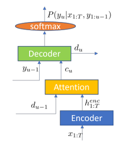
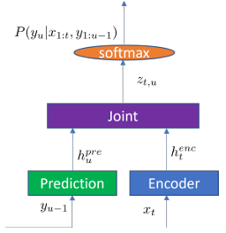
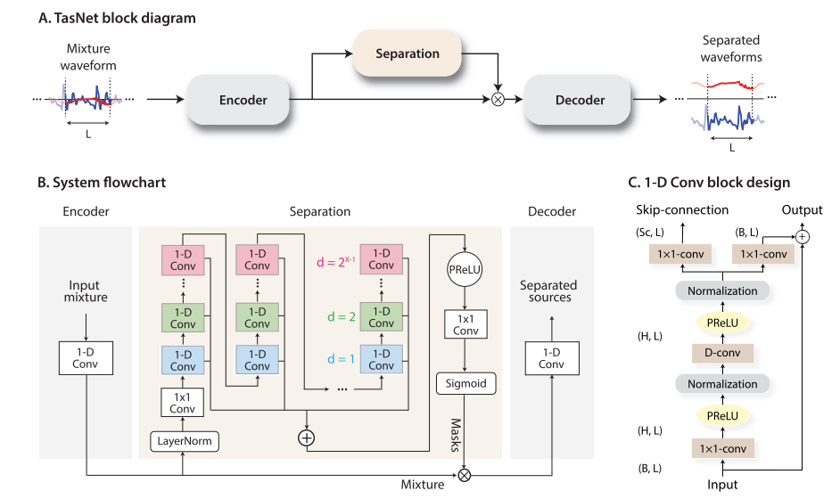
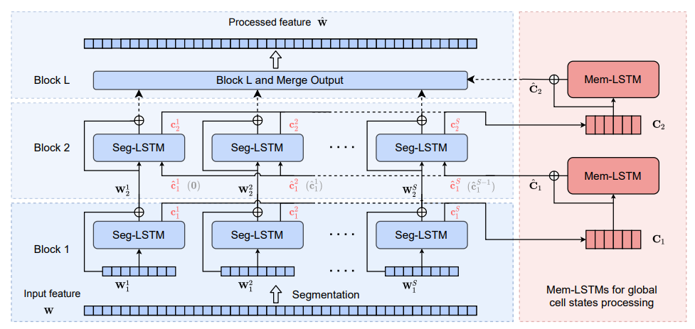
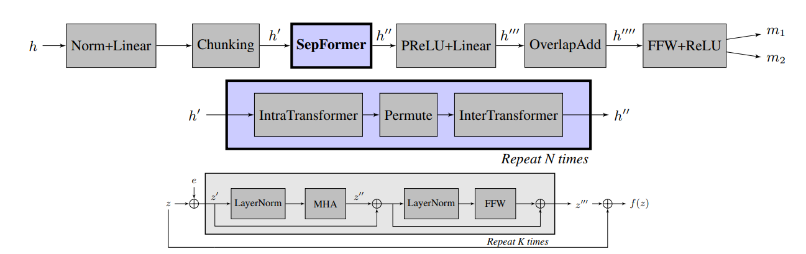
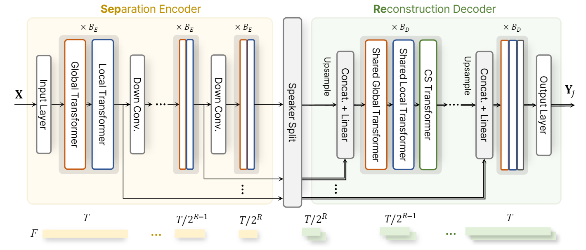
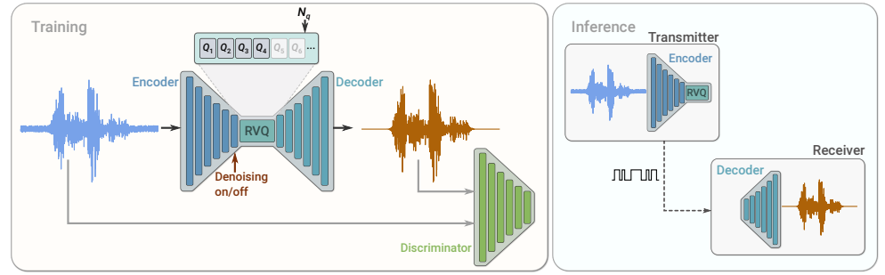

## 语音识别

参考论文

[[2111.01690] Recent Advances in End-to-End Automatic Speech Recognition](https://arxiv.org/abs/2111.01690)

[[2303.03329] End-to-End Speech Recognition: A Survey](https://arxiv.org/abs/2303.03329)

### 端到端模型

目前主流的语音识别算法大多为端到端模型，使用深度学习模型将输入语音序列转换为输出token，端到端模型可以分为三种，分别为Connec tionist Temporal Classification (CTC)、Attention based Encoder-Decoder (AED)和recurrent neural network Transducer (RNN-T)或者transformer Transducer。

#### CTC

[Sequence Modeling with CTC](https://distill.pub/2017/ctc/)

端到端语音识别的一个问题是输入语音和输出文本的长度不相等，一般输出长度远小于输入长度。CTC通过CTC 损失对齐网络输出和目标值，便于计算损失。除了语音识别，CTC 损失还能应用于手写文字识别等。

CTC模型通过一个编码器将声学特征转为高维表示$h_t$，高维表示经过softmax函数转为概率

对于给定的输入 $X$，训练模型最大化接近正确答案 $Y$ 的概率，因此需要计算可微分的条件概率 $p(Y|X)$。训练好模型后，推理的目标为

$$
{Y^*} = \mathop {\arg \max }\limits_Y p(Y|X)
$$

CTC 引入特殊的空白token $\varepsilon$ 用来分割不同的token，便于处理重复的token，两个 $\varepsilon$ 之间的所有重复token都会被去除。 


模型的输出为 $N \times C$，N 为tokens长度，C 为可能的tokens类别数，

$$
p(Y|X) = \sum\limits_{A \in {A_{X,Y}}} {\prod\limits_{t = 1}^T {{p_t}({a_t}|X)} } 
$$
$A_{X,Y}$ 为所有可能的对齐路径，计算这些路径的概率。这些路径的数量可能太大以至于无法计算，因此需要一定的策略，如动态规划。ctc loss的目标是最小化

$$
\sum\limits_{\left( {X,Y} \right) \in D} { - \log p(Y|X)} 
$$

pytorch 中有 ctc loss 的实现。

CTC中假设输出之间彼此条件独立，但这一点可能难以满足。一些研究通过优化编码器如使用transformer替代lstm来缓解这种情况。同时在一些自监督语音任务中，CTC也得到了应用。

#### AED

AED包含一个编码器、注意力模块和解码器。令输出序列为$y$，输出为$x$，则AED模型计算的概率为

$$
P(y|x)=\prod_{u}P(y_u|x,y_{1:u-1})
$$
其中$u$为输出索引，训练目标是最小化损失$-\ln P(y|x)$

AED模型架构如下图所示


编码器的作用和CTC中的编码器相同，注意力模块将解码器之前的输出和高维表示加权融合，解码器采用自回归的方式利用前一个时刻的输出计算当前时刻的预测token。

AED模型可以通过添加终止符来处理输入输出不等长的问题，但有时AED模型也会使用CTC损失进行辅助优化。原始AED模型的一个问题是注意力应用于整段序列，因此难以流式处理。一些研究通过修改注意力机制如使用MoChA注意力来解决该问题。

#### RNN-T

RNN-T是一种更自然的流式端到端ASR模型，在工业上更受欢迎。RNN-T包含编码器、预测器、联合网络，如下图所示。当前时刻输入$x_t$送入编码器，RNN-T前一时刻的输出$y_{u-1}$送入预测器，联合网络将编码器和预测器的输出进行加权。


RNN-T会在输出开始额外添加一个token表示翻译起点，即$y_0$。模型最终会输出一个$T\times U$的网格，所有从（0，0）到（T-1，U-1）的路径被认为是合理路径。

在每一个网格点 $(t, u)$，模型预测下一个 Token。

- 如果预测出 **实际字符**，则向上走一步（$u \to u+1$），消耗一个标签，但不消耗时间。
- 如果预测出 **Blank ($\phi$)**，则向右走一步（$t \to t+1$），消耗一个时间帧，但不产生标签。
消耗完所有的时间帧后停止。

#### NAR

许多端到端模型（如AED或者RNN-T）都是自回归模型，这使得解码速度很慢，所以出现了非自回归模型。

[一种NAR模型](https://arxiv.org/abs/2005.04862)会预测序列长度，假设输出之间彼此独立，解码时输出每个位置上概率最大的点。但是序列长度预测难度大，同时独立性假设不能保证，因此出现了[mask CTC方法](https://arxiv.org/abs/2005.08700)。

mask CTC根据已经观察到的token以及输入的语音序列预测被mask的token。mask CTC基于CTC方法预测的序列，mask其中低可信度的token，然后进行迭代优化。这种mask CTC只能处理替换错误，想要处理插入或者删除错误还需要预测序列长度[(=)](https://arxiv.org/abs/2010.13270)。


### 深度学习模型
#### Whisper

Whisper 训练数据为多任务学习数据，包括英语识别数据，其它语言到英语的语言翻译数据和非英语识别数据等，语音对应的文本来自人类或者其它ASR模型，其中部分音频中不包含语音（作为VAD的训练数据）。

将音频文件分成 30 s 的片段（长的截断，短的补零），并且重采样为16000Hz，计算80通道的对数梅尔谱图（hann窗，窗口大小为25ms，步长为10ms），将输入变换为-1到1之间，零均值。

对文本进行清洗（英文文本替换缩略词，将一些数字和特殊符号转写为文本，替换口语和方言，去掉括号中的文本）。每个token对应 320 个采样点（两倍步长，两倍是因为模型输入时有一个步长为2的卷积）。whisper 使用 Byte Pair Encoder （BPE）的方法进行分词，可以处理多种语言，实现时使用了 tiktoken 库。先将文本拆分成一个个字节，然后通过动态地合并频繁出现的字符对（byte pair），形成新的“子词”单元，从而生成一个可用于文本处理的更小的词汇表，自动地学习和切分语音中的音节和子词。token中除了常规的文本，还有一些特殊的token，包括 `<|startoftranscript|>`、`<|translate|>`、`<|nospeech|>`等标记功能，`<|en|>` 等用来标记语言，还有用来标记时间戳的（总共30s，每隔20ms有一个时间戳，总共1501个时间戳token），这些特殊token对应的值直接依次递增即可。

模型为编码器-解码器结构，音频的对数梅尔谱图作为编码器的输入，文字的tokens作为解码器的输入。音频编码器包括两个一维卷积，激活函数为gelu，若干个Transformer层（仅有自注意力），最后为layernorm，在输入 Transformer 之前需要先进行位置编码，位置编码的过程如下

```python
def sinusoids(length, channels, max_timescale=10000):  
    """Returns sinusoids for positional embedding"""  
    assert channels % 2 == 0  
    log_timescale_increment = np.log(max_timescale) / (channels // 2 - 1)  
    inv_timescales = torch.exp(-log_timescale_increment * torch.arange(channels // 2))  # [c // 2]  
    scaled_time = torch.arange(length)[:, np.newaxis] * inv_timescales[np.newaxis, :]  # [l, c//2]  
    return torch.cat([torch.sin(scaled_time), torch.cos(scaled_time)], dim=1)  # [l, c]
```


文本解码器包括一个token的embedding，一个需要学习的位置编码，若干个Transformer层（自注意力和跨注意力），文本解码器的输入包括token以及音频编码器的输出（作为计算注意力时的 k 和 v）。经过若干个Transformer层后再经过一个LayerNorm层乘上embedding的权重得到输出的$logits\in R^{B\times T\times C}$，T 为输入的token长度，C 为词表长度。


在推理时，如果不确定输入的语音语言，会在末尾补30s的零，然后取前30s用于检测语言，提取前30s的对数梅尔谱图，token为单个特殊token `<|startoftranscript|>`，输出为 $logits\in R^{B\times 1\times C}$，然后对非语言token进行遮蔽，然后做softmax，得到检测的语言。

得到检测的语言后就不需要补零的数据了，不过由于模型的输入要求30s，因此如果音频不满30s，还需要补零到30s。语音转写一开始的token为 `[50258, 50259, 50359]`，50258表示 `<|startoftranscript|>`，50259 表示语言，50359表示 `<|transcribe|>`，如果是语音翻译，那么第三个位置就是 50358 表示 `<|translate|>`。将对数梅尔谱送入编码器得到特征，特征和tokens送入解码器得到预测的logits，解码是一个循环的过程（循环有一个最大次数，并且通过判断最后一个token是否为 `<|endoftranscript|>` 来决定是否停止），每次循环时找到概率最大的token（贪心算法），将这个token加入tokens。最后还需要加入一个特殊token `<|endoftranscript|>`。token还需要进行一些额外处理，然后再解码就得到了转写后的文本，此外还有添加时间戳和标点符号的内容。

添加时间戳实现方式为：设置decoder的输入tokens为 `[50258, 50259, 50359, 50363, decode_text_tokens, 50257]`，其中 50363 表示tokens中不包含时间戳，50257 表示 `<|endoftranscript|>` ，然后通过预先设置的 hook 获得跨注意力层的注意力，这里的注意力大小为 `[L, T]`，L 为 tokens 长度，而 T 则为时间长度，由于可能存在补零，需要将补零帧对应的权重去除，同时只保留文字对应的tokens的权重，最终得到文字和时间的注意力权重矩阵，对该矩阵进行动态时间规整找到token对应的帧，即时间戳。


#### Distil-Whisper

假设数据集中样本为 $(X_{1:T}, y_{1:N})$ 是音频—文本对，使用标准的交叉熵损失训练，

$$
{L_{CE}} =  - \sum\limits_{i = 1}^N {P({y_i}|{y_{ < i}},{H_{1:M}})} 
$$

知识蒸馏（KD）是一项模型压缩技术来训练一个学生模型来尽可能接近教师模型的输出，KD让模型可以学习给定情况下下一个可能的token的概率分布。

使用教师模型的参数初始化学生模型的参数，如从教师模型的第一层和最后一层复制到学生模型。

使用教师模型的输出 $\hat y_{1:N}$ 替代目标值 $y_{1:N}$，伪标签损失为

$$
{L_{PL}} =  - \sum\limits_{i = 1}^N {P({y_i}|{{\hat y}_{ < i}},{H_{1:M}})} 
$$
除此之外，需要缩小学生模型的概率分布 $P_i$ 和教师模型的概率分布 $Q_i$ 之间的 KL 损失

$$
{L_{KL}} = \sum\limits_{i = 1}^N {KL({Q_i},{P_i})} 
$$

为了只在准确的样本上训练，需要过滤掉一些数据，即去除一些WER过高的样本。

训练集包括了 9 个公共数据集，学生模型的音频编码器直接使用教师模型，并且在训练时固定参数，文字解码器只使用教师模型中的第一层和最后一层，其余层全部丢弃。

**训练细节**

先给数据标上伪标签，将短的音频连接起来变成30s，使用预训练的whisper模型对音频进行标记，标记时设置语言和返回时间戳。

然后初始化学生模型，使用教师模型的全部编码器和解码器的第一层和最后一层。


## 语音分离

语音分离的主要任务是从混合的语音中分离出不同说话人的语音，由于分离出的语音往往难以和真实语音一一匹配，在训练和计算指标时，可能会选择改变语音排列顺序多次计算。

### Conv-TasNet

[JusperLee/Conv-TasNet: Conv-TasNet: Surpassing Ideal Time-Frequency Magnitude Masking for Speech Separation Pytorch's Implement](https://github.com/JusperLee/Conv-TasNet)

这是一个端到端的方法，音频经过一个卷积核大小为L，步长为 L//2 的一维卷积转为特征，再输入Separator中计算多个mask，每个mask对应一个语音。




每一个1-D Conv block 有两路输出，其中有一路和输入相加后作为下一个卷积模块的输入，另一路输出是计算mask时的输出，Conv-TasNet 在计算mask时将所有的1-D Conv block 另一路输出加起来。


### Skim

[espnet/espnet2/enh/layers/skim.py at master · espnet/espnet](https://github.com/espnet/espnet/blob/master/espnet2/enh/layers/skim.py)



对于输入特征 $W^{T\times N}$，将其按照时间分成 S 块，每块长度为 K。假设第 $l$ 层Skim块的输入为 $[W_l^1,W_l^2,\cdots, W_l^S]$，那么Seg-LSTM的映射函数可以写成

$$
\eqalign{
  & \bar W_{l + 1}^s,c_{l + 1}^s,h_{l + 1}^s = {\mathop{\rm {Seg-LSTM}}\nolimits}\left( {W_l^s,\hat c_l^s,\hat h_l^s} \right)  \cr 
  & W_{l + 1}^s = {\mathop{\rm LN}\nolimits} (\bar W_{l + 1}^s) + W_l^s \cr} 
$$
使用Mem-LSTM进行跨块的处理，令${C_{l + 1}} = \left[ {c_{l + 1}^1, \cdots ,c_{l + 1}^S} \right]$，${H_{l + 1}} = \left[ {h_{l + 1}^1, \cdots ,h_{l + 1}^S} \right]$
$$
\eqalign{
  & {{\bar C}_{l + 1}} = {\rm{Mem - LST}}{{\rm{M}}_c}\left( {{C_{l + 1}}} \right)  \cr 
  & {{\bar H}_{l + 1}} = {\rm{Mem - LST}}{{\rm{M}}_h}\left( {{H_{l + 1}}} \right)  \cr 
  & {{\hat C}_{l + 1}} = {\mathop{\rm LN}\nolimits} \left( {{{\bar C}_{l + 1}}} \right) + {C_{l + 1}}  \cr 
  & {{\hat H}_{l + 1}} = {\mathop{\rm LN}\nolimits} \left( {{{\bar H}_{l + 1}}} \right) + {H_{l + 1}} \cr} 
$$
为了实现因果性，可以将Seg-LSTM的映射函数改为

$$
\bar W_{l + 1}^s,c_{l + 1}^s,h_{l + 1}^s = {\rm{Seg - LSTM}}\left( {W_l^s,\hat c_l^{s - 1},\hat h_l^{s - 1}} \right)
$$
这样第 $s$ 块只依赖前面的 $s-1$ 段的信息。

值得注意的是在训练时，每次输入的音频会被分成 S 段，然后将 S 段合并到批次这个维度，相当于每次训练 $S\times B$ 个批次的数据。SegLSTM中输入数据的维度为 $[B * S, K, D]$。

对于MemLSTM，输入的是状态 $h,c\in R^{1\times B*S \times D}$，会将其转为 $[B, S, D]$ 再送入LSTM中计算。为了保证因果性，在计算之后只会保留前S-1段并后移一位，保证最开始的一段为0。

在推理时，每次送入模型的只有一帧数据，每经过K帧通过MemLSTM计算一次状态。


### Sepformer



将Transformer用于语音分离，注意这里的IntraTransformer和InterTransformer并不是指对于时间维度和频率维度进行处理。

对于输入 $x\in R^{B\times C\times T}$ 将其在时间维度上分段，假设分成 K 段，每段长度为 S，IntraTransformer的输入为 $x\in R^{B * S \times K \times C}$，InterTransformer的输入为 $x\in R^{B * K \times S \times C}$


### SepReformer

[dmlguq456/SepReformer: Official repository of SepReformer for speech separation](https://github.com/dmlguq456/SepReformer)



输入 $x\in R^{1\times N}$ 经过一维卷积+GELU为 $X\in R^{F\times T}$，经过一个编码器，编码器中的 Global transformer 和 Local Transformer 的结构如下


与其它模型在最后拆分不同的mask，SepReformer在中间就拆分mask，解码器中的Global transformer 和 Local Transformer 共享参数，除此之外还有CS Transformer。


## 语音活动检测

语音活动检测（VAD）是检测一段声音中是否存在语音，并给出语音的起点和终点。传统的 VAD 包括基于能量（计算一小段音频的能量，如果能量超过了界限，就认为存在语音），基于跨零率（一般认为噪声的跨零率较高），还有基于频谱特征（一般认为语音的频谱特征更加规范），对语音计算频谱，然后对于给定的帧计算各个频点的熵

$$
H = -\sum_{i} P(f_i)\log (P(f_i))
$$
$P(f_i)$ 是频点 $f_i$ 的归一化能量。低熵代表语音，高熵代表噪声。

还有基于频谱变动，即计算

$$
F(t) = \sum_{f}(|X(f,t)|-|X(f,t-1)|)^2
$$
$X(f,t)$ 表示时间 $t$ 和频率 $f$ 时的频谱幅度。高的 $F(t)$ 表示噪声，低的 $F(t)$ 表示语音。

下面介绍两种深度学习算法 silero-vad 和 fsmn-vad

### silero-vad

对于一段音频，将其按照512（采样率为16000Hz）和 256（采样率为 8000Hz）的帧长分成若干帧（不重叠），使用模型预测这512个点的语音存在概率 $p_i$，将所有段的语音概率存在一个列表 $L$ 中。基于所有段的语音存在概率预测语音的起点和终点，预测算法分为端到端（较为准确）和实时（只根据一帧和之前的历史状态判断）。

#### 算法流程


令语音存在概率列表 $L = \{p_1, p_2,\cdots, p_n\}$，默认情况下判断语音存在的依据是 $p_i\ge 0.5$，当 $p_i<0.35$ 时认为语音不存在，这里为了避免将小的间隔识别为静音段，会在 $p_i <0.35$ 暂时保存当前时间（采样点），只有当间隔大于100ms时才会保存这段语音。（真实的更加复杂）。

默认情况对于保存的语音会判断这些片段是否小于250ms，并且对于语音段两端进行补零（默认30ms）


#### 训练过程

训练的损失函数为 BCELoss，训练时，将每个样本分割成若干个段（512个点），对每个段计算概率（0-1之间），然后将所有段的概率与标签计算BCE损失。


### fsmn-vad

fsmn-vad 需要先提取音频的fbank特征，并且应用 `lfr_cmvn` 进一步处理。fsmn-vad 同样支持端到端和实时处理。

#### 算法流程

fsmn-vad 的输入为音频的特征和波形，波形用于计算每一帧的分贝（注意分帧时有重叠），音频特征则送入模型计算每一帧的分数（语音概率）。后面通过状态机来检测帧（比较复杂）


## 语音合成


文字到音频的映射通常通过训练一个神经网络来实现

**文本编码**：首先将输入的文本转换为一个向量表示。通常，文本会经过词嵌入（Word Embedding）或者字符级别的编码，将每个词或字符转换为一个固定长度的向量。

**声学模型**：声学模型负责根据文本的输入生成语音特征（如梅尔频率倒谱系数MFCC或梅尔谱图）。传统方法使用像隐马尔可夫模型（HMM）这样的算法，但深度学习方法通常使用卷积神经网络（CNN）、循环神经网络（RNN）或者变换器（Transformer）来生成这些特征。

**解码生成音频**：将声学模型生成的音频特征传递给声码器（Vocoder）。声码器是一个将音频特征转换成实际波形的模块。常见的声码器包括WaveNet、WaveGlow、HiFi-GAN等。

### Montreal Forced Aligner

[MontrealCorpusTools/Montreal-Forced-Aligner: Command line utility for forced alignment using Kaldi](https://github.com/MontrealCorpusTools/Montreal-Forced-Aligner)

Montreal Forced Aligner 有预先编译好的软件包 https://github.com/MontrealCorpusTools/Montreal-Forced-Aligner/releases/download/v1.0.1/montreal-forced-aligner_win64.zip

Montreal Forced Aligner 可以将音频和文本进行对齐，可以将音频对齐到单词、音节等级别，方便语音合成。

### Tacotron2

每次输入数据时需要对不等长的数据进行补零， 模型的输入为`补零后的文本`，`输入的长度`，`补零后的梅尔谱图`，`补零后的门限（1表示补零）`和 `输出长度（未补零时的梅尔谱图长度）`。


先将文字进行embedding，然后输入编码器，编码器为若干个一维卷积，最后为一个双向LSTM。编码器之后是解码器。将编码器输出 $e\in R^{B \times C \times T}$ 转为 $e\in R^{T \times B \times C}$ ，将 $e$ 与全零帧连接得到解码器的输入。在解码时，对于每个时间步的输入进行解码，解码时会得到预测的梅尔谱图和预测的门限（门限用来标记什么时候结束），Tacotron2 的损失是梅尔谱图的MSE损失和预测门限的分类损失。


### FastSpeech2

训练时，输入除了文字，还有目标语音的音频时间，音高和能量信息。推理时，使用模型对于音频时间、音高等信息的预测值。

FastSpeech2 首先对音素进行embedding，然后添加位置编码，经过一个encoder 提取信息，再经过一个Variance Adaptor，这个Adaptor用来添加时长、音高和能量等信息，注意这里添加的都是预测器（卷积网络）预测的信息，这些预测器则通过MSE损失进行优化。之后经过解码器得到梅尔谱图或者波形。

音素时长通过 Montreal forced alignment （MFA） 工具提取；音高提取时先使用连续小波变换来分解连续音高序列为音高谱，音高谱为训练的目标；能量则计算短时傅里叶变换，将每一帧的幅度作为能量，并将其量化为256个可能的值，编码为能量 embedding。


### Parler-TTS

[[2402.01912] Natural language guidance of high-fidelity text-to-speech with synthetic annotations](https://arxiv.org/abs/2402.01912)

提出了一种高效标记数据的方法，完全使用自动标注的标签，这样可以使用大规模的数据进行训练。

输入分为原始文本和描述文本，原始文本编码为token，描述文本经过预训练的 T5 模型提取特征，token 输入Transformer 架构的Decoder，描述文本特征作为跨注意力输入，Decoder 后面是RVQ Decoder 得到语音。

描述文本包括说话人性别、重音、录制品质、音高和说话速度等。


### SupertonicTTS

[[2503.23108] SupertonicTTS: Towards Highly Efficient and Streamlined Text-to-Speech System](https://arxiv.org/abs/2503.23108)

轻量级TTS，速度快

使用流匹配算法训练扩散模型


## 神经音频编码器（NAC）

神经音频编码器（Neural Audio Codec，NAC）通过神经网络将音频映射为嵌入或者离散token，适合作为大模型的输入，NAC一般包括编码器、量化器和解码器。

传统的音频编码方式如Opus等在较高比特率时表现出色，但在更低比特率（3k比特率）时效果较差，NAC可以在低码率情况下传输高质量音频。

NAC还可用于语音增强，如[[2507.19062v1] From Continuous to Discrete: Cross-Domain Collaborative General Speech Enhancement via Hierarchical Language Models](https://arxiv.org/abs/2507.19062v1)

### SoundStream

[[2107.03312] SoundStream: An End-to-End Neural Audio Codec](https://arxiv.org/abs/2107.03312)

SoundStream的结构如图所示



编码器和解码器均由一维卷积组成

### DAC

[[2306.06546] High-Fidelity Audio Compression with Improved RVQGAN](https://arxiv.org/abs/2306.06546)


## 回声消除（AEC）

回声指声音信号经过一系列反射之后，又听到了自己说话的声音。常见的场景：远端讲话者的声音被远端麦克风采集并传入通信设备，经过通信传输之后达到近端的通信设备，并通过近端扬声器播放，这个声音又会被近端麦克风采集形成声学回声，经传输又返回到远端的通信设备，并通过远端扬声器播放出来，从而远端讲话者就听到了自己的回声。

回声消除的目标是消除近端说话时远端的声音，不要将远端的声音再传回远端。

一个完整的回声消除系统，包括以下几个模块：

1. **时延估计（Time Delay Estimation, TDE）** 模块
2. **线性回声消除（Linear Acoustic  Echo Cancellation, AEC）** 模块
3. **双讲检测（Double-Talk Detect, DTD）** 模块
4. **非线性残余声学回声抑制（Residual Acoustic Echo Suppression, RAES）** 模块，也常称为非线性处理技术(Nonlinear Processing, NLP)

消除时使用自适应滤波器，滤波器有两种状态

滤波：$\hat y(n)=x(n)*\hat w(n), e(n) = d(n)-\hat y(n)$

自适应滤波器系数更新（NLMS）：$\hat w(n+1)=\hat w(n)+\mu e(n)\frac{x(n)}{x^T(n)x(n)}$

三种工作模式（通过DTD双讲检测）

- **远端语音存在，近端语音不存在(单讲)**：滤波、自适应滤波器系数更新
- **远端语音存在，近端语音存在(双讲)**：滤波，滤波器系数不更新
- **远端语音不存在**：什么都不用做


