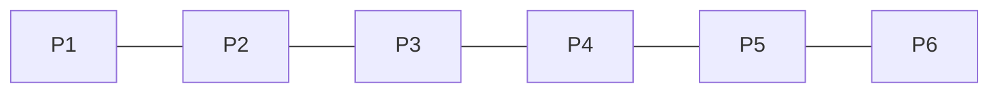

# 离散数学

> Kenneth H. Rosen编写的Discrete  Mathematics and Its Applications 8th


## 基础：逻辑和证明

### 命题逻辑

**原子命题**：不能用更简单的命题来表达的命题。

#### 逻辑符号

| 符号                      | 英文         | 中文                     |
| ------------------------- | ------------ | ------------------------ |
| $\neg p$  (not p)       | negation     | 反面，对立面（非）       |
| $p \wedge q$  (p and q) | conjunction  | 合取（与）               |
| $p \vee q$  (p or q)    | disjunction  | 析取（或）               |
| $p \oplus q$  (p xor q) | exclusive or | 异或（一真一假命题为真） |

#### 条件语句

$p\to q$表示如果$p$，那么$q$，其中$p$被称为假设（或先行词或前提），$q$称为结论（或结果）只有当$p$为真，$q$为假，$p\to q$才为假，否则为真。

| p    | q    | $p\to q$ |
| ---- | ---- | -------- |
| T    | T    | T        |
| T    | F    | F        |
| F    | T    | T        |
| F    | F    | T        |

**逆命题（converse）**：$q\to p$

**逆否命题（contrapositive）**：$\neg q \to \neg p$，命题成立与逆否命题成立等价

**双条件命题（biconditional statement）**：$p \leftrightarrow q$，p、q均成立为真，否则为假。

**一些标记**：$p\;only\;if\;q$表示只有$q$时，才有$p$；如果$q$不成立，那么$p$一定不成立，即$q$是$p$的必要条件。那么可以得到$p$是$q$的充分条件，用$if\; p,then\;q$表示。

| p    | q    | p only if q | $p\to q$ | q only if p |
| ---- | ---- | ----------- | -------- | ----------- |
| T    | T    | T           | T        | T           |
| T    | F    | F           | F        | T           |
| F    | T    | T           | T        | F           |
| F    | F    | T           | T        | T           |

$q\;unless\;\neg p$与$if\; p,then\;q$的意思相同，这句话的意思是如果$\neg p$为假，那么$q$一定为真，也就是说，当p为真但q为假时，命题" q除非$\neg p$ "为假，否则命题为真。因此，" q除非$\neg p$"和p→q总是具有相同的真值

已知 $p\to q$，则

**逆命题（converse）**：$q\to p$

**逆否命题（contrapositive）**：$\neg q\to \neg p$，只有当$\neg p$为假，而$\neg q$为真时该命题为假，否则为真

**否命题（inverse）**：$\neg p\to\neg q$，只有当$\neg q$为假，而$\neg p$为真时该命题为假，否则为真

**双条件命题（biconditional）**：$p \leftrightarrow q$，只有当p和q的取值相同才为真，相当于(p → q) ∧ (q → p)。

#### 复合命题的真值表

考虑一个复合命题：$\left( {p \vee \neg q} \right) \to \left( {p \wedge q} \right)$，则仅${p \vee \neg q}$为真时，${p \wedge q}$为假时，该复合命题为假

| p    | q    | ${p \vee \neg q}$ | ${p \wedge q}$ | $\left( {p \vee \neg q} \right) \to \left( {p \wedge q} \right)$ |
| ---- | ---- | ----------------- | -------------- | ------------------------------------------------------------ |
| T    | T    | T                 | T              | T                                                            |
| T    | F    | T                 | F              | F                                                            |
| F    | T    | F                 | F              | T                                                            |
| F    | F    | T                 | F              | F                                                            |

#### 逻辑操作符的顺序

| Operator          | Precedence |
| ----------------- | ---------- |
| $\neg$            | 1          |
| $\wedge$          | 2          |
| $\vee$            | 3          |
| $\to$             | 4          |
| $\leftrightarrow$ | 5          |


### 命题逻辑的应用

#### 语句翻译成逻辑

语句：“You can access the Internet from campus only if you are a computer science major or you are not a freshman.”

逻辑：$p\to (q\;\vee\;\neg f)$，p代表You can access the Internet from campus，q代表you are a computer science major，f代表you are a freshman

语句：“You cannot ride the roller coaster if you are under 4 feet tall unless you are older than 16 years old.”

逻辑：$(p\;\wedge\;\neg q)\to\neg f$，p代表you are under 4 feet tall，q代表You are older than 16 years old，f表示You can ride the roller coaster

#### Bool搜索

在布尔搜索中，连接的AND用于匹配同时包含两个搜索词的记录，连接的OR用于匹配两个搜索词中的一个或两个，连接的NOT(有时写成AND NOT)用于排除特定的搜索词。当使用布尔搜索来定位可能感兴趣的信息时，通常需要仔细规划如何使用逻辑连接词。


### 命题等价

无论其中出现的命题变量的真值是多少，一个复合命题总是为真，这就叫做重言式（永真式，tautology）。一个总是假的复合命题叫做矛盾式（contradiction）。既不是永真式也不是矛盾式的复合命题称为可能式（contingency）。

#### 逻辑等价

如果$p \leftrightarrow q$是重言式，则两个复合命题$p$和$q$逻辑等价，用$p \equiv q$表示，注意$\equiv$并不是一个逻辑连接符，而是表示$p \leftrightarrow q$是一个重言式。

**De Morgan法则**：$\neg \left( {p \wedge q} \right) = \neg p \vee \neg q,\quad \neg \left( {p \vee q} \right) = \neg p \wedge \neg q$

**条件析取等价**：$p \to q \equiv \neg p \vee q$，左边当$p$为真，$q$为假时，命题为假；右边当$p$为真，$q$为假时，命题为假

**分配律**：$p \vee \left( {q \wedge r} \right) \equiv \left( {p \vee q} \right) \wedge \left( {p \vee r} \right),\;p \wedge \left( {q \vee r} \right) \equiv \left( {p \wedge q} \right) \vee \left( {p \wedge r} \right)$

**结合律**：$\left( {p \vee q} \right) \vee r \equiv p \vee \left( {q \vee r} \right),\;\left( {p \wedge q} \right) \wedge r \equiv p \wedge \left( {q \wedge r} \right)$

**吸收律**：$p \vee \left( {p \wedge q} \right) = p,\;p \wedge \left( {p \vee q} \right) = p$


#### 构造新的逻辑等价

证明$\neg (p\to q)$和$p\wedge\neg q$逻辑等价
$$
\neg (p \to q) = \neg (\neg p \vee q) = p \wedge \neg q
$$

#### 可满足性

对于一个复合命题，如果给它的变量赋真值，使它为真(也就是说，当它是重言式或偶然性时)，则称这个复合命题是可满足的。

应用：n-皇后问题

n皇后问题要求在一个n × n的棋盘上放置n个皇后，这样任何皇后都不能攻击另一个皇后。这意味着不能将两个皇后放在同一行、同列或同一对角线上。图1显示了8皇后问题的解决方案。(八皇后问题可以追溯到1848年，当时由马克斯·贝泽尔提出，并于1850年由弗朗茨·纳克彻底解决。

为了将建模n-皇后问题成一个满足性问题，我们引入$n^2$变量$p(i,j),\; i=1,2,...,n,\;j=1,2,...,n$，对于一个皇后在棋盘上的给定位置，$p(i,j)$在正方形第i行第j列有皇后时为真，反之为假。请注意，如果$i+i'=j+j'$或$i-i'=j-j'$，则正方形(i, j)和(i',j')位于同一对角线上。

如果要求n个皇后没有两个在同一行，所以每行只有一个皇后，我们可以通过验证每行至少包含一个皇后，每行最多包含一个皇后来证明每行中有一个皇后。可以使用
$$
{Q_1} = \mathop  \wedge \limits_{i = 1}^n \mathop  \vee \limits_{j = 1}^n p(i,j)
$$
对于每一行，让$\mathop  \vee \limits_{j = 1}^n p(i,j)$为真表示至少有一个皇后，$\mathop  \wedge \limits_{i = 1}^n \mathop  \vee \limits_{j = 1}^n p(i,j)$为真则表示每行都至少有一个皇后，同样也保证了每列至少有一个皇后。

对于每行最多只有一个皇后，对于整数j和k，且$1\le j<k\le n$，需要保证$p(i,j)$和$p(i,k)$不同时为真，可以通过$\neg p(i,j)\vee\neg p(i,k)$表示，对于每一行：
$$
{Q_2} = \mathop  \wedge \limits_{i = 1}^n \mathop  \wedge \limits_{j = 1}^{n - 1} \mathop  \wedge \limits_{k = j + 1}^n (\neg p(i,j) \vee \neg p(i,k))
$$
同样对于每一列，有
$$
{Q_3} = \mathop  \wedge \limits_{j = 1}^n \mathop  \wedge \limits_{i = 1}^{n - 1} \mathop  \wedge \limits_{k = i + 1}^n (\neg p(i,j) \vee \neg p(k,j))
$$
要求对角线没有多个皇后，先看向左上的对角线
$$
{Q_4} = \mathop  \wedge \limits_{i = 2}^n \mathop  \wedge \limits_{j = 1}^{n - 1} \mathop  \wedge \limits_{k = 1}^{\min (i - 1,n - j)} (\neg p(i,j) \vee \neg p(i - k,k + j))
$$
再看右下的对角线
$$
{Q_5} = \mathop  \wedge \limits_{i = 1}^{n - 1} \mathop  \wedge \limits_{j = 1}^{n - 1} \mathop  \wedge \limits_{k = 1}^{\min (n - i,n - j)} (\neg p(i,j) \vee \neg p(i + k,k + j))
$$
最后需要满足可满足性为
$$
Q = {Q_1} \wedge {Q_2} \wedge {Q_3} \wedge {Q_4} \wedge {Q_5}
$$
还有**数独**的例子不过多赘述。

### 谓词和量词

#### 谓词

如让P(x)表示表述“x>3”，P(4)为真，P(3)为假。

**前置条件和后置条件**：谓词还可以用来验证计算机程序，也就是证明当给定合法输入时计算机程序总是能产生所期望的输出。（注意除非建立了程序的正确性，否则无论测试了多少次都不能证明程序对所有输入都产生所期望的输出，除非能测试到每个输入值。）描述合法输入的语句叫作前置条件，而程序运行的输出应该满足的条件称为后置条件。

考虑下面的程序

```c++
temp = x;
x = y;
y = temp;
```

前置语句P(x,y)：假设“x=a，y=b”成立，后置语句Q(x,y)：“x=b, y=a”。

#### 量词

**全称量词**：许多数学命题断言某一性质对于变量在某一特定域内的所有值均为真，这一特定域称为变量的论域（domain of discourse）（或全体域（ universe of discourse））, 时常简称为域(domai n) 。这类语句可以用全称量化表示。

**存在量词**：许多数学定理断言：有一个个体使得某种性质成立。这类语句可以用存在量化表示。我们可以用存在批化构成这样一个命题：该命题为真当且仅当论域中至少有一个x的值使得P(x)为真。

| 命题              | 什么时候为真        | 什么时候为假          |
| ----------------- | ------------------- | --------------------- |
| $\forall xP(x)$ | 对每一个x，P(x)为真 | 有一个 x, 使 P(x)为假 |
| $\exists xP(x)$ | 有一个x，使P(x)为真 | 对每一个x，P(x)都为假 |

#### 有限域上的量词

当一个量词的域是有限的，则可以用命题逻辑来表示，当论域中的元素为$x_1,x_2,...,x_n$，则：
$$
\eqalign{
  & \forall xP(x) \equiv P({x_1}) \wedge P({x_2}) \wedge ... \wedge P({x_n})  \cr 
  & \exists xP(x) \equiv P({x_1}) \vee P({x_2}) \vee ... \vee P({x_n}) \cr} 
$$

#### 量词的优先级

量词$\forall$和$\exist$比命题演算中的所有逻辑运算符都具有更高的优先级。比如，$\forall xP(x) \vee Q(x)$是$\forall xP(x)$和$Q(x)$的析取。换句话说，它表示$\left( {\forall xP(x)} \right) \vee Q(x)$，而不是$\forall x\left( {P(x) \vee Q(x)} \right)$。

#### 量化表达式的否定

$$
\neg \forall xP(x) \equiv \exists x\neg P(x)
$$

$\neg \forall xP(x)$为真当且仅当$\forall xP(x)$为假，则$P(x)$至少存在一个假，则$\neg P(x)$至少存在一个真，则$\exists x\neg P(x)$为真，同理可以得到$\neg \forall xP(x)$为假时，$\exists x\neg P(x)$也为假，所以两者等价。

$\forall x({x^2} > x)$的否定为$\exists x\neg ({x^2} > x) \equiv \exists x({x^2} \le x)$，$\exists x({x^2} = 2)$的否定为$\forall x\neg ({x^2} = 2) \equiv \forall x({x^2} \ne 2)$

#### 系统规范说明中量词的使用

用谓词和量词表达系统规范说明“每封大于1MB的邮件会被压缩”和“如果一个用户处于活动状态，那么至少有一条网络链路是有效的”。

“每封大于1MB的邮件会被压缩”：令S(m,y)表示邮件m大于yMB，其中变量的m的论域是所有邮件，变量y是一个正实数；令C(m)表示“邮件m会被压缩”。可以表述为：$\forall m\left( {S(m,1) \to C(m)} \right)$

“如果一个用户处于活动状态，那么至少有一条网络链路是有效的”：令A(u)表示“用户u处于活动状态”，其中变量u的论域是所有用户；令S(n,x)表示网络链路n处于x状态，其中n的论域是所有网络链路，x的论域是网络链路所有可能的状态。可以表述为：$\exists uA(u) \to \exists nS(n,work)$

### 嵌套量词

一个量词出现在另一个量词的作用域，如$\forall x\exists y(x + y = 0)$可以表示为$\forall xQ(x)$，而$Q(x) \equiv \exists y(x + y = 0)$。

#### 理解涉及嵌套量词的语句

如$\forall x\exists y(x + y = 0)$表示为对于所有x，存在y，使x+y=0，即每个实数都有一个加法的逆

如$\forall x\forall y\left( {\left( {x > 0} \right) \wedge \left( {y < 0} \right) \to \left( {xy < 0} \right)} \right)s$，表示对于所有x和y，当x>0且y<0时，都有xy<0。

将“每个人恰好有一个最好的朋友”翻译成逻辑表达式

对于一个人x恰好有一个最好的朋友，可以表示为存在一个人y是x最好的朋友，同时其他不是y的人z都不是x最好的朋友，x最好的朋友是y用$B(x,y)$表示。
$$
\forall x\exists y\left( {B(x,y) \wedge \forall z\left( {(z \ne y) \to \neg B(x,z)} \right)} \right)
$$

#### 嵌套量词的否定

直接连续地应用单个量词语句的否定规则即可

如$\forall x\exists y(xy = 1)$的否定为$\exists x\forall y(xy \ne 1)$


### 推理规则

语句$\left( {\left( {p \to q} \right) \wedge p} \right) \to q$是一个永真式，是假言推理（modus ponens）或分离规则（law of detachment）的推理规则的基础。
$$
\eqalign{
  & \;\;\;p  \cr 
  & \;\;\;\underline {p \to q}   \cr 
  & ∴ q \cr}
$$


#### 谬误

命题$\left( {\left( {p \to q} \right) \wedge q} \right) \to p$不是永真式，因为当p为假，q为真时，左边为真，而右边为假，这种称为**肯定结论的谬误**（allacy of affirming the conclusion）

命题$\left( {\left( {p \to q} \right) \wedge \neg p} \right) \to \neg q$不是永真式，当p为假q为真时，左边为真，而右边为假，这种称为**否定假设的谬误**（allacy of denying the hypothesis）。

#### 量化命题的推理规则

**全称实例**（universal instantiation）是从给定前提$\forall xP(x)$得出P(c)为真的推理规则；

**全称引入**（universal generalization）是从对论域里所有元素c都有P(c)为真的前提推出$\forall xP(x)$为真的推理规则；

**存在实例**（existential instantiation）是允许从“如果我们知道$\exists xP(x)$为真，得出在论域中存在一个元素c使得P(c)为真”的推理规则；

**存在引入**（existential generalization）是用来从“已知有一特定的c使P(c)为真时得出$\exists xP(x)$为真”的推理规则。

#### 命题和量化命题推理规则的组合使用

**全称假言推理**（universal modus ponens）：如果$\forall x\left( {P(x) \to Q(x)} \right)$为真，并且如果P(a)对在全称量词论域中的一个特定元素a为真，那么Q(a)肯定为真。
$$
\eqalign{
  & \;\;\;\forall x\left( {P(x) \to Q(x)} \right)  \cr 
  & \;\;\;\underline {P(a),\;a \in domai{n_x}}   \cr 
  & ∴ Q(a) \cr} 
$$

### 证明导论

**证明方法**

1. 直接证明法：$p\to q$

2. 反证法：$\neg q \to \neg p$

3. 归谬证明法：

假设我们要证明命题p是真的。再假定我们能找到一个矛盾式q使得$\neg p\to q$为真。因为q是假的，而$\neg p\to q$是真的，所以我们能够得出结论$\neg p$为假，这意味着p为真。

如证明任意22天中至少有4天属于每星期的同一天

令p为命题“任意 22 天中至少有 4 天属于每星期的同一天”。假设$\neg p$为真。这意味着 22 天中至多有 3 天属于每星期的同一天。因为一个星期有 7 天，这蕴含至多可以选择 21天，对于每星期的同一天，最多可以选三天属于这一天。这个与我们题中有 22 天的前提相矛盾。也就是说，如果 r 是命题 “22 天”，则我们已经证明了$\neg p\to(r\wedge \neg r)$。所以，我们知道p是真的。我们证明了 22 天中至少有 4 天属于每星期的同一天。

### 证明的方法和策略

给出了许多证明方法和策略

1. 穷举证明法和分情形证明法
2. 存在性证明，构造性和非构造性
3. 唯一性证明，要证存在性和唯一性
4. 证明策略：正向推理和反向推理
5. 寻找反例
6. 证明策略实践：棋盘拼接问题

证明或驳斥：如果你有一个盛有8加仑水的瓶和两个容量分别为5加仑和3加仑的空瓶，那么你可以通过不断地把一瓶水全部或部分倒人另一个瓶中而测量出4加仑的水。

证明：令盛有8加仑水的瓶为A，容量为5加仑水的瓶为B，容量为3加仑的瓶为C

```python
	      8 0 0
A -> C	5 0 3
C -> B	5 3 0
A -> C	2 3 3
C -> B	2 5 1
B -> A	7 0 1
C -> B	7 1 0
A -> C 	4 1 3
```

可以找到这样一种方法满足测量出4加仑水的方法。


## 基本结构：集合、函数、序列、求和与矩阵

### 集合

**花名册表示法**：{a，b，c，d}

**相等集合**：两个集合包含相同的元素称为相等集合，如{1,3,3,5,5,5,5}和{1,3,5}是同一个集合

**空集**：不含任何元素的集合，空集的唯一元素是空集本身

**单元素集**：只有一个元素的集合

**基数**：令S为集合，S的基数记为|S|

**幂集**：给定集合S，S的幂集是集合S所有子集的集合，S的幂集记为$P(S)$

**多重集**：是一个元素的无序集，其中元素作为成员可以出现多于一次，如$\{m_1,a_1,m_2,a_2,...\}$

### 函数

**一对一（one-to-one）或单射（injection）函数**：当且仅当对于f的定义域中的所有a和b有f(a)=f(b)蕴含a=b。$\forall a\forall b\left( {f(a) = f(b) \to a = b} \right)$或者$\forall a\forall b\left( {a \ne b \to f(a) \ne f(b)} \right)$

**映上（onto）或满射（subjection）函数**：当且仅当对每个$b \in B$有元素$a \in A$使得f(a)=b，$\forall y\forall x\left( {f(x) = y} \right)$。

**一一对应（one-to-one correspondence）或双射（bijection）函数**：既是一对一又是映上的。

下取整函数（floor）：$\left\lfloor x \right\rfloor$，上取整函数（ceiling）：$\left\lceil x \right\rceil$，注意$\left\lfloor { - x} \right\rfloor  =  - \left\lceil x \right\rceil ,\quad \left\lceil { - x} \right\rceil  =  - \left\lfloor x \right\rfloor$

### 集合的基数

**康托尔-伯恩施坦定理**：如果A和B是集合且$\left| A \right| \le \left| B \right|$和$\left| A \right| \ge \left| B \right|$，则$\left| A \right| = \left| B \right|$，换言之，如果存在一对一函数f从A到B和g从B到A，则存在A和B之间的一一对应函数。

**可计算与不可计算**：如果存在某种编程语言写的计算机程序能计算该函数的值，则称为是可计算的，如果一个函数不是可计算的，就说是不可计算的。

### 矩阵

#### 布尔运算

**0-1矩阵的并和交**：矩阵的对应位进行并和交
$$
\eqalign{
  & A = \left[ {\matrix{
   1 & 0 & 1  \cr 
   0 & 1 & 0  \cr 

 } } \right],\quad B = \left[ {\matrix{
   0 & 1 & 0  \cr 
   1 & 1 & 0  \cr 

 } } \right]  \cr 
  & A \vee B = \left[ {\matrix{
   {1 \vee 0} & {0 \vee 1} & {1 \vee 0}  \cr 
   {0 \vee 1} & {1 \vee 1} & {0 \vee 0}  \cr 

 } } \right] = \left[ {\matrix{
   1 & 1 & 1  \cr 
   1 & 1 & 0  \cr 

 } } \right]  \cr 
  & A \wedge B = \left[ {\matrix{
   {1 \wedge 0} & {0 \wedge 1} & {1 \wedge 0}  \cr 
   {0 \wedge 1} & {1 \wedge 1} & {0 \wedge 0}  \cr 

 } } \right] = \left[ {\matrix{
   0 & 0 & 0  \cr 
   0 & 1 & 0  \cr 

 } } \right] \cr}
$$
**布尔积**：令$A = [{a_{ij}}]$为$m\times k$阶0-1矩阵，$B=[b_{ij}]$为$k\times n$阶0-1矩阵。A和B的布尔积，记为$A \odot B$，是$m\times n$矩阵$[c_{ij}]$，其中
$$
{c_{ij}} = \left( {{a_{i1}} \wedge {b_{1j}}} \right) \vee \left( {{a_{i2}} \wedge {b_{2j}}} \right) \vee ... \vee \left( {{a_{ik}} \wedge {b_{kj}}} \right)
$$

$$
\eqalign{
  & A = \left[ {\matrix{
   1 & 0  \cr 
   0 & 1  \cr 
   1 & 0  \cr 

 } } \right],\quad B = \left[ {\matrix{
   1 & 1 & 0  \cr 
   0 & 1 & 1  \cr 

 } } \right]  \cr 
  & A \odot B = \left[ {\matrix{
   {\left( {1 \wedge 1} \right) \vee \left( {0 \wedge 0} \right)} & {\left( {1 \wedge 1} \right) \vee \left( {0 \wedge 1} \right)} & {\left( {1 \wedge 0} \right) \vee \left( {0 \wedge 1} \right)}  \cr 
   {\left( {0 \wedge 1} \right) \vee \left( {1 \wedge 0} \right)} & {\left( {0 \wedge 1} \right) \vee \left( {1 \wedge 1} \right)} & {\left( {0 \wedge 0} \right) \vee \left( {1 \wedge 1} \right)}  \cr 
   {\left( {1 \wedge 1} \right) \vee \left( {0 \wedge 0} \right)} & {\left( {1 \wedge 1} \right) \vee \left( {0 \wedge 1} \right)} & {\left( {1 \wedge 0} \right) \vee \left( {0 \wedge 1} \right)}  \cr 

 } } \right]  \cr 
  &  = \left[ {\matrix{
   1 & 1 & 0  \cr 
   0 & 1 & 1  \cr 
   1 & 1 & 0  \cr 

 } } \right] \cr} 
$$

令A为0-1方阵，r为正整数，A的r次布尔幂是r个A的布尔积，记作$A^{[r]}$，因此
$$
{A^{[r]}} = A \odot A \odot ... \odot A
$$

## 算法

### 算法

#### 搜索

直接搜索：略

二分搜索：伪代码

```latex
procedure binary_search(x:list, a:integer){
    int i = 0;
    int j = len(x) - 1;
    int m = 0;
    while i<j
    {
        m := floor((i+j)/2)
        if x[m] < a then i:= m+1
        else j := m
    }
    if x[m]=a then return i
    else return -1
}
```

#### 排序

冒泡排序和插入排序

#### 字符串匹配算法

朴素字符串匹配算法

#### 贪婪算法

安排讲座的贪婪算法：如果我们在每一步选择那个与巳选讲座相容的讲座中结束时间最早的讲
座，我们就能安排最多的讲座。

> procedure schedule($s_1\le s_2\le...\le s_n$：讲座开始时间，$e_1\le e_2\le...\le e_n$：讲座结束时间)
>
> 根据结束时间对讲座排序，重新编号使得$e_1\le e_2\le...\le e_n$
>
> $S:=\O$
>
> for j := 1 to n
>
> ​	if 讲座j与S相容 then
>
> ​		$S: = S \cup \{ 讲座j\}$
>
> return S{S是已经安排讲座的集合}

#### 停机问题

**停机问题（halting problem）**：它询间是否存在一个过程(procedure) 能做这件事：该过程以一个计算机程序以及该程序的一个输入作为输入，并判断该程序在给定输入运行时是否最终能停止。

**这个问题是没有解的**

证明：假设停机问题有一个解，一个称为$H(P,I)$的过程。过程$H(P,I)$有两个输入项， 令一个是程序P，另一个是程序P的一个输入$I$。如果H判定P在给定输入$I$时能终止，则$H(P,I)$将产生字符串“停机”作为输出。反之，$H(P,I)$将产生字符串“无限循环”作为输出。现在我们将导出一个矛盾。

编写一个过程的时候，它本身就表达为一个由字符构成的串，该串可以解释为一个比特序列。这意味着一个程序本身就可以当作数据使用。因此，一个程序可以作为另一个程序的输入，甚至是自身的输入。这样，H可以将一个程序P作为它的两个输入，即一个程序和该程序的输入。H应该可以判断当P给定其自身的副本作为输入时， P 是否会停机。

为了证明不存在过程H能够求解停机问题，我们构造一个简单过程K(P)，如果H(P, P) 的输出是“无限循环”，即P在自身作为输入时会无限循环，那么让K(P)停机。如果H(P,P)的输出是“停机”，即P在自身作为输入时会停机，那么让K(P)无限循环。即K(P)做出和 H(P,P) 的输出相反结果。


现在假设把K作为K的输入。需要注意，如果H(K, K)的输出是“无限循环”，那么根据K的定义可以得出 K(K)停机。这意味着由H的定义， H(K, K)的输出是“停机”，这是一个矛盾。否则，如果 H(K, K) 的输出是“停机”，那么根据 K 的定义K(K)会无限循环，这意味着由H的定义， H(K, K) 的输出是“无限循环”。这也是一个矛盾。这样，H并不总能给出正确的答案。因此，没有这样的过程能解决停机问题。 

### 函数的增长

#### 大O记号

**定义**：令f和g为从整数集或实数集到实数集的函数，如果存在常数C和k使得只要当x>k是就有
$$
\left| {f(x)} \right| \le C\left| {g(x)} \right|
$$
就可以说f(x)是O(g(x))的，读作f(x)是大Og(x)的。

当$f(x)$是$O(g(x))$的，并且对于足够大的$x$有函数$h(x)$的绝对值大于$g(x)$，则有$f(x)$是$O(h(x))$，换言之，在$f(x)$是$O(g(x))$的这一关系中的$g(x)$可以替换为具有更大绝对值的函数。

如果$|f(x)|\le C|g(x)|\quad if\; x>k$，并且如果对所有$x>k$有$|h(x)| > |g(x)|$，那么
$$
|f(x)|\le C|h(x)|\quad if\;x>k
$$
故$f(x)$是$O(h(x))$的。

#### 重要函数的大O估算

定理1：令$f(x)=a_nx^n+a_{n-1}x^{n-1}+...+a_1x+a_0$，则$f(x)$是$O(x^n)$的。

对于$n!$，$n! = 1 \cdot 2 \cdot 3 \cdot  \cdots  \cdot n \le n \cdot n \cdot n \cdot  \cdots  \cdot n = {n^n}$，所以$n!$是$O(n^n)$，

对于$\log n!$，$\log n! = \log {n^n} = n\log n$，所以$\log n!$是$O(n\log n)$，

#### 函数组合的增长

定理2：假定$f_1(x)$是$O(g_1(x))$的，$f_2(x)$是$O(g_2(x))$的，那么$(f_1+f_2)(x)$是$O(g(x))$的，其中对所有$x$有$g(x)=\max(|g_1(x)|,|g_2(x)|)$。

定理3：假定$f_1(x)$是$O(g_1(x))$的，$f_2(x)$是$O(g_2(x))$的，那么$(f_1f_2)(x)$是$O(g_1(x)g_2(x))$的。

#### 大$\Omega$与大$\Theta$记号

令f和g为从整数集合或实数集合到实数集合的函数，如果存在正常数$C$和$k$使得当$x>k$时有
$$
|f(x)|\ge C|g(x)|
$$
大O记号表示上界，大$\Omega$记号表示下界

令f和g为从整数集合或实数集合到实数集合的函数，如果$f(x)$是$O(g(x))$的且$f(x)$是$\Omega(g(x))$的，则$f(x)$是$\Theta(g(x))$的。当$f(x)$是$\Theta(g(x))$时，就说$f(x)$是大西塔$g(x)$的，即$f(x)$是$g(x)$阶的，即$f(x)$和$g(x)$是同阶的。

### 算法复杂度

#### 时间复杂度

**线性搜索算法的时间复杂度**

算法中每次循环都要做两次比较，一次$i\le n$判断是否已到达列表结尾，一次$x\le a_i$比较元素x和列表中的一项。再加上一次比较用于退出循环和一次循环外的比较，最坏情况需要2n+2次比较，是$\Theta(n)$的。

**二分搜索算法的时间复杂度**

假定列表一共有$n=2^k$个元素，其中$k$是非负整数。$k=\log n$（如果列表中元素个数n不是2的幂次，那么该列表可以看作一个有$2^{k+1}$个元素的大列表的一部分。）

在算法的每一阶段，都要比较i和j（分别是当前待搜索列表的第一项和最后项的位置）来判断待搜索列表是否包含一个以上的元素。如果$i<j$，则要做一次比较来判断是否大于待搜索列表的中间元素。

第一阶段搜索限于含$2^{k-1}$个元素的列表，至此已经用了两次比较，下一阶段便是在$2^{k-2}$个元素的列表中循环，以此类推，当搜索到只剩下一个元素时，一次比较告诉我们列表中没有其他元素，再一次用于判断这一项是否为x，所以最多需要$2k+2=2\log n+2$次比较，所以时间复杂度是$\Theta(n)$。

**冒泡算法的时间复杂度**

在每一遍冒泡排序都连续比较相邻元素，必要时交换相邻元素。当第$i$遍开始时，$i-1$个最大的元素
保证在正确位置上。在这一遍，使用了$n-i$次比较。冒泡排序对 n 个元素的列表进行排序时所需使用的总的比较次数是
$$
{\rm{(n - 1) + (n - 2) + }} \cdots {\rm{ + 2 + 1 = }}{{n(n - 1)} \over 2}
$$


**插入排序的时间复杂度**

插入排序把第j个元素插入到前j-1个已排好顺序的元素中的正确位置上。插入排序用线性搜索技术来做到这一点，依次比较第j个元素与后续各项，直到找到大于或等于这个元素的一项或者比较$a_j$与它自身为止，因为$a_j$不小于它自身。于是，在最坏情形下，把第j个元素插入正确位置需要j次比较。所以，用插入排序对n个元素的列表排序时所使用总的比较次数是
$$
2 + 3 +  \cdots  + n = {{n(n + 1)} \over 2} - 1
$$

#### 矩阵乘法的复杂度

普通的方阵乘法复杂度为$n^3$次乘法和$n^2(n-1)$次加法，但是有快速算法，只需$O(n^{\sqrt{7}})$次乘法和加法

一般性的矩阵相乘，如$m_1\times m_2$矩阵和一个$m_2\times m_3$矩阵相乘，需要做$m_1m_2m_3$次整数乘法。

#### 理解算法的复杂度

| 复杂度            | 术语           | 复杂度               | 术语         |
| ----------------- | -------------- | -------------------- | ------------ |
| $\Theta(1)$       | 常量复杂度     | $\Theta(n^b)$        | 多项式复杂度 |
| $\Theta(\log n)$  | 对数复杂度     | $\Theta(b^n),\; b>1$ | 指数复杂度   |
| $\Theta(n)$       | 线性复杂度     | $\Theta(n!)$         | 阶乘复杂度   |
| $\Theta(n\log n)$ | 线性对数复杂度 |                      |              |

**易解性**：能用多项式最坏情形复杂度（或更优）的算法求解的问题称为易解的；

**难解性**：不能用最坏情形多项式时间复杂度的算法解决的问题；

**P与NP**：注意人们相信许多可解的问题具有这样的性质，即没有多项式最坏情形时间复杂度的算法能求解，但是一旦有了一个解答，却可以用多项式时间内来验证。能以多项式时间内验证解的问题称为属于 NP 类（易解的问题属于 P 类）。

**NP完全问题 (NP-complete problem)**：具有这样的性质即只要其中任何一个问题能用一个多项式时间最坏情形算法来求解，那么NP类的所有问题都能用多项式时间最坏情形算法来求解。可满足性问题也是NP完全问题的一个例子。

**P与NP问题（P versus NP problem）**：问NP（有可能在多项式时间内检验其解的一类问题）
是否等于P（一类易解的问题）。如果$P\neq NP$，则存在这样一些不能在多项式时间内求解但其解
可以在多项式时间内验证的问题。NP完全性的概念有助于研究解决P与NP问题，因为NP完全问题是那些在NP类中被认为最不可能是P类中的问题，由于NP中的每个问题可以在多项式时间内归约为一个NP完全问题。绝大多数理论计算机科学家相信$P\neq NP$，这意味着没有NP完全问题能在多项式时间内解决。

## 数论和密码学

### 整除性和模算术

#### 除法算法

用记号$a|b$表示a整除b，当a不能整除b则写成$a\nmid b$，可以用量词将$a|b$写成($\exist c(ac=b)$)。

除法算法：$a=dq+r$，$q=a\; div\;d$，$r=a \mod d$

如果$a$和$b$为整数而$m$为正整数，则当m整除a-b时称a模m同余b，用记号$a \equiv b(\bmod m)$表示，称其为**同余式**（congruence），m是模。如果a和b不是模m同余的，则写成$a\not  \equiv b(\bmod m)$。

#### 模算术

**定理**：令a和b为整数，并令m为正整数，则$a \equiv b(\bmod \,m)$当且仅当$a\bmod m = b\bmod m$

**定理**：令m为正整数，整数a和b是模m同余的当且仅当存在整数$k$使得$a=b+km$

**定理**：令m为正整数，如果$a \equiv b(\bmod \,m)$，$c \equiv d(\bmod \,m)$，则
$$
a+c\equiv b+d(\bmod m)\;and\;ac\equiv bd(\bmod m)
$$
**推论**：令m是正整数，令a和b是整数，则
$$
(a+b)\bmod m=((a\bmod m)+(b\bmod m))\bmod m
$$
并且
$$
ab \bmod m=((a\bmod m)(b\bmod m))\bmod m
$$

#### 模m算术

可以再$Z_m$，即小于m的非负整数的集合$\{0,1,\cdots,m-1\}$上定义算术运算，

整数加法：$a+_m b=(a+b)\bmod m$

整数乘法：$a\cdot_m b=(a\cdot b)\bmod m$


### 整数表示和算法

构造b进制的算法：

> procedure base b expansion (n，b：正整数且$b>1$)
> $q:=n$
> $k:=0$
> while $q\neq 0$
> 	$a_k:=q\bmod b$
> 	$q:=q \;div\;b$
> 	$k:=k+1$
> return $(a_{k-1}\cdots a_1a_0)$ {$(a_{k-1}\cdots a_1a_0)_b$就是n的b进制展开式｝

求解div和mod的算法（python）

```python
def divmod(a, d):	
    q = 0		# q = a div d
    r = abs(a)	# r = a mod d
    while r >= d:
        r = r - d
        q = q + 1
    if a<0 and r > 0:
        r = d-r
        q = -(q+1)
    return q, r
```

**快速模指数运算**：计算$b^k\bmod m$，注意到
$$
b^n=b^{a_{n-1}\cdot  2^{n-1}+\cdots+a_1\cdot 2+a_0}=b^{a_{n-1}\cdot  2^{n-1}}\cdots b^{a_1\cdot 2}\cdot b^{a_0}
$$
为了计算$b^n$的值，只需计算$b,b^2,(b^2)^2=b^4,\cdots,b^{2^{k-1}}$的值，一旦有了这些值，把列表$a_j=1$那些项对应的$b^{2^j}$相乘。

如计算$3^{11}$，$3^{11}=3^83^23^1$

通过依次求出$b\bmod m, b^2\bmod m, \cdots,b^{2^{k-1}}\bmod m$，将其中$a_j=1$的那些项$b^{2^j}\bmod m$相乘，在每次乘法后求乘积后求乘积除以m所得的余数。

> procedure modular exponentiation（b：整数， n=$(a_{k-1}\cdots a_1a_0)$，m：正整数）
> $x:=1$
> $power:=b\bmod m$
> for $i:=0 \;to\; k-1$ 
> 	if $a_i=1$ then $x:=(x\cdot power)\bmod m$
> 	$power:=(power\cdot power)\bmod m$
>
> return x {x等于$b^n\bmod m$}

代码（python） [rapidexp[快速模指数运算].py](codes\rapidexp[快速模指数运算].py) 

### 素数和最大公约数

这里的很多内容在stein写的《Fouier analysis》这本书的狄利克雷定理那一章初等数论部分有，笔记见  [数学.md](数学.md)  #傅里叶分析  #狄利克雷定理。

**埃拉托斯特尼筛法**：用来寻找不超过一个给定整数的所有素数。不超过 100 的合数必定有一个不超过 10 的素因子。因为小于 10 的素数仅有 2 、 3 、5 和 7, 所以不超过 100 的素数就是这四个素数以及那些大于 1 且不超过 100 同时不能被 2 、 3 、5 和 7 之一整除的正整数。

#### 一些猜想

**梅森素数**：当p为素数时，$2^p-1$也为素数（很大的素数）

**素数定理**：当x无限增长时，不超过x的素数个数与$x/\ln x$之比$\pi(x)$趋近于1

**哥德巴赫猜想**：每个大于5的奇数n都是三个素数之和（或者是每个大于2的偶数是两个素数之和，两者等价）。

**猜想（已被证明）**：存在无限多个可以写成$n^2+1$形式的素数，其中n为正整数。

**孪生素数猜想**：孪生素数是指相差2的一对素数，诸如3和5、5和7、11和13、17和19、4967和4969。孪生素数猜想断定存在无限多对孪生素数。关于孪生素数已被证明的最好结果是有无限多对p和p+2 ，其中p是素数，p＋2是素数或者是两个素数乘积（陈景润在1966 年证明）。设 P(n) 为命题：存在无限多对差值恰为n的素数对。孪生素数猜想就是命题P(2)为真。研究孪生素数猜想的数学家设计了一个稍微弱一点的猜想，称为有界间隔猜想，声称存在一个N 使得 P(N) 为真。

**最大公约数**：gcd(x,y)     **最小公倍数**：lcm(x,y)

**定理**：令a和b为正整数，则$ab = \gcd (a,b) \cdot {\mathop{\rm lcm}\nolimits} (a,b)$

#### 欧几里得算法

> procedure gcd（a，b：正整数）
> $x:=a$
> $y:=b$
> while $y\neq0$
> 	$r:=x \mod y$
> 	$x:=y$
> 	$y:=r$
> return x{gcd(a，b)是x}

**贝组定理**：如果a和b为正整数，则存在整数$s$和$t$使得$\gcd(a,b)=sa+tb$

扩展欧几里得算法求解a和b的贝组系数

设置$s_0=1,s_1=0,t_0=0,t_1=1$，令
$$
s_j=s_{j-2}-q_{j-1}s_{j-1}t_j=t_{j-2}-q_{j-1}t_{j-1}
$$
其中$q_j$为欧几里得算法中求$\gcd(a,b)$做除法时的商，即 $q:=a\;div\; b$

 [ex_euclid[扩展欧几里得算法].py](codes\ex_euclid[扩展欧几里得算法].py) 

**定理**：令m为正整数，令a，b和c为整数。如果$ac\equiv bc(\bmod m)$且$\gcd(c,m)=1$，则$a\equiv b(\bmod m)$

### 求解同余方程

#### 线性同余方程

**线性同余方程**：同余方程的形式为$ax\equiv b(\bmod m)$，其中m为正整数，a和b为整数，而x为变量。

怎样求解线性同余方程$ax\equiv b(\bmod m)$呢？即，如何能找出所有满足这一同余方程的整数x呢？我们要介绍的一个方法是利用使得$\bar{a}a\equiv 1(\bmod m)$成立的整数$\bar{a}$，如果这样的整数存在。这样的整数 $\bar{a}$称为a模m的逆。当a和m互素时，下面的定理能保证a模m的逆存在。

**求解a模m的逆**

对于$a\cdot b=1(\bmod m)$，其中b就是a的逆元，可以利用贝组定理，得到
$$
a\cdot b + k * m = 1
$$
注意这里用到了gcd(a,m)=1的条件，则可以通过扩展欧几里得算法求出b，即贝组系数中的s。

**定理（定理4.1）**：如果a和m为互素的整数且m>1，则a模m的逆存在。再者，这个模m的逆是唯一的。

证明：如果a和m互素，则$\gcd(a,m)=1$，根据贝组定理，存在整数s和t使得，$sa+tm=1$，则存在$sa+tm\equiv 1(\bmod m)$，因为$tm\equiv0(\bmod m)$，所以有
$$
sa\equiv1(\bmod m)
$$
因此，s为a模m的逆。

假设有$s_1,s_2$满足条件，即存在$s_1a+t_1m=1,\;s_2a+t_2m=1$，两者相减得到$(s_1-s_2)a + (t_1-t_2)m=0$，则有$(s_1-s_2)a + (t_1-t_2)m=0(\bmod m)$，再有$(s_1-s_2)a=0(\bmod m)$，因为$a \neq 0(\bmod m)$，所以$s_1-s_2=0$，唯一性得证。

**中国剩余定理**：令$m_1,m_2,\cdots,m_n$为大于1的两两互素的正整数，而$a_1,a_2,\cdots,a_n$是任意整数，则同余方程组
$$
\eqalign{
  & x \equiv {a_1}(\bmod {m_1})  \cr 
  & x \equiv {a_2}(\bmod {m_2})  \cr 
  &  \vdots   \cr 
  & x \equiv {a_n}(\bmod {m_n}) \cr} 
$$
有唯一的模$m=m_1m_2\cdots m_n$的解。

证明：令$M_k=m/m_k$，当$i\neq k$时$m_i$和$m_k$没有大于1的公因子，可得$\gcd(m_k,M_k)=1$，由定理4.1可得，存在整数$y_k$，即$M_k$模$m_k$的逆，使$M_ky_k=1(\bmod m_k)$，构造一个满足所有方程的解，取和
$$
{{x  =  }}{{{a}}_1}{M_1}{y_1} + {{{a}}_2}{M_2}{y_2} +  \cdots  + {{{a}}_n}{M_n}{y_n}
$$
以第一个方程为例，因为$M_k=0(\bmod m_1),\;\;k\neq1$，x中除了第一项都可以整除$m_1$，而因为$M_1y_1=1(\bmod m_1)$，所以第一项$a_1M_1y_1 = a_1(\bmod m_1)$，同理x是所有方程的解。

**举例**：求解
$$
\eqalign{
  & x \equiv 2(\bmod 3)  \cr 
  & x \equiv 3(\bmod 5)  \cr 
  & x \equiv 2(\bmod 7) \cr} 
$$
**使用构造法求解**

首先令$m=3\cdot5\cdot7=105$，$M_1=m/3=35$，$M_2=m/5=21$，$M_3=m/7=15$，可以看出2是$M_1=35$模3的逆，因为$35\cdot2\equiv2\cdot2\equiv1(\bmod3)$；1是$M_2=21$模5的逆，因为$21\equiv1(\bmod 5)$；1 也是$M_3=15$的模7逆，因为$15\equiv1(\bmod7)$。该方程组的解是那些满足下列式子的x：
$$
\eqalign{
  & x = {a_1}{M_1}{y_1} + {a_2}{M_2}{y_2} + {a_3}{M_3}{y_3} = 2 \cdot 35 \cdot 2 + 3 \cdot 21 \cdot 1 + 2 \cdot 15 \cdot 1  \cr 
  &  = 233 = 23(\bmod 105) \cr} 
$$
从而得出 23 是方程组的最小正整数解。我们的结论是23是最小的正整数满足除以3时余2，除以 5 时余 3，除以 7 时余 2 。

**使用反向替换算法计算**

对于第一个方程x=3t+2，将x带入第二个方程可得
$$
\eqalign{
  & 3t + 2 = 5m + 3  \cr 
  & 3(at + b) + 2 = 5m + 3  \cr 
  & 3a\bmod 5 = 0  \cr 
  & \left( {3b + 2 - 3} \right)\bmod 5 = \left( {3b - 1} \right)\bmod 5 = 0 \cr} 
$$
由于3和5互素，所以a肯定为5，b可以通过搜索小于a的值即小于5得到b=2，所以解得$t\equiv2(\bmod 5)$，设t=5u+2，则x=15u+8，再带入第三个方程，通过类似方法得到$u\equiv1(\bmod 7)$（15b+6%7=0，解得b=1），设u=7m+1，则x=105m+23，则最小正整数解为23。

#### 大整数的计算机算术

假定$m_1,m_2,\cdots,m_n$是两两互素的模数，并令m为其乘积。根据中国剩余定理可以证明满足$0\le a<m$的整数a可唯一地表示为一个n元组，其元素由a除以$m_i$的余数组成，i= 1, 2, …, n 。即a 可以唯一地表示为
$$
\left( {a\bmod {m_1},a\bmod {m_2}, \cdots ,a\bmod {m_n}} \right)
$$
欲求 123 684 和 413 456 的和，根据中国剩余定理，每个小于 99 • 98 • 97 • 95 = 89403930的非负整数均可唯一地用该整数除以这四个模数的余数表示。例如，把123684表示为(33, 8, 9, 89)，因为123684 mod 99=33，123684 mod 98=8， 123684 mod 97 =9 及 123684 mod 95=89。类似地，413456可表示为(32, 92, 42, 16) 。我们针对这些四元组而非直接针对这两个整数做运算，把四元组的对应分量相加，再按相应的模数压缩各分量。这样可得
$$
\eqalign{
  & \left( {33,8,9,89} \right) + \left( {32,92,42,16} \right)  \cr 
  &  = \left( {65\bmod 99,100\bmod 98,51\bmod 97,105\bmod 95} \right)  \cr 
  &  = \left( {65,2,51,10} \right) \cr} 
$$
要求出和，即(65,2,51,10)所表示的整数，需要求解同余方程组
$$
\eqalign{
  & x \equiv 65(\bmod 99)  \cr 
  & x \equiv 2(\bmod 98)  \cr 
  & x \equiv 51(\bmod 97)  \cr 
  & x \equiv 10(\bmod 95) \cr}
$$
求解结果为537140，程序代码如下：

 ```python
 def searchb(x0, a ,d_r):
     for i in range(0, a):
         if (x0 * i + d_r) % a == 0:
             return i
 
 def rev_replace(m, r):
     x = [m[0], r[0]]
     for i in range(1, len(m)):
         a = m[i]    # 由于m_j互素，所以a直接等于m[i]
         d_r = x[1] - r[i]
         b = searchb(x[0], a, d_r)
         x[1] += x[0] * b
         x[0] *= a
     return x[1]
 ```

#### 费马小定理

如果p为素数，a是一个不能被p整除的整数，则
$$
a^{p-1}\equiv1(\bmod p)
$$
再者，对每个整数a都有
$$
a^p\equiv a(\bmod p)
$$
可以利用费马小定理计算整数高次幂的模p余数

**举例**：计算$7^{222}\bmod 11$
$$
7^{222}=7^{22*10+2}=(7^{10})^{22}7^2=(1)^{22}\cdot49=49 \bmod 11 = 5(\bmod 11)
$$

#### 伪素数

许多素数n都可以满足$2^{n-1}\equiv1(\bmod n)$，但不幸的是，存在合数（如n=341）使得该式成立，因此被称为以2为基数的伪素数。

需要说明的是，不能通过选择足够多的基数来区分素数与伪素数，因为有些正整数能通过满足gcd(b, n)=1的基数的所有测试。

一个正合数n如果对于所有满足gcd(b,n)=1的正整数b都有同余式$b^{n-1}\equiv1(\bmod n)$成立，称其为**卡米切尔数**。

**举例**：整数561是卡米切尔数，首先561=$3\cdot11\cdot17$，如果gcd(b, 561)= 1，则gcd(b, 3)= gcd(b, 11)=g cd(b, 17)=1 。

利用费马小定理可得到 
$$
{b^2} \equiv 1(\bmod 3),\quad {b^{10}} \equiv 1(\bmod 11),\quad {b^{16}} \equiv 1(\bmod 17)
$$
有
$$
\eqalign{
  & {b^{560}} = {({b^2})^{280}} = 1(\bmod 3)  \cr 
  & {b^{560}} = {({b^{10}})^{56}} = 1(\bmod 3)  \cr 
  & {b^{560}} = {({b^{16}})^{35}} = 1(\bmod 3) \cr} 
$$

#### 原根和离散对数

模素数p的一个原根是$Z_p$中的整数r，使得$Z_p$中每个非零元素都是r的一个幂次。

**举例**：判断2和3是否是模11的原根

在$Z_{11}$中计算2的幂次时，可得$2^1=2,2^2=4,2^3=8,2^4=5,2^5=10,2^6=9,2^7=7, 2^8=3,2^9=6,2^{10}=1$，因为$Z_{11}$中的每个非零元素都是2的一个幂次，所以2是11的原根；

反之计算3的幂次时，$3^1=3$和$3^6=3$重复了，所以不是原根。

假设p是一个素数，r是一个模p的原根，而a是介于（含）1和p-1之间的一个整数，如果$r^e\bmod p=a$且$0\le e\le p-1$，我们说e是以r为底a模p的离散对数，写作$\log_ra=e$

离散对数问题的输入是一个素数p、一个模p的原根 r 和一个正整数$a\in Z_p$，而输出是以 r为底 a 模p的离散对数。（在密码学中有用）


### 同余的应用

#### 散列函数

在实践中，会用到了许多不同散列函数，最常用的散列函数之一是
$$
h(k)=k\bmod m
$$
其中m是可供使用的内存地址的数目。

**举例**：找出由散列函数h(k)=k mod 111分配给社会安全号为064212848和037149212的客户记录的内存地址
$$
h(064212848) = 064212848 \bmod 111=14\\
h(037149212) = 037149212 \bmod 111=65
$$
所以社会安全号为064212848的客户记录被分配到内存地址14，而社会安全号为 037149212 的客户记录被分配到内存地址65。

由于散列函数不是一对一的（因为很可能键值的数量大于内存地址数），所以有可能多个记录被分配到同一个内存地址。当这种情况发生时，就说出现了冲突。消解冲突的一个办法是使用散列函数分配但已被占用的地址后面第一个未占用的地址。

#### 伪随机数

最常用的产生伪随机数的过程是线性同余法。我们选择4个整数：模数m、倍数a、增量c和种子$x_0$，满足$2\le a<m, 0\le c<m$及$0\le x_0<m$。通过连续应用下面递归函数来生成一个伪随机数序列$\{x_n\}$，满足对所有n，$0\le x_n<m$：
$$
x_{n+1}=(ax_n+c)\bmod m
$$
大部分计算机确实使用线性同余生成器来生成伪随机数，通常是使用增量$c=0$的线性同余生成器，这样的生成器称为纯倍式生成器。例如，以$2^{31}-1$为模，以$7^5=16807$为倍数的纯倍式生成器就广为采用。采用这些参数，可以证明在重复之前会产生$2^{31}-2$个数。

#### 校验码

同余可用于检查数字串中的错误。在这样的字串中检错的一项常用技术就是在串的结尾处添加一个额外的数字。 这最后一个数字，或校验码，是用特定的函数来计算的。然后为了判定一个数字串是否正确，需要做一个检验看看这最后一位数字是否具有正确的值。如奇偶校验，通用产品代码和国际标准书号。

### 密码学

#### 古典密码学

**换位密码**

**举例**：利用基于集合{1, 2, 3, 4}上的置换$\sigma$的换位密码，其中$\sigma(1)=3,\sigma(2)=1,\sigma(3)=4,\sigma(4)=2$

加密明文消息 PIRAT E ATTACK

首先将明文信息分为4个字母一组，则为 PIRA TEAT TACK。要加密每个分组，我们把第一个字母移到第三位，把第二个字母移到第一位，把第三个字母移到第四位，再把第四个字母移到第二位。得到IAPR ETTA AKTC。

**密码系统**：是一个五元组$$(P,C,K,E,D)$$，这里的P代表明文串的集合，C是密文串的集合，K是密钥空间（所以可能的密钥的集合），E是加密函数的集合，而D是解密函数的集合。用$E_k$表示在E中相对于密钥k的加密函数而$D_k$是D中用来解密由$E_{k}$加密的密文的解密函数，即对于所有明文串$p$有
$$
D_k(E_k(p))=p
$$

#### 公钥密码学

所有古典密码，包括移位密码和仿射密码，都是私钥密码系统的实例。在私钥密码系统中，一旦你知道加密密钥，你就能很快找到解密密钥。所以，知道如何用一个特定的密钥加密消息就能让你解密用该密钥加密的消息。现代的私钥密码如AES已经非常复杂，被认为可以很好地抵御密码分析。可是，它仍然具有共享安全通信密钥的特性。再者，为了更加安全，双方每次通信会话都需要用一个新密钥，这就需要一种能生成并安全分享密钥的方法。

为了避免每对希望安全通信的双方都需要共享密钥，20世纪70年代密码学家引入了公钥密码系统的概念。当使用这种密码系统时，知道怎样发送加密消息的人并不能解密消息。在这样的系统中，每个人都可以有一个众所周知的加密密钥。只有解密密钥是保密的，而且只有消息的预期接收人能解密。

尽管公钥密码系统的优势是保密通信的双方不需要交换密钥，但其劣势是加密解密都会非常耗时。对许多应用而言，这将使得公钥密码系统变得不实用。在这种情形下，通常是私钥密码系统取而代之。然而，公钥密码系统仍可以用于密钥的交换过程。

目前最常用的是RSA密码系统，在RSA密码系统中，每个人都有一个加密密钥$(n,e)$，这里$n=pq$是一个由两个大素数，比如各有300位数字的p和q的乘积构成的模数，$e$是与$(p-1)(q-1)$互素的指数。

**RSA加密**：为了用特定的密钥(n, e)对消息加密，首先将明文消息M翻译成整数序列。为此，可以先将每个明文字母翻译成两位数，正如在移位密码中所做的翻译，只有一点不同。即对于字母A到J增加开始的0，所以 A 被翻译为00，B 为 01，…，J为 09。然后，将这些两位数连接起来构成数字串。接下来，将这个串再分成2N位数字等长的分组，这里2N是一个大偶数使得2N位数字的整数 2525...25不超过n。（必要时，可以在明文消息后填充无意义的X使得最后一组的大小和其他分组一样）

经过这些步骤，我们已经将明文消息M翻译成了一个整数序列$m_1,m_2,...,m_k$，k为整数。加密过程是将每个分组$m_i$转换称密文分组$c_i$，由下列函数实现
$$
C=M^e\bmod n
$$
**RSA解密**：已知解密密码d即e模$(p-1)(q-1)$的逆时（由于e与$(p-1)(q-1)$互素，所以逆肯定存在，见定理4.1），就可以很快地从密文消息恢复出明文消息。为了说明这一点，注意如果$de\equiv1(\bmod (p-1)(q-1))$，则有整数k使得$de=1+k(p-1)(q-1)$。由此可知
$$
{C^d} \equiv {\left( {{M^e}} \right)^d} \equiv {M^{de}} = {M^{1 + k(p - 1)(q - 1)}}
$$
根据费马小定理，可得$M^{p-1}\equiv 1(\bmod p)$及$M^{q-1}\equiv 1(\bmod q)$，因此
$$
C^d\equiv M\cdot(M^{p-1})^{k(q-1)}\equiv M\cdot 1 \equiv M(\bmod p)
$$
且
$$
{C^d} \equiv M \cdot {\left( {{M^{q - 1}}} \right)^{k(p - 1)}} \equiv M \cdot 1 = M(\bmod q)
$$
由于gcd(p,q)=1，所以由中国剩余定理可得
$$
C^d\equiv M(\bmod pq)
$$
**举例**：使用RSA系统及密钥(2537, 13)对消息STOP加密，注意2537=43*59，p=43和q=59是素数，并且
$$
\gcd(e,(p-1)(q-1))=gcd(13,42\cdot58)=1
$$
为了加密，先把STOP的字母翻译成等价的数字。然后按4位数字一组对这些数字分组（因为2525 <2537<252525），得到1819 1415，用下面的映射对每组加密
$$
C=M^{13} \bmod 2537 = 1819^{13} \bmod 2537=2081 \\
C=M^{13} \bmod 2537 = 1415^{13} \bmod 2537=2182
$$
对加密消息 2081 2182进行解密，d=937是13模42·58=2436的逆（$937\cdot13 = 1(\bmod 42\cdot58)$），因此可以使用937作为解密指数。
$$
M = C^{937} \bmod 2537
$$

$$
\eqalign{
  & {M_1} \equiv {2081^{937}}\bmod 2537 = 1819  \cr 
  & {M_2} \equiv {2182^{937}}\bmod 2537 = 1415 \cr}
$$

翻译成英文字母为STOP。

为什么 RSA 密码系统适合作为公钥密码呢？首先，通过找寻两个各有300多位的大素数p和q，再找寻一个与$(p-1)(q-1)$互素的整数e，就可能迅速构造一个公钥。当知道模数n的因子分解，即知道素数p和q时，我们就可以迅速找到e模$(p-1)(q-1)$的逆d。（这可以利用欧几里得算法寻找d和$(p-1)(q-1)$的贝祖系数s和t来完成，这表明d模(p-1)(q-1)的逆是$s\bmod (p - 1)(q - 1)$），有了d就使得我们可以解密用加密密钥发送的消息。可是，没有一种已知的解密方法不是基于寻找n的因子分解式的，或者说也不导致n的因子分解。

一个简单的RSA程序： [simpleRSA[一个简单的RSA程序].py](codes\simpleRSA[一个简单的RSA程序].py) 

#### 同态加密

**全同态密码系统**：是否有这样一个密码系统，允许在加密数据上做任何计算并能够产生由该非加密输入所得的非加密输出的加密形式。有了这样的密码系统，就不需要解密数据了，因为程序可以在远端系统上运行而不必解密输入或输出数据。

RSA是乘法同态的，而不是加法同态，所以是偏同态。


## 归纳与递归

### 数学归纳法

#### 基本原理

数学归纳法原理：为证明对所有的正整数n，P(n)为真，其中P(n)是一个命题函数，需要完成两个步骤：

基础步骤：证明命题P(1)为真

归纳步骤：证明对每个正整数，蕴含式$P(k)\to P(k+1)$为真

可以描述为：$\left( {P(1) \wedge \forall k\left( {P(k) \to P(k + 1)} \right)} \right) \to \forall nP(n)$

#### 一些例子

**举例**：使用数学归纳法证明$7^{n+2}+8^{2n+1}$能被57整除

基础步骤：P(0)=57能被57整除

归纳步骤：假设P(k)成立，对于P(k+1)有
$$
\eqalign{
  & P(k + 1) = {7^{(k + 1) + 2}} + {8^{2(k + 1) + 1}}  \cr 
  &  = 7 \cdot {7^{k + 2}} + 64 \cdot {8^{2k + 1}}  \cr 
  &  = 7\left( {{7^{k + 2}} + {8^{2k + 1}}} \right) + 57 \cdot {8^{2k + 1}} \cr}
$$
显然能被57整除

**举例**：证明排讲座的算法（贪婪算法按照结束时间排）的最优

**基础步骤**：设贪婪算法在主讲座厅只安排一个讲座$t_1$。这意味着任何其他讲座都不能在$t_1$的结束时间$e_1$或之后进行了。否则，根据讲座结束时间非降序顺序的要求，就应该存在一个讲座，它应该在$t_1$讲座之前进行。因此，在$e_1$时刻，每个剩余的讲座都要求使用讲座厅，因为它们都要求在$e_1$时刻或$e_1$时刻之前开始，并在$e_1$时刻之后结束。这就导致了主讲座厅不能安排两个讲座，因为它们都要求在$e_1$时刻使用讲座厅。这就证明了P(1)为真，基础步骤证毕。

**归纳步骤**：需要证明P(k)为真的假设下，当需要选择k+1个讲座时，贪婪算法也总是安排了最多的讲座。现在假定算法已经选择了k+1个讲座。要完成归纳步骤的第一步是：证明存在一个包含讲座$t_1$且安排了最多讲座的计划表，其中$t_1$代表最先结束的那个讲座。容易看出，由于一个开始于讲座$t_i(i>1)$的计划表是可以改变的，使得$t_1$成为第一个讲座。为了说明这一点，注意：因为$e_1\le e_i$，所以$t_i$之后的讲座仍然可以被安排。一旦包含了讲座$t_1$，计划表就可以归结为：在$e_1$时刻或$e_1$之后，安排尽可能多的讲座。因此，如果已经安排了尽可能多的讲座，那么除了讲座$t_1$之外，以$t_1$结束时开始的计划表就是原始计划表的一个最优安排。这是因为贪婪算法在建立这个计划表时已经安排了k个讲座，根据归纳假设，当算法安排k+1个讲座时，它已经安排了最多的讲座。因此，P(k+1)也为真。这就完成了归纳步骤。

**举例**：有奇数个人站在一个院子里，彼此之间的距离不同，每个人都同时用一个馅饼抛向并击打离他最近的人。利用数学归纳法证明：人群中至少有一个幸存者，即至少有一个人没有被馅饼攻击。

**命题**：当2n+1个人站在院中，彼此之间距离不同，每个人都同时用一个馅饼抛向并击打离他最近的人时，至少存在一个幸存者。为了证明此结果，将证明对所有的正整数n，P(n)为真。这是可行的，因为当n取遍所有正整数时，2n+1则取遍了所有大于等于3的奇数。注意，一个人的馅饼战斗是不存在的，因为不存在另外一个人成为他攻击的对象。

**基础步骤**：n=1时一共有3个人站在院子中，彼此之间距离不同，假设距离最近的两个人是A和 B，而C是第三个人。因为三人中两两之间的距离是不同的，A与C之间的距离以及B与C之间的距离都不同于且大于A与B之间的距离，因此，C不会受到馅饼的攻击。这表明，三个人中至少有一个人不会受到馅饼的攻击。

**归纳步骤**：假定P(k)为真，即当2k+1个人站在院中，彼此之间距离不同，每个人都同时用一个馅饼抛向并击打离他最近的人时，至少存在一个幸存者。当P(k+1)时，有2k+3个人站在院中，假设A和B是靠得最近的两个人，所以抛击时A和B相互抛击。分成两种情况

（1）有人向A和B抛击：由于有人向A和B抛击，并且A和B相互抛击，所以A和B加起来至少会受到3个馅饼的抛击，那就代表至少有一个人没有被抛击（2k+1个人至少需要2k+1个馅饼才能全部抛击，现在最多只有2k个馅饼）；

（2）没人向A和B抛击：这样就退化成P(k)的情况，即至少有一个人不会受到馅饼的攻击。

综上，P(k+1)时，至少有一个人不会受到馅饼的攻击。


### 强归纳法与良序性

#### 强归纳法

在强归纳法中，归纳步骤需要证明的是：如果对所有不超过k的正整数而言，P(j)为真，那么 P(k+1)也为真，即关于归纳假设，假定对$j=1,2,...,k$而言，P(j)为真。

强归纳法：为证明对所有的正整数n，P(n)为真，其中P(n)是一个命题函数，需要完成两个步骤：

基础步骤：证明命题P(1)为真

归纳步骤：证明对所有正整数k来说，蕴含式$\left[ {P(1) \wedge P(2) \wedge  \cdots  \wedge P(k)} \right] \to P(k + 1)$为真

强归纳法有时也称为数学归纳法第二原理，或称为完全归纳法。当使用“完全归纳法”这一术语时，数学归纳法原理就称为不完全归纳法。

利用强归纳法可以证明出数学归纳法不能轻易证明出来的结论

**举例**：设我们能到达无限高梯子的第1个和第2个阶梯，且知道如果我们能到达某个阶梯，那么就能到达高出两阶的那个阶梯。我们能用数学归纳法证明“我们能到达每一个阶梯”吗？我们又能用强归纳法证明“我们能到达每一个阶梯”吗？（下面的证明只关注归纳步骤）

数学归纳法：归纳假设是命题“我们能到达第k个阶梯”。为了能完成归纳步骤，需要证明：如果假定归纳假设是对正整数k而言的，也就是说，如果假定我们能够到达第k个阶梯，那么就能证明我们能到达第k+1个阶梯。然而，并没有明显的方式来完成这一归纳步骤，这是因为从所给信息来看，我们不知道是否能从第k个阶梯到达第k+1个阶梯。毕竟我们只知道“如果我们能到达一个阶梯，则我们能到达高出两阶的那个阶梯”。

强归纳法：归纳假设是命题“我们能到达前k个阶梯中的每个阶梯”。为了能完成归纳步骤，需要证明：在归纳假设为真的情况下，即如果我们能到达前k个阶梯中的每个阶梯，那么我们就能到达第k+1个阶梯。已经证明了我们能到达第2个阶梯。这里只需注意：只要k>2，那么就可从第k-1个阶梯到达第k+1个阶梯，因为知道我们可以从某个阶梯到达高出两阶的那个阶梯。这样就由强归纳法完成了归纳步骤。


#### 利用强归纳法证明的例子

只要对强归纳法稍加改变，就可以处理更为广泛的一类问题。特别是在强归纳步骤只对大于某个特定的整数有效时，可以改变强归纳法来适应这种情况。设b是一个固定的整数，而j是一个固定的正整数。如果能完成如下两个步骤，那么强归纳法就可以断言：对所有$n\ge b$的整数n而言，P(n)为真。
基础步骤：验证命题P(b),P(b+ 1),...,P(b+j)为真。
归纳步骤：证明对所有$k\ge b+j$的整数而言，$\left[ {P(b) \wedge P(b + 1) \wedge  \cdots  \wedge P(k)} \right]$ $\to P(k + 1)$为真。

**举例**：若n是大于1的整数，则n可以写成素数之积

基础步骤：P(2)为真，因为2可以写成一个素数之积，即它自身。

归纳步骤：假定对所有满足$2\le j\le k$的正整数j来说$P(j)$为真。即假设对于大于等于2并不大于k的正整数，可以写成素数积的形式。要完成归纳步骤，就必须证明在这个假定下P(k+1)为真。有两种要考虑的情形，即k+1是素数和k+1是合数。若k+1是素数，则立即看出P(k+1)为真。否则，k+1是合数并且可以写成满足$2\le a\le b<k+1$的两个整数a和b之积。因为a和 b是大于等于2并不大于k的正整数，所以根据归纳假设（所有满足$2\le j\le k$的正整数j来说$P(j)$为真），a和b都可以写成素数之积。因此，若k+1是合数，则它可以写成素数之积，即在a的因子分解中的那些素数与在b的因子分解中的那些素数之积。 

**举例**：考虑一种游戏，其中两名选手轮流从两堆火柴中的一堆取出任意正整数的火柴。取走最后一根火柴的选手获胜。证明：如果开始时两堆火柴的数目相同，则第二名选手总是可以
保证获胜。

**基础步骤**：当n=1时，先拿火柴的选手只有一种选择，从某一堆中取走一根火柴，剩下一堆只有一根，第二名选手可以取走这根火柴而获胜。

**归纳步骤**：假设对所有$1\le j\le k$的j来说，$P(j)$为真，也就是说，只要游戏开始时两堆各有j根火柴，其中$1\le j\le k$，第二名选手就总是可以获胜。需要证明P(k+1)为真，开始时每堆火柴都有k+1根火柴，且在P(j)(j=1,2,...,k)为真的条件下，第二个选手获胜。当一开始第一个人先抽，那么就有两种情况，第一种情况，只拿了一部分，那么第二个人也只拿和第一个人相同数量的火柴，这样问题就会退化成$1\le j\le k$，这样第二个人肯定能获胜。第二种情况，第一个人拿走了全部的火柴，那么第二个人只需要拿走所有的火柴就能获胜了。


#### 计算几何学中使用强归纳法

**定理**：具有n条边的简单多边形能够被三角形化成n-2个三角形，其中$n\ge 3$

使用强归纳法证明该定理时，需要用到下面的引理（引理证明略）

**引理**：每个简单的至少四边的多边形都存在一条内部对角线。

**基础步骤**：T(3)为真，因为具有三条边的多边形是一个三角形。不需要对一个三角形加入任何对角线。该三角形已经被三角形化了，即它自身。
归纳步骤：关于归纳假设，假定对所有$3\le j\le k$的j而言，T(j)为真。也就是说，假定只要$3\le j\le k$，就能将具有j条边的简单多边形三角形化为j-2个三角形。为了完成归纳步骤，必须证明：当归纳假设为真时，T(k+1)为真，也就是说，具有k+1条边的任意简单多边形都能被三角形化为(k+1)-2=k-1个三角形。
因此，假定有一个具有k+1条边的简单多边形P。因为$k+1\ge4$，所以由引理1，P中存在一条内部对角线ab。现在，ab将P分成了两个简单多边形Q和R，且Q有s条边，R有t条边。Q和R的边都是P的边，还有一条边ab, 它是Q和R的公共边。注意由于Q和R都至少比P少一条边（因为它们都是由P通过去掉至少两条边，同时增加了对角线ab而形成的），因此有$3\le s\le k$和$3\le t\le k$。此外，P的边数比Q和R的边数之和少两条，因为P的每条边要么是Q的一条边，要么是R的一条边，但不能既是Q的一条边又是R的一条边，而对角线ab是Q和R的一条公共边，但却不是P的一条边。即，$k+1=s+t-2$。
根据归纳假设，由于$3\le s\le k$和$3\le t\le k$都成立，所以可以将Q和R分别三角形化为s-2个和t-2个三角形。其次，注意Q和R的三角形化合在一起构成了P的一个三角形化。（在Q和R中加入的每个对角线都是P的一条对角线。）因此，可以将P三角形化为总数为(s-2)+(t-2)=s+t-4=(k+1)-2个三角形，这就完成了强归纳法的证明。


#### 利用良序性证明

良序性公理断言：任意一个非空的非负整数集合都有最小元素。我们将会看到，良序性公理是怎样直接应用于证明中的。此外，可以证明：良序性公理、数学归纳法原理以及强归纳法之间是等价的。

**举例**：用良序性证明整除算法。回忆一下，整除算法说：若a是整数且d是正整数，则存在唯一的整数q和r满足$0\le r<d$和a=dq+r。

设S是形如a—dq的非负整数的集合，其中q是整数。这个集合非空，因为-dq可以任意大（取q是绝对值很大的负整数）。根据良序性，S有最小元$r=a-dq_0$。整数r非负且r<d。若不是这样，则S里存在更小的非负整数，即$a-d(q_0+1)$。为了看出这一点，假设$r\ge d$。因为 $a=dq_0+r$，所以$a-d(q_0+1)=(a-dq_0)-d=r-d\ge 0$。因此，存在满足$0\le r<d$的整数r和q。

唯一性的证明：假设存在$r_1$，$r_2$，$q_1$，$q_2$满足条件，则在形如$a-dq$的非负整数的集合中存在两个最小元素，如果这两个不相等，就会出现悖论，所以$r_1=r_2$，对应的$q_1=q_2$。


### 递归定义与结构归纳法

**定理（拉梅定理）**：设a和b是满足$a\ge b$的正整数，则欧几里得算法为了求出gcd(a,b)而使用的除法的次数小于或等于b的十进制位数的5倍。

证明：当使用欧几里得算法求满足$a\ge b$的gcd(a,b)时，有下面的等式（$a=r_0$，$b=r_1$）
$$
\eqalign{
  & {r_0} = {r_1}{q_1} + {r_2}\quad 0 \le {r_2} < {r_1}  \cr 
  & {r_1} = {r_2}{q_2} + {r_3}\quad 0 \le {r_3} < {r_2}  \cr 
  &  \vdots   \cr 
  & {r_{n - 2}} = {r_{n - 1}}{q_{n - 1}} + {r_n}\quad 0 \le {r_n} < {r_{n - 1}}  \cr 
  & {r_{n - 1}} = {r_n}{q_n} \cr} 
$$
这里为了求$r_n=\gcd(a,b)$而使用了n次除法，注意商$q_1,q_2,...,q_{n-1}$都至少是1，另外$q_n\ge2$，因为$r_n<r_{n-1}$。这就蕴含了
$$
\eqalign{
  & {r_n} \ge 1 = {f_2}  \cr 
  & {r_{n - 1}} \ge 2{r_n} \ge 2{f_2} = {f_3}  \cr 
  & {r_{n - 2}} \ge {r_{n - 1}} + {r_n} \ge {f_3} + {f_2} = {f_4}  \cr 
  &  \vdots   \cr 
  & {r_2} = {r_3} + {r_4} \ge {f_{n - 1}} + {f_{n - 2}} = {f_n}  \cr 
  & b = {r_1} \ge {r_2} + {r_3} \ge {f_n} + {f_{n - 1}} = {f_{n + 1}} \cr} 
$$
$f_n$是一个斐波那契数列，满足$f_{n+1}>a^{n-1}$，其中$a=(1+\sqrt{5})/2$。得出$b>a^{n-1}$，
$$
{\log _{10}}b > (n - 1){\log _{10}}a > (n - 1)/5
$$
因此，$n - 1 < 5 \cdot {\log _{10}}b$，现在假定b有k个十进制位。则$b<10^k$且$\log_{10}b<k$，由此得出$n-1<5k$，而且因为k是整数，所以得出$n\le 5k$。


#### 结构归纳法

基础步骤：证明对于递归定义的基础步骤所规定的属于该集合的所有元素来说，结果成立。
递归步骤：证明如果对于定义的递归步骤中用来构造新元素的每个元素来说命题为真，则对于这些新的元素来说结果成立。

**举例**：可以定义关于T、F、s命题变量以及集合$\{ \neg , \wedge , \vee , \to , \leftrightarrow \}$中运算的复合命题的合式公式的集合。现在证明每个合式公式都含有相等个数的左括号和右括号

**基础步骤**：公式T、F和s每个都不包含括号，所以显然它们含有相等个数的左括号和右括号。

**递归步骤**：假设p和q都是各自含有相等个数的左括号和右括号的合式公式。换句话说，如果$l_p$和$l_q$分别是p和q中左括号的个数，$r_p$和$r_q$分别是p和q中右括号的个数，则$l_p=r_p$且$l_q=r_q$。为了完成归纳步骤，需要证明$$(\neg p),(p \vee q),(p \wedge q),(p \to q),(p \leftrightarrow q)$$也各自含有相等个数的左括号和右括号。这些复合命题中第一个的左括号的个数等于$l_p+1$，其他每个复合命题的左括号个数等于$l_p+l_q+1$。同样，这些复合命题中第一个的右括号个数等于$r_p+1$，其他每个复合命题的右括号个数等于$r_p+r_q+1$。因为$l_p=r_p$且$l_q=r_q$，所以这些复合表达式每个都含有相等个数的左括号和右括号。


递归地定义满二叉树T的高度$h(T)$

基础步骤：只含有树根r的满二叉树T的高度是$h(T)=0$

递归步骤：如果$T_1$和$T_2$都是满二叉树，则满二叉树$T=T_1\cdot T_2$有高度$h(T)=1+\max(h(T_1),f(T_2))$。


**定理**：如果T是满二叉树，则$n(T)\le 2^{h(T)+1}-1$。

**基础步骤**：对于只含有树根r的满二叉树来说，结果为真，因为n(T)=1并且h(T)=0，所以

$n(T)=1\le 2^{0+1}-1=1$。

**归纳步骤**：对于归纳假设，假定当$T_1$和$T_2$都是满二叉树，$n(T_1)\le 2^{h(T_1)+1}-1$并且$n(T_2)\le 2^{h(T_2)+1}-1$。根据$n(T)$和$h(T)$的递归公式，有$n(T)=1+n(T_1)+n(T_2)$和$h(T)=1+\max(h(T_1),f(T_2))$。
$$
\eqalign{
  & n\left( T \right) = 1 + n\left( {{T_1}} \right) + n\left( {{T_2}} \right)  \cr 
  &  \le 1 + \left( {{2^{h({T_1}) + 1}} - 1} \right) + \left( {{2^{h({T_2}) + 1}} - 1} \right)  \cr 
  &  \le 2 \cdot \max \left( {{2^{h({T_1}) + 1}},{2^{h({T_2}) + 1}}} \right) - 1  \cr 
  &  \le 2 \cdot {2^{h(T)}} - 1 = {2^{h(T) + 1}} - 1 \cr} 
$$

#### 广义归纳法

略（原书315页）


### 递归算法

**定义**：若一个算法通过把问题归约到带更小输入的相同问题的实例来解决原来的问题，则称这个算法是递归的。

**递归计算最大公约数**

> procedure gcd(a，b：非负整数且a<b)
> if a=0 then return b
> else return gcd (b mod a, a)
> {输出是gcd(a, b)}

**递归模指数的算法**

> procedure mpower(b, n, m：整数且$m\ge2$、$n\ge0$、$1\le b<m$)
> if n=0 then return 1
>
> else return b*mpower(b, n-1, m) mod m
>
> {输出是$b^n \bmod m$}

**分类讨论n奇偶性**

>procedure mpowerbetter(b, n, m：整数且$m\ge2$、$n\ge0$、$1\le b<m$)
>if n=0 then return 1
>
>else if n是偶数 then
>
>​	return $mpower(b, n/2, m)^2$ mod m
>
>else 
>
>​	return [($mpower(b, \left\lfloor {n/2} \right\rfloor , m)^2$ mod m) $\cdot$ (b mod m)]mod m
>
>{输出是$b^n \bmod m$}

上述算法的python代码见 [recursive1[递归计算的一些实例].py](codes\recursive1[递归计算的一些实例].py) 


#### 归并排序

归并排序首先通过不断地把表一分为二来把表分成单个的元素，用归并排序算法排序每个子表，然后合并这两个子表。


**递归归并排序**

>procedure mergesort ($L=a_1,...,a_n$)
>if n>1 then
>	$m:=\left\lfloor {n/2} \right\rfloor$
>	$L_1:=a_1,..,a_m$
>	$L_2:=a_{m+1},...,a_n$
>	$L:=merge(mergesoft(L_1),mergesort(L_2))$
>{现在L中的元素以非降序排列}

**归并两个表**

> procedure merge($L_1$，$L_2$：已排序的表）
> L :＝ 空表
> while $L_1$和$L_2$都非空
> 	从$L_1$和$L_2$的第一元素中较小的元素所在的表中删除这个元素并且把这个元素放到L的左端
> 	if 删除这个元素导致一个表为空 then 从另一个表中删除所有元素并且把这些元素附加到L的后面
> return L{L是元素按照递增顺序排列的已归并的表}

python代码： [mergesort[归并排序].py](codes\mergesort[归并排序].py) 

归并排序的时间复杂度为$O\left( {n\log n} \right)$


### 程序正确性

**定义**：若当对一个程序或程序段S的输入值来说初始断言p为真时，就有对S的输出值来说终结断言q为真，则说S是相对于p和q部分正确的。记号$p\{S\}q$说明程序或程序段S是相对于初始断言p和终结断言q部分正确的。

#### 推理规则

合成规则：
$$
\eqalign{
  & \quad p\{ {S_1}\} q  \cr 
  & \quad \underline {q\{ {S_2}\} r\;\;}   \cr 
  & ∴p\{ {S_1};{S_2}\} r \cr} 
$$

## 计数

### 鸽巢原理

**定理**：如果k+1个或更多的物体放入k个盒子，那么至少有一个盒子包含了2个或更多的物体。

**推论**：一个从有k+1甚至更多个元素的集合到k个元素的集合的函数f不是一对一函数

证明：设函数f陪域中的每一个元素y都有一个盒子，包含了定义域中满足f(x)=y的x。因为定义域有k+1或者更多个元素，而陪域只有k个元素，所以由鸽巢原理可知这些盒子中有一个包含了定义域中2个或者更多的x元素，这说明f不是一对一函数。

**举例**：对每个整数n，存在一个数是n的倍数且在它的十进制表示中只出现0和1

令n是正整数，考虑n个整数1，11，111，...，11$\cdots$1（在这个表中，最后一个整数的十进制表示中具有n+1个1）。注意当一个整数被n整除时存在n个可能的余数，因为这个表中有n+1个整数，由鸽巢定理，必有两个整数在除以n时有相同的余数。这两个整数之差的十进制表示中只含有0和1，且它能被n整除。

#### 广义鸽巢原理

**定理**：如果N个物体放入k个盒子，那么至少有一个盒子包含了至少$\left\lceil {N/k} \right\rceil$个物体。

**举例**：在100个人中至少有$\left\lceil {100/12} \right\rceil=9$个人生在同一个月。


#### 鸽巢原理的简单应用

**举例**：证明在不超过2n的任意n+1个正整数中一定存在一个正整数被另一个正整数整除

把n+1个整数$a_1,a_2,...,a_{n+1}$中的每一个都写成2的幂与一个奇数的乘积。换句话说，令$a_j=2^{k_j}q_j(j=1,2,\cdots,n+1)$，其中$k_j$是非负整数，$q_j$是奇数。整数$q_1,q_2,\cdots,q_{n+1}$都是小于2n的正奇数。因为只存在n个小于2n的正奇数，所以必然会存在$q_i=q_j$，因此也就能得到$a_i$和$a_j$之间能整除。

**定理**：每个由$n^2+1$个不同实数构成的序列都包含一个长为n+1的严格递增子序列或严格递减子序列

证明：令$a_1,a_2,...,a_{n^2+1}$是$n^2+1$个不同实数的序列，与序列中的每一项$a_k$相关联着一个有序对，即$(i_k, d_k)$，其中$i_k$是从$a_k$开始的最长的递增子序列的长度，$d_k$是从$a_k$开始的最长的递减子序列的长度。

假定没有长为n+1的递增或递减子序列，那么$i_k$和$d_k$都是小于或等于n的正整数，那么$(i_k,d_k)$的有序对一共有$n^2$中可能。而一共有$n^2+1$个有序对，所以必有两个有序对相等，而这是不可能的。假设相等的两项序号分别为s和t（t>s），由于各项不相同，以$a_s>a_t$为例，则对于$a_s$而言，小于$a_t$的数肯定也小于$a_s$，再加上$a_t$本身，所以$d_s$肯定大于$d_t$，产生矛盾，所以肯定包含一个长为n+1的严格递增子序列或严格递减子序列。


**拉姆齐数**$R(m,n)$（m和n都是大于或等于2的正整数）表示：假设晚会上每两个人是朋友或者是敌人，那么在一个晚会上使得或者有m个人两两都是朋友，或者有n个人两两都是敌人所需要的最少人数。

已知R(3,3)=6，R(4,4)=18，对于拉姆齐数，当$3\le m\le n$时，我们只知道9个数的精确值

一些性质：R(2,n) = n，R(m,n)=R(n, m)


### 排列和组合

排列数：$P(n,r) = {{n!} \over {(n - r)!}}$

组合数：$C(n,r) = {{n!} \over {r!(n - r)!}}$


### 二项式系数和恒等式

**定理**：设x和y是变量，n时非负整数，那么
$$
\eqalign{
  & {(x + y)^n} = \sum\limits_{j = 0}^n {\left( \matrix{
  n \hfill \cr 
  j \hfill \cr}  \right){x^{n - j}}{y^j}}   \cr 
  &  = \left( \matrix{
  n \hfill \cr 
  0 \hfill \cr}  \right){x^n} + \left( \matrix{
  n \hfill \cr 
  1 \hfill \cr}  \right){x^{n - 1}}y +  \cdots  + \left( \matrix{
  n \hfill \cr 
  n - 1 \hfill \cr}  \right)x{y^{n - 1}} + \left( \matrix{
  n \hfill \cr 
  n \hfill \cr}  \right){y^n} \cr} 
$$
**推论**：设n为非负整数，那么
$$
\sum\limits_{k = 0}^n {\left( \matrix{
  n \hfill \cr 
  k \hfill \cr}  \right)}  = \sum\limits_{k = 0}^n {{{n!} \over {k!(n - k)!}}}  = {2^n}
$$
**推论**：设n为非负整数，那么
$$
\sum\limits_{k = 0}^n {{{\left( { - 1} \right)}^n}\left( \matrix{
  n \hfill \cr 
  k \hfill \cr}  \right)}  = 0
$$

#### 帕斯卡恒等式和三角形

**定理**：设n和k是满足$n\ge k$的正整数，那么有
$$
\left( \matrix{
  n + 1 \hfill \cr 
  k \hfill \cr}  \right) = \left( \matrix{
  n \hfill \cr 
  k - 1 \hfill \cr}  \right) + \left( \matrix{
  n \hfill \cr 
  k \hfill \cr}  \right)
$$

#### 其他二项式系数恒等式

**定理（范德蒙德恒等式）**：设m，n和r是非负整数，其中r不超过m或n，那么
$$
\left( \matrix{
  m + n \hfill \cr 
  r \hfill \cr}  \right) = \sum\limits_{k = 0}^r {\left( \matrix{
  n \hfill \cr 
  r - k \hfill \cr}  \right)\left( \matrix{
  n \hfill \cr 
  k \hfill \cr}  \right)}
$$
**定理**：设n和r是非负整数，$r\le n$，那么
$$
\left( \matrix{
  n + 1 \hfill \cr 
  r + 1 \hfill \cr}  \right) = \sum\limits_{j = r}^n {\left( \matrix{
  j \hfill \cr 
  r \hfill \cr}  \right)}
  
$$

### 排列与组合的推广

#### 有重复的排列

**定理**：具有n个物体的集合允许重复的r排列数是$n^r$

#### 有重复的组合

**定理**：n个元素的集合中允许重复的r组合有C(n+r-1,r)=C(n+r-1,n-1)个。

**举例**：方程 $x_1+x_2+x_3=11$的解，其中$x_1$，$x_2$和$x_3$是非负整数。<span id="integerSolve"></span>

这个解对应从一个三元素集合中选11个元素的方式，假设这里有11个元素（它们加起来就是11），现在要添加2个分割线将它们分为三个集合，所以可以假设一共有13个元素，挑两个位置放分割线，所以一共是C(13, 2)=C(n+r-1, n-1)=78。

给变量加上限制如$x_1\ge 1$、$x_2\ge 2$且$x_3\ge 3$，这样一来相当于只有11-(1+2+3)=5个元素让我们选了，所以一共有C(3+5-1, 2)=21种选择方式。


#### 具有不可区别的物体的集合的排列

**定理**：设类型1的相同的物体有$n_1$个，类型2的相同的物体有$n_2$个，...，类型k的相同的物体有$n_k$个，那么n个物体的不同排列数是
$$
{{n!} \over {{n_1}!{n_2}! \cdots {n_k}!}}
$$
**举例**：重新排列单词SUCCESS中的字母能构成多少个不同的串

计算：${{7!} \over {2!3!}} = 420$


***后续内容不过多介绍***


### 生成排列和组合

#### 生成排列

生成n个最小正整数的排列，然后用对应的元素替换这些整数。已经建立了许多不同的算法来生成这个集合的n!个排列。我们将要描述的算法是以{1,2,3,...,n}的排列集合上的字典顺序为基础的。按照这个顺序，如果对于某个k，$1\le k\le n$，$a_1=b_1$，$a_2=b_2$，...，$a_{k-1}=b_{k-1}$，并且$a_k<b_k$，那么排列$a_1a_2...a_n$在排列$b_1b_2...b_n$的前边。换句话说，如果在n个最小正整数集合的两个排列不等的第一位置，一个排列的数小于第二个排列的数，那么这
个排列按照字典顺序排在第二个排列的前边。

**举例**：在362541后面按照字典顺序下一个最大的排列是什么？

解：使得$a_j<a_{j+1}$的最后一对整数$a_j$和$a_{j+1}$是$a_3=2$和$a_4=5$，排列在2右边大于2的最小整数为$a_5=4$，因此将4放在第三个位置。然后整数2、5和1按递增顺序放置，即364125。


**按字典顺序生成下一个最大排列**

>procedure next_permutation($a_1a_2\cdots a_n$: {1,2,...,n}的排列，不等于n...1)
>j := n—1
>while $a_j>a_{j+1}$
>	j := j - 1
>{j是使得 $a_j<a_{j+1}$ 的最大下标}
>k := n
>while $a_j>a_k$
>	k := k-1
>{$a_k$是在$a_j$右边大于$a_j$的最小整数}
>交换$a_j$和$a_k$
>r := n
>s := j + 1
>while r>s
>	交换$a_r$和$a_s$
>	r := r-1
>	s := s+1
>{这把在第j位后边的排列尾部按递增顺序放置}
>{现在$a_1a_2\cdots a_n$是下一个排列}

生成排列的python代码： [gen_permutation[生成排列].py](codes\gen_permutation[生成排列].py) 


#### 生成组合

可以利用一个集合（包括n个元素）的子集与n位比特串之间的对应关系

**举例**：找出在1000100111后面的下一个最大的比特串

解：相当于$(1000100111 + 1)_2=1000101000$，下一个最大的比特串位为1000101000


## 离散概率

### 概率论

#### 生日问题

如果要求房间内至少有2个人有相同生日的概率大于1/2，那么所需的最少人数是多少？

为了找到房间内n个人至少2个人生日相同的概率，可以一个一个的来看，先看第一个人进入房间，那么他肯定不会与别人生日相同，第二个人进入房间，生日不相同的概率是365/366，第三个人生日互不相同的概率为364/366，第j个人进入房间后与其他人生日都不相同的概率为(366-(j-1))/366，假设生日相互独立，那么j个人生日互不相同的概率为：
$$
{p_n} = {{365} \over {366}}{{364} \over {366}} \cdots {{367 - n} \over {366}}
$$
则至少有两个人生日相同的概率为$1-p_n$，可以确定最少人数为23人。

另外一种算法：先算所有人生日都不相同，假设有n个人，一共有366个生日，所以n个人一共有$366^n$中可能，全部不相同，从366天里面选择n天（n<=366，如果n大于366，根据鸽巢原理，则必有两个人生日相同），这样有$C_N^n$种可能，再将这些生日排列出来，一共有n!种排列方式，所以生日互不相同的概率为：
$$
{p_n} = {{C_N^nn!} \over {{{366}^n}}} = {{N!} \over {\left( {N - n} \right)!{{366}^n}}}
$$
那么至少有两个人生日相等的概率为1-$p_n$。

生日问题的仿真： [birthday[生日问题].py](codes\birthday[生日问题].py) 


**举例**：散列函数碰撞的概率

令m为有效地址的个数，关键字的个数为n个（k1,k2,...,kn），则n个关键字被映射到不同地址的概率为
$$
p_n= {{m - 1} \over m} \cdot {{m - 2} \over m} \cdot  \cdots  \cdot {{m - n + 1} \over m}
$$

#### 概率方法

**定理**：如果k是一个整数，k≥2，那么$R(k,k)\ge 2^{k/2}$，R(k,k)是拉姆齐数。


#### 期望值和方差

**定理（比安内梅公式）**：如果X和Y是样本空间S上两个独立的随机变量，那么V(X+Y)=V(X)+V(Y)，这里的V(X)表示X的方差。对于正整数n，$X_i$是S上两两独立的随机变量，i=1，2，...，n，那么
$$
V\left( {{X_1} + {X_2} +  \cdots  + {X_n}} \right) = V\left( {{X_1}} \right) + V\left( {{X_2}} \right) +  \cdots  + V\left( {{X_n}} \right)
$$
**定理（切比雪夫不等式）**：设X是在样本空间S上的概率函数为p的随机变量。如果r是一个正实数，那么
$$
p\left( {\left| {X(s) - E(X)} \right| \ge r} \right) \le V(X)/{r^2}
$$
证明：设A是事件A={s∈S||X(s)-E(X)|≥r}，注意到
$$
\eqalign{
  & V(X) = \sum\limits_{s \in S} {{{\left( {X(s) - E(X)} \right)}^2}p(s)}   \cr 
  &  = \sum\limits_{s \in A} {{{\left( {X(s) - E(X)} \right)}^2}p(s)}  + \sum\limits_{s \notin A} {{{\left( {X(s) - E(X)} \right)}^2}p(s)}  \cr} 
$$
这个表达式中的第二个和是非负的，因为它的每个被加数是非负的，又因为对于每个元素s，有

${\left( {X(s) - E(X)} \right)^2} \ge {r^2}$，所以这个表达式的第一个和至少为$\sum\limits_{s \in A} {{r^2}p(s)}$，因此
$$
V(X) \ge \sum\limits_{s \in A} {{r^2}p(s)}  = {r^2}p(A)
$$
所以$p(A) \le V(X)/{r^2}$。


## 高级计数技术

### 递推关系的应用

#### 用递推关系构造模型

**举例**：汉诺塔问题，将n个盘子从A处搬到B处，还有C处可作为中间点暂存盘子，在A、B、C三处都只能允许从上到下按照从小到大的顺序排列。问总共需要多少次操作完成目标。

使用递推思想，将n-1个盘子从A处搬到C处（B处作为中间点）需要$H_{n-1}$次操作，再将A处的最后一个盘子（也是最大的）搬到B处，再将暂存在C处的盘子搬到B处（A处作为中间点），还是需要$H_{n-1}$次操作，所以最后需要$2H_{n-1}+1$次操作，即
$$
\eqalign{
  & {H_n} = 2{H_{n - 1}} + 1  \cr 
  &  = 2\left( {2{H_{n - 2}} + 1} \right) + 1 = {2^2}{H_{n - 2}} + 2 + 1  \cr 
  &  = {2^2}\left( {2{H_{n - 3}} + 1} \right) + 2 + 1 = {2^3}{H_{n - 4}} + {2^2} + 2 + 1  \cr 
  &  \vdots   \cr 
  &  = {2^{n - 1}}{H_1} + {2^{n - 2}} +  \cdots  + {2^2} + 2 + 1  \cr 
  &  = {2^{n - 1}} + {2^{n - 2}} +  \cdots  + {2^2} + 2 + 1 = {2^n} - 1 \cr} 
$$
汉诺塔问题的python代码如下：

```python
def hanoi(n, f, m,  t):          # f：起点 m：中间 t：终点
    if n == 1:
        print(f"{f} -> {t}")    
        return
    hanoi(n-1, f, t, m)		# 将n-1个盘子从A搬到C，中间用B作为中间节点
    print(f"{f} -> {t}")	    # 将A中最后一个盘子放到B
    hanoi(n-1, m, f, t)          # 将放在C上的n-1个盘子搬到B上，A作为中间节点
if __name__ == "__main__":
    hanoi(3, 'A', 'C', 'B')       # 'A' 借助'C' 将盘子转移到 'B' 
```


**举例**：对于不含2个连续0的n位比特串的个数，找出递推关系和初始条件。有多少个这样的5位比特串？

当比特串以1结尾时有$h_{n-1}$个这样的比特串，当比特串以0结尾时，则倒数第二位必然为1，则有$h_{n-2}$个这样的比特串，即
$$
h_n=h_{n-1}+h_{n-2}
$$
$h_1=2$，$h_2=3$，$h_5=13$

**举例**：编码字的枚举，如果一个十进制数字串包含偶数个0，计算机系统就把它作为一个有效的编码字。例如，1230407869是有效的，而120987045608不是有效的。设$a_n$是有效的n位编码字的个数，找出一个关于$a_n$的递推关系。

注意$a_1=9$，除了0之外都满足要求。假设已经有了一个n-1位编码字，此时在后面加上一个数字：

第一种情况，无效字符串加了0就可以得到n位有效的字符串，n-1位的字符串一共有$10^{n-1}$种，所以无效的字符串个数为$10^{n-1}-a_{n-1}$；

第二种情况，有效字符串加了非0，一共有$9a_{n-1}$种加法

所以$a_n=9a_{n-1}+10^{n-1}-a_{n-1}=8a_{n-1}+10^{n-1}$

还可以通过定义一个无效字符串个数$v_n$，当n位字符串最后一位非0，则有$9a_{n-1}$种加法；最后一位为0时，则有$v_{n-1}$种加法；可以得到$a_n=9a_{n-1}+v_{n-1}$。同样也可以得到无效字符串个数的迭代公式$v_n=9v_{n-1}+a_{n-1}$，联立也可解出上面的迭代公式。


#### 算法与递推关系

**动态规划实例**：对于安排讲座的问题，现在我们的目标不是安排尽可能多的讲座，而是尽可能多地合并已规划讲座的参与者。设有n个讲座，讲座j开始于时间$t_j$结束于时间$e_j$，有$w_j$个学生参与。我们需要规划最大的参与学生人数，即我们希望规划一组讲座使得在所有安排的讲座中$w_j$之和最大。（注意，当一个学生参与了多个讲座时，这个学生通过他参与的讲座数来计数。）

我们用T(j)来表示由一个优化调度得到的前j场讲座的最大参与总数，T(n)就是一个优化调度得到的对于所有n个讲座的最大参与总数。首先将讲座结束时间升序排序。此后，我们重新编号讲座，$e_1\le e_2\le \cdots\le e_n$。我们说两个讲座是相容的当它们能成为一个规划的一个部分，即它们的时间不会重叠。（不同于一个结束而同时另一个开始。）对于$e_i\le s_j$，我们定义p(j)为最大整数i，i<j，如果这个整数存在；否则p(j)=0。这样，如果存在，讲座p(j)是与讲座j相容的在讲座j前结束的结束最晚的讲座。否则p(j)=0，这样的讲座不存在。

为了设计一个解决这个问题的动态规划算法，我们首先提出一个关键的递推关系。首先注意j≤n。对于前j个讲座，有两种可能的优化调度（注意，我们已经将n个讲座按结束时间升序排序）（i）讲座j属于优化调度；（ii)它不属于。

情况（i）：我们知道讲座p(j)+1，...，j-1不可能属于这个规划，因为这些讲座与讲座j都不相容。进一步，在优化调度中的其他讲座必定包括了讲座1，2，...，p(j)的一个优化调度。因为如果对于1，2，...，p(j)有更好的优化调度，通过加上讲座j，我们将得一个比总体
优化调度更好的规划。所以，在情况（i）下，$T(j)=w_j+T(p(j))$。

情况（ii）：当讲座j不属于一个优化调度时，讲座1，2，...，j的优化调度就与讲座1，2，...，j-1的一样。因此，在情况（ii）下，T(j)=T(j-1)。结合情况（i）和（ii），可得到一个递推关系：
$$
T(j) = \max ({w_j} + T(p(j)),T(j - 1))
$$
**调度讲座的动态规划算法**

>Procedure Maximum_Attendees($s_1,s_2,...,s_n$：讲座的开始时间；$e_1,e_2,...,e_n$：讲座的结束时间；$w_1,w_2,...,w_n$：讲座的参与人数)
>
>将讲座按结束时间排序，并重新标记讲座，保证$e_1\le e_2\le\cdots\le e_n$
>for j:= 1 to n
>	if 没有任务i(i<j)与任务j相兼容；
>		p(j)=0
>	else p(j) :＝ max{i|i<j 并且任务i与任务j相兼容}
>	T(0):=0
>for j:= 1 to n
>	T(j) := max($w_j$ + T(p(j)), T(j-1))
>return T(n) {T(n)是最大的参与人数}


### 求解线性递推关系

一个常系数的k阶线性齐次递推关系是形如
$$
a_n=c_1a_{n-1}+c_2a_{n-2}+\cdots+c_ka_{n-k}
$$

#### 求解常系数线性齐次递推关系

**定理**：设$c_1$和$c_2$是实数，假设$r^2-c_1r-c_2=0$有两个不相等的根$r_1$和$r_2$，那么序列{$a_n$}是递推关系$a_n=c_1a_{n-1}+c_2a_{n-2}$的解，当且仅当$a_n=a_1r_1^n+a_2r_2^n$，n=(0,1,2,...)，$a_1$和$a_2$是常数。

**定理**：设$c_1$和$c_2$是实数，假设$r^2-c_1r-c_2=0$只有一个根$r_0$，那么序列{$a_n$}是递推关系$a_n=c_1a_{n-1}+c_2a_{n-2}$的解，当且仅当$a_n=a_1r_0^n+a_2nr_0^n$，n=(0,1,2,...)，$a_1$和$a_2$是常数。

#### 求解常系数线性非齐次递推关系

**定理**：如果{$a_n^{(p)}$}是常系数线性非齐次递推关系$a_n=c_1a_{n-1}+\cdots+c_ka_{n-k}+F(n)$的一个特解，那么每个解都是{$a_n^{(p)}+a_n^{(h)}$}的形式，其中{$a_n^{(h)}$}是相伴的其次递推关系
$$
a_n=c_1a_{n-1}+\cdots+c_ka_{n-k}
$$
的一个解。


### 分治算法和递推关系

分治递推关系：f(n)=af(n/b)+g(n)

二分搜索：f(n)=f(n/2)+2

归并排序：f(n)=2f(n/2)+n

**举例**：整数的快速乘法，有一种快速的乘法算法把每个2n位的二进制整数分成两块，每块n位。然后，原来2n位的二进制整数的乘法被分解成3个n位二进制数的乘法，还要加上移位和加法。

假设a和b是两个整数的2n位的二进制表达式（为了使它们等长，如果需要，可以在这些表达式前面加上若干个0）。令
$$
a=(a_{2n-1}a_{2n-2}...a_1a_0)_2,\quad\quad b=(b_{2n-1}b_{2n-2}...b_1b_0)_2
$$
令$a=2^nA_1+A_0$，$b=2^nB_1+B_0$

其中
$$
\eqalign{
  & {A_1} = {({a_{2n - 1}}...{a_{n + 1}}{a_n})_2},\quad {A_0} = {({a_{n - 1}}...{a_1}{a_0})_2}  \cr 
  & {B_1} = {({b_{2n - 1}}...{b_{n + 1}}{b_n})_2},\quad {B_0} = {({b_{n - 1}}...{b_1}{b_0})_2} \cr} 
$$
快速整数乘法算法是基于恒等式
$$
ab = \left( {{2^{2n}} + {2^n}} \right){A_1}{B_1} + {2^n}\left( {{A_1} - {A_0}} \right)\left( {{B_0} - {B_1}} \right) + \left( {{2^n} + 1} \right){A_0}{B_0}
$$
分治递推关系：f(2n)=3f(n)+C(n)


**定理**：设f是满足递推关系 f(n)=af(n/b)+c的增函数，其中n被b整除，a≥1，b是大于1的整数，c是一个正实数，那么
$$
f(n) = \left\{ \matrix{
  O({n^{\log_ba}})\quad a > 1 \hfill \cr 
  O(\log n)\quad a = 1 \hfill \cr}  \right.
$$
而且，当$n=b^k$（其中k是正整数），a≠1时，$f(n)=C_1n^{\log_ba}+C_2$，其中$C_1$=f(1)+c/(a-1)且$C_2$=-c/(a-1)。


**定理（主定理）**：设f是满足递推关系
$$
f(n)=af(n/b)+cn^4
$$
的增函数，其中$n=b^k$，k是一个正整数，a≥1，b是大于1的整数，c和d是实数，满足c是正的且b是非负的，那么
$$
f(n) = \left\{ \matrix{
  O({n^d})\quad a < {b^d} \hfill \cr 
  O({n^d}\log n)\quad a = {b^d} \hfill \cr 
  O({n^{{{\log }_b}a}})\quad a > {b^d} \hfill \cr}  \right.
$$
最近对问题（不多赘述）


### 生成函数

实数序列$a_0,a_1,...,a_k,...$的生成函数是无穷级数
$$
G(x)=a_0+a_1x+\cdots+a_kx^k+\cdots=\sum_{k=0}^{\infty}a_kx^k
$$

#### 幂级数的有用事实

**定理**：令$f(x)=\sum_{k=0}^{\infty}a_kx^k$，$g(x)=\sum_{k=0}^{\infty}b_kx^k$，那么
$$
f(x) + g(x) = \sum\limits_{k = 0}^\infty  {\left( {{a_k} + {b_k}} \right){x^k}} \;and\;f(x)g(x) = \sum\limits_{k = 0}^\infty  {\left( {\sum\limits_{j = 0}^k {{a_j}{b_{k - j}}} } \right)} {x^k}
$$
**定理（广义二项式定理）**：设x是实数，|x|<1，u是实数，那么
$$
{\left( {1 + x} \right)^u} = \sum\limits_{k = 0}^\infty  {\left( \matrix{
  u \hfill \cr 
  k \hfill \cr}  \right){x^k}} 
$$
**有用的生成函数表见P473-474页。**


#### 计数问题与生成函数

**示例**：求$e_1+e_2+e_3=17$的解的个数，其中$e_1$，$e_2$，$e_3$是非负整数，满足2≤$e_1$≤5，3≤$e_2$≤6，4≤$e_3$≤7。

上述限制解的个数为$({x^2} + {x^3} + {x^4} + {x^5})({x^3} + {x^4} + {x^5} + {x^6})({x^4} + {x^5} + {x^6} + {x^7})$，则解的个数等于展开式中$x^{17}$的系数。


**示例**：使用生成函数求出从n类不同的物体中选择r个物体并且每类物体至少选1个的方式数。

因为我们需要每类物体至少选1个，所以这n个类中的每类物体都对序列{$a_r$}的生成函数G(x)贡献了因子$(x + {x^2} + {x^3} +  \cdots )$，其中{$a_r$}是从n类不同的物体中选择r个物体并且每类物体至少选1个的方式数。因此
$$
{(x + {x^2} + {x^3} +  \cdots )^n} = {x^n}{(1 + x + {x^2} +  \cdots )^n} = {x^n}/{(1 - x)^n}
$$
根据广义多项式有
$$
\eqalign{
  & G(x) = {x^n}/{(1 - x)^n} = {x^n} \cdot {(1 - x)^{ - n}}  \cr 
  &  = {x^n}\sum\limits_{r = 0}^\infty  {\left( \matrix{
   - n \hfill \cr 
  r \hfill \cr}  \right){{( - x)}^r}}   \cr 
  &  = {x^n}\sum\limits_{r = 0}^\infty  {{{( - 1)}^r}C(n + r - 1,r){{( - 1)}^r}{x^r}}   \cr 
  &  = \sum\limits_{r = 0}^\infty  {C(n + r - 1,r){x^{n + r}}} \quad let\;t=n+r  \cr  
  &  = \sum\limits_{t = n}^\infty  {C(t - 1,t - n){x^t}}  \cr} 
$$

#### 使用生成函数求解递推关系

**举例**：求递推关系$a_k=3a_{k-1}$，k=1，2，3，...且初始条件$a_0=2$

设$G(x) = \sum\limits_{k = 0}^\infty  {{a_k}{x^k}}$，注意到$xG(x) = \sum\limits_{k = 0}^\infty  {{a_k}{x^{k + 1}}}  = \sum\limits_{k = 1}^\infty  {{a_{k - 1}}{x^k}}$，使用递推关系有
$$
\eqalign{
  & G(x) - 3xG(x) = \sum\limits_{k = 0}^\infty  {{a_k}{x^k}}  - 3\sum\limits_{k = 1}^\infty  {{a_{k - 1}}{x^k}}   \cr 
  &  = {a_0} + \sum\limits_{k = 1}^\infty  {\left( {{a_k} - 3{a_{k - 1}}} \right){x^k}}   \cr 
  &  = 2 \cr} 
$$
所以$G(x)=2/(1-3x)$，通过生成函数表可以找到$a_k=2\cdot 3^k$


#### 使用生成函数证明恒等式

**举例**：使用生成函数证明，n为正整数
$$
\sum\limits_{k = 0}^n {C{{(n,k)}^2}}  = C(2n,n)
$$
首先C(2n,n)是$(1+x)^{2n}$中$x^n$那一项的系数，同时有
$$
\eqalign{
  & {(1 + x)^{2n}} = {\left[ {{{(1 + x)}^n}} \right]^2}  \cr 
  &  = {\left[ {C(n,0) + C(n,1)x + C(n,2){x^2} +  \cdots  + C(n,n){x^n}} \right]^2} \cr} 
$$
在这个展开式中，$x^n$那一项的系数是C(n,0)C(n,n)+C(n,1)C(n,n-1)+...+C(n,n)C(n,0)

即$\sum\limits_{k = 0}^n {C{{(n,k)}^2}}  = C(2n,n)$


#### 容斥原理的应用

设$A_i$是具有性质$P_i$的元素的子集，具有所有这些性质的元素$P_{i_1},P_{i_2},...,P_{i_k}$的元素数将记为$N(P_{i_1}P_{i_2}\cdots P_{i_k})$。用集合的术语写这些等式，有
$$
\left| {{A_{{i_1}}} \cap {A_{{i_2}}} \cap  \cdots  \cap {A_{{i_k}}}} \right| = N({P_{{i_1}}}{P_{{i_2}}} \cdots {P_{{i_k}}})
$$
如果不具有n个性质$P_{i_1},P_{i_2},...,P_{i_k}$中的任何一个的元素数记为$N({P_1}'{P_2}' \cdots {P_n}')$，集合中的元素数记为N，那么有
$$
N({P_1}'{P_2}' \cdots {P_n}') = N - \left| {{A_{{i_1}}} \cup {A_{{i_2}}} \cup  \cdots  \cup {A_{{i_k}}}} \right|
$$
由容斥原理有
$$
\eqalign{
  & N({P_1}'{P_2}' \cdots {P_n}') = N - \sum\limits_{1 \le i \le n} {N({P_i})}  + \sum\limits_{1 \le i < j \le n} {N({P_i}{P_j})}   \cr 
  &  - \sum\limits_{1 \le i < j < k \le n} {N({P_i}{P_j}{P_k})}  +  \cdots  + {( - 1)^n}N({P_1}{P_2} \cdots {P_n}) \cr}
$$
**举例**：方程 $x_1+x_2+x_3=11$的解，其中$x_1$，$x_2$和$x_3$是非负整数，且$x_1\le3$，$x_3\le4$，$x_3\le6$。

（1）使用容斥定理，令解的性质$P_1$为$x_1>3$，性质$P_2$为$x_2>4$，性质$P_3$为$x_3>6$，满足不等式$x_1\le3$、$x_2\le4$以及$x_3\le6$的解的个数是
$$
N({P_1}'{P_2}'{P_3}') = N - \sum\limits_{1 \le i \le 3} {N({P_i})}  + \sum\limits_{1 \le i < j \le 3} {N({P_i}{P_j})} \\ - \sum\limits_{1 \le i < j < k \le 3} {N({P_i}{P_j}{P_k})} 
$$
其中N表示解的总数即C(3+11-1,2)=78（详细分析见 [有重复的组合](#integerSolve)）

N(P1)=（具有x1≥4的解数）=C(3+7-1, 2)=36

其它以此类推。最后结果为6

（2）由于$x_1\le3$，$x_3\le4$，$x_3\le6$，可以将其看成从$x_1$，$x_2$，$x_3$中抽取两个元素（2=3+4+6-11），由于每个元素都可以取到大于2的值，所以每个元素本身就可以抽取两个元素，一共有3种方法，此外还可选择从任意两个集合内抽取一个元素，还是有C(3,2)=3种方法，总共是6种方法。


#### 映上函数个数

**定理**：设m和n是正整数，满足$m\ge n$，那么存在
$$
n^m-C(n,1)(n-1)^m+C(n,2)(n-2)^m-\cdots+(-1)^{n-1}C(n,n-1)\cdot 1^m
$$
个从m元素集合到n元素集合的映上函数。

从m元素集合到n元素集合的映上函数是这样一种对应方式：它把定义域中的m个元素分配到n个不可辨别的盒子中，使得每个盒子都不是空的，然后将陪域中的n个元素中的每一个元素都与一个盒子相对应。这意味着从具有m个元素的集合到具有n个元素的集合的映上函数的个数，等于把m个可辨别的物体分配到n个不可辨别的盒子中，使得每个盒子都不空时的方法数乘以具有n个元素的集合的排列数。因此，从m个元素的集合到n个元素的集合的映上函数的个数为 n!S(m,s)，其中 S(m,n)是6.5节中定义的第二类斯特林数。

**举例**：把5项工作分给4个不同的雇员，如果每个雇员至少分配1项工作，问有多少种方式？

由定理可知：共有
$$
{4^5} - C(4,1){3^5} + C(4,2){2^5} - C(4,3){1^5} = 1024 - 972 + 192 - 4 = 240
$$

#### 错位排列

错位排列指将元素随机打乱并保证没有一个元素在原始位置。

**定理**：n元素集合的错位排列数为
$$
{D_n} = n!\left[ {1 - {1 \over {1!}} + {1 \over {2!}} - {1 \over {3!}} +  \cdots  + {{( - 1)}^n}{1 \over {n!}}} \right]
$$
证明：如果排列保持元素i不变，就设排列有性质$P_i$。错位排列的个数就是对i=1,2,...,n，没有性质$P_i$的排列数，即$D_n=N(P_1'P_2'\cdots P_n')$，通过容斥定理可以看成全排列n!减去固定至少1个元素不变的错位排列，加上至少2个元素不变的错位排列...，至少一个1个元素的错位排列：C(n,1)(n-1)!（选一个固定住，全排列剩下的），至少2个元素的错位排列：C(n,2)(n-2)!，带入可证明。


## 关系

### 关系及其性质

**定义**：设A和B是集合，一个从A到B的二元关系是A×B的子集。

**定义**：集合A上的关系是从A到A的关系

设集合A = {1，2，3，4}，那么R={(1,1),(1,2),(2, 1),(2,2),(3,4),(4,1),(4,4)}就是一种关系

**定义**：若对每个元素a∈A，有(a,a)∈R，那么定义在集合A上的关系是自反的。

**定义**：对于任意a，b∈A，若只要(a,b)∈R就有(b,a)∈R，则称定义在集合A上的关系R为对称的。对于任意a，b∈A，若(a,b)∈R且(b,a)∈R，一定有a=b，则称定义在集合A上的关系R为反对称的。

**定义**：若对于任意a,b,c∈A，(a,b)∈R并且(b,c)∈R则(a,c)属于R，那么定义在集合A上的关系R称为传递的。

**定义**：设R是从集合A到B的关系，S是集合B到C的关系，R和S的合成是由有序对(a,c)的集合构成的关系，其中a∈A，c∈C，并且存在一个b∈B的元素，使得(a,b)∈R且(b,c)∈S，用$S \circ R$表示R与S的合成。

**定义**：设R是集合A上的关系，R的n次幂$R^n$(n=1,2,3,...)递归地定义为
$$
R^1=R\;and\; R^{n+1}=R^n \circ R
$$
**定理**：集合A上的关系R是传递的，当且仅当对n=1，2，3，...有${R^n} \subseteq R$$


### n元关系及其应用

设$A_1,A_2,\cdots, A_n$是集合，定义在这些集合上的n元关系是${A_1} \times {A_2} \times  \cdots  \times {A_n}$的子集，这些集合$A_1,A_2,\cdots, A_n$称为关系的域，n称为关系的阶。

#### 数据库和关系

当n元组的某个域的值能够确定这个n元组时，n元关系的这个域就叫作主键。这就是说，当关系中没有两个n元组在这个域有相同的值时，这个域就是主键。在一个n元关系中，域的组合也可以唯一地标识n元组。当一组域的值确定一个关系中的n元组时，这些域的笛卡儿积就叫作复合主键。

#### n元关系运算

**定义**：设R是一个n元关系，C是R中元素可能满足的一个条件。那么选择运算符$s_c$将n元关系R映射到R中满足条件C的所有n元组构成的n元关系。

**定义**：投影$P_{i_1,i_2,...,i_m}$，其中$i_1<i_2<\cdots<i_m$，将n元组($a_1,a_2,...,a_n$)映射到m元组($a_{i_1},a_{i_2},...,a_{i_m}$)，其中m≤n。换句话说，投影$P_{i_1,i_2,...,i_m}$删除了n元组的n-m个分量，保留了第$i_1$，$i_2$，...，$i_m$个分量。对于一个表格而言就是删除了对应的列，并且将相同行合并。

**定义**：连接运算符$J_p$将m元组的后p个分量与n元组的前p个分量相同的第一个关系中的所有m元组和第二个关系的所有n元组组合起来产生了一个新的关系。对于表格而言就是把两个表格相同行连接在一起，形成一个行数相等，列数增加的表格。


#### 数据挖掘中的关联规则

如果将数据挖掘的场景局限在超市事务上，那么

**事务**：客户在访问商店期间购买的一些商品的集合，如{牛奶、鸡蛋、面包}

**项集**：商店里的每一件商品称为项，项的集合称为项集，k项集是一个包含恰好k项的项集。

**定义**：在事务集合T={$t_1,t_2,...,t_k$}中，其中k是正整数，项集I的计数记为$\sigma(I)$，是包含在该项集中的事务数。项集I的支持度，是I包含在从T中随机选择的食物中的概率，即
$$
support(I)= {\sigma(I) \over |T|}
$$
对于特定的应用，会指定一个支持度阈值s。频繁项集挖掘是寻找支持度大于等于s的项集I的过程，这些项集被称为频繁项集。

**举例**：一个事务集如下


对于苹果而言，一共出现在了8个事务中的5个，所以$\sigma(I)=5$，支持度为5/8。

关联规则的强度是根据它的支持度（包含I和J的事务频率）以及置信度（包含J时也包含I的事务频率）来衡量的。

**定义**：若I和J是事务集T的子集，则
$$
support(I \to J) = {{\sigma (I \cup J)} \over {\left| T \right|}}
$$
和
$$
 confidence(I \to J) = {{\sigma (I \cup J)} \over {\sigma(I)}}
$$
关联规则$I\to J$的支持度，即包含Ⅰ和J的事务的分数，是一个有用的度量。因为低支持度值告诉我们，包含I中所有项和J中所有项的项集是很少被购买的：而高支持度值告诉我们，它们是在很大一部分事务中被一起购买的。注意，关联规则$I\to J$的置信度是已知一个事务包含I中的所有项，它将包含I和J中所有项的条件概率。因此，$I\to J$的置信度越大，J成为包含I的事务的子集的可能性就越大。


在上面的例子中，关联规则的支持度是 σ({苹果酒,甜甜圈} U {苹果})／|T|。因为σ{苹果酒,甜甜圈}U{苹果})＝σ{苹果酒,甜甜圈,苹果})＝ 3，|T|=8, 可得这条规则的支持度是 3/8=0.375。
该规则的置信度是σ({苹果酒,甜甜圈} U {苹果})/σ({苹果酒,甜甜圈}) ＝ 3/4=0.75。 


### 关系的表示

关系矩阵：关系R可以用矩阵M表示，其中
$$
{m_{ij}} = \left\{ \matrix{
  1\quad ({a_i},{b_j}) \in R \hfill \cr 
  0\quad ({a_i},{b_j}) \notin R \hfill \cr}  \right.
$$
对于关系的合成$S\circ R$，根据布尔积的定义，有
$$
{M_{S \circ R}} = {M_R} \odot {M_S}
$$

### 关系的闭包

**定义**：设R是集合A上的关系，若存在关系R的具有性质P的闭包，则此闭包是集合A上包含R的具有性质P的关系S，并且S是每一个包含R的具有性质P的A×A的子集。


#### 有向图中的路径

在有向图G中，从a到b的一条路径是图G中一条或多条边的序列

**定义**：在有向图G中,从a到b的一条路径是图G中一条或多条边的序列($x_0$,$x_1$)，($x_1$,$x_2$)，($x_2$,$x_3$)，...，($x_{n-1}$,$x_n$)，其中n是一个非负整数，$x_0=a$，$x_1=b$。即一个边的序列，其中一条边的终点和路径中下一条边的始点相同。这条路径记为$x_0$，$x_1$，$x_2$，...，$x_{n-1}$，$x_n$，长度为n。我们把一个为空的边的集合看作从a到a的长度为0的路径。在同一顶点开始和结束的长度n≥1的路径，称为回路或圈。

**定理**：设R是集合A上的关系，从a到b存在一条长为n（n为正整数）的路径，当且仅当(a,b)∈$R^n$。

使用数学归纳法证明，当n=1时，(a,b)∈R，从a到b有一条长为1的路径

假设对于正整数n成立，从a到b存在一条长为n+1的路径，当且仅当存在元素c∈A使得从a到c存在一条长为1的路径，即(a,c)∈R，以及一条从c到b的长为n的路径，即(c,b)∈$R^n$。因此，由归纳假设，从a到b存在一条长为n+1的路径，当且仅当存在一个元素c，使得(a,c)∈R 且(c,b)∈$R^n$。但是若存在这样一个元素，当且仅当(a,b)∈$R^{n+1}$。因此，从a到b存在一条长为n+1的路径，当且仅当(a,b)∈$R^{n+1}$。定理得证。


#### 传递闭包

**定义**：设R是集合A上的关系，连通性关系$R^*$由形如(a,b)的有序对构成，使得在关系R中，从顶点a到b之间存在一条长度至少为1的路径。

因为$R^n$由有序对(a,b)构成，使得存在一条从顶点a到b的长为n的路径，所以$R^*$是所有$R^n$的并集，即${R^*} = \bigcup\limits_{n = 1}^\infty  {{R^n}}$

**定理**：关系R的传递闭包等于连通性关系$R^*$。

**定理**：设$M_R$是定义在n个元素集合上的关系R的0-1矩阵，那么传递闭包$R^*$的0-1矩阵是
$$
{M_{{R^*}}} = {M_R} \vee {M_R}^2 \vee  \cdots  \vee {M_R}^n
$$
**计算传递闭包的过程**

> procedure transitive_closure(M: n×n的0-1矩阵)
>
> A:=M
>
> B:=A
>
> for i:= 2 to n
>
> ​	A := A $\odot$ M
>
> ​	B := B $\vee$ A
>
> return B {B是表示$R^*$的0-1矩阵}

该算法的运算复杂度为O($n^4$)

#### 沃舍尔算法

沃舍尔算法的基础是构造一系列的0-1矩阵。这些矩阵是$W_0$，$W_1$，...，$W_n$，其中$W_0$=$M_R$是这个关系的0-1矩阵，且$W_k=[w_{ij}^{(k)}]$。如果存在一条从$v_i$到$v_j$的路径使得这条路径的所有内部顶点都在集合{$v_1$，$v_2$，...，$v_k$}（表中的前k个顶点）中，那么$w_{ij}^{(k)}=1$，否则为0（这条路径的起点和终点可能在表中的前k个顶点的集合之外）。注意$W_n=M_{R^*}$，因为$M_{R^*}$的第(i,j)项是1，当且仅当存在一条从$v_i$到$v_j$的路径，且全部内部顶点都在集合中{$v_1$，$v_2$，...，$v_n$}（但这些就是有向图中的所有顶点）。

**举例**：假设$W_0$矩阵如下，求解$W_1$
$$
{W_0} = \left[ {\matrix{
   0 & 0 & 0 & 1  \cr 
   1 & 0 & 1 & 0  \cr 
   1 & 0 & 0 & 1  \cr 
   0 & 0 & 1 & 0  \cr 

 } } \right]
$$
对于$W_1$，如果存在一条从i到j的且只有1作为其内部顶点的路径，则$W_1$的(i,j)项为1。注意因为所有长为1的路径没有内部顶点，所以仍旧可以使用这些路径（1->4, 2->1, 2->3, 3->1, 3->4, 4->3），注意2还有一条2->1->4的路径，内部节点仅有1，所以可以将(2,4)置为1，所以$W_1$为
$$
{W_1} = \left[ {\matrix{
   0 & 0 & 0 & 1  \cr 
   1 & 0 & 1 & 1  \cr 
   1 & 0 & 0 & 1  \cr 
   0 & 0 & 1 & 0  \cr 

 } } \right]
$$
从$W_{k-1}$到$W_{k}$，存在一条从i到j的只以{1,2,...,k}中的顶点作为内部顶点的路径，当且仅当要么存在一条从i到j的且内部顶点是列表中前k-1个顶点的路径，要么存在从i到k的路径和从k到j的路径，且这些路径的内部顶点仅在列表中的前k-1个顶点中。这就是说，要么在k被允许作为内点之前从i到j已经存在一条路径，要么允许k作为内部顶点产生一条从i到k然后从 k到j的路径。

第一种类型的路径存在当且仅当$w_{ij}^{[k-1]}=1$，第二种类型的路径存在当且仅当$w_{ik}^{[k-1]}=1$和$w_{kj}^{[k-1]}=1$，于是，$w_{ij}^{[k]}=1$当且仅当或者$w_{ij}^{[k-1]}=1$或者$w_{ik}^{[k-1]}=1$和$w_{kj}^{[k-1]}=1$，即
$$
w_{ij}^{[k]} = w_{ij}^{[k - 1]} \vee \left( {w_{ik}^{[k - 1]} \wedge w_{kj}^{[k - 1]}} \right)
$$
**沃舍尔算法**

> procedure Warshall(M: n×n的0-1矩阵)
>
> W := M
>
> for k := 1 to n
>
> ​	for i := 1 to n
>
> ​		for j := 1 to n
>
> ​			$w_{ij}$ := ${w_{ij}} \vee \left( {{w_{ik}} \wedge {w_{kj}}} \right)$
>
> return W {W=[$w_{ij}$]是$M_{R^*}$}

该算法的时间复杂度为$O(2n^3)$


### 等价关系

**定义**：等价关系：自反的、对称的和传递的

**定义**：如果两个元素a和b由于等价关系而相关联，则称它们是等价的。记法a~b通常用来表示对于某个特定的等价关系来说，a和b是等价的元素。


### 偏序

**定义**：偏序：自反的，反对称的和传递的。集合S和定义在其上的偏序R称为偏序集，记作(S,R)。

**关键词**：哈塞图、极大元、极小元、最大元、最小元、拓扑排序、格

偏序不太清楚有什么用。拓扑排序好像可以用来排任务


## 图

### 图的术语和几种特殊的图

#### 基本术语

每条边都连接两个不同的顶点且没有两条不同的边连接一对相同顶点的图称为**简单图**，可能会有多重边连接同一对顶点的图称为**多重图**。

**定义**：若u和v是无向图G中的一条边e的端点，则称两个顶点u和v在G里邻接(或相邻)。这样的边e称为关联顶点u和v，也可以说边e连接u和v。

**定义**：图G=(V,E)中，顶点v的所有相邻顶点的集合，记作N(v)，称为顶点v的邻居。若A是V的子集，我们用N(A)表示图G中至少和A中一个顶点相邻的所有顶点的集合，所以$N(A) = \bigcup\limits_{v \in A} {N(v)}$

**定义**：在无向图中，顶点的度是与该顶点相关联的边的数目，例外的情形是，顶点上的环为顶点的度做出双倍贡献。顶点v的度表示成deg(v)。

**定理（握手定理）**：设G=(V,E)是有m条边的无向图，则$2m=\sum\limits_{v \in V} {\deg (v)}$

**定理**：无向图有偶数个度为奇数的顶点。

**定义**：当(u,v)是带有有向边的图G的边时，说u邻接到v，或者说v从u邻接。顶点u称为(u,v)的起点，v称为(u,v)的终点，环的起点和终点是相同的。

**定义**：在带有有向边的图里，顶点v的入度，记作${\deg ^ - }(v)$，是以v作为终点的边数。顶点v的出度，记作${\deg ^ + }(v)$，是以v作为起点的边数(注意，顶点上的环对这个顶点的入度和出度的贡献都是1)。

**定理**：设G=(V,E)是带有向边的图，每条边都有一个起点和终点，于是
$$
\sum\limits_{v \in V} {{{\deg }^ - }(v)}  = \sum\limits_{v \in V} {{{\deg }^ + }(v)}  = |E|
$$

#### 二分图

**定义**：若把简单图G的顶点集分成两个不相交的非空集合$V_1$和$V_2$，使得图中的每一条边都连接$V_1$中的一个顶点与$V_2$中的一个顶点(因此G中没有边连接$V_1$中的两个顶点或$V_2$中的两个顶点)，则G称为二分图。当此条件成立时,称($V_1$,$V_2$)为G的顶点集的一个二部划分。

**定理**：一个简单图是二分图，当且仅当能够对图中的每个顶点赋予两种不同的颜色，并使得没有两个相邻的顶点被赋予相同的颜色。

**完全二分图**$K_{m,n}$是顶点集划分成分别含有m和n个顶点的两个子集的图，并且两个顶点之间有边当且仅当一个顶点属于第一个子集而另一个顶点属于第二个子集。图9显示了完全二分图$K_{2,3}$、$K_{3,3}$、$K_{3,5}$和$K_{2,6}$。


#### 二分图和匹配

**举例**：假设1个组中有m个员工，需要完成n种不同的工作，其中m≥n。每个员工都受过相关培训，能够完成这n个工作中的1种或多种。我们希望可以为每个员工分配一个工作。为了完成这个任务，我们可以使用图为员工的能力建模。用顶点表示每一个员工和每一个工作，对于每个员工，在表示他和他受过培训的工作的顶点之间建立一条边。注意，这个图的顶点集合被划分为两个不相交的集合，员工的集合和工作的集合，而且每条边都连接着一个员工和一个工作。因此，这个图是二分图，划分是(E，J)，其中E是员工的集合，J是工作的集合。下面我们考虑两种不同的场景。

第一，假设1组有4个员工：Alvarez、Berkowitz、Chen和Davis。假设完成项目1需要做4个工作：需求、架构、实现和测试。假设Alvarez受过需求和测试的培训；Berkowit受过架构、实现和测试的培训；Chen受过需求、架构和实现的培训；Davis仅受过需求的培训。
第二，假设这个组中第2个小组也有4个员工：Washington、Xuan、Ybarra和Ziegler。假设完成项目2也需要和完成项目1一样完成相同的4种工作。假设Washington受过架构的培训；Xuan受过需求、实现和测试的培训;Ybarra受过架构的培训；Ziegler受过需求、架构和测试的培训。
为了完成项目1，我们必须为每个工作分配一个员工以保证每个工作都有员工来做并且没有员工分配的工作多于一个。如图所示(其中蓝色线表示工作分配)，我们可以通过给Alvarez分配测试、给Berkowitz分配实现、给Chen分配架构和给Davis分配需求来完成这个要求。


为了完成项目1，我们必须为每个工作分配一个员工以保证每个工作都有员工来做并且没有员工分配的工作多于一个。如图（a）所示(其中蓝色线表示工作分配)，我们可以通过给Alvarez分配测试、给Berkowitz分配实现、给Chen分配架构和给Davis分配需求来完成这个要求。

为了完成项目2，我们也必须为每个工作分配一个员工以保证每个工作都有员工来做并且没有员工分配的工作多于一个。但是这是不可能的，因为只有Xuan和Ziegler两个员工至少受过需求、实现和测试这3个工作之一的培训。因此，没有办法为这3个工作分配3个不同的员工且每个工作都能分配一个受过相关培训的员工。

寻找一种把工作分配给员工的方法可以视为在图模型中寻求匹配，其中，在简单图G=(V,E)中的一个匹配M就是图中边集E的子集，该子集中没有两条边关联相同的顶点。换句话说，匹配是边的子集，假设{s,t}和{u,v}是匹配中不同的边，那么s、t、u和v是不同的顶点。若一个顶点是匹配M中的一条边的端点，则称该顶点在M中被匹配；否则称为未被匹配。包含最多边数的一个匹配称为**最大匹配**。在二分图G=(V,E)中的一个匹配M，其划分为($V_1$,$V_2$)，若V中的每个顶点都是匹配中的边的端点或|M|=|$V_1$|，则称匹配M是从$V_1$到$V_2$的**完全匹配**。例如，在给员工分配工作的过程中，要把最多数量的工作分配给员工，我们可以在表示员工能力的图模型中求一个最大匹配。从工作集合到员工集合求一个完全匹配来把所有的工作都分配给员工。

**定理（霍尔婚姻定理）**：带有二部划分($V_1$,$V_2$)的二分图G=(V,E)中有一个从$V_1$到$V_2$的完全匹配当且仅当对于V的所有子集A，有|N(A)|≥|A|，N(A)表示与A相邻的顶点的集合，这是完全匹配的充分必要条件。

先来证明必要条件，假设从$V_1$到$V_2$存在一个完全匹配M，那么若$A\subset V_1$，对于A中的每个顶点$v\in A$，在M中存在一条边连接v和$V_2$中的一个顶点。因此，在$V_2$中与$V_1$中的顶点相邻的顶点的个数至少与$V_1$中的顶点个数一样多。由此可得|N(A)|≥|A|。

充分性通过强归纳法证明，比较困难，详见P580页。


#### 特殊类型图的一些应用

**举例**：并行计算的互连网络，采用并行处理时，一个处理器需要另一个处理器产生的输出。因此这些处理器需要互连。

最简单却又最昂贵的网络互连处理器，在每对处理器之间有一个双向连接。当有n个处理器时，这样的网络表示成n个顶点上的完全图$K_n$。当有64个处理器时，就需要C(64,2)=2016个连接，每个处理器都得直接连接到其他63个处理器。

另一方面，互连n个处理器的最简单方式或许是使用称为线性阵列的排列方式。除了$P_1$和$P_n$以外的每个处理器$P_i$都通过双向连接与相邻处理器和$P_{i-1}$和$P_{i+1}$连接。$P_1$只连接$P_2$，$P_n$只连接 $P_{n-1}$。这种方式的缺点是为了让处理器共享信息，有时需要使用大量的称为跳（hop）的中间连接。6个处理器的线性阵列如下图所示：




栅格网络（或二维阵列）是一种通用的互连网络。在这样的网络中，处理器个数是一个完全平方数，比方说n=$m^2$。n个处理器标记成P(i,j)，0≤i≤m-1，0≤j≤m-1。双向连接把处理器P(i,j)连接到它的4个相邻处理器P(i±1,j)和P(i,j±1)，只要这些处理器是在栅格里。（注意，栅格角上的4个处理器只有2个相邻处理器，边界上其他处理器只有3个相邻处理器。有时也用每个处理器恰有4个连接的变种的栅格网络，栅格网络限制了每个处理器的连接数。某些成对处理器之间的通信需要$O(\sqrt n)=O(m)$个中间连接。表示16个处理器的栅格网络如下图所示。


超立方体是互连网络的一个重要类型。在这样的网络中，处理器个数是2的幂，$n=2^m$。n个处理器标记成$P_0$，$P_1$，...，$P_{n-1}$，每个处理器都有到其他m个处理器的双向连接。连接到处理器$P_i$上的处理器，其下标的二进制表示与i的二进制表示恰恰有1位不同。8个处理器的超立方体网络如下图所示。


#### 从旧图构造新图

**定义**：图G=(V,E)的子图是图H=(W,F)，其中$W\subseteq V$且$F\subseteq E$。若H≠G，则称图G的子图H是G的**真子图**。
已知一个图的顶点集合，我们可以由图中的顶点和连接这些顶点的边得到这个图的子图。

**定义**：令G=(V,E)是一个简单图。图(W,F)是由顶点集V的子集W导出的**子图**，其中边集F包含E中的一条边当且仅当这条边的两个端点都在W中。

**定义**：两个简单图${G_1} = ({V_1},{E_1})$和${G_2} = ({V_2},{E_2})$的并图是带有顶点集${V_1} \cup {V_2}$和边集${E_1} \cup {E_2}$的简单图。${G_1}$和${G_2}$的并图表示成${G_1} \cup {G_2}$。


### 图的表示和图的同构

有时，两个图具有完全相同的形式，从某种意义上就是两个图的顶点之间存在着一一对应，这个对应保持边的对应关系。在这种情形下，就说这两个图是**同构**的。

**邻接表**：给出了与图中每个顶点相邻的顶点。

**邻接矩阵**：若图G=(V（顶点）,E（边）)的邻接矩阵是$A=[a_{ij}]$，其中
$$
{a_{ij}} = \left\{ \matrix{
  1\quad \{ {v_i},{v_j}\}  \in E \hfill \cr 
  0\quad otherwise \hfill \cr}  \right.
$$
**关联矩阵**：若图G=(V,E)的关联矩阵是$M=[m_{ij}]$，其中
$$
{m_{ij}} = \left\{ \matrix{
  1\quad {e_i}关联{v_i} \hfill \cr 
  0\quad otherwise \hfill \cr}  \right.
$$
**定义**：设${G_1} = ({V_1},{E_1})$和${G_2} = ({V_2},{E_2})$是简单图，若存在一对一的和映上的（从A到B的函数f称为映上的或满射的，当且仅当对每个b∈B，有元素a∈A使得f(a)=b）从$V_1$到$V_2$的函数f，且f具有这样的性质：对$V_1$中所有的a和b来说，a和b在$G_1$中相邻当且仅当f(a)和f(b)在$G_2$中相邻，则称$G_1$与$G_2$是同构的。这样的函数f称为**同构**，两个不同构的简单图称为非同构的。

换句话说，当两个简单图同构时，两个图的顶点之间具有保持相邻关系的一一对应。简单图的同构是一个等价关系。


#### 判定两个简单图是否同构

判断两个简单图是否同构常常是一件困难的事情。在两个带有n个顶点的简单图的顶点集之间有n!种可能的一一对应。若n太大，则通过检验每一种对应来看它是否保持相邻关系是不可行的。
有时说明两个图不同构并不困难。特别是，如果能找到某个属性，两个图中只有一个图具有这个属性，但该属性应该在同构时保持，就可以说这两个图不同构。这种在图的同构中保持的属性称为图形不变量。例如，同构的简单图必须具有相同的顶点数，因为在这些图的顶点集之间有一一对应。

**举例**：顶点数、边数以及顶点的度都是在同构下的不变量。若两个简单图的这些量有任何不同，则这两个图就不是同构的。不过，当这些不变量都相同时，也不一定意味着两个图是同构的。目前还没有已知的用来判定简单图是否同构的不变量集。

**举例**：判断下面的图是否同构


首先图G和H有相同的顶点数、边数以及顶点的度，然而G和H不同构。以G中的a点为例，对应了H中的t、u、x、y，而这四个顶点都与deg为2的顶点相邻，而G中的a点只与deg为3的顶点相邻。

**举例**：判断图G和H是否是同构的


G和H有着相同的顶点数、边数以及顶点的度，可以判断可能同构，再观察G中$u_1$这个点，可以发现H中的$v_6$或$v_4$对应，假设存在一个同构f使得$f(u_1)=v_6$，根据对应关系可以得到$f(u_2)=v_3$，$f(u_3)=v_4$，$f(u_4)=v_5$，$f(u_5)=v_1$，$f(u_6)=v_2$。

为了确定f是否保持边，可以检查G和H的邻接矩阵（此处的H矩阵使用G中的对应顶点的像来标记行和列），即此时H中的顶点为（$v_6$->1，$v_3$->2，$v_4$->3，$v_5$->4，$v_1$->5，$v_2$->6）。
$$
{A_G} = \left[ {\matrix{
   0 & 1 & 0 & 1 & 0 & 0  \cr 
   1 & 0 & 1 & 0 & 0 & 1  \cr 
   0 & 1 & 0 & 1 & 0 & 0  \cr 
   1 & 0 & 1 & 0 & 1 & 0  \cr 
   0 & 0 & 0 & 1 & 0 & 1  \cr 
   0 & 1 & 0 & 0 & 1 & 0  \cr 

 } } \right]\quad \quad {A_H} = \left[ {\matrix{
   0 & 1 & 0 & 1 & 0 & 0  \cr 
   1 & 0 & 1 & 0 & 0 & 1  \cr 
   0 & 1 & 0 & 1 & 0 & 0  \cr 
   1 & 0 & 1 & 0 & 1 & 0  \cr 
   0 & 0 & 0 & 1 & 0 & 1  \cr 
   0 & 1 & 0 & 0 & 1 & 0  \cr 

 } } \right]
$$
可以看到$A_G=A_H$，可以A和G同构。如果$A_G\neq A_H$，则可以选择$f(u_1)=v_4$来判断是否同构。

NAUTY是一种用于测试图同构的最佳使用算法。


### 连通性

#### 通路

**定义**：设n是非负整数且G是无向图。在G中从u到v的长度为n的通路是G的n条边$e_1$，...，$e_n$的序列，其中存在$x_0=u$，$x_1$，...，$x_n=v$的顶点序列，使得对于i=1，...，n，$e_i$以$x_{i-1}$和$x_i$作为端点。当这个图是简单图时，就用顶点序列$x_0$，$x_1$，...，$x_n$表示这条通路(因为列出这些顶点就唯一地确定了通路)。若一条通路在相同的顶点开始和结束，即u=v且长度大于0，则它是一条回路。把通路或回路说成是经过顶点$x_1$，$x_2$，...，$x_{n-1}$或遍历边$e_1$，$e_2$，...，$e_n$。若通路或回路不重复地包含相同的边，则它是简单的。

**定义**：设n是非负整数且G是有向图。在G中从u到v的长度为n的通路是G的边的序列$e_1$，...，$e_n$，使得$f(e_1)=(x_0,x_1)$，$f(e_2)=(x_1,x_2)$，...，$f(e_n)=(x_{n-1},x_n)$，其中$x_0=u$，$x_n=v$。当有向图中没有多重边时，就用顶点序列$x_0$，$x_1$，...，$x_n$表示这条通路。把在相同的顶点上开始和结束的长度大于0的通路称为回路或圈。若一条通路或回路不重复地包含相同的边,则把它称为简单的。

**定理**：在连通无向图的每一对顶点之间都存在简单通路


#### 图是如何连通的

有时删除图中的一个顶点和它所关联的边，就产生比原图具有更多连通分支的子图。把这样的顶点称为**割点**（或**关节点**）。从连通图里删除割点，就产生不连通的子图。同理，如果删除一条边，就产生比原图具有更多连通分支的子图，这条边就称为**割边**或**桥**。注意，在表示计算机网络的图中，割点和割边表示了最重要的路由器和最重要的链路，为了使所有的计算机可以通信，它们不能发生故障。

并不是所有的图都有割点，如完全连通图$K_n$，其中n≥3，就没有割点。不含割点的连通图称为**不可分割图**。若G-V'是不连通的，则称G=(V,E)的顶点集V的子集V'是点割集，或分割集。

我们定义非完全图的点连通度为点割集中最小的顶点数，记作$\kappa (G)$。当 G 是完全图时，它没有点割集，因为删除它顶点集合的任意子集及其所有相关联的边后它仍然是一个完全图。同时，当G是完全图时，我们不能把$\kappa (G)$定义为点割集的最小顶点数。我们用$\kappa ({K_n}) = n - 1$来替代，这是需要删除的顶点数，以便得到只含有一个顶点的图。

若$\kappa (G)$≥k，我们称图为**k连通**的（或**k顶点－连通的**）。若图是连通的且不是只含1个顶点的图，则称该图是1连通的；若图是不可分割的且至少含有3个顶点，则称该图为2连通的或双连通的。注意若G是一个k连通图，则对所有的j，0≤j≤k，G是一个j连通图。

与顶点类似，也有**边割集**和**边连通度**（用λ(G)表示），若G是不连通的，则λ(G)=0。若G是只含有1个顶点的图，我们也定义λ(G)=0。由此可得，若G是含有n个顶点的图，则0≤λ(G)≤n-1。G 是含有n个顶点的图，λ(G)=n-1当且仅当G=$K_n$，这等价于命题，若G不是完全图，则λ(G)≤n-2

对于所有的图而言，存在下面这个不等式
$$
\kappa (G) \le \lambda (G) \le \mathop {\min }\limits_{v \in V} \deg (v)
$$

#### 有向图的连通性

**定义**：若对于有向图中的任意顶点a和b，都有从a到b和从b到a的通路，则该图是强连通的。

**定义**：若在有向图的基本无向图中，任何两个顶点之间都有通路,则该有向图是弱连通的。

有向图G的子图是强连通的，但不包含在更大的强连通子图中，即极大强连通子图，可称为 G 的**强连通分支**或**强分支**。注意，若a和b是有向图中的两个顶点，它们的强连通分支或者相同或者不相交。


#### 通路与同构

简单图的一个有用的同构不变量是长度为k的简单回路的存在性，其中k是大于2的正整数。

**举例**：判定图G和图H是否是同构的


G和H都具有6个顶点和8条边，各自具有4个度为3的顶点和2个度为2的顶点。所以对两个图来说，这3个不变量（顶点数、边数以及顶点度）都是相同的。但是H有长度为3的简单回路，即  $v_1$，$v_2$，$v_6$，$v_1$。而通过观察可以看到，G没有长度为3的简单回路（G中的所有简单回路的长度至少为4）。因为存在一条长度为3的简单回路是一个同构不变量，所以G和H是不同构的。


#### 计算顶点之间的通路数 

**定理**：设G是一个图，该图的邻接矩阵A相对于图中的顶点顺序$v_1$，$v_2$，...，$v_n$（允许带有无向或有向边、带有多重边和环）。从$v_i$到$v_j$长度为r的不同通路的数目等于$A^r$的第(i,j)项，其中r是正整数。

该定理可以用来求出在图的两个顶点之间的最短通路的长度，还可以用来判定图是否连通。


### 欧拉通路与哈密顿通路

#### 欧拉通路与欧拉回路

**定义**：图G中的欧拉回路是包含G的每一条边的简单回路。图G中的欧拉通路是包含G的每一条边的简单通路。

**定理**：含有至少2个顶点的连通多重图具有欧拉回路当且仅当它的每个顶点的度都为偶数。

**构造欧拉回路**

> procedure Euler(G：所有顶点的度都为偶数的连通多重图)
>
> circuit :＝ 从G中任选的顶点开始，连续地加入边所形成的回到该顶点的回路
> H :＝ 删除这条回路的边之后的G
> while H还有边
> 	subcircuit :＝ 在既是H的顶点也是circuit的边的端点处开始的H的一条回路
> 	H :＝ 删除subcircuit的边和所有孤立点之后的H
> 	circuit :＝ 在适当顶点上插入subcircuit之后的circuit
> return circuit {circuit是欧拉回路}

**定理**：连通多重图具有欧拉通路但无欧拉回路当且仅当它恰有2个度为奇数的顶点。


#### 哈密顿通路与哈密顿回路

**定义**：经过图G中每一个顶点恰好一次的简单通路称为哈密顿通路，经过图G中每一个顶点恰好一次的简单回路称为哈密顿回路。即，在图G=(V,E)中，若V={$x_0$,$x_1$,...,$x_{n-1}$,$x_n$}并且对0≤i<j≤n来说有$x_i\neq x_j$，则图G中的简单通路$x_0$，$x_1$，...，$x_{n-1}$，$x_n$称为哈密顿通路。在图G=(V,E)中，若$x_0$，$x_1$，...，$x_{n-1}$，$x_n$是哈密顿通路，则$x_0$，$x_1$，...，$x_{n-1}$，$x_n$，$x_0$（其中n>0）称为哈密顿回路。

带有度为1的顶点的图没有哈密顿回路，因为在哈密顿回路中每个顶点都关联回路中的两条边。另外，若图中有度为2的顶点，则关联这个顶点的两条边属于任意一条哈密顿回路。此外注意，当构造哈密顿回路且该回路经过某一个顶点时，除了回路所用到的两条边以外，这个顶点所关联的其他所有边不用再考虑。而且，哈密顿回路不能包含更小的回路。

**定理（狄拉克定理）**：如果G是有n个顶点的简单图，其中n≥3，并且G中每个顶点的度都至少为n/2，则G有哈密顿回路。

**定理（欧尔定理）**：如果G是有n个顶点的简单图，其中n≥3，并且对于G中每一对不相邻的顶点u和v来说，都有deg(u)+deg(v)≥n，则G有哈密顿回路。

已知最好的求一个图哈密顿回路或判定这样的回路不存在的算法具有指数级的最坏情形时间复杂度（相对于图的顶点数来说）。


格雷码使得相邻的码具有恰好相差一位。可以这样找出格雷码:以下述方式列出所有长度为n的比特串，使得每一个串与前一个串恰好相差一位，而且最后一个串与第一个串恰好相差一位。可以用n立方体$Q_n$来为这个问题建模。解决这个问题所需要的是$Q_n$中的一条哈密顿回路。这样的哈密顿回路容易求出。例如，$Q_3$的一条哈密顿回路显示在下图中。这条哈密顿回路所产生的前后恰好相差一位的比特串序列是000，001，011，010，110，111，101，100。

|  |  |
| ------------------------------------------------------------ | ------------------------------------------------------------ |

左边表示$Q_3$的哈密顿回路，右边（自己画的，不一定对）表示可以将其看成一个平面结构来求解哈密顿回路。


### 最短通路问题

#### 最短通路算法

**迪杰斯特拉算法**

> procedure Dijkstra(G：所有权都为正数的带权连通简单图)
>
> {G带有顶点a＝$v_0$,$v_1$,...,$v_n$=z和权$w(v_i,v_j)$，其中若{$v_i,v_j$}不是G的边，则$w(v_i,v_j)=\infty$}
> for i := 1 to n
> 	$L(v_i):=\infty$
> L(a) := 0
> S := $\emptyset$
> {现在初始化标记，使得a的标记为0而所有其余标记为∞，S是空集合}
> while z$\notin$S
> 	u := a不属于S的L(u)最小的一个顶点
> 	S := S U {u}
> 	for 所有不属于S的顶点 v
> 		if L(u)+w(u,v) < L(v) then L(v) := L(u)+w(u, v)
> 		{这样就给S中添加带最小标记的顶点，并且更新不在S中的顶点的标记）
> return L(z) {L(z)＝从a到z的最短通路的长度}

python代码： [djikstra[迪杰斯特拉算法].py](codes\djikstra[迪杰斯特拉算法].py) 

**定理**：迪克斯特拉算法使用$O(n^2)$次运算(加法和比较)求出含有n个顶点的连通简单无向加权图中两个顶点之间最短通路的长度。


**弗洛伊德算法**

> procedure Floyd（G：带权简单图）
> {G有顶点$v_0$,$v_1$,...,$v_n$和权$w(v_i,v_j)$，其中若($v_i,v_j$)不是边，则$w(v_i,v_j)=\infty$}
> for i := 1 to n
> 	for j := 1 to n
> 		$d(v_i,v_j):=w(v_i,v_j)$
> for i := 1 to n
> 	for j := 1 to n
> 		for k := 1 to n
> 			if $d(v_j,v_i)$ + $d(v_i,v_k)$ < $d(v_j,v_k)$
> 				then $d(v_j,v_k)$ = $d(v_j,v_i)$ + $d(v_i,v_k)$ 
> return $d(v_i,v_j)$ {$d(v_i,v_j)$是在$v_i$与$v_j$之间的最短通路的长度，1≤i≤n，1≤j≤n}


### 平面图

**定义**：若可以在平面中画出一个图而边没有任何交叉(其中边的交叉是表示边的直线或弧线在它们的公共端点以外的地方相交),则这个图是平面图。这种画法称为这个图的平面表示。


$K_{3,3}$和$K_5$不是平面图。


#### 欧拉公式

**定理（欧拉公式）**：设G是带e条边和v个顶点的连通平面简单图。设r是G的平面图表示中的面数，则r=e-v+2

**举例**：假定连通平面简单图有20个顶点，每个顶点的度都为3。这个平面图的平面表示把平面分割成多少个面？

由题意可得 v=20，因为3×v=2×e（一条边有两个端点，而端点数对应所有顶点的度），所以e=30，r = e - v + 2 = 12

**推论**：若G是e条边和v个顶点的连通平面简单图，其中v≥3，则e≤3v-6

首先可以确定的是一个面的度数是大于或等于3的（一个三角形有3个顶点），所以有
$$
\eqalign{
  & 2e = \sum\limits_{r \in R} {\deg (r)}  \ge 3r  \cr 
  & (2/3)e \ge r  \cr 
  & e - v + 2 = r \le (2/3)e  \cr 
  & e \le 3v - 6 \cr}
$$
**推论**：若G是连通平面简单图,则G中有度数不超过5的顶点。

假设G中的度数全部大于5，所以有2e≥6v，而e≤3v-6，所以存在矛盾，G中有度数不超过5的顶点。

**推论**：若连通平面简单图有e条边和v个顶点，v≥3并且没有长度为3的回路，则e≤2v-4。


#### 库拉图斯基定理

若一个图是平面图，则通过删除一条边{u,v}并且添加一个新顶点w和两条边{u,w}与{w,v}获得的任何图也是平面图，这样的操作称为**初等细分**。若可以从相同的图通过一系列初等细分来获得图$G_1=(V_1,E_1)$和图$G_2=(V_2,E_2)$，则称它们是**同胚**的。


**定理**：一个图是非平面图当且仅当它包含一个同胚于$K_{3,3}$或$K_5$的子图。

|                          $K_{3,3}$                           |                            $K_5$                             |
| :----------------------------------------------------------: | :----------------------------------------------------------: |
|  |  |


### 图着色

**定义**：简单图的着色是对该图的每个顶点都指定一种颜色，使得没有两个相邻的顶点颜色相同。

**定义**：图的着色数是着色这个图所需要的最少颜色数。图G的着色数记作$\chi(G)$。

**定理（四色定理）**：平面图的着色数不超过4。

**举例**：$K_n$的着色数为n（当n≥3时，已经不是平面图了）

**举例**：完全二分图$K_{m,n}$的着色数是2

**举例**：图$C_n$（是一个圈图）的着色数，n是奇数且n≥3时，$\chi(C_n)$=3，n是偶数且n≥4时，$\chi(C_n)$=2


#### 图着色的应用

**举例**：安排期末考试，使得没有学生同时要考两门，假设一共有7门课，用1-7来表示，不同的颜色表示不同时间段。


## 树

**定义**：树是没有简单回路的连通无向图

因为树没有简单回路，所以树不含多重边或环，因此任何树都必然是简单图。

**定理**：一个无向图是树当且仅当在它的每对顶点之间存在唯一简单通路。

**定义**：有根树是指定一个顶点作为根并且每条边的方向都离开根的树。

**定义**：若有根树的每个内点都有不超过m个孩子，则称它为m叉树。若该树的每个内点都恰好有m个孩子，则称它为满m叉树。把m=2的m叉树称为二叉树。

**定理**：带有n个顶点的树含有n-1条边。

**定理**：带有i个内点的满m叉树含有n=mi+1个顶点。

**定理**：一个满m叉树若有

（1）n个顶点，则有i=(n-1)/m个内点和l=[(m-1)n+1]/m个树叶；

（2）i个内点，则有n=mi+1个顶点和l=(m-1)i+1个树叶；

（3）l个树叶，则有n=(ml-1)/(m-1)个顶点和i=(l-1)/(m-1)个内点。

若一棵高度为h的m叉树的所有树叶都在h层或h-1层，则这棵树是平衡的。

**定理**：在高度为h的m叉树中至多有$m^h$个树叶。

**推论**：若一棵高度为h的m叉树带有l个树叶，则$h \ge \left\lceil {{{\log }_m}l} \right\rceil$。若这棵m叉树是满的和平衡的，则$h = \left\lceil {{{\log }_m}l} \right\rceil$。


### 树的应用

#### 二叉搜索树

二叉搜索树是一种二叉树，其中任何顶点的每个孩子都指定为右子或左子，没有顶点有超过一个的右子或左子，而且每个顶点都用一个关键字来标记，这个关键字是各元素中的一个。另外，这样指定顶点的关键字，使得顶点的关键字不仅大千它的左子树里的所有顶点的关键字，而且小千它的右子树里的所有顶点的关键字。

若二叉搜索树是平衡的，则确定一个元素的位置或者添加一个元素所需要的比较次数不超过 $\left\lceil {\log (n + 1)} \right\rceil$次。


#### 决策树

二叉搜索树可以用来基于一系列比较来找出元素的位置，其中每次比较都说明是否已经找到了元素的位置，或者是否应当向右或向左进入子树。其中每个内点都对应着一次决策，这些顶点的子树都对应着该决策的每种可能结果，这样的有根树称为决策树。问题的可能解对应着这个有根树中通向树叶的通路。

n个元素的排序有n!种。

**定理**：基于二元比较的排序算法至少需要$\left\lceil {\log n!} \right\rceil$次比较。

**引理**：基于二元比较的排序算法排序n个元素所用的比较次数是$\Omega (n\log n)$。

**定理**：基于二元比较的排序算法排序n个元素所用的平均比较次数是$\Omega (n\log n)$。


#### 前缀码

哈夫曼编码不过多赘述。


#### 博弈树

博弈树的树叶表示游戏的终局。给每个树叶指定一个值，表示游戏在这个树叶所代表的局面终止时第一个选手的得分。对于非胜即负的游戏，用1来标记圆圈所表示的终结顶点以表示第一个选手获胜，用-1来标记方框所表示的终结顶点以表示第二个选手获胜。对于允许平局的游戏，用0来标记平局所对应的终结顶点。注意，对于非胜即负的游戏，为终结顶点指定值，这个值越高，第一个选手的结局就越好。

**定义**：博弈树中顶点的值递归地定义为:
（1）一个树叶的值是当游戏在这个树叶所表示的局面里终止时第一个选手的得分。
（2）偶数层内点的值是这个内点的孩子的最大值，奇数层内点的值是这个内点的孩子的最小值。

使第一个选手移动到具有最大值的孩子所表示的局面并且第二个选手移动到具有最小值的孩子所表示的局面的策略称为**最小最大策略**。

**定理**：博弈树顶点的值说明，如果两个选手都遵循最小最大策略并且从博弈树的某一个顶点所表示的局面开始进行游戏，则这个顶点的值表明第一个选手的得分。


### 树的遍历

#### 遍历算法

常用的遍历算法有前序遍历、中序遍历和后序遍历

**定义（前序遍历）**：设T是带根r的有序根树。若T只包含r，则r是T的前序遍历。否则，假定$T_1$，$T_2$，...，$T_n$是T的以r为根的从左向右的子树。前序遍历首先访问r，它接着以前序来遍历$T_1$然后以前序来遍历$T_2$，以此类推，直到以前序遍历了$T_n$为止。

**定义（中序遍历）**：设T是带根r的有序根树。若T只包含r，则r是T的中序遍历。否则，假定$T_1$，$T_2$，...，$T_n$是T中以r为根的从左向右的子树。中序遍历首先以中序来遍历$T_1$，然后访问r。它接着以中序来遍历$T_2$，中序遍历$T_3$，以此类推，直到以中序遍历了$T_n$为止。

**定义（后序遍历）**：设T是带根r的有序根树、若T只包含r，则r是T的后序遍历。否则，假定$T_1$，$T_2$，...，$T_n$是T中以r为根的从左向右的子树。后序遍历首先以后序来遍历$T_1$，然后以后序来遍历$T_2$......然后以后序来遍历$T_n$，最后访问r。


**前序遍历**

> procedure preorder(T: 有序根树)
>
> r := T的根
>
> 打印r
>
> for 从左到右的r的每个孩子c
>
> ​	T(c) := 以c为根的子树
>
> ​	preorder(T(c))

**中序遍历**

> procedure inorder(T：有序根树）
> r := T的根
> if r 是树叶 then 打印r
> else
> 	i :＝ 从左到右的r的第一个孩子
> 	T(l) :＝ 以l为根的子树
> 	inorder(T(l))
> 	打印r
> 	for 除l外从左到右的r的每个孩子c
> 		T(c) :＝ 以c为根的子树
> 		inorder(T(c))

**后序遍历**

> procedure postorder(T：有序根树)
>
> r := T的根
>
> for 从左到右的r的每个孩子c
>
> ​	T(c) := 以c为根的子树
>
> ​	postorder(T(c))
>
> 打印r

前序遍历对于内部顶点必须在叶子顶点前访问的应用来说是最佳选择，此外，前序遍历还用于复制二叉搜索树。后序遍历对于叶子顶点需要在内部顶点之前访问的应用来说是最佳选择。后序遍历在访问内部顶点之前访问叶子顶点，所以，它对于删除树是最佳选择，因为子树根顶点下面的顶点可以在子树的根顶点之前删除。拓扑排序是一种使用后序遍历实现的高效算法。


#### 中缀、前缀和后缀记法

可以用有序树来表示复杂的表达式，比如复合命题、集合的组合，以及算术表达式。例
如，考虑由运算＋（加）、－（减）、＊ （乘）、／（除）、↑（幂）所组成的算术表达式的表示。

**举例**：((x+y)↑2) + ((x-4) / 3)的有序根树是什么


上面这张图显示的是**中缀形式**，当以前序遍历表达式的有根树时，就获得它的**前缀形式**，写成前缀形式的表达式称为波兰记法。通过以后序遍历表达式的二叉树，就可以获得它的**后缀形式**，写成后缀形式的表达式称为逆波兰记法。

**前缀表达式和后缀表达式都是无二义性的。**


### 生成树

**定义**：设G是简单图。G的生成树是包含G的每个顶点的G的子图。

**定理**：简单图是连通的当且仅当它有生成树。

#### 深度优先搜索

深度优先搜索的操作：任意选择图中一个顶点作为根。通过依次添加边来形成从这个顶点开始的通路，其中每条新边都与通路上的最后一个顶点以及还不在通路上的一个顶点相关联。继续尽可能地添加边到这条通路。若这条通路经过图的所有顶点，则由这条通路组成的树就是生成树。不过，若这条通路没有经过图中的所有顶点，则必须添加其他的顶点和边。退到通路中的倒数第二个顶点，若有可能，则形成从这个顶点开始的经过还没有访问过的顶点的通路。若不能这样做，则后退到通路中的另一个顶点，即在通路里后退两个顶点，然后再试。

重复这个过程，从所访问过的最后一个顶点开始，在通路上一次后退一个顶点，只要有可能就形成新的通路，直到不能添加更多的边为止。因为这个图有有穷的边数并且是连通的，所以这个过程以产生生成树而告终。在这个算法的一个阶段上通路末端的顶点将是有根树中的树叶，而在其上开始构造一条通路的顶点将是内点。

这个过程的本质是递归，若图中的顶点是排序的，则当总是选择在该顺序里可用的第一个顶点时，在这个过程的每个阶段上对边的选择就全都是确定的。不过，将不总是明显地对图的顶点排序。深度优先搜索也被称为**回溯**，因为这个算法返回以前访问过的顶点以便添加边。

**深度优先搜索**

>procedure DFS(G: 带顶点$v_1$，...，$v_n$的连通图）
>T :＝ 只包含顶点$v_1$的树
>visit($v_1$)
>
>
>
>procedure visit(v: G的顶点）
>for 与v相邻并且还不在T中的每个顶点w
>	加入顶点w和边{v,w}到T
>	visit(w)

计算复杂度为$O(n^2)$

#### 宽度优先搜索

从图的顶点中任意地选择一个根，然后添加与这个顶点相关联的所有边。在这个阶段所添加的新顶点成为生成树在第1层上的顶点，将新顶点任意排序。下一步，按顺序访问第1层上的每个顶点，只要不产生简单回路，就将与这个顶点相关联的每条边添加到树中。任意排序第一层的每个顶点的孩子，这样就产生了树在第2层上的顶点。遵循相同的过程，直到巳经添加了树中的所有顶点。因为在图中的边数是有限的，所以这个过程会终止。在产生了包含图中每一个顶点的树之后，生成树也就产生了。

**宽度优先搜索**

>procedure BFS(G：带顶点$v_1$，...，$v_n$的连通图）
>T :＝ 只包含顶点$v_1$的树
>L :＝ 空表
>把$v_1$放入尚未处理顶点的表L中
>while L 非空
>	删除L中第一个顶点v
>	for v 的每个邻居 w
>		if w 既不在L中也不在T中 then
>			加入w到表L的末尾
>			加人w和边{v,w}到T


#### 回溯的应用

举了图着色和n皇后的例子，不过多赘述


#### 有向图中的深度优先搜索

可以轻而易举地修改深度优先搜索和宽度优先搜索，使得以有向图作为输入时它们也能运行。但是，输出不一定是生成树，而可能是森林。在这两个算法中，只有当一条边从正在访问的顶点出发并且到一个尚未加入的顶点时才加入这条边。如果在其中任何一个算法的某个阶段找不到从已经加入的顶点到尚未加入的顶点的边，则算法加入的下一个顶点成为生成森林中一个新树的根。

**举例**：给定左图作为输入，深度优先搜索的输出是右图


从顶点a开始深度优先搜索并且加入顶点b、e和g以及相对应的边，直到无路可走。回溯到c，但是仍然无路可走，于是回溯到b，这里加入顶点j和e以及对应的边，回溯最终又回到a。然后在d开始一个新的树并且加人顶点h、l、k和j以及对应的边。回溯到k，然后到l，然后到h并且回到d。最后，在i开始一个新的树，完成深度优先搜索。


### 最小生成树

**定义**：连通加权图里的最小生成树是具有边的权之和最小的生成树。

**普林算法**

>procedure Prim(G：带n个顶点的连通加权无向图)
>
>T :＝ 权最小的边
>for i := 1 to n-2
>	e :＝ 与T里顶点关联且若添加到T里则不形成简单回路的权最小的边
>	T :＝ 添加e之后的T
>return T {T是G的最小生成树}

判断是否形成简单回路可以观察边数是否等于顶点-1（不一定正确）。


**克鲁斯卡尔算法**

>procedure Kruskal(G：带n个顶点的加权连通无向图）
>T :＝ 空图
>for i := 1 to n-1
>	e := G中权最小的任一边且当添加到T里时不形成简单回路边
>	T := T 添加 e
>return T {T是G的最小生成树}

在普林算法里，选择与已在树中的一个顶点相关联且不形成回路的权最小的边；相对地，在克鲁斯卡尔算法里，选择不一定与已在树中的一个顶点相关联且不形成回路的权最小的边。


## 布尔代数

设B={0,1}，则${B^n} = \{ ({x_1},{x_2}, \cdots ,{x_n})|{x_i} \in B,1 \le i \le n\}$是由0和1能构成的所有n元组的集合。变元x如果仅从B中取值，则称该变元为布尔变元，即它的值只可能为0或1，从${B^n}$

到B的函数称为n元布尔函数。


### 布尔函数的表示

问：给定一个布尔函数的值，怎样才能找到表示这个布尔函数的布尔表达式？

答：任何一个布尔函数都可由变元及其补的布尔积的布尔和表示。

有没有一个更小的运算符集合可以用来表示所有的布尔函数？

答：所有的布尔函数都可以仅用一个运算符来表示。


#### 积之和展开式

**定义**：布尔变元或其补称为字面值。布尔变元$x_1$，$x_2$，...，$x_n$的极小项是一个布尔积$y_1y_2\cdots y_n$，其中$y_i=x_i$或$y_i=\bar x_i$。因此极小项是n个字面值的积，每个字面值对应于一个变元。

**举例**：求一个极小项使得当$x_1$=$x_3$=0且$x_2$=$x_4$=$x_5$=1时，它为1；否则为0。

极小项${\overline x _1}{x_2}{\overline x _3}{x_4}{x_5}$有正确的值集合。

**举例**：求函数$F(x,y,z) = (x + y)\overline z$的积之和展开式
$$
\eqalign{
  & F(x,y,z) = (x + y)\overline z  = x\overline z  + y\overline z   \cr 
  &  = x1\overline z  + y1\overline z  = x(y + \overline y )\overline z  + y(x + \overline x )\overline z   \cr 
  &  = xy\overline z  + x\overline y \overline z  + xy\overline z  + \overline x y\overline z   \cr 
  &  = xy\overline z  + x\overline y \overline z  + \overline x y\overline z  \cr} 
$$


#### 函数完备性

每个布尔函数都可以表示为极小项的布尔和。每个极小项都是布尔变元或其补的布尔积。这说明每个布尔函数都可以用布尔运算·、+和⁻来表示，因为每个布尔函数都可以由这些布尔运算表示，所以我们称集合{·,+,⁻}是函数完备的。

因为$x + y = \overline {\overline x \;\overline y }$，所以可以消去所有的布尔和，所以{·,⁻}是函数完备的。

因为$xy = \overline {\overline x  + \overline y }$，所以可以消去所有的布尔积，所以{+,⁻}是函数完备的。

注意{+,·}不是函数完备的。

定义运算符|或NAND如下：1|1=0且1|0=0|1=0|0=1，定义运算符↓或NOR如下：1↓1=1↓0=0↓1=0且0↓0=1。集合{|}和集合{↓}都是完备的，只需证明两个运算·和⁻可以由|或↓表示即可
$$
\eqalign{
  & \overline x  = x|x  \cr 
  & xy = (x|y)|(x|y) \cr} 
$$
$$
\eqalign{
  & \overline x  = x \downarrow x  \cr 
  & xy = (x \downarrow x) \downarrow (y \downarrow y) \cr} 
$$

### 逻辑门电路

构造三种组合电路：反相器、或门和与门


**举例**：某个组织的一切事务都由一个三人委员会决定，每个委员对提出的建议可以投赞成票或反对票，一个建议如果得到了至少两张赞成票就获通过。设计一个电路，判断建议是否获得通过。

假设输入为x、y和z，布尔函数表示为xy+xz+yz，电路如下图所示


**举例**：假设真值表如下表所示

| x    | y    | z    | F(x,y,z) |
| ---- | ---- | ---- | -------- |
| 1    | 1    | 1    | 1        |
| 1    | 1    | 0    | 0        |
| 1    | 0    | 1    | 0        |
| 1    | 0    | 0    | 1        |
| 0    | 1    | 1    | 0        |
| 0    | 1    | 0    | 1        |
| 0    | 0    | 1    | 1        |
| 0    | 0    | 0    | 0        |

观察F(x,y,z)=1时对应的x、y和z的值，如果是0就取反，最后可以得到积之和表达式为
$$
F(x,y,z) = xyz + x\overline y z + \overline x y\overline z  + \overline x \overline y z
$$
后面还提到半加法器和全加法器的电路，不再过多介绍。


### 电路的极小化

积之和展开式可能存在多余的项，如下式就可以合并
$$
xyz + x\overline y z = xz(y + \overline y ) = xz
$$
在该布尔函数的所有积之和表达式中，包含最少的布尔积而且包含最少的字面值。寻求这种积之和称为**布尔函数的最小化**。


#### 卡洛图

一种可视化的用于寻找最小化布尔函数的方法。

**举例**：找出下式的卡洛图：（a）$xy+\bar x y$；（b）$x\bar y + \bar xy$；（c）$x\bar y+\bar xy+\bar x\bar y$


在化简时将相邻的进行化简，如


对于三个变元，可以采用以下方法


#### 奎因－莫可拉斯基方法

（1）将由n个变元构成的每一个极小项表示成一个长度为n的比特串，如果$x_i$出现，则比特串的第i个位置为1；如果$\bar x_i$出现，则比特串的第1个位置为0。

（2）根据串中1的个数将串分组

（3）确定所有这样n-1个变元的积，它们可以通过取展开式中极小项的布尔和得到。将能够
合并的极小项表示成比特串，且这些串只在一个位置不相同。将这些n-1个变元的积用如下的串表示：如果$x_i$出现在此积中，则此串的第i个位置为1；如果$\bar x_i$出现，则此位置为0；如果此积中没有涉及$x_i$的字面值，则此位置为短划线。

（4）确定所有这样n-2个变元的积，它们可以取为在前一个步骤形成的n-1个变元的积的布尔和。将能够合并的n-1个变元的积，表示成如下的串：在同一位置有一个短划线，且只在一个位置不相同。

（5）只要可能，继续将布尔积合并成更少变元的积。

（6）找到所有这样的布尔积：它们虽然出现，但还没有被用来形成少一个字面值的布尔积。

（7）找到这些布尔积的最小集合，使得这些积之和表示此布尔函数。这可以用如下方法来完
成：构造一个表，列出哪些积覆盖了哪些极小项，每一个极小项必定被至少一个积覆盖。使用此表的第一步是找到所有的本原素隐含。每个本原素隐含必须被包含，因为它是覆盖某个极小项的唯一素隐含。如果找到了本原素隐含，就可以通过除去由此素隐含覆盖的极小项的行化简此表。第二步，去掉所有满足如下条件的素隐含，此素隐含覆盖一个极小项集合，此极小项集合被另一个素隐含覆盖。第三步，从表中去掉满足如下条件的极小项所在的行，覆盖此极小项的某些素隐含也覆盖另一个极小项。首先找到必须被包含的本原素隐含，然后去掉冗余的素隐含，最后找到可以被忽略的极小项，迭代此过程直到此表不再改变为止。这里使用回溯过程寻找最优解，为覆盖所有的字面值积逐步添加素隐含以寻找可能的解，在每一步都与已经找到的最优解进行比较。

感觉不太好理解


## 计算模型

**定义**：词汇表（或字母表）V是由称为符号的元素构成的一个有限的非空集合。V上的一个词(或句子)是由V中元素组成的有限长度的字符串。空串(或零串)是不包含任何符号的字符串，记为λ，V上所有词的集合记为$V^*$。V上的一个语言是$V^*$的一个子集。

注意，空串λ是不包含任何符号的串，它不同于空集⌀。因此{λ}是仅包含一个字符串的集合，此字符串为空串。

V是一个由符号组成的集合，语言中的成分就是由这些符号导出的。词汇表中的某些元素不能由其他符号替换，这些元素称为**终结符**；词汇表中的其他元素可以用其他符号替换，它们称为**非终结符**。

**定义**：一个短语结构文法G=(V,T,S,P)由下列四部分组成：词汇表V，由V的所有终结符组成的V的子集T，V的起始符S，以及产生式集合P。集合V—T记为N，N中的元素称为非终结符。P中的每个产生式的左边必须至少包含一个非终结符。

**定义**：设G=(V,T,S,P)是一个短语结构文法，$w_0=lz_0r$(即l、$z_0$和r的连接)和$w_1=lz_1r$是V上的字符串。若$z_0\to z_1$是G的一个产生式，则称由$w_0$可直接派生$w_1$，记为${w_0} \Rightarrow {w_1}$，如果V上的字符串$w_0$，$w_1$，...，$w_n$(n≥0)满足${w_0} \Rightarrow {w_1}$，${w_1} \Rightarrow {w_2}$，...，${w_{n-1}} \Rightarrow {w_{n}}$，则称由$w_0$可派生$w_n$，记为${w_0}\mathop  \Rightarrow \limits^* {w_1}$。由$w_0$得到$w_n$的序列称为派生。

**定义**：设G=(V,T,S,P)是短语结构文法，由G生成的语言(或G的语言)是起始符S能够派生的所有终结符串构成的集合，记为L(G)。即
$$
L(G) = \{ w \in {T^*}|S\mathop  \Rightarrow \limits^* w\} 
$$
**一开始介绍了一些文法，范式的内容**


### 带输出的有限状态机

**定义**：有限状态机M=(S,I,O,f,g,$s_0$)由如下部分组成：一个有限的状态集合S；一个有限的输入字母表I；一个有限的输出字母表O；一个转移函数f，f为每个状态和输入对指派一个新状态；一个输出函数g，g为每个状态和输入对指派一个输出；还有一个初始状态$s_0$。

举例：根据状态表构造有限状态机


在左表中，f代表输入0或1时的下一个状态，g代表输入0或1时的输出，刚开始状态$s_0$，当输入0转到$s_1$并输出1，所以$s_0$到$s_1$上标着0，1；类似的，当输入1，状态不变并输出0，所以$s_0$到$s_1$上标着1，0。


输出与状态之间的转移相对应，这种类型的机器称为**米兰机**；

输出仅仅由状态确定，这种类型的有限状态机称为**摩尔机**。


### 不带输出的有限状态机

#### 串的集合

**定义**：设V是一个词汇表，A、B是$V^*$的子集。A和B的连接是所有形如xy的串构成的的集合，记为AB，其中x是A中的串，y是B中的串。

**举例**：设A={0,11}，B={1,10,110}。求AB和BA

集合AB包括所有A中串和B中串的连接，故AB = {01,010,0110,111,1110,11110}

集合BA包括所有B中串和A中串的连接，故BA = {10,111,100,1011,1100,11011}

**定义**：设A是$V^*$的一个子集，A的克莱因闭包是A中任意多个串的连接组成的集合，记为$A^*$，即${A^*} = \bigcup\limits_{k = 0}^\infty  {{A^k}}$


#### 有限状态自动机

**定义**：有限状态自动机M=(S,I,f,$s_0$,F)由下列五部分组成：一个有限的状态集合S；一个有限的输入字母表I；一个转移函数f，f为每个状态和输入对指派下一个状态(因此有f：S×I→S)；一个初始状态或起始状态$s_0$；一个由终结状态（或可接受状态）构成的S的子集F。


#### 非确定性的有限状态自动机

到目前为止所讨论的有限状态自动机都是**确定性**的，因为对每对状态和输入值，转移函数只给出唯一的下一个状态。还有一种重要的有限状态自动机，它对每对输入值和状态，有多个可能的下一个状态，这样的机器称为**非确定性**的。非确定性的有限状态自动机在判断哪些语言可以由有限状态自动机识别中非常重要。 

**定义**：非确定性的有限状态自动机M=(S,I,f,$s_0$,F)由下列五部分组成：一个状态的集合S；一个输入字母表I；一个转移函数f，f为每个状态和输入对指派一个状态集合（因此有f: S×I→P(S))；一个初始状态$s_0$；还有一个由终结状态构成的S的子集F。

非确定性的有限状态自动机也可用状态表和状态图来表示。在状态表中，对每对状态和输入值，列出所有可能的F一个状态。在状态图中，从一个状态到每个可能的下一个状态，都画一条边，这条边的标号是导致这个转移的一个或多个输入。

**定理**：如果语言L可以由非确定性的有限状态自动机$M_0$所识别，则L也可以由一个确定性的有限状态自动机M来识别。


### 语言的识别

一个集合能够被一个有限状态自动机识别当且仅当这个集合是以任意顺序通过对空集、空串和单字符串的连接、并或克莱因闭包构造出来。以这种方法构造出来的集合称为**正则集合**。

**定义**：集合I上的正则表达式的递归定义为：

符号⌀是一个正则表达式；

符号λ是一个正则表达式；
若x∈I时，则符号x是一个正则表达式；
当A、B是正则表达式时，符号(AB)、($A \cup B$)和$A^*$都是正则表达式。


**定理（克莱因定理）**：一个集合是正则的，当且仅当它可由一个有限状态自动机识别。


### 图灵机

**定义**：图灵机T=(S,I,f,$s_0$)由下列各部分组成：有限状态集S，包含空白符B的字母表I，从S×I到S×I×{R,L}的部分函数f，及初始状态$s_0$。

图灵机主要由一个控制器和一个纸带组成，控制器在任何时候都处于有限多个不同状态中的某
个状态，纸带被分成许多方格，且两端都是无限的。当图灵机的控制器沿着纸带来回移动时，它能够在带上读和写，并根据所读的纸带符号改变状态。图灵机比有限状态自动机更强大，因为它有存储能力，而有限状态自动机却没有。

为了用机器的观点来解释这个定义，考察控制器和纸带，如下图所示，纸带被分成小方格，且两端都是无限的，在任何时刻其上都只有有限多个非空白符。图灵机运行的每一步动作依赖于部分函数对当前状态和纸带符号的值。


在每一步，控制器读当前纸带符号x，如果控制器处于状态s，且部分函数f在(s,x)处由f(s,x)=(s',x',d)定义，则控制器：

（1）进入状态s'；

（2）在当前方格中擦掉x，并写上符号x'；

（3）如果d=R，向右移动一个方格；如果d=L，向左移动一个方格。

我们将这一步写成五元组(s,x,s',x',d)。如果部分函数f在(s,x)处没有定义，则图灵机T 就停机。定义一个图灵机的常用方法是指明形如(s,x,s',x',d)的五元组构成的一个集合。


**定义**：设V是字母表I的一个子集。图灵机T=(S,I,f,$s_0$)识别$V^*$中的字符串x当且仅当若将x写在纸带上，T从初始位置开始运行，则T能在一个终结状态停机。称T能识别$V^*$的子集A，如果x能被T识别当且仅当x属于A。


**示例**：求一个图灵机，使之能识别第二位是1的比特串构成的集合，即正则集合$\left( {0 \cup 1} \right)1{\left( {0 \cup 1} \right)^*}$

我们想要如下的图灵机，它从最左边的非空白带方格开始运行，然后向右移动，同时判断第二个符号是否为1。若第二个符号是1，则机器应该进入终结状态；如果第二个不是1，则机器不能停机，或者在一个非终结状态下停机。

为了构造这样的图灵机，应该包括五元组($s_0$,0,$s_1$,0,R)和($s_0$,1,$s_1$,1,R)来读第一个符号，并进入状态$s_1$。下一步，添加五元组($s_1$,0,$s_2$,0,R)和($s_1$,1,$s_3$,1,R)来读第二个符号，当这个符号是0时，进入状态$s_2$；当这个符号是1时，进入状态$s_3$。我们不希望使第二位是0的字符串也被识别，所以$s_2$不可能是终结状态。我们希望$s_3$是终结状态，所以我们要加入五元组($s_2$,0,$s_2$,0,R)。因为我们不想识别空串和只有一位的字符串，所以还加入五元组($s_0$,B,$s_1$,0,R)和($s_1$,B,$s_2$,0,R)。

由上述7个五元组组成的图灵机T在终结状态$s_3$终止当且仅当此比特串至少有2位，并且第二位是1。如果此比特串少于两位，或者其第二位不是1，则机器将在非终结状态$s_2$终止。


#### 用图灵机计算函数

可以将图灵机看作能求部分函数的值的计算机。为了理解这一点，假设给定输入字符串x时图灵机T能够停机，且停机时，字符串y在它的纸带上。因此可以定义T(x)=y。T的定义域是使T能停机的字符串构成的集合。对于输入x，若T不停机，则T(x)没有定义。将图灵机看成计算字符串的函数值的机器是有用的，但怎么用图灵机来计算定义在整数、整数对或整数三元组等上的函数呢？

为了将图灵机看作计算k元非负整数集合到非负整数集合的函数（这样的函数称为数论函数）的计算机，需要找到在纸带上表示整数的k元组的方法。为此，我们使用整数的一元表示，即将非负整数n表示成有n+1个1的字符串。例如，0表示成字符串1、5表示成字符串111111。为了表示k元组($n_1$,$n_2$,...,$n_k$)，我们先写$n_1$+1个1，后面跟一个星号，再跟$n_2$+1个1，再跟一个星号，等等，以$n_k$+1个1结尾。例如，四元组 (2, 0, 1, 3) 可以表示成字符串$111*1*11*1111$。

**举例**：构造一个图灵机，它将两个非负整数相加。

需要构造图灵机来计算函数f($n_1$,$n_2$)=$n_1$+$n_2$。将对($n_1$,$n_2$)表示成这样的字符串：先是$n_1$+1个1后面跟一个星号，再跟$n_2$+1个1。机器T应以这个字符串作为输入，并在纸带上产生$n_1$+$n_2$+1个1作为输出。实现这个任务的一个方法是，机器从输人字符串最左边的1开始运行，执行去掉这个1的步骤。若$n_1$=0，则停机，此时，星号之前已没有1了。在剩下的1中，用最左边的1替换星号，然后停机。下列五元组能做到这一点：($s_0$,1,$s_1$,B,R)，($s_1$,$*$,$s_3$,B,R)，($s_1$,1,$s_2$,B,R)，($s_2$,1,$s_2$,1,R)，($s_2$,$*$,$s_3$,1,R)

不幸的是，即使是相对简单的函数，构造图灵机来计算它也是极为费力的。


#### 丘奇-图灵论题

丘奇—图灵论题：对于任何可用有效算法来求解的问题，都存在解该问题的图灵机。

注意不是定理


#### 计算复杂度、可计算性和可判定性

**定义**：判定问题是指判断某个特定类型的命题是否为真，判定问题也被称为“是或不是”问题。

当有一个有效的算法能够判断判定问题的某个解是否正确时，我们说这个问题是**可解的**或者说是**可判定的**。

如果不存在一个算法来解决某个问题，那么就称该问题是**不可解的**或者说**不可判定的**。为了证明某个问题是可解的，只需要构造一个算法来判定某类特定的描述是否正确。另一方面，为了证明某个问题是不可解的，需要证明不存在这样一个判定算法就可以了（事实上，我们试图找到这样的算法，但失败了，不能证明该问题是不可解的）。

如果一个函数可以被图灵机计算，那么就称其是**可计算的**，否则是**不可计算的**。

**定义**：如果一个判定问题能由确定性的图灵机在多项式时间内求解，则该问题属于Р类问题，即多项式时间问题。也就说,如果一个确定性的图灵机T和一个多项式P，对于该问题的任何长度为n的字符串，T都能在P(n)步内停机，我们说该问题属于P类。如果一个判定问题能由非确定性的图灵机在多项式时间内求解，则该问题属于NP类问题,即非确定性的多项式时间问题。也就是说，对于任一判定问题，如果存在一个非确定性的图灵机T和一个多项式P，对于该问题的任何长度为n的实例，T都能在P(n)步内停机,则称该问题是NP类问题。

P类问题称为**易处理的**问题，而不属于P类问题称为**不易处理的**问题。

