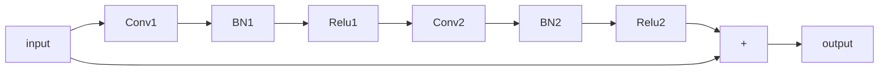

# 图像

一些可供使用的库：

1. [huggingface/pytorch-image-models: The largest collection of PyTorch image encoders / backbones. Including train, eval, inference, export scripts, and pretrained weights -- ResNet, ResNeXT, EfficientNet, NFNet, Vision Transformer (ViT), MobileNetV4, MobileNet-V3 & V2, RegNet, DPN, CSPNet, Swin Transformer, MaxViT, CoAtNet, ConvNeXt, and more](https://github.com/huggingface/pytorch-image-models)

## Resnet

Resnet 的基本模块为 Res Block，基本结构为

输入尺寸为 224 × 224。

## Res2net

将特征图（$B\times C \times H\times W$）先经过一个 1 x 1 卷积+ BN + Relu，之后在通道维度分割为 s 个特征子图（$B\times (C/S) \times H\times W$），对于 s 个通道子图进行如下处理
$$
{y_i} = \left\{ \matrix{
  {x_i}\quad i = 1 \hfill \cr 
  {K_i}({x_i})\quad i = 2 \hfill \cr 
  {K_i}({x_i} + {y_{i - 1}})\quad 2 < i \le s \hfill \cr}  \right.
$$
这里的 $K_i$​ 可以是简单的 3 × 3 卷积 + BN + Relu，也可以是分组卷积（减少计算量），最后经过一个 1 × 1 的卷积 + BN，再经过一个可选的 SE block 与输入相加连接，最后再经过一个 Relu。

## ResNeXt

将 `[256, 3×3, 256]` 卷积改为 `[256, 1×1, 128]+[128, 3×3, 128, groups=32]+[128, 1×1, 256]`

下面三种网络架构等效

## SENet

用于图像分类，在 Resnet 的基础上加入了 SE Block，SE Block 的架构如下：

注意此处的 FC 可以是二维卷积，一维卷积等。SENet 将 SE Block 加在每个小卷积块之后（整个模块可能有几十个SE Block，r=16），一些更加简单的模型将 SE Block 加在模块之后（可能整个模型中只有3、4个 SE Block），控制好r的大小，对于模型的计算量影响很小。

## VIT

将二维图片 $x\in R^{H\times W\times C}$ 重整为 $x_p\in R^{N\times(P^2\cdot C)}$，P 为一个图片块的长宽，$N=HW/P^2$​，之后添加位置编码。之后便是常规的多头自注意力和前馈层。
$$
\eqalign{
  & {z_0} = \left[ {{x_{class}};x_p^1E;x_p^2E; \cdots ;x_p^NE} \right] + {E_{pos}}\quad E \in {R^{({P^2} \cdot C) \times D}},{E_p} \in {R^{\left( {N + 1} \right) \times D}}  \cr 
  & {z_l}' = MSA(LN({z_{l - 1}})) + {z_{l - 1}}\quad l = 1...L  \cr 
  & {z_l} = MSA(LN({z_l}')) + {z_l}'\quad l = 1...L  \cr 
  & y = LN(z_L^0) \cr} 
$$

## Swin Transformer

视觉模态的信息与文本信息的差距体现在视觉信息会存在快速变化，此外图像的分辨率更高。VIT 中计算自注意力时对于整张图进行计算，Swin Transformer 在局部窗口中计算自注意力，假设每个窗口包含了 $M\times M$个图像块，窗口之间不重叠。为了加入窗口间的连接，引入了 Shifted window 多头自注意力。Shifted window 在计算时

先对图片进行不均匀的划分，再进行类似围绕中心旋转的操作，再进行均匀的分割，对每个小块计算MSA，最后再倒回来。

相比于 VIT，Swin Transformer 的适用范围更广。

## CRNN

[meijieru/crnn.pytorch: Convolutional recurrent network in pytorch](https://github.com/meijieru/crnn.pytorch)

用于OCR

CRNN 由两部分网络组成，首先是CNN，，CNN 总共有 7 层（记为 0 - 6），每一层由 Conv2d +Relu + BatchNorm（BatchNorm只在2、4，6三层有），0-1，1-2，3-4，5-6之间有 MaxPool2d。通过 Cnn 将高转为1。第二部分为两个双向LSTM层，每个双向LSTM层包括一个双向LSTM和Linear。